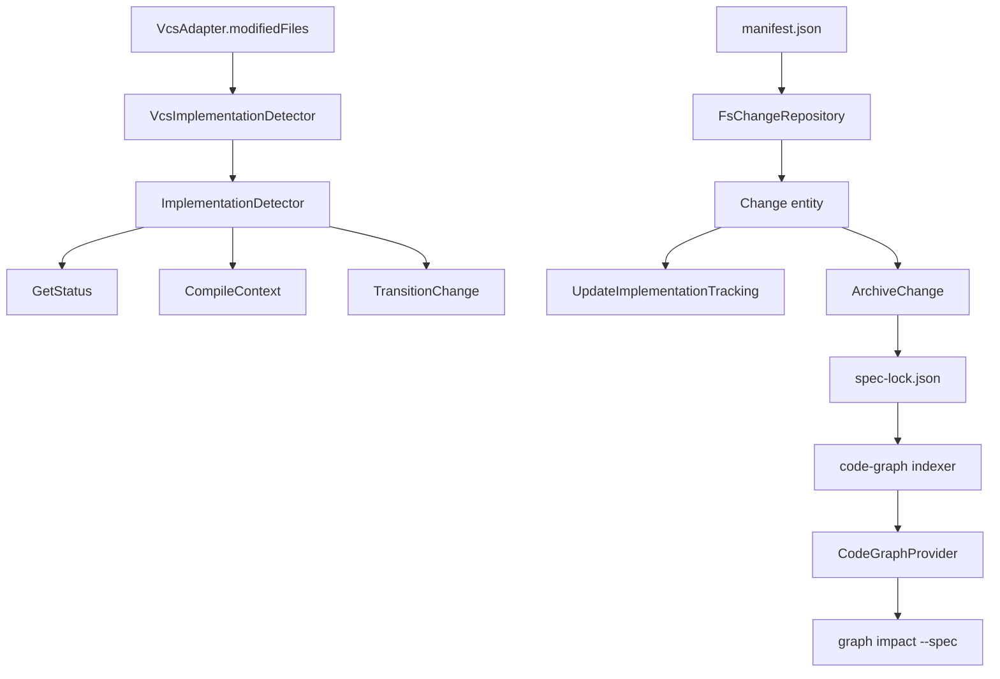

# Design: implementation-file-tracking

## Non-goals

- Requirement-level traceability. This change stops at `spec -> file` and `spec -> symbol`.
- Automatic migration or healing of broken symbol links. Archive and graph indexing only preserve, filter, and mark data; they do not rewrite source code.
- Early workspace filtering during tracking. While the change is active, raw project-relative paths are stored as-is; final filtering happens only when materializing `spec-lock.json`.

## Affected areas

- `packages/core/src/domain/entities/change.ts`
  Change: add first-class implementation tracking state and mutation methods to the `Change` entity. Expose the historical implementation detection guard — a derived signal that scans the append-only history for any `transitioned` event whose `to` field is `implementing` — so lifecycle use cases can decide when demand-driven detection is meaningful.
  Impact: CRITICAL. `Change` is a high-fanout domain entity and any manifest shape change propagates through repositories, use cases, and tests.
- `packages/core/src/infrastructure/fs/manifest.ts`
  Change: extend the persisted manifest schema with `trackedImplementationFiles` and `implementationLinks`.
  Impact: CRITICAL. This is the persistence contract for every active change.
- `packages/core/src/infrastructure/fs/change-repository.ts`
  Change: round-trip the new manifest fields into the domain entity and back. Implement explicit schema validation on `get()`: throw `SchemaMismatchError` on name mismatch, emit `Logger.warn()` on version mismatch. Refine artifact normalization logic to preserve "tracked-intent": unvalidated files (`validatedHash === null`) MUST NOT have their filenames flipped between direct (`specs/`) and delta (`deltas/`) representations solely based on workspace existence.
  Impact: CRITICAL. Repository load/save, mutation locking, and naming rules are fundamental invariants.
- `packages/core/src/application/ports/vcs-adapter.ts`
  Change: add `modifiedFiles(baseRef: string | null): Promise<readonly string[]>` and `refAt(at: string): Promise<string | null>`.
  Impact: HIGH. All VCS adapters and the composition root must adopt the new contract.
- `packages/core/src/infrastructure/git/vcs-adapter.ts`
- `packages/core/src/infrastructure/hg/vcs-adapter.ts`
- `packages/core/src/infrastructure/svn/vcs-adapter.ts`
- `packages/core/src/infrastructure/null/vcs-adapter.ts`
  Change: implement the new `modifiedFiles(...)` contract in each adapter.
  Impact: HIGH. These are the concrete backends for autodetection.
- `packages/core/src/application/ports/implementation-detector.ts`
  Change: new port that returns raw project-relative modified files for a change.
  Impact: HIGH. This becomes the application boundary used by `GetStatus`, `CompileContext`, and `TransitionChange`.
- `packages/core/src/infrastructure/vcs/vcs-implementation-detector.ts`
  Change: new VCS-backed implementation of `ImplementationDetector` that delegates to `VcsAdapter`.
  Impact: HIGH. This is the concrete bridge between application use cases and VCS adapters.
- `packages/core/src/application/use-cases/get-status.ts`
  Change: trigger autodetection, persist newly tracked files, and project implementation tracking into the result.
  Impact: CRITICAL. `change status` becomes the main operator surface for reviewing tracked files.
- `packages/core/src/application/use-cases/compile-context.ts`
  Change: trigger autodetection before composing context so agents see up-to-date tracked files and links. Constructor gains `implementationDetector: ImplementationDetector`.
  Impact: HIGH. Context compilation becomes detection-aware.
- `packages/core/src/application/use-cases/transition-change.ts`
  Change: trigger autodetection before lifecycle gating and before executing the state transition. Constructor gains `implementationDetector: ImplementationDetector`.
  Impact: HIGH. State transitions now run with the latest tracked implementation state.
- `packages/core/src/application/use-cases/archive-change.ts`
  Change: validate tracked implementation links, materialize canonical implementation data into `spec-lock.json`, and guard out-of-scope sidecar writes.
  Impact: CRITICAL. Archive is where raw tracking becomes durable spec data.
- `packages/core/src/domain/services/parse-spec-lock.ts`
- `packages/core/src/application/ports/spec-repository.ts`
- `packages/core/src/infrastructure/fs/spec-repository.ts`
  Change: extend `spec-lock.json` read/write support with implementation sections in addition to `dependsOn`.
  Impact: HIGH. This is the durable sidecar contract consumed by archive and code graph.
- `packages/core/src/composition/kernel.ts`
  Change: compose the new detector, implementation-tracking use cases, and inject them into `GetStatus`, `CompileContext`, `TransitionChange`, and CLI-facing implementation commands.
  Impact: HIGH. This is the only place that should know the concrete detector implementation.
- `packages/cli/src/index.ts`
- `packages/cli/src/commands/change/status.ts`
- `packages/cli/src/commands/change/implementation.ts`
  Change: register a new `change implementation` command group and render implementation tracking in `change status`. Validate that EVERY file exists on disk during `add`, `resolve`, and `ignore` before modifying the manifest; throw `ImplementationFileNotFoundError` if any are missing. Support comma-separated file lists in the `--file` option for `resolve` and `ignore` subcommands. The implementation section in `change status` SHALL only be rendered when the `--implementation` flag is provided. Align `change status --format json` output with the updated contract: include `hasTasks` in every `artifactDag` entry and use drift-aware projections (e.g. `complete-with-drift`) for the `state` field.
  Impact: HIGH. This is the operator and agent entry point for managing links and tracked files.
- `packages/code-graph/src/domain/value-objects/relation-type.ts`
- `packages/code-graph/src/domain/value-objects/relation.ts`
  Change: replace deferred generic `COVERS` handling with first-class `COVERS_FILE` and `COVERS_SYMBOL` relations plus `stale` metadata on symbol relations.
  Impact: HIGH. This keeps file-level and symbol-level traceability first-class in the graph.
- `packages/code-graph/src/domain/ports/graph-store.ts`
- `packages/code-graph/src/domain/services/traversal.ts`
- `packages/code-graph/src/composition/code-graph-provider.ts`
  Change: expose requirement coverage query methods and spec-level impact traversal through the abstract store and provider facade. Update `packages/code-graph/src/index.ts` to export `CodeGraphProvider` as a type only (`export type`). Ensure `createCodeGraphProvider` is the only public way to instantiate the provider, enforcing correct dependency wiring for the new relation families.
  Impact: HIGH. `graph impact --spec` depends on this abstraction being backend-agnostic and correctly initialized.
- `packages/code-graph/src/application/use-cases/index-code-graph.ts`
- `packages/code-graph/src/infrastructure/sqlite/sqlite-graph-store.ts`
- `packages/code-graph/src/infrastructure/ladybug/ladybug-graph-store.ts`
  Change: index `spec-lock.json` implementation traceability and persist `COVERS_FILE` / `COVERS_SYMBOL` consistently in both built-in backends. Extend both schemas to persist the `metadata` JSON object on relation edges so `stale` flags and other edge attributes survive reload.
  Impact: HIGH. This is the durable data path from archive sidecars into graph queries.
- `packages/cli/src/commands/graph/impact.ts`
  Change: add `--spec <id>` and render requirement-aware impact results alongside existing file/symbol impact modes. Ensure `graph impact --format json` includes mandatory aggregate fields (`riskLevel`, `directDepsCount`, `indirectDepsCount`, `transitiveDepsCount`, `affectedFilesCount`).
  Impact: HIGH. This is the primary operator-facing outcome of the graph work.
- `packages/cli/src/commands/change/archive.ts`
- `packages/cli/src/commands/change/implementation.ts`
- `packages/cli/src/commands/graph/impact.ts`
  Change: update help text, examples, and operator-facing diagnostics for the new flags and traceability flows.
  Impact: MEDIUM. CLI docs must stay aligned with the behavior being introduced.

## Data model

The old proposal model of `implementationCandidates` plus `ignoredImplementation` is replaced with two explicit collections:

1. `trackedImplementationFiles`
2. `implementationLinks`

### `trackedImplementationFiles`

Stored in `manifest.json` as raw project-relative paths:

```json
{
  "trackedImplementationFiles": [
    { "file": "packages/core/src/domain/entities/change.ts", "state": "open" },
    { "file": "docs/adr/implementation-tracking.md", "state": "resolved" },
    { "file": "apps/public-web/src/tmp.ts", "state": "ignored" }
  ]
}
```

Rules:

- `file` is required.
- `state` is required and is one of `open | resolved | ignored`.
- paths are raw project-relative paths, identical for autodetection and manual CLI input.
- a tracked file is a review surface for the change, not a durable graph identity.
- tracked files may exist even when they never materialize into `spec-lock.json`.

### `implementationLinks`

Stored separately from tracked files:

```json
{
  "implementationLinks": [
    {
      "specId": "core:change",
      "file": "packages/core/src/domain/entities/change.ts",
      "fileLinkExplicit": true
    },
    {
      "specId": "core:change",
      "file": "packages/core/src/domain/entities/change.ts",
      "fileLinkExplicit": false,
      "symbols": ["Change.transition", "Change.invalidate"]
    }
  ]
}
```

Rules:

- `specId` is required.
- `file` is required.
- `fileLinkExplicit` is required.
- `symbols` is optional.
- a link with no `symbols` is a file-level link.
- a link with `symbols` is a symbol-level refinement of the same `spec + file` pair.
- `fileLinkExplicit: false` is valid only when `symbols` exists and is non-empty.

### Link identity and mutation semantics

- The mutable unit is the `spec + file` set.
- Re-adding the same `spec + file` enriches that set; it does not create peer duplicates.
- Symbols refine an existing `spec + file` set.
- `remove --spec S --file F` deletes the full set for that spec/file pair.
- `remove --spec S --file F --symbol X` deletes only that symbol link.
- If the last symbol is removed and the file was never explicitly added as a file-level link, the `spec + file` set may disappear entirely.

This design requires the `Change` entity to expose explicit mutators instead of generic array replacement. Concretely, the entity should own methods in this shape:

- `upsertTrackedImplementationFile(file: string, state: 'open' | 'resolved' | 'ignored'): void`
- `upsertImplementationLink(input: { specId: string; file: string; fileLinkExplicit: boolean; symbols?: readonly string[] }): void`
- `removeImplementationLink(input: { specId: string; file: string; symbol?: string }): void`
- `resolveTrackedImplementationFile(file: string): void`
- `ignoreTrackedImplementationFile(file: string): void`

The exact method names can vary, but the entity must remain the place where invariants are defended.

Application use cases must apply these entity mutations through the existing `ChangeRepository.mutate(name, fn)` boundary, not through ad hoc `get()` plus `save()` sequences. That keeps locking and persisted mutation semantics aligned with the rest of the change workflow.

## Detection model

### Port contract

New port:

- file: `packages/core/src/application/ports/implementation-detector.ts`
- shape:

```ts
export interface ImplementationDetector {
  detectModifiedFiles(change: Change): Promise<readonly string[]>
}
```

Concrete implementation:

- file: `packages/core/src/infrastructure/vcs/vcs-implementation-detector.ts`
- responsibility: convert VCS-reported modified files into normalized raw project-relative paths

The detector uses `VcsAdapter.modifiedFiles(baseRef)` and `VcsAdapter.rootDir()` internally. `baseRef` is resolved by the detector, not by the calling use case, so the detection policy remains centralized.

#### Base reference resolution

The detector resolves `baseRef` using the change's history. The strategy is:

1. Ask the change for the timestamp of the first time it ever entered `implementing`.
2. If found, use the `at` timestamp of that event to resolve a VCS revision at that point in time. For git this means `git rev-list -1 --before=<ISO> HEAD`; for hg/svn an equivalent date-based revision lookup.
3. If no `transitioned → implementing` event exists, fall back to `VcsAdapter.ref()` (current HEAD/commit). This should not normally happen when the historical guard is `true`, but the fallback prevents a crash if the guard is bypassed.
4. Pass the resolved revision to `VcsAdapter.modifiedFiles(baseRef)`.

The returned files are everything that changed between that baseline and the current worktree. The detector then converts VCS-output paths to raw project-relative paths by stripping the `VcsAdapter.rootDir()` prefix and normalizing separators to forward slashes.

The `Change` entity is not involved in base-ref resolution. The detector reads history from the `Change` object it receives but the resolution logic lives inside the detector implementation.

### VCS adapter extension

`packages/core/src/application/ports/vcs-adapter.ts` gains:

```ts
modifiedFiles(baseRef: string | null): Promise<readonly string[]>
refAt(at: string): Promise<string | null>
```

Adapter expectations:

- Git, Hg, and SVN return repository-relative or absolute data normalized to project-relative paths by the detector.
- Git, Hg, and SVN resolve `refAt(at)` to the most recent revision at or before the supplied ISO timestamp.
- `NullVcsAdapter` returns an empty list instead of throwing.
- `NullVcsAdapter.refAt(at)` returns `null`.
- the port remains VCS-focused; it does not know about specs, workspaces, or tracked-file state.

### Historical implementation detection guard

Autodetection should only run when the change has historically entered `implementing`. Before that point, no implementation files exist to detect.

#### Derivation

The `Change` entity should expose a derived method that can be reused by both the guard and the detector baseline logic:

```ts
getHistoricalImplementationAt(): Date | null
```

Implementation: scan the append-only `history` array in forward order for the first event where `type === 'transitioned'` and `to === 'implementing'`. Return that event's `at` timestamp; return `null` if no such event exists.

This is intentionally a linear scan over history, not a persisted flag. The number of history events per change is bounded by the lifecycle (a single change rarely exceeds a few dozen transitions), so the scan cost is negligible. A persisted flag would introduce a second source of truth that could drift from the actual history.

Callers that only need a boolean guard can treat `getHistoricalImplementationAt() !== null` as the historical-implementation signal.

#### Guard pattern in use cases

Each autodetection trigger point follows the same pattern:

```ts
const implementingSince = change.getHistoricalImplementationAt()

if (implementingSince) {
  const detected = await detector.detectModifiedFiles(change)
  // ... upsert tracked files
}
```

When `getHistoricalImplementationAt()` returns `null`:

- no detector invocation occurs
- no tracked-file upserts
- no debug logging about detection counts
- the use case proceeds as if detection ran and found zero new files

This keeps the pre-implementation path identical to the post-implementation path — the guard is purely a performance and noise skip, not a behavioral fork.

#### Interaction with lifecycle transitions

The guard becomes `true` the moment the change transitions to `implementing`. It remains `true` forever after, even if the change returns to `designing`, `verifying`, or any other state. This matches the spec requirement: "the system SHALL derive this signal by scanning the append-only history for any `transitioned` event whose `to` field is `implementing`."

### Trigger points

Autodetection is demand-driven. It runs in three places only, and only when `getHistoricalImplementationAt()` returns a non-null timestamp:

1. `GetStatus.execute(...)`
2. `CompileContext.execute(...)`
3. `TransitionChange.execute(...)`, before requires/task-completion gating and before hooks/transition persistence

The flow is:

1. call `ChangeRepository.mutate(...)`
2. load the fresh persisted change inside the mutation
3. call detector
4. upsert every detected raw file into `trackedImplementationFiles`
5. preserve any existing `resolved` or `ignored` states for already tracked files
6. persist automatically through the repository mutation if detection added any new tracked files
7. continue with the use case using the updated change snapshot

This keeps autodetection idempotent and monotonic:

- it can add new tracked files
- it does not remove tracked files
- it does not rewrite links
- it does not apply workspace filtering early

### Stale symbol detection — CLI-layer concern

Staleness detection (checking whether a symbol in an implementation link still exists in the graph database) requires access to the code graph. Because `@specd/core` cannot depend on `@specd/code-graph`, staleness is not a core use-case responsibility.

The architecture is:

1. **Core use cases** (`GetStatus`, `get-implementation-review`) return raw implementation-tracking data — tracked files, confirmed links with their symbols — without staleness information.
2. **CLI commands** (`change status`, `change implementation list`, `change implementation review`) receive the core result, then independently query the code graph to enrich the output with staleness diagnostics.
3. The CLI checks whether the graph is indexed before querying. If not indexed, staleness is skipped and a hint suggests running `graph index`. If indexed but stale, staleness results are best-effort with a warning.

This means:

- `GetStatus` and `get-implementation-review` constructors do NOT gain a graph-store dependency.
- `change status` CLI command calls `GetStatus`, then calls `CodeGraphProvider` to check symbol existence for each symbol-level link.
- `change implementation review` CLI command calls `get-implementation-review`, then enriches with graph staleness, unresolved-file checks, and out-of-scope previews.
- Staleness is never persisted in the manifest — it is a point-in-time CLI diagnostic.

### New core use cases

To keep CLI logic thin, add core use cases instead of mutating the repository directly from the command layer:

- `packages/core/src/application/use-cases/update-implementation-tracking.ts`
  Responsibility: handle `add`, `remove`, `ignore`, and `resolve`.
- `packages/core/src/application/use-cases/get-implementation-review.ts`
  Responsibility: project tracked files and links into a review-friendly shape for CLI output.

`update-implementation-tracking.ts` should accept an operation union like:

```ts
type UpdateImplementationTrackingInput =
  | { name: string; action: 'add'; specId: string; file: string; symbol?: string }
  | { name: string; action: 'remove'; specId: string; file: string; symbol?: string }
  | { name: string; action: 'ignore'; file: string }
  | { name: string; action: 'resolve'; file: string }
```

Behavior:

- `add`
  - ensures the file exists in `trackedImplementationFiles`
  - creates or enriches the `spec + file` set
  - leaves the tracked file state unchanged unless the file is new, in which case it starts as `open`
- `remove`
  - removes one symbol or one full `spec + file` set
- `ignore`
  - changes tracked file state to `ignored`
  - must fail if any implementation links still point to that file
- `resolve`
  - changes tracked file state to `resolved`
  - does not modify links

All of these operations should execute inside one `ChangeRepository.mutate(...)` call so validation, invariant checks, and persistence remain atomic at the change level.

### Debug logging

Implementation tracking actions should emit `Logger.debug(...)` events at the application boundary. This matters because autodetection is demand-driven and because several use cases can persist new tracked files as a side effect.

Add debug logs for:

- autodetection start and end
- detected raw file count and newly tracked file count
- `add`, `remove`, `ignore`, and `resolve` operations
- archive materialization counts:
  - total raw links
  - filtered by `graph.excludePaths`
  - rejected for falling outside the spec workspace `codeRoot`
  - materialized file links
  - materialized symbol links
- out-of-scope sidecar guard decisions
- stale symbol-link counts emitted to the graph pipeline

Log payloads should include the change name plus the relevant spec IDs and file paths where applicable. These are debug diagnostics only; they do not change public result shapes.

### CLI command layout

Add `packages/cli/src/commands/change/implementation.ts`, registered from `packages/cli/src/index.ts`, with this command group:

- `change implementation list <name>`
- `change implementation add <name> --spec <specId> --file <path> [--symbol <symbol>]`
- `change implementation remove <name> --spec <specId> --file <path> [--symbol <symbol>]`
- `change implementation ignore <name> --file <path>`
- `change implementation resolve <name> --file <path>`
- `change implementation review <name>`

`change status` should gain a new section that projects:

- tracked files grouped by `open | resolved | ignored`
- links grouped by spec
- stale symbol-link warnings (enriched by CLI via code-graph query, not from core result)

The raw implementation-tracking projection belongs in `GetStatusResult`. The CLI formats that projection and may enrich it with stale diagnostics and graph-state hints.

### `GetStatusResult` additions

`GetStatusResult` gains an `implementationTracking` field:

```ts
interface ImplementationTrackingProjection {
  trackedFiles: readonly {
    file: string
    state: 'open' | 'resolved' | 'ignored'
  }[]
  links: readonly {
    specId: string
    file: string
    fileLinkExplicit: boolean
    symbols?: readonly string[]
  }[]
}
```

When `getHistoricalImplementationAt()` returns `null`, `implementationTracking` is still present but all arrays are empty — the projection surface exists regardless of detection state.

`GetStatus` constructor gains `implementationDetector: ImplementationDetector`. It does NOT gain a graph-store dependency. Staleness enrichment happens at the CLI layer.

### Stale enrichment at the CLI layer

`change status` and `change implementation list/review` enrich core results with stale diagnostics:

1. Receive `ImplementationTrackingProjection` from the core use case.
2. Extract all symbol names from links where `symbols` is non-empty.
3. Query `CodeGraphProvider` for each symbol's existence.
4. Merge stale diagnostics into the CLI output.

Graph state handling:

- **Not indexed**: skip staleness, print `"Run 'graph index' for stale symbol diagnostics"`.
- **Indexed but stale**: run best-effort, print `"Staleness based on stale index — run 'graph index' for accurate results"`.
- **Fresh**: authoritative results.

The CLI commands are the right place for this orchestration because they already have access to both `@specd/core` (via the kernel) and `@specd/code-graph` (via the provider).

### Composed symbol fallback at the CLI layer

The current graph index does not always expose stable composed member identities such as `Type.method` or `Namespace::function`, even when the underlying member symbol exists. To reduce false-positive stale diagnostics without changing durable link storage, CLI stale enrichment applies a same-file fallback for composed symbol names.

Fallback rules:

1. Attempt exact symbol resolution first using the stored `implementationLinks.symbols` string.
2. If exact resolution fails and the stored symbol contains one of these separators, retry with the rightmost segment:
   - `.`
   - `#`
   - `::`
3. The fallback is restricted to symbols indexed from the same file as the implementation link.
4. If the graph reports symbol kind metadata, the CLI should preserve that metadata in the match candidate set so member-vs-type collisions remain visible.
5. If fallback yields exactly one same-file match, the link is treated as non-stale for CLI output only.
6. If fallback yields zero or multiple same-file matches, the stored symbol remains stale.

This fallback is intentionally narrow:

- it does not rewrite `implementationLinks.symbols`
- it does not mutate change state
- it does not mutate archived `spec-lock.json`
- it does not alter graph storage

The fallback is a display-time repair heuristic for `change status`, `change implementation list`, and `change implementation review` until the graph exposes richer member identities.

### `review` subcommand behavior

`change implementation review <name>` runs an integrity check and returns a structured report. This is a CLI-orchestrated command that combines core data with code-graph queries:

1. **Core data** — call `get-implementation-review` to get tracked files and confirmed links.
2. **Stale symbol links** — query the code graph for each symbol in each symbol-level link. Report symbols absent from the graph database after exact-match lookup and any eligible composed-symbol fallback.
3. **Unresolved tracked files** — list tracked files still in `open` state.
4. **Out-of-scope sidecar preview** — for each implementation link, check whether materialization would require updating a `spec-lock.json` outside the change's `specIds`. This is a preview of the out-of-scope guard without actually writing anything.

The CLI combines the core result with graph diagnostics. No mutation occurs — review is read-only.

### `ignore` validation failure

When `ignore` is called on a file that still has active implementation links, the operation fails with a structured error:

- Error code: `IMPLEMENTATION_LINKS_EXIST`
- Message: `"Cannot ignore '<file>' because it still has confirmed implementation links. Remove links first with 'change implementation remove'."`
- The error includes the list of `specId` values that still have links to that file.

This prevents accidental loss of confirmed traceability. The operator must explicitly remove links before ignoring a tracked file.

## Archive and materialization

### Raw-to-canonical conversion boundary

Active changes keep raw project-relative paths. Canonical identities are produced only during archive.

Materialization rules for one `implementationLink`:

1. read `specId`
2. resolve the workspace implied by `specId`
3. verify that `file` falls under that workspace `codeRoot`
4. if it does not, archive fails
5. if it falls under `workspace.graph.excludePaths`, ignore it for `spec-lock` materialization
6. otherwise normalize to `workspace:path-relative-to-codeRoot`

Consequences:

- docs or other non-workspace files may remain tracked during the active change
- those files never become durable implementation entries in `spec-lock.json`
- `graph.excludePaths` is a final filter, not a validation error

### `spec-lock.json` shape

`packages/core/src/domain/services/parse-spec-lock.ts` currently parses only `schema` and `dependsOn`. Extend it with implementation sections while preserving the existing `dependsOn` behavior.

Recommended durable shape:

```json
{
  "schema": { "name": "specd", "version": 1 },
  "dependsOn": ["core:spec-lock"],
  "implementation": {
    "files": [{ "specId": "core:change", "file": "core:src/domain/entities/change.ts" }],
    "symbols": [
      {
        "specId": "core:change",
        "file": "core:src/domain/entities/change.ts",
        "symbol": "Change.transition"
      }
    ]
  }
}
```

This keeps file-level and symbol-level links explicit in the durable sidecar instead of collapsing symbol links into optional arrays again.

#### Manifest-to-sidecar transformation

The active change stores `implementationLinks` as flat entries with `specId` per link. The sidecar stores `implementation` entries scoped to a single spec (because the sidecar lives in that spec's directory). The transformation during archive is:

1. Group all `implementationLinks` by `specId`.
2. For each spec's group, split into file-level links (no `symbols`) and symbol-level links (has `symbols`).
3. File-level links become `{ file: "workspace:path" }` entries.
4. Symbol-level links become `{ file: "workspace:path", symbols: ["Sym.name", ...] }` entries.
5. Both arrays live under `implementation` in that spec's `spec-lock.json`.

The `specId` field is not stored in the sidecar entries because the sidecar is already scoped to one spec.

#### Merge semantics on re-archive

When a spec's `spec-lock.json` already has `implementation` entries from a previous archive:

- **File-level links**: the archive replaces the entire `implementation` array for that spec. It does not append or union — the current change's links are the authoritative set for this archive.
- **Symbol-level links**: same replacement semantics. If the previous archive had symbol `Change.foo` and the current change only links `Change.bar`, the archived result contains only `Change.bar`.
- **Previous `dependsOn`**: follows the existing spec-lock rule — replaced from `change.specDependsOn` for that spec, not unioned.

This is a full replacement per spec per archive, consistent with how `dependsOn` already works.

### Archive planning

`ArchiveChange` should add an implementation-tracking planning stage before the existing publication stage:

1. collect all `implementationLinks` from the change
2. validate `specId -> workspace -> codeRoot` consistency
3. drop links filtered by `graph.excludePaths`
4. group remaining canonical links by target spec
5. load the existing `spec-lock.json` for every affected spec
6. merge the new implementation data with existing `dependsOn` and implementation entries
7. detect whether any sidecar write targets a spec outside `change.specIds`
8. if yes and `--allow-out-of-scope` is absent, fail before any permanent write

This should be implemented as an in-memory plan alongside the existing `PreparedArchivePlan`, not as ad hoc writes during the publication loop.

### Out-of-scope guard

Global integrity maintenance is still supported, but it must be explicit.

Archive behavior:

- default: fail when sidecar maintenance would update a spec outside the change scope
- override: allow only when the operator passes `--allow-out-of-scope`

This guard belongs in `ArchiveChangeInput` and should fail before any write to keep archive behavior atomic and predictable.

### Metadata projection

`metadata.json` remains a derived projection for fast consumption. After implementation data is materialized into `spec-lock.json` during archive, the metadata extraction pipeline must also project implementation links into `metadata.json` so consumers that do not read sidecars directly can still discover which files and symbols implement a spec.

The extraction rules to add:

- `metadata.json.implementation.files` — list of `{ specId, file }` entries from the archived sidecar
- `metadata.json.implementation.symbols` — list of `{ specId, file, symbol }` entries from the archived sidecar

These fields are derived from `spec-lock.json`, not from the change manifest. They are generated during the existing archive metadata generation step, after canonical publication succeeds. No separate metadata write pass is needed — the extraction rules plug into the existing `extractMetadata` pipeline.

Affected files:

- `packages/core/src/domain/services/extract-metadata.ts` (or equivalent extraction pipeline) — add implementation extraction rules
- `packages/core/src/infrastructure/fs/spec-repository.ts` — ensure sidecar implementation data is available to the extraction context

## Code graph integration

### Durable graph source

`spec-lock.json` is the source of truth for implementation traceability, not `metadata.json`.

The graph side should read the durable file-level and symbol-level implementation entries and emit dedicated edges:

- `COVERS_FILE` for `Spec -> File`
- `COVERS_SYMBOL` for `Spec -> Symbol`

Concrete touch points:

- `packages/code-graph/src/domain/value-objects/relation-type.ts`
- `packages/code-graph/src/domain/value-objects/relation.ts`
- `packages/code-graph/src/domain/ports/graph-store.ts`
- `packages/code-graph/src/domain/services/traversal.ts`
- `packages/code-graph/src/composition/code-graph-provider.ts`
- `packages/code-graph/src/application/use-cases/index-code-graph.ts`
- `packages/code-graph/src/infrastructure/sqlite/sqlite-graph-store.ts`
- `packages/code-graph/src/infrastructure/ladybug/ladybug-graph-store.ts`
- `packages/cli/src/commands/graph/impact.ts`

Symbol-link metadata should include:

- `specId`
- `file`
- `stale: boolean`

`stale` means exactly one thing in this change: the symbol named by a durable symbol link no longer exists in the graph database. It does not mean “outside workspace”, “filtered by exclude path”, or “archive could not materialize”.

File-level links remain useful for graph impact because the graph already reasons about files, even when no symbol is attached.

### Store and traversal surface

The graph-store abstraction is sufficient for persistence today, but it needs first-class coverage queries so traversal and CLI code do not depend on backend internals. Add methods in this shape:

- `getCoveredFiles(specId: string): Promise<readonly Relation[]>`
- `getCoveringSpecsForFile(filePath: string): Promise<readonly Relation[]>`
- `getCoveredSymbols(specId: string): Promise<readonly Relation[]>`
- `getCoveringSpecsForSymbol(symbolId: string): Promise<readonly Relation[]>`

Traversal then adds:

- `analyzeSpecImpact(store, specId, direction, maxDepth?)`

Semantics:

- upstream spec impact walks incoming `DEPENDS_ON`
- downstream spec impact projects:
  - dependent specs via outgoing `DEPENDS_ON`
  - covered files via `COVERS_FILE`
  - covered symbols via `COVERS_SYMBOL`

The provider facade should expose the same query and traversal surface so `cli:graph-impact` stays thin.

### Backend parity

Both built-in backends must persist the same logical relation families:

- `COVERS_FILE`
- `COVERS_SYMBOL`

And both must preserve relation metadata for stale symbol links. This is not optional backend polish; it is part of the functional contract because `graph impact --spec` must behave the same regardless of whether the project uses SQLite or Ladybug.

### CLI requirement impact

`graph impact` currently thinks in file and symbol selectors. Extend it with a mutually exclusive `--spec <id>` selector.

Expected behavior:

- `--spec` runs requirement-aware traversal
- downstream mode reports covered files and covered symbols plus dependent specs
- upstream mode reports impacted specs through `DEPENDS_ON`
- text and JSON output include requirement-oriented sections without dropping existing file/symbol modes

This work is intentionally additive: file and symbol impact flows remain unchanged except for selector exclusivity messaging and shared output helpers.

## Dependency map



## Testing

### Automated tests

- `packages/core/test/domain/entities/change.spec.ts`
  - tracked-file state invariants
  - file-level and symbol-level link upsert/remove behavior
  - `fileLinkExplicit` invariants
  - historical implementation detection guard returns `true` after `implementing` and remains `true` after returning to `designing`
- `packages/core/test/infrastructure/fs/change-repository.spec.ts`
  - manifest round-trip for `trackedImplementationFiles` and `implementationLinks`
- `packages/core/test/infrastructure/git/vcs-adapter.spec.ts`
- `packages/core/test/infrastructure/hg/vcs-adapter.spec.ts`
- `packages/core/test/infrastructure/svn/vcs-adapter.spec.ts`
  - `modifiedFiles(...)` contract
- `packages/core/test/infrastructure/vcs/vcs-implementation-detector.spec.ts`
  - detector normalization to raw project-relative paths
- `packages/core/test/application/use-cases/get-status.spec.ts`
  - autodetection adds tracked files
  - status projection renders tracked files and links
- `packages/core/test/application/use-cases/compile-context.spec.ts`
  - autodetection runs before context compilation
- `packages/core/test/application/use-cases/transition-change.spec.ts`
  - autodetection runs before transition gating
- `packages/core/test/application/use-cases/archive-change.spec.ts`
  - out-of-codeRoot link fails archive
  - `graph.excludePaths` entries are ignored during materialization
  - out-of-scope sidecar writes require `--allow-out-of-scope`
  - `spec-lock.json` merge preserves `dependsOn` while adding implementation sections
- `packages/code-graph/test/...`
  - file-level edges are indexed from `spec-lock.json`
  - symbol-level edges are indexed from `spec-lock.json`
  - stale symbol links are marked when the target symbol disappears
  - `graph impact --spec` traverses `DEPENDS_ON`, `COVERS_FILE`, and `COVERS_SYMBOL`
  - SQLite and Ladybug return equivalent coverage query results
- `packages/cli/test/...`
  - `change status` enriches raw links with stale diagnostics only at the CLI layer
  - `change implementation list/review` add graph-state hints when stale diagnostics are unavailable

### Manual verification

1. Create or continue a change and move it to `implementing`.
2. Modify a code file and a docs file.
3. Run `change status` and confirm both appear under tracked implementation files.
4. Add one file-level link and one symbol-level link with `change implementation add`.
5. Run `change implementation resolve` on the reviewed file and confirm it remains tracked but changes state.
6. Archive the change and confirm:
   - only links under the spec workspace `codeRoot` are materialized
   - links under `graph.excludePaths` are omitted without failing
   - invalid out-of-workspace links fail archive
7. Re-index the graph and confirm file-level and symbol-level edges exist and stale applies only to missing symbols.

## Docs impact

This change does require operator-facing documentation updates, even if it does not need a long-form ADR.

At minimum, update:

- CLI help and examples for `change implementation`
- CLI help and examples for `change status`
- CLI help and examples for `change archive --allow-out-of-scope`
- CLI help and examples for `graph impact --spec`

If there is maintained user documentation covering graph impact or implementation tracking workflows, it should be refreshed in the same implementation wave so the shipped commands and docs do not diverge.
