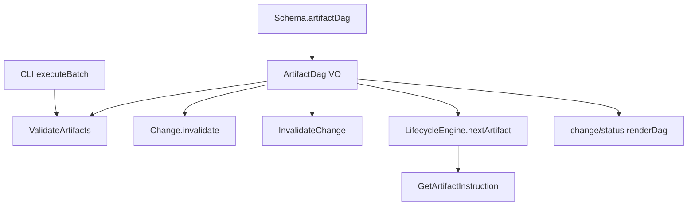

# Design: fix-validate-all-dag

## Non-goals

- Changing `build-schema` / `detectCycle` at schema load (v1 keeps load-time acyclic check only).
- Rewiring `compile-context`, `archive-change`, or `depends-on-traversal` — they iterate artifacts for content, not DAG shape.
- Exposing `ArtifactDag` on `schema show` output (declaration order remains fine for human listing).
- Fixing unrelated overlap noise from archived `implementation-file-tracking` (specs `core:change` / `cli:change-status` deltas in this change must merge cleanly with workspace specs already updated by that archive).

## Affected areas

### `packages/core/src/domain/value-objects/schema.ts`

**Change:** Add lazy-cached `artifactDag(): ArtifactDag` on `Schema`.

**Impact:** CRITICAL fan-in — `Schema` is consumed across core, CLI, and skills. New method is additive; no breaking changes to existing methods.

### `packages/core/src/domain/value-objects/artifact-dag.ts` (new)

**Change:** New immutable value object implementing `roots()`, `childrenOf(id)`, `topologicalOrder()`, `descendantsOf(ids)` from `artifacts[].requires` with stable tie-break using schema declaration order.

**Impact:** LOW — only imported by `Schema` and tests.

### `packages/core/src/domain/entities/change.ts`

**Change:** Extend `invalidate()` to require `artifactDag: ArtifactDag`; remove `_findDagDescendants` private BFS; `downstream` policy uses `artifactDag.descendantsOf()` on normalized target artifact types.

**Callers:** `ValidateArtifacts`, `TransitionChange`, `InvalidateChange`, overlap/drift paths — all must pass `schema.artifactDag()`.

**Impact:** HIGH — signature change on entity method; update every `change.invalidate(` call site in core and tests.

### `packages/core/src/application/use-cases/validate-artifacts.ts`

**Change:**

- Iterate artifacts in `schema.artifactDag().topologicalOrder()` when validating multiple artifacts in one `execute`.
- Rebuild lifecycle interpretation after each successful `markComplete` within the same `execute` (no frozen snapshot at start).
- Skip files whose canonical status is `complete` or `skipped` (no re-read, no re-`markComplete`).

**Impact:** HIGH — fixes root batch bug; touches approval drift path only for files actually validated.

### `packages/cli/src/commands/change/validate.ts` — `executeBatch`

**Change:** Replace per-`specId` full `ValidateArtifacts` loop with DAG driver:

1. `topologicalOrder()` over artifact types.
2. `scope: change` → one `validate.execute` per type.
3. `scope: spec` → one execute per `(artifactType, specId)`.
4. `--artifact` filters steps but keeps topo walk.
5. Aggregate JSON results with `{ spec, artifact, passed, failures, warnings }`.

**Impact:** MEDIUM — CLI-only orchestration; update `change-validate.spec.ts`.

### `packages/core/src/application/use-cases/invalidate-change.ts`

**Change:** Remove `orderArtifactsByTraversal` local graph; pass `schema.artifactDag()` into `Change.invalidate()`; order reported affected types via `topologicalOrder()`.

**Impact:** MEDIUM.

### `packages/core/src/domain/services/lifecycle-engine.ts` — `_nextArtifact`

**Change:** Scan `schema.artifactDag().topologicalOrder()` instead of `schema.artifacts()` declaration order.

**Impact:** MEDIUM — affects `GetStatus`, `GetArtifactInstruction`, skills reading `next artifact`.

### `packages/cli/src/commands/change/status.ts`

**Change:** `renderDag` and JSON `schema.artifactDag[].children` use `dag.roots()` / `dag.childrenOf(id)`; emit entries in `topologicalOrder()`.

**Impact:** MEDIUM — update `change-status.spec.ts` tree fixtures.

### `packages/core/src/application/use-cases/get-artifact-instruction.ts`

**Change:** None local — already delegates auto-selection to `LifecycleEngine`; verify tests assert topological behaviour.

### Kernel composition / exports

**Change:** Export `ArtifactDag` from core public surface if tests or CLI need it (prefer keeping CLI dependent on `Schema` only).

**Exclude (explicit):** `build-schema.ts` workflow `requires.includes` checks (step vs artifact ID, not DAG children).

## New constructs

### `ArtifactDag`

**Location:** `packages/core/src/domain/value-objects/artifact-dag.ts`

**Shape:**

```ts
export class ArtifactDag {
  constructor(artifacts: readonly ArtifactType[])

  roots(): readonly string[]
  childrenOf(id: string): readonly string[]
  topologicalOrder(): readonly string[]
  descendantsOf(ids: readonly string[]): readonly string[]
}
```

**Responsibility:** Pure schema-derived DAG queries. No I/O, no change state.

**Relationships:** Built once inside `Schema.artifactDag()`; passed into `Change.invalidate()` for policy expansion.

### `Schema.artifactDag()`

**Location:** `packages/core/src/domain/value-objects/schema.ts`

```ts
artifactDag(): ArtifactDag {
  if (!this._artifactDag) this._artifactDag = ArtifactDag.from(this._artifacts)
  return this._artifactDag
}
```

## Approach

### Phase 1 — Canonical DAG (core domain)

1. Implement `ArtifactDag.from(artifacts)` building inverse `requires` adjacency and memoizing topo sort / descendants.
2. Add unit tests in `packages/core/test/domain/value-objects/artifact-dag.spec.ts` (roots, children, topo, descendants, stable order).
3. Wire `Schema.artifactDag()` with cache field.

### Phase 2 — Consumers (ordered to reduce breakage)

1. **`Change.invalidate`** — add required `artifactDag` param; migrate callers; delete `_findDagDescendants`.
2. **`InvalidateChange`** — pass dag; fix reporting order.
3. **`LifecycleEngine._nextArtifact`** — topo scan.
4. **`ValidateArtifacts`** — topo iteration, per-step lifecycle refresh, complete/skipped skip.
5. **`change/validate.ts` `executeBatch`** — DAG driver + output shape.
6. **`change/status.ts`** — DAG render + JSON `children`.

### Phase 3 — Docs and CLI reference

Update `docs/cli/cli-reference.md` for `changes validate --all` DAG semantics, JSON result shape, and `--all --artifact` behaviour (tracked in tasks, not design-only).

## Key decisions

**Decision: `Schema.artifactDag()` single entry point** → Matches `artifact()`, avoids duplicate adjacency in five sites; user requirement.

**Alternatives rejected:** Separate `domain/services/artifact-dag.ts` (thin wrapper); hardcoded std order (breaks custom schemas).

**Decision: Pass `ArtifactDag` into `Change.invalidate`** → Entity stays free of `SchemaProvider`; use case already resolves schema.

**Alternatives rejected:** Entity re-deriving edges from persisted manifest `requires` (drifts from active schema).

**Decision: Skip only `complete` and `skipped` files** → Re-validation under active approval triggers `artifact-drift` + `downstream` invalidation.

**Decision: Refresh lifecycle between DAG steps in one `execute`** → Fixes false dependency-blocked failures when parent completes mid-pass.

**Decision: Batch JSON includes `artifact` + nullable `spec`** → Reflects scheduled steps, not legacy per-spec full pass.

## Trade-offs

**[Risk] `Change.invalidate` signature change breaks external callers** → Mitigation: monorepo-wide grep; only core use cases call it today.

**[Risk] Overlap with archived `implementation-file-tracking` on `core:change` / `cli:change-status`** → Mitigation: rebase deltas against current workspace specs before implement; run `changes validate --all` on this change after merge.

**[Risk] Skipping `complete` files hides drift when approval inactive** → Mitigation: drift still detected on next single-artifact validate or when file leaves `complete`; batch path optimizes common “finish design” flow.

## Spec impact

### `core:schema-format`

- **Dependents:** `core:validate-artifacts`, `core:change`, `core:lifecycle-engine`, `cli:change-validate`, `cli:change-status`, `core:invalidate-change`, `core:get-artifact-instruction` — all updated in this change.

### `core:change`

- **Overlap:** Archived `implementation-file-tracking` already extended entity; this change only touches `invalidate` DAG expansion — implementer must apply delta on top of current `specs/core/change/spec.md`.

### `cli:change-status`

- **Overlap:** Same as above for status DAG display — merge delta, do not revert implementation-tracking sections.

## Dependency map



```
┌──────────────────┐
│ Schema           │
│ .artifactDag()   │
└────────┬─────────┘
         │
         ▼
┌──────────────────┐     ┌─────────────────────┐
│ ArtifactDag      │────▶│ ValidateArtifacts   │
│ roots/children/  │     │ topo + skip complete│
│ topo/descendants │     └──────────┬──────────┘
└────────┬─────────┘                │
         │                          ▼
         ├──────────────────▶┌─────────────────┐
         │                   │ CLI validate    │
         │                   │ --all driver    │
         │                   └─────────────────┘
         │
         ├──────────────────▶ Change.invalidate (downstream)
         │
         ├──────────────────▶ LifecycleEngine → GetArtifactInstruction
         │
         └──────────────────▶ change status JSON/text DAG
```

## Testing

### Automated

| File                                                                              | Coverage                                              |
| --------------------------------------------------------------------------------- | ----------------------------------------------------- |
| `packages/core/test/domain/value-objects/artifact-dag.spec.ts`                    | New — topo, children, descendants, stable order       |
| `packages/core/test/domain/value-objects/schema.spec.ts` or existing schema tests | `artifactDag()` cache                                 |
| `packages/core/test/domain/entities/change.spec.ts`                               | Downstream invalidation via supplied dag              |
| `packages/core/test/application/use-cases/invalidate-change.spec.ts`              | Reporting order                                       |
| `packages/core/test/domain/services/lifecycle-engine.spec.ts`                     | Next artifact topo                                    |
| `packages/core/test/application/use-cases/validate-artifacts.spec.ts`             | Topo pass, skip complete, mid-pass dependency refresh |
| `packages/cli/test/commands/change-validate.spec.ts`                              | `--all` DAG steps, `--all --artifact`, JSON shape     |
| `packages/cli/test/commands/change-status.spec.ts`                                | JSON `children`, text DAG order                       |

Map every verify scenario in the eight spec deltas to at least one test row above.

### Manual / E2E

1. On `fix-validate-all-dag` with partial specs complete:
   - `node packages/cli/dist/index.js changes validate fix-validate-all-dag --all --format text`
   - Expect parents validated before children; no spurious `design` blocked on first spec only.
2. With `proposal` complete and active spec approval:
   - Run `--all` twice — second run must not drift-invalidate `proposal` (complete skip).
3. `node packages/cli/dist/index.js changes status fix-validate-all-dag --format json` — `children` matches schema DAG, not declaration-order guess.

### Documentation

- `docs/cli/cli-reference.md` — document `--all` DAG walk and JSON `results[]` fields (implementation task).

## Compliance remediation (reports/20260522-193804)

Post-verify pass to close **PARTIAL** compliance. Does not change the original DAG architecture; tightens call sites and CLI contract.

### `packages/core/src/application/use-cases/edit-change.ts` (SF-1)

- Inject `SchemaProvider` (same pattern as `TransitionChange` / `InvalidateChange`).
- On `updateSpecIds`, pass `(await schemaProvider.get()).artifactDag()` — remove `artifactDagFromChangeArtifacts` from production path.
- Wire in `kernel.ts` / `createEditChange` composition.

### `packages/core/src/application/use-cases/validate-artifacts.ts` (VA-1)

- `ValidateArtifactsInput.specPath?: string` — required when validating `scope: spec`; omitted for `scope: change`.
- Guard: skip `change.specIds.includes(specPath)` when `specPath` is undefined and artifact is change-scoped.
- File routing for change-scoped uses artifact type id as file key (existing behaviour).

### `packages/cli/src/commands/change/validate.ts` (CLI-V1, CLI-V2)

- `executeBatch`: for `scope: change`, call `validate.execute({ name, artifactId })` without `specPath`.
- Batch JSON: emit `warnings` per step (map from use-case notes or empty array).

### `packages/cli/src/commands/change/status.ts` (CLI-S1, CLI-S2, UX)

- `renderDag`: use `displayStatus` for symbols; extend `stateSymbols` with `complete-with-drift`.
- Track `visited: Set<string>` in `drawNode` — skip expanding children already drawn.
- JSON nested `artifactDag`: `hasTasks: a.hasTasks || a.taskCompletionCheck != null`.
- Prefer passing `schema.artifactDag()` from resolved schema in kernel path when available (SF-2).

### Tests (VA-2, SF-2)

| Area                | Test                                                                                          |
| ------------------- | --------------------------------------------------------------------------------------------- |
| Validate topo order | Spy/log artifact validation order vs `dag.topologicalOrder()` in one multi-artifact `execute` |
| EditChange          | Mock schema DAG; assert `updateSpecIds` receives `schema.artifactDag()`                       |
| Batch validate      | Mock records inputs — change-scoped step has no `specPath`                                    |
| Status text DAG     | Drift display + single `design` node under schema-std fixture                                 |

## Open questions

_none — resolved in proposal._
