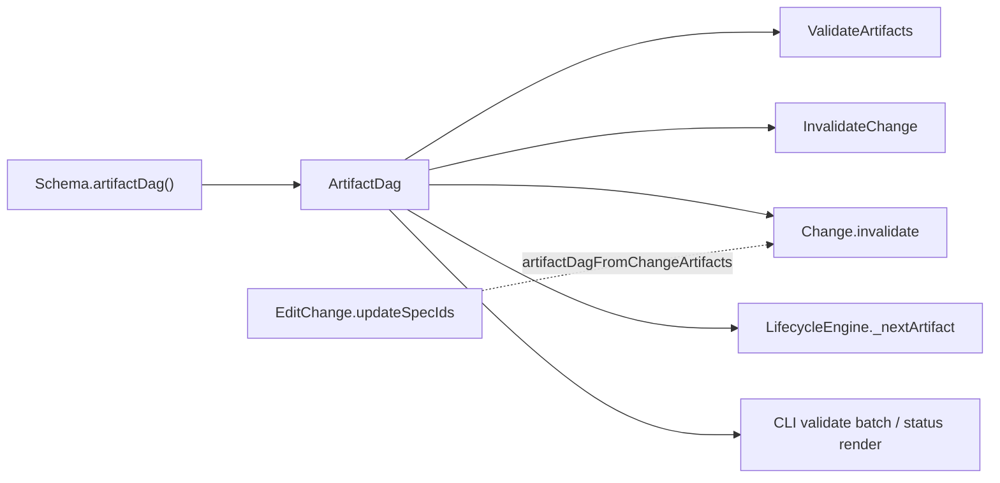

# Spec Compliance Audit — `fix-validate-all-dag` (core partial)

**Change:** `20260521-094729-fix-validate-all-dag`  
**Report:** `reports/20260522-193804/_partial-core.md`  
**Method:** Merged spec preview (`changes spec-preview fix-validate-all-dag <specId>`), graph search/impact, implementation + test review in `packages/core/`  
**Scope:** Six core specs tied to artifact DAG canonicalization and batch validation ordering.

---

## Executive summary

| Spec                                          | Checked | Implemented | Partial | Missing | Discrepancies |
| --------------------------------------------- | ------- | ----------- | ------- | ------- | ------------- |
| `core:schema-format` (DAG reqs)               | 8       | 7           | 1       | 0       | 1             |
| `core:validate-artifacts` (DAG + deps)        | 6       | 4           | 2       | 0       | 2             |
| `core:change` (invalidation/DAG)              | 5       | 5           | 0       | 0       | 0             |
| `core:invalidate-change`                      | 11      | 11          | 0       | 0       | 0             |
| `core:lifecycle-engine` (DAG/next)            | 3       | 3           | 0       | 0       | 0             |
| `core:get-artifact-instruction` (auto-select) | 4       | 4           | 0       | 0       | 0             |
| **Totals (scoped)**                           | **37**  | **34**      | **3**   | **0**   | **3**         |

DAG-centric requirements for this change are **largely implemented and tested**. Remaining gaps are narrow: canonical-DAG sourcing in a few non-core call sites, optional `specPath` not reflected in the use-case input type, and missing explicit tests for validate traversal order.

---

## `core:schema-format`

### Requirements summary (DAG-related)

1. **`Schema.artifactDag(): ArtifactDag`** — lazy-cached, derived only from `artifacts[].requires`.
2. **`ArtifactDag` API** — `roots()`, `childrenOf()`, `topologicalOrder()`, `descendantsOf()` with stable declaration-order tie-break.
3. **Canonical artifact DAG derivation** — runtime consumers must use `schema.artifactDag()`, not parallel graphs from `requires` filters / private BFS / declaration-order proxy.

### Implementation status

| Requirement                       | Status         | Evidence                                                                                                       |
| --------------------------------- | -------------- | -------------------------------------------------------------------------------------------------------------- |
| `artifactDag()` on `Schema`       | ✅ Implemented | `packages/core/src/domain/value-objects/schema.ts` — lazy cache, `ArtifactDag.from(this._artifacts)`           |
| `ArtifactDag` API                 | ✅ Implemented | `packages/core/src/domain/value-objects/artifact-dag.ts` — Kahn topo sort, cycle throw, stable child sort      |
| Cached instance lifetime          | ✅ Implemented | `artifact-dag.spec.ts` — `expect(first).toBe(second)` on `schema.artifactDag()`                                |
| Canonical derivation (core paths) | ✅ Implemented | `validate-artifacts.ts`, `invalidate-change.ts`, `change.ts`, `lifecycle-engine.ts` use `schema.artifactDag()` |
| Canonical derivation (all paths)  | ⚠️ Partial     | See discrepancies                                                                                              |

**Graph:** `ArtifactDag` impact — CRITICAL fan-in; dependents include validate, invalidate, lifecycle, archive, transition, get-status (via lifecycle).

### Discrepancies

| ID   | Type                                | Detail                                                                                                                                                                                                                                                                                                                                                                                                        |
| ---- | ----------------------------------- | ------------------------------------------------------------------------------------------------------------------------------------------------------------------------------------------------------------------------------------------------------------------------------------------------------------------------------------------------------------------------------------------------------------- |
| SF-1 | **Spec drift / partial compliance** | `packages/core/src/application/use-cases/edit-change.ts` calls `artifactDagFromChangeArtifacts(freshChange.artifacts.values())` on `updateSpecIds()` instead of `schema.artifactDag()`. If persisted `requires` on change artifacts diverge from the active schema, downstream invalidation expansion order can differ from schema truth. Merged spec requires schema-derived DAG for invalidation expansion. |
| SF-2 | **Partial (CLI)**                   | `packages/cli/src/commands/change/status.ts` builds `ArtifactDag.from(lifecycle.schemaInfo.artifacts)` for JSON DAG output rather than calling `schema.artifactDag()`. Semantically equivalent when `requires` match, but bypasses the canonical API named in the spec.                                                                                                                                       |

### Test coverage

| Area                                             | Tests                                                          | Gap                                                               |
| ------------------------------------------------ | -------------------------------------------------------------- | ----------------------------------------------------------------- |
| `ArtifactDag` topo/roots/children/descendants    | `packages/core/test/domain/value-objects/artifact-dag.spec.ts` | —                                                                 |
| Schema memoization                               | same file                                                      | —                                                                 |
| Canonical consumer (no parallel BFS on `Change`) | `change.spec.ts` downstream invalidation                       | —                                                                 |
| `edit-change` schema DAG                         | —                                                              | **Missing** — no test that `updateSpecIds` uses active schema DAG |

### Missing tests

- `EditChange` / `updateSpecIds` invalidation expansion when persisted `requires` ≠ schema `requires`.
- Integration assertion that no production code rebuilds adjacency via `requires.includes` on artifact lists (only `build-schema` workflow step checks remain — acceptable per design non-goals).

### Global spec dependency conflicts

- **`default:_global/architecture`** — DAG value object in domain layer, use cases inject `Schema`/`artifactDag`; aligned.
- **`core:delta-format`**, selector model, etc. — unchanged by this change; not re-audited in depth.

### Counts

- **Checked:** 8 (2 requirements × sub-criteria)
- **Implemented:** 7
- **Partial:** 1 (canonical derivation breadth)
- **Missing:** 0
- **Discrepancies:** 1 (SF-1 primary; SF-2 minor)

---

## `core:validate-artifacts`

### Requirements summary (DAG / batch focus)

1. **Dependency order** — via `LifecycleEngine`; block when deps not `complete`/`skipped`; recompute effective status after each completion in same `execute`.
2. **Artifact traversal order** — multi-artifact `execute` uses `schema.artifactDag().topologicalOrder()`.
3. **Dependency-blocked messages** — status-specific wording, parent context for `pending-parent-artifact-review`.
4. **Ports** — `LifecycleEngine` injected (default instance in constructor).
5. **Input** — merged spec: `specPath` optional for `scope: change` artifacts.
6. **Complete/skipped bypass** — skip re-read/re-validate for terminal file states.

### Implementation status

| Requirement                                    | Status     | Evidence                                                                                         |
| ---------------------------------------------- | ---------- | ------------------------------------------------------------------------------------------------ |
| Topological multi-artifact iteration           | ✅         | `validate-artifacts.ts:223-230` — `artifactDag().topologicalOrder()` when `artifactId` undefined |
| Lifecycle dependency check                     | ✅         | `304-326` — `artifactVerdicts` from `lifecycle.evaluate`; `findBlockingParent` for parent review |
| Same-invocation parent completion              | ✅         | `markVerdictComplete` mutates `artifactVerdicts` after each success (`213-221`, `422`, `590`)    |
| Tests: dependency blocked + same-pass child    | ✅         | `validate-artifacts.spec.ts` — "Dependency order check"                                          |
| Drift invalidation uses `schema.artifactDag()` | ✅         | `694` — `change.invalidate(..., schema.artifactDag())`                                           |
| Complete/skipped bypass                        | ✅         | `338-355`                                                                                        |
| Optional `specPath` for change scope           | ⚠️ Partial | See VA-1                                                                                         |

**Graph:** `ValidateArtifacts` ↔ `LifecycleEngine`, `schema.artifactDag()`.

### Discrepancies

| ID   | Type                                     | Detail                                                                                                                                                                                                                                                                                                                                                                       |
| ---- | ---------------------------------------- | ---------------------------------------------------------------------------------------------------------------------------------------------------------------------------------------------------------------------------------------------------------------------------------------------------------------------------------------------------------------------------- |
| VA-1 | **Spec drift vs code**                   | Merged spec § Input: `specPath` optional for `scope: change` artifacts. `ValidateArtifactsInput.specPath` is required `string`; `execute` always validates `change.specIds.includes(input.specPath)` (`169-170`). CLI batch works around this by passing `specIds[0]` for change-scoped steps (`validate.ts:347-369`), but the use-case contract does not match merged spec. |
| VA-2 | **Missing test coverage (not code bug)** | No test asserts validation **iteration order** equals `topologicalOrder()` (e.g. proposal before specs when both validated in one `execute`). Implementation follows topo order; verify scenario "Multi-artifact pass follows topological order" not mirrored in `validate-artifacts.spec.ts`.                                                                               |

### Test coverage

| Scenario                                       | Covered                                                     |
| ---------------------------------------------- | ----------------------------------------------------------- |
| Dependency-blocked with status in message      | ✅                                                          |
| Child validates after parent in same `execute` | ✅                                                          |
| Cross-artifact same invocation                 | ✅ (separate describe)                                      |
| Topological traversal order                    | ❌                                                          |
| `pending-parent-artifact-review` message shape | ⚠️ Implicit via lifecycle tests; no dedicated validate test |

### Missing tests

- Explicit multi-artifact pass order: spy/log call order vs `dag.topologicalOrder()`.
- `specPath` omitted for `scope: change` only (if VA-1 is fixed).
- Dependency-blocked with `pending-parent-artifact-review` + parent artifact in description.

### Global spec dependency conflicts

- **`core:lifecycle-engine`** — ValidateArtifacts correctly delegates dependency semantics; aligned.
- **`core:change`** — `markComplete` only from ValidateArtifacts; aligned.
- **`default:_global/testing`** — batch behaviour covered indirectly via CLI `change-validate.spec.ts` (not in this partial path).

### Counts

- **Checked:** 6
- **Implemented:** 4
- **Partial:** 2 (`specPath`, topo test gap)
- **Missing:** 0
- **Discrepancies:** 2

---

## `core:change`

### Requirements summary (invalidation / DAG)

1. **`invalidate(..., artifactDag: ArtifactDag)`** — required DAG for `downstream` expansion.
2. **No persisted-requires BFS** — use `artifactDag.descendantsOf()`.
3. **`updateSpecIds(..., artifactDag)`** — passes DAG into invalidation on scope change.
4. **Policy matrix** — none / surgical / downstream / global behaviour on files.
5. **Lifecycle interpretation** — not on entity; DAG policy only.

### Implementation status

| Requirement                                 | Status | Evidence                                                                                      |
| ------------------------------------------- | ------ | --------------------------------------------------------------------------------------------- |
| `invalidate` requires `artifactDag`         | ✅     | `change.ts:668-682`, `_expandAffectedArtifacts:778-805`                                       |
| Downstream uses `descendantsOf`             | ✅     | `805`                                                                                         |
| Removed private `_findDagDescendants`       | ✅     | Graph search shows only `descendantsOf` / `artifactDag`                                       |
| `updateSpecIds` accepts DAG                 | ✅     | `972-991`                                                                                     |
| Manual invalidation does not set `hasDrift` | ✅     | Surgical/downstream paths use `markPendingReview` without drift unless cause `artifact-drift` |

### Discrepancies

None for in-scope DAG/invalidation requirements. (`edit-change` caller passes non-schema DAG — tracked under `core:schema-format` SF-1.)

### Test coverage

| Test file                   | Coverage                                                                                  |
| --------------------------- | ----------------------------------------------------------------------------------------- |
| `change.spec.ts`            | Downstream/global/surgical invalidation with `artifactDagFromChangeArtifacts` test helper |
| `invalidate-change.spec.ts` | End-to-end policy + expansion                                                             |

### Missing tests

- Entity-level test with **schema** `artifactDag()` instance (tests use `artifactDagFromChangeArtifacts` — acceptable for unit isolation but does not prove schema wiring at entity boundary).

### Global spec dependency conflicts

- **`core:lifecycle-engine`** — entity does not compute effective status; aligned.
- **`core:workflow-model`** — transition gating unchanged.

### Counts

- **Checked:** 5
- **Implemented:** 5
- **Partial:** 0
- **Missing:** 0
- **Discrepancies:** 0

---

## `core:invalidate-change`

### Requirements summary

1. Input contract, policy resolution, target rules, approval guard.
2. **`schema.artifactDag()`** passed to `Change.invalidate()`.
3. **Affected-set order** — `topologicalOrder()` filtered to affected types; no private `requires` adjacency map.
4. Manual cause `artifact-review-required`; no drift invention.
5. Output: change, effective policy, deduplicated affected set.

### Implementation status

| Requirement                          | Status | Evidence                                                     |
| ------------------------------------ | ------ | ------------------------------------------------------------ |
| Passes `schema.artifactDag()`        | ✅     | `invalidate-change.ts:100, 120`                              |
| Reporting order                      | ✅     | `expandAffectedSet` — `280-282` filters `topologicalOrder()` |
| Target validation accumulates errors | ✅     | `resolveTargets` collects all errors before throw            |
| Policy none still designing          | ✅     | `93-105`                                                     |
| No drift on manual                   | ✅     | Entity paths; tests assert `hasDrift` unchanged              |

### Discrepancies

None identified.

### Test coverage

- `invalidate-change.spec.ts`: downstream expansion, **topological reporting order**, approval guard, policy shape validation.

### Missing tests

- None material for DAG scope.

### Global spec dependency conflicts

None.

### Counts

- **Checked:** 11
- **Implemented:** 11
- **Partial:** 0
- **Missing:** 0
- **Discrepancies:** 0

---

## `core:lifecycle-engine`

### Requirements summary (DAG)

1. **Shared interpretation** — consumers use `evaluate()`, not local DAG logic.
2. **Next artifact** — scan `schema.artifactDag().topologicalOrder()`, not `schema.artifacts()` declaration order.
3. **Effective status** — recursive parent review via `requires` chain (schema artifact `requires`, not change-persisted graph for schema-known artifacts).

### Implementation status

| Requirement                         | Status | Evidence                                                  |
| ----------------------------------- | ------ | --------------------------------------------------------- |
| `_nextArtifact` topo scan           | ✅     | `lifecycle-engine.ts:652-673`                             |
| `nextArtifact` on verdict           | ✅     | `177`, returned in `LifecycleVerdict`                     |
| `findBlockingParent` public         | ✅     | Used by ValidateArtifacts                                 |
| Declaration order not used for next | ✅     | No iteration over `schema.artifacts()` in `_nextArtifact` |

### Discrepancies

| ID   | Type                   | Detail                                                                                                                                                                                                                      |
| ---- | ---------------------- | --------------------------------------------------------------------------------------------------------------------------------------------------------------------------------------------------------------------------- |
| LE-1 | **Minor / acceptable** | `_requiresForArtifact` falls back to `change.getArtifact(artifactId)?.requires` when artifact absent from schema (`734-744`). Spec allows interpreting persisted facts for unknown artifact IDs; not a DAG-order violation. |

### Test coverage

- `lifecycle-engine.spec.ts`: **"selects next artifact in topological order, not schema declaration order"** — matches verify scenario.

### Missing tests

- None for DAG scope.

### Global spec dependency conflicts

- **`core:schema-format`** — depends on `artifactDag()`; satisfied.

### Counts

- **Checked:** 3
- **Implemented:** 3
- **Partial:** 0
- **Missing:** 0
- **Discrepancies:** 0 (LE-1 informational)

---

## `core:get-artifact-instruction`

### Requirements summary

1. Constructor includes `LifecycleEngine`.
2. Omitted `artifactId` → auto-select via engine next artifact (topo + satisfied deps).
3. Persisted `complete` ignored when effective status blocked.
4. All complete/skipped → `ArtifactNotFoundError`.

### Implementation status

| Requirement              | Status | Evidence                                                         |
| ------------------------ | ------ | ---------------------------------------------------------------- |
| LifecycleEngine injected | ✅     | Constructor + composition                                        |
| Auto-select              | ✅     | `get-artifact-instruction.ts:103-107` — `lifecycle.nextArtifact` |
| Schema name guard        | ✅     | `98-100`                                                         |
| Read-only                | ✅     | No mutations                                                     |

### Discrepancies

None.

### Test coverage

- `get-artifact-instruction.spec.ts`: topological auto-select when `artifactId` omitted; schema mismatch; delta outlines.

### Missing tests

- Explicit test for **pending-parent-artifact-review** auto-select (verify scenario exists in merged spec; may be covered indirectly via lifecycle mock — recommend dedicated test if not present).

### Global spec dependency conflicts

None.

### Counts

- **Checked:** 4
- **Implemented:** 4
- **Partial:** 0
- **Missing:** 0
- **Discrepancies:** 0

---

## Cross-cutting findings

### Canonical DAG adoption (change goal)

### Priority remediation (informational — Ask mode, no edits)

1. **SF-1** — `EditChange`: resolve active schema and pass `schema.artifactDag()` into `updateSpecIds`.
2. **VA-1** — Make `specPath` optional in `ValidateArtifactsInput` + guard logic for change-scoped validation, or narrow merged spec if intentional CLI-only behaviour.
3. **VA-2** — Add validate test for topological multi-artifact iteration order.
4. **SF-2** — CLI status JSON: prefer `schema.artifactDag()` when full `Schema` available.

### Out of scope (per change design)

- `build-schema` cycle detection at load — unchanged.
- `compile-context` / `archive-change` content iteration — not DAG-order refactors.

---

## Files reviewed

| File                                                                        | Role                              |
| --------------------------------------------------------------------------- | --------------------------------- |
| `packages/core/src/domain/value-objects/artifact-dag.ts`                    | DAG implementation                |
| `packages/core/src/domain/value-objects/schema.ts`                          | `artifactDag()` cache             |
| `packages/core/src/application/use-cases/validate-artifacts.ts`             | Topo validate + lifecycle         |
| `packages/core/src/domain/entities/change.ts`                               | Policy invalidation               |
| `packages/core/src/application/use-cases/invalidate-change.ts`              | Manual invalidation orchestration |
| `packages/core/src/domain/services/lifecycle-engine.ts`                     | Next artifact                     |
| `packages/core/src/application/use-cases/get-artifact-instruction.ts`       | Auto artifact selection           |
| `packages/core/src/application/use-cases/edit-change.ts`                    | Non-canonical DAG caller          |
| `packages/cli/src/commands/change/validate.ts`                              | Batch DAG driver                  |
| `packages/cli/src/commands/change/status.ts`                                | DAG display                       |
| `packages/core/test/domain/value-objects/artifact-dag.spec.ts`              | DAG unit tests                    |
| `packages/core/test/application/use-cases/validate-artifacts.spec.ts`       | Validate behaviour                |
| `packages/core/test/application/use-cases/invalidate-change.spec.ts`        | Invalidate behaviour              |
| `packages/core/test/domain/services/lifecycle-engine.spec.ts`               | Next artifact order               |
| `packages/core/test/application/use-cases/get-artifact-instruction.spec.ts` | Auto-select                       |

---

_Generated: 2026-05-22 — read-only audit, merged spec preview for change `fix-validate-all-dag`._
