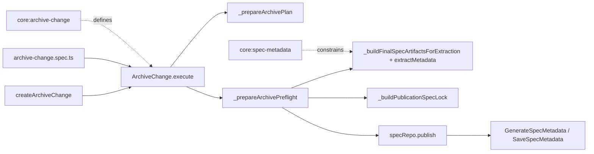

# Design: fix-archive-preflight-atomicity

## Non-goals

- Do not change the post-publication rule that metadata generation failures are reported in `staleMetadataSpecPaths` without aborting archive.
- Do not introduce a whole-batch filesystem transaction across all archived specs.
- Do not move sidecar or metadata authority from `ArchiveChange` into `SaveSpecMetadata`.
- Do not redesign overlap handling, implementation sidecar materialization, or hook semantics beyond what is needed to preserve the new full-batch preflight guarantee.

## Affected areas

- `ArchiveChange.execute()` in `packages/core/src/application/use-cases/archive-change.ts`
  Change: split the current mixed validate-and-publish loop into two phases: full-batch preflight and staged publication.
  Callers: 3 direct dependents via `ArchiveChange`, `ArchiveChangeContext`, and `createArchiveChange()` in composition · Risk: MEDIUM
  Note: this is the orchestration point where the current bug exists. The current flow validates and publishes per spec inside the same loop.

- `_prepareArchivePlan()` in `packages/core/src/application/use-cases/archive-change.ts`
  Change: keep tracked-file resolution, delta application, and write preparation here, but extend the returned plan so downstream code can perform full-batch preflight without recomputing publication inputs.
  Callers: `ArchiveChange.execute()` · Risk: MEDIUM
  Note: today this method stops too early; it prepares writes but does not exhaust all archive-time failure paths.

- `_buildFinalSpecArtifactsForExtraction()` in `packages/core/src/application/use-cases/archive-change.ts`
  Change: reuse during preflight plan enrichment so extraction inputs are prepared before any publication begins.
  Callers: `ArchiveChange.execute()` · Risk: LOW
  Note: this helper already produces the exact in-memory artifact view needed for metadata extraction.

- `_isStructurallyCompatiblePreparedArtifacts()` in `packages/core/src/application/use-cases/archive-change.ts`
  Change: move its use from the publication loop into the new preflight phase.
  Callers: `ArchiveChange.execute()` · Risk: LOW

- `_resolvePersistedDependsOn()` in `packages/core/src/application/use-cases/archive-change.ts`
  Change: keep logic intact but evaluate it during full-batch preflight rather than just-in-time before each `publish()`.
  Callers: `ArchiveChange.execute()` · Risk: LOW

- `_buildPublicationSpecLock()` in `packages/core/src/application/use-cases/archive-change.ts`
  Change: run during preflight to compute final publication units before the first canonical write.
  Callers: `ArchiveChange.execute()` · Risk: LOW

- `PreparedArchivePlan`, `PreparedArchivePublication`, and adjacent archive-plan types in `packages/core/src/application/use-cases/archive-change.ts`
  Change: extend the plan shape to carry preflighted publication state, not just raw writes.
  Callers: `ArchiveChange.execute()`, helper methods in the same file · Risk: MEDIUM

- `createArchiveChange()` in `packages/core/src/composition/use-cases/archive-change.ts`
  Change: likely no behavioral change, but the constructor wiring is an integration boundary and must remain compatible if the `ArchiveChange` internal helper structure changes.
  Callers: kernel composition paths · Risk: LOW

- `packages/core/test/application/use-cases/archive-change.spec.ts`
  Change: add and update tests to enforce full-batch preflight semantics, including "later spec fails before earlier spec publishes".
  Callers: test suite only · Risk: HIGH
  Note: this is the primary executable contract for the regression.

- `packages/core/test/application/use-cases/helpers.ts`
  Change: may need small helper extensions if new tests require easier observation of `publish()` ordering or multi-spec repositories.
  Callers: core use-case test suite · Risk: LOW

## New constructs

- `PreparedArchivePreflightSpec` in `packages/core/src/application/use-cases/archive-change.ts`
  Shape:

  ```ts
  interface PreparedArchivePreflightSpec {
    readonly specId: string
    readonly workspace: string
    readonly specPath: SpecPath
    readonly spec: Spec
    readonly specRepo: SpecRepository
    readonly writes: readonly PreparedArchiveWrite[]
    readonly extractionArtifacts: readonly MetadataArtifactInput[]
    readonly existingSpecLock: SpecLockData | null
    readonly finalDependsOn: readonly string[]
    readonly publicationSpecLock: SpecLockData | undefined
    readonly sidecarActive: boolean
  }
  ```

  Responsibility: capture every per-spec value that can fail archive-time validation before canonical publication begins.
  Relationships: produced by a new preflight helper and consumed by the final publication loop.

- `_prepareArchivePreflight()`
  Location: `packages/core/src/application/use-cases/archive-change.ts`
  Shape:

  ```ts
  private async _prepareArchivePreflight(
    change: Change,
    schema: Schema,
    preparedPlan: PreparedArchivePlan,
  ): Promise<readonly PreparedArchivePreflightSpec[]>
  ```

  Responsibility: execute all archive-time checks that can still fail, across the full archive batch, before any canonical `publish()` call.
  Relationships: called by `execute()` after `_prepareArchivePlan()` and before any staged publication.

- `_prepareSpecPublicationPreflight()`
  Location: `packages/core/src/application/use-cases/archive-change.ts`
  Shape:
  ```ts
  private async _prepareSpecPublicationPreflight(args: {
    readonly change: Change
    readonly schema: Schema
    readonly publication: PreparedArchivePublication
    readonly implementationBySpecId: ReadonlyMap<string, readonly MaterializedImplementationLink[]>
  }): Promise<PreparedArchivePreflightSpec>
  ```
  Responsibility: compute extraction artifacts, read canonical sidecar/metadata state, resolve final `dependsOn`, validate mismatch rules, and build the final sidecar payload for one spec without publishing it.
  Relationships: called by `_prepareArchivePreflight()` for each publication unit.

No new top-level file is required; the change remains inside the existing `ArchiveChange` use case and its tests.

## Approach

The implementation should preserve the current lifecycle guards and hook ordering, but replace the mixed validate-and-publish sequence inside `ArchiveChange.execute()` with a strict three-stage pipeline:

1. Existing pre-publication guards remain unchanged:
   - load change
   - schema name guard
   - mutate to `archiving`
   - overlap guard
   - readOnly guard
   - pre-archive hooks

2. Build the raw archive plan in memory using `_prepareArchivePlan(change, schema)`.
   - This continues to resolve tracked filenames, apply deltas, and build `PreparedArchiveWrite[]`.
   - It remains the place for tracked-file failures, missing delta bases, and implementation-sidecar scope checks.

3. Run a new full-batch preflight phase before the first canonical `publish()`.
   - For every `PreparedArchivePublication`, build final extraction artifacts using `_buildFinalSpecArtifactsForExtraction()`.
   - Read current `spec-lock.json` and metadata state.
   - Resolve `finalDependsOn` with `_resolvePersistedDependsOn()`.
   - Evaluate sidecar eligibility using `_isStructurallyCompatiblePreparedArtifacts()`.
   - If sidecar-eligible and `metadataExtraction.dependsOn` is present, compare extracted and final persisted dependency sets.
   - Build `publicationSpecLock` with `_buildPublicationSpecLock()`.
   - Persist none of this yet.
   - If any spec fails at this stage, record archive failure with `step: 'prepare'` and `commitStarted: false`, then abort without any canonical publish.

4. Only after the full preflight array is complete and successful, enter the staged publication loop.
   - Loop over `PreparedArchivePreflightSpec[]`.
   - Call `specRepo.publish()` using only the already-prepared writes and already-prepared `publicationSpecLock`.
   - No archive-time validation that can still reject the archive is allowed to happen here.
   - Failures at this stage are true publication failures and should still be recorded with `step: 'commit'` and `commitStarted: true`.

5. Keep the existing post-publication behavior:
   - generate metadata with `GenerateSpecMetadata`
   - save metadata with `SaveSpecMetadata`
   - tolerate metadata-generation failure by adding to `staleMetadataSpecPaths`
   - archive the change directory
   - run post hooks

This directly satisfies:

- `core:archive-change` Requirement: Prepare archive plan before permanent writes
- `core:archive-change` Requirement: Staged archive commit and failed-attempt visibility
- `core:spec-metadata` Requirement: Deterministic generation at archive time

## Key decisions

- **Keep the fix inside `ArchiveChange` instead of introducing a new domain service** → the bug is orchestration order, not missing domain logic. The existing helpers already compute the necessary inputs; the issue is where they are called.
  **Alternatives rejected** → adding a separate archive coordinator class would spread a small but high-risk behavioral change across more files and composition wiring without adding domain clarity.

- **Introduce a distinct full-batch preflight data structure** → the publication loop must consume already-validated publication units. A dedicated type makes it explicit which values are safe to publish.
  **Alternatives rejected** → recomputing extraction and sidecar state inside the publication loop would preserve the same class of bug; stuffing extra mutable fields back into `PreparedArchivePublication` would blur the line between raw writes and validated publication state.

- **Treat metadata-related mismatch as a preflight failure, not a commit failure** → this is the core user requirement and matches the revised spec contract.
  **Alternatives rejected** → keeping mismatch checks immediately before each spec publish still allows "spec A published, spec B fails".

- **Do not change `SaveSpecMetadata` behavior** → the current code already executes metadata persistence after canonical publication and tolerates its failure. That is not the partial-merge bug being fixed.
  **Alternatives rejected** → moving responsibility into `SaveSpecMetadata` would violate the existing boundary that archive-time sidecar consistency is enforced by `ArchiveChange`.

- **Keep constructor and public `execute()` signature stable** → composition and callers are low-blast-radius today, and the change does not require a new external input flag.
  **Alternatives rejected** → adding an explicit "preflight mode" input would leak an internal sequencing concern into public API surface without user value.

## Trade-offs

- `[Higher memory use during archive]` → full-batch preflight retains prepared extraction inputs and sidecar payloads for all specs before publication. Mitigation: the number of spec artifacts per change is bounded and already materialized in memory as strings during delta application.

- `[Larger single-method refactor in a critical use case]` → `ArchiveChange.execute()` is a hotspot and order-sensitive. Mitigation: keep the refactor local, introduce small private helpers with explicit inputs/outputs, and extend tests before touching edge-case branches.

- `[Potential conflict with implementation-file-tracking branch]` → the active overlapping change also edits archive flow. Mitigation: keep the refactor limited to sequencing and plan shape; avoid reworking implementation-link semantics unless required.

## Spec impact

### `core:archive-change`

- Direct dependents discovered from spec references:
  - `specs/cli/change-archive/spec.md`
  - `specs/core/hook-execution-model/spec.md`
  - `specs/core/workflow-model/spec.md`
  - `specs/core/change-layout/spec.md`
  - `specs/core/archive-repository-port/spec.md`
  - `specs/core/list-archived/spec.md`
  - `specs/core/get-archived-change/spec.md`
  - `specs/core/template-variables/spec.md`
  - `specs/core/kernel/spec.md`
- Assessment:
  - These specs reference archive behavior, hook semantics, or the existence of the use case.
  - None of the discovered references appear to depend on the old "validate inside publication loop" behavior.
  - The change strengthens timing guarantees without changing user-facing CLI flags, hook names, or archive repository API shape.
- Result: no additional spec deltas required from the current ripple analysis.

### `core:spec-metadata`

- Direct dependents discovered from spec references:
  - `specs/cli/spec-generate-metadata/spec.md`
  - `specs/cli/spec-metadata/spec.md`
  - `specs/cli/spec-write-metadata/spec.md`
  - `specs/core/invalidate-spec-metadata/spec.md`
  - `specs/core/change/spec.md`
  - `specs/core/change-manifest/spec.md`
  - `specs/core/generate-metadata/spec.md`
  - `specs/core/spec-id-format/spec.md`
  - `specs/core/spec-repository-port/spec.md`
  - `specs/core/compile-context/spec.md`
  - `specs/core/list-specs/spec.md`
  - `specs/core/get-spec-context/spec.md`
  - `specs/core/get-project-context/spec.md`
  - `specs/core/config/spec.md`
- Assessment:
  - These specs consume metadata shape, traversal, and generation semantics.
  - The current change does not alter metadata schema fields or consumer-facing traversal behavior; it only strengthens when archive-time metadata validation must finish.
  - No dependent spec currently appears to encode the opposite timing guarantee.
- Result: no additional spec deltas required from the current ripple analysis.

## Dependency map



```text
┌──────────────────────────────────────────┐
│ createArchiveChange()                    │
│ packages/core/src/composition/use-cases  │
└──────────────────────┬───────────────────┘
                       │ wires
                       ▼
┌──────────────────────────────────────────┐
│ ArchiveChange.execute()                  │
│ packages/core/src/application/use-cases  │
│ [MEDIUM integration risk]                │
└───────────────┬───────────────────┬──────┘
                │                   │
                │ builds            │ tested by
                ▼                   ▼
     ┌──────────────────┐   ┌─────────────────────────────┐
     │ _prepareArchive  │   │ archive-change.spec.ts      │
     │ Plan()           │   │ core regression coverage    │
     └────────┬─────────┘   └─────────────────────────────┘
              │ feeds
              ▼
     ┌──────────────────┐
     │ _prepareArchive  │
     │ Preflight()      │
     │ full batch only  │
     └───────┬─────┬────┘
             │     │
             │     └───────────────┐
             ▼                     ▼
   ┌────────────────────┐  ┌──────────────────────┐
   │ extractMetadata()  │  │ build spec-lock      │
   │ metadata checks    │  │ final sidecar payload│
   └──────────┬─────────┘  └──────────┬───────────┘
              │ all pass before       │
              └──────────────┬────────┘
                             ▼
                    ┌─────────────────┐
                    │ specRepo.publish│
                    │ per-spec atomic │
                    └────────┬────────┘
                             ▼
                    ┌─────────────────┐
                    │ metadata save   │
                    │ non-blocking    │
                    └─────────────────┘

┌──────────────────────┐        ┌──────────────────────┐
│ core:archive-change  │- - - ->│ ArchiveChange flow   │
└──────────────────────┘        └──────────────────────┘
┌──────────────────────┐        ┌──────────────────────┐
│ core:spec-metadata   │- - - ->│ metadata preflight   │
└──────────────────────┘        └──────────────────────┘
```

## Testing

Automated tests:

- Extend [packages/core/test/application/use-cases/archive-change.spec.ts](/Users/monki/Documents/Proyectos/specd/packages/core/test/application/use-cases/archive-change.spec.ts)
  - Add a multi-spec regression where spec A is publication-ready, spec B fails metadata mismatch, and assert `publish()` is never called for spec A.
  - Add a regression where a later preflight failure unrelated to metadata (for example missing tracked or structurally incompatible prepared state if still reachable after plan build) prevents any canonical publish.
  - Add a test proving that once the first `publish()` starts, all archive-time checks have already been evaluated for the batch.
  - Keep existing tests for post-publication metadata failure unchanged to prove the non-goal remains intact.

- Extend [packages/core/test/application/use-cases/helpers.ts](/Users/monki/Documents/Proyectos/specd/packages/core/test/application/use-cases/helpers.ts) only if needed
  - Add spy-friendly spec repository behavior for observing `publish()` call order across multiple specs.
  - Add fixtures for per-spec metadata extraction outcomes in a multi-spec batch.

- If the refactor extracts new private helpers only, keep them covered through `ArchiveChange.execute()` behavior tests rather than direct helper tests. The public behavior is what matters.

Scenario-to-test mapping:

- `core:archive-change` verify
  - `Later spec preflight failure blocks earlier spec publication` → new regression in `archive-change.spec.ts`
  - `Metadata consistency failure is part of prepare-phase preflight` → new mismatch regression in `archive-change.spec.ts`
  - `Batch preflight succeeds before first staged publication starts` → new ordering assertion in `archive-change.spec.ts`
  - `Multi-spec archive is not required to be one filesystem transaction` → existing publish-failure coverage plus updated assertions

- `core:spec-metadata` verify
  - `Pre-publication extraction checks final persisted dependsOn during full-batch preflight` → new ordering regression in `archive-change.spec.ts`
  - `Metadata-related failure in one spec blocks publication of earlier specs` → new multi-spec mismatch regression
  - `Mismatched extracted dependsOn blocks archive before any batch publication starts` → updated mismatch regression

Manual / E2E verification:

- Run targeted tests:
  - `pnpm --filter @specd/core test -- archive-change.spec.ts`
- Run broader core suite if the targeted test passes:
  - `pnpm --filter @specd/core test`
- Optionally run the CLI archive flow against a fixture project or existing repo fixture that archives multiple specs with one intentionally failing metadata mismatch.
  - Expected result: archive command fails before any canonical spec file changes.
  - Expected regression guard: if a later spec fails preflight, earlier specs remain untouched.

Documentation and global constraints:

- No update under `docs/` is expected unless implementation uncovers a user-facing CLI behavior change or operational recovery guidance that is not already covered by specs. If that happens, add a short note under `docs/core/` or `docs/cli/` describing the strengthened archive preflight guarantee.
- Keep all new logic in application/composition layers. Do not move I/O into domain code.
- Use named exports, ESM imports, strict TypeScript types, and no `any`.
- Preserve or add concise JSDoc on any new helper interfaces or methods introduced in `archive-change.ts`.

## Open questions

None.
