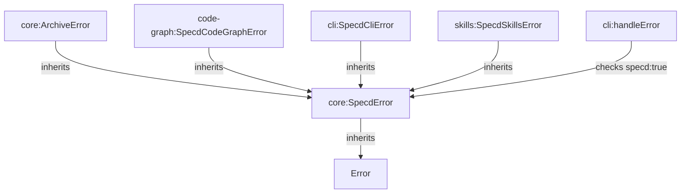

# Design: core-error-refinement

## Affected areas

- `SpecdError` in `packages/core/src/domain/errors/specd-error.ts`
  - Change: Add `readonly specd = true` property.
  - Callers: 165 transitive dependents (CRITICAL risk). This is the base of the entire hierarchy.
- `ArchiveChange` in `packages/core/src/application/use-cases/archive-change.ts`
  - Change: Replace `throw new Error` with specific `Archive*Error` subclasses.
- `UpdateSpecDeps` in `packages/core/src/application/use-cases/update-spec-deps.ts`
  - Change: Replace `throw new Error` with typed validation errors.
- `CodeGraphError` (to be renamed `SpecdCodeGraphError`) in `packages/code-graph/src/domain/errors/code-graph-error.ts`
  - Change: Rename to `SpecdCodeGraphError`, extend `SpecdError` from `@specd/core`.
- `handleError` in `packages/cli/src/handle-error.ts`
  - Change: Update detection logic to check for the `specd: true` property instead of just `instanceof SpecdError`.
- `SkillRepository` in `packages/skills/src/infrastructure/repository/skill-repository.ts`
  - Change: Replace `throw new Error` with `SpecdSkillsError`.

## New constructs

### `@specd/core` Errors

- **Location**: `packages/core/src/domain/errors/archive-dependency-mismatch-error.ts`
  - **Shape**: `class ArchiveDependencyMismatchError extends SpecdError { code = 'ARCHIVE_DEPENDENCY_MISMATCH'; ... }`
  - **Responsibility**: Thrown when extracted deps mismatch persisted ones during archive.
- **Location**: `packages/core/src/domain/errors/archive-artifact-missing-error.ts`
  - **Shape**: `class ArchiveArtifactMissingError extends SpecdError { code = 'ARCHIVE_ARTIFACT_MISSING'; ... }`
  - **Responsibility**: Thrown when a required artifact is missing during archive.
- **Location**: `packages/core/src/domain/errors/archive-implementation-state-error.ts`
  - **Shape**: `class ArchiveImplementationStateError extends SpecdError { code = 'ARCHIVE_IMPLEMENTATION_STATE'; ... }`
  - **Responsibility**: Thrown when implementation files are open or out-of-scope during archive.

### `@specd/cli` Errors

- **Location**: `packages/cli/src/errors/specd-cli-error.ts`
  - **Shape**: `abstract class SpecdCliError extends SpecdError { ... }`
  - **Responsibility**: Base class for all CLI-specific errors.
- **Location**: `packages/cli/src/errors/cli-validation-error.ts`
  - **Shape**: `class CliValidationError extends SpecdCliError { code = 'CLI_VALIDATION_ERROR'; ... }`
  - **Responsibility**: Thrown for invalid flags, formats, or configuration conflicts in the CLI layer.

### `@specd/skills` Errors

- **Location**: `packages/skills/src/domain/errors/specd-skills-error.ts`
  - **Shape**: `abstract class SpecdSkillsError extends SpecdError { ... }`
  - **Responsibility**: Base class for all skill-related errors.
- **Location**: `packages/skills/src/domain/errors/skill-not-found-error.ts`
  - **Shape**: `class SkillNotFoundError extends SpecdSkillsError { code = 'SKILL_NOT_FOUND'; ... }`
  - **Responsibility**: Thrown when a requested skill is not available.

## Approach

1.  **Refactor Base Hierarchy**:
    - Update `SpecdError` in `core` to include the `specd: true` discriminator.
    - Create the new specific error classes in `core`.
2.  **Align Monorepo Packages**:
    - Update `packages/code-graph`: Rename `CodeGraphError` → `SpecdCodeGraphError` and extend `SpecdError`.
    - Create `SpecdCliError` base in `packages/cli`.
    - Create `SpecdSkillsError` base in `packages/skills`.
3.  **Update CLI Error Handling**:
    - Modify `cli:src/handle-error.ts` to recognize any object with `err.specd === true` and a `code` string as a "Specd error", allowing it to emit structured output and clean messages.
4.  **Surgical Refactoring**:
    - Replace `throw new Error` calls identified during exploration in `ArchiveChange`, `UpdateSpecDeps`, `CodeGraphProvider`, and `SkillRepository`.
    - Use `CliValidationError` in CLI formatters and flag validators.
5.  **Documentation**:
    - Ensure all new error classes have JSDoc as per the new `error-handling-conventions`.

## Key decisions

- **Decision** → Use `readonly specd = true` discriminator. Rationale: Allows the CLI to identify compatible errors across package boundaries even if multiple versions of `core` are loaded in memory or if a package doesn't strictly extend the class but follows the contract.
- **Decision** → Rename `CodeGraphError` to `SpecdCodeGraphError`. Rationale: Consistency with the monorepo-wide naming pattern.
- **Decision** → Granular errors for `ArchiveChange`. Rationale: Archiving is a critical, complex flow; specific errors help the user (and AI agents) understand exactly what failed (metadata vs missing files).

## Dependency map



```
      ┌───────────┐
      │   Error   │
      └─────▲─────┘
            │
      ┌─────┴──────┐
      │ SpecdError │◄────────────────┐
      │ [core]     │                 │
      └─────▲──────┘                 │
            │                        │
    ┌───────┼─────────┬──────────────┼───────────────┐
    │       │         │              │               │
┌───┴──┐┌───┴──┐┌─────┴────────┐┌────┴─────────┐┌────┴────────┐
│Archive││Update││SpecdCodeGraph││ SpecdCliError││ SpecdSkills │
│Errors││Errors││   Error      ││    [cli]     ││    Error    │
└───┬──┘└───┬──┘└──────────────┘└──────────────┘└─────────────┘
    │       │
    ▼       ▼
┌───────────────────┐
│ cli:handleError   │ (Checks for .specd === true)
└───────────────────┘
```

## Testing

### Automated tests

- `packages/core/test/application/use-cases/archive-change.spec.ts`: Update tests that expect "Extracted dependsOn mismatch" to assert `ArchiveDependencyMismatchError`.
- `packages/core/test/domain/errors/specd-error.spec.ts`: Add test to verify `specd: true` is present on all subclasses.
- `packages/code-graph/test/domain/errors/code-graph-error.spec.ts`: Verify `SpecdCodeGraphError` extends `SpecdError`.
- `packages/cli/test/handle-error.spec.ts`: Add scenarios for structured error output with the new discriminator.

### Manual / E2E verification

1.  Trigger a dependency mismatch in a change:
    - Edit a spec to add a dependency.
    - Attempt to archive without running `specd change metadata --update`.
    - **Verify**: CLI shows a clean message with suggestions, no stack trace.
2.  Pass an invalid format to a command:
    - `node packages/cli/dist/index.js changes list --format invalid`
    - **Verify**: Shows `[CLI_VALIDATION_ERROR] invalid format 'invalid'`, no stack trace.
