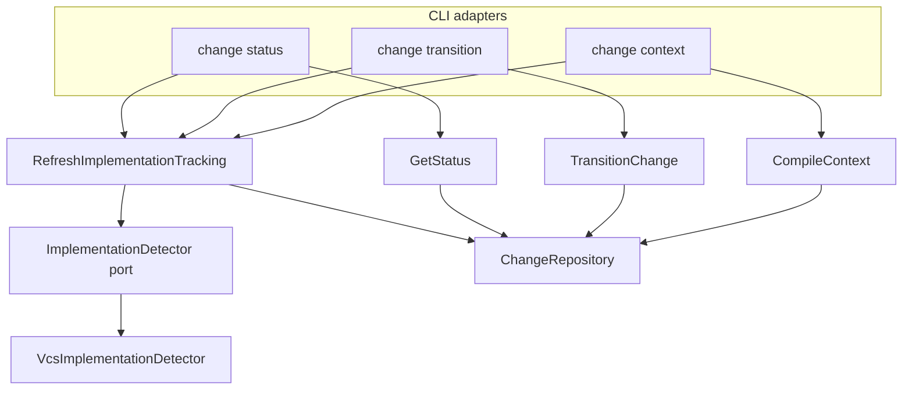

# Design: move-impl-tracking-to-cli

## Non-goals

- MCP filesystem watcher integration (future change; document follow-up only).
- `cli:change-implementation` autodetection on `list` (stays read-only; avoids double refresh after `status` / `context`).
- `specd project context` (`GetProjectContext`) — no change entity, no tracking.
- Changing `UpdateImplementationTracking` mutation semantics (`add` / `remove` / `resolve` / `ignore`).
- Embedding VCS detection in `GetStatus`, `TransitionChange`, or `CompileContext` again.

## Affected areas

### Core application

- `packages/core/src/application/use-cases/get-status.ts`
  - **Change:** Remove `ImplementationDetector` field, constructor parameter, and the pre-`execute` `mutate` loop that calls `detectModifiedFiles`. Load change with `get` (or existing load path) without tracking side effects.
  - **Impact:** LOW direct dependents (tests). Aligns with existing constraint “read-only query”.

- `packages/core/src/application/use-cases/transition-change.ts`
  - **Change:** Remove detector dependency and detection block inside the pre-transition `mutate` (lines ~268–275 today).
  - **Impact:** LOW. Transition logic unchanged aside from assuming persisted tracking.

- `packages/core/src/application/use-cases/compile-context.ts`
  - **Change:** Remove `ImplementationDetector` from constructor and pre-compile `mutate` detection block.
  - **Impact:** MEDIUM. Many compile-context tests mock detector today.

- `packages/core/src/application/use-cases/refresh-implementation-tracking.ts` (**new**)
  - **Change:** Extract today’s shared detection merge loop into dedicated use case.
  - **Impact:** New integration point for CLI; kernel exposes as `kernel.changes.refreshImplementationTracking`.

- `packages/core/src/composition/kernel.ts`
  - **Change:** Instantiate `RefreshImplementationTracking`; remove `implementationDetector` from `GetStatus`, `TransitionChange`, `CompileContext` constructors; add `changes.refreshImplementationTracking` (or `refreshImplementation` — match kernel naming style from `updateImplementationTracking`).
  - **Impact:** HIGH composition surface; export type on `Kernel` interface.

- `packages/core/src/index.ts` (package exports)
  - **Change:** Export `RefreshImplementationTracking`, input/result types if other packages need them (CLI uses kernel only).

### Core tests

- `packages/core/test/application/use-cases/get-status.spec.ts` — remove autodetection tests; add read-only tracking test.
- `packages/core/test/application/use-cases/transition-change.spec.ts` — remove detector mock expectations.
- `packages/core/test/application/use-cases/compile-context.spec.ts` — remove detector from constructor mocks.
- `packages/core/test/application/use-cases/refresh-implementation-tracking.spec.ts` (**new**) — guard, merge, persistence, not-found.

### CLI

- `packages/cli/src/commands/change/status.ts`
  - **Change:** `await kernel.changes.refreshImplementationTracking.execute({ name })` before `kernel.changes.status.execute`.

- `packages/cli/src/commands/change/transition.ts`
  - **Change:** Single `refreshImplementationTracking` at handler entry (before the existing `status.execute` used for `fromState`). Do **not** refresh again in the repair-guide `catch` path when calling `status.execute` after failure.

- `packages/cli/src/commands/change/context.ts`
  - **Change:** `refreshImplementationTracking` before `kernel.changes.compile.execute`, including when `--fingerprint` is set.

- CLI tests: `change-status.spec.ts`, `change-transition.spec.ts`, `change/context` tests — assert refresh called once with expected ordering.

### Intentionally unchanged CLI callers of `GetStatus`

These continue without refresh (diagnostic / secondary reads):

- `packages/cli/src/commands/change/validate.ts`
- `packages/cli/src/commands/change/artifacts.ts`
- `packages/cli/src/commands/drafts/show.ts`
- `packages/cli/src/commands/discarded/show.ts`

Document in code comments only if confusion arises; no spec change.

### Spec metadata

- `specs/core/*/spec-lock.json` — update `implementation` blocks when new use case file exists (via `specd-metadata` / archive workflow, not hand-edited in this change unless required by CI).

## New constructs

### `RefreshImplementationTracking`

- **Location:** `packages/core/src/application/use-cases/refresh-implementation-tracking.ts`
- **Shape:**

```typescript
export interface RefreshImplementationTrackingInput {
  readonly name: string
}

export interface RefreshImplementationTrackingResult {
  readonly implementationTracking: ImplementationTrackingProjection
}

export class RefreshImplementationTracking {
  constructor(changes: ChangeRepository, implementationDetector: ImplementationDetector)

  execute(input: RefreshImplementationTrackingInput): Promise<RefreshImplementationTrackingResult>
}
```

- **Responsibility:** Run historical-implementing guard, optional VCS detection, merge new paths as `open`, persist via `mutate`, return `projectImplementationTracking(change)`.
- **Does not:** Run lifecycle transitions, compile context, or manual link mutations.
- **Relationships:** Uses `ImplementationDetector` port; wired in `kernel.ts` next to `updateImplementationTracking`; invoked from three CLI commands only in this change.

### Kernel surface

```typescript
// packages/core/src/composition/kernel.ts — Kernel.changes
refreshImplementationTracking: RefreshImplementationTracking
```

### Optional CLI helper (only if duplication appears)

- **Location:** `packages/cli/src/commands/change/_refresh-implementation-tracking.ts`
- **Shape:** `refreshImplementationTracking(kernel, name): Promise<void>` — thin wrapper; skip if YAGNI after editing three commands.

## Approach

### Phase 1 — Core extraction

1. Add `RefreshImplementationTracking` by moving the existing loop from `get-status.ts`:

```typescript
if (freshChange.getHistoricalImplementationAt() !== null) {
  const files = await this._implementationDetector.detectModifiedFiles(freshChange)
  for (const file of files) {
    if (freshChange.trackedImplementationFiles.some((entry) => entry.file === file)) continue
    freshChange.trackImplementationFile(file, 'open')
  }
}
```

2. Wire in `kernel.ts`; keep single `VcsImplementationDetector` instance shared with refresh use case.
3. Strip detector from `GetStatus`, `TransitionChange`, `CompileContext` constructors and bodies.
4. Update core unit tests.

### Phase 2 — CLI orchestration

1. **status:** refresh → getStatus → render (unchanged render path).
2. **transition:** refresh → getStatus (fromState) → transition; on `InvalidStateTransitionError`, getStatus only (no second refresh).
3. **context:** refresh → compile (fingerprint path included).

### Phase 3 — Specs compliance

- Archive deltas after implementation; no direct `specs/` edits outside workflow.

### Delivery boundaries

| Adapter                                        | Tracking strategy (this change)                                                                          |
| ---------------------------------------------- | -------------------------------------------------------------------------------------------------------- |
| CLI `change status` / `transition` / `context` | `RefreshImplementationTracking` before core use case                                                     |
| CLI `change implementation`                    | Persisted state only on `list`                                                                           |
| MCP (future)                                   | Filesystem watcher → direct manifest/change mutations; **does not** call `RefreshImplementationTracking` |
| Tests / kernel consumers                       | Call refresh explicitly when needed                                                                      |

## Key decisions

**Dedicated use case vs private helper**
→ `RefreshImplementationTracking` is a first-class kernel use case so CLI, tests, and future callers share one contract without importing detector merge logic.

**Alternatives rejected:** private `_shared/refreshFromDetector()` only — harder to spec and expose on kernel.

**Single refresh per CLI handler invocation**
→ Avoid redundant VCS work when transition already called `getStatus` in the same handler.

**Alternatives rejected:** refresh inside `GetStatus` again — blocks MCP watcher strategy and duplicates with `implementation` commands.

**No refresh on secondary GetStatus callers**
→ `validate` / `artifacts` need consistent persisted state, not live VCS on every call.

**Port spec names refresh use case only**
→ `core:implementation-detector-port` stays delivery-agnostic (no CLI/MCP).

## Trade-offs

- **[Risk] Stale tracking when using `change validate` without prior `status`** → Operators/agents should run `change status` or `change context` when they need fresh VCS detection; acceptable because validate is artifact-focused.
- **[Risk] Double VCS detect if user runs `status` then `transition` sequentially** → Two CLI invocations, two refreshes — acceptable on-demand cost; MCP path avoids this with watcher.
- **[Risk] Kernel interface break for custom `Kernel` mocks** → Update CLI test mocks to include `refreshImplementationTracking.execute`.

## Spec impact

Modified specs in this change and dependent read paths:

| Modified spec                                | Direct dependents (context)                                                     | Assessment                                                                               |
| -------------------------------------------- | ------------------------------------------------------------------------------- | ---------------------------------------------------------------------------------------- |
| `core:get-status`                            | `cli:change-status`, `cli:change-transition` (repair), `cli:change-validate`, … | CLI status/transition deltas cover orchestration; other callers documented as no refresh |
| `core:transition-change`                     | `cli:change-transition`, skills                                                 | No extra delta — CLI spec updated                                                        |
| `core:compile-context`                       | `cli:change-context`, skills                                                    | CLI delta covers refresh                                                                 |
| `core:implementation-detector-port`          | `core:refresh-implementation-tracking`, `core:vcs-implementation-detector`      | Port caller list updated                                                                 |
| `core:refresh-implementation-tracking` (new) | CLI specs                                                                       | New full spec + verify in change                                                         |

`core:change` historical guard unchanged — still used by refresh use case.

No additional spec scope required beyond the eight specs already in the change.

## Dependency map



```
┌─────────────────┐     ┌──────────────────────────────┐
│ change status   │────▶│ RefreshImplementationTracking │
│ change transition│────▶│                              │
│ change context  │────▶└──────────────┬───────────────┘
└─────────────────┘                    │
                                       ▼
                              ┌────────────────┐
                              │ Implementation │
                              │ Detector port  │
                              └────────┬───────┘
                                       ▼
                              ┌────────────────┐
                              │ VcsImplementation│
                              │ Detector        │
                              └────────────────┘

        refresh ──▶ ChangeRepository ◀── GetStatus / Transition / CompileContext
                              (read/project only)
```

## Migration / Rollback

- **Deploy:** Behavior change only; no manifest schema migration. Active changes keep existing `trackedImplementationFiles`.
- **Rollback:** Revert code; autodetection returns inside core use cases. No data loss.

## Testing

### Automated

| File                                                                               | Coverage                                                                   |
| ---------------------------------------------------------------------------------- | -------------------------------------------------------------------------- |
| `packages/core/test/application/use-cases/refresh-implementation-tracking.spec.ts` | Guard skip/call, merge new paths, preserve resolved, `ChangeNotFoundError` |
| `packages/core/test/application/use-cases/get-status.spec.ts`                      | Remove autodetection tests; assert no detector call                        |
| `packages/core/test/application/use-cases/transition-change.spec.ts`               | No detector on transition                                                  |
| `packages/core/test/application/use-cases/compile-context.spec.ts`                 | No detector on compile                                                     |
| `packages/cli/test/commands/change-status.spec.ts`                                 | `refreshImplementationTracking` before `status`                            |
| `packages/cli/test/commands/change-transition.spec.ts`                             | Refresh once; not on repair `getStatus`                                    |
| `packages/cli/test/commands/change/context` (or equivalent)                        | Refresh before compile; fingerprint path                                   |

Map each `verify.md` scenario in the change to at least one test row above.

### Manual / E2E

1. Create or use a change that has reached `implementing`; modify a tracked file in the worktree.
2. `node packages/cli/dist/index.js change status <name> --implementation` — new file appears under Implementation without calling `implementation` subcommands.
3. `node packages/cli/dist/index.js change context <name> implementing` — succeeds; tracked state matches step 2.
4. `node packages/cli/dist/index.js change transition <name> --next` (or explicit step) — transition sees current tracked state.
5. Force invalid transition; confirm repair guide prints without extra VCS churn (optional: log/mock detector call count).

### Documentation

No `docs/` update required for operator-facing CLI reference unless `docs/cli/cli-reference.md` documents implementation refresh explicitly — add a short note under `change status`, `change transition`, and `change context` that VCS-backed tracking refresh runs automatically when the change has entered `implementing` (optional follow-up during implement).

### Global constraints

- Hexagonal: detector stays port; refresh is application use case; CLI orchestrates.
- ESM, named exports, JSDoc on new public class per `default:_global/docs`.
- Tests: mock ports, no real VCS in unit tests.

## Open questions

None — MCP watcher and `docs/cli` note are explicit non-goals / optional follow-ups.
