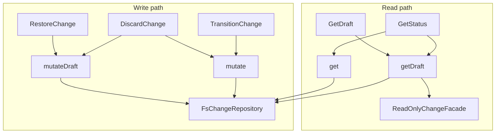

# Design: drafted-change-read-only

## Non-goals

- Renaming all legacy "shelved" strings across untouched specs and CLI copy.
- CLI spec deltas (handle error mapping in implementation tasks; `handle-error.ts` maps `DraftedChangeReadOnlyError`).

## Affected areas

### `packages/core/src/infrastructure/fs/change-repository.ts`

- **`_resolveDir` / new helpers** — Split into `_resolveActiveDir(name)` (only `changes/`) and `_resolveDraftDir(name)` (only `drafts/`). Remove combined search from `get` / `mutate` paths.
- **`get`** — Call `_resolveActiveDir` only; drop draft fallback.
- **`getDraft`** — New: load manifest from `_resolveDraftDir`, build `DraftedChangeFacade`.
- **`getDiscarded`** — New: load manifest from `_resolveDiscardedDir` only (no `get`/`GetStatus` fallback).
- **`mutate`** — Load via active dir only; throw `ChangeNotFoundError` if missing.
- **`mutateDraft`** — New: load via draft dir only; serialized lock same as `mutate`; allow `save` during callback via internal flag `_draftMutationInProgress`.
- **`save` / `saveArtifact`** — Throw `DraftedChangeReadOnlyError` when `change.isDrafted` unless `_draftMutationInProgress` is set for that name.
- **`changePath` / `draftChangePath`** — `changePath` rejects or only accepts active changes; `draftChangePath(view)` resolves under `_draftsPath`.
- **Risk:** CRITICAL fan-in (graph impact) — central persistence adapter.

### `packages/core/src/application/ports/change-repository.ts`

- Add abstract `getDraft`, `mutateDraft`, `draftChangePath`.
- Document active-only semantics on `get` / `mutate`.

### `packages/core/src/domain/`

- **`drafted-change-view.ts`** — `DraftedChangeView` interface + `DraftedChangeFacade` class (composition).
- **`errors/drafted-change-read-only-error.ts`** — export from `errors/index.ts`.
- **`entities/change.ts`** (optional) — `assertNotDrafted(operation)` called from mutators as belt-and-suspenders.

### Use cases

| Use case                                  | Change                                                                                                     | Risk   |
| ----------------------------------------- | ---------------------------------------------------------------------------------------------------------- | ------ |
| `restore-change.ts`                       | `mutateDraft` only; pre-check `getDraft`                                                                   | LOW    |
| `discard-change.ts`                       | Branch: `get` → `mutate`, else `getDraft` → `mutateDraft`                                                  | LOW    |
| `get-draft.ts`                            | **New** use case                                                                                           | LOW    |
| `list-drafts.ts`                          | Return `DraftedChangeView[]`; delegate to `listDrafts()`                                                   | LOW    |
| `get-status.ts`                           | `get` then `getDraft`; `GetStatusResult` with `change` xor `draftView`; read-only transitions when drafted | MEDIUM |
| `draft-change.ts`                         | Return `DraftedChangeView` after `mutate`                                                                  | LOW    |
| `create-change.ts`                        | Uniqueness: `get(name) \|\| getDraft(name)`                                                                | LOW    |
| `draft-change.ts`                         | Unchanged (`mutate` on active)                                                                             | LOW    |
| Transition, validate, edit, approve, etc. | **No code change** — `get` returns null for drafts                                                         | LOW    |

### Composition

- **`composition/kernel.ts`** — Register `GetDraft` on `kernel.changes.getDraft` (or `drafts.get`).
- **`composition/use-cases/get-draft.ts`** — Factory wiring.

### Tests

- `change-repository.spec.ts` — active/draft resolution, mutate vs mutateDraft, save guards.
- `restore-change.spec.ts`, `discard-change.spec.ts` — updated mocks.
- New: `get-draft.spec.ts`, `drafted-change-facade.spec.ts`, `drafted-change-read-only-error.spec.ts`.
- Integration: transition on drafted name → not found.

### CLI (minimal)

- `packages/cli/src/handle-error.ts` — Map `DRAFTED_CHANGE_READ_ONLY`.
- `drafts/show.ts` — `GetDraft` (not `GetStatus`).
- `discarded/show.ts` — `GetDiscarded` (not `GetStatus`; required once `get` is active-only).

## New constructs

### Shared read models — `packages/core/src/domain/read-only-change-view.ts`

One module, one private facade, two public interfaces (reuse; do not duplicate getters).

```typescript
/** Shared read-only fields for drafted and discarded display. */
export interface ReadOnlyChangeView {
  readonly name: string
  readonly createdAt: Date
  readonly description: string | undefined
  readonly state: ChangeState
  readonly specIds: readonly string[]
  readonly workspaces: readonly string[]
  readonly schemaName: string
  readonly schemaVersion: number
  readonly artifacts: ReadonlyMap<string, ChangeArtifact>
  readonly history: readonly ChangeEvent[]
}

export interface DraftedChangeView extends ReadOnlyChangeView {
  readonly isDrafted: true
}

export interface DiscardedChangeView extends ReadOnlyChangeView {
  readonly discardReason: string
  readonly discardedAt: Date
  readonly discardedBy: Actor
  readonly supersededBy?: readonly string[]
}

/** @internal — single class implements both interfaces; no public unwrap. */
class ReadOnlyChangeFacade implements DraftedChangeView, DiscardedChangeView { ... }

export function toDraftedChangeView(change: Change): DraftedChangeView
export function toDiscardedChangeView(change: Change): DiscardedChangeView
```

- `toDraftedChangeView` throws if `!change.isDrafted`.
- `toDiscardedChangeView` throws if latest history event is not `discarded`; maps `discardReason` / `supersededBy` from that event.
- `FsChangeRepository` calls the factories after loading manifests from `drafts/` or `discarded/` only.
- **Not** two files (`drafted-change-view.ts` + `discarded-change-view.ts`) with copy-pasted getters unless a future split is needed for bundle size.

### `DraftedChangeReadOnlyError` — `packages/core/src/domain/errors/drafted-change-read-only-error.ts`

```typescript
export class DraftedChangeReadOnlyError extends DomainError {
  constructor(
    readonly changeName: string,
    readonly operation: string,
  )
  // code: 'DRAFTED_CHANGE_READ_ONLY'
}
```

### `GetDraft` — `packages/core/src/application/use-cases/get-draft.ts`

```typescript
export interface GetDraftInput {
  readonly name: string
}
export interface GetDraftResult {
  readonly view: DraftedChangeView
}

export class GetDraft {
  constructor(private readonly _changes: ChangeRepository) {}
  async execute(input: GetDraftInput): Promise<GetDraftResult>
}
```

### `GetDiscarded` — `packages/core/src/application/use-cases/get-discarded.ts`

```typescript
export interface GetDiscardedResult {
  readonly view: DiscardedChangeView
}
```

### `ChangeRepository` additions

```typescript
abstract getDraft(name: string): Promise<DraftedChangeView | null>
abstract getDiscarded(name: string): Promise<DiscardedChangeView | null>
abstract mutateDraft<T>(name: string, fn: (change: Change) => Promise<T> | T): Promise<T>
abstract listDrafts(): Promise<DraftedChangeView[]>
abstract listDiscarded(): Promise<DiscardedChangeView[]>
abstract draftChangePath(view: DraftedChangeView): string
```

## Approach

### Phase 1 — Domain & error

1. Add `DraftedChangeReadOnlyError` and `DraftedChangeView` + facade factory.
2. Unit-test facade does not expose mutators.

### Phase 2 — Repository split

1. Refactor `_resolveDir` into active/draft helpers.
2. Implement `getDraft`, `mutateDraft`, narrow `get`/`mutate`.
3. Add save/saveArtifact guards with in-callback bypass for `mutateDraft`.
4. Extend `InMemoryChangeRepository` / test helpers in `helpers.ts` to match port.

### Phase 3 — Use cases

1. `RestoreChange` → `mutateDraft`.
2. `DiscardChange` → branch active vs draft.
3. `GetDraft` + kernel wiring.
4. `ListDrafts` / `listDrafts()` and `listDiscarded()` — map manifests via `toDraftedChangeView` / `toDiscardedChangeView`.
5. `GetDiscarded` + kernel wiring; `discarded show` / `discarded list` use views (no history scraping in CLI).
6. `GetStatus` — load draft via `getDraft`; when `isDrafted`, return status without `availableTransitions` (or empty) and read-only `nextAction`.
7. `CreateChange` — collision check includes `getDraft`.

### Phase 4 — CLI & docs

1. Error mapping in CLI.
2. Adjust `drafts show` if it still uses full status transition logic.
3. No `docs/` update required unless we document draft semantics in CLI reference (optional note in `docs/cli/changes.md` if that file mentions draft behaviour).

## Key decisions

**Decision:** `get` active-only + `getDraft` + facade, not `get(..., { includeDrafts })`.

- **Rationale:** Smallest change to mutating use cases (zero edits for transition/validate).
- **Alternatives rejected:** Single `get` with flag — callers could pass wrong flag; subclass `Draft extends Change` — Liskov + still returns `Change` from repo.

**Decision:** `mutateDraft` as sibling to `mutate`, not `mutate(name, fn, { allowDrafted: true })`.

- **Rationale:** Type-level separation; grep shows only restore/discard call `mutateDraft`.
- **Alternatives rejected:** Opt-in flag on `mutate` — easier to misuse from new use cases.

**Decision:** Facade required even with repo split.

- **Rationale:** User requirement — compile-time safety for read paths; `GetDraft` return type is `DraftedChangeView`.
- **Alternatives rejected:** Return `Change` from `getDraft` with comment — insufficient.

**Decision:** `GetStatus` may still run on drafts via `get` fallback to `getDraft`.

- **Rationale:** `drafts show` and similar need artifact/lifecycle display without duplicating use case.
- **Alternatives rejected:** New `GetDraftStatus` — duplicate logic.

## Trade-offs

- **[Risk] `get-status` drift detection on drafts** → Mitigation: `getDraft` spec says no auto-invalidate on draft load; status for drafts is inspection-only.
- **[Risk] CRITICAL blast radius on `change-repository.ts`** → Mitigation: repository integration tests first; then use-case tests.

## Spec impact

### `core:change-repository-port`

- Direct dependents: all use cases using `ChangeRepository`.
- Mutating use cases unchanged if they only use `get`/`mutate`.
- `RestoreChange`, `DiscardChange`, new `GetDraft` updated per deltas.

### `core:change`

- Direct dependents: most core use cases, `draft-change`, `restore-change`.
- Req **Drafted read-only semantics** — satisfied by repo split + facade.

### New specs

- `core:drafted-change-view`, `core:drafted-change-read-only-error`, `core:get-draft` — no existing dependents.

## Dependency map



```
┌─────────────────┐     get (active)      ┌──────────────────────┐
│ TransitionChange│──────────────────────▶│ FsChangeRepository   │
│ ValidateArtifacts│                     │  changes/ only       │
└─────────────────┘                     └──────────┬───────────┘
                                                   │
┌─────────────────┐     getDraft                 │
│ GetDraft        │──────────────────────────────┤
│ GetStatus       │                              │
└────────┬────────┘                              │
         │                                        │
         ▼                                        │
┌─────────────────┐                               │
│ ReadOnlyChange│                               │
│ Facade          │                               │
└─────────────────┘                               │
                                                   │
┌─────────────────┐     mutateDraft               │
│ RestoreChange   │──────────────────────────────▶│ drafts/ only
│ DiscardChange   │     (when drafted)            │
└─────────────────┘                               │
```

## Testing

### Automated

| File                                                   | Coverage                                                                                                      |
| ------------------------------------------------------ | ------------------------------------------------------------------------------------------------------------- |
| `test/infrastructure/fs/change-repository.spec.ts`     | `get` ignores drafts; `getDraft` ignores active; `mutate`/`mutateDraft` isolation; `save` throws when drafted |
| `test/application/use-cases/restore-change.spec.ts`    | Uses `mutateDraft`                                                                                            |
| `test/application/use-cases/discard-change.spec.ts`    | Active vs draft paths                                                                                         |
| `test/application/use-cases/get-draft.spec.ts`         | New                                                                                                           |
| `test/application/use-cases/list-drafts.spec.ts`       | Returns views, not `Change`                                                                                   |
| `test/domain/read-only-change-view.spec.ts`            | Facade surface, both factories                                                                                |
| `test/application/use-cases/get-discarded.spec.ts`     | New                                                                                                           |
| `test/application/use-cases/transition-change.spec.ts` | Drafted name → `ChangeNotFoundError`                                                                          |

### Manual

```bash
node packages/cli/dist/index.js change create test-draft-ro --spec core:change
node packages/cli/dist/index.js change draft test-draft-ro
node packages/cli/dist/index.js change transition test-draft-ro designing  # expect not found / error
node packages/cli/dist/index.js drafts show test-draft-ro                   # expect metadata
node packages/cli/dist/index.js drafts restore test-draft-ro
node packages/cli/dist/index.js changes status test-draft-ro               # expect active transitions again
```

## Spec coverage (22 specs)

**Core (modified/new):** `read-only-change-view`, `drafted-change-view`, `discarded-change-view`, `change`, `change-repository-port`, `restore-change`, `discard-change`, `drafted-change-read-only-error`, `get-draft`, `get-discarded`, `list-drafts`, `list-discarded`, `get-status`, `draft-change`

**CLI:** `drafts-show`, `drafts-list`, `discarded-show`, `discarded-list`, `change-status`, `change-draft` (no-op), `project-status` (no-op), `project-dashboard` (no-op)

## Open questions

- Kernel surface: `kernel.changes.getDraft` vs `kernel.drafts.get` — prefer `changes.getDraft` alongside `listDrafts` for consistency unless CLI already has `drafts` namespace only.
