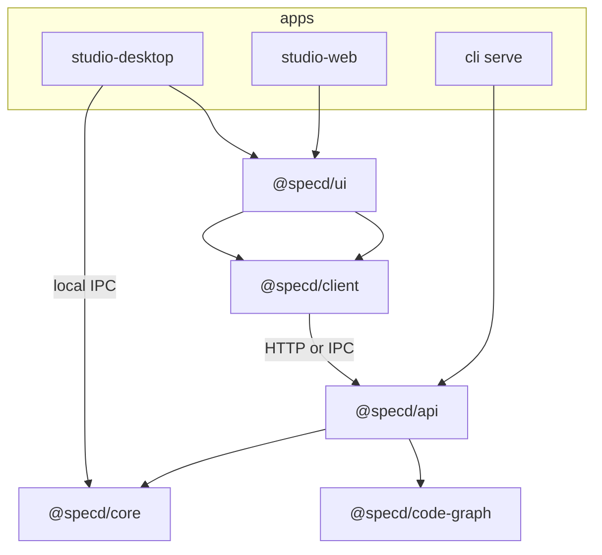

# Design: specd-studio

## How to use this artifact

**Authoritative inputs for implementation:**

1. **`proposal.md`** — motivation, granularity policy, core use-case assessment, `SaveChangeArtifact` pipeline, spec inventory tables, polling model.
2. **`specs/**`and`deltas/**` in this change** — one spec per hexagonal slice; each `spec.md` + `verify.md` is the contract. **Do not implement from memory or from the reference draft alone.**
3. **`tasks.md`** — ordered checklist derived from this design; each task points at files and spec IDs.

**Non-binding narrative:** `.specd-exploration.md` preserves the earlier route tables, UI tab copy, and desktop-menu decisions captured during discovery. Use it for orientation; if it disagrees with a spec in this change, **the spec wins**.

This `design.md` is an **implementer's map**: where code lives, how layers connect, which spec IDs cover which slice, and which core use cases handlers must call. It does **not** restate requirements (see specs).

## Implementation snapshot

The codebase has already moved beyond the original greenfield plan in a few areas. Treat these as current implementation facts for follow-up work in this change:

- Desktop local mode now boots through dedicated `tsup` main/preload builds, with the preload bridge decoupled from runtime ESM imports so Electron can render the shell instead of stalling on startup.
- Desktop renderer bootstrap now keeps React hooks in a stable order while IPC readiness changes, avoiding the blank-window failure mode that previously appeared during initial startup.
- Desktop local IPC already covers project, change, archived change, workspace/spec, and graph methods used by the current UI, via `studio-desktop:ipc-handler-registry` and `studio-desktop:desktop-local-data-adapter`. Remaining methods from `PortChangesMutate` (lifecycle, approvals, skip, updateDeps) and `PortStudioPanel` (project logs) are implemented in phase 16.5.4 to complete the contract.
- Desktop local IPC now strictly maps all core returns to specific `@specd/client` DTOs rather than relying on loose generic typing, ensuring runtime alignment with the HTTP JSON serialization boundaries.
- The `HookInstructionsDto` and `ArtifactInstructionDto` types have been extracted from `CompiledContextDto` payload mistakes to properly define instruction shapes across both HTTP and IPC protocols.
- Desktop-local graph execution now uses `@specd/code-graph-electron` from `apps/specd-studio-desktop/src/main/ipc-handlers.ts`, with package-level rebuild wiring for the vendored Electron SQLite addon before startup.
- Desktop build/start now rebuilds `@specd/ui` before bundling `@specd/studio-desktop`, so the Electron host consumes current `ui/dist` output instead of stale published artifacts.
- `@specd/ui` and `studio-web` already include automated UI verification for command palette categories, remote spec/dependency search in the create-change dialog, and opening the edit-change dialog.
- The Studio welcome surface now follows the shared dark IDE tokens, uses English copy, and keeps both recents and connection setup within the viewport instead of spilling past the desktop host bounds.
- Desktop session selection now reuses the shared `@specd/ui` project-entry component as a modal overlay above the Studio shell, with a compact chooser first, a second remote-connect dialog for endpoint details, and deferred session replacement so the current project remains visible until the new one is confirmed.
- Artifact DTO plumbing now normalizes `filename` across HTTP and desktop-local reads/saves so inspector surfaces such as the Tasks tab can render safely in every host mode.
- Core repository coverage already includes `updatedAt` persistence and drift-reconciliation scenarios for `core:save-change-artifact` and related repository behavior.

Current remaining work is therefore concentrated on graph/index behavior and residual UI navigation defects rather than on initial package scaffolding or the desktop-local SQLite runtime split.

---

## Non-goals

From proposal and cross-cutting specs (v1):

- Bearer/JWT server auth, API keys file, `api:adapter-static-token-verifier` (deferred; registry registers **`disabled` only** via `api:adapter-auth-disabled`).
- WebSocket push — polling only (`ui:shell-layout`, `core:get-status`, `api:routes-changes-read`).
- `GetProjectStatus` core use case — API composes list endpoints like CLI (`api:handler-project`, `api:dto-project-status`).
- Validation history events in manifest.
- Autosave — explicit Save only (`core:save-change-artifact`, `ui:artifact-editor`, `ui:hooks-inspector-save`).
- Editing canonical workspace `spec.md` from Studio (`ui:inspector-canonical-readonly`).
- `GET /changes/{name}/validation` as a resource (use status + `POST .../validate` per `api:routes-changes-read` / `api:routes-changes-mutate`).
- **`updatedAt` on workspace specs / spec-lock** — deferred; v1 spec tabs use light metadata poll only (`ui:spec-tab-*`), not a revision clock on canonical `spec.md`.

---

## Spec catalog (190 spec IDs)

Implement and test against these IDs. Counts match proposal §Spec count summary.

| Workspace        |                     Count | Role                                                                                                         |
| ---------------- | ------------------------: | ------------------------------------------------------------------------------------------------------------ |
| `api`            |                        54 | HTTP delivery: domain, ports, adapters, middleware, composition, routes, handlers, presenters, DTOs          |
| `client`         |                        31 | `SpecdDataPort`, `port-*`, transports, adapters, mirrored `dto-*`, **`IUserStorage` port**                   |
| `ui`             |                        36 | Design system, shell, hooks, sidebars, change/spec tabs, inspector, editor, bottom panel, **welcome screen** |
| `studio-web`     |                         2 | Vite host + remote-only bootstrap                                                                            |
| `studio-desktop` |                         9 | Electron main, IPC, local/remote profiles, terminal                                                          |
| `cli`            |                         2 | `specd serve`, `specd ui serve`                                                                              |
| `core`           | 2 new + 4 modified deltas | `updatedAt`, artifact load/save, drift hook, `api.auth` in config                                            |
| `default`        |          1 modified delta | Studio package graph in architecture                                                                         |

### Modified / new core & global (deltas)

| Spec ID                        | Artifact | What changes                                                               |
| ------------------------------ | -------- | -------------------------------------------------------------------------- |
| `default:_global/architecture` | delta    | `api`, `client`, `ui`, studio apps; dependency direction                   |
| `core:change-manifest`         | delta    | `updatedAt` on every manifest persist                                      |
| `core:change`                  | delta    | `Change.updatedAt` invariant                                               |
| `core:get-status`              | delta    | `ifModifiedSince` short-circuit; expose `updatedAt`                        |
| `core:change-repository-port`  | delta    | Shared drift reconciliation hook                                           |
| `core:config`                  | delta    | `api.auth` in `specd.yaml` (`type`, optional `config`; v1 `disabled` only) |
| `core:save-change-artifact`    | new spec | Full save pipeline (PUT / Save button)                                     |
| `core:get-change-artifact`     | new spec | Load content + `originalHash` for editor                                   |

### API — wiring index (routes → handler → kernel)

| Routes spec (`api:routes-*`)    | Handler spec                     | Primary kernel / graph calls                                                                     |
| ------------------------------- | -------------------------------- | ------------------------------------------------------------------------------------------------ |
| `api:routes-project`            | `api:handler-project`            | Project config, status aggregation, context, schema                                              |
| `api:routes-changes-collection` | `api:handler-changes-collection` | `CreateChange`, lists, overlaps                                                                  |
| `api:routes-changes-read`       | `api:handler-changes-read`       | `GetStatus` (+ `ifModifiedSince`), **`GetChangeArtifact`**, compile, preview, instructions       |
| `api:routes-changes-mutate`     | `api:handler-changes-mutate`     | **`SaveChangeArtifact`**, `ValidateArtifacts`, `TransitionChange`, `EditChange`, lifecycle posts |
| `api:routes-archived-changes`   | `api:handler-archived-changes`   | Archived read/restore                                                                            |
| `api:routes-workspaces`         | `api:handler-workspaces`         | Workspaces + spec tree + search                                                                  |
| `api:routes-specs-read`         | `api:handler-specs-read`         | Spec metadata, outline, context (read-only canonical body)                                       |
| `api:routes-specs-mutate`       | `api:handler-specs-mutate`       | `ValidateSpecs`, metadata save/generate                                                          |
| `api:routes-graph`              | `api:handler-graph`              | `composition-graph-provider` → code-graph ops                                                    |

**Rule (all `api:handler-*`):** parse HTTP → resolve actor from `composition-create-api-context` → call **one** kernel use case or graph provider → `api:presenter-*` → `api:dto-*`. No `ChangeRepository` in handlers.

**Cross-cutting API specs:** `api:problem-json`, `api:presenter-problem`, `api:middleware-auth`, `api:middleware-cors`, `api:composition-create-api-server`, `api:composition-create-api-context`, `api:composition-graph-provider`, `api:http-server-bootstrap`, `api:http-server-static-ui`, `api:openapi-generation`, `api:openapi-docs-route`, auth registry (`api:auth-adapter-registry`, `api:adapter-auth-disabled`, `api:adapter-api-actor-resolver`, `api:domain-api-actor`, `api:port-api-token-verifier`).

**DTO / presenter pairing:** each `api:presenter-*` spec depends on matching `api:dto-*` (16 DTO specs). `api:dto-change-status` MUST include `updatedAt` and conditional unchanged payload per `api:routes-changes-read`.

### Client — port groups → HTTP or IPC

| Port spec                            | Maps to routes / IPC                       | Notes                                                                                                                                                                             |
| ------------------------------------ | ------------------------------------------ | --------------------------------------------------------------------------------------------------------------------------------------------------------------------------------- |
| `client:specd-data-port`             | Composes all `client:port-*`               | UI imports only this aggregate                                                                                                                                                    |
| `client:port-project`                | `api:routes-project`                       | Global poll                                                                                                                                                                       |
| `client:port-changes-collection`     | `api:routes-changes-collection`            | Sidebar lists                                                                                                                                                                     |
| `client:port-changes-read`           | `api:routes-changes-read`                  | **`ifModifiedSince`** on status                                                                                                                                                   |
| `client:port-changes-mutate`         | `api:routes-changes-mutate`                | PUT artifact, validate, transition                                                                                                                                                |
| `client:port-archived-changes`       | `api:routes-archived-changes`              |                                                                                                                                                                                   |
| `client:port-workspaces-specs`       | `api:routes-workspaces`, specs read/mutate |                                                                                                                                                                                   |
| `client:port-graph`                  | `api:routes-graph`                         |                                                                                                                                                                                   |
| `client:port-http-transport`         | Low-level fetch                            | `/v1` prefix, Accept JSON, AbortSignal                                                                                                                                            |
| `client:adapter-remote-specd-data`   | Full HTTP stack                            | Remote + embedded same-origin                                                                                                                                                     |
| `client:adapter-memory-specd-data`   | Tests / Storybook                          |                                                                                                                                                                                   |
| `client:adapter-bearer-auth`         | Header injection only                      | Remote profile; **not** local IPC / embedded                                                                                                                                      |
| `client:adapter-problem-json-errors` | Problem body → `SpecdClientError`          |                                                                                                                                                                                   |
| `client:ipc-message-envelope`        | Desktop IPC shape                          | Used by `studio-desktop:ipc-handler-registry`                                                                                                                                     |
| `client:user-storage-port`           | `IUserStorage` port + two adapters         | Platform-agnostic KV persistence: `localStorage` (web/embedded) and Electron `userData` JSON (desktop). Used by `ui:welcome-screen` and `ui:connect-panel` for profile + recents. |

Each `client:dto-*` mirrors `api:dto-*` (16 specs).

### UI — structure driven by spec IDs

| Area                            | Spec IDs                                                                                                                                                                                                                                                                                                                                                                                                              |
| ------------------------------- | --------------------------------------------------------------------------------------------------------------------------------------------------------------------------------------------------------------------------------------------------------------------------------------------------------------------------------------------------------------------------------------------------------------------- | ------------------------------------ |
| Visual foundation               | `ui:design-system` — dark IDE tokens, density, anti-SaaS rules (see spec for full palette)                                                                                                                                                                                                                                                                                                                            |
| Shell / chrome                  | `ui:shell-layout`, `ui:command-palette`, `ui:connect-panel`                                                                                                                                                                                                                                                                                                                                                           |
| **Welcome screen**              | `ui:welcome-screen` — rendered by `SpecdApp` when no active connection and reused by the desktop host as the modal `Open SpecD Project` chooser above the shell, with separate local/remote entry buttons, scrollable recents, and a second `ConnectPanel` dialog for remote details; styled with Studio design tokens, English product copy, and viewport-safe shell proportions so it feels continuous with the IDE |
| Global poll hooks               | `ui:hooks-project`, `ui:hooks-changes-collection`, `ui:hooks-workspaces-specs`, `ui:hooks-graph`                                                                                                                                                                                                                                                                                                                      |
| Sidebars                        | `ui:sidebar-changes-in-progress`, `ui:sidebar-changes-drafts`, `ui:sidebar-changes-archive`, `ui:sidebar-changes-discarded`, `ui:sidebar-workspaces-tree`, `ui:sidebar-graph-entry`                                                                                                                                                                                                                                   |
| Change tabs                     | `ui:change-tab-overview`, `ui:change-tab-artifacts`, `ui:change-tab-validation`, `ui:change-tab-tasks`, `ui:change-tab-events`, `ui:change-tab-context`, `ui:change-tab-impact`                                                                                                                                                                                                                                       |
| Change metadata (Overview)      | `ui:change-metadata-editor`, `ui:change-description-editor`, `ui:change-invalidation-policy-editor`, `ui:change-specs-readonly-panel`, `ui:change-scope-dialog`, `ui:scope-change-confirm-dialog`                                                                                                                                                                                                                     |
| Spec tabs                       | `ui:spec-tab-overview`, `ui:spec-tab-artifacts`, `ui:spec-tab-metadata`, `ui:spec-tab-dependencies`, `ui:spec-tab-outline`, `ui:spec-tab-graph`, `ui:spec-tab-context`                                                                                                                                                                                                                                                |
| Inspector / editor              | `ui:artifact-editor`, `ui:hooks-inspector-save`, `ui:inspector-*` (metadata, delta, preview, canonical readonly)                                                                                                                                                                                                                                                                                                      |
| Bottom (Output, Problems, Logs) | `ui:bottom-panel-output`, `ui:bottom-panel-problems`, `ui:bottom-panel-logs`                                                                                                                                                                                                                                                                                                                                          |
| Per-tab read hook               | `ui:hooks-changes-read`                                                                                                                                                                                                                                                                                                                                                                                               | Tab-visible poll + `ifModifiedSince` |
| Mutate hook                     | `ui:hooks-changes-mutate`                                                                                                                                                                                                                                                                                                                                                                                             | Surfaces 409 to inspector            |
| Stability & Render loops        | `ui:hooks-changes-read`, `ui:change-tab-*`                                                                                                                                                                                                                                                                                                                                                                            | Result stability & memoization       |

**Boundary:** every `ui:*` view spec includes “uses `SpecdDataPort` hooks only” / loading+error — no `@specd/core` import (`ui:shell-layout`, architecture delta).

### Apps & CLI

| Spec ID                                               | Package / app                              |
| ----------------------------------------------------- | ------------------------------------------ |
| `cli:serve-api`, `cli:serve-ui`                       | `packages/cli/src/commands/serve/`         |
| `studio-web:vite-host`, `studio-web:remote-bootstrap` | `apps/specd-studio-web`                    |
| `studio-desktop:*` (9 specs)                          | `apps/specd-studio-desktop` — see §Desktop |

---

## Affected areas (existing code to touch)

### `packages/core` — high fan-in

| Symbol / area                        | Change                                             | Specs                                                                                          | Risk                         |
| ------------------------------------ | -------------------------------------------------- | ---------------------------------------------------------------------------------------------- | ---------------------------- |
| `FsChangeRepository` manifest R/W    | Persist `updatedAt`; legacy backfill               | `core:change-manifest`                                                                         | HIGH — all saves             |
| `Change` entity                      | `updatedAt` field + invariant                      | `core:change`                                                                                  | MEDIUM                       |
| `GetStatus`                          | `ifModifiedSince`, expose `updatedAt`              | `core:get-status`                                                                              | HIGH — API + all change tabs |
| `FsChangeRepository.get` + save path | Shared drift reconciliation                        | `core:change-repository-port`                                                                  | HIGH                         |
| `Kernel` wiring                      | Register `SaveChangeArtifact`, `GetChangeArtifact` | `core:save-change-artifact`, `core:get-change-artifact`                                        | MEDIUM                       |
| Config schema                        | `api.auth` in `specd.yaml`                         | `core:config` delta + `schema-std` (task 2.1); consumed by `api:composition-create-api-server` | MEDIUM                       |
| `useChangeArtifacts` & list          | Memoize normalized filenames & stabilize results   | `ui:hooks-changes-read`                                                                        | LOW                          |
| `ChangeTasksTab` & `ChangeEventsTab` | Stabilize array references with `useMemo`          | `ui:change-tab-tasks`, `ui:change-tab-events`                                                  | LOW                          |

### `packages/cli`

| Area                  | Change                                     | Specs                           |
| --------------------- | ------------------------------------------ | ------------------------------- |
| New `serve/` commands | Wire `createApiServer`, static UI dist     | `cli:serve-api`, `cli:serve-ui` |
| Dependencies          | Add `@specd/api`, resolve `@specd/ui/dist` | `default:_global/architecture`  |

### Monorepo packages (complete inventory)

Everything below is already registered in root `specd.yaml` (except where noted). **`proposal.md` §Proposed solution** is the product-layer source of truth; this table is the implementer’s package checklist.

| Workspace / npm name    | `codeRoot`                  | Role in Studio                                                  | Action in this change                                                                  |
| ----------------------- | --------------------------- | --------------------------------------------------------------- | -------------------------------------------------------------------------------------- |
| `@specd/api`            | `packages/api`              | HTTP: handlers → kernel/graph → presenters → DTOs               | **Greenfield** — full `src/` tree (54 specs)                                           |
| `@specd/client`         | `packages/client`           | `SpecdDataPort`, HTTP transport, remote/memory/desktop adapters | **Greenfield** (30 specs)                                                              |
| `@specd/ui`             | `packages/ui`               | React IDE shell, hooks, editors, design tokens                  | **Greenfield** (35 specs incl. `ui:design-system`)                                     |
| `@specd/core`           | `packages/core`             | Kernel, manifest, change use cases                              | **Extend** — 4 deltas + 2 new specs                                                    |
| `@specd/cli`            | `packages/cli`              | `specd serve`, `specd ui serve`                                 | **Extend** — wire `createApiServer`, static UI dist (2 specs)                          |
| `@specd/studio-web`     | `apps/specd-studio-web`     | Remote-only Vite host                                           | **Greenfield** app (2 specs)                                                           |
| `@specd/studio-desktop` | `apps/specd-studio-desktop` | Electron main + preload + renderer                              | **Greenfield** app (9 specs)                                                           |
| `@specd/code-graph`     | `packages/code-graph`       | Index/search/impact for `api:composition-graph-provider`        | **Existing dependency** of `@specd/api` — no new specs; used from API composition only |
| `@specd/schema-std`     | `packages/schema-std`       | `specd.yaml` JSON schema (`api.auth`, workspaces, …)            | **Extend schema** with `core:config` / task 2.1 — not a Studio workspace               |
| `@specd/specd`          | `packages/specd`            | Published CLI bundle                                            | **Touch if needed** so `ui serve` can resolve `@specd/ui` build output (task 17.1)     |

**Explicitly out of scope (unchanged by this change):** `apps/public-web`, `@specd/mcp`, `@specd/skills`, `plugin-*`, `plugin-manager`.

**`@specd/ui` v1 stack (binding: `ui:design-system`):** Tailwind CSS, Radix (via **shadcn/ui** in `src/components/ui/`), **class-variance-authority**, **tailwind-merge** + `cn()`, **lucide-react**, **react-resizable-panels** (via shadcn `Resizable`), shared Studio tree wrappers (optionally `react-arborist` where the hierarchy justifies it), **@monaco-editor/react**. Desktop terminal: **xterm** + **node-pty** (main process). Markdown preview / unified diff may add `react-markdown` / `diff` per `ui:artifact-editor` (not shell kit). **Note on shadcn adoption:** Migration from custom primitives to shadcn-backed Studio wrappers is complete. All major surfaces (Dialogs, Command Palettes, Tabs, Accordions, Cards, Badges, Alerts, ScrollAreas) now use shadcn primitives customized to maintain Studio density and styling conventions.

**Hosts:** React 18 + Vite (`studio-web`), Electron (`studio-desktop`); Tailwind must scan `@specd/ui`. HTTP server lib for `@specd/api` — implementation choice unless a spec names it.

Stubs in `specd.yaml` already exist for Studio workspaces; replace placeholder `src/` with implementations per §Package layout and `tasks.md`.

---

## Package layout (new code)

### `@specd/api`

```text
packages/api/src/
  domain/auth/api-actor.ts
  application/
    ports/api-token-verifier.ts
    auth/auth-adapter-registry.ts
  infrastructure/auth/disabled-verifier.ts
  delivery/http/
    middleware/auth.ts
    middleware/cors.ts
    handlers/handler-{project,changes-collection,changes-read,changes-mutate,archived-changes,workspaces,specs-read,specs-mutate,graph}.ts
    presenters/presenter-{project,change,artifact,spec,graph,problem}.ts
    dto/*.ts
    problem-json.ts
  delivery/openapi/
  composition/
    create-api-server.ts
    create-api-context.ts
    graph-provider.ts
  index.ts
```

### `@specd/client`

```text
packages/client/src/
  specd-data-port.ts
  ports/port-*.ts
  dto/*.ts
  transport/http-transport.ts
  adapters/{remote,memory,bearer-auth,problem-json-errors}.ts
  ipc/envelope.ts                      # types shared with desktop
  storage/
    user-storage-port.ts               # IUserStorage interface (client:user-storage-port)
    local-storage-user-storage.ts      # browser localStorage adapter (web/embedded)
    file-user-storage.ts               # Electron userData JSON adapter (desktop)
  index.ts
```

### `@specd/ui`

```text
packages/ui/src/
  components/ui/         # shadcn (Radix + Tailwind + cva), IDE-themed
  lib/utils.ts           # cn() — clsx + tailwind-merge
  styles/globals.css     # Tailwind + Studio CSS variables
  theme/                 # token map / tailwind.config extension
  SpecdApp.tsx
  shell/                 # react-resizable-panels (via shadcn Resizable); status bar (ui:shell-layout)
  welcome/               # WelcomeScreen component (ui:welcome-screen) — shown pre-connect
  connect-panel/         # ConnectPanel reused by WelcomeScreen and standalone hosts (ui:connect-panel)
  hooks/
  sidebars/              # Studio tree wrappers / sidebar chrome
  change-tabs/
  spec-tabs/
  artifact-editor/       # @monaco-editor/react
  inspectors/
  bottom-panel/
  command-palette/       # shadcn Command (cmdk) optional
```

### `@specd/studio-web` (`apps/specd-studio-web`)

```text
apps/specd-studio-web/
  index.html
  vite.config.ts
  src/
    main.tsx             # studio-web:remote-bootstrap — Connect gate then <SpecdApp>
    connection-profile.ts
```

Depends: `@specd/ui`, `@specd/client` (remote adapter). **No** `@specd/core` in the Vite dev server process.

### Desktop (`apps/specd-studio-desktop`)

```text
src/main/
  connection-store.ts
  index.ts
  ipc-handlers.ts              # satisfies port-* and graph IPC via kernel / code-graph-electron
src/preload/
  index.ts                     # studio-desktop:ipc-preload-bridge
src/renderer/
  desktop-app.tsx
  desktop-local-data-adapter.ts
  desktop-remote-profile.ts
```

Local profile: `studio-desktop:desktop-local-data-adapter` → IPC. Remote: `studio-desktop:desktop-remote-profile` → `client:adapter-remote-specd-data`.
Local graph runtime: `src/main/ipc-handlers.ts` → `@specd/code-graph-electron`, with `package.json` scripts `rebuild:graph-sqlite-electron`, `rebuild:graph-electron`, `build:ui`, and `prestart` preparing both the vendored Electron SQLite addon and current `@specd/ui` dist output before startup.

---

## Approach

### Hard rules (from `default:_global/architecture` delta + proposal §1.1)

```text
HTTP → api middleware → handler → kernel use case → presenter → JSON
Graph → handler → createCodeGraphProvider(config) → code-graph → presenter

ui → client → (HTTP | IPC) → api → core
client MUST NOT import core
ui MUST NOT import core
cli starts api; cli does NOT implement handlers
```

### Phase ordering (align with `tasks.md`)

1. **Core** — `updatedAt`, `GetStatus` short-circuit, drift hook, `SaveChangeArtifact`, `GetChangeArtifact` (+ tests per verify deltas).
2. **API read path** — composition, auth disabled, DTOs/presenters, handlers for project/changes read/workspaces/specs read/health.
3. **Client + CLI serve** — transport, remote adapter, `specd serve` / `specd ui serve`.
4. **UI read-only** — shell, global poll hooks, sidebars, change/spec tabs (read), connect panel.
5. **Mutations** — `handler-changes-mutate`, `port-changes-mutate`, editor + `hooks-inspector-save`.
6. **Graph** — `handler-graph`, graph sidebar/tab, stale warnings.
7. **Apps** — studio-web, studio-desktop local/remote.

Within each phase, implement **spec-by-spec** (or spec group per route handler file) and run `changes validate <specId> --artifact verify` for that slice.

### Cross-cutting: `updatedAt` and polling

**Single clock:** manifest `updatedAt` via `ChangeRepository.save` only (`core:change-manifest`).

**API:** `GET /v1/changes/:name/status?ifModifiedSince=` → `{ unchanged: true, updatedAt }` or full status (`api:routes-changes-read`, `api:dto-change-status`).

**UI two layers (proposal §Polling model):**

1. **Global poll** (~2–3 s, window focused) — `ui:shell-layout` orchestrates: `hooks-project`, `hooks-changes-collection`, `hooks-workspaces-specs`, `sidebar-graph-entry`. Catches agent-created changes and new specs without an open tab.
2. **Tab poll** — only visible change/spec tab; `hooks-changes-read` passes `ifModifiedSince` from last `updatedAt`. Tab mapping: `ui:change-tab-*` specs list what refetches when revision advances.

Pause global poll on blur (`ui:shell-layout`).

### Cross-cutting: Save pipeline

Implement exactly `core:save-change-artifact` (proposal table). API: `api:routes-changes-mutate` PUT → handler → use case. UI: `ui:hooks-inspector-save` + `ui:artifact-editor` — no autosave; 409 + force modal per specs.

### Cross-cutting: Auth v1

- Config: `specd.yaml` `api.auth.type` (default `disabled`); CLI `--auth disabled` only (`cli:serve-api`).
- `defaultAuthAdapterRegistry()` registers `disabled` → `api:adapter-auth-disabled` (`api:auth-adapter-registry`).
- Middleware pass-through; actor via `api:adapter-api-actor-resolver` + kernel `ActorResolver` (`api:middleware-auth`).
- Discovery: health + project include `auth.type` (`api:http-server-bootstrap`, `api:routes-project`).
- Client Bearer: `client:adapter-bearer-auth` for **remote** profile only.

### Delivery modes

| Mode           | Launcher spec                           | Data path                                                  | Storage Adapter             |
| -------------- | --------------------------------------- | ---------------------------------------------------------- | --------------------------- |
| Integrated     | `cli:serve-ui`                          | Same-origin `/v1`; `ui:connect-panel` skipped (`embedded`) | `LocalStorageUserStorage`   |
| Remote web     | `studio-web:remote-bootstrap`           | `adapter-remote-specd-data` + Connect                      | `LocalStorageUserStorage`   |
| Desktop local  | `studio-desktop:main-kernel-lifecycle`  | IPC → main kernel                                          | `FileUserStorage` (via IPC) |
| Desktop remote | `studio-desktop:desktop-remote-profile` | Same as web                                                | `FileUserStorage` (via IPC) |

---

### Welcome screen and user storage

We introduce a unified mechanism to store platform-agnostic client configurations, such as connection profiles and recently opened projects.

- **`IUserStorage` Port**: Defined in `@specd/client` under `src/storage/user-storage-port.ts`. It enforces a platform-agnostic key-value interface:
  ```typescript
  export interface IUserStorage {
    get<T>(key: string): T | null
    set<T>(key: string, value: T): void
    remove(key: string): void
  }
  ```
- **Storage Adapters**:
  - **`LocalStorageUserStorage`**: Persists in the browser's `localStorage`. Used for web/embedded deployments.
  - **`FileUserStorage`**: Persists in a local JSON file under the Electron user data directory (`app.getPath('userData')`). Used for desktop deployments. On the renderer side, calls are bridged via IPC (using the `window.specd` preload bridge).
- **Welcome Screen Component**: `@specd/ui` exports `WelcomeScreen` (under `src/welcome/`).
  - Rendered by `SpecdApp` when there is no active connection profile, and reused directly by desktop as the shared modal project chooser.
  - Desktop startup and the single `Open SpecD Project...` File menu entry now open the same chooser rather than maintaining desktop-specific alternate entry surfaces.
  - Remote connection details are deferred into a dedicated `ConnectPanel` dialog so the initial chooser remains fixed-size across desktop viewports.
  - Detects if running within Electron (via `window.specd` bridge). If present, desktop mode exposes local project selection plus bounded, scrollable recent files/connections.
  - **Responsive Layout & Scrollbar**: Limits recents to 10 entries. Under the responsive breakpoint `md` (768px), the list container is visually restricted to exactly 4 items (`max-h-[16.5rem]`) and custom styled with `studio-scrollbar` to avoid defaulting to Chrome's native scrollbar or clipping the connection actions.
  - Uses `IUserStorage` to load and display recent connections/projects.

---

### Top Bar Controls (Docs, Notifications, and Themes)

The top bar exposes native tools to assist users in navigating documentation, inspecting workspace alerts, and toggling themes.

- **Docs Action Routing**:
  - The Docs button links to `https://getspecd.dev/docs/guide/getting-started`.
  - In web applications, this acts as a standard target link.
  - In desktop mode, the Electron main process configures a `setWindowOpenHandler` on startup to capture external `_blank` navigation calls and forward them safely to the host system default web browser via `shell.openExternal`.

- **Notifications Diagnostics & Popover**:
  - The Popover triggers dynamic background validation checks on mount and global tick.
  - **Overlaps**: Queries `port.detectOverlaps()` to find conflicting changes across concurrent workspace drafts.
  - **Staleness**: Checks `projectStatus.graph.stale` to alert users when a graph index refresh is necessary.
  - **Closed Spec Validations**: Calls the `validateSpecs(workspace)` IPC/API bridge method to validate committed specifications in the workspace root, reporting errors in specs not currently part of any active change.
  - **Indicator Dot**: A red blinking badge renders on the notifications bell icon if any of the diagnostics report active warnings or failures.
  - **Custom Scrollbar**: The notifications dropdown scroll container uses `studio-scrollbar` custom scrollbar styling to ensure visual consistency with the theme.
  - **Deferred Validation Execution**: To prevent CPU and filesystem resource contention at startup, overlaps and closed-spec validations are deferred until the initial project loading settles. A 3-second delay timer from mount combined with a check on the `loadingActive` status governs the activation of these background checks.
  - **Code Graph Index Status**: The index status card in `GraphMainView.tsx` synchronizes with the notifications. If the graph index is stale, the card displays an orange/amber **"Stale"** status (and helper text "Graph needs reindexing") instead of a misleading green "Ready" state.

- **Appearance Theme Toggling**:
  - Toggles between dark mode (default) and light mode.
  - Setting changes are propagated by appending the `.light` class to `document.documentElement` and updating Monaco Editor instances to use `specd-studio-light` or `specd-studio-dark` dynamically.
  - Theme choices are persisted to disk/localStorage using the `IUserStorage` port.
  - The theme is loaded and applied synchronously at startup during module bootstrap (in both `DesktopBootstrap` and `SpecdApp`) to ensure that splash/loading screens, project chooser dialogs, and backdrop states render immediately using the user's stored theme preference (avoiding light/dark flash).

---

## New constructs (signatures)

Contracts for new symbols; behaviour detail remains in specs.

### Core

```typescript
// save-change-artifact.ts
export interface SaveChangeArtifactInput {
  name: string
  filename: string
  content: string
  originalHash: string
  actor: ActorIdentity
  force?: boolean
}
export interface SaveChangeArtifactResult {
  contentHash: string
  updatedAt: string
  invalidated: boolean
}

// get-change-artifact.ts
export interface GetChangeArtifactInput {
  name: string
  filename: string
}
export interface GetChangeArtifactResult {
  content: string
  originalHash: string
}

// get-status.ts extension
export interface GetStatusInput {
  name: string
  ifModifiedSince?: string
}
```

### API

```typescript
export interface AuthAdapterRegistry {
  register(type: string, factory: AuthAdapterFactory): void
  resolve(type: string, config?: unknown): ApiTokenVerifier
}

export interface CreateApiServerOptions {
  projectRoot: string
  host: string
  port: number
  auth: ApiAuthConfig
  authRegistry?: AuthAdapterRegistry
  uiDistPath?: string
}

export function createApiServer(options: CreateApiServerOptions): Promise<ApiServer>

// Per-request
export interface ApiRequestContext {
  kernel: Kernel
  actor: ActorIdentity
  createGraphProvider: () => CodeGraphProvider
}
```

### Client / UI entry

```typescript
export interface SpecdDataPort {
  /* composed from client:port-* */
}

export type SpecdAppProps = {
  mode: 'embedded' | 'remote' | 'desktop'
  data: SpecdDataPort
}
```

---

## Key decisions

| Decision                                  | Rationale                                                              | Alternatives rejected                                    |
| ----------------------------------------- | ---------------------------------------------------------------------- | -------------------------------------------------------- |
| 148 granular specs                        | Reviewable units; routes vs handlers vs DTOs split                     | Monolithic `api/http-server` specs (removed from change) |
| Extend `GetStatus` with `ifModifiedSince` | One round-trip for tab poll                                            | Separate `GetChangeRevision` use case (proposal: not v1) |
| New save/load use cases                   | Handlers must not touch `repo.saveArtifact` / `repo.artifact` directly | Raw repository from API (forbidden by specs)             |
| Auth registry with one built-in           | Extension point without shipping JWT                                   | Implement bearer adapter in v1 (deferred in proposal)    |
| Polling not WebSocket                     | Agents coexist via manifest `updatedAt`                                | Push notifications                                       |
| Desktop local via IPC                     | No loopback token on kernel                                            | HTTP to localhost for local (extra auth surface)         |
| `.specd-exploration.md` non-binding       | Specs are normative for this change                                    | Treat exploration snapshot as historical context only    |

---

## Dependency map



```
┌──────────────┐     ┌──────────────┐     ┌──────────────┐
│ studio-web   │     │ studio-desk  │     │ cli serve    │
└──────┬───────┘     └──────┬───────┘     └──────┬───────┘
       │                    │                    │
       └────────────────────┼────────────────────┘
                            ▼
                     ┌─────────────┐
                     │  @specd/ui   │
                     └──────┬──────┘
                            ▼
                     ┌─────────────┐
                     │@specd/client │─── HTTP / IPC ───┐
                     └─────────────┘                   ▼
                                            ┌─────────────┐
                                            │ @specd/api  │
                                            └──────┬──────┘
                                                   ▼
                                            ┌─────────────┐
                                            │ @specd/core │
                                            └─────────────┘
```

---

## Spec impact (modified workspace specs)

| Modified spec                  | Direct dependents in this change                                          | Notes              |
| ------------------------------ | ------------------------------------------------------------------------- | ------------------ |
| `core:change-manifest`         | `core:change`, `core:get-status`, all change DTOs                         | `updatedAt` field  |
| `core:change`                  | presenters, `api:dto-change-*`                                            | Identity invariant |
| `core:get-status`              | `api:routes-changes-read`, all `ui:change-tab-*`, `ui:hooks-changes-read` | Short-circuit      |
| `default:_global/architecture` | All `api`, `client`, `ui`, app specs                                      | Package boundaries |

Archive merges these deltas into workspace specs when the change archives.

---

## Testing

### Automated

| Layer  | Where                                                        | Driven by                                |
| ------ | ------------------------------------------------------------ | ---------------------------------------- |
| Core   | `packages/core/test/`                                        | `core:*` verify deltas + new spec verify |
| API    | `packages/api/test/` (add)                                   | Each `api:*` verify scenarios            |
| Client | `packages/client/test/`                                      | `client:adapter-*`, transport            |
| UI     | Component tests + Storybook with `adapter-memory-specd-data` | `ui:hooks-*`                             |

Every `verify.md` scenario should map to at least one test (per `default:_global/testing`).

### Manual / E2E (task 8.2)

1. `node packages/cli/dist/index.js serve --auth disabled` (or `ui serve --open`) in a project with active change.
2. Open Studio — sidebar lists refresh on global poll.
3. Open change tab — status uses `ifModifiedSince` after external manifest bump.
4. Edit artifact → Save → 409 on stale hash → force or reload per UI.
5. Desktop: open local folder → IPC list changes; connect remote → Bearer optional.

### Implemented automated coverage snapshot

- Core: repository/use-case coverage for `updatedAt`, save conflict handling, and drift reconciliation has been added alongside the desktop/API/client work.
- Web host: Playwright coverage exists for command palette remote categories, create-change remote searches, and edit-change dialog opening, with dedicated helper scripts in `dev/scripts/`.
- Desktop: runtime verification includes the live Electron smoke for preload/window startup and `apps/specd-studio-desktop/test/desktop-graph-runtime.spec.ts` for Electron graph runtime isolation.

These checks do not replace the remaining graph/dashboard/task-tab fixes; they define the current regression baseline while that follow-up work is in progress.

---

## Trade-offs and risks

| Item                                | Mitigation                                                          |
| ----------------------------------- | ------------------------------------------------------------------- |
| Large spec surface (148)            | Phase implementation; tasks.md order; validate per specId           |
| `GetStatus` / repository fan-in     | Core tests first (task 1.7)                                         |
| Monaco + delta inspectors           | Isolate in `ui:artifact-editor` + `ui:inspector-delta-*`            |
| `api.auth` spans spec + JSON schema | Implement `core:config` delta and `schema-std` together in task 2.1 |
| Reference draft drift               | Spec wins; trim draft after archive if needed                       |

---

## Open questions

- **`handler-graph` `POST /graph/index`:** sync response vs job id (v2).
- ~~**Token storage:** `recent-connections` vs `connect-panel` localStorage scope.~~ **Resolved:** Both connection profiles and recent connections are persisted using the platform-appropriate `IUserStorage` adapter, eliminating scope disparity between web and desktop modes.

**Deferred (out of scope):** workspace spec **`updatedAt` / spec-lock** — not in this change; spec tabs poll metadata lightly in v1.

---

## References

- `proposal.md` — full spec tables, save steps, polling tables, handler→kernel matrix.
- `specd-sdd/changes/20260525-072534-specd-studio/specs/**` — normative requirements + verify scenarios.
- `specd-sdd/changes/20260525-072534-specd-studio/deltas/**` — core/global amendments.
- `.specd-exploration.md` — preserved discovery snapshot for route catalog and UI framing (non-binding).
- `tasks.md` — implementation checklist.
