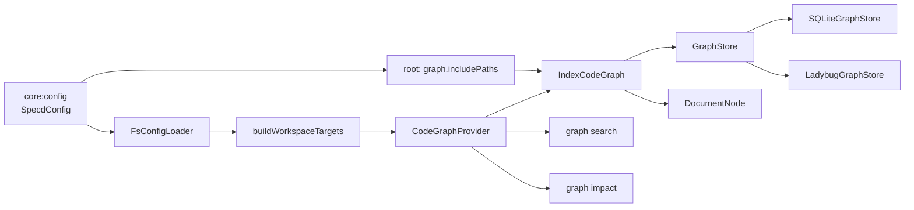

# Design: improve-code-graph-path-search

## Non-goals

- Add workflow-level implementation-scope controls such as `allowedCodePaths`. That belongs to a separate change because it affects change guards beyond code-graph.
- Introduce document-to-document or document-to-code relation families. This change makes documents searchable graph nodes, not structural relation producers.
- Preserve partial configured-project indexing. `graph index --workspace` is removed instead of being repaired.

## Affected areas

- `IndexCodeGraph` in `packages/code-graph/src/application/use-cases/index-code-graph.ts`
  Change: consume persisted spec semantics through `SpecRepository`, index project-global graph paths, and add textual fallback to `DocumentNode`.
  Callers: 2 direct via `CodeGraphProvider` and `createCodeGraphProvider` · Risk: LOW
  Note: low caller count, but this is the central write path and therefore the main semantic risk area.

- `CodeGraphProvider` in `packages/code-graph/src/composition/code-graph-provider.ts`
  Change: expose document queries/search and move file/symbol selector normalization into code-graph-owned entry points.
  Callers: 1 direct factory path · Risk: LOW
  Note: safe to evolve as long as the existing graph CLI contract keeps working.

- `GraphStore` in `packages/code-graph/src/domain/ports/graph-store.ts`
  Change: extend the abstract contract with `DocumentNode` persistence/query/search operations and exact-match-aware search semantics.
  Callers/dependents: 5 direct spec dependents, 6 affected specs from graph impact · Risk: MEDIUM
  Note: this is the backend boundary; every store implementation and traversal/search caller depends on it.

- `SQLiteGraphStore` in `packages/code-graph/src/infrastructure/sqlite/sqlite-graph-store.ts`
  Change: persist/search documents, index spec ids in FTS, and boost exact spec/symbol/document matches.
  Callers: backend selected by default composition path · Risk: MEDIUM
  Note: built-in default backend, so any regression here affects the normal CLI path immediately.

- `LadybugGraphStore` in `packages/code-graph/src/infrastructure/ladybug/ladybug-graph-store.ts`
  Change: preserve parity with the abstract graph-store changes for documents and exact-match-aware search.
  Callers: explicit backend selection only · Risk: MEDIUM
  Note: lower runtime exposure than SQLite, but the abstract contract requires parity.

- `buildWorkspaceTargets` in `packages/cli/src/commands/graph/build-workspace-targets.ts`
  Change: stop reading `spec-lock.json`; only build repository-backed spec artifact/metadata targets plus graph path config.
  Callers: graph indexing CLI path · Risk: MEDIUM
  Note: this file currently leaks graph semantics into CLI composition; removing that leakage is part of the change.

- `SpecRepository` in `packages/core/src/application/ports/spec-repository.ts`
  Change: replace raw sidecar-shaped `readSpecLock` / `saveSpecLock` APIs with semantic persisted-spec operations and a stable reusable spec hash contract.
  Callers/dependents: 44 direct dependents, 119 affected files from graph impact · Risk: CRITICAL
  Note: this is the highest semantic blast-radius change in the design because many core use cases and tests currently depend on the port surface.

- `FsSpecRepository` in `packages/core/src/infrastructure/fs/spec-repository.ts`
  Change: keep `spec-lock.json` as an internal storage detail while implementing the new persisted schema/dependency/implementation operations plus stable spec hash.
  Callers: all filesystem-backed spec workflows through the abstract port · Risk: CRITICAL
  Note: this is where the architecture correction lands physically; correctness depends on preserving existing archive-time behavior while removing the raw sidecar API from consumers.

- `resolveImpactFileSelectors` in `packages/cli/src/commands/graph/resolve-impact-file-selectors.ts`
  Change: either shrink to CLI validation only or disappear behind provider-owned normalization.
  Callers: `cli:graph-impact` · Risk: LOW
  Note: this is the current path-normalization seam and should not remain the source of truth.

- `registerGraphSearch`, `registerGraphImpact`, and `registerGraphIndex` in `packages/cli/src/commands/graph/*`
  Change: add document category handling, project-relative output rendering, broader symbol selector acceptance, and removal of `--workspace` from `graph index`.
  Callers: CLI entrypoint only · Risk: MEDIUM
  Note: user-facing behavior changes live here, but semantic ownership should stay in code-graph.

- `SpecdWorkspaceGraphConfig`, `SpecdWorkspaceConfig`, and `SpecdConfig` in `packages/core/src/application/specd-config.ts`
  Change: add `workspace.graph.allowedPaths`, add root-level `graph.includePaths` plus global `graph.excludePaths`, and reserve workspace name `root`.
  Callers: 11 direct dependents for `SpecdWorkspaceGraphConfig`, 45 affected specs from `core:config` impact · Risk: CRITICAL
  Note: this is the highest-risk area because config shape changes ripple through loader, kernel composition, archive, and CLI context setup.

- `FsConfigLoader` in `packages/core/src/infrastructure/fs/config-loader.ts`
  Change: validate and materialize the new graph config keys and reject workspace name `root`.
  Callers: all configured CLI/core entry points · Risk: CRITICAL
  Note: config loading is shared infrastructure; startup validation must stay deterministic and precise.

- `docs/cli/cli-reference.md`
  Change: document `--documents`, exact-match expectations, project-relative output, root-level `graph.includePaths`, global `graph.excludePaths`, workspace-level `graph.allowedPaths`, and removal of `graph index --workspace`.
  Callers: human/agent docs only · Risk: LOW
  Note: docs are mandatory because the CLI contract changes in visible ways.

## New constructs

- `packages/code-graph/src/domain/value-objects/document-node.ts`
  Shape:

  ```ts
  export interface DocumentNode {
    readonly path: string
    readonly configRelativePath: string
    readonly contentHash: string
    readonly content: string
    readonly workspace: string
  }
  ```

  Responsibility: represent textual non-code graph content without pretending it is a `FileNode`.
  Relationships: used by the abstract `GraphStore`, both store backends, search flows, and provider exports.

- `packages/code-graph/src/application/services/resolve-graph-selector.ts`
  Shape:

  ```ts
  export interface ResolvedFileSelector {
    readonly canonicalPath: string
    readonly configRelativePath: string
    readonly workspace: string
    readonly kind: 'file' | 'document'
  }

  export interface ResolvedSymbolSelector {
    readonly symbolId: string
    readonly filePath: string
    readonly matchKind: 'name' | 'qualified' | 'full-id'
  }

  export function resolveFileSelector(
    input: string,
    options: ResolveSelectorOptions,
  ): Promise<ResolvedFileSelector[]>

  export function resolveSymbolSelector(
    input: string,
    options: ResolveSelectorOptions,
  ): Promise<ResolvedSymbolSelector[]>
  ```

  Responsibility: normalize canonical, project-relative, and absolute selectors into graph identities.
  Relationships: consumed by `CodeGraphProvider` and graph CLI commands; depends on `GraphStore` lookups plus config/project roots.

- `packages/code-graph/src/application/services/is-textual-content.ts`
  Shape:

  ```ts
  export function isTextualContent(content: Uint8Array | string): boolean
  ```

  Responsibility: classify adapter-miss files into textual fallback vs binary skip.
  Relationships: called from `IndexCodeGraph` before deciding between `DocumentNode` and skip.

- `packages/code-graph/src/domain/value-objects/project-graph-paths.ts`
  Shape:

  ```ts
  export interface ProjectGraphPaths {
    readonly patterns: readonly string[]
  }
  ```

  Responsibility: normalize root-level graph path configuration before it enters indexing.
  Relationships: produced from `SpecdConfig.graph.includePaths`, consumed by `IndexOptions` and discovery.

- `packages/core/src/application/use-cases/list-workspaces.ts`
  Shape:

  ```ts
  export interface ProjectWorkspace {
    readonly name: string
    readonly codeRoot: string
    readonly isExternal: boolean
    readonly ownership: 'owned' | 'shared' | 'readOnly'
    readonly specRepo: SpecRepository
    readonly graphConfig?: SpecdWorkspaceGraphConfig
  }

  export class ListWorkspaces {
    execute(): Promise<ProjectWorkspace[]>
  }
  ```

  Responsibility: provide an orchestrated, rich view of all configured workspaces with their respective repositories and settings.
  Relationships: lives in `core`, consumes `SpecdConfig` and the `SpecRepository` map; exposed through `Kernel`.

## Approach

1. Extend core config and port.
   Add root-level `graph.paths`, add `workspace.graph.allowedPaths`, and reject workspace name `root` in `FsConfigLoader`. Add `count()` method to `SpecRepository` and its implementations.
   Add root-level `graph.includePaths`, add global `graph.excludePaths`, add `workspace.graph.allowedPaths`, and reject workspace name `root` in `FsConfigLoader`. Add `count()` to `SpecRepository`, plus a filesystem-backed `specsPath` capability for exclusion-aware discovery.

2. Introduce `ListWorkspaces` use case in `core`.
   Implement the new use case to orchestrate workspaces and repos. Update the `Kernel` to expose it. This centralizes the project structure logic and provides a single source of truth for both CLI and code-graph.

3. Move graph identity normalization into code-graph.
   Introduce provider-owned selector normalization for files and symbols. The CLI will continue to parse flags and shape output, but it will stop owning canonical path derivation rules. `graph impact` and `graph search` will call provider-level resolution/search methods instead of local path-rewrite helpers.

4. Introduce `DocumentNode` at the domain and store layers.
   Add the new node type, extend the `GraphStore` contract, then implement parity in SQLite and Ladybug. Search contract changes happen here too: exact spec id, exact symbol name/id, and exact document path must outrank broader text matches.

5. Rework indexing around the full configured project graph surface.
   Remove `--workspace` from the CLI and treat configured indexing as global. `IndexCodeGraph` will discover content using `ListWorkspaces` results (filtered by graph constraints), global `graph.excludePaths`, synthetic exclusions derived from filesystem-backed repository `specsPath`, and project-global `graph.includePaths`. Project-global discovery must not duplicate files already owned by a workspace `codeRoot`.

6. Move spec metadata extraction and sidecar loading into `IndexCodeGraph`.
   `WorkspaceIndexTarget` will be updated to include the `specRepo: SpecRepository` from `ProjectWorkspace`. `IndexCodeGraph` will now directly consume `specRepo.list()`, `specRepo.metadata()`, and `specRepo.artifact()` to build its internal representation of specs. This shifts the semantic responsibility of "how to read a spec" from the CLI's `buildWorkspaceTargets` into the indexer.

7. Replace raw `readSpecLock`/`saveSpecLock` with semantic persisted-spec operations in `SpecRepository`.
   Remove the raw sidecar APIs from the public port contract and replace them with semantic read operations (`readPersistedSchema`, `readPersistedDependsOn`, `readPersistedImplementation`, `specHash`) plus write operations. Keep `spec-lock.json` as an internal storage detail. Migrate all production callers.

8. Update CLI presentation and docs last.
   After semantics live in code-graph and orchestration in core, update the CLI commands to consume the new unified surfaces. Update `docs/cli/cli-reference.md`.

## Key decisions

- **Introduce `ListWorkspaces` in `core`** → centralizes the orchestration of project structure. Any adapter (CLI, API, IDE) now uses the same logic to understand the workspace-repository relationship, preventing logic duplication and drift.
  **Alternatives rejected** → keeping this logic in the CLI makes it inaccessible to other delivery mechanisms; passing the full `Kernel` to other packages violates structural boundaries.

- **Add `count()` to `SpecRepository`** → improves indexing progress UX by allowing the indexer to know the total spec count upfront without loading all lightweight specs into memory prematurely.
  **Alternatives rejected** → relying purely on `.list().length` is less intent-revealing and requires allocating an array of all specs just to get the length.

- **Model documents as a new node family, not as empty files** → `FileNode` today means parser-recognized code with symbol semantics.
  **Alternatives rejected** → indexing unsupported/textual content as `FileNode` would pollute traversal/search semantics and make code/document queries less coherent.

- **Move selector normalization and `spec-lock` coverage derivation into code-graph** → both are graph semantics, not CLI presentation concerns.
  **Alternatives rejected** → keeping the logic in CLI duplicates behavior across commands and makes non-CLI consumers of `@specd/code-graph` incomplete by default.

- **Keep `spec-lock.json` behind the repository boundary** → raw sidecar APIs are a filesystem storage leak, not a stable application contract.
  **Alternatives rejected** → letting `@specd/code-graph` parse `spec-lock`, or exposing `readSpecLock` / `saveSpecLock` directly from the port, would preserve the same architectural leak under a different caller.

- **Remove partial configured-project indexing instead of repairing it** → current single-workspace indexing can degrade cross-workspace relation fidelity.
  **Alternatives rejected** → preserving `--workspace` would require a more complex persisted cross-workspace symbol baseline and still keeps users on a partially coherent graph mode.

- **Use graph config as a general indexing surface, not a document-only one** → `graph.includePaths` and `workspace.graph.allowedPaths` may contain code or text, and classification must happen after discovery.
  **Alternatives rejected** → treating those keys as document-only would immediately fail the `dev/scripts/**` and unsupported-language fallback use cases the change is meant to enable.

- **Exclude filesystem-backed spec roots from file/document discovery** → spec artifacts must enter the graph once, through spec indexing, not again as documents.
  **Alternatives rejected** → letting discovery walk `specsPath` duplicates content between `SpecNode` and `DocumentNode` and can also create conflicting `workspace:`/`root:` ownership for the same physical file.

## readSpecLock / saveSpecLock migration

The design removes `readSpecLock` and `saveSpecLock` from the `SpecRepository` public contract and replaces them with semantic persisted-spec operations. This is the highest blast-radius change in the design (CRITICAL risk, 44 direct dependents, 119 affected files).

### New port operations

| Operation                     | Signature                                        | Purpose                                                                                                        |
| ----------------------------- | ------------------------------------------------ | -------------------------------------------------------------------------------------------------------------- |
| `readPersistedSchema`         | `(spec) → { name, version } \| null`             | Read the persisted schema identity for a spec                                                                  |
| `readPersistedDependsOn`      | `(spec) → readonly string[] \| null`             | Read the persisted dependency list for a spec                                                                  |
| `readPersistedImplementation` | `(spec) → readonly { file, symbols? }[] \| null` | Read the persisted implementation links for a spec                                                             |
| `specHash`                    | `(spec) → string \| null`                        | Stable hash representing persisted spec state; used by code-graph incremental indexing to skip unchanged specs |
| `savePersistedSchema`         | `(spec, content, options?) → void`               | Write the persisted schema identity for a spec; supports optimistic concurrency via `originalHash`             |
| `savePersistedDependsOn`      | `(spec, dependsOn, options?) → void`             | Write the persisted dependency list for a spec; supports optimistic concurrency via `originalHash`             |
| `savePersistedImplementation` | `(spec, entries, options?) → void`               | Write the persisted implementation links for a spec; supports optimistic concurrency via `originalHash`        |

These operations replace the raw `SpecLockData`-typed API with purpose-specific reads and writes. The `specHash` method is named generically (not `indexHash`) because it is reusable outside code-graph — any consumer that needs to detect whether persisted spec state has changed can use it. Each save operation is separate so callers can update individual semantic dimensions without touching the others, matching the read-side granularity.

### Production caller migration

Four production call sites currently use `readSpecLock`. No production code calls `saveSpecLock` directly (writes go through `SpecRepository.publish` which accepts `specLock` in `SpecPublication`). The migration plan for each caller:

1. **`load-persisted-spec-depends-on.ts:38`** — currently `repo.readSpecLock(spec)` to obtain `dependsOn`.
   Migration: replace with `repo.readPersistedDependsOn(spec)`. The fallback to `metadata().dependsOn` stays unchanged. The `source` discriminator loses the `'spec-lock'` value and gains a `'persisted'` value instead.

2. **`generate-spec-metadata.ts:140`** — currently `specRepo.readSpecLock(spec)` to project `implementation` into metadata shape.
   Migration: replace with `repo.readPersistedImplementation(spec)`. The `projectImplementationMetadata` helper is updated to accept the new return type directly instead of extracting from `SpecLockData`.

3. **`archive-change.ts:831`** — currently `args.publication.specRepo.readSpecLock(args.publication.spec)` to read the existing sidecar before building the publication sidecar.
   Migration: replace the single `readSpecLock` call with three semantic reads: `readPersistedSchema`, `readPersistedDependsOn`, `readPersistedImplementation`. The `_buildPublicationSpecLock` method and `_resolvePersistedDependsOn` method are updated to consume the new operation results. The `publish` path continues to accept `specLock` in `SpecPublication` (the adapter still needs the full sidecar shape for atomic write), but callers construct that shape from the semantic read results plus new values rather than from a raw `SpecLockData` object.

4. **`index-code-graph.ts:298`** — currently `target.specRepo.readSpecLock(repoSpec)` to obtain implementation links for `COVERS_FILE` / `COVERS_SYMBOL` derivation.
   Migration: replace with `repo.readPersistedImplementation(spec)` for coverage links and `repo.specHash(spec)` for incremental skip decisions. The `computeSpecGraphHash` function is updated to accept the individual semantic values instead of a `SpecLockData` object.

### Write path

`saveSpecLock` is not called by any production use case — writes to `spec-lock.json` happen exclusively through `SpecRepository.publish()` via the `specLock` field in `SpecPublication`. This field remains in `SpecPublication` because the adapter needs the full sidecar shape for atomic filesystem write during archive. However, the new separate save operations (`savePersistedSchema`, `savePersistedDependsOn`, `savePersistedImplementation`) are added for non-archive callers that need to update individual semantic dimensions without a full artifact publication (for example, integrity-maintenance flows that update schema identity or dependencies independently). Each `FsSpecRepository` save operation internally reads the current `spec-lock.json`, merges the updated field, and writes back atomically, preserving the same conflict detection semantics.

### Type changes

- `SpecLockData` import is removed from `spec-repository.ts` (the port). The type remains in `parse-spec-lock.ts` for internal adapter use.
- `SpecPublication.specLock` type remains `SpecLockData` because the adapter-internal serialization still uses that shape. Callers build it from semantic reads rather than from `readSpecLock`.
- New return types are introduced for the semantic read operations (inline interfaces in the port file, matching the structure already defined in `core:spec-lock` but without coupling to the raw sidecar schema).

### Internal method signature changes

Four internal methods that currently consume `SpecLockData` must change signature when the raw sidecar API is removed.

#### `archive-change.ts: _resolvePersistedDependsOn` (line 976)

Current:

```ts
private _resolvePersistedDependsOn(args: {
  readonly manifestDeps: readonly string[] | undefined
  readonly extractedDeps: readonly string[] | undefined
  readonly existingSpecLock: SpecLockData | null
  readonly metadataDeps: readonly string[] | undefined
}): readonly string[]
```

The method only reads `existingSpecLock.dependsOn` (line 986). Post-migration:

```ts
private _resolvePersistedDependsOn(args: {
  readonly manifestDeps: readonly string[] | undefined
  readonly extractedDeps: readonly string[] | undefined
  readonly persistedDependsOn: readonly string[] | null
  readonly metadataDeps: readonly string[] | undefined
}): readonly string[]
```

The `persistedDependsOn` value comes from `repo.readPersistedDependsOn(spec)` rather than `existingSpecLock.dependsOn`. The fallback chain logic stays identical.

#### `archive-change.ts: _buildPublicationSpecLock` (line 1077)

Current:

```ts
private _buildPublicationSpecLock(
  existingSpecLock: SpecLockData | null,
  schema: Schema,
  dependsOn: readonly string[],
  implementation: readonly MaterializedImplementationLink[],
): SpecLockData
```

The method reads `existingSpecLock.schema` (line 1085) and `existingSpecLock.originalHash` (lines 1091-1093) to preserve them in the new sidecar. Post-migration:

```ts
private _buildPublicationSpecLock(
  persistedSchema: { readonly name: string; readonly version: number } | null,
  originalHash: string | null,
  schema: Schema,
  dependsOn: readonly string[],
  implementation: readonly MaterializedImplementationLink[],
): SpecLockData
```

When `persistedSchema` is non-null, the method uses it for `schema` and includes `originalHash` when present. When null, it derives `schema` from the `Schema` argument (same as current `existingSpecLock === null` branch). The return type stays `SpecLockData` because the result feeds into `SpecPublication.specLock`.

The `sidecarActive` guard at line 833-835 currently checks `existingSpecLock !== null || _isStructurallyCompatiblePreparedArtifacts(...)`. Post-migration this becomes a check on whether any of the three semantic reads returned non-null, or equivalently whether `readPersistedSchema(spec) !== null` (presence of a persisted schema indicates an active sidecar).

#### `archive-change.ts: PreparedArchivePublication` (line 134)

Current fields referencing `SpecLockData`:

```ts
readonly existingSpecLock: SpecLockData | null
readonly publicationSpecLock: SpecLockData | undefined
```

Post-migration:

```ts
readonly persistedSchema: { readonly name: string; readonly version: number } | null
readonly persistedDependsOn: readonly string[] | null
readonly persistedImplementation: readonly { file: string; symbols?: readonly string[] }[] | null
readonly originalHash: string | null
readonly publicationSpecLock: SpecLockData | undefined
```

`publicationSpecLock` stays as `SpecLockData | undefined` because it flows into `SpecPublication.specLock`. The other three fields plus `originalHash` replace `existingSpecLock`.

#### `generate-spec-metadata.ts: projectImplementationMetadata` (line 161)

Current:

```ts
function projectImplementationMetadata(
  specId: string,
  specLock: SpecLockData,
): NonNullable<SpecMetadata['implementation']>
```

The function iterates `specLock.implementation` (line 168). Post-migration:

```ts
function projectImplementationMetadata(
  specId: string,
  implementation: readonly { file: string; symbols?: readonly string[] }[],
): NonNullable<SpecMetadata['implementation']>
```

The caller at line 140-144 changes from:

```ts
const specLock = await specRepo.readSpecLock(spec)
// ...
...(specLock !== null ? { implementation: projectImplementationMetadata(input.specId, specLock) } : {})
```

to:

```ts
const persistedImpl = await specRepo.readPersistedImplementation(spec)
// ...
...(persistedImpl !== null ? { implementation: projectImplementationMetadata(input.specId, persistedImpl) } : {})
```

#### `index-code-graph.ts: computeSpecGraphHash` (line 309)

Current:

```ts
function computeSpecGraphHash(spec: SpecNode, specLock: SpecLockData | null): string
```

The function uses `specLock?.implementation` (line 311) to normalize implementation entries into the hash input. Post-migration:

```ts
function computeSpecGraphHash(
  spec: SpecNode,
  implementation: readonly { file: string; symbols?: readonly string[] }[] | null,
): string
```

`SpecNode` already carries `dependsOn` from metadata, so the hash computation doesn't lose any input dimension. The `specHash` repository operation is a separate, simpler hash that covers only the persisted sidecar state; it is used for incremental skip decisions, not for computing the full graph hash. `computeSpecGraphHash` continues to hash spec content + dependsOn + implementation for its own incremental diffing purposes, but receives implementation directly instead of from a `SpecLockData` object.

### FsSpecRepository read-merge-write cycle

Each of the three save operations (`savePersistedSchema`, `savePersistedDependsOn`, `savePersistedImplementation`) internally performs a read-merge-write cycle against `spec-lock.json`:

1. Read the current `spec-lock.json` via the existing private `readSpecLock` (kept as an adapter-internal method, not removed from the adapter class)
2. Merge the updated field into the existing `SpecLockData` object
3. Write back atomically with conflict detection against `originalHash`

This means `FsSpecRepository.readSpecLock` (the private adapter method) is **not** removed — only the public port-level `readSpecLock` is removed. The adapter retains its internal sidecar read/write for its own implementation of the semantic operations. The separate save operations are not used by the archive flow (which continues to write the full sidecar atomically through `publish`), so there is no double-write risk.

### PersistedSpecDepsResult source discriminator

`load-persisted-spec-depends-on.ts:10` currently defines:

```ts
readonly source: 'spec-lock' | 'metadata' | 'empty'
```

The `'spec-lock'` discriminator value is renamed to `'persisted'` to reflect that the source is now a repository semantic operation rather than a raw file parse. This is a string literal change only — no behavioral change.

### Test migration

The test helper `readSpecLock` in `packages/core/test/application/use-cases/helpers.ts:566` has 45 direct dependents across all core use-case tests. Similarly `saveSpecLock` at line 573 has 45 dependents. Migration strategy:

- Update the shared test doubles first (helpers and mock/stub factories) to expose the new semantic operations instead of raw sidecar stubs.
- Each downstream test suite that previously stubbed `readSpecLock`/`saveSpecLock` will stub `readPersistedSchema`, `readPersistedDependsOn`, `readPersistedImplementation`, `specHash`, `savePersistedSchema`, `savePersistedDependsOn`, and `savePersistedImplementation` instead.
- The `spec-reference-resolver.spec.ts` shared test file (which defines `readSpecLock` at line 67 and `saveSpecLock` at line 71) is updated to exercise the new semantic operations.
- The `workspace-indexing.spec.ts` in code-graph (which calls `readSpecLock` at line 254) is updated to use `readPersistedImplementation` and `specHash`.
- Tests that currently set up `existingSpecLock: SpecLockData` objects in `PreparedArchivePublication` fixtures must be updated to provide the individual `persistedSchema`, `persistedDependsOn`, `persistedImplementation`, and `originalHash` fields instead.

## Trade-offs

- `[Config blast radius]` → `core:config` is a CRITICAL integration point with 45 affected specs and 49 affected files in graph impact. Mitigation: keep the new keys additive, keep validation errors explicit, and isolate semantic consumers to graph-related paths only.

- `[SpecRepository blast radius]` → `core:spec-repository-port` is a CRITICAL integration point with 44 direct dependents and 119 affected files in graph impact. Mitigation: introduce semantic replacement operations in the port first, update filesystem implementation second, and migrate existing consumers away from raw sidecar APIs before deleting compatibility code.

- `[Backend parity cost]` → SQLite and Ladybug both need document persistence and exact-match-aware search. Mitigation: define the behavior once in `GraphStore`, implement SQLite first, then mirror parity into Ladybug.

- `[Search relevance complexity]` → combining exact-match boosts with BM25 can become backend-specific quickly. Mitigation: define exact-match precedence in the abstract contract and keep the implementation backend-local.

- `[Force reindex requirement]` → store schema/search changes and new node kinds likely require a destructive rebuild. Mitigation: explicitly document the reindex requirement in implementation notes and verification.

## Spec impact

### `code-graph:graph-store`

- Direct dependents from graph impact: `cli:graph-impact`, `code-graph:composition`, `code-graph:indexer`, `code-graph:ladybug-graph-store`, `code-graph:sqlite-graph-store`, `code-graph:traversal`
- Assessment:
  - `composition`, `indexer`, `sqlite-graph-store`, and `ladybug-graph-store` already need spec changes and are in scope.
  - `cli:graph-impact` is already in scope because selector normalization and file rendering change.
  - `code-graph:traversal` is impacted semantically by the richer store contract, but this change does not alter traversal algorithms or relation families. Existing traversal requirements remain satisfied; no delta is required there.

### `core:config`

- Direct and transitive dependents from graph impact include a large portion of `core` and several CLI specs.
- Assessment:
  - The graph-related spec dependents already pulled into scope are `code-graph:composition`, `code-graph:indexer`, `code-graph:ladybug-graph-store`, `code-graph:sqlite-graph-store`, and `cli:graph-impact`.
  - Other dependents such as archive/draft/discarded/config-loader specs are not behaviorally changed by this design because the new config keys are additive and graph-specific. They consume the same validated config object but do not gain new requirements of their own.

### Scope conclusion

The ripple analysis did not reveal any additional specs that require requirement deltas beyond the 13 already added to this change. The new addition is `core:spec-repository-port`, which is now required because the repository boundary itself is part of the behavior change.

## Dependency map



```
┌──────────────────────┐
│ core:config          │
│ SpecdConfig          │
│ [CRITICAL ripple]    │
└──────────┬───────────┘
           │
           ▼
┌──────────────────────┐      ┌──────────────────────┐
│ FsConfigLoader       │─────▶│ buildWorkspaceTargets│
└──────────┬───────────┘      └──────────┬───────────┘
           │                              │
           │                              ▼
           │                    ┌──────────────────────┐
           └───────────────────▶│ CodeGraphProvider    │
                                │ [LOW fan-in]         │
                                └───────┬───────┬──────┘
                                        │       │
                                        │       ├──────────────▶ graph search
                                        │       └──────────────▶ graph impact
                                        ▼
                              ┌──────────────────────┐
                              │ IndexCodeGraph       │
                              │ [central write path] │
                              └───────┬───────┬──────┘
                                      │       │
                                      │       └──────────────▶ DocumentNode
                                      ▼
                              ┌──────────────────────┐
                              │ GraphStore           │
                              │ [MEDIUM contract]    │
                              └───────┬────────┬─────┘
                                      │        │
                                      ▼        ▼
                               SQLite backend  Ladybug backend
```

## Migration / Rollback

- Migration:
  - implement schema/store changes
  - run a force reindex once the new graph schema lands
  - update docs so users know `graph index --workspace` is gone and `--documents` exists
- Rollback:
  - revert the config/store/provider changes together
  - remove newly added `graph.includePaths` / `graph.excludePaths` / `graph.allowedPaths` usage from project config if it was adopted
  - force reindex again to rebuild the graph on the previous schema

## Testing

Automated tests:

- `packages/cli/test/graph-search.spec.ts`
  Covers exact spec-id-first ranking, `--documents`, and project-relative file rendering in search output.
- `packages/cli/test/graph-impact.spec.ts`
  Covers project-relative and absolute file selectors, qualified symbol selectors, and project-relative output rendering.
- `packages/cli/test/graph-index.spec.ts`
  Covers removal of `--workspace`, configured global indexing, and CLI handoff without `spec-lock` enrichment.
- `packages/code-graph/test/index-code-graph.spec.ts`
  Covers `graph.includePaths`, global `graph.excludePaths`, workspace `graph.allowedPaths`, spec-root exclusion, textual fallback to `DocumentNode`, binary skip, and persisted coverage links.
- `packages/code-graph/test/graph-store/sqlite-graph-store.spec.ts`
  Covers document persistence/search plus exact-match-first search behavior in SQLite.
- `packages/code-graph/test/graph-store/ladybug-graph-store.spec.ts`
  Covers document persistence/search parity plus exact-match-first behavior in Ladybug.
- `packages/core/test/infrastructure/fs/config-loader.spec.ts`
  Covers `graph.includePaths`, global `graph.excludePaths`, `workspace.graph.allowedPaths`, and rejection of workspace name `root`.

Manual / E2E verification:

- Run `node packages/cli/dist/index.js graph index --force --format text` and confirm the command indexes the full configured graph surface without any `--workspace` mode.
- Run `node packages/cli/dist/index.js graph search "core:change" --specs --format text` and confirm `core:change` is first.
- Run `node packages/cli/dist/index.js graph search "docs/adr/graph-search.md" --documents --format text` and confirm the exact path-matching document is first.
- Run `node packages/cli/dist/index.js graph impact --file packages/core/src/domain/entities/change.ts --format text` and confirm file paths render project-relative.
- Run `node packages/cli/dist/index.js graph impact --symbol "packages/core/src/domain/entities/change.ts:invalidate" --format text` and confirm the selector resolves without requiring canonical workspace prefix.
- Inspect `docs/cli/cli-reference.md` and confirm the graph section documents `--documents`, root-level `graph.includePaths`, global `graph.excludePaths`, workspace-level `graph.allowedPaths`, project-relative rendering, and removal of `graph index --workspace`.

Global constraints check:

- Architecture: all new logic stays in application/domain/infrastructure boundaries; no CLI-owned graph semantics.
- Conventions: ESM-only, named exports, no default exports, no `any`.
- Testing: add focused tests under existing package test layout.
- Docs: update `docs/cli/cli-reference.md`; add succinct JSDoc on new public types and selector-normalization services.
