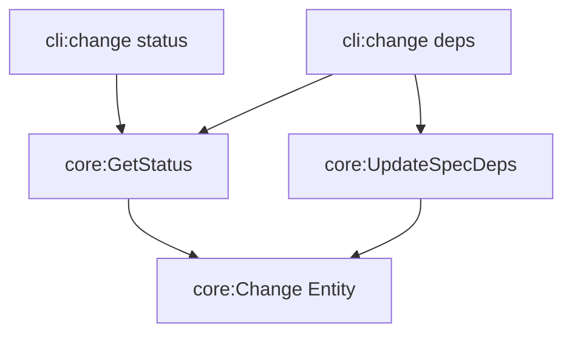

# Design: improve-change-dependency-visibility

## Non-goals

- Visually rendering the dependency graph as a tree or diagram in the CLI (keeping it as a simple bulleted list for now).
- Automatic discovery of dependencies from spec content (this remains a manual declaration via `change deps`).

## Affected areas

### `@specd/core`

- `GetStatusResult` in `packages/core/src/application/use-cases/get-status.ts`
  Change: add `specDependsOn: Record<string, string[]>` to the interface.
  Callers: CLI `change status` command.
  Risk: LOW.

- `GetStatus` class in `packages/core/src/application/use-cases/get-status.ts`
  Change: update `execute()` to project the `Change` entity's `specDependsOn` map into the result record.
  Callers: CLI `change status` command.
  Risk: LOW.

### `@specd/cli`

- `status.ts` in `packages/cli/src/commands/change/status.ts`
  Change:
  - Update `Toon` and `JSON` output to include the new `specDependsOn` field from the use case result.
  - Update `Text` output:
    - Remove the redundant "specs:" line at the top level (since all specs are listed with their dependencies).
    - Add a "specs and dependencies" section after the DAG/details, listing all specs in the change and their dependencies.
      Risk: LOW.

- `deps.ts` in `packages/cli/src/commands/change/deps.ts`
  Change:
  - Make `specId` optional in the command signature.
  - Add logic to handle the case where no modification flags are provided:
    - If `specId` is provided: display dependencies for that specific spec.
    - If `specId` is NOT provided: display dependencies for ALL specs in the change (using `GetStatus` to retrieve the data).
  - Update error handling to throw if modification flags are used without a `specId`.
    Risk: LOW.

## Approach

1.  **Core Update**: Enhance `GetStatus` to expose the declared spec dependencies. Since `Change` already has `specDependsOn` as a `Map`, we'll convert it to a plain `Record<string, string[]>` for the `GetStatusResult` to ensure easy serialization.
2.  **CLI Status**: Update the `change status` command to project this new data. In text mode, we'll iterate through all `change.specIds` and look up their deps in `specDependsOn`, rendering `(none)` if empty.
3.  **CLI Deps**: Refactor the `change deps` command. We'll use a `GetStatus` call to load the change data first. If no modification options (`--add`, `--remove`, `--set`) are present, we'll enter "display mode" and print the list(s) as required. If modification options ARE present but `specId` is missing, we'll exit with an error.

## Key decisions

- **Decision** → Use `GetStatus` in the `change deps` command for listing mode.
- **Rationale** → `GetStatus` is already the authoritative source for change projections and provides a consistent view of the change's specs and dependencies.

- **Decision** → List ALL specs in the change in the dependencies section, even those with no deps.
- **Rationale** → This gives the user/agent a complete picture of the change scope and confirms that a spec has "no dependencies" rather than being "missing" from the list.

## Spec impact

- `cli:change-status`: Modified to require the new section.
- `cli:change-deps`: Modified to support optional `specId` and listing/display modes.
- `core:get-status`: Modified to include `specDependsOn` in the result.
- `core:update-spec-deps`: Unaffected in logic, but mentioned in proposal as a participant in the `change deps` ecosystem.

## Dependency map



```
┌──────────────────┐       ┌──────────────────┐
│ cli:change status│──────▶│ core:GetStatus   │
└──────────────────┘       └────────┬─────────┘
                                    │
┌──────────────────┐       ┌────────▼─────────┐
│ cli:change deps  │──────▶│ core:Change      │
└────────┬─────────┘       │      Entity      │
         │                 └────────▲─────────┘
         │                          │
         │         ┌────────────────┴──┐
         └────────▶│ core:UpdateSpec   │
                   │      Deps         │
                   └───────────────────┘
```

## Testing

### Automated tests

- **`packages/core/test/application/use-cases/get-status.spec.ts`**:
  - Add test case ensuring `specDependsOn` is correctly projected from the `Change` entity into the `GetStatusResult`.

- **`packages/cli/test/commands/change/status.spec.ts`**:
  - Add integration tests for `change status` verifying the "spec dependencies" section appears in text mode and the `specDependsOn` field exists in JSON mode.

- **`packages/cli/test/commands/change/deps.spec.ts`**:
  - Add integration tests for `change deps <name>` (listing all).
  - Add integration tests for `change deps <name> <specId>` (displaying one).
  - Add test case for error when modification flags are used without `specId`.

### Manual / E2E verification

1. Create a test change: `specd changes create test-deps --spec core:config --spec core:workspace`
2. Run `specd changes status test-deps`: Verify "spec dependencies" section shows both specs with `(none)`.
3. Run `specd changes deps test-deps`: Verify same output as above.
4. Add a dependency: `specd changes deps test-deps core:config --add core:storage`
5. Run `specd changes status test-deps`: Verify `core:config` shows `core:storage` as dependency.
6. Run `specd changes deps test-deps core:config`: Verify it shows only `core:config` deps.
7. Verify JSON output: `specd changes status test-deps --format json` should have `specDependsOn`.
