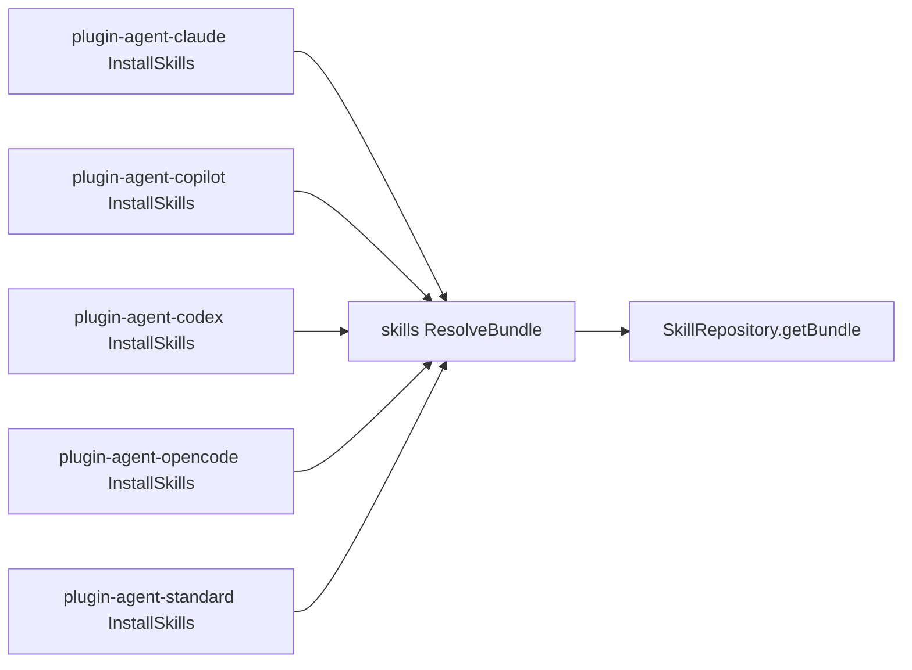

# Design: route-agent-plugin-installs-through-resolve-bundle

## Non-goals

- Redesigning the skill template contract, capability model, or frontmatter schema.
- Changing uninstall behavior beyond keeping it aligned with the existing
  `sharedFolder` resolution rules.
- Removing plugin-local `shared-folder.ts` helpers from uninstall flows.

## Affected areas

- `ResolveBundle` in [packages/skills/src/application/use-cases/resolve-bundle.ts](/Users/monki/Documents/Proyectos/specd/packages/skills/src/application/use-cases/resolve-bundle.ts:40)
  Change: remains the canonical bundle-resolution use case and becomes the required
  path for agent-plugin installs whenever built-in render defaults are needed.
  Callers: current graph shows only local test dependents for the symbol itself.
  Risk: LOW.

- `InstallSkills` in [packages/plugin-agent-claude/src/application/use-cases/install-skills.ts](/Users/monki/Documents/Proyectos/specd/packages/plugin-agent-claude/src/application/use-cases/install-skills.ts:17)
  Change: stop calling `SkillRepository.getBundle(...)` directly; instantiate and use
  `ResolveBundle` for bundle resolution.
  Impact: adapter-local install logic; no cross-workspace callers surfaced by the graph.

- `InstallSkills` in [packages/plugin-agent-copilot/src/application/use-cases/install-skills.ts](/Users/monki/Documents/Proyectos/specd/packages/plugin-agent-copilot/src/application/use-cases/install-skills.ts:17)
  Change: same refactor as Claude.
  Impact: adapter-local install logic.

- `InstallSkills` in [packages/plugin-agent-codex/src/application/use-cases/install-skills.ts](/Users/monki/Documents/Proyectos/specd/packages/plugin-agent-codex/src/application/use-cases/install-skills.ts:17)
  Change: same refactor as Claude.
  Impact: adapter-local install logic.

- `InstallSkills` in [packages/plugin-agent-opencode/src/application/use-cases/install-skills.ts](/Users/monki/Documents/Proyectos/specd/packages/plugin-agent-opencode/src/application/use-cases/install-skills.ts:17)
  Change: same refactor as Claude.
  Impact: adapter-local install logic.

- `InstallSkills` in [packages/plugin-agent-standard/src/application/use-cases/install-skills.ts](/Users/monki/Documents/Proyectos/specd/packages/plugin-agent-standard/src/application/use-cases/install-skills.ts:17)
  Change: same refactor as Claude.
  Impact: adapter-local install logic.

- Plugin-local shared-folder helpers such as [packages/plugin-agent-claude/src/application/use-cases/shared-folder.ts](/Users/monki/Documents/Proyectos/specd/packages/plugin-agent-claude/src/application/use-cases/shared-folder.ts:1)
  Change: remain responsible for the absolute filesystem destination used by install
  and uninstall. They no longer justify passing the default `sharedFolder` into
  template render context from the plugin.
  Impact: low; helper semantics stay stable.

- Plugin install tests under `packages/plugin-agent-*/test/install-skills.spec.ts`
  Change: update assertions to verify the bundle path goes through `ResolveBundle`
  semantics rather than a direct repository bundle call.
  Impact: medium because all five plugin packages need aligned fixtures.

## New constructs

No new files, classes, or domain types are required.

The change should reuse the existing `ResolveBundle` class exported by
`@specd/skills`:

```ts
class ResolveBundle {
  constructor(repository: SkillRepository)

  execute(input: ResolveBundleInput): Promise<ResolveBundleOutput>
}
```

Plugin install flows will instantiate this use case with the same repository instance
they already create for `list()` and `get()`.

## Approach

1. Keep plugin-local repository creation:
   - plugins still call `createSkillRepository()`
   - plugins still use `repository.list()` to derive the default requested skill set
   - plugins may still use `repository.get(skillName)` to obtain description data for
     fallback frontmatter generation and missing-skill checks

2. Replace direct bundle resolution:
   - current pattern:
     - `repository.getBundle(skillName, context)`
   - target pattern:
     - `const resolveBundle = new ResolveBundle(repository)`
     - `const { bundle } = await resolveBundle.execute({ name: skillName, config, context })`

3. Centralize default `sharedFolder` handling:
   - plugin install flows must stop injecting the default shared folder into
     `context.variables`
   - if the caller provided `options.variables.sharedFolder`, the plugin may pass that
     override in `context.variables.sharedFolder`
   - if no override exists, `context.variables.sharedFolder` must be omitted and
     `ResolveBundle` will inject the default from `config`

4. Keep plugin-local absolute-path resolution:
   - install and uninstall still need an absolute shared directory to write/remove files
   - plugin-local `resolveSharedFolder(projectRoot, configPath, sharedFolder?)` stays
     in place for filesystem targeting
   - the helper remains the source of truth for the physical shared directory path
     inside each plugin package

5. Preserve frontmatter preparation in plugins:
   - plugin-specific frontmatter maps stay in each plugin package
   - `toTemplateVariables(frontmatter)` stays plugin-local
   - capability identifiers remain plugin-local through `buildCapabilities(...)`
   - only bundle resolution moves behind `ResolveBundle`

6. Keep `ResolveBundle` itself thin:
   - no new repository responsibilities
   - no plugin-specific frontmatter logic
   - continue preparing built-ins and delegating actual bundle rendering to the
     repository

7. Update tests to match the new boundary:
   - plugin tests must verify that default `sharedFolder` still appears in rendered
     results even when plugins do not inject it manually
   - tests should fail if the install flow regresses to direct repository bundle
     resolution semantics

8. Documentation handling:
   - no new end-user documentation is required if public docs do not describe plugin
     internal wiring
   - if any contributor-facing docs mention plugin install flows preparing built-ins
     directly, update them to reflect `ResolveBundle` as the canonical path

## Key decisions

**Use `ResolveBundle` directly from plugins** -> keeps the architectural boundary
already present in `@specd/skills` and avoids inventing another wrapper.
**Alternatives rejected** -> adding a new plugin-specific helper in `@specd/skills`
would duplicate the purpose of `ResolveBundle` without adding a new domain concept.

**Keep repository access for `list()` and `get()` in plugins** -> plugin install flows
still need skill discovery and description lookup before bundle resolution.
**Alternatives rejected** -> pushing discovery entirely behind `ResolveBundle` would
expand its responsibility from bundle resolution into install orchestration.

**Keep plugin-local `shared-folder.ts` helpers** -> install/uninstall need absolute
filesystem destinations, which `ResolveBundle` intentionally does not expose.
**Alternatives rejected** -> moving absolute-path handling into `@specd/skills` would
mix rendering context logic with plugin-specific file placement concerns.

## Trade-offs

- [Two sources still compute `sharedFolder`] -> plugin helpers compute the physical
  absolute path while `ResolveBundle` computes the render-context value. Mitigation:
  keep both computations derived from the same inputs (`projectRoot`, `configPath`,
  optional override) and cover them with install tests.

- [Five parallel plugin edits] -> the same refactor must be applied consistently across
  five packages. Mitigation: use the same integration pattern and assertion shape in
  all plugin tests.

- [Temporary direct bug fix may be reverted] -> the recent hotfix forced plugins to
  inject default `sharedFolder` manually. Mitigation: replace that workaround in the
  same change so the canonical path becomes structural rather than incidental.

## Spec impact

### `skills:resolve-bundle`

- Direct dependents in this change: all five plugin specs are being updated to depend
  on `skills:resolve-bundle`
- No additional downstream spec changes are required beyond the plugin specs already
  in scope

### `plugin-agent-claude:plugin-agent`

- No further dependent specs were identified that require requirement updates

### `plugin-agent-copilot:plugin-agent`

- No further dependent specs were identified that require requirement updates

### `plugin-agent-codex:plugin-agent`

- No further dependent specs were identified that require requirement updates

### `plugin-agent-opencode:plugin-agent`

- `plugin-agent-standard:plugin-agent` already depends on this spec, but the current
  change does not alter Open Code frontmatter or uninstall semantics; it only changes
  the bundle-resolution boundary, which standard also updates directly in its own spec

### `plugin-agent-standard:plugin-agent`

- No further dependent specs were identified that require requirement updates

## Dependency map



```text
┌──────────────────────────┐
│ Claude InstallSkills     │
└──────────────┬───────────┘
               │
┌──────────────────────────┐
│ Copilot InstallSkills    │
└──────────────┬───────────┘
               │
┌──────────────────────────┐
│ Codex InstallSkills      │
└──────────────┬───────────┘
               │
┌──────────────────────────┐
│ OpenCode InstallSkills   │
└──────────────┬───────────┘
               │
┌──────────────────────────┐
│ Standard InstallSkills   │
└──────────────┬───────────┘
               │
               ▼
        ┌───────────────┐
        │ ResolveBundle │
        │   [LOW risk]  │
        └───────┬───────┘
                │
                ▼
      ┌──────────────────────┐
      │ SkillRepository      │
      │ .getBundle(...)      │
      └──────────────────────┘
```

## Migration / Rollback

- Migration: no persisted data migration is required; reinstalling skills after the
  code change is sufficient to regenerate installed markdown through the canonical
  path.
- Rollback: revert plugin install flows to direct repository bundle calls and keep the
  existing plugin-local shared-folder workaround, understanding that future built-in
  render defaults may drift again.

## Testing

**Automated tests**

- Update [packages/skills/test/resolve-bundle.spec.ts](/Users/monki/Documents/Proyectos/specd/packages/skills/test/resolve-bundle.spec.ts:1)
  - keep coverage for built-in `sharedFolder`, `configPath`, and privacy-safe context
  - verify override handling still works when `sharedFolder` is passed explicitly

- Update plugin install tests:
  - [packages/plugin-agent-claude/test/install-skills.spec.ts](/Users/monki/Documents/Proyectos/specd/packages/plugin-agent-claude/test/install-skills.spec.ts:1)
  - [packages/plugin-agent-copilot/test/install-skills.spec.ts](/Users/monki/Documents/Proyectos/specd/packages/plugin-agent-copilot/test/install-skills.spec.ts:1)
  - [packages/plugin-agent-codex/test/install-skills.spec.ts](/Users/monki/Documents/Proyectos/specd/packages/plugin-agent-codex/test/install-skills.spec.ts:1)
  - [packages/plugin-agent-opencode/test/install-skills.spec.ts](/Users/monki/Documents/Proyectos/specd/packages/plugin-agent-opencode/test/install-skills.spec.ts:1)
  - [packages/plugin-agent-standard/test/install-skills.spec.ts](/Users/monki/Documents/Proyectos/specd/packages/plugin-agent-standard/test/install-skills.spec.ts:1)
  - each test suite should assert:
    - install still writes skill-local files to the runtime-specific directory
    - shared files still land in the resolved shared directory
    - default `sharedFolder` is present in rendered results without plugin-side default injection
    - the install flow no longer depends on direct repository `getBundle(...)` semantics

**Manual / E2E verification**

- Run targeted package tests for `@specd/skills` and all five `plugin-agent-*` packages
- Reinstall a representative skill for at least one runtime and inspect the generated
  `SKILL.md`
- Confirm:
  - `@{{sharedFolder}}/shared.md` does not remain unresolved
  - default shared references point at `.specd/config/skills/shared/shared.md`
  - explicit `sharedFolder` override still renders and installs consistently

## Open questions

None.
