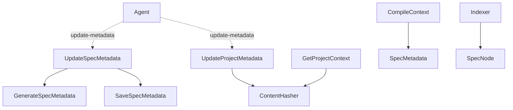

# Design: llm-optimized-metadata

## Affected areas

### `packages/core/src/domain/services/parse-metadata.ts`

- **`SpecMetadata` interface**: Add `optimizedDescription?: string` and `optimizedContext?: string`.
- **`specMetadataSchema` (lenient)**: Add `optimizedDescription: z.string().optional()` and `optimizedContext: z.string().optional()`.
- **`strictSpecMetadataSchema` (strict)**: Add `optimizedDescription: z.string().min(1).optional()` and `optimizedContext: z.string().min(1).optional()`.
- **`permissiveSpecMetadataSchema`**: Similar additions as optional fields.

### `packages/core/src/application/use-cases/compile-context.ts`

- Method `_renderSpec(metadata, mode)`:
  - If `config.llmOptimizedContext` is `true` AND `metadata.optimizedContext` is present and not empty, use `metadata.optimizedContext` as the full context string for that spec.
  - Fallback to current logic (joining `metadata.context`) if missing or empty.
- Method `execute(input)`:
  - When `config.llmOptimizedContext` is `true`, collect a `ContextWarning` if any spec included in the context is missing its `optimizedContext` field.
  - Also collect a warning if project-level optimization is missing or stale.

### `packages/core/src/application/use-cases/get-spec-context.ts`

- Method `_buildEntry(specId, mode)`:
  - Similar logic to `CompileContext`: prefer `metadata.optimizedContext` if `llmOptimizedContext` is enabled.

### `packages/core/src/application/use-cases/get-project-context.ts`

- Method `execute(input)`:
  - Add Step 0: Cache Verification.
  - If `input.config.llmOptimizedContext` is `true`:
    1. Read `{configPath}/project-metadata.json`.
    2. Verify `freshness` hashes:
       - Hash of `specd.yaml` (using `this._hasher`).
       - Hash of each file in `input.config.context` (if it's a file entry).
       - Metadata hash of every spec resolved by project patterns.
    3. If all match, return `optimized.context` as a single entry in `contextEntries`.
    4. If any mismatch or file missing, proceed to raw compilation AND add a `ContextWarning` of type `stale-optimization`.

### `packages/code-graph/src/domain/value-objects/spec-node.ts`

- Add `optimizedDescription?: string` to `SpecNode` interface and data structure.

### `packages/code-graph/src/application/use-cases/index-code-graph.ts`

- Method `_indexSpecs()`:
  - When mapping `SpecMetadata` to `SpecNode`, set `node.description = metadata.optimizedDescription ?? metadata.description`.
  - Fix `contentHash` computation: instead of `ws.specRepo.specHash()`, compute a hash from all content artifacts (excluding metadata).
  - Enforce artifact ordering: Ensure `spec.md` is concatenated first in the `SpecNode.content`, followed by other artifacts in alphabetical order.

## New constructs

### `ProjectMetadata` (Domain Service / Schema)

**Location**: `packages/core/src/domain/services/project-metadata.ts`

```typescript
export const projectMetadataSchema = z.object({
  version: z.literal(1),
  optimized: z.object({
    context: z.string(),
  }),
  freshness: z.object({
    algorithm: z.literal('sha256'),
    inputs: z.object({
      config: z.object({ path: z.string(), hash: z.string() }),
      contextFiles: z.array(z.object({ path: z.string(), hash: z.string() })),
      specMetadata: z.array(z.object({ id: z.string(), hash: z.string() })),
    }),
    combinedHash: z.string(),
  }),
  generated: z.object({
    at: z.string(), // ISO timestamp
  }),
})

export type ProjectMetadata = z.infer<typeof projectMetadataSchema>
```

### `UpdateSpecMetadata` Use Case

**Location**: `packages/core/src/application/use-cases/update-spec-metadata.ts`

```typescript
export interface UpdateSpecMetadataInput {
  workspace: string
  capabilityPath: string
  payload: {
    optimizedDescription?: string
    optimizedContext?: string
  }
}

export class UpdateSpecMetadata {
  constructor(
    private readonly _generateMetadata: GenerateSpecMetadata,
    private readonly _saveMetadata: SaveSpecMetadata,
  ) {}

  async execute(input: UpdateSpecMetadataInput) {
    // 1. Fresh extraction
    const deterministic = await this._generateMetadata.execute({
      workspace: input.workspace,
      capabilityPath: input.capabilityPath,
    })

    // 2. Merge
    const merged = {
      ...deterministic,
      ...input.payload,
      generatedBy: 'agent' as const,
    }

    // 3. Save
    return this._saveMetadata.execute({
      workspace: input.workspace,
      capabilityPath: input.capabilityPath,
      metadata: merged,
      force: true,
    })
  }
}
```

### `UpdateProjectMetadata` Use Case

**Location**: `packages/core/src/application/use-cases/update-project-metadata.ts`

- **Input**: `{ optimizedContext: string }`
- **Logic**:
  1. Resolve all current inputs (config path, context files, specs in project context).
  2. Compute SHA-256 hashes for each using `ContentHasher`.
  3. Construct the full `ProjectMetadata` object (mapping `input.optimizedContext` to `optimized.context`).
  4. Save atomically to `{configPath}/project-metadata.json`.

### CLI Commands

- `spec update-metadata <id>`:
  - Flag: `--file <path>`
  - Action: Reads partial payload, calls `UpdateSpecMetadata`.
- `project update-metadata`:
  - Flag: `--file <path>`
  - Action: Reads `{ "optimizedContext": "..." }`, calls `UpdateProjectMetadata`.
- `project metadata`:
  - Action: Reads and prints `project-metadata.json`.

## Approach

1.  **Schema and Types**: Update `parse-metadata.ts` and create `project-metadata.ts`.
2.  **Core Implementation**:
    - Implement `UpdateSpecMetadata` and `UpdateProjectMetadata`.
    - Update `GetProjectContext` with hashing/verification logic.
3.  **Consumption**: Update `CompileContext` and `GetSpecContext` to prefer optimized fields.
4.  **Indexing**: Update `code-graph` to store and use `optimizedDescription`.
5.  **CLI Implementation**: Create the 3 new commands and update existing context commands for warnings.

## Key decisions

**Decision** → `UpdateSpecMetadata` performs a fresh extraction.
**Rationale** → Ensures base metadata remains in sync with `spec.md`.

**Decision** → Cache invalidation in `GetProjectContext`.
**Rationale** → Ensures optimized project summary doesn't drift from source files/specs.

## Dependency map



## Testing

### Automated tests

- `update-spec-metadata.spec.ts`: Verify merge with fresh extraction.
- `update-project-metadata.spec.ts`: Verify hash computation.
- `get-project-context.spec.ts`: Verify invalidation fallback.

### Manual / E2E verification

1. Enable `llmOptimizedContext: true`.
2. Run `specd project update-metadata` -> Check `project-metadata.json`.
3. Run `specd project context` -> Check optimized usage.
4. Modify `specd.yaml` -> Check warning + fallback.

## Documentation

- **CLI Reference**: Document new commands and `--file` support.
- **Configuration Reference**: Document `llmOptimizedContext` and `project-metadata.json`.
- **Guide**: Update optimization workflows for agents.
