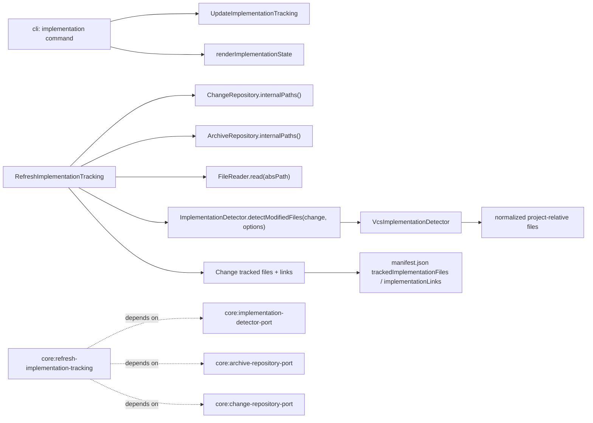

# Design: harden-implementation-tracking

## Non-goals

- This change does not introduce background implementation tracking, filesystem watchers, or automatic refresh outside explicit lifecycle entry points.
- This change does not alter archive-time implementation sidecar materialization rules beyond removing links to files that have already been marked `removed` before archive.
- This change does not replace raw project-relative implementation paths with canonical `workspace:path` identifiers during active-change authoring.
- This change does not add a user-facing command that bypasses the `removed` lifecycle for missing files. Existing `remove` remains the explicit untracking path; `ignore` and `removed` remain review states for absent files.

## Affected areas

- `TrackedImplementationFileState` and implementation-link helpers in `packages/core/src/domain/entities/change.ts`
  Change: extend the tracked-file state union from `open | resolved | ignored` to `open | resolved | ignored | removed`, while preserving the existing `trackImplementationFile`, `removeImplementationLink`, and `removeImplementationSymbol` mutation surface.
  Callers / dependents: the `Change` aggregate is a code-graph hotspot with CRITICAL fan-in, so the change must be additive and backward-compatible at the method-signature level.
  Note: no new domain entity methods are required; refresh and mutation use cases can express the new behavior by combining existing tracked-file and link-removal APIs.

- Manifest serialization in `packages/core/src/infrastructure/fs/manifest.ts` and `packages/core/src/infrastructure/fs/change-repository.ts`
  Change: accept and persist the `removed` state in `ManifestTrackedImplementationFileState`, `ManifestTrackedImplementationFile`, and `changeToManifest(...)` / manifest rehydration.
  Callers / dependents: `core:change-manifest` has CRITICAL spec blast radius and feeds CLI status, archive reads, project status, and metadata-related use cases.
  Note: backward compatibility is one-way. Older manifests remain readable; once a refreshed change persists `removed`, older binaries that do not understand the new state cannot safely roll back into active use.

- `RefreshImplementationTracking` in `packages/core/src/application/use-cases/refresh-implementation-tracking.ts`
  Change: constructor expands from `(changes, implementationDetector)` to `(changes, archives, implementationDetector, files, projectRoot)`, and `execute()` becomes the authoritative place for exclusion-path normalization, candidate merge, existence sweep, resurrection, and stale-link cleanup.
  Callers / dependents: 3 direct dependents and 16 transitive symbol dependents in the code graph; risk CRITICAL because the constructor is wired through `createKernel`, CLI context bootstrap, and kernel tests.
  Note: the refresh algorithm must stay inside one `ChangeRepository.mutate(...)` callback so tracked-file state and link cleanup persist atomically.

- `UpdateImplementationTracking` in `packages/core/src/application/use-cases/update-implementation-tracking.ts`
  Change: constructor expands from `(changes)` to `(changes, files, projectRoot)`, and the use case becomes the single enforcement point for existence validation on `add`, `resolve`, `unresolve`, and tracked-vs-untracked `ignore`.
  Callers / dependents: CRITICAL kernel and CLI fan-in similar to refresh because the use case is constructed centrally and used by all implementation mutation commands.
  Note: this is the architectural replacement for the CLI’s ad hoc `stat(...)` loop, but the mutation rules must now be tightened so `resolve` and `unresolve` only operate on already-tracked files and `ignore` preserves confirmed links instead of rejecting linked tracked files.

- `ImplementationDetector` in `packages/core/src/application/ports/implementation-detector.ts`
  Change: add `ImplementationDetectorOptions` and change the contract to `detectModifiedFiles(change, options?)`.
  Callers / dependents: the detector port is consumed by refresh only, but the concrete `VcsImplementationDetector` is injected through the kernel and therefore has CRITICAL constructor blast radius.
  Note: detector options are limited to exclusion behavior; existence checks stay outside the detector and use the existing `FileReader` port.

- `VcsImplementationDetector` in `packages/core/src/infrastructure/vcs/vcs-implementation-detector.ts`
  Change: preserve baseline resolution and project-relative normalization, then filter the normalized candidates against `options.excludePaths`.
  Callers / dependents: 3 direct dependents and 16 transitive symbol dependents via the kernel and CLI bootstrap; risk CRITICAL because constructor and signature changes flow through composition and tests.
  Note: filtering happens after normalization so exclusion matching uses the same portable project-relative shape that the rest of implementation tracking stores.

- `ChangeRepository` and `ArchiveRepository` abstract ports plus filesystem implementations in:
  - `packages/core/src/application/ports/change-repository.ts`
  - `packages/core/src/application/ports/archive-repository.ts`
  - `packages/core/src/infrastructure/fs/change-repository.ts`
  - `packages/core/src/infrastructure/fs/archive-repository.ts`
    Change: add `internalPaths(): readonly string[]` to both ports and implement it in the fs adapters.
    Callers / dependents:
  - `core:change-repository-port` shows HIGH spec impact because its contract is referenced by drafted/discarded flows and the fs repository implementation.
  - `core:archive-repository-port` is LOW blast radius and limited to its port + fs adapter pair.
    Note: `internalPaths()` must return absolute storage roots only, not glob patterns and not project-relative strings.

- Composition wiring in `packages/core/src/composition/kernel.ts` and supporting kernel-builder / kernel-internals paths
  Change: pass `ArchiveRepository`, `FileReader`, and `config.projectRoot` into refresh; pass `FileReader` and `config.projectRoot` into update-implementation-tracking; keep all layering boundaries intact.
  Callers / dependents: CRITICAL because kernel factory changes propagate through CLI kernel creation and multiple composition tests.

- CLI implementation command handling in `packages/cli/src/commands/change/implementation.ts`
  Change: remove the preflight `stat(...)` loop from `mutateImplementationTracking(...)`; text rendering adds the `removed` group; add the `unresolve` subcommand; user-facing semantics come entirely from core use-case results and errors.
  Callers / dependents: `cli:change-implementation` has LOW spec blast radius and only 3 affected files in graph impact, so the change remains local to the implementation command group.

- CLI review enrichment in `packages/cli/src/commands/change/_implementation-tracking.ts`
  Change: keep `removed` tracked files visible in enriched output and tighten stale-symbol fallback so same-file composed-member retries only accept graph matches whose `kind` matches the stored link's expected kind.
  Callers / dependents: low-local CLI-only impact.

- Artifact persistence guards in `packages/core/src/infrastructure/fs/change-repository.ts`
  Change: `saveArtifact(...)` must reopen the saved artifact file to `in-progress`, and `artifactExists(...)` must surface confinement and tracked-file validation failures instead of collapsing them into a falsey "does not exist" result.
  Callers / dependents: `FsChangeRepository` is a CRITICAL hotspot with 30 affected files in graph impact, including validation, transition, preview, archive, and status composition paths.
  Note: these fixes are correctness-sensitive because they determine whether later lifecycle steps see a rewritten artifact as pending work or silently keep treating it as complete.

- Tests and docs:
  - `packages/core/test/application/use-cases/refresh-implementation-tracking.spec.ts`
  - `packages/core/test/application/use-cases/helpers.ts`
  - `packages/core/test/infrastructure/vcs/vcs-implementation-detector.spec.ts`
  - `packages/cli/test/commands/change/implementation.spec.ts`
  - kernel/composition tests that instantiate refresh or update use cases
  - `docs/cli/cli-reference.md`
  - `docs/core/ports.md`
  - `docs/core/use-cases.md`
    Change: align fixtures, constructor wiring, CLI behavior, and public docs with the new state and port signatures.

## New constructs

- `ImplementationDetectorOptions` in `packages/core/src/application/ports/implementation-detector.ts`
  Shape:

  ```ts
  export interface ImplementationDetectorOptions {
    readonly excludePaths?: readonly string[]
  }
  ```

  Responsibility: carry project-relative portable exclusion prefixes into detector implementations without leaking VCS- or fs-specific filtering semantics into callers.
  Relationships: consumed by `RefreshImplementationTracking`; implemented by `VcsImplementationDetector`; documented by `core:implementation-detector-port`.

- `ChangeRepository.internalPaths(): readonly string[]`
  Location: `packages/core/src/application/ports/change-repository.ts`
  Shape:

  ```ts
  abstract internalPaths(): readonly string[]
  ```

  Responsibility: expose absolute specd-managed active/draft/discard roots so implementation discovery can exclude them.
  Relationships: implemented by `FsChangeRepository`; consumed by `RefreshImplementationTracking`.

- `ArchiveRepository.internalPaths(): readonly string[]`
  Location: `packages/core/src/application/ports/archive-repository.ts`
  Shape:

  ```ts
  abstract internalPaths(): readonly string[]
  ```

  Responsibility: expose the absolute archive root for exclusion from implementation discovery.
  Relationships: implemented by `FsArchiveRepository`; consumed by `RefreshImplementationTracking`.

- Private refresh helpers inside `packages/core/src/application/use-cases/refresh-implementation-tracking.ts`
  Shape:
  ```ts
  private _toPortableProjectRelativePath(absolutePath: string): string | null
  private _absoluteImplementationPath(file: string): string
  private _removeImplementationLinksForFile(change: Change, file: string): void
  ```
  Responsibility: normalize exclusion roots, build absolute file paths under the project root, and centralize link cleanup so `execute()` stays readable.
  Relationships: local to the use case; no public API impact.

## Approach

The implementation contract is:

1. Keep the domain state model additive.
   `TrackedImplementationFileState` gains `removed`. Existing callers continue using `trackImplementationFile(file, state)` and link removal helpers. No caller is allowed to infer “removed” by absence from the tracked-file list; the state must be explicit in memory and in `manifest.json`.

2. Move all existence-sensitive behavior into core use cases.
   The CLI stops deciding whether a file exists. `UpdateImplementationTracking` becomes the only place that decides:
   - `add` requires the target file to exist.
   - `resolve` requires the target file to exist and already be tracked by the change.
   - `unresolve` requires the target file to exist, already be tracked by the change, and only reopens tracked files that are not in the `removed` lifecycle.
   - `ignore` allows a missing file only when that file is already tracked; otherwise it requires existence before adding a new ignored entry.
   - `ignore` changes tracked-file review state only and preserves any confirmed implementation links for that file.
     This preserves the CLI spec behavior while honoring hexagonal boundaries.

3. Rework `RefreshImplementationTracking` into a four-phase algorithm executed inside one serialized mutation.

   Phase A: collect exclusions
   - Call `changes.internalPaths()` and `archives.internalPaths()`.
   - Convert each absolute path under `projectRoot` into a portable project-relative prefix.
   - Drop any path outside `projectRoot`.
   - De-duplicate and sort the final exclusion set for deterministic tests.

   Phase B: detect candidates
   - If `change.getHistoricalImplementationAt() === null`, skip detection and skip all refresh mutations.
   - Otherwise call:

   ```ts
   const detected = await implementationDetector.detectModifiedFiles(change, {
     excludePaths,
   })
   ```

   - For each detected file:
     - if untracked, add it as `open`
     - if already `removed`, revive it to `open`
     - if already `open`, `resolved`, or `ignored`, preserve that state during the merge step

   Phase C: perform existence sweep
   - Iterate every tracked file whose current state is not `ignored`.
   - Resolve the absolute path with `path.resolve(projectRoot, file)`.
   - Check existence through `await files.read(absolutePath)`.
   - Interpret `null` as “missing on disk”.
   - Interpret non-null as “exists”.
   - `FileReader` is already an application port, so this keeps the use case free of concrete `fs` imports.

   Phase D: transition and cleanup
   - Missing tracked file:
     - force state to `removed`
     - remove every `implementationLink` whose `file` matches
   - Existing tracked file currently `removed`:
     - revive to `open` so the file is explicitly re-reviewed
   - Existing tracked file currently `resolved`:
     - keep `resolved`
   - Existing tracked file currently `open`:
     - keep `open`
   - Existing tracked file currently `ignored`:
     - do not auto-change state and do not run existence-driven cleanup

4. Keep refresh atomic even though it performs more work.
   `ChangeRepository.mutate(...)` remains the execution boundary for refresh. Detector lookup, existence reads, state changes, and link cleanup all happen against the fresh persisted change inside that serialized callback. This intentionally lengthens the per-change lock, but the lock is scoped to one change name and prevents races where:
   - a CLI `ignore` or `add` happens between detection and persistence
   - stale links are removed against an outdated tracked-file snapshot
   - a resurrection overwrites a manual mutation

5. Keep detector filtering simple and deterministic.
   `VcsImplementationDetector` continues to:
   - resolve the historical implementing baseline
   - query `vcs.modifiedFiles(baseRef)`
   - normalize repo-relative paths to portable project-relative strings
     It then filters the normalized result using directory-prefix matching against `options.excludePaths`.
     Matching rule:
   - exclude `prefix` when `candidate === prefix`
   - exclude `prefix` when `candidate.startsWith(prefix + '/')`
     This is more precise than feeding raw prefixes into `.gitignore`-style pattern semantics and avoids surprising wildcard behavior.

6. Preserve existing user-facing command semantics while changing ownership of validation.
   - `add` still fails with `ImplementationFileNotFoundError` for missing files.
   - `resolve` still fails for missing files and now also rejects untracked files instead of implicitly creating a tracked resolved entry.
   - `unresolve` reopens existing tracked files to `open`, rejects untracked files, and still fails for missing files.
   - `unresolve` does not manually pull a file out of `removed`; only refresh-driven resurrection can do that.
   - `ignore` still permits tracked missing files and still rejects untracked missing files.
   - `ignore` no longer rejects a tracked file solely because confirmed links still exist for it.
   - `list` and `review` display `removed` alongside `open`, `resolved`, and `ignored`.
   - stale-symbol review fallback remains best-effort, but it now uses both rightmost member segment and symbol kind when evaluating same-file matches.

7. Keep manifest compatibility additive.
   Existing manifests with only `open`, `resolved`, and `ignored` continue to load unchanged.
   New code writes `removed` only after the change is refreshed or explicitly ignored/resurrected through the updated use-case logic.

8. Reopen artifact persistence state when files are rewritten.
   - `FsChangeRepository.saveArtifact(...)` must mark the affected artifact file as `in-progress` immediately after the write succeeds.
   - The artifact aggregate state must recompute from file state so downstream lifecycle checks stop treating the file as still complete.
   - This behavior applies even when the previous state was `complete` and the rewritten content only changes formatting or narrative text.

9. Preserve repository validation failures at the API boundary.
   - `FsChangeRepository.artifactExists(...)` may return `false` for a genuinely absent tracked artifact file.
   - It must not swallow `SpecNotTrackedError`, path-confinement failures, or other repository guard errors that indicate the caller asked about an invalid artifact path.
   - Callers need the error signal so specd can fail loudly instead of silently hiding repository contract violations.

10. Update public documentation in the same change.

- `docs/cli/cli-reference.md` must describe `removed` in `change implementation list`, the relaxed `ignore` rule for tracked missing files, and the fact that validation is enforced by core behavior rather than by CLI preflight.
- `docs/core/ports.md` must document `ChangeRepository.internalPaths()`, `ArchiveRepository.internalPaths()`, and the new `ImplementationDetectorOptions`.
- `docs/core/use-cases.md` must document the expanded refresh and update-implementation-tracking constructors plus the deletion/resurrection behavior.

## Key decisions

- **Decision**: use the existing `FileReader` port for existence checks instead of adding a new filesystem-existence port.
  Rationale: the port already provides application-layer filesystem reads with `null` on missing files and is wired through composition. Reusing it fixes the architecture violation without broadening the public surface further.
  Alternatives rejected:
  - add a dedicated `PathExists` port: technically clean but unnecessary surface area for behavior already representable through `FileReader`
  - import `fs` directly in the use case: violates the global architecture constraints

- **Decision**: keep refresh inside one `ChangeRepository.mutate(...)` callback.
  Rationale: removal of links and resurrection of tracked files are correctness-sensitive manifest mutations; serializing the whole refresh avoids stale-snapshot races.
  Alternatives rejected:
  - detect outside the lock and reapply later: shorter critical section but stale-state risk during concurrent implementation mutations
  - split refresh into multiple mutations: creates partially visible intermediate states

- **Decision**: filter detector results with explicit portable-prefix matching, not glob-style ignore rules.
  Rationale: the inputs are already canonical project-relative storage roots, so exact-prefix matching is sufficient, deterministic, and easier to test than pattern semantics.
  Alternatives rejected:
  - `.gitignore`-style `ignore()` matching: workable, but unnecessarily expressive for absolute storage-root exclusions and easier to misconfigure

- **Decision**: `removed` is a persistent review state, not implicit absence.
  Rationale: the manifest must preserve review history and must distinguish “no longer on disk” from “never tracked” and from “explicitly ignored”.
  Alternatives rejected:
  - untrack missing files automatically: loses historical review context and makes resurrection impossible to detect
  - treat missing `resolved` files as still resolved: would leave broken links and stale manifests in place

- **Decision**: resurrect existing files back to `open`, not `resolved`.
  Rationale: if a file disappeared and then reappeared, the system cannot assume its previous review remains valid.
  Alternatives rejected:
  - restore prior state blindly: semantically unsafe after file replacement or recreation

## Trade-offs

- `[Longer serialized refresh window]` → Mitigation: lock scope remains per change name only; implementation mutations on other changes still proceed concurrently.
- `[Rollback incompatibility after writing removed state]` → Mitigation: document the one-way manifest compatibility in design/docs and keep the change self-contained so upgrade + rollback testing can account for it.
- `[Using FileReader.read(...) as an existence signal reads file content]` → Mitigation: tracked implementation files are expected to be code/text files, and refresh is demand-driven rather than hot-path polling.
- `[Port signature changes hit many constructor tests]` → Mitigation: batch the kernel/composition fixture updates together and keep signatures additive except where behavior is actually required.

## Spec impact

### `core:refresh-implementation-tracking`

- Direct dependent specs in graph impact: 7
- Transitive dependent specs in graph impact: 32
- Assessment:
  - The dependent specs are status/transition/archive/read-model consumers of the refreshed tracking state, not independent definitions of detector options or removed-file review semantics.
  - No additional dependent spec needs a requirement delta from this change as long as persisted tracked-file state and CLI output remain backward-compatible.

### `core:change-manifest`

- Direct dependent specs in graph impact: 4
- Transitive dependent specs in graph impact: 21
- Assessment:
  - Manifest readers and archive/listing specs consume the tracked-file structure transitively.
  - No additional spec requires a delta because the manifest field names are unchanged; only the allowed `state` enum expands.

### `cli:change-implementation`

- Direct dependent specs in graph impact: 0
- Assessment:
  - The behavioral change is fully contained in the existing CLI spec and does not ripple into additional specs.

### `core:change-repository-port`

- Direct dependent specs in graph impact: 5
- Transitive dependent specs in graph impact: 1
- Assessment:
  - The new `internalPaths()` method is additive and does not change drafted/discarded semantics, so the dependent specs remain satisfied.

### `core:archive-repository-port`

- Direct dependent specs in graph impact: 0
- Assessment:
  - The additive `internalPaths()` method does not require further downstream spec work.

### `core:implementation-detector-port`

- Newly added to change scope during design review
- Reason:
  - The existing refresh spec delta already assumes `detectModifiedFiles(change, options?)`.
  - Leaving the detector-port spec unchanged would make the design internally inconsistent and force code to violate the workspace spec contract.

## Dependency map



```
┌──────────────────────────────┐
│ cli: change implementation   │
└──────────────┬───────────────┘
               │
               ▼
      ┌──────────────────────────────┐
      │ UpdateImplementationTracking │
      │ validate add/resolve/ignore  │
      └──────────────┬───────────────┘
                     │
                     ▼
             ┌──────────────┐
             │ FileReader   │
             │ projectRoot  │
             └──────────────┘

┌──────────────────────────────┐
│ RefreshImplementationTracking│
│ [CRITICAL integration point] │
└───────┬───────────┬──────────┘
        │           │
        │           ├──────────────▶ FileReader.read(absPath)
        │           │
        │           ├──────────────▶ ChangeRepository.internalPaths()
        │           │
        │           ├──────────────▶ ArchiveRepository.internalPaths()
        │           │
        ▼           │
┌──────────────────────────────┐
│ ImplementationDetector       │
│ detectModifiedFiles(change,  │
│ { excludePaths })            │
└──────────────┬───────────────┘
               ▼
      ┌────────────────────────┐
      │ VcsImplementationDet.  │
      │ normalize + filter     │
      └──────────────┬─────────┘
                     ▼
          ┌──────────────────────┐
          │ Change aggregate     │
          │ tracked files/links  │
          └──────────────┬───────┘
                         ▼
                ┌────────────────┐
                │ manifest.json  │
                │ removed state  │
                └────────────────┘
```

## Migration / Rollback

- No one-shot migration is required. Existing manifests already lacking `removed` remain valid.
- Forward migration happens lazily the first time refreshed code persists a tracked file with state `removed`.
- Rollback caveat: once an active change manifest has been rewritten with `removed`, older binaries that only accept `open | resolved | ignored` cannot safely read or mutate that manifest. Operational rollback therefore requires either:
  - avoiding refresh/mutation on active changes before rollback, or
  - restoring the newer binary, or
  - manually normalizing affected manifests as a recovery action.

## Testing

**Automated tests**

- `packages/core/test/application/use-cases/refresh-implementation-tracking.spec.ts`
  - add scenario for exclusion propagation into `detectModifiedFiles(change, { excludePaths })`
  - add scenario for missing `open` file becoming `removed`
  - add scenario for missing `resolved` file becoming `removed`
  - add scenario for `ignored` file staying `ignored` even when absent
  - add scenario for removing all file-level and symbol-level links when a tracked file disappears
  - add scenario for resurrecting a `removed` file to `open` when it is detected or found to exist
  - add scenario for no refresh mutation when the change never entered `implementing`

- `packages/core/test/application/use-cases/helpers.ts`
  - update refresh / update use-case fixtures to provide `FileReader`, `ArchiveRepository`, and `projectRoot`
  - expose helper stubs for `FileReader.read(...)` and `internalPaths()`

- `packages/core/test/infrastructure/vcs/vcs-implementation-detector.spec.ts`
  - add scenario for exclusion-prefix filtering after project-relative normalization
  - add scenario proving files outside excluded prefixes still survive normalization and filtering

- `packages/core/test/domain/entities/change.spec.ts`
  - add scenario confirming `trackImplementationFile(file, 'removed')` is accepted and projected

- `packages/cli/test/commands/change/implementation.spec.ts`
  - verify text output prints `removed`
  - verify `ignore` succeeds for tracked missing files
  - verify `unresolve` reopens an existing tracked file to `open`
  - verify `unresolve` rejects missing / `removed` files
  - verify CLI no longer performs its own `stat(...)` preflight and instead surfaces core validation errors

- Kernel/composition tests that construct refresh or update use cases
  - update constructor expectations and fixture wiring for the new dependencies

- Repository / manifest tests
  - add coverage that manifest round-trips `removed` through serialization and load
  - add coverage that `internalPaths()` returns the correct absolute roots in fs repositories

**Manual / E2E verification**

1. Create or reuse an active change that has entered `implementing`.
2. Run `specd changes implementation add <name> --spec <specId> --file <path>` for a real source file and confirm it appears as `open`.
3. Add one or more symbol-level links for the same file.
4. Delete the file on disk.
5. Trigger refresh through the same workflow entry point used today.
6. Confirm:
   - the file is listed as `removed`
   - all links to that file are gone
   - the change no longer reports the deleted file as unresolved `open`
7. Run `specd changes implementation ignore <name> --file <deleted-path>` and confirm it succeeds because the file is already tracked.
8. Recreate the file at the same path and trigger refresh again.
9. Confirm the file returns to `open`, not `resolved`.
10. Run the relevant package tests and lint:
    - `pnpm --filter @specd/core test`
    - `pnpm --filter @specd/cli test`
    - `pnpm --filter @specd/core lint`
    - `pnpm --filter @specd/cli lint`

## Open questions

- none at this stage
