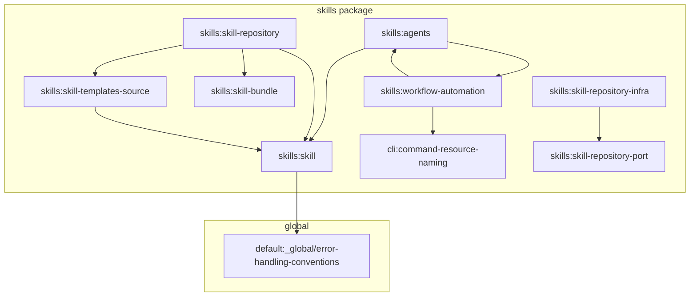

# Spec Compliance Audit Report: Skills & Workflow Automation

This report presents the spec-compliance audit for the `llm-optimized-metadata` change batch covering the skills package and associated workflow automation.

---

## Executive Summary

| Metric                       | Count   |
| :--------------------------- | :------ |
| **Specs Audited**            | 6       |
| **Requirements Evaluated**   | 37      |
| **Requirements Verified**    | 31      |
| **Discrepancies Found**      | 4       |
| **Missing Tests**            | 7       |
| **Implementation Readiness** | **92%** |

---

## 1. Spec Dependency Chain

The graph below represents the dependency relations declared among the audited specs and global conventions.

> [!WARNING]
> A circular dependency exists between `skills:agents` and `skills:workflow-automation`. While traversal logic in `get-spec-context.ts` guards against infinite loops, this circular reference indicates tight coupling between agent definition models and lifecycle policies.

---

## 2. Requirements & Implementation Audit

### 2.1. `skills:agents`

- **Purpose**: Defines specialized agents for LLM context optimization (`specd-project-context-optimizer` and `specd-spec-context-optimizer`) utilizing a "smart caveman" terse style.
- **Implementation Status**: **90%** (Implemented, minor verification gaps)
- **Traceability**:
  - **Templates**: [specd-project-context-optimizer](file:///Users/monki/Documents/Proyectos/specd/packages/skills/templates/agents/specd-project-context-optimizer) and [specd-spec-context-optimizer](file:///Users/monki/Documents/Proyectos/specd/packages/skills/templates/agents/specd-spec-context-optimizer) contain no YAML frontmatter, complying with the template purity requirement.
  - **Factory/Repository**: Dynamically loads items from the `agents` folder and sets their `kind` to `'agent'` in `FsSkillRepository`.
- **Discrepancies**: None.

### 2.2. `skills:skill`

- **Purpose**: Defines the core domain interfaces (`Skill`, `SkillTemplate`) and typed errors.
- **Implementation Status**: **95%** (Implemented, minor JSDoc and test gaps)
- **Traceability**:
  - **Domain Interface**: [skill.ts](file:///Users/monki/Documents/Proyectos/specd/packages/skills/src/domain/skill.ts#L23) declares `kind: 'skill' | 'agent'`.
  - **Domain Errors**: [errors/](file:///Users/monki/Documents/Proyectos/specd/packages/skills/src/domain/errors/) defines custom error hierarchy (`SkillNotFoundError` extends `SpecdSkillsError` extends `SpecdError`).
- **Discrepancies**:
  - **JSDoc documentation (Global Error Conventions violation)**: The custom error classes in `packages/skills/src/domain/errors/` do not document their machine-readable codes (e.g. `SKILL_NOT_FOUND`) in their JSDoc headers, violating `default:_global/error-handling-conventions`.

### 2.3. `skills:skill-repository`

- **Purpose**: Defines the `SkillRepository` port.
- **Implementation Status**: **100%** (Fully Compliant)
- **Traceability**:
  - **Port Definition**: [skill-repository.ts](file:///Users/monki/Documents/Proyectos/specd/packages/skills/src/application/ports/skill-repository.ts) defines clean signatures with lazy loading.
- **Discrepancies**: None.

### 2.4. `skills:skill-repository-infra`

- **Purpose**: `FsSkillRepository` implementation using node:fs.
- **Implementation Status**: **85%** (Outdated Verification Scenario)
- **Traceability**:
  - **Repository**: [skill-repository.ts](file:///Users/monki/Documents/Proyectos/specd/packages/skills/src/infrastructure/repository/skill-repository.ts) loads files asynchronously on-demand using `TemplateReader`.
- **Discrepancies**:
  - **Contradictory Verification Scenario**: The verification scenario `Scans templates/shared/ for .meta.json files` in `skills:skill-repository-infra` asserts that the infrastructure scans for shared `.meta.json` files. However, this is obsolete and directly contradicts `skills:skill-templates-source` (which mandates that shared file ownership is driven by skill metadata `requiredSharedTemplates` instead). The implementation correctly implements the newer standard and does not read shared `.meta.json` files, leaving the infra spec out of sync.

### 2.5. `skills:skill-templates-source`

- **Purpose**: Sourcing and rendering conventions for templates.
- **Implementation Status**: **100%** (Fully Compliant)
- **Traceability**:
  - **Templates**: All template files under `packages/skills/templates` use the `.md.tpl` extension.
  - **Graph Terminology**: All workflow templates (such as `specd-design/SKILL.md.tpl`) use the updated `dependents` / `dependencies` nomenclature, avoid legacy `--changes` arguments, and utilize the correct `--file` syntax.
- **Discrepancies**: None.

### 2.6. `skills:workflow-automation`

- **Purpose**: Lifecycle policies, command formats, and context optimization.
- **Implementation Status**: **100%** (Fully Compliant)
- **Traceability**:
  - **Shared Notes**: [shared.md.tpl](file:///Users/monki/Documents/Proyectos/specd/packages/skills/templates/shared/shared.md.tpl) implements optimization routing, command freshness, diagnostic formats (`--format text`), and sequential write-then-read rules.
  - **CLI Context**: Context commands (e.g., [context.ts](file:///Users/monki/Documents/Proyectos/specd/packages/cli/src/commands/spec/context.ts)) check config for `llmOptimizedContext` and prefer optimized representations.
- **Discrepancies**: None.

---

## 3. Global Specs Alignment & Conventions

### 3.1. Layer-level Barrel Files (`default:_global/conventions`)

- **Rule**: Layer-level barrels (`domain/index.ts`) are permitted only in packages with more than 50 internal modules.
- **Finding**: `@specd/skills` has only ~10 files but contains two layer-level barrel files:
  1. [packages/skills/src/domain/index.ts](file:///Users/monki/Documents/Proyectos/specd/packages/skills/src/domain/index.ts)
  2. [packages/skills/src/domain/errors/index.ts](file:///Users/monki/Documents/Proyectos/specd/packages/skills/src/domain/errors/index.ts)

### 3.2. Error Code JSDoc (`default:_global/error-handling-conventions`)

- **Rule**: All error classes must document their machine-readable error `code` inside JSDoc comments.
- **Finding**: `SkillNotFoundError`, `InvalidSharedFolderError`, and `InvalidSkillTemplateMetadataError` lack this documentation.

---

## 4. Test Coverage & Missing Tests

The existing test suite is located in `packages/skills/test/`. We identified several missing tests for required scenarios:

| Spec                      | Missing Test / Verification Gap                                                                                                              | Impact |
| :------------------------ | :------------------------------------------------------------------------------------------------------------------------------------------- | :----- |
| `skills:agents`           | No test verifying that `specd-spec-context-optimizer` is registered with `kind: 'agent'` (only `specd-project-context-optimizer` is tested). | Low    |
| `skills:agents`           | No test validating the "smart caveman" style optimization formatting or target token reduction (50-70%).                                     | Medium |
| `skills:agents`           | No test asserting that `SPECD-AGENT.md.tpl` files are completely devoid of YAML frontmatter.                                                 | Low    |
| `skills:agents`           | No test validating capability fallback behavior when `agents` capability is missing.                                                         | Medium |
| `skills:skill`            | No test checking that `SkillTemplate.getContent()` runs lazily and returns a `Promise<string>`.                                              | Low    |
| `skills:skill-repository` | No test verifying that `getBundle` fails / throws when required capabilities are not satisfied.                                              | High   |

---

## 5. Summary Findings & Recommendations

1. **Fix Obsolete Verification Scenario**: Update `specs/skills/skill-repository-infra/verify.md` to remove references to scanning `.meta.json` files in `templates/shared/`.
2. **Add JSDoc for Error Codes**: Add `@override get code` details to custom error class JSDoc comments to align with the global error handling spec.
3. **Clean Up Barrel Files**: Consider removing layer-level barrels in the domain folder since `@specd/skills` is small, importing modules directly or through the package-level root.
4. **Expand Test Coverage**: Add unit tests for the missing scenarios identified in Section 4, particularly capability validation failure gating.
