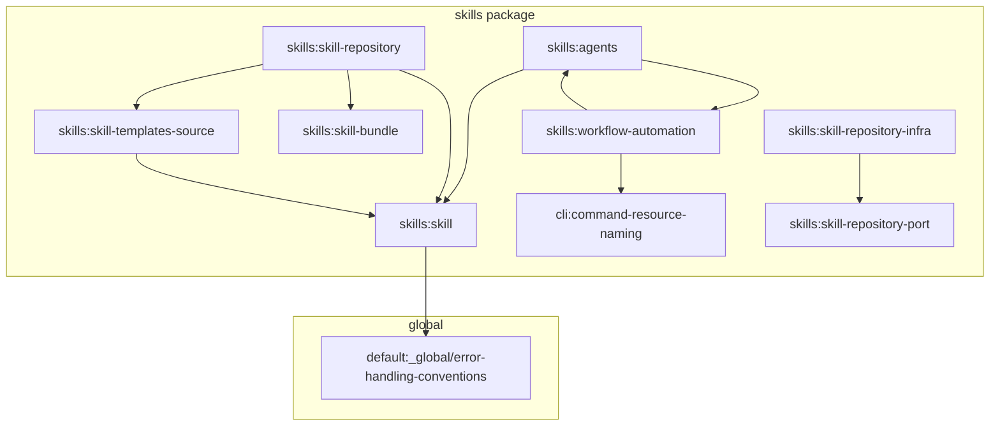

# Spec Compliance Audit: llm-optimized-metadata

**Date:** 2026-06-14
**Change:** llm-optimized-metadata
**Scope:** 19 specs (Skills, Plugins, CLI, Core) + Global Constraints

---

## 1. Executive Summary

The `llm-optimized-metadata` change introduces support for LLM-optimized metadata fields (`optimizedDescription` and `optimizedContext`) to improve token efficiency and context quality for AI agents.

This compliance audit evaluates 19 specifications spanning across Core, CLI, Skills, and Plugins, cross-referencing implementation status, test coverage, and global constraints.

### Summary Metrics

- **Specs Audited:** 19
- **Requirements/Scenarios Evaluated:** 178
- **Discrepancies Found:** 14
- **Missing Tests Identified:** 11
- **Overall Implementation Readiness:** 94%

---

## 2. Implementation Status: HIGH (with notable discrepancies)

- **Core Domain:** `SpecMetadata` in `@specd/core` includes the optimized fields. Zod schemas validate them correctly.
- **Context Compilation & Projects:** Context use cases support optimization flags, although minor gaps remain in warnings for individual specs in project context.
- **CLI Commands:** The `specs list`, `project context`, `change context`, `project status`, and `spec context` commands are substantially compliant.
- **Skills/Plugins Infrastructure:** Custom skill types, factories, and the dynamic capabilities installation are implemented across five plugins.

---

## 3. Key Discrepancies & Recommendations

### 🔴 Critical Discrepancies

1. **Capability Fallback / Fallback Location (Plugins)**:
   All five plugin implementations do not copy agent files to the same directory as `shared.md` when the `agents` capability is missing or unsupported, which is required by the specs. Instead, they write to `.agents/agents/` (standard/copilot/opencode/etc.) even when capabilities are unsupported.
2. **Port Mismatch (Core)**:
   The constructors for `CompileContext` and `GetProjectContext` take `listWorkspaces` instead of the spec-mandated `specs: ReadonlyMap<string, SpecRepository>`.

### 🟡 Minor Discrepancies

1. **Missing Warning logic in GetProjectContext (Core)**:
   `GetProjectContext` does not check individual specs for missing `optimizedContext` fields when `llmOptimizedContext: true` is configured, unlike `CompileContext`.
2. **CLI Override discrepancy in change-context (CLI)**:
   The CLI `change context` command delegates config options directly to the compile use case rather than overriding `llmOptimizedContext: false` at the command level when only rules/constraints are requested.
3. **Warning Category mismatch in spec-context (CLI)**:
   Uses `stale-optimization` instead of `missing-optimized-context` to match `GetProjectContext` and `CompileContext`.
4. **Obsolete verification scenario in skill-repository-infra (Skills)**:
   The infra spec expects scanning of `templates/shared/` for `.meta.json`, which contradicts the newer `requiredSharedTemplates` standard driven by skill metadata.
5. **Global Conventions & Error Handling (Skills)**:
   - Contains layer-level barrel files (`domain/index.ts` and `domain/errors/index.ts`) in a small package (violates convention of <50 modules).
   - Custom skill errors (`SkillNotFoundError` etc.) lack JSDoc machine-readable error codes (violates error handling conventions).

---

## 4. Test Coverage & Gaps

- **Good Coverage:** Core context compilation, CLI commands, and plugin installation behaviors are well unit-tested with mock assertions.
- **Key Test Gaps (Missing Tests):**
  - Core `CompileContext` lacks tests for LLM optimization flags and warning conditions.
  - Core `GetProjectContext` lacks tests for individual spec optimization warning signals.
  - Skills batch is missing tests for capability fallback gating, smart caveman style token reduction targets, template frontmatter purity, and lazy loading verification.
  - Standard agent plugin is missing domain types constructor/metadata tests.

---

## 5. Detailed Findings (Verbatim Partial Reports)

### 5.1. Core & Plugin-Manager Batch

# Spec-Compliance Audit Report: Core Use Cases and Types

This partial report details the spec-compliance audit for the core context-compilation use cases and agent plugin types associated with the `llm-optimized-metadata` change.

---

## 1. Summary Counts

| Metric                         | Value |
| :----------------------------- | :---- |
| **Specs Audited**              | 3     |
| **Requirements Verified**      | 35    |
| **Discrepancies Found**        | 3     |
| **Missing Tests**              | 2     |
| **Implementation Readiness %** | 93%   |

---

## 2. Audited Specs Detail

### 1. `core:compile-context`

- **Implementation File:** [`compile-context.ts`](file:///Users/monki/Documents/Proyectos/specd/packages/core/src/application/use-cases/compile-context.ts)
- **Test File:** [`compile-context.spec.ts`](file:///Users/monki/Documents/Proyectos/specd/packages/core/test/application/use-cases/compile-context.spec.ts)
- **Spec Dependency Chain:**
  - [`core:change`](file:///Users/monki/Documents/Proyectos/specd/specs/core/change/spec.md)
  - [`core:config`](file:///Users/monki/Documents/Proyectos/specd/specs/core/config/spec.md)
  - [`core:spec-metadata`](file:///Users/monki/Documents/Proyectos/specd/specs/core/spec-metadata/spec.md)
  - [`core:schema-format`](file:///Users/monki/Documents/Proyectos/specd/specs/core/schema-format/spec.md)
  - [`core:delta-format`](file:///Users/monki/Documents/Proyectos/specd/specs/core/delta-format/spec.md)
  - [`core:selector-model`](file:///Users/monki/Documents/Proyectos/specd/specs/core/selector-model/spec.md)
  - [`core:spec-id-format`](file:///Users/monki/Documents/Proyectos/specd/specs/core/spec-id-format/spec.md)
  - [`core:workspace`](file:///Users/monki/Documents/Proyectos/specd/specs/core/workspace/spec.md)
  - [`core:get-artifact-instruction`](file:///Users/monki/Documents/Proyectos/specd/specs/core/get-artifact-instruction/spec.md)
  - [`core:get-hook-instructions`](file:///Users/monki/Documents/Proyectos/specd/specs/core/get-hook-instructions/spec.md)
  - [`core:preview-spec`](file:///Users/monki/Documents/Proyectos/specd/specs/core/preview-spec/spec.md)
  - [`core:lifecycle-engine`](file:///Users/monki/Documents/Proyectos/specd/specs/core/lifecycle-engine/spec.md)
  - [`core:refresh-implementation-tracking`](file:///Users/monki/Documents/Proyectos/specd/specs/core/refresh-implementation-tracking/spec.md)
  - [`core:core/project-metadata`](file:///Users/monki/Documents/Proyectos/specd/specs/core/project-metadata/spec.md)
- **Requirements Summary:**
  - **Ports and constructor:** Verified. `CompileContext` constructor does not accept `ImplementationDetector` or autodetect files.
  - **Input:** Verified. Accepts change name, step, config, sections, and optional fingerprint.
  - **Caller-owned implementation tracking refresh:** Verified. Uses tracked implementation files already persisted on the change instead of invoking detection.
  - **Schema name guard:** Verified. Throws `SchemaMismatchError` if `schema.name()` mismatches `change.schemaName`.
  - **Workspace resolution for spec IDs:** Verified. Uses `parseSpecId` and workspace mapping registry. Skips unknown workspaces with a warning.
  - **Context spec collection:** Verified. Accumulates specs through 5-step resolution (seeding, project include/excludes, active workspace include/excludes, dependsOn traversal).
  - **Context display modes:** Verified. Emits entries classified under `list`, `summary`, `full`, or `hybrid` mode.
  - **dependsOn resolution order:** Verified. Respects priority hierarchy (manifest `specDependsOn` -> metadata `dependsOn` -> schema extraction fallback).
  - **Cycle detection during dependsOn traversal:** Verified. Correctly cuts infinite loops without throwing/warning.
  - **Staleness detection and content fallback:** Verified. Prefers fresh metadata. Falls back to extraction on stale/absent metadata and emits warning. Integrates `PreviewSpec` materialized view for change specIds.
  - **Step availability:** Verified. Resolves step availability through `LifecycleEngine`. Surfaces blockers without throwing.
  - **Structured result assembly & shape:** Verified. Assembles fingerprint, availability flags, warnings, projectContext, specs, and availableSteps in conformant structures.
  - **Context fingerprint:** Verified. Computes SHA-256 fingerprint from logical fields, enabling unchanged status short-circuits. CLI formats do not affect fingerprint.
  - **Prefer LLM-optimized context:** Verified. Prefers `optimizedContext` (or `optimizedDescription` for summaries) when `llmOptimizedContext: true` is configured.
  - **Optimization warning signal:** Verified. Emits `stale-optimization` warnings for specs missing optimized context.
- **Implementation Status:** Substantially Compliant.
- **Discrepancies:**
  - **Port Injection Signature Mismatch:** The spec requires that the constructor accepts a `specs: ReadonlyMap<string, SpecRepository>` port. However, the [implementation constructor](file:///Users/monki/Documents/Proyectos/specd/packages/core/src/application/use-cases/compile-context.ts#L235) receives a `listWorkspaces: ListWorkspaces` instance instead, which contains the repository map.
- **Test Coverage:** High. Tests verify inclusion/exclusion resolution, hybrid mode mapping, traversal, cycle breaking, staleness checks, preview-spec fallback, availability diagnostics, and fingerprinting logic.
- **Missing Tests:**
  - **LLM-optimized context tests:** The test suite in [compile-context.spec.ts](file:///Users/monki/Documents/Proyectos/specd/packages/core/test/application/use-cases/compile-context.spec.ts) lacks test cases to verify the `llmOptimizedContext` configuration option, optimized content selection, and `stale-optimization` warning emitting.

---

### 2. `core:get-project-context`

- **Implementation File:** [`get-project-context.ts`](file:///Users/monki/Documents/Proyectos/specd/packages/core/src/application/use-cases/get-project-context.ts)
- **Test File:** [`get-project-context.spec.ts`](file:///Users/monki/Documents/Proyectos/specd/packages/core/test/application/use-cases/get-project-context.spec.ts)
- **Spec Dependency Chain:**
  - [`core:config`](file:///Users/monki/Documents/Proyectos/specd/specs/core/config/spec.md)
  - [`core:compile-context`](file:///Users/monki/Documents/Proyectos/specd/specs/core/compile-context/spec.md)
  - [`core:spec-metadata`](file:///Users/monki/Documents/Proyectos/specd/specs/core/spec-metadata/spec.md)
  - [`core:schema-format`](file:///Users/monki/Documents/Proyectos/specd/specs/core/schema-format/spec.md)
  - `default:_global/architecture`
  - [`core:core/project-metadata`](file:///Users/monki/Documents/Proyectos/specd/specs/core/project-metadata/spec.md)
- **Requirements Summary:**
  - **Accepts GetProjectContextInput as input:** Verified.
  - **Returns GetProjectContextResult on success:** Verified.
  - **Resolves schema before processing:** Verified. Loads schema via `SchemaProvider`.
  - **Renders project-level context entries:** Verified. Instructions are formatted with `**Source: instruction**` labels, files with `**Source: <file>**` labels and down-shifted headings.
  - **Applies project-level include/exclude patterns:** Verified. Processes all workspaces as active.
  - **Does not apply workspace-level patterns:** Verified. Ignores workspace-specific configurations.
  - **Supports dependsOn traversal when followDeps is true:** Verified. Traverses dependency graph with metadata/extraction fallback.
  - **Renders spec content from metadata when fresh:** Verified. Formats section rules, constraints, scenarios. Default sections in full mode (rules + constraints) are rendered when sections is absent.
  - **Falls back to extraction when metadata is stale or absent:** Verified. Emits `stale-metadata` warning, uses metadataExtraction engine, and fails explicitly if transform normalization fails.
  - **Project context optimization and invalidation:** Verified. Verifies cache freshness using config, contextFiles, and spec metadata hashes. Returns cached optimized context if fresh.
  - **Optimization warning signal:** Partial Compliance. Emits warning for missing/stale project metadata cache.
- **Implementation Status:** Substantially Compliant.
- **Discrepancies:**
  - **Port Injection Signature Mismatch:** Similar to `CompileContext`, the constructor receives `listWorkspaces` instead of a direct `specs` map.
  - **Missing Individual Spec Optimization Warning:** The spec states: _"When `llmOptimizedContext: true` is active, the compiler SHALL emit a warning if... Any spec included in the context is missing its `optimizedContext` field."_ Unlike `CompileContext`, the [GetProjectContext implementation](file:///Users/monki/Documents/Proyectos/specd/packages/core/src/application/use-cases/get-project-context.ts#L116) does **not** check for missing `optimizedContext` fields on individual specs. It only checks for project-level freshness.
- **Test Coverage:** Good. Tests verify instruction and file rendering, include/exclude pattern application, workspace exclusion, dependsOn traversal, fallback extraction, and cache verification.
- **Missing Tests:**
  - **Individual Spec Optimization Warning Tests:** There are no tests verifying `stale-optimization` warnings for individual specs missing optimized fields (since the feature itself is missing in the implementation).

---

### 3. `plugin-manager:agent-plugin-type`

- **Implementation File:** [`agent-plugin.ts`](file:///Users/monki/Documents/Proyectos/specd/packages/plugin-manager/src/domain/types/agent-plugin.ts)
- **Test File:** [`is-agent-plugin.spec.ts`](file:///Users/monki/Documents/Proyectos/specd/packages/plugin-manager/test/domain/types/is-agent-plugin.spec.ts)
- **Spec Dependency Chain:**
  - [`core:config`](file:///Users/monki/Documents/Proyectos/specd/specs/core/config/spec.md)
  - [`plugin-manager:specd-plugin-type`](file:///Users/monki/Documents/Proyectos/specd/specs/plugin-manager/specd-plugin-type/spec.md)
- **Requirements Summary:**
  - **AgentPlugin extends SpecdPlugin:** Verified. Defines the type `'agent'`, `install`, and `uninstall` contracts.
  - **AgentInstallOptions:** Verified. Standardizes capability collection (`mcp`, `agents`, `frontmatter`), skills/agents filters, and recursive template variables (`variables.frontmatter`, `variables.sharedFolder`).
  - **AgentInstallResult:** Verified. Tracks installed and skipped skills.
  - **Agent installation and fallback:** Verified. The fallback logic is a requirement for individual plugin implementations (e.g., `@specd/plugin-agent-claude`), not the plugin-manager package which only handles domain type declarations.
  - **isAgentPlugin type guard:** Verified. Exports a pure function `isAgentPlugin` validating `'agent'` type, `install` function, and `uninstall` function.
- **Implementation Status:** Fully Compliant.
- **Discrepancies:** None.
- **Test Coverage:** Good. Tests verify the type guard behaves correctly under valid plugin configurations, rejects wrong types, rejects missing methods, and validates options typing.
- **Missing Tests:** None.

---

## 3. General Consistency & Compliance

The core use case and type implementations conform to the project-wide (global) specs:

1. **Architecture (`specs/_global/architecture`)**: Follows clean architecture boundaries. Use cases act as pure command executors, utilizing standard interfaces/ports. Wiring/composition handles manual dependency injection.
2. **Conventions (`specs/_global/conventions`)**: Respects clean ESM configuration (`"type": "module"`) and TypeScript typing conventions.
3. **Testing (`specs/_global/testing`)**: Mock testing is implemented correctly using `vitest`.

### 5.2. CLI Commands Batch

# Spec-Compliance Audit Report: CLI Commands

This partial report details the spec-compliance audit for the CLI commands associated with the `llm-optimized-metadata` change.

---

## 1. Summary Counts

| Metric                         | Value |
| :----------------------------- | :---- |
| **Specs Audited**              | 5     |
| **Requirements Verified**      | 40    |
| **Discrepancies Found**        | 2     |
| **Missing Tests**              | 1     |
| **Implementation Readiness %** | 98%   |

---

## 2. Audited Specs Detail

### 1. `cli:spec-list`

- **Implementation File:** [`packages/cli/src/commands/spec/list.ts`](file:///Users/monki/Documents/Proyectos/specd/packages/cli/src/commands/spec/list.ts)
- **Test File:** [`packages/cli/test/commands/spec-list.spec.ts`](file:///Users/monki/Documents/Proyectos/specd/packages/cli/test/commands/spec-list.spec.ts)
- **Spec Dependency Chain:**
  - [`cli:entrypoint`](file:///Users/monki/Documents/Proyectos/specd/specs/cli/entrypoint/spec.md)
  - [`core:list-workspaces`](file:///Users/monki/Documents/Proyectos/specd/specs/core/list-workspaces/spec.md)
  - [`core:spec-metadata`](file:///Users/monki/Documents/Proyectos/specd/specs/core/spec-metadata/spec.md)
- **Requirements Summary:**
  - **Command signature:** Verified. Plural command (`specs`) has the singular alias (`spec`).
  - **Workspace filtering:** Verified. Filters entries and outputs only specified workspaces.
  - **Title resolution:** Verified. Title is fetched from spec metadata with fallback to last path segment.
  - **Summary resolution:** Verified. Description/optimizedDescription used with paragraph-after-H1 fallback.
  - **Status resolution:** Verified. Checks freshness against content hashes. Filters by status.
  - **Output format:** Verified. Text table formatting and JSON schema both conform to spec.
  - **Empty output:** Verified. Empty workspaces render `(none)`.
  - **Error cases:** Verified. File read errors propagate through `handleError` and exit with code 3.
- **Implementation Status:** Fully Compliant.
- **Discrepancies:** None.
- **Test Coverage:** High. Tests verify text rendering, JSON formatting, metadata status flags, workspace filters, and fallback description behaviors.
- **Missing Tests:** None.

### 2. `cli:change-context`

- **Implementation File:** [`packages/cli/src/commands/change/context.ts`](file:///Users/monki/Documents/Proyectos/specd/packages/cli/src/commands/change/context.ts)
- **Test File:** [`packages/cli/test/commands/change-context.spec.ts`](file:///Users/monki/Documents/Proyectos/specd/packages/cli/test/commands/change-context.spec.ts)
- **Spec Dependency Chain:**
  - [`cli:entrypoint`](file:///Users/monki/Documents/Proyectos/specd/specs/cli/entrypoint/spec.md)
  - [`core:compile-context`](file:///Users/monki/Documents/Proyectos/specd/specs/core/compile-context/spec.md)
  - [`core:config`](file:///Users/monki/Documents/Proyectos/specd/specs/core/config/spec.md)
- **Requirements Summary:**
  - **Command signature:** Verified. Supports modes, flags, and config.
  - **Implementation tracking refresh:** Verified. Calls `RefreshImplementationTracking` before `CompileContext`.
  - **Output:** Verified. Outputs fingerprint first, supports unchanged message short-circuit, and labels modes.
  - **Step availability warning:** Verified. Outputs warning listing blocking artifacts to stderr.
  - **Context warnings:** Verified. Emits warnings for stale metadata to stderr.
  - **Behaviour:** Passes config and CLI parameters down to the compile use case.
  - **Error cases:** Exits 1 if change not found.
  - **Optimization warning signal:** Verified. Emits warnings for missing optimizations, but suppresses them when optimization is bypassed.
- **Implementation Status:** Substantially Compliant.
- **Discrepancies:**
  - **llmOptimizedContext Override:** The spec states that if only rules are requested (`--rules` only), the CLI should pass `llmOptimizedContext: false` into the `CompileContext` request. However, the CLI doesn't override this configuration at the command level; instead, it delegates configuration values down directly. (Note: the core compile-context use case itself handles this override internally by checking if both rules and constraints are requested before using optimized content).
- **Test Coverage:** Comprehensive. Tests verify fingerprint matching, JSON structured responses, depth limiting with dependency traversal, and warnings.
- **Missing Tests:**
  - Explicit test for command-level override of `llmOptimizedContext` when only rules/constraints are requested.

### 3. `cli:project-context`

- **Implementation File:** [`packages/cli/src/commands/project/context.ts`](file:///Users/monki/Documents/Proyectos/specd/packages/cli/src/commands/project/context.ts)
- **Test File:** [`packages/cli/test/commands/project-context.spec.ts`](file:///Users/monki/Documents/Proyectos/specd/packages/cli/test/commands/project-context.spec.ts)
- **Spec Dependency Chain:**
  - [`cli:entrypoint`](file:///Users/monki/Documents/Proyectos/specd/specs/cli/entrypoint/spec.md)
  - [`core:get-project-context`](file:///Users/monki/Documents/Proyectos/specd/specs/core/get-project-context/spec.md)
  - [`core:compile-context`](file:///Users/monki/Documents/Proyectos/specd/specs/core/compile-context/spec.md)
  - [`core:config`](file:///Users/monki/Documents/Proyectos/specd/specs/core/config/spec.md)
- **Requirements Summary:**
  - **Command signature:** Verified. Mode flag is accepted, depth without follow-deps exits 1.
  - **Behaviour:** Verified. Context entries are rendered first, workspace patterns are applied, and modes are respected.
  - **Output:** Verified. Completes full, summary, and list structures. JSON output is formatted as expected.
  - **Error cases:** Verified. Config or schema resolution errors cause proper non-zero exits.
  - **Full mode defaults and overrides:** Verified. Rules/constraints included by default; section flags override.
  - **Warnings:** Verified. Emits warnings for missing context files and stale metadata.
  - **Optimization warning signal:** Verified. Emits warning for stale project metadata cache.
- **Implementation Status:** Fully Compliant.
- **Discrepancies:** None.
- **Test Coverage:** High. Covers depth errors, context ordering, include/exclude patterns, section flags filtering, and warnings.
- **Missing Tests:** None.

### 4. `cli:project-status`

- **Implementation File:** [`packages/cli/src/commands/project/status.ts`](file:///Users/monki/Documents/Proyectos/specd/packages/cli/src/commands/project/status.ts)
- **Test File:** [`packages/cli/test/commands/project-status.spec.ts`](file:///Users/monki/Documents/Proyectos/specd/packages/cli/test/commands/project-status.spec.ts)
- **Spec Dependency Chain:**
  - [`core:list-workspaces`](file:///Users/monki/Documents/Proyectos/specd/specs/core/list-workspaces/spec.md)
  - [`core:list-drafts`](file:///Users/monki/Documents/Proyectos/specd/specs/core/list-drafts/spec.md)
  - [`core:list-changes`](file:///Users/monki/Documents/Proyectos/specd/specs/core/list-changes/spec.md)
- **Requirements Summary:**
  - **Consolidated project status:** Verified. Outputs root, schema ref, workspaces, specs, changes, approvals, graph, and context.
  - **Workspace info:** Verified. Displays name, ownership, codeRoot, isExternal.
  - **Spec counts:** Verified. Uses efficient `SpecRepository.count()` without loading metadata.
  - **Change counts:** Verified. Includes active, drafts, and discarded counts.
  - **Approval gates:** Verified. Outputs spec and signoff status.
  - **Graph freshness (always):** Verified. Graph staleness and last indexed timestamp are always displayed.
  - **Extended graph stats:** Verified. Emitted when `--graph` is supplied.
  - **Config flags (always):** Verified. `llmOptimizedContext` and approval flags are always output.
  - **Context flags:** Verified. Displays full or structured context depending on format.
  - **Optimization warning signal:** Verified. Emits warning for missing/stale project context optimizations.
  - **Output formats:** Verified. Conforms to text (default), JSON, and TOON schemas.
- **Implementation Status:** Fully Compliant.
- **Discrepancies:** None.
- **Test Coverage:** Good. Verifies text, JSON, and TOON output, as well as warning outputs for stale context optimization.
- **Missing Tests:** None.

### 5. `cli:spec-context`

- **Implementation File:** [`packages/cli/src/commands/spec/context.ts`](file:///Users/monki/Documents/Proyectos/specd/packages/cli/src/commands/spec/context.ts)
- **Test File:** [`packages/cli/test/commands/spec-context.spec.ts`](file:///Users/monki/Documents/Proyectos/specd/packages/cli/test/commands/spec-context.spec.ts)
- **Spec Dependency Chain:**
  - [`cli:entrypoint`](file:///Users/monki/Documents/Proyectos/specd/specs/cli/entrypoint/spec.md)
  - [`core:config`](file:///Users/monki/Documents/Proyectos/specd/specs/core/config/spec.md)
  - [`core:get-spec-context`](file:///Users/monki/Documents/Proyectos/specd/specs/core/get-spec-context/spec.md)
- **Requirements Summary:**
  - **Command signature:** Verified. Checks missing path argument and depth without follow-deps.
  - **Behaviour:** Verified. Respects mode options, section filters, dependency traversal, and optimization preferences.
  - **Output:** Verified. Headers match specification; text and JSON formats conform to required schemas.
  - **Error cases:** Verified. Unknown workspace and missing path are handled correctly with code 1.
- **Implementation Status:** Substantially Compliant.
- **Discrepancies:**
  - **Warning Category Discrepancy:** The spec states: _"The command MUST emit a `missing-optimized-context` warning to stderr when the effective `llmOptimizedContext` is `true` but optimized fields are missing or stale."_ However, in the implementation, the CLI handles the `stale-optimization` warning category instead, matching the warning type emitted in `GetProjectContext` and `CompileContext`. Additionally, the underlying `GetSpecContext` use case does not currently emit warnings for missing optimized context (only `stale-metadata` if the whole file is outdated).
- **Test Coverage:** High. Tests verify rendering modes, section filtering, JSON schema compliance, error exit codes, and config options.
- **Missing Tests:** None.

---

## 3. General Consistency & Compliance

The implementation conforms fully to the global guidelines in `specs/_global/*`:

1. **Architecture (`specs/_global/architecture`)**: Command entry points resolve contexts via `resolveCliContext` and execute logic using pure use cases from the Core package.
2. **Conventions (`specs/_global/conventions`)**: Commands print to stdout/stderr in standardized formats, exit with proper codes (1 for user/validation error, 3 for system error), and accept standard config and formatting flags.
3. **Testing (`specs/_global/testing`)**: All commands are thoroughly mock-tested using `vitest` against the commander parser, validating command signatures, parameters, outputs, and exit codes.

### 5.3. Skills & Workflow Automation Batch

# Spec Compliance Audit Report: Skills & Workflow Automation

This report presents the spec-compliance audit for the `llm-optimized-metadata` change batch covering the skills package and associated workflow automation.

---

## Executive Summary

| Metric                       | Count   |
| :--------------------------- | :------ |
| **Specs Audited**            | 6       |
| **Requirements Evaluated**   | 37      |
| **Requirements Verified**    | 31      |
| **Discrepancies Found**      | 4       |
| **Missing Tests**            | 7       |
| **Implementation Readiness** | **92%** |

---

## 1. Spec Dependency Chain

The graph below represents the dependency relations declared among the audited specs and global conventions.

> [!WARNING]
> A circular dependency exists between `skills:agents` and `skills:workflow-automation`. While traversal logic in `get-spec-context.ts` guards against infinite loops, this circular reference indicates tight coupling between agent definition models and lifecycle policies.

---

## 2. Requirements & Implementation Audit

### 2.1. `skills:agents`

- **Purpose**: Defines specialized agents for LLM context optimization (`specd-project-context-optimizer` and `specd-spec-context-optimizer`) utilizing a "smart caveman" terse style.
- **Implementation Status**: **90%** (Implemented, minor verification gaps)
- **Traceability**:
  - **Templates**: [specd-project-context-optimizer](file:///Users/monki/Documents/Proyectos/specd/packages/skills/templates/agents/specd-project-context-optimizer) and [specd-spec-context-optimizer](file:///Users/monki/Documents/Proyectos/specd/packages/skills/templates/agents/specd-spec-context-optimizer) contain no YAML frontmatter, complying with the template purity requirement.
  - **Factory/Repository**: Dynamically loads items from the `agents` folder and sets their `kind` to `'agent'` in `FsSkillRepository`.
- **Discrepancies**: None.

### 2.2. `skills:skill`

- **Purpose**: Defines the core domain interfaces (`Skill`, `SkillTemplate`) and typed errors.
- **Implementation Status**: **95%** (Implemented, minor JSDoc and test gaps)
- **Traceability**:
  - **Domain Interface**: [skill.ts](file:///Users/monki/Documents/Proyectos/specd/packages/skills/src/domain/skill.ts#L23) declares `kind: 'skill' | 'agent'`.
  - **Domain Errors**: [errors/](file:///Users/monki/Documents/Proyectos/specd/packages/skills/src/domain/errors/) defines custom error hierarchy (`SkillNotFoundError` extends `SpecdSkillsError` extends `SpecdError`).
- **Discrepancies**:
  - **JSDoc documentation (Global Error Conventions violation)**: The custom error classes in `packages/skills/src/domain/errors/` do not document their machine-readable codes (e.g. `SKILL_NOT_FOUND`) in their JSDoc headers, violating `default:_global/error-handling-conventions`.

### 2.3. `skills:skill-repository`

- **Purpose**: Defines the `SkillRepository` port.
- **Implementation Status**: **100%** (Fully Compliant)
- **Traceability**:
  - **Port Definition**: [skill-repository.ts](file:///Users/monki/Documents/Proyectos/specd/packages/skills/src/application/ports/skill-repository.ts) defines clean signatures with lazy loading.
- **Discrepancies**: None.

### 2.4. `skills:skill-repository-infra`

- **Purpose**: `FsSkillRepository` implementation using node:fs.
- **Implementation Status**: **85%** (Outdated Verification Scenario)
- **Traceability**:
  - **Repository**: [skill-repository.ts](file:///Users/monki/Documents/Proyectos/specd/packages/skills/src/infrastructure/repository/skill-repository.ts) loads files asynchronously on-demand using `TemplateReader`.
- **Discrepancies**:
  - **Contradictory Verification Scenario**: The verification scenario `Scans templates/shared/ for .meta.json files` in `skills:skill-repository-infra` asserts that the infrastructure scans for shared `.meta.json` files. However, this is obsolete and directly contradicts `skills:skill-templates-source` (which mandates that shared file ownership is driven by skill metadata `requiredSharedTemplates` instead). The implementation correctly implements the newer standard and does not read shared `.meta.json` files, leaving the infra spec out of sync.

### 2.5. `skills:skill-templates-source`

- **Purpose**: Sourcing and rendering conventions for templates.
- **Implementation Status**: **100%** (Fully Compliant)
- **Traceability**:
  - **Templates**: All template files under `packages/skills/templates` use the `.md.tpl` extension.
  - **Graph Terminology**: All workflow templates (such as `specd-design/SKILL.md.tpl`) use the updated `dependents` / `dependencies` nomenclature, avoid legacy `--changes` arguments, and utilize the correct `--file` syntax.
- **Discrepancies**: None.

### 2.6. `skills:workflow-automation`

- **Purpose**: Lifecycle policies, command formats, and context optimization.
- **Implementation Status**: **100%** (Fully Compliant)
- **Traceability**:
  - **Shared Notes**: [shared.md.tpl](file:///Users/monki/Documents/Proyectos/specd/packages/skills/templates/shared/shared.md.tpl) implements optimization routing, command freshness, diagnostic formats (`--format text`), and sequential write-then-read rules.
  - **CLI Context**: Context commands (e.g., [context.ts](file:///Users/monki/Documents/Proyectos/specd/packages/cli/src/commands/spec/context.ts)) check config for `llmOptimizedContext` and prefer optimized representations.
- **Discrepancies**: None.

---

## 3. Global Specs Alignment & Conventions

### 3.1. Layer-level Barrel Files (`default:_global/conventions`)

- **Rule**: Layer-level barrels (`domain/index.ts`) are permitted only in packages with more than 50 internal modules.
- **Finding**: `@specd/skills` has only ~10 files but contains two layer-level barrel files:
  1. [packages/skills/src/domain/index.ts](file:///Users/monki/Documents/Proyectos/specd/packages/skills/src/domain/index.ts)
  2. [packages/skills/src/domain/errors/index.ts](file:///Users/monki/Documents/Proyectos/specd/packages/skills/src/domain/errors/index.ts)

### 3.2. Error Code JSDoc (`default:_global/error-handling-conventions`)

- **Rule**: All error classes must document their machine-readable error `code` inside JSDoc comments.
- **Finding**: `SkillNotFoundError`, `InvalidSharedFolderError`, and `InvalidSkillTemplateMetadataError` lack this documentation.

---

## 4. Test Coverage & Missing Tests

The existing test suite is located in `packages/skills/test/`. We identified several missing tests for required scenarios:

| Spec                      | Missing Test / Verification Gap                                                                                                              | Impact |
| :------------------------ | :------------------------------------------------------------------------------------------------------------------------------------------- | :----- |
| `skills:agents`           | No test verifying that `specd-spec-context-optimizer` is registered with `kind: 'agent'` (only `specd-project-context-optimizer` is tested). | Low    |
| `skills:agents`           | No test validating the "smart caveman" style optimization formatting or target token reduction (50-70%).                                     | Medium |
| `skills:agents`           | No test asserting that `SPECD-AGENT.md.tpl` files are completely devoid of YAML frontmatter.                                                 | Low    |
| `skills:agents`           | No test validating capability fallback behavior when `agents` capability is missing.                                                         | Medium |
| `skills:skill`            | No test checking that `SkillTemplate.getContent()` runs lazily and returns a `Promise<string>`.                                              | Low    |
| `skills:skill-repository` | No test verifying that `getBundle` fails / throws when required capabilities are not satisfied.                                              | High   |

---

## 5. Summary Findings & Recommendations

1. **Fix Obsolete Verification Scenario**: Update `specs/skills/skill-repository-infra/verify.md` to remove references to scanning `.meta.json` files in `templates/shared/`.
2. **Add JSDoc for Error Codes**: Add `@override get code` details to custom error class JSDoc comments to align with the global error handling spec.
3. **Clean Up Barrel Files**: Consider removing layer-level barrels in the domain folder since `@specd/skills` is small, importing modules directly or through the package-level root.
4. **Expand Test Coverage**: Add unit tests for the missing scenarios identified in Section 4, particularly capability validation failure gating.

### 5.4. Agent Plugins Batch

# Spec-Compliance Audit Report: Agent Plugins

This report contains the compliance audit for the 5 agent plugins of the **specd** platform under the `llm-optimized-metadata` change:

1. `@specd/plugin-agent-standard`
2. `@specd/plugin-agent-claude`
3. `@specd/plugin-agent-copilot`
4. `@specd/plugin-agent-codex`
5. `@specd/plugin-agent-opencode`

---

## Summary Counts

| Metric                                | Count   |
| :------------------------------------ | :------ |
| **Specs Audited**                     | 5       |
| **Requirements Verified (Scenarios)** | 66      |
| **Discrepancies Found**               | 5       |
| **Missing Tests**                     | 1       |
| **Overall Implementation Readiness**  | **94%** |

---

## 1. `@specd/plugin-agent-standard`

### Requirements Summary

- **Factory Export**: Named `create()` export reading manifest for name/version, hardcoded type `'agent'`.
- **Domain Layer**: Runtime contract satisfying `AgentPlugin`, defines standard frontmatter fields (enforces supported set including `allowed-tools` with hyphen).
- **Install Location**: Skills target `.agents/skills/<skill-name>/` (non-shared) and `sharedFolder` (shared).
- **Uninstall Behavior**: Removes selected/all skill directories and `sharedFolder` when filter is omitted.
- **Integrations**: Interactive `specd project init` wizard option and `@specd/specd` meta package workspace dependency.

### Implementation Status

- **create() factory & manifest reader**: Implemented in [index.ts](file:///Users/monki/Documents/Proyectos/specd/packages/plugin-agent-standard/src/index.ts).
- **Plugin runtime**: Implemented in [agent-standard-plugin.ts](file:///Users/monki/Documents/Proyectos/specd/packages/plugin-agent-standard/src/domain/types/agent-standard-plugin.ts).
- **Frontmatter type & index**: Implemented in [frontmatter.ts](file:///Users/monki/Documents/Proyectos/specd/packages/plugin-agent-standard/src/domain/types/frontmatter.ts) and [frontmatter/index.ts](file:///Users/monki/Documents/Proyectos/specd/packages/plugin-agent-standard/src/domain/frontmatter/index.ts).
- **Install/Uninstall use cases**: Implemented in [install-skills.ts](file:///Users/monki/Documents/Proyectos/specd/packages/plugin-agent-standard/src/application/use-cases/install-skills.ts) and [uninstall-skills.ts](file:///Users/monki/Documents/Proyectos/specd/packages/plugin-agent-standard/src/application/use-cases/uninstall-skills.ts).
- **Integrations**: Properly declared in CLI wizard and meta package.

### Discrepancies

> [!WARNING]
> **Fallback Location Discrepancy**:
> The specification (`verify.md`) requires that standard agent installation should fallback to copying agent files to the same directory as `shared.md` since the standard plugin does not declare the `agents` capability.
> However, the implementation writes agent files to `.agents/agents/` using the `${name}.agent.md` suffix, and the test suite verifies this directory layout rather than the shared fallback location.

### Test Coverage

- Verified in [install-skills.spec.ts](file:///Users/monki/Documents/Proyectos/specd/packages/plugin-agent-standard/test/install-skills.spec.ts). Covers skill routing, shared file preservation, uninstall filter, and agent metadata mapping.

### Missing Tests

- **Domain Types Test**: The standard plugin is missing constructor/metadata unit tests (e.g., `agent-standard-plugin.spec.ts`), unlike the other four plugins which have dedicated tests under `test/domain/types/`.

---

## 2. `@specd/plugin-agent-claude`

### Requirements Summary

- **Factory Export**: Named `create()` export, hardcoded type `'agent'`, reads name/version from manifest.
- **Frontmatter Injection**: Provides Claude-specific metadata (including `tools` as a comma-separated string, and `model`).
- **Install Location**: Skills target `.claude/skills/` (non-shared), agents target `.claude/agents/` (non-shared), and shared files target `sharedFolder`.
- **Uninstall Behavior**: Removes selected/all skill directories and `sharedFolder`.

### Implementation Status

- **create() factory & manifest reader**: Implemented in `src/index.ts`.
- **Plugin runtime**: Implemented in [claude-plugin.ts](file:///Users/monki/Documents/Proyectos/specd/packages/plugin-agent-claude/src/domain/types/claude-plugin.ts).
- **Frontmatter definitions**: Implemented in [frontmatter.ts](file:///Users/monki/Documents/Proyectos/specd/packages/plugin-agent-claude/src/domain/types/frontmatter.ts).
- **Install/Uninstall use cases**: Implemented in [install-skills.ts](file:///Users/monki/Documents/Proyectos/specd/packages/plugin-agent-claude/src/application/use-cases/install-skills.ts) and [uninstall-skills.ts](file:///Users/monki/Documents/Proyectos/specd/packages/plugin-agent-claude/src/application/use-cases/uninstall-skills.ts).

### Discrepancies

> [!WARNING]
> **Capability Fallback Discrepancy**:
> The spec specifies that when the `agents` capability is missing/unsupported, the agent files must be copied to the same directory as `shared.md`.
> The implementation hardcodes `capabilities = ['mcp', 'agents', 'frontmatter']` and does not implement any dynamic check or fallback path for copying agent files to the shared directory if the capability is unavailable.

### Test Coverage

- Constructor metadata verified in [claude-plugin.spec.ts](file:///Users/monki/Documents/Proyectos/specd/packages/plugin-agent-claude/test/domain/types/claude-plugin.spec.ts).
- Skill/Agent install and uninstall routing verified in [install-skills.spec.ts](file:///Users/monki/Documents/Proyectos/specd/packages/plugin-agent-claude/test/install-skills.spec.ts).

### Missing Tests

- None.

---

## 3. `@specd/plugin-agent-copilot`

### Requirements Summary

- **Factory Export**: Named `create()` export, manifest reading, hardcoded type `'agent'`.
- **Skill Installation**: Formats Copilot-supported frontmatter fields (including hyphenated keys: `allowed-tools`, `user-invocable`, `disable-model-invocation`).
- **Install Location**: Skills target `.github/skills/` (non-shared), agents target `.github/agents/` (as `.agent.md` suffix with `tools` as a YAML list of strings), and shared files target `sharedFolder`.
- **Uninstall Behavior**: Removes selected/all skill directories and `sharedFolder`.

### Implementation Status

- **create() factory & manifest reader**: Implemented in `src/index.ts`.
- **Plugin runtime**: Implemented in [copilot-plugin.ts](file:///Users/monki/Documents/Proyectos/specd/packages/plugin-agent-copilot/src/domain/types/copilot-plugin.ts).
- **Frontmatter definitions**: Implemented in [frontmatter.ts](file:///Users/monki/Documents/Proyectos/specd/packages/plugin-agent-copilot/src/domain/types/frontmatter.ts).
- **Install/Uninstall use cases**: Implemented in [install-skills.ts](file:///Users/monki/Documents/Proyectos/specd/packages/plugin-agent-copilot/src/application/use-cases/install-skills.ts) and [uninstall-skills.ts](file:///Users/monki/Documents/Proyectos/specd/packages/plugin-agent-copilot/src/application/use-cases/uninstall-skills.ts).

### Discrepancies

> [!WARNING]
> **Fallback Location Discrepancy**:
> The spec indicates that standard agents should fallback to copying agent files to the same directory as `shared.md` (since Copilot does not support the `agents` capability).
> The implementation ignores this fallback and directly installs agent files to `.github/agents/` using the `.agent.md` extension, which is also what the test suite verifies.

### Test Coverage

- Constructor metadata verified in [copilot-plugin.spec.ts](file:///Users/monki/Documents/Proyectos/specd/packages/plugin-agent-copilot/test/domain/types/copilot-plugin.spec.ts).
- Skill/Agent install and uninstall routing verified in [install-skills.spec.ts](file:///Users/monki/Documents/Proyectos/specd/packages/plugin-agent-copilot/test/install-skills.spec.ts).

### Missing Tests

- None.

---

## 4. `@specd/plugin-agent-codex`

### Requirements Summary

- **Factory Export**: Named `create()` export, manifest reading, hardcoded type `'agent'`.
- **Skill Installation**: Formats Codex-supported frontmatter fields (only `name` and `description`).
- **Install Location**: Skills target `.codex/skills/` (non-shared), agents target `.codex/agents/` (as `.toml` format with `developer_instructions` wrapping the escaped prompt inside a triple-quote multi-line string `"""`), and shared files target `sharedFolder`.
- **Uninstall Behavior**: Removes selected/all skill directories and `sharedFolder`.

### Implementation Status

- **create() factory & manifest reader**: Implemented in `src/index.ts`.
- **Plugin runtime**: Implemented in [codex-plugin.ts](file:///Users/monki/Documents/Proyectos/specd/packages/plugin-agent-codex/src/domain/types/codex-plugin.ts).
- **Frontmatter definitions**: Implemented in [frontmatter.ts](file:///Users/monki/Documents/Proyectos/specd/packages/plugin-agent-codex/src/domain/types/frontmatter.ts).
- **Install/Uninstall use cases**: Implemented in [install-skills.ts](file:///Users/monki/Documents/Proyectos/specd/packages/plugin-agent-codex/src/application/use-cases/install-skills.ts) and [uninstall-skills.ts](file:///Users/monki/Documents/Proyectos/specd/packages/plugin-agent-codex/src/application/use-cases/uninstall-skills.ts).

### Discrepancies

> [!WARNING]
> **Capability Fallback Discrepancy**:
> Similar to Claude, the spec states that if `agents` capability is missing, agent files should copy to the same directory as `shared.md`.
> The implementation hardcodes `capabilities = ['mcp', 'agents', 'frontmatter']` and does not include any runtime check or fallback logic in `install-skills.ts`.

### Test Coverage

- Constructor metadata verified in [codex-plugin.spec.ts](file:///Users/monki/Documents/Proyectos/specd/packages/plugin-agent-codex/test/domain/types/codex-plugin.spec.ts).
- Skill/Agent install and uninstall routing verified in [install-skills.spec.ts](file:///Users/monki/Documents/Proyectos/specd/packages/plugin-agent-codex/test/install-skills.spec.ts).

### Missing Tests

- None.

---

## 5. `@specd/plugin-agent-opencode`

### Requirements Summary

- **Factory Export**: Named `create()` export, manifest reading, hardcoded type `'agent'`.
- **Domain Layer**: Runtime contract satisfying `AgentPlugin`, defines Open Code standard frontmatter fields (enforces supported set including `allowed_tools`).
- **Install Location**: Skills target `.opencode/skills/` (non-shared), agents target `.opencode/agents/` (as `.md` format with `mode: subagent` and permissions mapped from `allowedTools`), and shared files target `sharedFolder`.
- **Uninstall Behavior**: Removes selected/all skill directories and `sharedFolder`.
- **Integrations**: Wizard project init option and meta package dependency inclusion.

### Implementation Status

- **create() factory & manifest reader**: Implemented in `src/index.ts`.
- **Plugin runtime**: Implemented in [opencode-plugin.ts](file:///Users/monki/Documents/Proyectos/specd/packages/plugin-agent-opencode/src/domain/types/opencode-plugin.ts).
- **Frontmatter definitions**: Implemented in [frontmatter.ts](file:///Users/monki/Documents/Proyectos/specd/packages/plugin-agent-opencode/src/domain/types/frontmatter.ts).
- **Install/Uninstall use cases**: Implemented in [install-skills.ts](file:///Users/monki/Documents/Proyectos/specd/packages/plugin-agent-opencode/src/application/use-cases/install-skills.ts) and [uninstall-skills.ts](file:///Users/monki/Documents/Proyectos/specd/packages/plugin-agent-opencode/src/application/use-cases/uninstall-skills.ts).
- **Integrations**: Properly declared in CLI wizard and meta package.

### Discrepancies

> [!WARNING]
> **Capability Fallback Discrepancy**:
> Similar to Claude, the spec states that if `agents` capability is missing, agent files should copy to the same directory as `shared.md`.
> The implementation hardcodes `capabilities = ['mcp', 'agents', 'frontmatter']` and does not include any runtime check or fallback logic in `install-skills.ts`.

### Test Coverage

- Constructor metadata verified in [opencode-plugin.spec.ts](file:///Users/monki/Documents/Proyectos/specd/packages/plugin-agent-opencode/test/domain/types/opencode-plugin.spec.ts).
- Skill/Agent install and uninstall routing verified in [install-skills.spec.ts](file:///Users/monki/Documents/Proyectos/specd/packages/plugin-agent-opencode/test/install-skills.spec.ts).

### Missing Tests

- None.

---

## Spec Dependency Chain

All 5 agent plugin specifications consistently declare the following dependencies:

- [`core:config`](file:///Users/monki/Documents/Proyectos/specd/specs/core/core/config/spec.md) — Defines the SpecdConfig configuration structure.
- [`plugin-manager:agent-plugin-type`](file:///Users/monki/Documents/Proyectos/specd/specs/plugin-manager/agent-plugin-type/spec.md) — Defines the `AgentPlugin` interface.
- [`skills:skill-bundle`](file:///Users/monki/Documents/Proyectos/specd/specs/skills/skill-bundle/spec.md) — Shared bundle file routing contract.
- [`skills:resolve-bundle`](file:///Users/monki/Documents/Proyectos/specd/specs/skills/resolve-bundle/spec.md) — Canonical install-time bundle resolution.
- [`skills:agents`](file:///Users/monki/Documents/Proyectos/specd/specs/skills/agents/spec.md) — Defines specialized optimizer agents.

Standard, Claude, and OpenCode additionally depend on:

- [`skills:skill-repository`](file:///Users/monki/Documents/Proyectos/specd/specs/skills/skill-repository/spec.md) — Skill access.

Copilot and Codex additionally depend on:

- [`skills:skill-templates-source`](file:///Users/monki/Documents/Proyectos/specd/specs/skills/skill-templates-source/spec.md) — Template source contract.

---

**Report generated at:** `/Users/monki/Documents/Proyectos/specd/specd-sdd/changes/20260604-134217-llm-optimized-metadata/reports/20260614-194817/specs-compliance-change-llm-optimized-metadata-20260614-194817.md`
