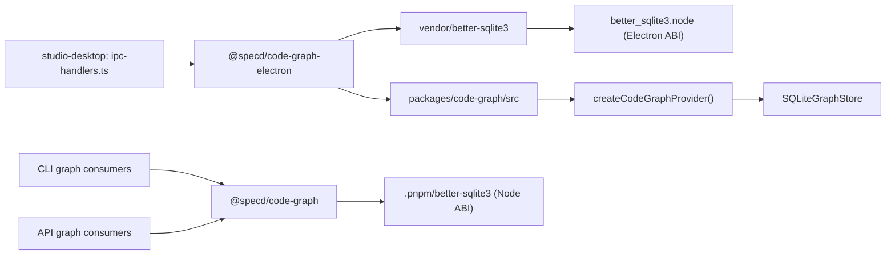

# Design: code-graph-electron

## Non-goals

- Replace the standard `@specd/code-graph` package for CLI or API consumers.
- Introduce a second public npm-distributed graph package.
- Redesign graph semantics, storage behaviour, or desktop IPC contracts beyond what is needed to isolate the Electron runtime path.
- Move desktop graph operations out of Electron main into a helper process or separate service in this change.

## Affected areas

- `createCodeGraphProvider()` in `packages/code-graph/src/composition/create-code-graph-provider.ts`
  Change: preserve the shared provider contract as the source model that the Electron package must mirror.
  Callers: 6 direct, 26 transitive · Risk: CRITICAL
  Note: graph impact shows direct dependents in API and CLI composition, so the standard package must remain stable while desktop moves away from it.

- `SQLiteGraphStore` in `packages/code-graph/src/infrastructure/sqlite/sqlite-graph-store.ts`
  Change: preserve the existing SQLite-backed runtime behaviour while shifting Electron to a physically separate native resolution path.
  Callers: reached via `createCodeGraphProvider()` and the default `sqlite` backend · Risk: MEDIUM
  Note: runtime investigation proved that package-name aliasing is insufficient under `pnpm`; the Electron package must own a distinct on-disk addon path, not just a renamed dependency.

- `apps/specd-studio-desktop/src/main/ipc-handlers.ts`
  Change: replace the direct import from `packages/code-graph/dist/index.js` with `@specd/code-graph-electron`.
  Callers / dependents: the desktop local graph path is a critical integration point; file impact shows 31 direct and 93 transitive dependents for the file-level surface · Risk: CRITICAL
  Note: this remains the desktop coupling point identified in graph exploration and the place where Electron opens the graph provider in-process.

- `apps/specd-studio-desktop/package.json`
  Change: add the new workspace dependency and desktop-only rebuild wiring for the Electron-native sqlite runtime.
  Callers: desktop build and runtime entrypoints · Risk: MEDIUM
  Note: this is where desktop declares its dependency on the Electron-specific graph package and any convenience rebuild script.

- `packages/code-graph/package.json`
  Change: no behavioural change, but design must preserve this package as the standard CLI/API path without forcing Electron-specific dependency resolution into it.
  Callers: CLI and API build/runtime · Risk: HIGH
  Note: accidental coupling here would defeat the runtime split.

- `default:pnpm-workspace.yaml`
  Change: align build policy if vendored native rebuild scripts require explicit inclusion in `onlyBuiltDependencies`.
  Callers: workspace install/build lifecycle · Risk: MEDIUM
  Note: the Electron-native sqlite path must not depend on contributors manually rebuilding ambiguous workspace-level addons.

- `specd.yaml`
  Change: already updated to register the `code-graph-electron` workspace and specs root.
  Callers: project config loader and specd workspace discovery · Risk: LOW

- Documentation surfaces:
  - `docs/studio/packages.md`
  - `docs/client/connection-profiles.md`
  Change: document that desktop local graph composition uses an Electron-specific graph package with a vendored sqlite runtime and is intentionally internal-only.
  Callers: human maintainers and onboarding docs · Risk: LOW

## New constructs

- `packages/code-graph-electron/package.json`
  Shape:
  ```json
  {
    "name": "@specd/code-graph-electron",
    "private": true,
    "type": "module",
    "exports": {
      ".": {
        "import": "./dist/index.js",
        "types": "./dist/index.d.ts"
      }
    }
  }
  ```
  Responsibility: define an internal-only Electron graph package with its own build boundary and vendored sqlite runtime.
  Relationships: consumed by `@specd/studio-desktop`; must not become the runtime graph dependency for CLI or API.

- `packages/code-graph-electron/tsconfig.json`
  Shape:
  ```json
  {
    "extends": "../../tsconfig.base.json",
    "compilerOptions": {
      "outDir": "dist",
      "rootDir": ".."
    },
    "include": ["src", "../code-graph/src", "test", "scripts"]
  }
  ```
  Responsibility: compile the Electron package against shared source input without forking authored graph code.
  Relationships: supports the shared-source model and the package-specific dist output.

- `packages/code-graph-electron/tsup.config.ts`
  Shape:
  ```ts
  export default defineConfig({
    entry: ['src/index.ts'],
    format: ['esm'],
    dts: true,
    bundle: true,
    external: ['@specd/core', 'lbug', 'ignore', '@ast-grep/napi'],
  })
  ```
  Responsibility: produce an Electron-specific build output from the shared code-graph source tree while rewriting sqlite imports to the vendored runtime path.
  Relationships: keeps the authored graph source centralized in `packages/code-graph/src` while letting the emitted package point at a desktop-only sqlite location.

- `packages/code-graph-electron/vendor/better-sqlite3/`
  Shape:
  ```text
  vendor/better-sqlite3/
    package.json
    lib/
    src/
    build/Release/better_sqlite3.node
  ```
  Responsibility: hold the physically separate sqlite addon tree that Electron will load.
  Relationships: populated by a sync/rebuild script owned by `@specd/code-graph-electron`; imported only from the Electron package output.

- `packages/code-graph-electron/scripts/sync-vendored-sqlite.mjs`
  Shape:
  ```ts
  export async function syncVendoredSqlite(): Promise<void>
  ```
  Responsibility: copy the canonical `better-sqlite3` package contents into `vendor/better-sqlite3/` while preserving the package layout expected by its runtime loader.
  Relationships: runs before Electron rebuild so the vendored tree becomes a separate physical module root.

- `packages/code-graph-electron/scripts/rebuild-electron.mjs`
  Shape:
  ```ts
  export async function rebuildVendoredSqliteForElectron(): Promise<void>
  ```
  Responsibility: rebuild the vendored sqlite addon in place against the Electron target used by `studio-desktop`.
  Relationships: invoked by `@specd/code-graph-electron` scripts and optionally proxied by desktop package scripts.

- `packages/code-graph-electron/src/runtime/vendored-better-sqlite3.ts`
  Shape:
  ```ts
  import Database from '../vendor/better-sqlite3/lib/index.js'
  export default Database
  export type { Statement } from '../vendor/better-sqlite3/lib/index.js'
  ```
  Responsibility: provide a stable internal import target for the emitted Electron graph bundle.
  Relationships: referenced by the build rewrite/plugin so `SQLiteGraphStore` resolves through the vendored runtime path.

- Optional `packages/code-graph-electron/README.md`
  Shape: internal usage note describing desktop-only purpose, non-public role, vendored sqlite runtime, and rebuild expectations.
  Responsibility: prevent future contributors from treating the package as a public variant or replacing the vendored path with a logical alias.
  Relationships: supports docs alignment and packaging clarity.

## Approach

The implementation keeps one behavioural graph model but replaces the current false-isolation strategy with a physically separate native module tree.

1. Keep `packages/code-graph/src` as the single authored graph source.
   `@specd/code-graph-electron` continues to build from the shared source so graph semantics stay aligned with `@specd/code-graph`.

2. Stop relying on `pnpm` aliasing for sqlite runtime isolation.
   The implementation attempt proved that `better-sqlite3-electron -> npm:better-sqlite3` still resolves to the same `.pnpm/better-sqlite3@...` store path as the standard package. Under Electron, that path loads the Node-built addon and fails with ABI mismatch. This does not satisfy the spec requirement for isolated native runtime paths.

3. Introduce a vendored sqlite package tree inside `packages/code-graph-electron/vendor/better-sqlite3`.
   The Electron package will own a copied module root whose `package.json`, JS loader files, and compiled `.node` binary live under its own workspace path. That creates a physically separate addon location independent of the root `.pnpm/better-sqlite3@...` store path.

4. Rewrite the Electron package build so `SQLiteGraphStore` resolves sqlite through the vendored runtime entrypoint.
   The emitted `dist/index.js` must import the vendored runtime path, not `better-sqlite3` and not a package alias that collapses back into the shared pnpm store.

5. Add a deterministic sync-and-rebuild flow owned by `@specd/code-graph-electron`.
   The package scripts should:
   - copy the canonical `better-sqlite3` package tree into `vendor/better-sqlite3`
   - rebuild that vendored tree against the Electron version used by `studio-desktop`
   - leave the standard workspace `better-sqlite3` installation untouched for CLI/API

6. Keep `studio-desktop` importing only `@specd/code-graph-electron`.
   The desktop boundary remains a package swap only; UI and IPC contracts stay stable.

7. Keep CLI and API unchanged on `@specd/code-graph`.
   The graph impact around `createCodeGraphProvider()` is high-risk and spans CLI/API composition; preserving their path avoids unnecessary blast radius.

8. Preserve the graph index on startup unless reindex/reset is explicit.
   The implementation already showed one valid hardening: SQLite graph migration must not delete the DB on transient open failures such as ABI mismatch or file locks. That safety remains part of the design because it prevents Electron startup from wiping a valid graph index when the runtime is misconfigured.

This revised approach still covers every spec and verify requirement:
- desktop gets a dedicated package
- provider shape stays compatible
- native runtime path is isolated physically, not cosmetically
- source behaviour stays shared
- package remains internal-only
- Electron-specific rebuild work stays scoped to desktop

## Key decisions

- **Use a vendored sqlite module tree instead of a `pnpm` alias** → The implementation attempt proved that a logical alias still resolves to the same `.pnpm/better-sqlite3@...` path, so Electron keeps loading the standard addon. A vendored tree creates a separate physical module root and satisfies the isolation requirement.
  **Alternatives rejected** → `better-sqlite3-electron: npm:better-sqlite3`, because under `pnpm` it is only a renamed symlink to the same package store path.

- **Reuse `packages/code-graph/src` as the source of truth** → keeps behaviour aligned and avoids a manual fork.
  **Alternatives rejected** → copy-paste fork of `packages/code-graph`, because it creates behavioural drift and duplicate maintenance.

- **Keep graph local in Electron main for this change** → minimizes architectural churn and keeps the problem constrained to packaging/runtime isolation.
  **Alternatives rejected** → helper process or separate local service, because that either preserves the ABI problem or introduces a second packaged runtime.

- **Keep `@specd/code-graph-electron` internal and non-public** → it exists only to support the desktop app and should not become a public compatibility contract.
  **Alternatives rejected** → publishing it as a public npm package, because that would create unnecessary versioning and support obligations.

- **Treat Electron upgrade as optional supporting work** → runtime upgrades may help native rebuild compatibility, but they do not fix the physical-path problem by themselves.
  **Alternatives rejected** → making “latest Electron” the fix, because the failure came from shared module resolution, not just the Electron version.

## Trade-offs

- [Build complexity] → A vendored native package adds sync/rebuild steps and an internal copied module tree.
  Mitigation: keep authored graph logic in one source tree and limit duplication to the sqlite runtime package contents only.

- [Vendor drift] → The vendored sqlite package can drift from the canonical workspace dependency when `better-sqlite3` upgrades.
  Mitigation: make the sync script the single source of vendored contents and test that the vendored package version matches the canonical dependency.

- [False isolation risk] → Build rewrites can still accidentally resolve back to the shared module path if the vendored entrypoint is not used end-to-end.
  Mitigation: add runtime smoke coverage under Electron that asserts the loaded sqlite module path lives under `packages/code-graph-electron/vendor/`.

- [Desktop runtime churn] → upgrading Electron while introducing a vendored runtime can broaden the failure surface.
  Mitigation: keep Electron upgrade optional and validate desktop graph behaviour before and after the runtime swap.

- [Graph index persistence regression] → desktop may still wipe or invalidate graph state if startup code triggers destructive graph flows.
  Mitigation: keep the SQLite migration hardening that refuses to delete the DB on transient open failures, and retain startup smoke coverage around graph stats before/after launch.

## Dependency map



```
┌────────────────────────────────────┐
│ studio-desktop: ipc-handlers.ts    │
│ [CRITICAL desktop graph boundary]  │
└──────────────────┬─────────────────┘
                   │ imports
                   ▼
        ┌──────────────────────────────┐
        │ @specd/code-graph-electron   │
        │ internal-only desktop pkg    │
        └──────────────┬───────────────┘
                       │ builds from
                       ▼
        ┌──────────────────────────────┐
        │ packages/code-graph/src      │
        │ createCodeGraphProvider()    │
        │ SQLiteGraphStore             │
        └──────────────┬───────────────┘
                       │ rewritten import
                       ▼
        ┌──────────────────────────────┐
        │ vendor/better-sqlite3        │
        │ physical module root         │
        └──────────────┬───────────────┘
                       │ loads
                       ▼
        ┌──────────────────────────────┐
        │ better_sqlite3.node          │
        │ Electron-targeted build      │
        └──────────────────────────────┘

┌──────────────┐ imports  ┌───────────────────────┐  uses  ┌──────────────────────────────┐
│ CLI / API    │─────────▶│ @specd/code-graph     │───────▶│ .pnpm/better-sqlite3        │
│ unchanged    │          │ standard package path │       │ standard Node-targeted path │
└──────────────┘          └───────────────────────┘       └──────────────────────────────┘
```

## Migration / Rollback

Migration:
- add the new workspace package
- add the vendored sqlite runtime tree and sync/rebuild scripts
- wire `studio-desktop` to `@specd/code-graph-electron`
- ensure the emitted Electron graph bundle imports the vendored sqlite path
- verify that startup preserves graph stats and that desktop graph queries succeed under Electron
- update desktop docs to describe the internal package role and rebuild workflow

Rollback:
- restore `studio-desktop` imports to the standard `@specd/code-graph` path
- remove the Electron package dependency from desktop
- remove vendored sqlite runtime wiring
- revert any Electron runtime upgrade if it was part of the rollout
- re-run standard desktop build/typecheck to confirm the old path is restored

## Testing

Automated tests:
- `packages/code-graph-electron/test/composition/code-graph-electron.spec.ts`
  - assert the Electron package exports the expected provider surface and types
  - assert the package remains internal-only in metadata expectations
  - assert the emitted build imports the vendored sqlite runtime path rather than `better-sqlite3`
- `packages/code-graph-electron/test/runtime/vendored-sqlite.spec.ts`
  - assert the vendored sqlite package exists under `vendor/better-sqlite3`
  - assert the vendored package version matches the canonical dependency version
  - assert rebuild output lands under the vendored tree rather than the root pnpm store
- `apps/specd-studio-desktop/test/ipc-graph-provider.spec.ts`
  - assert desktop local graph composition imports and uses `@specd/code-graph-electron`
  - assert desktop graph startup does not invoke destructive graph reset paths implicitly
- `apps/specd-studio-desktop/test/desktop-graph-runtime.spec.ts`
  - assert the desktop runtime path resolves through the Electron package boundary
  - assert CLI/API package references are unaffected
- `packages/code-graph/test/infrastructure/sqlite/sqlite-graph-store-migration.spec.ts`
  - assert transient sqlite probe failures do not delete an existing graph database
- existing desktop build/typecheck coverage
  - ensure `ipc-handlers.ts` still compiles against the provider contract after the import swap

Manual / E2E verification:
- `pnpm --filter @specd/code-graph-electron build`
- `pnpm --filter @specd/code-graph-electron rebuild:electron`
- `pnpm --filter @specd/studio-desktop typecheck`
- `pnpm --filter @specd/studio-desktop build`
- run an Electron-runtime smoke script that opens `@specd/code-graph-electron`, reads graph stats, and performs a symbol search
- confirm the smoke script resolves sqlite from `packages/code-graph-electron/vendor/better-sqlite3`
- compare `node packages/cli/dist/index.js graph stats --format json` before and after launching Electron to verify startup does not erase the existing graph index
- launch desktop and confirm graph dashboard/search work with an existing index

## Open questions

- Whether vendoring the sqlite package should copy the entire package tree or only the minimum runtime files (`package.json`, `lib/`, native build output). This must be resolved before rewriting tasks because it changes the sync script scope.
