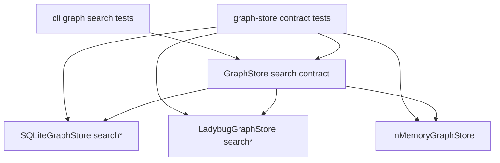

# Design: improve-identity-ranking

## Non-goals

- Replace the current full-text backends or introduce a new search engine.
- Change CLI flags, output shape, or add ranking controls to `graph search`.
- Redesign snippet extraction; snippets stay backend-specific and only ranking changes.
- Expand ranking to non-graph search flows such as `core:search-specs`.

## Affected areas

- `GraphStore` in `packages/code-graph/src/domain/ports/graph-store.ts`
  Change: tighten the abstract search contract from exact-match preference to primary-identity preference for specs, symbols, and documents.
  Dependents: 8 direct, 30 affected files from spec impact on `code-graph:graph-store` · Risk: HIGH
  Note: contract changes must stay implementable by SQLite, Ladybug, and test stores.

- `SQLiteGraphStore` in `packages/code-graph/src/infrastructure/sqlite/sqlite-graph-store.ts`
  Change: augment `searchSymbols`, `searchSpecs`, and `searchDocuments` scoring so identity-based partial matches outrank content-frequency-only hits.
  Dependents: 25 direct, 94 affected files from file impact · Risk: CRITICAL
  Note: this is the default graph backend, so ranking regressions surface immediately in normal CLI use.

- `LadybugGraphStore` in `packages/code-graph/src/infrastructure/ladybug/ladybug-graph-store.ts`
  Change: mirror the same ranking semantics for `searchSymbols`, `searchSpecs`, and `searchDocuments`, despite different query primitives.
  Dependents: 39 direct, 93 affected files from file impact · Risk: CRITICAL
  Note: Ladybug currently uses FTS for specs/symbols but a manual scan for documents, so parity must be designed explicitly.

- `InMemoryGraphStore` in `packages/code-graph/test/helpers/in-memory-graph-store.ts`
  Change: update the test-only store to honor the stronger identity-ranking contract.
  Dependents: 6 direct, 8 affected files from `searchSymbols` impact · Risk: HIGH
  Note: contract tests rely on this store too; leaving it behind would make the abstract contract inconsistent.

- `graphStoreContractTests` in `packages/code-graph/test/domain/ports/graph-store.contract.ts`
  Change: replace exact-only ranking assertions with scenarios for spec-id segments, symbol declared names, and document path components.
  Dependents: shared by all graph-store implementations · Risk: HIGH
  Note: this is the main regression harness for backend parity.

- Backend-specific search tests in `packages/code-graph/test/infrastructure/sqlite/sqlite-graph-store.spec.ts` and `packages/code-graph/test/infrastructure/ladybug/ladybug-graph-store.spec.ts`
  Change: add focused fixtures covering the motivating regressions and backend-specific edge cases.
  Dependents: backend-local only · Risk: MEDIUM
  Note: these tests should prove both parity and that the chosen numeric boosts are sufficient in practice.

- CLI graph-search tests in `packages/cli/test/commands/graph-search.spec.ts`
  Change: add at least one user-visible ranking assertion at the command layer.
  Dependents: `registerGraphSearch` has 10 direct dependents and 167 affected files from file impact, but behavior should remain presentation-compatible · Risk: MEDIUM
  Note: no CLI code change is expected unless tests reveal formatting assumptions tied to old ordering.

## New constructs

- `identity ranking ladder` in graph-store search implementations.
  Shape:

  ```text
  tier 1: exact canonical identity
  tier 2: exact alternate identity or primary declared name
  tier 3: canonical or alternate identity prefix match
  tier 4: canonical or alternate identity segment/path-component match
  tier 5: generic content-only relevance
  ```

  Responsibility: define the observable ordering contract that all backends must honor.
  Relationships:
  - SQLite implements the ladder with backend-native SQL ordering such as `CASE` expressions plus BM25 as the within-tier tie-breaker.
  - Ladybug implements the same ladder with its own backend-local scoring or re-ranking path.
  - `InMemoryGraphStore` may model the same ladder with a pure TypeScript helper because it does not have a query language of its own.

- `identity normalization and segment extraction` inside each backend search implementation.
  Shape:

  ```text
  backend-local query preparation for:
  - normalized full-query equality checks
  - normalized prefix checks
  - id/path segment or component checks
  ```

  Responsibility: prepare the raw query for identity comparisons without introducing a shared cross-backend query-rewrite API.
  Relationships:
  - SQLite may do part of this work in SQL expressions and part in bound parameters.
  - Ladybug may do it in its own search or re-ranking flow.
  - `InMemoryGraphStore` may do it with plain TypeScript helpers.

- `shared token expansion` for specd/code-shaped search text.
  Shape:

  ```ts
  function expandSearchToken(raw: string): string[]

  function expandSearchQuery(rawQuery: string): {
    normalizedQuery: string
    rawTokens: string[]
    expandedTokens: string[]
  }
  ```

  Responsibility: expand user query tokens into useful lexical variants without inferring the intended entity type.
  Rules:
  - preserve the normalized original token
  - split on whitespace
  - split on specd/code separators: `:`, `/`, `_`, `.`, `-`
  - split CamelCase / PascalCase boundaries
  - split useful letter-number and number-letter transitions when present
  - deduplicate while preserving stable order
    Examples:
  - `core:change` -> `core:change`, `core`, `change`
  - `default:_global/architecture` -> `default:_global/architecture`, `default`, `global`, `architecture`
  - `ArchiveChange` -> `archivechange`, `archive`, `change`
  - `ChangeRepository` -> `changerepository`, `change`, `repository`
    Relationships:
  - shared across SQLite, Ladybug, and `InMemoryGraphStore`
  - complements backend tokenization; does not replace backend-native FTS behavior
  - must not classify tokens as “symbol”, “spec”, or “document”

## Approach

1. Define a backend-agnostic identity ladder.
   Rank by classes of evidence instead of raw term frequency alone:
   - exact canonical identity
   - exact alternate identity or primary declared name
   - canonical or alternate identity prefix match
   - canonical or alternate identity segment/path-component match
   - generic content-only relevance

   Canonical identities are:
   - specs: `specId`
   - symbols: `id`
   - documents: `path`

   Alternate/primary identities are:
   - symbols: declared `name`
   - documents: `configRelativePath`

2. Apply the ladder before backend-native relevance.
   The identity ladder is a semantic ordering contract, not a shared scoring function. Each backend is free to implement it with its native primitives, but identity evidence must dominate BM25 or traversal-score variance. Backend-native relevance is used only to break ties inside the same identity tier.

   This contract applies to both:
   - final ordering
   - candidate coverage

   If a backend-native tokenizer would fail to surface a strong identity hit required by the contract, the backend may supplement its native candidate set with identity-derived candidates before final ordering.

3. Preserve existing multi-token discovery.
   This change must not collapse graph search into a single-string `LIKE` strategy. Queries such as `architecture core` or `find blocking parent` must continue to use the backend's existing multi-token discovery behavior to generate candidates.

   Identity-aware ranking is applied after or alongside that candidate-generation step:
   - exact and prefix checks may use the normalized full query when that is meaningful
   - token-level checks must evaluate expanded query tokens, including specd/code-shaped expansions such as `core:change -> core, change` and `ArchiveChange -> archive, change`
   - multi-token queries may accumulate stronger identity evidence when more than one token matches the candidate's canonical or alternate identity
   - when backend-native discovery alone misses a required strong identity hit, the backend may add identity-derived candidates and then apply the same ranking ladder

   This keeps broad discovery behavior intact while still preferring results whose identities explain the query better than body-content frequency alone.

4. Keep matching simple and deterministic.
   For this change, identity-oriented non-exact matching is limited to:
   - full-string equality after normalization
   - prefix checks on the normalized identity string when the full query is a meaningful prefix probe
   - token-level exact, prefix, suffix, and substring checks on selected identity fields
   - component/path-component membership for structured identities, including multi-token queries where several query tokens independently match identity components

   This directly addresses queries like `architecture`, `default`, `findBlockingParent`, or `docs/guide.md` without introducing fuzzy edit distance or acronym matching.

5. Implement parity per entity family.
   - Specs:
     compare the normalized query and its tokens against `specId`, then against `specId` components split on `:`, `/`, `_`, `.`, and `-`.
   - Symbols:
     compare against both `id` and declared `name`; declared-name matches outrank comment-only hits even when comments are denser.
   - Documents:
     compare against `path` and `configRelativePath`, then their path components, so `guide`, `docs/guide.md`, or `architecture` can beat body-only references.

6. Preserve existing filters and snippets.
   Workspace, kind, file pattern, exclude-path, and exclude-workspace filters stay unchanged. Snippet generation and line-range extraction also stay unchanged.

7. Enforce parity through the contract suite first.
   Update shared graph-store contract tests to encode the intended ordering, then satisfy them in SQLite, Ladybug, and the in-memory helper. Backend-specific tests then pin the implementation details that the contract does not fully exercise.

## Backend-specific implementation

### SQLite

- Touch points:
  - `packages/code-graph/src/infrastructure/sqlite/sqlite-graph-store.ts`
    - `searchSymbols()`
    - `searchSpecs()`
    - `searchDocuments()`
    - helper area near `sanitizeFtsQuery()`

- Keep current candidate-generation path exactly where it already exists:
  - `searchSymbols()` continues using `symbol_fts MATCH ?`
  - `searchSpecs()` continues using `spec_fts MATCH ?`
  - `searchDocuments()` continues using `document_fts MATCH ?`
    Do not replace `MATCH` with a raw `LIKE` filter.

- Extend candidate discovery only when required by the contract:
  - FTS `MATCH` remains the default discovery path
  - when `MATCH` alone would miss a strong identity hit for prefix, suffix, substring, or component semantics, SQLite may union in identity-derived candidates
  - this supplementation must stay bounded to selected identity fields and expanded tokens; it is not a fallback to arbitrary whole-row `LIKE` search

- Add backend-local query preparation in TypeScript before the SQL statement is built:
  - `normalizedQuery`, `rawTokens`, and `expandedTokens` come from the shared `expandSearchQuery(options.query)` helper
  - `fullQueryIsSingleToken = rawTokens.length === 1`

- Add backend-local identity preparation for each candidate row inside SQL expressions:
  - use `lower(...)` on canonical and alternate identity fields already stored in SQLite
  - specs: `lower(s.spec_id)`
  - symbols: `lower(s.id)`, `lower(s.name)`
  - documents: `lower(d.path)`, `lower(d.config_relative_path)`

- Change score calculation from one additive exact-match boost to explicit tier columns in the `SELECT`.
  Instead of only:
  - exact equality boost
  - `-bm25(...)`
    compute:
  - `identity_tier`
  - `identity_token_hits`
  - `identity_match_strength`
  - `bm25_score`

- Required SQLite shape in each query:

  ```sql
  SELECT
    ...,
    CASE
      WHEN lower(identity_canonical) = :normalizedQuery THEN 5
      WHEN lower(identity_alternate) = :normalizedQuery THEN 4
      WHEN :fullQueryIsSingleToken = 1 AND lower(identity_canonical) LIKE :prefixQuery THEN 3
      WHEN :fullQueryIsSingleToken = 1 AND lower(identity_alternate) LIKE :prefixQuery THEN 3
      WHEN :identityTokenHits > 0 THEN 2
      ELSE 1
    END AS identity_tier,
    (...sum of per-token identity matches...) AS identity_token_hits,
    (...weighted sum of exact/prefix/suffix/substring/component token matches...) AS identity_match_strength,
    -bm25(fts_table) AS bm25_score
  ...
  ORDER BY
    identity_tier DESC,
    identity_token_hits DESC,
    identity_match_strength DESC,
    bm25_score DESC
  ```

- `identity_token_hits` must be built from one bound predicate per token, not from a single whole-query `LIKE`.
  Example for `architecture core`:
  - bind token predicates for `architecture` and `core`
  - count how many tokens match canonical/alternate identity segments
  - row matching both tokens in identity outranks row matching only one token, even if the latter has denser body text

- Candidate supplementation in SQLite must reuse the same expanded-token identity predicates as the ordering logic.
  This avoids a split where a candidate is admitted through one notion of identity matching but ranked with another.

- Expanded tokens from the shared helper must participate in SQLite identity ranking.
  Example:
  - raw token `core:change` contributes checks for `core:change`, `core`, and `change`
  - raw token `ArchiveChange` contributes checks for `archivechange`, `archive`, and `change`
    This is required because SQLite FTS and plain SQL matching do not natively understand CamelCase or specd identity separators the way this feature needs.

- Token match strength in SQLite must follow this order on selected identity fields:
  1. exact token match: `x`
  2. prefix token match: `x%`
  3. suffix token match: `%x`
  4. substring token match: `%x%`

- For structured identities, true component matches must rank above arbitrary substring matches.
  Practical implementation options allowed by this design:
  - build boundary-aware `LIKE` checks in TypeScript and bind them as SQL parameters
  - or pre-normalize identity strings with separator padding in SQL expressions and check token boundaries there
    The implementation must avoid promoting `core` in `score` to the same strength as `core` in `core:change`.

- Per-method specifics:
  - `searchSymbols()`
    - canonical identity: `s.id`
    - alternate identity: `s.name`
    - preserve existing snippet extraction from `files.content`
    - keep `options.kinds`, `filePattern`, `workspace`, and excludes exactly as post-query filters unless separately refactored
  - `searchSpecs()`
    - canonical identity: `s.spec_id`
    - no alternate identity tier beyond canonical id for this change
    - preserve existing `snippet(spec_fts, ...)`
  - `searchDocuments()`
    - canonical identity: `d.path`
    - alternate identity: `d.config_relative_path`
    - preserve existing `snippet(document_fts, ...)`

- Continue using SQLite FTS only for discovery and within-tier tie-breaking.
  Identity semantics are added through explicit ranking columns and `ORDER BY`, plus bounded identity-derived candidate supplementation when needed, not by hoping BM25 field weighting will solve it.

### Ladybug

- Touch points:
  - `packages/code-graph/src/infrastructure/ladybug/ladybug-graph-store.ts`
    - `searchSymbols()`
    - `searchSpecs()`
    - `searchDocuments()`
    - helper area near `sanitizeFtsQuery()` and `extractMatchSnippet()`

- Keep current discovery path unchanged:
  - `searchSymbols()` continues calling `QUERY_FTS_INDEX('Symbol', 'symbol_fts', ...)`
  - `searchSpecs()` continues calling `QUERY_FTS_INDEX('Spec', 'spec_fts', ...)`
  - `searchDocuments()` continues using the current manual scan over `getAllDocuments()`

- Extend candidate discovery only when required by the contract:
  - Ladybug keeps its native discovery path first
  - when native tokenization would miss a required strong identity hit, the backend may append identity-derived candidates before reranking
  - the supplementation step must use the same expanded-token identity semantics as the reranking step so observable ordering remains consistent

- Do not attempt to encode the full ladder in the Ladybug query string.
  Instead:
  1. fetch the same candidate set Ladybug already discovers
  2. optionally supplement it with identity-derived candidates for missed strong hits
  3. compute backend-local identity ranking fields in TypeScript
  4. sort the resulting rows in memory before returning

- Add a backend-local rerank helper near the search methods:

  ```ts
  interface IdentityRerank {
    readonly tier: number
    readonly tokenHits: number
    readonly matchStrength: number
    readonly nativeScore: number
  }
  ```

  This helper is local to Ladybug, not shared with SQLite.

- Required reranking flow in `searchSymbols()` and `searchSpecs()`:
  - keep `QUERY_FTS_INDEX` and existing WHERE/filter conditions
  - return native `score` from Ladybug as `nativeScore`
  - allow a bounded identity-derived candidate supplementation step before sorting when native tokenization misses a required strong hit
  - compute:
    - `tier` from exact/prefix/token identity evidence
    - `tokenHits` from per-token identity-component matches
    - `matchStrength` from exact/prefix/suffix/substring/component token evidence on identity fields
  - sort rows by:
    1. `tier DESC`
    2. `tokenHits DESC`
    3. `matchStrength DESC`
    4. `nativeScore DESC`

- Required reranking flow in `searchDocuments()`:
  - keep current manual candidate detection so multi-token document discovery still works
  - allow the same identity-derived candidate supplementation semantics if the manual discovery path still misses a required strong hit
  - after a document becomes a candidate, compute the same `tier`, `tokenHits`, and `matchStrength`
  - sort with the same ordering as symbols/specs

- Per-method specifics:
  - `searchSymbols()`
    - canonical identity: `symbol.id`
    - alternate identity: `symbol.name`
    - preserve current snippet fetch from file content
  - `searchSpecs()`
    - canonical identity: `spec.specId`
    - preserve current dependency fetch and `extractMatchSnippet(...)`
  - `searchDocuments()`
    - canonical identity: `document.path`
    - alternate identity: `document.configRelativePath`
    - preserve current `extractMatchSnippet(...)`

- The Ladybug reranker must use token coverage, not just full-query string checks.
  Query `architecture core` must reward identities matching both `architecture` and `core`, even if Ladybug FTS discovered candidates through content first.

- The Ladybug reranker must apply the same token-strength ladder as SQLite on selected identity fields:
  - exact token match
  - prefix token match
  - suffix token match
  - substring token match
    with true identity-component matches ranked above arbitrary substring matches.

- Expanded tokens from the shared helper must participate in Ladybug reranking for the same reason as SQLite.
  Queries containing specd ids or code-shaped names must benefit from separator-aware and CamelCase-aware expansion before reranking compares them against identity fields.

### In-memory test store

- Touch points:
  - `packages/code-graph/test/helpers/in-memory-graph-store.ts`
    - `searchSymbols()`
    - `searchSpecs()`
    - `searchDocuments()`

- Implement the same observable ladder entirely in TypeScript after the store builds its current candidate lists.
- This store is not a production design reference. Its job is to make contract tests express the same ordering expected from SQLite and Ladybug.
- Implementation should mirror Ladybug structurally:
  - generate current candidates
  - compute `tier`
  - compute `tokenHits`
  - compute `matchStrength`
  - sort by `tier`, `tokenHits`, `matchStrength`, then existing content score
  - use the same shared expanded tokens as SQLite and Ladybug

## Key decisions

- **Use a tiered boost ladder instead of tweaking BM25 weights** -> the problem is semantic, not lexical. We need identity evidence to dominate even when common words appear more often elsewhere.
  **Alternatives rejected** -> relying on larger FTS field weights alone is brittle because the backends do not expose equivalent controls, and common terms like `default` still drown out the intended result when content frequency is high.

- **Treat path/id segments as first-class identity signals** -> queries often target one component of a canonical identity, not the full id.
  **Alternatives rejected** -> exact-only ranking leaves the motivating regressions unsolved; substring-anywhere ranking is too weak and lets body text compete on equal footing.

- **Do not force a shared `computeIdentityRank` function across backends** -> the portable requirement is the tiered ordering contract, not a common implementation shape.
  **Alternatives rejected** -> a shared helper would fit the in-memory test store but would not match how SQLite and Ladybug actually rank results, where SQL ordering or backend-local re-ranking is the natural implementation.

- **Do not define a backend-agnostic query rewrite helper** -> the portable requirement is which identity signals must be detected, not a single function that converts raw user input into a canonical token structure.
  **Alternatives rejected** -> a shared `splitIdentityQuery`-style helper would blur the line between semantic ranking requirements and backend-specific query preparation, and could diverge from how SQLite and Ladybug naturally evaluate identity evidence.

- **Introduce a shared token expansion helper for specd/code-shaped text** -> separator-aware and CamelCase-aware expansion is lexical preprocessing, not semantic query interpretation, and it fills gaps that backend tokenizers do not reliably cover.
  **Alternatives rejected** -> relying only on backend-native tokenization would miss useful expansions such as `core:change -> core, change` and `ArchiveChange -> archive, change`.

- **Preserve backend-native multi-token candidate discovery** -> identity ranking should refine the ordering of relevant candidates, not replace existing search semantics with single-string `LIKE` checks.
  **Alternatives rejected** -> evaluating only the raw full query against identities would miss common multi-token searches such as `architecture core`, while naive `%term%` SQL matching would be weaker and less expressive than the current backend search pipelines.

- **Use an explicit token-match strength ladder on identity fields** -> exact token hits outrank prefix hits, which outrank suffix hits, which outrank arbitrary substring hits.
  **Alternatives rejected** -> treating all partial matches equally would let weak `%x%` coincidences compete too closely with high-intent identity matches.

- **Rank real identity components above arbitrary substrings** -> for structured identities like `core:change` or `docs/architecture/spec.md`, a token matching a true component is stronger evidence than a token appearing somewhere inside a larger string.
  **Alternatives rejected** -> plain `%x%` matching on the whole identity string is too permissive and produces false-positive boosts such as `core` matching `score`.

- **Use backend-native relevance only as a tie-breaker within a tier** -> preserves useful full-text ordering without allowing content density to overtake identity intent.
  **Alternatives rejected** -> replacing FTS relevance entirely would degrade general exploratory search quality.

- **Bring `InMemoryGraphStore` up to contract parity** -> the test store must model the same semantics as production stores.
  **Alternatives rejected** -> special-casing contract expectations per backend would weaken the abstraction and hide regressions.

## Trade-offs

- Stronger identity boosts improve intent-focused queries but may reduce the visibility of content-heavy results for ambiguous one-word searches. This is acceptable because the change targets direct identity lookup quality.
- Segment matching can elevate short common tokens such as `default`. That is intentional, but the ladder must still require identity evidence on the actual candidate instead of broad substring matches in descriptions/comments.
- SQLite and Ladybug will likely use slightly different mechanics to derive the same tier. The contract must constrain ordering, not exact numeric scores.

## Spec impact

- `cli:graph-search`
  Search results must reflect primary-identity preference without any CLI contract expansion.

- `code-graph:graph-store`
  The abstract store contract now guarantees identity-first ordering for exact and strong non-exact identity queries.

- `code-graph:sqlite-graph-store`
  SQLite search queries must compute and apply primary-identity boosts for specs, symbols, and documents.

- `code-graph:ladybug-graph-store`
  Ladybug search queries must provide equivalent primary-identity ordering, including document-path identities.

- Docs
  No dedicated docs update is required. This is a quality-of-ranking change inside an existing command contract.

## Dependency map



```text
graph-search CLI/tests
  -> GraphStore contract
     -> SQLiteGraphStore
     -> LadybugGraphStore
     -> InMemoryGraphStore
```

## Migration / Rollback

- Migration: none. Ranking changes are in-memory/query-time only and do not require schema or artifact changes.
- Rollback: revert the scoring helper usage and the associated contract/backend tests together. No persisted data needs repair.

## Testing

- Shared contract tests in `packages/code-graph/test/domain/ports/graph-store.contract.ts`
  - exact canonical identity still ranks first
  - spec-id segment outranks body-only hits
  - symbol declared name outranks comment-only hits
  - document path component outranks body-only hits

- SQLite backend tests in `packages/code-graph/test/infrastructure/sqlite/sqlite-graph-store.spec.ts`
  - partial `specId` query like `architecture` ranks `default:_global/architecture` over content-heavy distractors
  - multi-token query like `architecture core` still returns candidates through the existing backend search path, while identity signals improve ordering among those candidates
  - symbol-name query like `findBlockingParent` ranks the owning symbol over comment-only mentions
  - config-relative path component participates in document ranking

- Ladybug backend tests in `packages/code-graph/test/infrastructure/ladybug/ladybug-graph-store.spec.ts`
  - same three scenarios as SQLite to prove parity
  - multi-token identity-oriented queries preserve backend discovery semantics instead of degrading to whole-query string matching
  - document ranking remains correct despite the manual document scan implementation

- CLI test in `packages/cli/test/commands/graph-search.spec.ts`
  - user-facing graph search preserves the identity-first ordering returned by the provider

## Open questions

- None. The proposal already fixed scope to ranking semantics within graph-backed search only.
