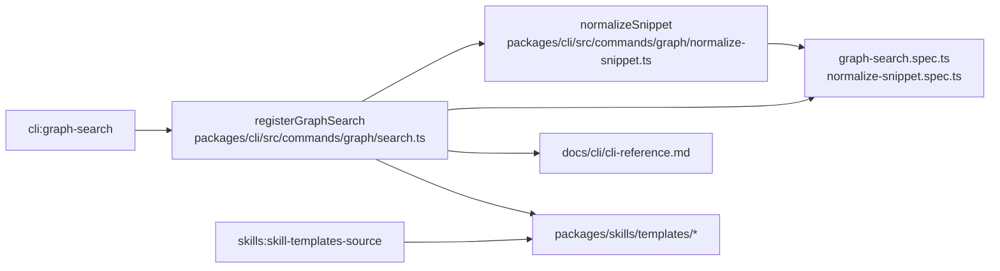

# Design: sanitize-graph-search-snippets

## Non-goals

- Do not change graph indexing, ranking, token expansion, or document classification rules.
- Do not exclude `.turbo` logs or other textual non-code files from the document index.
- Do not change `--spec-content` semantics beyond clarifying how it coexists with `--snippet`.
- Do not add new backend search coordinates such as exact match columns for spec/document hits; this change stays within the existing `startLine` / `endLine` contract for non-symbol results.

## Affected areas

- `registerGraphSearch()` in [packages/cli/src/commands/graph/search.ts](/Users/monki/Documents/Proyectos/specd/packages/cli/src/commands/graph/search.ts:25)
  Change: add `--snippet`, suppress snippet emission by default in `text`, `json`, and `toon`, keep compact location metadata visible, and update structured output shape so `snippet` is emitted only when requested.
  Callers: graph command registration through the CLI entrypoint; file-level impact reports `10` direct dependents and `77` transitive dependents with `CRITICAL` risk because the command is wired through the shared CLI program assembly.
  Note: the implementation must avoid breaking unrelated graph commands and must keep current config resolution, lock checks, and provider delegation intact.

- `normalizeSnippet()` in [packages/cli/src/commands/graph/normalize-snippet.ts](/Users/monki/Documents/Proyectos/specd/packages/cli/src/commands/graph/normalize-snippet.ts:11)
  Change: sanitize ANSI escape sequences and non-printable control characters before indentation normalization and rendering.
  Callers: `2` direct dependents and `4` affected files according to symbol impact, with `MEDIUM` risk.
  Note: the helper is currently a pure formatting step; it should remain pure and local to CLI rendering.

- [packages/cli/test/commands/graph-search.spec.ts](/Users/monki/Documents/Proyectos/specd/packages/cli/test/commands/graph-search.spec.ts:1)
  Change: update expectations for default text output, add coverage for `--snippet` in text and structured formats, and assert snippet omission by default.
  Risk: HIGH test-surface importance because this file is the primary command-level contract test for `graph search`.

- [packages/cli/test/commands/graph/normalize-snippet.spec.ts](/Users/monki/Documents/Proyectos/specd/packages/cli/test/commands/graph/normalize-snippet.spec.ts:1)
  Change: add sanitization-focused unit cases for ANSI escape removal and control-character stripping while preserving readable visible text.
  Risk: MEDIUM; narrow helper-level coverage.

- [docs/cli/cli-reference.md](/Users/monki/Documents/Proyectos/specd/docs/cli/cli-reference.md:1121)
  Change: document `--snippet`, compact default output, and the structured-output rule that `snippet` is omitted unless requested.
  Risk: LOW runtime risk but required by global docs rules because the CLI command contract changes.

- `skills:skill-templates-source` via [packages/skills/templates/shared/shared.md.tpl](/Users/monki/Documents/Proyectos/specd/packages/skills/templates/shared/shared.md.tpl:480), [packages/skills/templates/skills/specd-new/SKILL.md.tpl](/Users/monki/Documents/Proyectos/specd/packages/skills/templates/skills/specd-new/SKILL.md.tpl:58), and [packages/skills/templates/skills/specd-design/SKILL.md.tpl](/Users/monki/Documents/Proyectos/specd/packages/skills/templates/skills/specd-design/SKILL.md.tpl:142)
  Change: bring workflow-template examples and guidance into conformance with the new graph-search contract so snippets are described as opt-in across text and structured formats.
  Risk: LOW runtime risk, but spec-governed workflow behavior in the `skills` workspace means these are not merely incidental docs edits.

- `packages/skills/templates/shared/shared.md.tpl`
  Change: update graph-search examples and guidance so agents know to add `--snippet` when they want preview text rather than metadata-only results.
  Risk: LOW runtime risk, HIGH workflow clarity impact.

- `packages/skills/templates/skills/specd-new/SKILL.md.tpl`
  Change: mention `--snippet` in discovery guidance when preview context is useful.
  Risk: LOW.

- `packages/skills/templates/skills/specd-design/SKILL.md.tpl`
  Change: mention `--snippet` in design-phase graph-search guidance when full preview text is intentionally required.
  Risk: LOW.

- Generated skill artifacts under `.codex/skills` and `.agents/skills`
  Change: refresh only if the repository’s normal skills-generation workflow expects checked-in generated copies to stay aligned with template changes.
  Risk: LOW, but the implementation must treat `packages/skills/templates/...` as the source of truth and avoid ad hoc divergence.

## New constructs

- `snippet?: boolean` in the parsed options type inside [packages/cli/src/commands/graph/search.ts](/Users/monki/Documents/Proyectos/specd/packages/cli/src/commands/graph/search.ts:78)
  Shape:

  ```ts
  {
    snippet?: boolean
  }
  ```

  Responsibility: capture the CLI opt-in for preview emission across `text`, `json`, and `toon`.
  Relationships: consumed only by `registerGraphSearch()` render logic; does not reach `SearchOptions` or `CodeGraphProvider`.

- `stripTerminalControlSequences(text: string): string` in [packages/cli/src/commands/graph/normalize-snippet.ts](/Users/monki/Documents/Proyectos/specd/packages/cli/src/commands/graph/normalize-snippet.ts:1)
  Shape:

  ```ts
  function stripTerminalControlSequences(text: string): string
  ```

  Responsibility: remove ANSI escape sequences and non-printable control characters other than newline and tab before snippet indentation normalization.
  Relationships: private helper used only by `normalizeSnippet`; no export from the module.

- `renderSnippetBlock(...)` helper local to [packages/cli/src/commands/graph/search.ts](/Users/monki/Documents/Proyectos/specd/packages/cli/src/commands/graph/search.ts:25)
  Shape:

  ```ts
  function renderSnippetBlock(
    lines: string[],
    snippet: string,
    startLine: number,
    endLine: number,
  ): void
  ```

  Responsibility: centralize text-mode snippet rendering so symbols, specs, and documents all follow the same `--snippet` gate and sanitized block format.
  Relationships: internal helper only; called from each category branch.

- `renderMatchLocation(startLine: number, endLine: number): string` helper local to [packages/cli/src/commands/graph/search.ts](/Users/monki/Documents/Proyectos/specd/packages/cli/src/commands/graph/search.ts:25)
  Shape:
  ```ts
  function renderMatchLocation(startLine: number, endLine: number): string
  ```
  Responsibility: format compact match metadata for specs/documents when snippet blocks are omitted.
  Relationships: internal helper used in text-mode spec/document branches.

## Approach

The implementation should preserve the existing three-stage command flow: parse options, resolve CLI context and lock state, then delegate category searches through `CodeGraphProvider`. The change is entirely in the CLI surface and rendering layer.

1. Extend `graph search` option parsing with `--snippet`.
   The option is a render/output control, not a search control. It must not be forwarded to `SearchOptions` and must not alter ranking or retrieval.

2. Keep provider queries unchanged.
   The command should continue requesting symbol/spec/document results exactly as it does today so the CLI still has `snippet`, `startLine`, and `endLine` available internally. This avoids widening the code-graph backend contract in this change.

3. Change text-mode rendering to compact-by-default.
   - Symbols:
     - first line stays `[workspace] <kind> <name>`
     - second line becomes `<configRelativePath>:<line>:<column>`
     - snippet block is appended only when `opts.snippet === true`
   - Specs:
     - first line stays `[workspace] <specId>`
     - second line becomes `match @ L<startLine>-L<endLine>`
     - snippet block is appended only when `opts.snippet === true`
   - Documents:
     - first line stays `[workspace] <configRelativePath>`
     - second line becomes `match @ L<startLine>-L<endLine>`
     - snippet block is appended only when `opts.snippet === true`

4. Change structured rendering to omit `snippet` by default.
   The current `json` / `toon` payloads always include `snippet`. The command must stop serializing that field unless `opts.snippet === true`. `startLine` and `endLine` stay present in all structured outputs. `--spec-content` continues to control only full spec content emission and remains independent from `--snippet`.

5. Sanitize rendered snippet text centrally.
   `normalizeSnippet()` should first strip:
   - ANSI escape sequences
   - C0/C1 non-printable control characters except `\n` and `\t`

   After sanitization, the existing tab-expansion, trailing-trim, minimum-indent calculation, and outer-margin behavior should continue unchanged.

6. Update docs and skill guidance together with the code contract.
   - CLI reference: add `--snippet`, explain compact default output, and document structured omission of `snippet` unless requested.
   - Skill templates: update graph-search examples so agent guidance does not assume preview text is always present.
   - The skill-template edits are governed by `skills:skill-templates-source`, so implementation must satisfy both the CLI contract spec and the workflow-template source spec.

7. Refresh generated skill artifacts only through the repository’s normal generation/sync path if checked-in copies must mirror template changes. Do not hand-edit generated copies unless the repo convention requires that exact outcome.

## Key decisions

- **`--snippet` is a render/output flag, not a search flag** → ranking, retrieval, and provider query semantics remain unchanged.  
  **Alternatives rejected** → passing the flag into `SearchOptions` or backend stores would widen contracts without changing search behavior.

- **Compact text output is the new default** → the default command becomes faster to scan in terminals and avoids accidental rendering of noisy preview text.  
  **Alternatives rejected** → keeping snippets on by default would preserve the existing noisy behavior and continue exposing malformed output when logs contain control sequences.

- **Structured outputs omit `snippet` unless requested** → the user explicitly requested parity with text-mode opt-in behavior.  
  **Alternatives rejected** → leaving `snippet` always present in `json` / `toon` would create inconsistent command semantics across formats.

- **Spec/document compact output uses `startLine` / `endLine`, not new exact columns** → this keeps the change within the current backend contract and avoids modifying `@specd/code-graph` result shapes.  
  **Alternatives rejected** → adding exact match columns would require backend and provider contract expansion, more specs in scope, and a larger blast radius than this change needs.

- **Sanitization stays in `normalizeSnippet()`** → one place already owns visible snippet preparation, so one place should own visible snippet sanitation.  
  **Alternatives rejected** → sanitizing in each category branch would duplicate logic and risk drift between symbols, specs, and documents.

- **Skill guidance changes are template-first** → `packages/skills/templates/...` is the durable source of truth.  
  **Alternatives rejected** → editing only installed/generated skill copies would leave the package source stale and invite later regressions.

## Trade-offs

- `[Behavior change for machine consumers]` → Omitting `snippet` by default from `json` / `toon` is a compatibility change for consumers that relied on unconditional snippet presence.  
  Mitigation: keep `startLine` / `endLine` always present, document the change clearly, and make `--snippet` explicit and uniform across formats.

- `[Reduced default context for spec/document hits]` → Compact output makes the first command result less verbose.  
  Mitigation: `--snippet` restores prior rich preview behavior on demand.

- `[Partial location precision for non-symbol hits]` → Specs/documents keep line-range metadata rather than exact columns.  
  Mitigation: preserve preview availability behind `--snippet`; if exact columns become important later, that can be a separate backend-contract change.

## Spec impact

### `cli:graph-search`

- Direct dependent specs found in repository text search: none.
- Transitive dependent specs found in repository text search: none.
- Ripple assessment:
  - no other checked-in spec currently declares a direct dependency on `cli:graph-search`
  - docs, skill guidance, and changeset text reference the command, but the spec-level governance for workflow templates is handled separately by `skills:skill-templates-source`
  - no additional spec scope is required from ripple analysis beyond the already-added `skills:skill-templates-source`

### `skills:skill-templates-source`

- Direct dependent specs found in repository text search: none requiring additional changes.
- Transitive dependent specs found in repository text search: none requiring additional changes.
- Ripple assessment:
  - this change clarifies how workflow templates describe `specd graph search`
  - `skills:workflow-automation` remains unaffected because it governs format-selection policy, not the content contract of graph-search examples
  - no additional `skills` spec scope is required

## Dependency map



```text
┌──────────────────────────────┐
│ cli:graph-search             │
│ spec delta + verify delta    │
└──────────────┬───────────────┘
               │
               ▼
┌──────────────────────────────┐       uses        ┌──────────────────────────────┐
│ registerGraphSearch()        │──────────────────▶│ normalizeSnippet()          │
│ packages/cli/src/commands/   │                   │ packages/cli/src/commands/  │
│ graph/search.ts              │                   │ graph/normalize-snippet.ts  │
│ [CRITICAL file impact]       │                   │ [MEDIUM symbol impact]      │
└───────┬───────────────┬──────┘                   └──────────────┬──────────────┘
        │               │                                         │
        │               │                                         │
        ▼               ▼                                         ▼
┌───────────────┐  ┌──────────────────────┐             ┌─────────────────────────┐
│ CLI reference │  │ skills templates     │             │ normalize-snippet.spec  │
│ docs/cli/...  │  │ packages/skills/...  │             │ graph-search.spec       │
└───────────────┘  └──────────┬───────────┘             └─────────────────────────┘
                              │
                              ▼
                    ┌──────────────────────┐
                    │ skills:skill-        │
                    │ templates-source     │
                    └──────────────────────┘
```

## Migration / Rollback

- Migration:
  - no data migration is required
  - release notes or changelog text should call out that `snippet` is now opt-in across all output formats
  - machine consumers of `json` / `toon` must add `--snippet` if they rely on the `snippet` field

- Rollback:
  - revert the CLI rendering and serialization changes
  - revert the CLI reference and skill-template guidance changes so the docs match restored behavior
  - no persistent state cleanup is required

## Testing

### Automated tests

- Update [packages/cli/test/commands/graph-search.spec.ts](/Users/monki/Documents/Proyectos/specd/packages/cli/test/commands/graph-search.spec.ts:1)
  - assert default text-mode document results do not render snippet blocks
  - assert text-mode symbol results still show identity plus `path:line:column`
  - assert `--snippet` restores snippet blocks in text mode
  - assert default `json` output omits `snippet`
  - assert `json --snippet` includes `snippet`
  - assert default `toon` output omits `snippet`
  - assert `toon --snippet` includes `snippet`
  - assert `--spec-content` without `--snippet` still omits `snippet`

- Update [packages/cli/test/commands/graph/normalize-snippet.spec.ts](/Users/monki/Documents/Proyectos/specd/packages/cli/test/commands/graph/normalize-snippet.spec.ts:1)
  - assert ANSI escape sequences are stripped
  - assert non-printable control characters are stripped while newline and tab behavior remains correct
  - assert indentation normalization still behaves the same after sanitization

- If the repo has skill-template snapshot or sync tests, extend them to cover updated graph-search examples or regenerated output. If there is no such test harness, rely on file-content review plus the package’s normal validation workflow.
- If the repo has skill-template snapshot or sync tests, extend them to cover updated graph-search examples or regenerated output. If there is no such test harness, rely on file-content review plus the package’s normal validation workflow.
- If template-to-installed-skill sync is a checked-in workflow requirement, run that refresh path and verify the resulting generated copies stay aligned with the updated `skills:skill-templates-source` contract.

### Manual / E2E verification

1. Reproduce the compact default:
   - run `node packages/cli/dist/index.js graph search "repository" --documents`
   - expect a `Documents` section with identity + location metadata and no snippet block

2. Verify text-mode opt-in snippets:
   - run `node packages/cli/dist/index.js graph search "repository" --documents --snippet`
   - expect `snippet @ Lx-Ly:` blocks to appear
   - confirm visible snippet text no longer prints raw ANSI escape sequences

3. Verify structured omission:
   - run `node packages/cli/dist/index.js graph search "repository" --documents --format json`
   - confirm `snippet` fields are absent while `startLine` / `endLine` remain

4. Verify structured opt-in:
   - run `node packages/cli/dist/index.js graph search "repository" --documents --format json --snippet`
   - confirm `snippet` fields are present
   - repeat with `--format toon`

5. Verify `--spec-content` interaction:
   - run `node packages/cli/dist/index.js graph search "graph search" --specs --format json --spec-content`
   - confirm `content` is present and `snippet` is still absent unless `--snippet` is also supplied

6. Verify docs:
   - inspect `docs/cli/cli-reference.md`
   - confirm the `graph search` section documents `--snippet`, compact default output, and structured opt-in snippet behavior

7. Verify skill guidance:
   - inspect the updated template files in `packages/skills/templates/...`
   - confirm graph-search examples mention `--snippet` only when preview text is intentionally needed

### Global constraints

- Preserve ESM, named exports, and explicit return types.
- Keep snippet sanitization in CLI-layer helpers only; no domain or core-layer changes.
- Add or update JSDoc for any new helper functions introduced in source files.
- Keep tests under `packages/cli/test/...` and use Vitest.

## Open questions

- none
