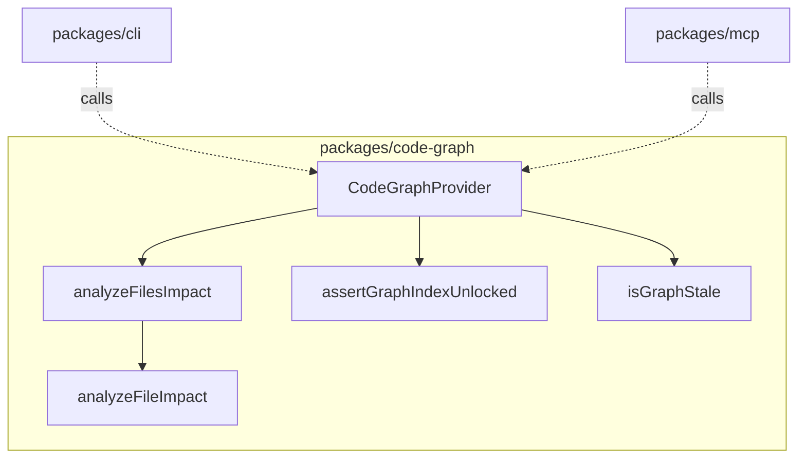

# Design: code-graph-logic-refactor

## Affected areas

- **`packages/code-graph/src/composition/code-graph-provider.ts`**
  - Change: Add `analyzeFilesImpact(filePaths: string[], direction, maxDepth)` method delegating to the new domain service. Add `assertGraphIndexUnlocked()` and `acquireGraphIndexLock(config)` locking helpers.
  - Callers: CLI commands, MCP server.
  - Risk: CRITICAL (Direct dependents: 1, Transitive dependents: 19, Affected files: 18, Affected symbols: 28). Requires strict backward compatibility.
- **`packages/cli/src/commands/graph/impact.ts`**
  - Change: Simplify `handleFilesImpact` to delegate multi-file impact aggregation calculation to `CodeGraphProvider.analyzeFilesImpact` instead of calculating it inline. Update index lock/unlock import paths. Normalize `affectedSymbols` paths in spec impact. Expose aggregate fields in single-file JSON/TOON output. Add staleness and fingerprint mismatch warning checks.
  - Callers: CLI execution path (`graph impact` command).
  - Risk: MEDIUM
- **`packages/cli/src/commands/graph/index-graph.ts`**
  - Change: Simplify to delegate lock checks and config merging to `@specd/code-graph`. Update to pass `onProgress` callback to `provider.index()`. Fix worker crash under bootstrap mode by avoiding null `kernel` reference checks when listing synthetic workspaces.
  - Callers: CLI execution path (`graph index` command).
  - Risk: LOW
- **`packages/cli/src/commands/graph/stats.ts`**
  - Change: Delegate staleness check and lock validation to `@specd/code-graph` provider. Update configuration parsing/import paths.
  - Callers: CLI execution path (`graph stats` command).
  - Risk: LOW
- **`packages/cli/src/commands/graph/graph-index-lock.ts`**
  - Change: Remove this file entirely, replacing its usage with locking functions imported from `@specd/code-graph`.
  - Callers: CLI index, stats, hotspots, and impact commands.
  - Risk: LOW
- **`packages/cli/src/commands/graph/build-project-graph-config.ts`**
  - Change: Remove this file entirely, moving its logic to `@specd/code-graph`.
  - Callers: CLI graph index.
  - Risk: LOW
- **`packages/cli/src/commands/graph/bootstrap-graph-config.ts`**
  - Change: Remove this file entirely, moving its logic to `@specd/code-graph`.
  - Callers: CLI graph commands context resolution.
  - Risk: LOW
- **`packages/cli/src/commands/graph/resolve-graph-cli-context.ts`**
  - Change: Update imports of `createBootstrapGraphConfig` to point to `@specd/code-graph`.
  - Callers: CLI commands context resolver.
  - Risk: LOW
- **`packages/cli/src/commands/project/status.ts`**
  - Change: Update imports of `buildProjectGraphConfig` to point to `@specd/code-graph`.
  - Callers: CLI `project status` command.
  - Risk: LOW
- **`packages/cli/src/commands/graph/hotspots.ts`**
  - Change: Update imports of locking functions to point to `@specd/code-graph`. Add staleness and fingerprint mismatch warning checks.
  - Callers: CLI `graph hotspots` command.
  - Risk: LOW
- **`packages/cli/src/commands/graph/search.ts`**
  - Change: Update imports of locking functions to point to `@specd/code-graph`. Add staleness and fingerprint mismatch warning checks.
  - Callers: CLI `graph search` command.
  - Risk: LOW
- **`packages/code-graph/src/index.ts`**
  - Change: Export the moved locking, configuration merging, and bootstrap configuration creation functions from `@specd/code-graph`. Expose all internal types required by CLI.
  - Callers: CLI commands, external consumers of the code-graph package.
  - Risk: MEDIUM
- **CLI Command Tests (`packages/cli/test/commands/`):**
  - Target files: `graph-hotspots.spec.ts`, `graph-impact.spec.ts`, `graph-index.spec.ts`, `graph-search.spec.ts`, `graph-stats.spec.ts`, `project-status.spec.ts`
  - Change: Update imports and relative/mock references to point to `@specd/code-graph` or the new provider methods instead of local CLI helper files. Add coverage for lock failure exit code 3 paths.
  - Risk: LOW
- **Moved Config Test (`packages/cli/test/commands/build-project-graph-config.spec.ts`):**
  - Change: Move this test file to `packages/code-graph/test/application/services/build-project-graph-config.spec.ts` and update it to import from `@specd/code-graph`.
  - Risk: LOW
- **`docs/code-graph/use-cases.md`**
  - Change: Create document to describe the exported use cases of `@specd/code-graph` (e.g. `IndexCodeGraph`, `DiscoverFiles`).
  - Risk: LOW
- **`docs/code-graph/services.md`**
  - Change: Create document to describe the exported services and lock/configuration helpers of `@specd/code-graph`.
  - Risk: LOW

## New constructs

### `analyzeFilesImpact` service

- **Location:** `packages/code-graph/src/domain/services/analyze-files-impact.ts`
- **Shape:**
  ```typescript
  export function analyzeFilesImpact(
    store: GraphStore,
    filePaths: string[],
    direction: 'upstream' | 'downstream' | 'both',
    maxDepth?: number,
  ): Promise<FileImpactResult>
  ```
- **Responsibility:** Executes individual file impact analysis for all target file paths and returns the aggregated result containing combined affected files, combined affected symbols, combined risk levels (maximum of all risk levels), and summed direct/indirect/transitive counts.
- **Relationships:** Used by `CodeGraphProvider.analyzeFilesImpact`. Depends on `analyzeFileImpact`.

### Mutex Lock Management

- **Location:** `packages/code-graph/src/infrastructure/index-lock.ts`
- **Shape:**
  ```typescript
  export function assertGraphIndexUnlocked(config: SpecdConfig): void
  export function acquireGraphIndexLock(config: SpecdConfig): () => void
  ```
- **Responsibility:** Manages the filesystem-level mutex lock for indexing by creating and deleting `index.lock` under `.specd/config/graph/`.
- **Relationships:** Exported from `@specd/code-graph/src/index.ts`. Used by CLI and provider to guard indexing tasks.

### Graph Config Assembly

- **Location:** `packages/code-graph/src/application/services/build-project-graph-config.ts`
- **Shape:**
  ```typescript
  export interface GraphConfigOverrides {
    readonly includePaths?: readonly string[]
    readonly excludePaths?: readonly string[]
  }
  export function buildProjectGraphConfig(
    config: SpecdConfig,
    overrides?: GraphConfigOverrides,
  ): ProjectGraphConfig
  ```
- **Responsibility:** Merges global and workspace-level exclude/allowed paths configurations from `SpecdConfig` with runtimeOverrides (e.g. from command flags).
- **Relationships:** Exported from package index. Used by CLI index command.

### Bootstrap Fallback Config

- **Location:** `packages/code-graph/src/application/services/bootstrap-graph-config.ts`
- **Shape:**
  ```typescript
  export function createBootstrapGraphConfig(params: {
    readonly projectRoot: string
    readonly vcsRoot: string
  }): SpecdConfig
  ```
- **Responsibility:** Builds a fallback `SpecdConfig` structure with a synthetic single `default` workspace rooted at the repository VCS root.
- **Relationships:** Exported from package index. Used by graph context resolution helper.

### Staleness Check Service

- **Location:** `packages/code-graph/src/domain/services/is-graph-stale.ts`
- **Shape:**
  ```typescript
  export function isGraphStale(
    lastIndexedRef: string | null,
    currentRef: string | null,
  ): boolean | null
  ```
- **Responsibility:** Computes graph staleness based on VCS reference difference.
- **Relationships:** Exported from `@specd/code-graph/src/index.ts`. Used by CLI stats and other clients.

### Read Command Staleness Warning Helper

- **Location:** `packages/cli/src/commands/graph/warn-graph-staleness.ts`
- **Shape:**
  ```typescript
  export async function warnGraphStale(
    provider: CodeGraphProvider,
    config: SpecdConfig,
    kernel: Kernel | null,
  ): Promise<void>
  ```
- **Responsibility:** Check staleness and fingerprint mismatch dynamically for graph-reading CLI commands, emitting warning messages to `process.stderr` in text/toon format when stale/mismatched.

## Approach

1. **Move configuration and lock files:** Copy/move `bootstrap-graph-config.ts`, `build-project-graph-config.ts`, and `graph-index-lock.ts` from `packages/cli/src/commands/graph/` to their target folders in `packages/code-graph/src/`. Move `build-project-graph-config.spec.ts` test to `@specd/code-graph` test suite.
2. **Implement analyzeFilesImpact:** Code the multi-file aggregation function in `@specd/code-graph`.
3. **Extend CodeGraphProvider and Exports:** Add the new methods to `CodeGraphProvider` and update `packages/code-graph/src/index.ts` to export these services and helper functions.
4. **Simplify CLI Commands:** Update `index-graph.ts`, `stats.ts`, `impact.ts`, `hotspots.ts`, `search.ts`, `resolve-graph-cli-context.ts`, and `project/status.ts` in the CLI to call the new `@specd/code-graph` functions, stripping out the inline calculations, lock handling, and local helper files. Update imports in their corresponding spec files. Ensure the progress callback is passed from the CLI to `provider.index()`.
5. **Fix worker bootstrap crash:** Update `index-graph.ts` to retrieve workspace targets directly from `config.workspaces` if `kernel` is null.
6. **Implement warnGraphStale helper:** Build `warn-graph-staleness.ts` in the CLI commands/graph folder and invoke it from `search.ts`, `impact.ts`, and `hotspots.ts`.
7. **Ensure JSON formatting alignment:** Add missing fields to single-file impact results. Normalize `affectedSymbols` paths in `handleSpecImpact` with `toDisplayPath`.
8. **Create package documentation:** Add documentation for use cases and services in `@specd/code-graph` to `docs/code-graph/use-cases.md` and `docs/code-graph/services.md`.
9. **Update docs:** Ensure `docs/cli/cli-reference.md` remains accurate and contains command examples.

## Key decisions

- **Decision** → Maintain filesystem locking: The locking mechanism remains file-system based (writing `index.lock` with process PID) but is refactored out of the CLI. This ensures compatiblity with multiple local processes (like concurrent CLI runs or MCP/IDE servers) running on the same local workspace.
- **Decision** → Config loaded outside `code-graph`: The CLI and other adapters are still responsible for resolving/loading `SpecdConfig` and passing it to the code-graph provider factory. This avoids duplicating config parsing logic.

## Trade-offs

- **[Risk]** → If another tool (e.g. MCP) uses the locking mechanism, it must run with permissions to write to `.specd/config/graph/`.
  - **Mitigation** → The locking helper ensures the directory exists and handles standard filesystem error cases cleanly.

## Spec impact

- **`cli:graph-index`**
  - Direct dependents: none (command entry point)
  - Transitive: none
- **`cli:graph-stats`**
  - Direct dependents: none
- **`cli:graph-impact`**
  - Direct dependents: none
- **`code-graph:composition`**
  - Direct dependents: `@specd/cli`, `@specd/mcp`
  - Core interfaces (`CodeGraphProvider`) are extended. No breaking changes are introduced since all existing signatures are preserved or extended optional parameters.
- **`code-graph:traversal`**
  - Direct dependents: `code-graph:composition`
- **`code-graph:staleness-detection`**
  - Direct dependents: `code-graph:composition`

## Dependency map



```
 ┌──────────────┐      ┌──────────────┐
  │ packages/cli │      │ packages/mcp │
  └──────┬───────┘      └──────┬───────┘
         │                     │
         └─────────┐ ┌─────────┘
                   ▼ ▼
        ┌───────────────────────┐
        │   CodeGraphProvider   │
        └──────────┬────────────┘
                   │
         ┌─────────┼──────────┐
         ▼         ▼          ▼
    ┌─────────┐┌─────────┐┌────────┐
    │aggregate││  index  ││isGraph │
    │ impact  ││  lock  ││ stale  │
    └─────────┘└─────────┘└────────┘
```

## Migration / Rollback

No database migrations or breaking configuration schema changes are required. The changes are local refactorings of the source files.

## Testing

### Automated tests

- **`packages/code-graph/test/domain/services/analyze-files-impact.spec.ts`**
  - Assert that given multiple files with known individual dependents, `analyzeFilesImpact` returns the correctly combined affected files, affected symbols, and maximum risk level.
- **`packages/code-graph/test/infrastructure/index-lock.spec.ts`**
  - Assert that calling `acquireGraphIndexLock` creates the lock file, `assertGraphIndexUnlocked` throws while locked, and releasing it deletes the lock file.
- **`packages/code-graph/test/application/services/build-project-graph-config.spec.ts`**
  - Assert that workspace-specific AllowedPaths/ExcludePaths are merged with global config overrides correctly.
- **`packages/code-graph/test/domain/services/traversal.spec.ts`**
  - Assert that calling traversal methods (`getUpstream`, `getDownstream`, `analyzeImpact`) does not mutate store state (counts are unchanged before/after).
- **`packages/code-graph/test/application/use-cases/compute-graph-fingerprint.spec.ts`**
  - Assert that fingerprint checks correctly detect changes in workspace config, code-graph package version, and CLI configurations.
- **`packages/code-graph/test/composition/code-graph-provider.spec.ts`**
  - Assert lifecycle close method is idempotent (safe to close twice).
- **`packages/cli/test/commands/` (Lock/DB error exits)**
  - Assert that commands exit with code 3 when lock checks fail or database open fails.

### Manual / E2E verification

1. Run `node packages/cli/dist/index.js graph stats --format text` and verify that the stats display correctly, including staleness warnings.
2. Run `node packages/cli/dist/index.js graph index` and verify that progress percentage is rendered to stdout in real-time, and completes successfully.
3. Run `node packages/cli/dist/index.js graph impact --file packages/core/src/index.ts packages/cli/src/index.ts` and verify that the aggregated impact output (Direct/Indirect/Transitive count, risk level, affected files) is correct.
4. Try to run `graph stats` in a separate shell window while `graph index` is running, and verify it exits with code 3, displaying the lock warning message.

## Open questions

_None._

## Post-audit remediation (2026-06-25)

Compliance audit `20260625-085826` identified seven follow-up items. Design decisions:

| #   | Topic                              | Decision                                                      | Design impact                                                                                              |
| --- | ---------------------------------- | ------------------------------------------------------------- | ---------------------------------------------------------------------------------------------------------- |
| 1   | Worker subprocess in `graph index` | Keep worker; document in `cli:graph-index`                    | Spec delta documents spawn model, env vars, signal forwarding, test bypass                                 |
| 2   | `--concurrency` / `--include-path` | Remove from CLI                                               | Delete Commander options and worker arg propagation from `index-graph.ts`; no `code-graph` types to remove |
| 3   | Fingerprint mismatch text warning  | Keep warning; document in `cli:graph-stats`                   | Spec + verify deltas add stderr warning line                                                               |
| 4   | Symbol lookup in `graph impact`    | Keep `resolveSymbolSelector`; document in spec                | Spec delta replaces `findSymbols({ name })` description                                                    |
| 5   | File not-found error path          | Fix CLI to normalize path in error message                    | `handleFilesImpact` normalizes selector before `cliError`; no spec change                                  |
| 6   | Missing spec exit code             | `SpecNotFoundError` in `code-graph`, exit 1 via `handleError` | New error class exported from package; CLI stops catching inline; verify scenario updated                  |
| 7   | Test coverage gaps                 | Add unit tests                                                | Tests for risk thresholds, `createBootstrapGraphConfig`, `createCodeGraphProvider(SpecdConfig)`            |

### New construct: `SpecNotFoundError`

- **Location:** `packages/code-graph/src/domain/errors/spec-not-found-error.ts`
- **Shape:**
  ```typescript
  export class SpecNotFoundError extends SpecdCodeGraphError {
    readonly specId: string
    get code(): string {
      return 'SPEC_NOT_FOUND'
    }
    constructor(specId: string)
  }
  ```
- **Responsibility:** Signal that a requested spec id is not indexed. Thrown by CLI `graph impact` when `--spec` references a missing node.
- **Relationships:** Exported from `packages/code-graph/src/index.ts`. Handled by CLI `handleError` like other `SpecdError` subclasses.

### CLI changes summary

- **`index-graph.ts`:** Remove `--concurrency` and `--include-path` options; worker model unchanged.
- **`impact.ts`:** Normalize file selector in not-found errors; throw `SpecNotFoundError` instead of printing and returning for missing specs.
- **Tests:** Update `graph-impact.spec.ts` missing-spec expectation to exit 1 + `SPEC_NOT_FOUND`.
