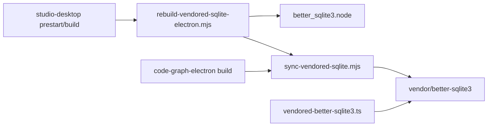

# Design: local-vendored-sqlite-runtime

## Non-goals

- Remove the vendored physical copy pattern or revert Electron to shared pnpm
  `better-sqlite3` resolution.
- Change graph semantics, IPC contracts, or desktop provider APIs.
- Add a monorepo-wide `postinstall` native rebuild for all contributors.
- Introduce prebuilt binary publishing or per-platform committed `.node` artifacts.
- Refactor `@specd/code-graph` or CLI/API graph runtime paths.

## Affected areas

- `.gitignore` (repo root)
  Change: add `packages/code-graph-electron/vendor/` so the generated vendored sqlite
  tree is never tracked.
  Risk: LOW — ignore rule only.

- `packages/code-graph-electron/package.json`
  Change: keep `vendor/` in the `files` array so workspace packaging still includes the
  generated tree after build; no script contract changes beyond documentation alignment.
  Risk: LOW.

- `packages/code-graph-electron/scripts/sync-vendored-sqlite.mjs`
  Change: preserve existing sync behaviour; continue copying canonical `better-sqlite3`
  and nested runtime helpers into `vendor/better-sqlite3/`, and preserve an existing
  Electron `.node` plus cache metadata when present.
  Callers: `build`, `rebuild:vendored-sqlite-electron` · Risk: LOW.

- `packages/code-graph-electron/scripts/rebuild-vendored-sqlite-electron.mjs`
  Change: replace absolute-path cache comparison with portable metadata
  (`electronVersion`, `platform`, `arch`) and binary existence check.
  Callers: `studio-desktop` `prestart`, `build`, package rebuild scripts · Risk: LOW.

- `packages/code-graph-electron/README.md`
  Change: document that `vendor/` is generated locally, list first-time desktop
  toolchain expectations, and remove any implication that vendor contents are committed.
  Risk: LOW.

- `packages/code-graph-electron/test/runtime/vendored-sqlite.spec.ts`
  Change: keep assertions on generated vendor layout and built bundle paths; ensure tests
  continue to run after `build` (which already executes sync).
  Risk: LOW.

- `apps/specd-studio-desktop/package.json`
  Change: review only; keep `prestart` and `build` rebuild wiring unless tests reveal a
  clearer entrypoint is needed.
  Risk: LOW.

- `docs/studio/packages.md`
  Change: note that desktop developers must allow the Electron sqlite rebuild to run on
  first startup and that vendored sqlite artifacts are not in git.
  Risk: LOW.

- Git index cleanup (implementation step, not a behavioural module)
  Change: `git rm -r --cached packages/code-graph-electron/vendor/` so tracked vendor
  files are removed from version control without deleting local working copies.
  Risk: LOW.

## New constructs

- Portable rebuild cache metadata at
  `packages/code-graph-electron/vendor/better-sqlite3/.electron-build.json`
  Shape:
  ```json
  {
    "electronVersion": "36.4.0",
    "platform": "darwin",
    "arch": "arm64"
  }
  ```
  Responsibility: record the environment for which the current vendored
  `better_sqlite3.node` was built.
  Relationships: written by `rebuild-vendored-sqlite-electron.mjs`, read by the same
  script to skip unnecessary rebuilds; lives inside gitignored `vendor/`.

## Approach

1. **Stop tracking generated vendor output**
   Add `packages/code-graph-electron/vendor/` to `.gitignore` and remove the directory
   from git index. Local clones will no longer receive committed vendor snapshots.

2. **Keep generation workflow unchanged in spirit**
   - `@specd/code-graph-electron` `build` continues to run `sync:vendor-sqlite` before
     bundling.
   - `studio-desktop` `prestart` and `build` continue to invoke
     `rebuild:graph-sqlite-electron`.
   - No global install hook is added.

3. **Make rebuild cache portable**
   Update `rebuild-vendored-sqlite-electron.mjs` to:
   - run sync first (existing behaviour)
   - read `.electron-build.json` if present
   - skip rebuild when `vendor/better-sqlite3/build/Release/better_sqlite3.node` exists
     and metadata matches `electronVersion`, `process.platform`, and `process.arch`
   - otherwise run `npm rebuild` in the vendored tree with Electron headers and rewrite
     metadata without absolute paths

4. **Preserve runtime isolation**
   Do not change `src/runtime/vendored-better-sqlite3.ts` import targets. Electron must
   still resolve sqlite through `vendor/better-sqlite3`, not through pnpm store paths.

5. **Update docs and tests**
   Align README, studio docs, and package tests with the generated-local model. Add or
   adjust tests that assert gitignore coverage and portable cache metadata shape where
   practical without requiring a full native compile in unit tests.

6. **Contributor workflow after change**
   ```text
   pnpm install
   pnpm --filter @specd/studio-desktop start
     → prestart sync+rebuild (first run may compile native addon)
   ```
   CLI/API-only work remains unaffected.

## Key decisions

- **Gitignore entire `vendor/` rather than only build intermediates** → the JS tree is
  already reproduced by sync; committing it adds no durable value.
  **Alternatives rejected** → ignore only `build/**` except `.node`; still leaves
  redundant committed sources and a platform-specific binary in git.

- **Keep lazy desktop-scoped rebuild instead of root `postinstall`** → avoids forcing
  native toolchain setup on every monorepo contributor.
  **Alternatives rejected** → global `postinstall` rebuild; too expensive and noisy.

- **Use portable cache metadata (`electronVersion`, `platform`, `arch`)** → supports
  correct skip behaviour across machines and after vendor regeneration.
  **Alternatives rejected** → absolute `binaryPath` key; machine-specific and brittle.

- **Retain physical vendor copy** → still required for pnpm path isolation and Electron
  ABI separation from CLI/API.
  **Alternatives rejected** → npm alias or direct `better-sqlite3` import; previously
  proven insufficient.

## Trade-offs

- [First desktop startup may compile native code] → Mitigated by conditional rebuild
  metadata and existing `prestart` wiring; document toolchain requirements in README and
  `docs/studio/packages.md`.

- [Fresh clone cannot run desktop graph until rebuild succeeds] → Acceptable; replaces
  incorrect cross-platform committed binaries with correct per-machine builds.

- [Generated vendor absent until sync/build/rebuild runs] → Mitigated by keeping sync in
  package `build` and rebuild in desktop `prestart`/`build`.

## Spec impact

### `code-graph-electron:composition`

- Direct dependents: none currently registered beyond studio-desktop lifecycle via
  change dependency graph.
- New requirements add operational constraints around gitignore, local generation, and
  portable rebuild cache. No parent spec (`code-graph:composition`,
  `code-graph:sqlite-graph-store`) needs modification because graph behaviour is
  unchanged.

### `studio-desktop:main-kernel-lifecycle`

- Depends on `code-graph-electron:composition`; updated requirement clarifies startup
  expectations for generated vendor artifacts.
- No additional studio-desktop specs require changes.

## Dependency map



```
┌──────────────────────────┐
│ studio-desktop           │
│ prestart / build         │
└────────────┬─────────────┘
             │
             ▼
┌──────────────────────────┐      ┌─────────────────────────┐
│ rebuild-vendored-sqlite- │─────▶│ sync-vendored-sqlite    │
│ electron.mjs             │      │ .mjs                    │
└────────────┬─────────────┘      └───────────┬─────────────┘
             │                                │
             ▼                                ▼
   ┌──────────────────┐            ┌──────────────────────┐
   │ .electron-build  │            │ vendor/better-sqlite3│
   │ .json (cache)    │            │ (gitignored)         │
   └────────┬─────────┘            └──────────┬───────────┘
            │                               │
            └──────────────┬────────────────┘
                           ▼
                 ┌─────────────────────┐
                 │ better_sqlite3.node │
                 └─────────────────────┘
```

## Migration / Rollback

Deployment steps:

1. Land `.gitignore` and script/test/doc updates.
2. Remove tracked vendor files from git index with `git rm -r --cached`.
3. Contributors keep local `vendor/` working tree or regenerate via desktop rebuild.

Rollback:

- Revert gitignore and script changes.
- Re-sync and recommit vendor tree if the project temporarily returns to committed
  vendor snapshots (not recommended).

## Testing

**Automated**

- Extend `packages/code-graph-electron/test/runtime/vendored-sqlite.spec.ts` to cover:
  - gitignore contains `packages/code-graph-electron/vendor/`
  - rebuild script writes/reads portable cache metadata shape (unit-level assertion on
    helper logic or fixture metadata parsing if extracted)
- Keep existing bundle path assertions for `vendor/better-sqlite3` references.
- Run `pnpm --filter @specd/code-graph-electron test` after implementation.

**Manual / E2E**

1. Fresh clone or delete `packages/code-graph-electron/vendor/`.
2. `pnpm install`
3. `pnpm --filter @specd/studio-desktop start`
4. Confirm rebuild runs once, `vendor/better-sqlite3/build/Release/better_sqlite3.node`
   exists, and second start skips rebuild when metadata matches.
5. `git status` shows no tracked/untracked vendor noise beyond gitignored paths.
6. Optional: run `dev/scripts/electron-graph-smoke.mjs` if available in repo scripts.

**Documentation**

- Update `packages/code-graph-electron/README.md`
- Update `docs/studio/packages.md` with desktop native toolchain note

## Open questions

None — `package.json` `files` keeps `vendor/` so generated output remains package-local
after build even though git ignores it.
