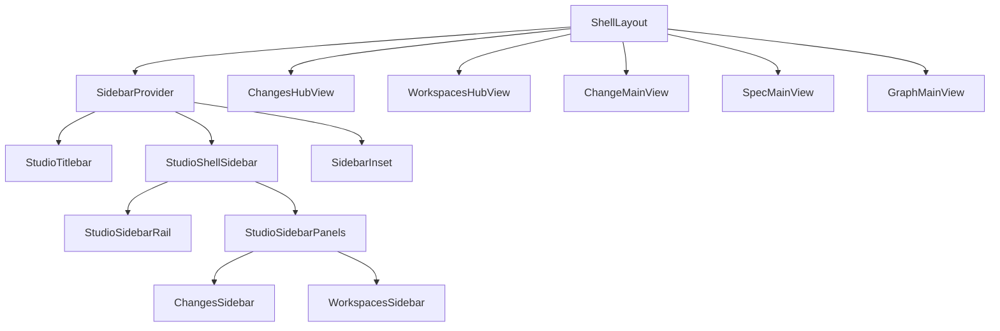

# Design: studio-sidebar-titlebar

## Non-goals

- Fully hidden sidebar (0px width) as a default state
- Moving New Change into the Changes section header (titlebar only in v1)
- A third **Graph** block inside the expanded sidebar (graph status lives on the rail icon;
  graph UI opens in the center)
- Changes to `SpecdDataPort`, API routes, or core use cases
- Redesign of inspector tabs, bottom panel behaviour, or change/spec editor internals
- Monolithic shell files — `ShellLayout` orchestrates only; UI lives in imported modules

## Scope (single change)

This change owns the full Studio chrome pivot:

- shadcn **`Sidebar`** (`collapsible="icon"`) + unified **titlebar**
- **Two stacked sidebar blocks** (Changes + Workspaces/Specs) when expanded
- **Center domain hubs** for readable listings (full names, counts, spec validation)
- **Graph** as rail action only → center graph view
- Desktop titlebar: **inline** secondary icons, safe zones, traffic-light clearance
- Full-width titlebar above sidebar + content; sidebar body starts below titlebar height **on macOS desktop only**
- **Non-darwin hosts** (web, Windows, Linux): sidebar **full height**; titlebar only over main column; **embedded** sidebar toggle in sidebar header / collapsed rail
- macOS: **traffic-light drag slot** then `SidebarTrigger` (toggle after semaphores)
- Sidebar **theme tokens** alias `--panel` / `--accent` (no shadcn zinc override)
- Rail **badges** + **tooltip** token fixes (`popover` in Tailwind theme)
- Workspace specs poll **pauses** when sidebar collapsed; **cached data retained** (no reload flash on re-expand)

**Not** a separate specd change — hubs are part of the same navigation model, not a
follow-up feature.

## Module map (no monolith)

`ShellLayout.tsx` MUST remain orchestration: state, `centerCtx` routing, port/hook wiring,
and composition of imported children. Target **&lt;200 lines** of layout JSX; move UI to:

| Module                                         | Responsibility                                                     |
| ---------------------------------------------- | ------------------------------------------------------------------ |
| `shell/ShellLayout.tsx`                        | Provider, `centerCtx`, storage, render switch for center           |
| `shell/StudioTitlebar.tsx`                     | Titlebar chrome, `SidebarTrigger`, actions                         |
| `shell/studio-sidebar/StudioShellSidebar.tsx`  | Thin facade: `Sidebar` + header + rail + panels                    |
| `shell/studio-sidebar/StudioSidebarRail.tsx`   | `SidebarMenu` (Changes / Workspaces / Graph), badges, rail clicks  |
| `shell/studio-sidebar/StudioSidebarPanels.tsx` | Stacked compact **Changes** + **Workspaces** hosts                 |
| `shell/studio-sidebar/studio-sidebar-types.ts` | `SidebarSection`, rail/panel prop types                            |
| `shell/hubs/ChangesHubView.tsx`                | Center **Changes hub**: counts, full-name list, lifecycle badges   |
| `shell/hubs/WorkspacesHubView.tsx`             | Center **Workspaces hub**: workspaces, full spec paths, validation |
| `shell/hubs/hub-row.tsx`                       | Shared row/table chrome (optional, keep tiny)                      |

Existing `sidebar/ChangesSidebar.tsx`, `sidebar/WorkspacesSidebar.tsx` stay as compact
list implementations; hubs are **new** center views, not extensions of those files.

`GraphSidebarEntry` is **removed** from the sidebar stack; graph stale state is shown on
the rail Graph icon only.

## Affected areas

- `packages/ui/src/shell/ShellLayout.tsx` — orchestration + `centerCtx` kinds
  `changes-hub`, `workspaces-hub`, `change`, `spec`, `graph`, `empty`
- `packages/ui/src/shell/StudioTitlebar.tsx` — inline icons on all hosts; desktop safe zones
- `packages/ui/src/shell/studio-sidebar/*` — new modular sidebar package (see table)
- `packages/ui/src/shell/hubs/*` — new center hub views
- `packages/ui/src/styles/globals.css` — safe zones, titlebar height, `--popover`, sidebar tokens
  aliased to panel/accent; darwin traffic slot; sidebar top offset via titlebar height
- `packages/ui/src/hooks/use-workspace-specs-collection.ts` — poll when sidebar open OR
  workspaces hub active
- `packages/ui/src/SpecdApp.tsx` — `hostMode`, `data-platform`
- `apps/specd-studio-desktop/src/main/index.ts` — titlebar overlay aligned to CSS height
- `apps/specd-studio-desktop/src/preload/bridge.ts` — `platform`
- `apps/specd-studio-web/tests/e2e/studio.ui.spec.ts` — selectors for hubs + rail

## Layout chrome (platform-specific)

### macOS desktop (`data-platform="darwin"`)

```
┌─ Titlebar (full width, 44px) ─────────────────────────────────────┐
│ [traffic slot] [toggle] [search…………] [New Change] [Docs][Bell][☀] │
├──────────┬──────────────────────────────────────────────────────┤
│ Sidebar  │ Main content (SidebarInset)                            │
│ (below   │                                                        │
│ titlebar)│                                                        │
└──────────┴──────────────────────────────────────────────────────┘
```

- Titlebar is the **first child** of `SidebarProvider`, spanning sidebar + main columns.
- Fixed sidebar uses `top: var(--studio-titlebar-height)` so native traffic lights sit only
  in the titlebar row, not over sidebar branding.
- **`SidebarTrigger`** in titlebar immediately after the traffic-light slot.

### Web / Windows / Linux (no integrated traffic lights)

```
┌──────────┬─ Titlebar (main column only, 44px) ────────────────────┐
│ Sidebar  │ [search…………] [New Change] [Docs][Bell][☀]              │
│ (full    ├──────────────────────────────────────────────────────┤
│ height)  │ Main content (SidebarInset)                            │
│ [toggle] │                                                        │
│ in header│                                                        │
└──────────┴──────────────────────────────────────────────────────┘
```

- Sidebar extends to the **top of the shell** (`top: 0`, full viewport height).
- Titlebar renders **only above the main column** (inside the right flex column), not over the sidebar.
- **`SidebarTrigger`** is **embedded in the sidebar**:
  - **Expanded:** top-right of `SidebarHeader`, beside SpecD Studio branding.
  - **Collapsed:** first rail icon, separated from Changes/Workspaces/Graph by a divider line.
- Titlebar on these hosts MUST NOT include `SidebarTrigger`.

## Navigation model

### Expanded sidebar (~16rem)

1. **`SidebarHeader`** — SpecD Studio branding (+ optional project label)
2. **`SidebarMenu`** (rail strip inside sidebar) — Changes | Workspaces | Graph icons
3. **`SidebarContent`** — **both** blocks stacked vertically:
   - **Changes** — compact `ChangesSidebar` (truncate OK for quick jump)
   - **Workspaces – Specs** — compact `WorkspacesSidebar` tree

No Graph panel in the sidebar body.

### Collapsed sidebar (48px icon rail)

- Icons only + corner badges (Changes count; Graph stale dot)
- **Changes / Workspaces click** → expand sidebar (optional) + set `centerCtx` to
  `changes-hub` / `workspaces-hub`
- **Graph click** → `centerCtx: { kind: 'graph' }` (no sidebar expand required)

### Center domain hubs

Opened from rail clicks or when user has no change/spec selected and focuses a domain.
Hubs use the **full center width** for:

**Changes hub**

- Summary counts (active, drafts, archived, discarded)
- Table/list with **full change names**, lifecycle state, click → open change

**Workspaces hub**

- Per-workspace sections with spec counts
- Rows with **full `workspace:path`**, validation/drift badge (reuse closed-spec /
  validation signals from existing hooks)
- Click → open spec in center

Hubs complement compact sidebar lists; they do not replace port data or list components.

## Approach

1. **Refactor sidebar into `studio-sidebar/` modules** — split current `StudioShellSidebar.tsx`
2. **Stack two panels** when `SidebarProvider` open; remove single-`activeSection` body swap
3. **Add hub views** + extend `CenterContext` in `ShellLayout`
4. **Rail behaviour** — `StudioSidebarRail` dispatches hub/graph; uses `SidebarMenuBadge`
   for counts (not text over icons)
5. **Tooltips** — `--popover` / `--popover-foreground` in CSS **and** `popover` color in
   `tailwind.config.ts`; sidebar rail tooltips use opaque `bg-panel` classes
6. **Titlebar** — remove desktop `⋯` overflow default; inline Docs/Bell/Theme on all hosts;
   **darwin:** full-width titlebar above split + traffic slot + toggle; **non-darwin:**
   titlebar over main column only, toggle embedded in sidebar
7. **Sidebar tokens** — alias `--sidebar-*` to panel/accent; drop shadcn `.dark` zinc override
8. **Poll skip** — `enabled: sidebarOpen || centerCtx.kind === 'workspaces-hub' || spec`;
   `useAsyncResource` retains cached data when `enabled: false` (no flash on re-expand)
9. **Tests** — hub smoke, rail badges, collapsed expand, poll gating, async-resource cache

## Key decisions

- **Same change, modular files** → one UX coherent release; avoid split change overhead.
  **Rejected:** separate `studio-domain-hubs` change.

- **Hubs in center, compact lists in sidebar** → solves truncation without widening sidebar.
  **Rejected:** dashboard as third sidebar block.

- **Two sidebar blocks + Graph rail-only** → Graph sidebar entry removed as redundant.
  **Rejected:** three stacked blocks including graph.

- **Full-width titlebar + sidebar below (darwin only)** → traffic lights never overlap sidebar header.
  **Rejected:** titlebar only over main column on macOS (semaphore overlap on sidebar).

- **Non-darwin: sidebar full height + embedded toggle** → no phantom titlebar row over sidebar;
  toggle remains reachable without native chrome. **Rejected:** titlebar toggle on web/Win/Linux
  (wastes horizontal space; sidebar is always visible).

- **Retain spec tree cache when poll paused** → instant sidebar re-expand; catch-up on next
  poll tick when re-enabled. **Rejected:** clearing cache on `enabled: false` (visible reload).

- **Sidebar tokens alias panel palette** → sidebar matches titlebar/panels in dark and light.
  **Rejected:** shadcn default `.dark` sidebar zinc override.

## Trade-offs

- [More center `centerCtx` kinds] → Mitigated: small union + dedicated hub components.
- [Hub + sidebar both list changes/specs] → Mitigated: sidebar = quick nav; hub = detail.
- [Poll runs more when workspaces hub open while collapsed] → Acceptable; user is browsing specs.

## Spec impact

- `ui:shell-layout` — stacked sidebar blocks, center hubs, graph rail action
- `ui:design-system` — popover tokens, titlebar/sidebar density, badge pattern, sidebar token aliasing
- `ui:hooks-workspaces-specs` — poll enabled when workspaces hub visible
- `ui:sidebar-graph-entry` — graph entry no longer hosted in sidebar body (rail + center only)
- `studio-desktop:main-window-manager` — titlebar height / safe zone alignment

## Dependency map



## Testing

- Unit: rail badge rendering, poll `enabled` when hub active, hub row click handlers
- E2E: rail → changes hub visible with full name; workspaces hub; graph opens center
- Manual desktop: traffic lights, inline titlebar icons, no overlap

## Open questions

None — user approved hubs in this change, modular files, stacked two blocks, graph rail-only.
