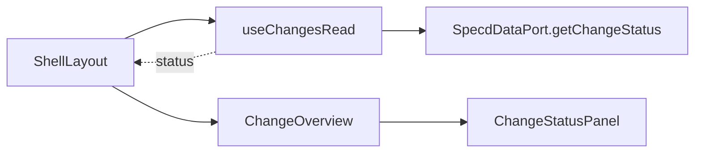

# Design: fix-change-status-cache-on-switch

## Non-goals

- Changing `GetStatus` / API `ifModifiedSince` semantics
- Modifying `useAsyncResource`, `ChangeStatusPanel`, or `ShellLayout`
- Fixing artifact list hooks (separate cache keys; not affected)
- E2E Playwright coverage in this change (unit tests sufficient)

## Affected areas

- `useChangesRead()` in `packages/ui/src/hooks/use-changes-read.ts`
  - **Change:** replace hook-global `lastModified` + `statusData` state with per-key cache; fix `unchanged` handling
  - **Callers:** `ShellLayout.tsx` only (LOW risk)
  - **Note:** `loadStatus` callback must read `ifModifiedSince` from cache for the current key, not shared state

- `packages/ui/test/use-changes-read.spec.ts` (new)
  - **Change:** render-hook tests with `MemorySpecdDataAdapter` for A → B → A navigation

No other files require modification.

## New constructs

### `statusCacheRef` (module-level or hook ref)

- **Location:** `packages/ui/src/hooks/use-changes-read.ts` (inside `useChangesRead`)
- **Shape:**
  ```typescript
  type StatusCacheEntry = {
    readonly lastModified: string | undefined
    readonly status: ChangeStatusDto | undefined
  }
  // React.useRef(new Map<string, StatusCacheEntry>())
  ```
- **Responsibility:** holds last full status + `updatedAt` per `statusCacheKey`; survives re-renders and change switches within the same shell session
- **Relationships:** keyed by `changeReadCacheKey(listSection, \`change-status:${changeName}\`)`; not exported

### `resolveStatusForResource()` (optional inline logic)

- **Location:** same file, private helper or inline in effect
- **Shape:**
  ```typescript
  function applyStatusPollResult(entry: StatusCacheEntry, next: ChangeStatusDto): StatusCacheEntry
  ```

  - If `next.unchanged === true`: return entry unchanged (keep `status`)
  - Else: return `{ status: next, lastModified: next.updatedAt }`
- **Responsibility:** single place for unchanged vs full payload rules

## Approach

1. **Derive `statusCacheKey`** from `listSection` + `changeName` (same string as `useAsyncResource` key for status).

2. **Replace hook-global state:**
   - Remove `useState` for `lastModified` and `statusData`
   - Use `useRef<Map<string, StatusCacheEntry>>` for cross-navigation cache
   - On mount/key change, read `cacheRef.current.get(statusCacheKey)` to seed visible status

3. **Update `loadStatus` callback:**
   - Read `ifModifiedSince` from `cacheRef.current.get(statusCacheKey)?.lastModified`
   - Never use another key's timestamp

4. **Replace the two effects** with one effect on `[statusResource.data, statusCacheKey]`:
   - When `statusResource.data` arrives, call `applyStatusPollResult`
   - Write back to map and set local `statusData` state for the current key only
   - Remove the effect that clears `statusData` on `changeName` change — instead sync from cache when key changes

5. **Key-change sync effect** on `[statusCacheKey]`:
   - `setStatusData(cacheRef.current.get(statusCacheKey)?.status)`
   - Ensures immediate restore when revisiting a change (no "unavailable" flash)

6. **Keep `isLoading` semantics:**
   - `isLoading: statusResource.isLoading && statusData === undefined` (unchanged)
   - When cache hit on key change, show cached data while background poll runs

7. **Tests:** `@testing-library/react` `renderHook` with provider wrapping `MemorySpecdDataAdapter` seeded with two changes; assert status after rerender with different `changeName`.

Covers specs:

- `ui:hooks-changes-read` — per-key cache, unchanged retention, section isolation
- `ui:change-tab-overview` — workflow visible after sidebar switch (verified via hook output consumed by Overview)

## Key decisions

**Decision:** per-key `Map` in `useRef`, not lifting cache to `ShellLayout`.
**Rationale:** hook already owns status polling; single fix point; spec says cache keys include section bucket.
**Alternatives rejected:** shell-level cache (duplicates hook responsibility); disable `ifModifiedSince` (more network load).

**Decision:** keep thin `statusData` state synced from ref for render triggers.
**Rationale:** mutating ref alone does not re-render; need `setStatusData` after cache updates.
**Alternatives rejected:** force tick counter (noisier).

## Trade-offs

- [Session-only cache] → acceptable; full refetch on page reload
- [Memory growth with many changes visited] → bounded by sidebar list size; Map entries are small

## Spec impact

### `ui:hooks-changes-read`

- Direct dependents: none in spec graph
- `ui:change-tab-overview` depends on hook behaviour via shell — satisfied by this fix

### `ui:change-tab-overview`

- Clarifies UX expectation only; implementation remains in hook

## Dependency map



```
┌──────────────┐     status      ┌─────────────────┐
│ ShellLayout  │◀────────────────│ useChangesRead  │
└──────┬───────┘                 └────────┬────────┘
       │                                  │
       ▼                                  ▼
┌──────────────┐                 ┌─────────────────┐
│ChangeOverview│                 │ getChangeStatus │
└──────┬───────┘                 └─────────────────┘
       ▼
┌──────────────────┐
│ChangeStatusPanel │
└──────────────────┘
```

## Testing

**Automated** — `packages/ui/test/use-changes-read.spec.ts`:

| Scenario                             | Assertion                                                                 |
| ------------------------------------ | ------------------------------------------------------------------------- |
| Revisiting change after newer change | `status.data` has blockers/nextAction; not undefined                      |
| `ifModifiedSince` isolation          | mock records per-name timestamps; alpha never gets beta's                 |
| `unchanged` poll                     | second poll returns unchanged; `status.data` still full object            |
| Key change restore                   | after A→B→A, first render after A has cached status before fetch resolves |

Use existing `MemorySpecdDataAdapter`; set distinct `updatedAt` on fixture changes.

**Manual / E2E:**

1. `pnpm --filter @specd/studio-web dev` (or desktop)
2. Open Studio with ≥2 active changes where one was edited more recently
3. Open change A → confirm Workflow & validation shows status
4. Open change B → confirm status loads
5. Return to A → confirm workflow status still visible (not "unavailable")
6. Tasks tab on A should still reflect status-driven content

No `docs/` updates required — internal hook fix, no user-facing CLI/API change.

## Open questions

None.
