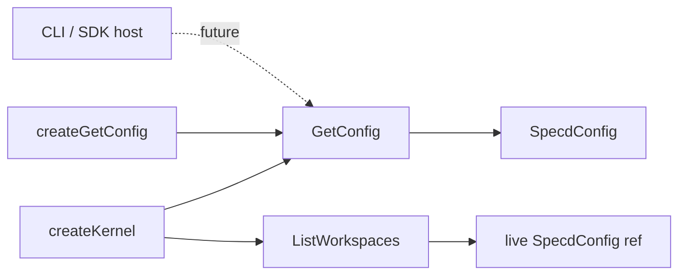

# Design: 01-core-kernel-get-config

## Non-goals

- Migrating CLI `CliContext` to drop parallel `config` (change `12-cli-mcp-sdk-migration`).
- Baking `CompileContextConfig` or other config slices inside domain use cases (change `03-core-host-orchestration-context`).
- Removing `addPlugin`, `listPlugins`, or other `kernel.project` entries (changes `05`–`06`).
- Curated public barrel export policy (change `13-public-api-surface`).
- Adding `getConfig` to `spec-lock.json` implementation metadata in this change (optional follow-up during implement).

## Affected areas

- `packages/core/src/composition/kernel.ts` — `Kernel` interface `project` group: add `getConfig: GetConfig`. `createKernel`: wire `new GetConfig(config)` alongside existing project use cases. Import `GetConfig`.
  - Risk: **LOW** — 2-file blast radius (`kernel.ts`, tests).

- `packages/core/src/application/use-cases/index.ts` — export `GetConfig` type (class export optional per existing patterns; export type + re-export from use-cases barrel if other use cases export classes).

- `packages/core/src/composition/use-cases/index.ts` — export `createGetConfig`.

- `packages/core/src/index.ts` — ensure `GetConfig`, `createGetConfig` are public exports (match neighbouring use cases).

- `docs/core/` — add brief `GetConfig` / `kernel.project.getConfig` documentation per `default:_global/docs`.

**Not modified in this change:** `packages/cli/src/helpers/cli-context.ts`, any host adapters.

## New constructs

### `GetConfig` use case

- **Location:** `packages/core/src/application/use-cases/get-config.ts`
- **Shape:**

```ts
import { type SpecdConfig } from '../specd-config.js'

export class GetConfig {
  constructor(config: SpecdConfig) {
    this._snapshot = structuredClone(config)
  }

  /** Returns the construction-time config snapshot for host consumers. */
  execute(): Readonly<SpecdConfig> {
    return this._snapshot
  }

  private readonly _snapshot: SpecdConfig
}
```

- **Responsibility:** Host-facing read of the config snapshot used at kernel construction. Clones on construction so returned data is isolated from live wiring references (`ListWorkspaces`, etc.).
- **Does not:** read disk, write yaml, or participate in domain orchestration.
- **JSDoc:** class, constructor, `execute()` per `default:_global/docs`. Document that hosts must not treat the return value as mutable config; yaml edits use `ConfigWriter` factories.

### `createGetConfig` factory

- **Location:** `packages/core/src/composition/use-cases/get-config.ts`
- **Shape:**

```ts
export interface GetConfigOptions {
  readonly config: SpecdConfig
}

export function createGetConfig(config: SpecdConfig): GetConfig
export function createGetConfig(options: GetConfigOptions): GetConfig
export function createGetConfig(configOrOptions: SpecdConfig | GetConfigOptions): GetConfig {
  const config =
    'config' in configOrOptions && !isSpecdConfig(configOrOptions)
      ? configOrOptions.config
      : (configOrOptions as SpecdConfig)
  return new GetConfig(config)
}
```

Use `isSpecdConfig` from `specd-config.ts` for disambiguation (same pattern as other factories).

- **Responsibility:** Composition entry point for standalone `GetConfig` without kernel.
- **Relationships:** application layer `GetConfig`; used by `createKernel` and tests.

## Approach

1. Implement `GetConfig` in `application/use-cases/get-config.ts` with `structuredClone` in constructor.
2. Add `createGetConfig` factory in `composition/use-cases/get-config.ts`.
3. Export from `application/use-cases/index.ts`, `composition/use-cases/index.ts`, and `packages/core/src/index.ts`.
4. Extend `Kernel` interface `project` group with `getConfig: GetConfig`.
5. In `createKernel`, add `getConfig: new GetConfig(config)` to `project` object (pass the same `config` argument — cloning happens inside `GetConfig`).
6. Unit tests in `packages/core/test/application/use-cases/get-config.spec.ts` covering clone isolation, stable reference, no I/O, factory.
7. Extend kernel composition test (or add focused test) asserting `kernel.project.getConfig` exists and returns deep-equal config.
8. Add `docs/core/get-config.md` documenting host usage and readonly contract.

### Requirement coverage

| Requirement                                   | Implementation                                 |
| --------------------------------------------- | ---------------------------------------------- |
| Constructor captures construction-time config | `structuredClone` in constructor               |
| execute returns parameterless host snapshot   | `execute(): Readonly<SpecdConfig>`             |
| No disk I/O                                   | no port imports in use case                    |
| Host read path only                           | JSDoc + spec; no host migration in this change |
| Standalone factory                            | `createGetConfig`                              |
| kernel.project.getConfig                      | `Kernel` interface + `createKernel` wiring     |
| Kernel entry mapping                          | table delta in `core:kernel` spec              |

## Key decisions

**Decision:** `structuredClone` in `GetConfig` constructor, not on each `execute()`.

**Rationale:** One allocation at kernel boot; stable reference across calls; host mutations on returned object must not affect kernel internals (`ListWorkspaces` keeps live ref).

**Alternatives rejected:**

- Shared reference return — host mutation could affect kernel; hosts may believe in-place edits reconfigure the kernel.
- Per-call clone — unnecessary cost; stable identity useful for debugging.

**Decision:** Internal kernel use cases keep the live `config` reference; only `GetConfig` clones.

**Rationale:** External host boundary vs internal composition trust zone are intentionally different (per proposal).

## Trade-offs

- [Host can still mutate the returned clone] → Documented contract; mutations do not affect kernel wiring or disk. Change 12 removes parallel `CliContext.config`.
- [Snapshot can diverge from disk if yaml edited without kernel recreate] → Existing specd rule; document in JSDoc.
- [Kernel spec project table still incomplete vs code for other entries] → Out of scope; only `getConfig` row added.

## Spec impact

### `core:kernel`

- Direct dependents: many CLI/MCP specs reference kernel indirectly — no requirement text changes needed beyond this change's delta.
- `core:composition` — no delta required; `createGetConfig` follows existing factory pattern.

### `core:get-config` (new)

- No downstream spec dependents yet.

## Dependency map



```
┌──────────────┐     ┌─────────────┐     ┌──────────────┐
│ createKernel │────▶│  GetConfig  │────▶│ host snapshot│
└──────┬───────┘     │ (clone)     │     │ (Readonly)   │
       │             └─────────────┘     └──────────────┘
       │
       ▼
┌──────────────┐     ┌─────────────┐
│ListWorkspaces│────▶│ live config │
└──────────────┘     │   ref       │
                     └─────────────┘
```

## Testing

### Automated (`packages/core/test/application/use-cases/get-config.spec.ts`)

| Scenario (verify.md)                  | Test                                                                                    |
| ------------------------------------- | --------------------------------------------------------------------------------------- |
| Internal snapshot is a clone          | assert `snapshot !== input` && deep equal                                               |
| Returns cloned snapshot without input | `execute()` returns Readonly shape                                                      |
| Stable reference across calls         | `execute() === execute()`                                                               |
| No disk I/O                           | no fs mocks needed; pure unit test                                                      |
| Host mutation does not affect kernel  | integration-style test with `createKernel` + mutate return + `listWorkspaces` unchanged |
| Returned snapshot not live wiring ref | `getConfig.execute() !== config` passed to `createKernel`                               |
| Factory without kernel                | `createGetConfig(config).execute()` deep equal                                          |

Use Vitest, `given/when/then` descriptions, mock-free (no ports).

### Kernel wiring test

Add assertion in existing kernel test file if present, or `get-config-kernel.spec.ts`: `kernel.project.getConfig` is `GetConfig` instance.

### Manual verification

```bash
node packages/cli/dist/index.js project status --format toon
# After implement: node -e "
#   import { createConfigLoader, createKernel } from './packages/core/dist/index.js'
#   const config = await createConfigLoader({ startDir: process.cwd() }).load()
#   const kernel = await createKernel(config)
#   const snap = kernel.project.getConfig.execute()
#   console.log(snap.projectRoot === config.projectRoot, snap !== config)
# "
```

Expected: `true true` (equal roots, different references).

### Documentation

Add `docs/core/get-config.md` with purpose, `kernel.project.getConfig.execute()` example, readonly contract, and pointer to `ConfigWriter` factories for yaml edits.

## Open questions

None.
