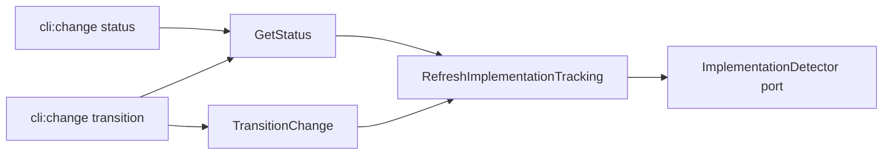

# Design: 02-core-host-orchestration-status

## Non-goals

- Baking refresh into `CompileContext` (change `03-core-host-orchestration-context`).
- Adding CLI flags to opt out of refresh (`refreshImplementationTracking: false`).
- Implementing `ifModifiedSince` on `GetStatus` (future P1a).
- Thinning `change context` CLI refresh prelude (separate follow-up; not in this change scope).
- SDK/MCP host migration beyond core defaults.

## Affected areas

- `packages/core/src/application/use-cases/get-status.ts` — extend `GetStatusInput`, inject `RefreshImplementationTracking`, run optional pre-read refresh for active changes.
  - Risk: **MEDIUM** — callers of `GetStatus` gain default side effect; tests must mock refresh collaborator.

- `packages/core/src/composition/use-cases/get-status.ts` — construct shared `RefreshImplementationTracking` (or receive from kernel) and pass into `GetStatus` constructor.
  - Risk: **LOW** — mirrors existing `createRefreshImplementationTracking` wiring pattern.

- `packages/core/src/application/use-cases/transition-change.ts` — extend `TransitionChangeInput`, inject `RefreshImplementationTracking`, run optional pre-transition refresh for active changes.
  - Risk: **MEDIUM** — transition path gains serialized refresh before mutate.

- `packages/core/src/composition/use-cases/transition-change.ts` — wire `RefreshImplementationTracking` into `TransitionChange`.
  - Risk: **LOW**.

- `packages/core/src/composition/kernel.ts` — ensure factories used by kernel pass refresh collaborator into `GetStatus` / `TransitionChange` (if factories are composed at kernel level).
  - Risk: **LOW**.

- `packages/cli/src/commands/change/status.ts` — remove `repo.get` + `refreshImplementationTracking.execute` prelude; call `GetStatus` only.
  - Risk: **LOW**.

- `packages/cli/src/commands/change/transition.ts` — remove refresh prelude; pass `refreshImplementationTracking: false` to pre-transition and repair-guide `GetStatus` calls; rely on `TransitionChange` default refresh.
  - Risk: **LOW** — must avoid double refresh on failure path.

- `packages/core/test/application/use-cases/get-status.spec.ts` — refresh default, opt-out, draft skip, no direct detector.
- `packages/core/test/application/use-cases/transition-change.spec.ts` — refresh default, opt-out, no direct detector.
- `packages/cli/test/commands/change/status.spec.ts` and `transition.spec.ts` — assert CLI no longer calls refresh directly.

- `docs/core/` — update GetStatus / TransitionChange host orchestration notes if existing docs mention caller-owned refresh.

## New constructs

### `GetStatusInput.refreshImplementationTracking`

- **Location:** `packages/core/src/application/use-cases/get-status.ts`
- **Shape:** `readonly refreshImplementationTracking?: boolean`
- **Responsibility:** Opt-out only (`false` skips). Omitted/`true` enables active-only refresh via injected collaborator.
- **Relationships:** consumed by `GetStatus.execute`; no CLI flag in this change.

### `TransitionChangeInput.refreshImplementationTrackingBefore`

- **Location:** `packages/core/src/application/use-cases/transition-change.ts`
- **Shape:** `readonly refreshImplementationTrackingBefore?: boolean`
- **Responsibility:** Opt-out only. Omitted/`true` enables active-only refresh before lifecycle work.
- **Relationships:** consumed by `TransitionChange.execute`.

### Constructor injection: `RefreshImplementationTracking`

- **Location:** `GetStatus` and `TransitionChange` constructors
- **Shape:** `private readonly _refresh: RefreshImplementationTracking`
- **Responsibility:** Delegate detection merge to existing primitive; use cases never touch `ImplementationDetector`.
- **Relationships:** wired in `createGetStatus` / `createTransitionChange` using the same dependencies as `createRefreshImplementationTracking`.

## Approach

### P0a — GetStatus orchestration

1. Extend `GetStatusInput` with optional `refreshImplementationTracking?: boolean`.
2. Add `RefreshImplementationTracking` constructor parameter to `GetStatus`.
3. At start of `execute()`:
   - If `input.refreshImplementationTracking === false`, skip refresh.
   - Else call `this._changes.get(input.name)`; when non-null, `await this._refresh.execute({ name: input.name })`.
   - Proceed with existing resolution order (`get` then `getDraft`).
4. Update `createGetStatus` to instantiate `RefreshImplementationTracking` (reuse existing factory wiring: change repo, archive repo, detector, file reader) and pass into `GetStatus`.
5. Preserve read-only projection after load — refresh happens before repository read for status assembly.

### P0b — TransitionChange orchestration

1. Extend `TransitionChangeInput` with optional `refreshImplementationTrackingBefore?: boolean`.
2. Add `RefreshImplementationTracking` constructor parameter to `TransitionChange`.
3. After confirming change exists and before lifecycle evaluation:
   - If `input.refreshImplementationTrackingBefore === false`, skip.
   - Else `await this._refresh.execute({ name: input.name })` (change already loaded from active storage).
4. Update `createTransitionChange` to wire the same refresh collaborator.

### CLI thinning

1. **`change status`:** delete lines probing `repo.get` and calling `refreshImplementationTracking.execute`; call `kernel.changes.status.execute({ name })` only.
2. **`change transition`:**
   - Delete manual refresh prelude.
   - Pre-transition read: `status.execute({ name, refreshImplementationTracking: false })`.
   - `transition.execute({ name, to, approvalsSpec, approvalsSignoff, skipHookPhases })` with default refresh.
   - Repair guide on `InvalidStateTransitionError`: `status.execute({ name, refreshImplementationTracking: false })`.

### Requirement coverage

| Requirement                                         | Implementation                                                  |
| --------------------------------------------------- | --------------------------------------------------------------- |
| GetStatus optional pre-read refresh                 | `execute()` prelude + `RefreshImplementationTracking` injection |
| GetStatus active-only refresh                       | guard on `changes.get(name) !== null` before refresh            |
| GetStatus draft skip                                | no refresh when only `getDraft` resolves                        |
| GetStatus no direct detector                        | delegate exclusively to `RefreshImplementationTracking`         |
| TransitionChange optional pre-transition refresh    | `execute()` prelude before lifecycle engine                     |
| TransitionChange active-only refresh                | refresh only when change loaded from active storage             |
| RefreshImplementationTracking default orchestration | purpose + requirement delta; no algorithm change                |
| CLI status delegates to GetStatus                   | remove CLI refresh block                                        |
| CLI transition delegates to TransitionChange        | remove CLI refresh; `GetStatus` opt-out on auxiliary reads      |

## Key decisions

**Decision:** Default refresh is on; callers opt out explicitly.

**Rationale:** Matches current CLI behaviour for status; programmatic hosts get correct tracking without boilerplate.

**Alternatives rejected:**

- Default off — would silently change behaviour for direct `GetStatus` callers.
- CLI-owned refresh — duplicates policy across hosts (current pain).

**Decision:** Transition CLI disables refresh on auxiliary `GetStatus` reads.

**Rationale:** Avoid double refresh (pre-read + `TransitionChange` default).

**Alternatives rejected:**

- Refresh on every `GetStatus` call in transition command — redundant IO and detector work.

**Decision:** Reuse `RefreshImplementationTracking` instance via composition factories; do not inline detector logic.

**Rationale:** Preserves single primitive per `core:refresh-implementation-tracking`; satisfies architecture boundaries.

## Trade-offs

- [Default refresh adds IO to every active `GetStatus` call] → Acceptable; matches today's CLI default; opt-out available.
- [Transition path may refresh once per transition even if caller just refreshed] → CLI passes `refreshImplementationTracking: false` on pre-read; only one refresh per transition.
- [`change context` CLI still has manual refresh] → Out of scope; noted for follow-up.

## Dependency map



```
┌──────────────────┐     ┌─────────────┐     ┌────────────────────────────┐
│ cli:change status│────▶│  GetStatus  │────▶│ RefreshImplementationTrack │
└──────────────────┘     └──────┬──────┘     └─────────────┬──────────────┘
                                  │                           │
┌──────────────────┐              │                           ▼
│cli:change trans. │──GetStatus───┘                  ┌──────────────────┐
│ (refresh: false) │                                 │ImplementationDet.│
└────────┬─────────┘                                 └──────────────────┘
         │
         ▼
┌──────────────────┐     ┌────────────────────────────┐
│ TransitionChange │────▶│ RefreshImplementationTrack   │
└──────────────────┘     └────────────────────────────┘
```

## Testing

### Automated tests

- `packages/core/test/application/use-cases/get-status.spec.ts`
  - active change + default input → `RefreshImplementationTracking.execute` called once before load
  - `refreshImplementationTracking: false` → refresh not called
  - draft-only name → refresh not called
  - refresh collaborator mocked; assert no `ImplementationDetector` usage
- `packages/core/test/application/use-cases/transition-change.spec.ts`
  - default input → refresh called before transition mutate
  - `refreshImplementationTrackingBefore: false` → refresh not called
- `packages/core/test/composition/kernel-get-status.spec.ts` or existing kernel tests — constructor receives refresh collaborator
- `packages/cli/test/commands/change/status.spec.ts` — handler does not call `kernel.changes.refreshImplementationTracking`
- `packages/cli/test/commands/change/transition.spec.ts` — no direct refresh; pre-transition `GetStatus` receives `refreshImplementationTracking: false`; repair path same

### Manual / E2E verification

1. Active change with implementation tracking: `node packages/cli/dist/index.js change status <name> --implementation` — tracked files reflect latest workspace edits.
2. `node packages/cli/dist/index.js change transition <name> <step>` — transition succeeds; no duplicate refresh errors in logs.
3. Force `InvalidStateTransitionError` — repair guide renders; status fetch does not re-run detector (observe via mock/logging in dev if needed).

### Documentation

- Update `docs/core/` entries for GetStatus and TransitionChange if they document caller-owned refresh preludes.
- No new CLI flags; CLI docs change only if they state hosts must refresh manually.

## Open questions

_none_
