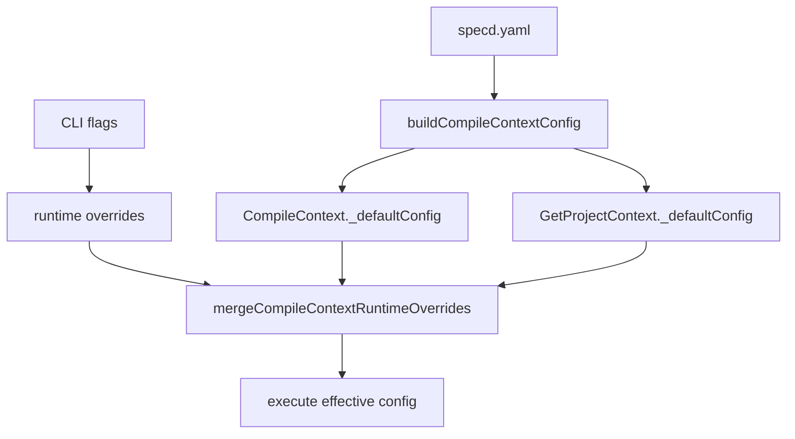

# Design: 03-core-host-orchestration-context

## Non-goals

- Baking `RefreshImplementationTracking` into `CompileContext` (caller-owned refresh stays in CLI for this change).
- Adding `refreshImplementationTracking` to `CompileContextInput`.
- Exporting `buildCompileContextConfig` from `@specd/core` public barrel (A3 — composition-internal only).
- SDK/MCP handler migration on feature branches (follow-up merge work).
- Changing context collection, fingerprint, or display-mode algorithms beyond config sourcing.

## Affected areas

- `packages/core/src/composition/build-compile-context-config.ts` (**new**) — map `SpecdConfig` → `CompileContextConfig` yaml snapshot.
  - Risk: **LOW** — pure mapping helper.

- `packages/core/src/application/use-cases/_shared/merge-compile-context-config.ts` (**new**) — shallow-merge baked defaults with runtime overrides.
  - Risk: **LOW** — shared by both context use cases.

- `packages/core/src/application/use-cases/compile-context.ts` — store `_defaultConfig`, remove `config` from `CompileContextInput`, add `contextMode?` and `llmOptimizedContext?`, merge at start of `execute()`.
  - Symbols: `CompileContextInput`, `CompileContext` constructor, `execute()`
  - Callers: `createCompileContext`, CLI `change/context.ts`, tests
  - Risk: **HIGH** — 7+ direct dependents including kernel

- `packages/core/src/composition/use-cases/compile-context.ts` — call `buildCompileContextConfig(config)` on `SpecdConfig` overload; add `defaultConfig` to `FsCompileContextOptions`; pass into `CompileContext` constructor.
  - Risk: **MEDIUM** — kernel wiring path

- `packages/core/src/application/use-cases/get-project-context.ts` — same `_defaultConfig` + merge pattern; update `GetProjectContextInput`.
  - Risk: **HIGH**

- `packages/core/src/composition/use-cases/get-project-context.ts` — bake defaults on `SpecdConfig` overload; thread `defaultConfig` through `FsGetProjectContextOptions`.
  - Risk: **MEDIUM**

- `packages/core/src/composition/kernel.ts` / `kernel-internals.ts` — no signature changes expected if factories already receive `SpecdConfig`; verify `createCompileContext` / `createGetProjectContext` calls remain valid.
  - Risk: **LOW**

- `packages/cli/src/commands/change/context.ts` — delete inline `CompileContextConfig` builder (~lines 108–140); pass runtime overrides on `kernel.changes.compile.execute({...})`.
  - Risk: **LOW**

- `packages/cli/src/commands/project/context.ts` — delete inline `compileConfig` builder (~lines 83–101); pass runtime overrides on `getProjectContext.execute({...})`.
  - Risk: **LOW**

- `packages/cli/src/commands/project/status.ts` — `--context` path uses `GetProjectContext.execute({})` and `execute({ llmOptimizedContext: false })` for raw spec catalogue; no inline `CompileContextConfig`.
  - Risk: **LOW** — collateral host migration (implementation already landed; spec added in design revision)

- `packages/core/test/application/use-cases/compile-context.spec.ts` — update `makeSut` / execute calls: pass `defaultConfig` to constructor; remove `config` from execute input; add merge override tests.
- `packages/core/test/application/use-cases/get-project-context.spec.ts` — same pattern.
- `packages/cli/test/commands/change-context.spec.ts` — assert no inline config object; spy receives override fields only.
- `packages/cli/test/commands/project-context.spec.ts` — same.

- `docs/core/` — update CompileContext / GetProjectContext host notes if existing pages document per-call `config` input.

## New constructs

### `buildCompileContextConfig(config: SpecdConfig): CompileContextConfig`

- **Location:** `packages/core/src/composition/build-compile-context-config.ts`
- **Shape:**

```typescript
export function buildCompileContextConfig(config: SpecdConfig): CompileContextConfig
```

- **Responsibility:** Map yaml-stable fields from `SpecdConfig` into `CompileContextConfig`:
  - `projectRoot`, `configPath`
  - `context` entries (`instruction` / `file` only)
  - `contextIncludeSpecs`, `contextExcludeSpecs`
  - `contextMode` (yaml value, may be undefined → use case applies its own default)
  - `llmOptimizedContext` (yaml value, may be undefined)
  - `workspaces`: per-workspace `contextIncludeSpecs` / `contextExcludeSpecs` when declared
- **Does not:** apply CLI `--mode`, `--optimized`, or section-flag logic.
- **Relationships:** called by `createCompileContext` and `createGetProjectContext` on the `SpecdConfig` overload only. **Not** re-exported from `packages/core/src/index.ts`.

### `mergeCompileContextRuntimeOverrides`

- **Location:** `packages/core/src/application/use-cases/_shared/merge-compile-context-config.ts`
- **Shape:**

```typescript
export interface CompileContextRuntimeOverrides {
  readonly contextMode?: CompileContextConfig['contextMode']
  readonly llmOptimizedContext?: boolean
}

export function mergeCompileContextRuntimeOverrides(
  defaults: CompileContextConfig,
  overrides: CompileContextRuntimeOverrides,
): CompileContextConfig
```

- **Responsibility:** Return `{ ...defaults, ...pickDefined(overrides) }` where only `contextMode` and `llmOptimizedContext` are overridable in P1a.
- **Relationships:** called at top of `CompileContext.execute` and `GetProjectContext.execute`.

### Updated `CompileContextInput`

- **Location:** `packages/core/src/application/use-cases/compile-context.ts`
- **Removed:** `config: CompileContextConfig`
- **Added:** `contextMode?`, `llmOptimizedContext?`
- **Unchanged:** `name`, `step`, `includeChangeSpecs?`, `followDeps?`, `depth?`, `sections?`, `fingerprint?`

### Updated `GetProjectContextInput`

- **Location:** `packages/core/src/application/use-cases/get-project-context.ts`
- **Removed:** `config`
- **Added:** `contextMode?`, `llmOptimizedContext?`
- **Unchanged:** `followDeps?`, `depth?`, `sections?`

### Constructor `defaultConfig` parameter

- **Location:** `CompileContext` and `GetProjectContext` constructors
- **Shape:** final constructor arg `defaultConfig: CompileContextConfig`
- **Responsibility:** hold yaml snapshot for lifetime of use case instance

### `FsCompileContextOptions.defaultConfig` / `FsGetProjectContextOptions.defaultConfig`

- **Location:** composition factory option interfaces
- **Responsibility:** allow test/direct wiring path to supply baked config without full `SpecdConfig`

## Approach

### Step 1 — composition mapping helper

1. Create `build-compile-context-config.ts` in `composition/`.
2. Port field mapping from current CLI inline builders (`change/context.ts` lines 121–139) **without** CLI effective-mode or optimization resolution — map yaml fields only.
3. Unit-test the mapper in `packages/core/test/composition/build-compile-context-config.spec.ts` with a minimal `SpecdConfig` fixture.

### Step 2 — merge helper

1. Create `merge-compile-context-config.ts` in `application/use-cases/_shared/`.
2. Shallow merge: spread `defaults`, then assign `contextMode` / `llmOptimizedContext` only when override fields are present (respect `exactOptionalPropertyTypes` — do not set `undefined` keys).

### Step 3 — CompileContext

1. Add `private readonly _defaultConfig: CompileContextConfig` field.
2. Extend constructor with `defaultConfig` parameter (last arg).
3. Remove `config` from `CompileContextInput`; add optional `contextMode` and `llmOptimizedContext`.
4. At start of `execute()`:

```typescript
const config = mergeCompileContextRuntimeOverrides(this._defaultConfig, {
  ...(input.contextMode !== undefined ? { contextMode: input.contextMode } : {}),
  ...(input.llmOptimizedContext !== undefined
    ? { llmOptimizedContext: input.llmOptimizedContext }
    : {}),
})
```

5. Replace all `input.config` references with merged `config` local.

### Step 4 — GetProjectContext

Mirror Step 3 without change-specific input fields.

### Step 5 — composition factories

1. **`createCompileContext(SpecdConfig)`:** compute `const defaultConfig = buildCompileContextConfig(config)` before delegating to `FsCompileContextOptions` overload; pass `defaultConfig` in options bag.
2. **`createCompileContext(workspace, options)`:** require `options.defaultConfig`; pass to `new CompileContext(...)`.
3. **`createGetProjectContext`:** same pattern.

### Step 6 — CLI thinning

**`change/context.ts`:**

1. Delete `workspacesConfig` loop and `compileConfig` object construction.
2. Keep existing `effectiveMode` and `llmOptimizedContext` CLI resolution logic unchanged.
3. Call:

```typescript
await kernel.changes.compile.execute({
  name,
  step,
  ...(effectiveMode !== undefined ? { contextMode: effectiveMode } : {}),
  ...(llmOptimizedContext !== (config.llmOptimizedContext ?? false) ? { llmOptimizedContext } : {}),
  includeChangeSpecs: opts.includeChangeSpecs === true,
  ...(opts.followDeps ? { followDeps: true } : {}),
  ...(opts.depth !== undefined ? { depth: opts.depth } : {}),
  ...(sectionFlags.length > 0 ? { sections: sectionFlags } : {}),
  ...(opts.fingerprint !== undefined ? { fingerprint: opts.fingerprint } : {}),
})
```

Only pass `contextMode` / `llmOptimizedContext` when they differ from yaml defaults (optional optimization — passing always is also acceptable if simpler).

**`project/context.ts`:** same deletion + override forwarding to `getProjectContext.execute`.

### Requirement coverage

| Requirement                                  | Implementation                                              |
| -------------------------------------------- | ----------------------------------------------------------- |
| CompileContext baked default at construction | `defaultConfig` ctor param from `buildCompileContextConfig` |
| CompileContext input without `config`        | interface delta + execute merge                             |
| CompileContext runtime override merge        | `mergeCompileContextRuntimeOverrides`                       |
| GetProjectContext baked default              | same pattern                                                |
| CLI change context no inline builder         | delete `compileConfig`; pass overrides                      |
| CLI project context no inline builder        | delete `compileConfig`; pass overrides                      |

## Key decisions

**Decision:** Yaml snapshot built in composition, not application layer.

**Rationale:** `CompileContextConfig` is derived from `SpecdConfig` workspace layout — composition already owns config loading context. Keeps application use case free of `SpecdConfig` import.

**Alternatives rejected:**

- Per-call `config` (status quo) — duplicates mapping in every host.
- Public export of builder — violates A3 barrel boundary.

**Decision:** Only `contextMode` and `llmOptimizedContext` are runtime-overridable in P1a.

**Rationale:** Matches what CLI currently overrides beyond yaml. Include/exclude patterns remain yaml-stable per kernel lifetime.

**Decision:** Section-flag optimization bypass is owned by `CompileContext` / `GetProjectContext`, not recomputed in CLI hosts.

**Rationale:** Core already implements strict bypass when `sections` omits rules+constraints. CLI forwards `sections` only; verify scenarios for bypass live under `core:compile-context` (not duplicated as CLI wire-format assertions).

**Alternatives rejected:**

- CLI recomputing `llmOptimizedContext` from section flags — duplicates core logic and conflicts with "omit override when equal to yaml default".

- Full `CompileContextConfig` override on execute — reintroduces host duplication.

**Decision:** `Fs*Options` overload requires explicit `defaultConfig` for test wiring.

**Rationale:** Tests constructing use cases directly can pass minimal `CompileContextConfig` without full `SpecdConfig`.

## Trade-offs

- **[Risk] Kernel reload required for yaml context changes** → Mitigation: same as today for any `SpecdConfig`-backed behaviour; document that `GetConfig` reflects yaml but context use cases use construction snapshot.
- **[Risk] HIGH blast radius on `CompileContextInput` signature** → Mitigation: update all compile call sites in same change (CLI + tests); graph impact already enumerated (16 files).
- **[Risk] Forgetting to pass `defaultConfig` in test `makeSut`** → Mitigation: compiler enforces new constructor arity; update `makeSut` in same PR.

## Spec impact

### `core:compile-context`

- Direct dependents: `core:get-project-context`, `cli:change-context`, `cli:project-context`, `core:get-artifact-instruction` (types only)
- `core:get-project-context` references `ContextSpecEntry` and rendering — unaffected (input shape change only)
- CLI specs updated in this change — no untracked ripple

### `core:get-project-context`

- Direct dependents: `cli:project-context`, `cli:project-status`
- Covered by this change's CLI deltas

### `cli:project-status`

- `--context` assembly delegates to baked `GetProjectContext`; no inline config builder
- Implementation already migrated in `project/status.ts`; this revision adds spec/verify coverage

## Dependency map



```
┌─────────────┐     ┌──────────────────────────┐
│  specd.yaml │────▶│ buildCompileContextConfig │
└─────────────┘     └────────────┬─────────────┘
                                 │
              ┌──────────────────┴──────────────────┐
              ▼                                     ▼
     ┌─────────────────┐                   ┌──────────────────┐
     │ CompileContext  │                   │ GetProjectContext │
     │ _defaultConfig  │                   │ _defaultConfig    │
     └────────┬────────┘                   └────────┬─────────┘
              │                                       │
┌─────────────┴─────────────┐                         │
│ CLI --mode / --optimized  │                         │
└─────────────┬─────────────┘                         │
              ▼                                       ▼
     ┌────────────────────────────────────────────────────┐
     │     mergeCompileContextRuntimeOverrides            │
     └──────────────────────┬─────────────────────────────┘
                            ▼
                    ┌───────────────┐
                    │ execute()     │
                    └───────────────┘
```

## Testing

### Automated

| Test file                                                                      | Scenarios covered                                                                                                    |
| ------------------------------------------------------------------------------ | -------------------------------------------------------------------------------------------------------------------- |
| `core/test/composition/build-compile-context-config.spec.ts`                   | yaml → config mapping including workspace patterns                                                                   |
| `core/test/application/use-cases/_shared/merge-compile-context-config.spec.ts` | override wins; absent overrides preserve defaults                                                                    |
| `core/test/application/use-cases/compile-context.spec.ts`                      | Constructor accepts default config; execute rejects `config`; `contextMode` override; `llmOptimizedContext` override |
| `core/test/application/use-cases/get-project-context.spec.ts`                  | Minimal `{}` input; override fields; no `config` required                                                            |
| `cli/test/commands/change-context.spec.ts`                                     | CLI does not build inline config; passes overrides to execute spy                                                    |
| `cli/test/commands/project-context.spec.ts`                                    | same                                                                                                                 |

### Manual / E2E

```bash
pnpm --filter @specd/core build && pnpm --filter @specd/cli build
node packages/cli/dist/index.js change context <active-change> designing --format toon
node packages/cli/dist/index.js project context --format toon
node packages/cli/dist/index.js change context <active-change> designing --mode full --optimized
```

Expected: same output shape as before; no behavioural regression aside from config sourcing internalization.

### Lint / docs

- JSDoc on new exports and updated constructor/`execute` `@param` tags per `default:_global/docs`.
- Update `docs/core/` pages if they document `config` on execute input.

## Open questions

_none_
