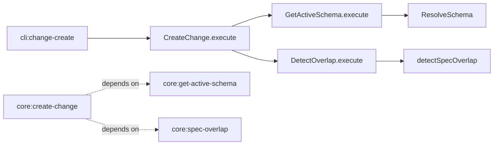

# Design: 04-core-host-orchestration-create

## Non-goals

- Changing `GetActiveSchema` API or resolution pipeline.
- Moving overlap warning string formatting out of CLI (presentation stays host-owned).
- Adding a CLI flag for explicit schema override (programmatic override via `CreateChangeInput` only).
- SDK/MCP handler migration (follow-up A2b change).
- Changing overlap detection domain logic in `detectSpecOverlap` / `DetectOverlap`.

## Affected areas

- `packages/core/src/application/use-cases/create-change.ts` — optional schema fields, internal resolution, overlap orchestration, constructor deps.
  - Symbols: `CreateChangeInput`, `CreateChangeResult`, `CreateChange` constructor, `execute()`
  - Callers: kernel, `createCreateChange`, CLI, tests
  - Risk: **MEDIUM** — kernel wiring + direct CLI caller

- `packages/core/src/composition/use-cases/create-change.ts` — wire `GetActiveSchema` and `DetectOverlap` on `SpecdConfig` overload; thread through context overload if needed.
  - Risk: **MEDIUM**

- `packages/core/src/composition/kernel.ts` / `kernel-internals.ts` — pass `GetActiveSchema` and `DetectOverlap` into `new CreateChange(...)`.
  - Risk: **LOW** — signature alignment

- `packages/cli/src/commands/change/create.ts` — remove `getActiveSchema` prelude and `detectOverlap` block; pass `includeOverlapCheck: true` when `specIds.length > 0`; format stderr from `result.overlapReport`.
  - Risk: **LOW**

- `packages/core/test/application/use-cases/create-change.spec.ts` — schema resolution, explicit override, partial override rejection, overlap opt-in, overlap failure non-fatal.
- `packages/cli/test/commands/change-create.spec.ts` — assert no direct `getActiveSchema` / `detectOverlap` calls; overlap warning from mocked `create.execute` result.
- `packages/cli/test/commands/change.spec.ts` — update create-path spies if shared setup asserts schema prelude.

- `docs/core/` — update CreateChange host notes if existing pages document required `schemaName`/`schemaVersion` on every call.

## New constructs

### Updated `CreateChangeInput`

- **Location:** `packages/core/src/application/use-cases/create-change.ts`
- **Removed required:** `schemaName`, `schemaVersion`
- **Added optional:** `schemaName?`, `schemaVersion?`, `includeOverlapCheck?`
- **Unchanged:** `name`, `description?`, `specIds`, `invalidationPolicy?`

### Updated `CreateChangeResult`

- **Location:** same file
- **Added optional:** `overlapReport?: OverlapReport`

### Schema resolution helper (private)

- **Location:** `create-change.ts` private method e.g. `_resolveSchemaIdentity(input)`
- **Responsibility:**
  - If both `schemaName` and `schemaVersion` provided → return them
  - If both absent → `await getActiveSchema.execute()`, assert non-raw, return `{ schemaName: schema.name(), schemaVersion: schema.version() }`
  - If only one provided → throw typed validation error (new `InvalidCreateChangeInputError` or reuse existing pattern)
- **Relationships:** called at start of `execute()` before uniqueness checks or after — prefer **before** persistence, after name uniqueness is fine; must run **before** `created` event construction.

### Constructor dependency additions

```typescript
constructor(
  changes: ChangeRepository,
  listWorkspaces: ListWorkspaces,
  actor: ActorResolver,
  getActiveSchema: GetActiveSchema,
  detectOverlap: DetectOverlap,
)
```

## Approach

### 1. Core use case (`CreateChange.execute`)

1. Resolve effective `{ schemaName, schemaVersion }` via `_resolveSchemaIdentity(input)`.
2. Existing flow unchanged: uniqueness checks → actor → `created` event with effective schema fields → `specDependsOn` seeding → `Change` construction → `save` → `scaffold`.
3. After scaffold, when `input.includeOverlapCheck === true && input.specIds.length > 0`:
   - `try { overlapReport = await this._detectOverlap.execute({ name: input.name }) } catch { /* omit */ }`
4. Return `{ change, changePath, ...(overlapReport !== undefined ? { overlapReport } : {}) }`.

### 2. Composition (`createCreateChange`)

On `SpecdConfig` overload:

```typescript
const getActiveSchema = createGetActiveSchema(config) // existing factory
const detectOverlap = createDetectOverlap(config)
return new CreateChange(changeRepo, listWorkspaces, actor, getActiveSchema, detectOverlap)
```

On `CreateChangeContext` + `FsCreateChangeOptions` overload: accept `getActiveSchema` and `detectOverlap` via extended `FsCreateChangeOptions` (mirror other factories that need cross-cutting use cases).

### 3. Kernel wiring

Update `kernel-internals.ts` / `kernel.ts` where `CreateChange` is constructed:

```typescript
create: new CreateChange(i.changes, listWorkspaces, i.actor, i.getActiveSchema, i.detectOverlap),
```

`detectOverlap` already exists on kernel internals from `DetectOverlap` registration.

### 4. CLI thinning (`change/create.ts`)

**Remove:**

```typescript
const result = await kernel.specs.getActiveSchema.execute()
// ...
schemaName: schema.name(),
schemaVersion: schema.version(),
```

```typescript
// entire detectOverlap try/catch block
```

**Replace execute call with:**

```typescript
const { change, changePath, overlapReport } = await kernel.changes.create.execute({
  name,
  specIds,
  ...(opts.description !== undefined ? { description: opts.description } : {}),
  ...(specIds.length > 0 ? { includeOverlapCheck: true } : {}),
  ...(invalidationPolicy spread unchanged),
})
```

**Overlap stderr:** reuse existing formatting block, fed from `overlapReport` instead of a second `detectOverlap` call.

## Dependency map



```
┌──────────────────┐
│ cli:change-create│
└────────┬─────────┘
         │ execute (no schema prelude)
         ▼
┌──────────────────┐     ┌─────────────────────┐
│ CreateChange     │────▶│ GetActiveSchema     │
│ execute()        │     │ (project mode)      │
└────────┬─────────┘     └─────────────────────┘
         │
         │ includeOverlapCheck
         ▼
┌──────────────────┐
│ DetectOverlap    │
└──────────────────┘

┌──────────────────┐  depends on  ┌──────────────────────┐
│ core:create-change│─ ─ ─ ─ ─ ─ ▶│ core:get-active-schema│
└──────────────────┘              └──────────────────────┘
         │
         └ ─ ─ ─ ─ ─ ─ ─ ─ ─ ─ ─ ▶ core:spec-overlap
```

## Testing

### Automated

| File                                                                                        | Coverage                                                                                                                                                                                                                        |
| ------------------------------------------------------------------------------------------- | ------------------------------------------------------------------------------------------------------------------------------------------------------------------------------------------------------------------------------- |
| `packages/core/test/application/use-cases/create-change.spec.ts`                            | Active schema resolution delegates to `GetActiveSchema`; explicit override skips delegate; partial override throws; `includeOverlapCheck` calls `DetectOverlap`; detect failure still returns change; `overlapReport` on result |
| `packages/core/test/composition/use-cases/create-change.spec.ts` (if exists) or kernel test | `createCreateChange(config)` wires both new deps                                                                                                                                                                                |
| `packages/cli/test/commands/change-create.spec.ts`                                          | No `getActiveSchema` spy calls; `create.execute` receives `includeOverlapCheck: true` with specs; stderr warning from mocked `overlapReport`                                                                                    |
| `packages/cli/test/commands/change.spec.ts`                                                 | Adjust shared create expectations if needed                                                                                                                                                                                     |

### Manual / E2E

```bash
node packages/cli/dist/index.js change create test-orchestration --spec default:_global/architecture
```

- Expect stdout: `created change test-orchestration`
- Expect exit 0
- Manifest under `.specd/changes/` records project `schemaName` / `schemaVersion`
- If overlap exists, stderr shows `warning: spec overlap detected` (non-fatal)

```bash
node packages/cli/dist/index.js change create test-orchestration-2
```

- No overlap warning (empty specIds, no overlap check)

### Lint / docs

- JSDoc on new constructor params, updated `CreateChangeInput` / `CreateChangeResult` fields, private resolver method.
- Update `docs/core/` CreateChange section if it documents required schema fields on input.

## Open questions

_none_
