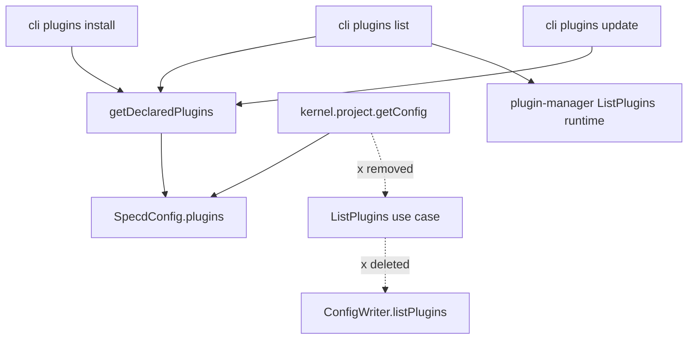

# Design: 05-core-config-list-plugins

## Non-goals

- Removing `ConfigWriter.listPlugins` from the port or `FsConfigWriter` implementation.
- Changing `plugin-manager` runtime `ListPlugins` (load-status inventory).
- Adding a core-level `listPluginDeclarations` helper or new `core:list-plugin-declarations` spec.
- Changing plugin write paths (`addPlugin`, `removePlugin`, `initProject`) beyond declaration **reads** in install/update/list.

## Affected areas

### Core — delete `ListPlugins` use case (MEDIUM risk)

| Symbol / file                                                                   | Change                                                     | Impact                                    |
| ------------------------------------------------------------------------------- | ---------------------------------------------------------- | ----------------------------------------- |
| `ListPlugins` class — `packages/core/src/application/use-cases/list-plugins.ts` | **Delete file**                                            | Only caller was kernel wiring             |
| `ListPluginsInput`, `ListPluginsEntry` — same file                              | **Delete**                                                 | Exported as types from use-cases index    |
| `createListPlugins` — `packages/core/src/composition/use-cases/list-plugins.ts` | **Delete file**                                            | Standalone factory; no other prod callers |
| `packages/core/test/application/use-cases/list-plugins.spec.ts`                 | **Delete**                                                 | Tests deleted use case                    |
| `packages/core/src/application/use-cases/index.ts`                              | Remove `ListPlugins` type exports                          | Barrel cleanup                            |
| `packages/core/src/composition/use-cases/index.ts`                              | Remove `createListPlugins`, `FsListPluginsOptions` exports | Barrel cleanup                            |

### Core — kernel wiring (LOW risk)

| Symbol / file                                                  | Change                                                                                | Impact                |
| -------------------------------------------------------------- | ------------------------------------------------------------------------------------- | --------------------- |
| `Kernel` interface — `packages/core/src/composition/kernel.ts` | Remove `listPlugins: ListPlugins` from `project` group                                | Breaking public API   |
| `createKernel` — same file                                     | Remove `ListPlugins` import and `listPlugins: new ListPlugins(i.configWriter)` wiring | 1 direct caller chain |
| `packages/core/src/composition/kernel-internals.ts`            | No direct `listPlugins` references; unaffected except transitive compile              | LOW                   |

**Untouched:** `ConfigWriter.listPlugins`, `FsConfigWriter.listPlugins`, port interface, config-writer tests.

### CLI — read declarations from `SpecdConfig` (MEDIUM risk)

| Symbol / file                                                               | Change                                                                                                                                                  | Impact                      |
| --------------------------------------------------------------------------- | ------------------------------------------------------------------------------------------------------------------------------------------------------- | --------------------------- |
| `registerPluginsList` action — `packages/cli/src/commands/plugins/list.ts`  | Replace `kernel.project.listPlugins.execute` with `getDeclaredPlugins(config, type)`; drop unused `kernel` / `configPath` if only used for listPlugins  | Primary spec target         |
| `installPluginsWithKernel` — `packages/cli/src/commands/plugins/install.ts` | Replace `kernel.project.listPlugins.execute({ type: 'agents' })` with `getDeclaredPlugins(config, 'agents')`; remove `kernel` param if no longer needed | Compile fix; same data path |
| `updatePluginsWithKernel` — `packages/cli/src/commands/plugins/update.ts`   | Same as install                                                                                                                                         | Compile fix                 |
| `packages/cli/test/commands/plugins.spec.ts`                                | Remove `listPlugins` kernel mocks; stub `config.plugins` on loaded config                                                                               | Test update                 |
| `packages/cli/test/commands/plugins-update.spec.ts`                         | Same                                                                                                                                                    | Test update                 |
| `packages/cli/test/commands/helpers.ts`                                     | Remove `listPlugins` from mock kernel `project` group                                                                                                   | Shared test helper          |

### Documentation

| File                       | Change                                                                             |
| -------------------------- | ---------------------------------------------------------------------------------- |
| `docs/cli/plugins-list.md` | Replace `ConfigWriter.listPlugins()` with loaded `SpecdConfig.plugins`             |
| `docs/core/get-config.md`  | Add note: plugin declarations read from `getConfig().plugins`, not a list use case |

**Not required:** `docs/core/config-writer.md` — `listPlugins` remains on port for other flows.

## New constructs

### `getDeclaredPlugins` — CLI-internal helper

- **Location:** `packages/cli/src/commands/plugins/get-declared-plugins.ts`
- **Shape:**

```typescript
import type { SpecdConfig } from '@specd/core'

/** One plugin declaration row from config. */
export interface DeclaredPluginEntry {
  readonly name: string
  readonly config?: Readonly<Record<string, unknown>>
}

/**
 * Returns plugin declarations for a type bucket from an in-memory config snapshot.
 *
 * @param config - Loaded project configuration.
 * @param type - Plugin type key (for example `agents`).
 * @returns Declarations for that type, or empty when absent.
 */
export function getDeclaredPlugins(
  config: SpecdConfig,
  type: string,
): readonly DeclaredPluginEntry[]
```

- **Implementation contract:**

```typescript
const plugins = config.plugins as
  | Readonly<Record<string, readonly DeclaredPluginEntry[] | undefined>>
  | undefined
return plugins?.[type] ?? []
```

- **Responsibility:** Project `SpecdConfig.plugins.<type>` without disk I/O. Does not validate runtime load status.
- **Relationships:** Pure CLI adapter helper. Used by `list.ts`, `install.ts`, `update.ts`. Not exported from `@specd/cli` public API. Not a core symbol.

**No other new constructs.**

## Approach

### Phase 1 — Remove core `ListPlugins`

1. Delete `application/use-cases/list-plugins.ts` and its spec file.
2. Delete `composition/use-cases/list-plugins.ts`.
3. Remove exports from both use-case index barrels.
4. In `kernel.ts`: remove `ListPlugins` import, `listPlugins` from `Kernel['project']`, and wiring in `createKernel`.

### Phase 2 — CLI declaration reads

1. Add `get-declared-plugins.ts` helper (above).
2. In `list.ts`:
   - Keep `resolveCliContext` for `config` only (drop `kernel` destructure if unused).
   - Replace loop body:

```typescript
const declared = getDeclaredPlugins(config, type)
```

- Remove `configPath` variable if only used for listPlugins.

3. In `install.ts` / `update.ts`:
   - Replace `input.kernel.project.listPlugins.execute({ configPath, type: 'agents' })` with `getDeclaredPlugins(input.config, 'agents')`.
   - Remove `kernel` from function params if no longer referenced; update callers in same file accordingly.
4. Update CLI tests to set `config.plugins.agents` instead of mocking `kernel.project.listPlugins`.

### Phase 3 — Docs

Update `docs/cli/plugins-list.md` and `docs/core/get-config.md` per Documentation section.

### Requirement coverage

| Requirement                                | Implementation path                                                     |
| ------------------------------------------ | ----------------------------------------------------------------------- |
| kernel: Plugin declarations not a use case | Delete use case + remove kernel entry                                   |
| kernel: project group via getConfig        | Already spec'd; implementation aligned                                  |
| cli: Declaration source                    | `getDeclaredPlugins` from loaded config                                 |
| cli: Default type `agents`                 | Unchanged: `types = opts.type === undefined ? ['agents'] : [opts.type]` |
| cli: Status detection / output             | Unchanged plugin-manager path                                           |

## Key decisions

**Decision:** Delete `ListPlugins` use case entirely; no deprecation.

**Alternatives rejected:** Thin wrapper over `getConfig` — still unnecessary kernel surface.

---

**Decision:** CLI-local `getDeclaredPlugins` helper (not core export).

**Alternatives rejected:**

- Call `ConfigWriter.listPlugins` — redundant disk read when config loaded.
- Core `listPluginDeclarations` + spec — overkill for three CLI call sites.

---

**Decision:** Include `cli:plugins-install` and `cli:plugins-update` in change scope with spec deltas.

**Rationale:** Both call `kernel.project.listPlugins` today; removing kernel entry requires spec-tracked migration, not silent compile fixes.

## Trade-offs

- **[Risk] `SpecdConfig.plugins` typed narrowly (`agents` only) vs `ConfigWriter` accepting any YAML key** → Mitigation: indexed access with `?? []`; unknown types return empty (matches validated config loader). Stricter than raw disk read — intentional.
- **[Risk] Breaking `kernel.project.listPlugins` for external consumers** → Mitigation: breaking change; replacement is `getConfig().plugins`. Document in get-config docs.
- **[Risk] Overlap with `06-core-config-editing-boundary` on `core:kernel`** → Mitigation: serialize archives.

## Spec impact

### `core:kernel`

- Direct dependents: delivery mechanisms consuming kernel type.
- `cli:plugins-list` indirectly depends via kernel shape — satisfied by CLI migration.
- No additional spec deltas required beyond this change.

### `cli:plugins-list`

- No downstream spec dependents.
- `core:config-writer-port` dependency removed in spec delta.

### `cli:plugins-install`

- Declaration reads moved to `SpecdConfig.plugins`; `ConfigWriter.addPlugin` write path unchanged.
- `core:get-config` added; `core:config-writer-port` retained for persistence.

### `cli:plugins-update`

- Declaration reads moved to `SpecdConfig.plugins`; no config writes.
- `core:config-writer-port` dependency removed; `core:get-config` added.

## Dependency map



```
┌──────────────────┐     ┌─────────────────────┐
│ plugins list     │────▶│ getDeclaredPlugins  │
│ plugins install  │────▶│ (CLI helper)        │
│ plugins update   │────▶└──────────┬──────────┘
└──────────────────┘                │
                                  ▼
                         ┌─────────────────┐
                         │ SpecdConfig     │
                         │ .plugins[type]  │
                         └─────────────────┘

kernel.project.listPlugins  ──X──▶  (deleted)
ListPlugins use case        ──X──▶  (deleted)

ConfigWriter.listPlugins    ──────▶  (unchanged, no prod caller after delete)
```

## Migration / Rollback

**Deploy:** Ship core + cli together. Partial deploy breaks any code calling `kernel.project.listPlugins`.

**Rollback:** Revert commit; restore use case + kernel wiring + CLI kernel calls.

**Consumer migration:**

```typescript
// Before
const declared = await kernel.project.listPlugins.execute({ configPath, type: 'agents' })

// After
const snapshot = kernel.project.getConfig.execute()
const declared = snapshot.plugins?.agents ?? []
// Or use loaded SpecdConfig from ConfigLoader
```

## Testing

### Automated

| File                                                                            | Scenarios                                                   |
| ------------------------------------------------------------------------------- | ----------------------------------------------------------- |
| `packages/cli/test/commands/plugins/get-declared-plugins.spec.ts` (new)         | Returns agents; unknown type → `[]`; missing plugins → `[]` |
| `packages/cli/test/commands/plugins.spec.ts`                                    | List command uses config.plugins; no listPlugins mock       |
| `packages/cli/test/commands/plugins-update.spec.ts`                             | Update uses config.plugins                                  |
| `packages/cli/test/commands/plugins-install.spec.ts` (if exists)                | Install uses config.plugins                                 |
| Delete `packages/core/test/application/use-cases/list-plugins.spec.ts`          | N/A                                                         |
| Kernel integration: existing project-group verify coverage via CLI/kernel tests | `listPlugins` absent from `kernel.project`                  |

### Manual / E2E

```bash
pnpm --filter @specd/core build
pnpm --filter @specd/cli build
node packages/cli/dist/index.js plugins list
node packages/cli/dist/index.js plugins list --type agents --format json
```

**Expected:** Declared plugins listed with correct status; no errors. Empty config → `no plugins declared`.

**Wrong signal:** TypeError on `kernel.project.listPlugins`; empty list when `plugins.agents` populated in yaml.

### Lint / docs

- ESLint + JSDoc on new helper per `default:_global/docs`.
- Update docs listed in Affected areas.
