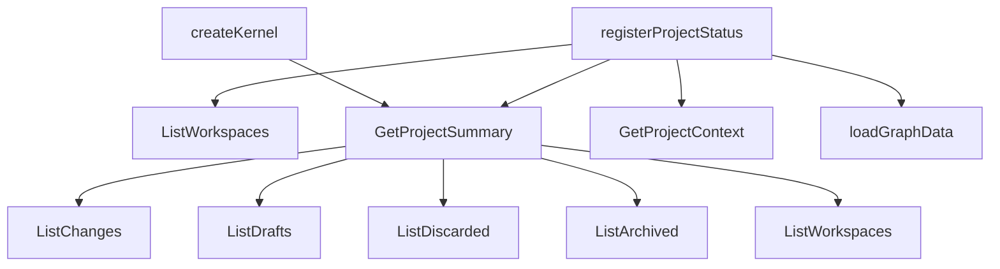

# Design: 08-core-project-summary

## Non-goals

- Code-graph statistics, hotspots, fingerprint mismatch — remain in CLI `loadGraphData` (change `10-code-graph-host-use-cases` / SDK)
- Project context compilation (`--context`) — unchanged; still `GetProjectContext`
- `buildProjectStatusSnapshot` SDK facade — change `11-sdk-host-facade`
- MCP migration to SDK — change `12-cli-mcp-sdk-migration`
- Auto-indexing graph
- Loading change entities or spec metadata in summary use case

## Affected areas

| Symbol / file                             | Location                                              | Change                                                                                                                                                                                               | Impact                                                                        |
| ----------------------------------------- | ----------------------------------------------------- | ---------------------------------------------------------------------------------------------------------------------------------------------------------------------------------------------------- | ----------------------------------------------------------------------------- |
| `registerProjectStatus` action handler    | `packages/cli/src/commands/project/status.ts`         | Replace manual `Promise.all` of four list use cases + per-workspace `count()` with single `kernel.project.getProjectSummary.execute()` for counts; keep `listWorkspaces` for workspace output fields | **MEDIUM** — 1 direct test caller (`project-status.spec.ts`)                  |
| `loadGraphData`                           | `packages/cli/src/commands/project/status.ts`         | Unchanged                                                                                                                                                                                            | LOW                                                                           |
| `Kernel` interface `project` namespace    | `packages/core/src/composition/kernel.ts`             | Add `getProjectSummary: GetProjectSummary`                                                                                                                                                           | **MEDIUM** — `Kernel` type affects composition tests and all kernel consumers |
| `createKernel` wiring                     | `packages/core/src/composition/kernel.ts`             | Instantiate `GetProjectSummary` via `createGetProjectSummary(config)`                                                                                                                                | **MEDIUM**                                                                    |
| `createBuiltinKernelRegistry` / internals | `packages/core/src/composition/kernel-internals.ts`   | No change expected unless factory registration pattern requires it                                                                                                                                   | LOW                                                                           |
| Application exports                       | `packages/core/src/application/index.ts`              | Export `GetProjectSummary`, `GetProjectSummaryResult`                                                                                                                                                | LOW                                                                           |
| Composition exports                       | `packages/core/src/composition/index.ts` (if present) | Export `createGetProjectSummary`                                                                                                                                                                     | LOW                                                                           |

Blast radius (graph impact): **MEDIUM** — 5 affected files, `Kernel` interface is cross-workspace integration point.

## New constructs

### `GetProjectSummaryResult`

- **Location:** `packages/core/src/application/use-cases/get-project-summary.ts`
- **Shape:**

```typescript
export interface GetProjectSummaryResult {
  readonly activeCount: number
  readonly draftCount: number
  readonly discardedCount: number
  readonly archivedCount: number
  readonly specsByWorkspace: Readonly<Record<string, number>>
  readonly workspaceCount: number
}
```

- **Responsibility:** Count-only aggregate DTO returned by the use case.
- **Relationships:** Application layer value type; consumed by CLI and future SDK.

### `GetProjectSummary`

- **Location:** `packages/core/src/application/use-cases/get-project-summary.ts`
- **Shape:**

```typescript
export class GetProjectSummary {
  constructor(
    listChanges: ListChanges,
    listDrafts: ListDrafts,
    listDiscarded: ListDiscarded,
    listArchived: ListArchived,
    listWorkspaces: ListWorkspaces,
  ) {}

  async execute(): Promise<GetProjectSummaryResult>
}
```

- **Responsibility:** Orchestrate five injected list use cases; return counts only. No config reads, no repository construction, no graph/context I/O.
- **Relationships:** Application use case; depends on existing list use cases and `ListWorkspaces`.

**Execute algorithm:**

1. `Promise.all` batch A: `listChanges.execute()`, `listDrafts.execute()`, `listDiscarded.execute()`, `listArchived.execute()`, `listWorkspaces.execute()`
2. Derive `activeCount`, `draftCount`, `discardedCount` from respective array `.length`
3. Derive `archivedCount` from `archivedResult.meta.total` (not `items.length`)
4. `Promise.all` batch B: `workspaces.map(ws => ws.specRepo.count())` paired with `ws.name`
5. Build `specsByWorkspace` as `Record<string, number>` preserving workspace declaration order
6. `workspaceCount = workspaces.length`
7. Return assembled `GetProjectSummaryResult`

### `createGetProjectSummary`

- **Location:** `packages/core/src/composition/use-cases/get-project-summary.ts`
- **Shape:** `export function createGetProjectSummary(config: SpecdConfig): GetProjectSummary`
- **Responsibility:** Wire dependencies using existing factories: `createListChanges`, `createListDrafts`, `createListDiscarded`, `createListArchived`, `createListWorkspaces`.
- **Relationships:** Composition layer; mirrors `createListChanges` pattern.

### Tests

- **Location:** `packages/core/test/application/use-cases/get-project-summary.spec.ts`
- **Responsibility:** Unit tests with mocked list use cases verifying count derivation, parallelism contract (via call tracking), and archived `meta.total` handling.

## Approach

### Core (application + composition)

1. Add `get-project-summary.ts` use case with result interface and class per signatures above.
2. Add `composition/use-cases/get-project-summary.ts` factory wiring five `createList*` factories.
3. Extend `Kernel.project` interface and `createKernel` body with `getProjectSummary: createGetProjectSummary(config)`.
4. Export new symbols from `application/index.ts`.

### CLI

1. In `registerProjectStatus` action, replace count orchestration:

**Before:**

```typescript
const [workspaces, activeChanges, drafts, discarded, graphData] = await Promise.all([
  kernel.project.listWorkspaces.execute(),
  kernel.changes.list.execute(),
  kernel.changes.listDrafts.execute(),
  kernel.changes.listDiscarded.execute(),
  loadGraphData(...),
])
const specCounts = await Promise.all(workspaces.map(...))
```

**After:**

```typescript
const [workspaces, summary, graphData] = await Promise.all([
  kernel.project.listWorkspaces.execute(),
  kernel.project.getProjectSummary.execute(),
  loadGraphData(...),
])
```

2. Map `summary.activeCount`, `summary.draftCount`, `summary.discardedCount`, `summary.archivedCount` into text/json/toon output.
3. Map `summary.specsByWorkspace` for per-workspace spec counts; `totalSpecs = Object.values(summary.specsByWorkspace).reduce(...)`.
4. Add `archived` / `archivedCount` field to structured output (`json`/`toon`) and text renderer.
5. Keep `listWorkspaces` call for workspace rich fields (name, prefix, ownership, isExternal, codeRoot, projectRoot, schemaRef).

### Documentation

Update `docs/core/overview.md` and `docs/core/use-cases.md` if they enumerate kernel `project` use cases — add `GetProjectSummary` entry with brief description and result shape.

## Key decisions

**Decision:** Single `GetProjectSummary` use case vs extending `ListWorkspaces` with counts.

**Rationale:** Change counts live in change repositories; spec counts need workspace orchestration. A dedicated use case composes existing list primitives without bloating `ListWorkspaces`.

**Alternatives rejected:** CLI-only helper (duplicated when SDK arrives); kernel method without use case class (breaks hexagonal pattern).

**Decision:** `archivedCount` from `ArchiveListResult.meta.total`.

**Rationale:** `ListArchived` returns paginated `ArchiveListResult`; `items.length` undercounts when `total > count`.

**Decision:** Keep `listWorkspaces` in CLI alongside `getProjectSummary`.

**Rationale:** `cli:project-status` still requires full workspace metadata for output; summary returns counts only.

## Trade-offs

| Risk                                                         | Mitigation                                         |
| ------------------------------------------------------------ | -------------------------------------------------- |
| Double `ListWorkspaces` call (CLI + summary internals)       | Acceptable for P2; SDK snapshot can optimize later |
| `cli:project-status` overlap with `12-cli-mcp-sdk-migration` | Archive `08` first per proposal                    |
| Kernel interface growth                                      | Additive only; no breaking signature changes       |

## Spec impact

### `cli:project-status` (modified)

- Direct dependents: skills entry skill, docs
- Requirements still satisfied: workspace info via `ListWorkspaces`; counts via `GetProjectSummary`; graph/context unchanged
- No additional spec deltas required beyond this change

### `core:get-project-summary` (new)

- Future dependents: `cli:project-status`, `11-sdk-host-facade` `buildProjectStatusSnapshot`
- No downstream spec breakage at creation time

## Dependency map



```
┌─────────────────────┐
│ project status CLI  │
└─────────┬───────────┘
          │
    ┌─────┴─────┬─────────────┐
    ▼           ▼             ▼
┌─────────┐ ┌───────────┐ ┌────────────┐
│ListWork │ │GetProject │ │loadGraph   │
│spaces   │ │Summary    │ │Data        │
└─────────┘ └─────┬─────┘ └────────────┘
                  │
      ┌───────────┼───────────┬──────────┐
      ▼           ▼           ▼          ▼
┌──────────┐ ┌─────────┐ ┌──────────┐ ┌──────────┐
│ListChange│ │ListDraft│ │ListDiscar│ │ListArchiv│
│s         │ │s        │ │ded       │ │ed        │
└──────────┘ └─────────┘ └──────────┘ └──────────┘
                  │
                  ▼
            ┌───────────┐
            │ListWork   │
            │spaces     │
            └───────────┘
```

## Testing

### Automated

| File                                                                          | Coverage                                                                                                                              |
| ----------------------------------------------------------------------------- | ------------------------------------------------------------------------------------------------------------------------------------- |
| `packages/core/test/application/use-cases/get-project-summary.spec.ts`        | All `core:get-project-summary` verify scenarios: count fields, list delegation, `meta.total` for archived, spec map, constructor deps |
| `packages/core/test/composition/kernel-get-config.spec.ts` or new kernel test | Assert `kernel.project.getProjectSummary` exists after `createKernel`                                                                 |
| `packages/cli/test/commands/project-status.spec.ts`                           | Update mocks to stub `getProjectSummary`; assert archived count in output; assert no direct `changes.list` for counting               |

### Manual / E2E

```bash
node packages/cli/dist/index.js project status --format toon
```

Expect: `changes.active`, `changes.drafts`, `changes.discarded`, `changes.archived` (or equivalent field names matching existing output convention), `specs.byWorkspace`, `specs.total`.

Compare counts with:

```bash
node packages/cli/dist/index.js changes list --format toon | wc -l  # approximate cross-check
```

Wrong signal: archived count missing or zero when archive has entries; CLI still calling four separate list endpoints in network trace / test spy.

### Lint / docs

- ESLint type-aware rules on new files
- JSDoc on public exports per `default:_global/docs`
- Update `docs/core/use-cases.md` kernel project section

## Open questions

_none_
