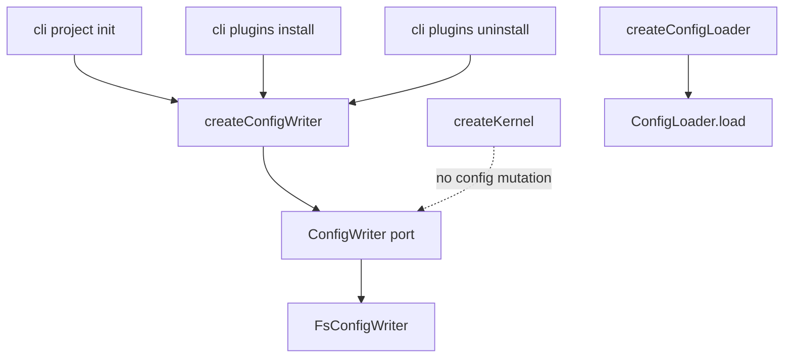

# Design: 06-core-config-editing-boundary

## Non-goals

- Changing `ConfigWriter` method signatures or `FsConfigWriter` behaviour
- Removing `ConfigWriter.listPlugins` from the port interface (delivery must not use it for reads)
- Migrating `RecordSkillInstall` / `GetSkillsManifest` (future change)
- SDK facade (`@specd/sdk`) — out of scope; CLI continues importing `@specd/core` directly
- Deleting `specs/core/init-project/` directory at archive time — delta retires content; physical removal is optional follow-up

## Affected areas

### Core — composition

- `packages/core/src/composition/config-loader.ts` — reference pattern for new file
  - **Change:** none; used as template
- `packages/core/src/composition/config-writer.ts` — **new**
  - **Change:** add `createConfigWriter()` factory
  - **Risk:** LOW — new export
- `packages/core/src/composition/index.ts`
  - **Change:** export `createConfigWriter`, `FsConfigWriterOptions` (or equivalent)
  - **Risk:** LOW
- `packages/core/src/composition/use-cases/init-project.ts` — **delete**
- `packages/core/src/composition/use-cases/add-plugin.ts` — **delete**
- `packages/core/src/composition/use-cases/remove-plugin.ts` — **delete**
- `packages/core/src/composition/use-cases/index.ts`
  - **Change:** remove `createInitProject`, `createAddPlugin`, `createRemovePlugin` exports
- `packages/core/src/application/use-cases/init-project.ts` — **delete**
- `packages/core/src/application/use-cases/add-plugin.ts` — **delete**
- `packages/core/src/application/use-cases/remove-plugin.ts` — **delete**
- `packages/core/src/application/use-cases/index.ts`
  - **Change:** remove `InitProject`, `AddPlugin`, `RemovePlugin` type exports
- `packages/core/src/composition/kernel.ts`
  - **Change:** remove `init`, `addPlugin`, `removePlugin` from `Kernel.project` interface and `createKernel` wiring; drop related imports
  - **Callers:** CLI tests, kernel tests
  - **Risk:** MEDIUM — breaking public API
- `packages/core/src/composition/kernel-internals.ts`
  - **Change:** remove `configWriter` from `KernelInternals`; stop `new FsConfigWriter()` in `createKernelInternals`
  - **Risk:** LOW
- `packages/core/test/application/use-cases/init-project.spec.ts` — **delete**
- `packages/core/test/application/use-cases/add-plugin.spec.ts` — **delete**
- `packages/core/test/application/use-cases/remove-plugin.spec.ts` — **delete**
- `packages/core/test/composition/kernel-get-config.spec.ts`
  - **Change:** remove mocks/assertions for `project.init` / `addPlugin` / `removePlugin` if present
- `packages/core/test/infrastructure/fs/config-writer.spec.ts`
  - **Change:** none required — remains authoritative for port behaviour

### CLI

- `packages/cli/src/commands/project/init.ts`
  - **Change:** `import { createConfigWriter }`; replace `createInitProject()` + `execute()` with `createConfigWriter().initProject(options)`
  - **Risk:** LOW
- `packages/cli/src/commands/plugins/install.ts`
  - **Change:** obtain `const writer = createConfigWriter()`; call `writer.addPlugin(...)` instead of `kernel.project.addPlugin.execute(...)`; keep kernel only if still needed for plugin-manager steps after yaml write
  - **Risk:** MEDIUM
- `packages/cli/src/commands/plugins/uninstall.ts`
  - **Change:** same pattern with `removePlugin`
  - **Risk:** MEDIUM
- `packages/cli/test/commands/project-init.spec.ts`
  - **Change:** mock `createConfigWriter` instead of `createInitProject`
- `packages/cli/test/commands/plugins.spec.ts`
  - **Change:** mock `createConfigWriter`; assert `addPlugin` / `removePlugin` called; remove `kernel.project.addPlugin` expectations
- `packages/cli/test/entrypoint.spec.ts`
  - **Change:** update `createInitProject` mock if referenced

### Documentation

- `docs/core/` — update any kernel docs referencing `project.init`, `project.addPlugin`, `project.removePlugin`
- Add `createConfigWriter` alongside `createConfigLoader` in composition docs if present

## New constructs

### `createConfigWriter` — `packages/core/src/composition/config-writer.ts`

```typescript
import { type ConfigWriter } from '../application/ports/config-writer.js'
import { FsConfigWriter } from '../infrastructure/fs/config-writer.js'

/** Options for {@link createConfigWriter}. */
export interface FsConfigWriterOptions {
  /** Pre-built config writer instance (tests). */
  readonly configWriter: ConfigWriter
}

export function createConfigWriter(): ConfigWriter
export function createConfigWriter(options: FsConfigWriterOptions): ConfigWriter
export function createConfigWriter(options?: FsConfigWriterOptions): ConfigWriter {
  return options?.configWriter ?? new FsConfigWriter()
}
```

- **Responsibility:** wire `FsConfigWriter` for delivery; sole public entry for config mutation
- **Does not:** wrap port in use-case classes; participate in kernel wiring
- **Depends on:** `ConfigWriter` port, `FsConfigWriter`
- **Used by:** CLI init, plugins install/uninstall; tests inject mock via options

### Composition integration test (optional, recommended)

- `packages/core/test/composition/config-writer.spec.ts` — smoke test that `createConfigWriter()` returns object with `initProject`, `addPlugin`, `removePlugin` functions

## Approach

### Phase 1 — Add factory (non-breaking)

1. Create `composition/config-writer.ts` mirroring `config-loader.ts`
2. Export from `composition/index.ts` and verify `@specd/core` re-export chain
3. Add composition smoke test

### Phase 2 — Migrate CLI

1. `project/init.ts`: replace `createInitProject` with `createConfigWriter().initProject`
2. `plugins/install.ts`: after plugin-manager success, `createConfigWriter().addPlugin(...)`; remove `kernel.project.addPlugin` usage
3. `plugins/uninstall.ts`: `createConfigWriter().removePlugin(...)`
4. Update CLI tests to mock `createConfigWriter` returning `{ initProject, addPlugin, removePlugin }` stubs

### Phase 3 — Remove kernel surface

1. Delete `init`, `addPlugin`, `removePlugin` from `Kernel` interface (`kernel.ts`)
2. Remove wiring in `createKernel` return object
3. Remove `configWriter` field from `KernelInternals` and `createKernelInternals`
4. Remove imports of deleted use cases from kernel files

### Phase 4 — Delete pass-through use cases

1. Delete application + composition use-case files and barrel exports
2. Delete application unit tests (behaviour covered by `config-writer.spec.ts` integration tests)
3. Grep repo for `createInitProject`, `createAddPlugin`, `createRemovePlugin`, `InitProject`, `AddPlugin`, `RemovePlugin`, `kernel.project.init`, `kernel.project.addPlugin`, `kernel.project.removePlugin` — zero remaining references outside changelog/docs

### Phase 5 — Docs

1. Update `docs/core/` kernel reference tables
2. Document `createConfigWriter` next to `createConfigLoader`

## Key decisions

**`createConfigWriter()` returns port directly** → symmetric with `createConfigLoader()`; eliminates pass-through use cases. **Rejected:** keep thin use cases for hypothetical future hooks.

**Delete use case classes entirely** → honest architecture; `FsConfigWriter` integration tests are sufficient. **Rejected:** deprecate for one release — unnecessary churn for internal API.

**Kernel drops all config mutation** → yaml-only commands avoid `createKernel`. **Rejected:** keep kernel wrappers — contradicts P1e goal.

**Retire `core:init-project` spec content via delta** → requirements live in `config-writer-port` + `composition`. **Rejected:** keep parallel use-case spec.

## Trade-offs

- **[Breaking API]** `kernel.project.*` and factory removals → documented in proposal; consumers must use `createConfigWriter`
- **[Overlap with 07/11]** `core:kernel` also targeted elsewhere → archive P1e before P1d to reduce delta conflicts
- **[MCP not in scope]** if MCP uses removed APIs → grep during implement; add MCP migration if found

## Spec impact

| Modified spec                       | Dependents affected         | Assessment                                       |
| ----------------------------------- | --------------------------- | ------------------------------------------------ |
| `core:kernel`                       | CLI, MCP, docs              | Entry mapping + examples updated in delta        |
| `core:composition`                  | `core:kernel`, architecture | New factory requirements                         |
| `core:config-writer-port`           | CLI plugins, project-init   | Delivery access requirement added                |
| `core:init-project`                 | `core:kernel` (dep removed) | Retired — no downstream spec depends on use case |
| `cli:project-init`                  | none                        | Delegation requirement updated                   |
| `cli:plugins-install` / `uninstall` | none                        | Workflow requirements updated                    |
| `default:_global/architecture`      | all packages                | Config writer exception documented               |

## Dependency map



```
┌──────────────────┐     ┌───────────────────┐
│ cli:project-init │────▶│ createConfigWriter  │
└──────────────────┘     └─────────┬─────────┘
┌──────────────────┐               │
│ cli:plugins-*    │───────────────┤
└──────────────────┘               ▼
                           ┌─────────────────┐
                           │ ConfigWriter    │
                           │ (port methods)  │
                           └────────┬────────┘
                                    ▼
                           ┌─────────────────┐
                           │ FsConfigWriter  │
                           └─────────────────┘

┌─────────────┐   no longer wires   ┌──────────────┐
│ createKernel│ ─ ─ ─ ─ ─ ─ ─ ─ ▶ │ configWriter │
└─────────────┘                     └──────────────┘
```

## Migration / Rollback

- **Deploy:** single release; breaking change to `@specd/core` kernel surface
- **Consumer migration:** replace `kernel.project.addPlugin.execute({...})` with `createConfigWriter().addPlugin(configPath, type, name, config)`; same for remove/init
- **Rollback:** revert commit; restore kernel entries and use cases

## Testing

### Automated

| Test file                                                                   | Action                                              |
| --------------------------------------------------------------------------- | --------------------------------------------------- |
| `packages/core/test/composition/config-writer.spec.ts`                      | **new** — factory returns writer with three methods |
| `packages/core/test/infrastructure/fs/config-writer.spec.ts`                | keep — init/add/remove behaviour                    |
| `packages/core/test/composition/kernel-get-config.spec.ts`                  | update — no config mutation on kernel               |
| `packages/core/test/application/use-cases/{init,add,remove}-plugin.spec.ts` | **delete**                                          |
| `packages/cli/test/commands/project-init.spec.ts`                           | mock `createConfigWriter`                           |
| `packages/cli/test/commands/plugins.spec.ts`                                | mock `createConfigWriter`; assert port methods      |

### Verify scenario mapping

- Composition `createConfigWriter` scenarios → composition + factory tests
- Kernel `Config mutation is not a kernel use case` → kernel-get-config + type checks
- ConfigWriter `Delivery access` → CLI tests + export grep
- CLI install/uninstall/project-init scenarios → respective command tests

### Manual

```bash
pnpm --filter @specd/core build && pnpm --filter @specd/cli build
node packages/cli/dist/index.js project init --force --schema @specd/schema-std --workspace default --workspace-path specs/
node packages/cli/dist/index.js plugins install @specd/plugin-agent-standard
node packages/cli/dist/index.js plugins uninstall @specd/plugin-agent-standard
```

Expect: init creates `specd.yaml`; install/uninstall mutate `plugins` section; no errors referencing `kernel.project.addPlugin`.

## Open questions

_None._
