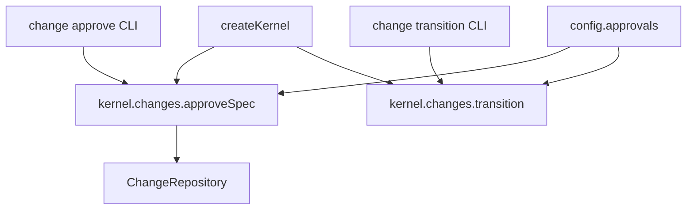

# Design: 09-core-approval-gates-baked

## Non-goals

- API mutate handler on feature branch
- MCP/SDK migration (12) — only exploration notes updated here
- Approval manifest redesign (`approval-system-notes.md`)
- Changing gate semantics, routing rules, or error types

## Affected areas

| Symbol / file                    | Location                                  | Change                                                        | Impact                          |
| -------------------------------- | ----------------------------------------- | ------------------------------------------------------------- | ------------------------------- |
| `Kernel` interface               | `packages/core/src/composition/kernel.ts` | Move `approveSpec`/`approveSignoff` from `specs` to `changes` | **HIGH** — all kernel consumers |
| `createKernel` wiring            | same                                      | Instantiate approve use cases under `changes`                 | **HIGH**                        |
| `TransitionChange`               | application use case                      | Constructor baking; input drops approval fields               | **HIGH**                        |
| `ApproveSpec` / `ApproveSignoff` | application use cases                     | Constructor baking; input `name`+`reason`                     | **MEDIUM**                      |
| Composition factories            | `transition-change`, `approve-*`          | Pass `config.approvals`                                       | **MEDIUM**                      |
| CLI `change/approve.ts`          | `kernel.changes.approve*` + no gate flags | **MEDIUM**                                                    |
| CLI `change/transition.ts`       | no gate flags                             | **MEDIUM**                                                    |
| Tests                            | CLI helpers, kernel tests, use-case specs | path + input updates                                          | **MEDIUM**                      |

## New constructs

### `ApprovalGates`

```typescript
export type ApprovalGates = { readonly spec: boolean; readonly signoff: boolean }
```

Shared with `GetStatus` constructor shape; sourced from `config.approvals`.

## Approach

### 1. Bake approvals at construction

Same as prior design — `_approvals` on `TransitionChange`, `ApproveSpec`, `ApproveSignoff`; factories pass `config.approvals`.

### 2. Relocate kernel entries

**Before:**

```typescript
interface Kernel {
  changes: { transition: TransitionChange /* … */ }
  specs: { approveSpec: ApproveSpec; approveSignoff: ApproveSignoff /* … */ }
}
```

**After:**

```typescript
interface Kernel {
  changes: {
    transition: TransitionChange
    approveSpec: ApproveSpec
    approveSignoff: ApproveSignoff
    /* … */
  }
  specs: {
    /* no approve* entries */
  }
}
```

`createKernel` moves instantiation from `specs:` block to `changes:` block. Wiring still uses `createApproveSpec(config)` / `createApproveSignoff(config)` factories — only kernel namespace changes.

### 3. CLI updates

```typescript
// approve.ts — before
await kernel.specs.approveSpec.execute({ name, reason, approvalsSpec: config.approvals.spec })

// after
await kernel.changes.approveSpec.execute({ name, reason })
```

### 4. Test mock updates

`packages/cli/test/commands/helpers.ts` — move `approveSpec`/`approveSignoff` mocks from `kernel.specs` to `kernel.changes`.

## Key decisions

**Decision:** Relocate in same change as approval baking.

**Rationale:** Same touch surface (`kernel.ts`, CLI approve, tests). Avoids two breaking kernel moves. Semantically correct namespace before SDK migration (11–12).

**Decision:** Keep use case names `ApproveSpec` / `ApproveSignoff`.

**Rationale:** Names refer to gate type ("spec gate", "signoff gate"), not workspace specs. Renaming use cases is out of scope.

## Trade-offs

| Risk                                                    | Mitigation                                        |
| ------------------------------------------------------- | ------------------------------------------------- |
| Overlap with 11/13 on `core:kernel`, `core:composition` | Archive 09 first; downstream explorations updated |
| Breaking all `kernel.specs.approve*` callers            | Compiler errors; grep monorepo                    |
| HIGH kernel blast radius                                | Mechanical move + existing test suites            |

## Spec impact

Seven modified specs: `core:transition-change`, `core:approve-spec`, `core:approve-signoff`, `core:kernel`, `core:composition`, `cli:change-transition`, `cli:change-approve`.

## Dependency map



## Testing

| File                        | Coverage                                                                |
| --------------------------- | ----------------------------------------------------------------------- |
| `kernel-get-config.spec.ts` | `kernel.changes.approveSpec` defined; `kernel.specs.approveSpec` absent |
| `change-approve.spec.ts`    | calls `kernel.changes.approveSpec`                                      |
| use-case specs              | constructor baking unchanged scenarios                                  |
| `transition-change.spec.ts` | baking scenarios                                                        |

Manual:

```bash
node packages/cli/dist/index.js change approve spec <name> --reason "ok"
```

## Open questions

_none_
