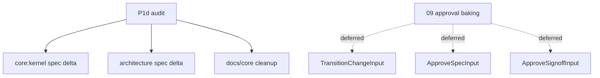

# Design: 07-core-kernel-input-audit

## Non-goals

- Baking `config.approvals` into `TransitionChange`, `ApproveSpec`, or `ApproveSignoff` constructors — owned by change `09-core-approval-gates-baked`.
- CLI/MCP caller updates for approval flags — follows `09` archive.
- Public API barrel curation — owned by `13-public-api-surface`.
- New kernel use cases or behaviour changes beyond spec/doc alignment.

## Affected areas

- `specs/core/kernel/spec.md` + `verify.md` — via deltas: input boundary, runtime override whitelist, skills-manifest retirement.
- `specs/_global/architecture/spec.md` + `verify.md` — via delta: composition-layer config-at-construction rule.
- `docs/core/overview.md` — remove `RecordSkillInstall` and `GetSkillsManifest` table rows (lines ~201–202).
- `docs/core/use-cases.md` — remove `### GetSkillsManifest` and `### RecordSkillInstall` sections (~1341–1370).
- `.specd/metadata/core/record-skill-install/` and `.specd/metadata/core/get-skills-manifest/` — ghost metadata **already deleted** during design.
- `specd-sdd/changes/20260625-142947-07-core-kernel-input-audit/manifest.json` — stale `specDependsOn` for ghost specs **already removed**.

**No core TypeScript changes** in P1d except optional conformance tests. Approval input violations remain until `09`.

### Symbol impact (read-only audit)

| Symbol                                           | Location                                                       | P1d action                      | Risk                           |
| ------------------------------------------------ | -------------------------------------------------------------- | ------------------------------- | ------------------------------ |
| `Kernel` / `createKernel`                        | `packages/core/src/composition/kernel.ts`                      | Audit only; no signature change | MEDIUM — 2 direct dependents   |
| `TransitionChangeInput`                          | `packages/core/src/application/use-cases/transition-change.ts` | Record violation; fix in `09`   | HIGH — CLI composition factory |
| `ApproveSpecInput` / `ApproveSignoffInput`       | `approve-spec.ts`, `approve-signoff.ts`                        | Record violation; fix in `09`   | MEDIUM                         |
| `CompileContextInput` / `GetProjectContextInput` | context use cases                                              | Conformant — no `config` field  | LOW                            |

## New constructs

None.

## Approach

1. **Inventory** every kernel-mapped use case and its `*Input` type (see audit matrix below).
2. **Classify** each field: conformant, allowed runtime override, or violation (deferred).
3. **Codify** outcomes in spec/verify deltas (already written).
4. **Scrub docs** removing obsolete skills-manifest use case documentation.
5. **Add tests** asserting kernel surface excludes skills-manifest entries and key inputs lack `config`.
6. **Archive** merges spec deltas; no runtime code path changes for approval inputs in P1d.

### Input rule (normative)

A kernel use case `execute(input)` input MUST NOT include fields whose values are fixed at `createKernel(config)` time and derivable from `SpecdConfig`, `KernelOptions`, or constructor-injected approval settings. Callers needing config use `kernel.project.getConfig.execute()`.

Optional per-call control fields documented in `core:kernel` "Allowed runtime override inputs" are exceptions.

## Kernel input audit matrix

Status legend: **OK** conformant · **EXC** documented runtime override · **VIOL** violation deferred to `09` · **N/A** no execute input

### kernel.changes

| Kernel path                      | Input type                    | Field audit                                                                                                      | Status                                         |
| -------------------------------- | ----------------------------- | ---------------------------------------------------------------------------------------------------------------- | ---------------------------------------------- |
| `changes.create`                 | `CreateChangeInput`           | `name`, `description`, `specIds`, `schemaName?`, `schemaVersion?`, `invalidationPolicy?`, `includeOverlapCheck?` | OK / EXC (`includeOverlapCheck`)               |
| `changes.status`                 | `GetStatusInput`              | `name`, `refreshImplementationTracking?`                                                                         | OK / EXC                                       |
| `changes.transition`             | `TransitionChangeInput`       | `name`, `to`, `approvalsSpec`, `approvalsSignoff`, `skipHookPhases?`, `refreshImplementationTrackingBefore?`     | VIOL (`approvals*`) / EXC (hook skip, refresh) |
| `changes.draft`                  | `DraftChangeInput`            | `name`                                                                                                           | OK                                             |
| `changes.restore`                | `RestoreChangeInput`          | `name`                                                                                                           | OK                                             |
| `changes.discard`                | `DiscardChangeInput`          | `name`                                                                                                           | OK                                             |
| `changes.archive`                | `ArchiveChangeInput`          | `name`, `skipHookPhases?`, `allowOverlap?`, `allowOutOfScope?`                                                   | OK / EXC                                       |
| `changes.validate`               | `ValidateArtifactsInput`      | `name`, `specPath?`, `artifactId?`                                                                               | OK / EXC                                       |
| `changes.compile`                | `CompileContextInput`         | `name`, `step`, context overrides per whitelist                                                                  | OK / EXC                                       |
| `changes.list`                   | _(none)_                      | —                                                                                                                | N/A                                            |
| `changes.listDrafts`             | _(none)_                      | —                                                                                                                | N/A                                            |
| `changes.listDiscarded`          | _(none)_                      | —                                                                                                                | N/A                                            |
| `changes.edit`                   | `EditChangeInput`             | `name`, `addSpecIds?`, `removeSpecIds?`, `description?`, `invalidationPolicy?`                                   | OK                                             |
| `changes.skipArtifact`           | `SkipArtifactInput`           | `name`, `artifactId`                                                                                             | OK                                             |
| `changes.updateSpecDeps`         | `UpdateSpecDepsInput`         | `name`, `specId`, deps ops                                                                                       | OK                                             |
| `changes.listArchived`           | _(none)_                      | —                                                                                                                | N/A                                            |
| `changes.getArchived`            | `GetArchivedChangeInput`      | `name`                                                                                                           | OK                                             |
| `changes.runStepHooks`           | `RunStepHooksInput`           | `name`, `step`, `phase`, `only?`                                                                                 | OK / EXC                                       |
| `changes.getHookInstructions`    | `GetHookInstructionsInput`    | `name`, `step`, `phase`                                                                                          | OK                                             |
| `changes.getArtifactInstruction` | `GetArtifactInstructionInput` | `name`, `artifactId`                                                                                             | OK                                             |
| `changes.detectOverlap`          | `DetectOverlapInput`          | `specIds`                                                                                                        | OK                                             |

### kernel.specs

| Kernel path                | Input type                    | Field audit                          | Status                    |
| -------------------------- | ----------------------------- | ------------------------------------ | ------------------------- |
| `specs.approveSpec`        | `ApproveSpecInput`            | `name`, `reason`, `approvalsSpec`    | VIOL (`approvalsSpec`)    |
| `specs.approveSignoff`     | `ApproveSignoffInput`         | `name`, `reason`, `approvalsSignoff` | VIOL (`approvalsSignoff`) |
| `specs.list`               | _(none)_                      | —                                    | N/A                       |
| `specs.search`             | `SearchSpecsInput`            | query/filter fields only             | OK                        |
| `specs.get`                | `GetSpecInput`                | workspace/path fields                | OK                        |
| `specs.saveMetadata`       | `SaveSpecMetadataInput`       | workspace/path/payload               | OK                        |
| `specs.invalidateMetadata` | `InvalidateSpecMetadataInput` | workspace/path                       | OK                        |
| `specs.getActiveSchema`    | _(none)_                      | —                                    | N/A                       |
| `specs.validate`           | `ValidateSpecsInput`          | workspace/path scope                 | OK                        |
| `specs.generateMetadata`   | `GenerateSpecMetadataInput`   | workspace/path                       | OK                        |
| `specs.getContext`         | `GetSpecContextInput`         | workspace/path + whitelist overrides | OK / EXC                  |
| `specs.resolveSchema`      | `ResolveSchemaInput`          | schema identity overrides            | OK                        |

### kernel.project

| Kernel path                 | Input type                   | Field audit                           | Status   |
| --------------------------- | ---------------------------- | ------------------------------------- | -------- |
| `project.listWorkspaces`    | _(none)_                     | —                                     | N/A      |
| `project.getProjectContext` | `GetProjectContextInput`     | whitelist overrides only; no `config` | OK / EXC |
| `project.getConfig`         | _(none)_                     | returns baked `SpecdConfig`           | N/A      |
| `project.getMetadata`       | _(none)_                     | —                                     | N/A      |
| `project.updateMetadata`    | `UpdateProjectMetadataInput` | `payload` only; config from ctor      | OK       |

### Retired (not kernel)

| Former use case                                       | Status                                                   |
| ----------------------------------------------------- | -------------------------------------------------------- |
| `RecordSkillInstall`                                  | Retired — plugins via `createConfigWriter().addPlugin()` |
| `GetSkillsManifest`                                   | Retired — declarations on `getConfig().plugins`          |
| `ListPlugins` (kernel)                                | Retired in P1c                                           |
| `InitProject` / `AddPlugin` / `RemovePlugin` (kernel) | Retired in P1e                                           |

## Key decisions

**Decision:** P1d is audit + spec/doc cleanup only; approval input violations documented, not fixed here.

**Alternatives rejected:** Fix approvals in P1d — duplicates `09`.

**Decision:** Partial runtime override whitelist in `core:kernel` spec instead of full per-field enumeration for every use case.

**Alternatives rejected:** Full enumeration — high churn, low value for obvious per-call identifiers (`name`, `to`, etc.).

**Decision:** Delete ghost metadata and scrub docs in P1d while touching kernel spec.

**Alternatives rejected:** Defer all cleanup to `13` — leaves misleading docs after spec deltas land.

## Trade-offs

- [Approval inputs still per-call] → Mitigation: audit matrix flags VIOL; `09` owns fix; P1d tasks exclude approval code changes.
- [Whitelist may drift when new optional fields added] → Mitigation: general construction-time rule still applies; update whitelist when adding non-obvious overrides.

## Spec impact

### `core:kernel`

- Direct dependents: many use-case specs referencing entry mapping — unaffected (additive requirements).
- `core:approve-spec`, `core:approve-signoff`, `core:transition-change` — requirements unchanged in P1d; `09` will align inputs.

### `default:_global/architecture`

- Direct dependents: most core specs — additive composition wording only.

## Dependency map



```
┌─────────────┐     ┌──────────────────┐
│ P1d design  │────▶│ core:kernel spec │
└──────┬──────┘     └──────────────────┘
       │
       ├──────────▶ docs/core/* (scrub)
       │
       └─ ─ ─ ─ ─ ▶ 09 (approvals) ──▶ transition/approve inputs
```

## Testing

**Automated**

- `packages/core/test/composition/kernel-get-config.spec.ts` — extend with scenarios:
  - `kernel.project` lacks `recordSkillInstall` / `getSkillsManifest`
  - `@specd/core` export surface lacks retired symbols (type-only import check or explicit export list assertion)
- Optional type-level guard: test file importing `CompileContextInput` / `GetProjectContextInput` asserting no `config` key (structural test via `satisfies` or keyof check)

**Manual / E2E**

1. `node packages/cli/dist/index.js changes spec-preview 07-core-kernel-input-audit core:kernel --artifact specs` — confirm new requirements present.
2. Grep `packages/core/src/application/use-cases` for `config: SpecdConfig` in `*Input` interfaces — expect zero matches.
3. Grep docs for `RecordSkillInstall` / `GetSkillsManifest` — expect zero after doc tasks.
4. `pnpm --filter @specd/core test` — all pass.

## Documentation

Update `docs/core/overview.md` and `docs/core/use-cases.md` per Affected areas. No other public doc changes required.

## Open questions

None — approval violations explicitly deferred to `09`.
