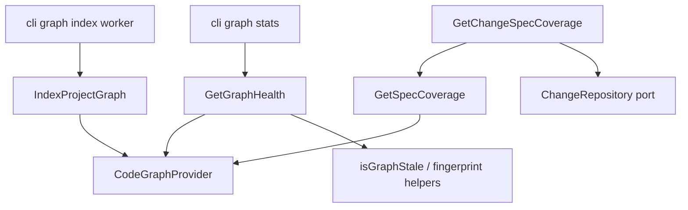

# Design: 10-code-graph-host-use-cases

## Non-goals

- `@specd/sdk` facade (`openSpecdHost`, `buildProjectStatusSnapshot`, `runIndexProjectGraph`) — change `11-sdk-host-facade`
- Full CLI/MCP migration to SDK — change `12-cli-mcp-sdk-migration`
- Use cases for `search`, `hotspots`, `impact`, `traversal` — remain direct `CodeGraphProvider` methods
- Moving worker subprocess or lock acquisition out of CLI
- Presenters/DTO layers for Studio/API
- Auto-indexing or background graph refresh
- Kernel wiring — code-graph use cases are package-level factories, not `kernel.*` entries

## Affected areas

| Symbol / file                    | Location                                                     | Change                                                                                     | Impact                                                            |
| -------------------------------- | ------------------------------------------------------------ | ------------------------------------------------------------------------------------------ | ----------------------------------------------------------------- |
| `registerGraphStats` action      | `packages/cli/src/commands/graph/stats.ts`                   | Replace inline staleness/fingerprint orchestration with `createGetGraphHealth().execute()` | **LOW** — 1 test file (`graph-stats.spec.ts`)                     |
| `registerGraphIndex` worker body | `packages/cli/src/commands/graph/index-graph.ts`             | Call `createIndexProjectGraph().execute()` instead of `provider.index()` directly          | **MEDIUM** — index tests, worker env paths                        |
| `loadGraphData`                  | `packages/cli/src/commands/project/status.ts`                | Optional refactor to `GetGraphHealth` (reduces duplication; same release OK)               | **LOW** — `project-status.spec.ts`                                |
| Package exports                  | `packages/code-graph/src/index.ts`                           | Export four use cases + factories + input/result types                                     | **MEDIUM** — public API surface; overlaps `13-public-api-surface` |
| `CodeGraphProvider`              | `packages/code-graph/src/composition/code-graph-provider.ts` | No signature changes — use cases call existing methods                                     | **LOW**                                                           |
| `application/index.ts`           | `packages/code-graph/src/application/index.ts`               | Export new use case classes                                                                | **LOW**                                                           |

Blast radius (graph impact): **MEDIUM** — 10 affected files; primary integration points are CLI graph commands and tests.

## New constructs

### `GetGraphHealthResult`

- **Location:** `packages/code-graph/src/application/use-cases/get-graph-health.ts`
- **Shape:**

```typescript
export interface GetGraphHealthInput {
  readonly config: SpecdConfig
  readonly provider: CodeGraphProvider
  readonly codeGraphVersion: string
  readonly workspaces?: WorkspaceIndexTarget[]
  readonly assertUnlocked?: boolean // default true
}

export interface GetGraphHealthResult extends GraphStatistics {
  readonly stale: boolean | null
  readonly currentRef: string | null
  readonly fingerprintMismatch: boolean | null
}

export class GetGraphHealth {
  async execute(input: GetGraphHealthInput): Promise<GetGraphHealthResult>
}
```

- **Responsibility:** Assemble statistics + diagnostics on an open provider.
- **Relationships:** Uses `createVcsAdapter` from `@specd/core`, `isGraphStale`, `parseFingerprintMap`, `detectFingerprintMismatch`, `buildProjectGraphConfig` from code-graph.

### `createGetGraphHealth`

- **Location:** `packages/code-graph/src/composition/use-cases/get-graph-health.ts`
- **Shape:** `export function createGetGraphHealth(): GetGraphHealth`
- **Responsibility:** Return stateless use case (no config capture).

### `IndexProjectGraph`

- **Location:** `packages/code-graph/src/application/use-cases/index-project-graph.ts`
- **Shape:**

```typescript
export interface IndexProjectGraphInput {
  readonly provider: CodeGraphProvider
  readonly projectRoot: string
  readonly workspaces: WorkspaceIndexTarget[]
  readonly graphConfig: ProjectGraphConfig
  readonly codeGraphVersion: string
  readonly vcsRef?: string
  readonly force?: boolean
  readonly onProgress?: IndexProgressCallback
}

export class IndexProjectGraph {
  async execute(input: IndexProjectGraphInput): Promise<IndexResult>
}
```

- **Responsibility:** Optional `recreate()` then `provider.index()` with caller-supplied options.
- **Relationships:** Application layer; no lock or workspace resolution.

### `createIndexProjectGraph`

- **Location:** `packages/code-graph/src/composition/use-cases/index-project-graph.ts`
- **Shape:** `export function createIndexProjectGraph(): IndexProjectGraph`

### `GetSpecCoverage`

- **Location:** `packages/code-graph/src/application/use-cases/get-spec-coverage.ts`
- **Shape:**

```typescript
export interface GetSpecCoverageInput {
  readonly provider: CodeGraphProvider
  readonly specId: string
}

export interface GetSpecCoverageResult {
  readonly specId: string
  readonly found: boolean
  readonly coveredFiles: Relation[]
  readonly coveredSymbols: Relation[]
  readonly fileCount: number
  readonly symbolCount: number
}

export class GetSpecCoverage {
  async execute(input: GetSpecCoverageInput): Promise<GetSpecCoverageResult>
}
```

### `createGetSpecCoverage`

- **Location:** `packages/code-graph/src/composition/use-cases/get-spec-coverage.ts`

### `GetChangeSpecCoverage`

- **Location:** `packages/code-graph/src/application/use-cases/get-change-spec-coverage.ts`
- **Shape:**

```typescript
export interface GetChangeSpecCoverageInput {
  readonly provider: CodeGraphProvider
  readonly changes: ChangeRepository
  readonly changeName: string
}

export interface GetChangeSpecCoverageResult {
  readonly changeName: string
  readonly specs: GetSpecCoverageResult[]
}

export class GetChangeSpecCoverage {
  constructor(getSpecCoverage: GetSpecCoverage) {}
  async execute(input: GetChangeSpecCoverageInput): Promise<GetChangeSpecCoverageResult>
}
```

- **Responsibility:** Load change by name; throw `ChangeNotFoundError` when missing; delegate per `specId`.
- **Relationships:** Depends on `ChangeRepository` port from `@specd/core` (read-only `get`).

### `createGetChangeSpecCoverage`

- **Location:** `packages/code-graph/src/composition/use-cases/get-change-spec-coverage.ts`
- **Shape:** `export function createGetChangeSpecCoverage(getSpecCoverage: GetSpecCoverage): GetChangeSpecCoverage`

### Tests

| File                                                                              | Coverage                                           |
| --------------------------------------------------------------------------------- | -------------------------------------------------- |
| `packages/code-graph/test/application/use-cases/get-graph-health.spec.ts`         | All `code-graph:get-graph-health` verify scenarios |
| `packages/code-graph/test/application/use-cases/index-project-graph.spec.ts`      | Force recreate, callback forwarding                |
| `packages/code-graph/test/application/use-cases/get-spec-coverage.spec.ts`        | Found/not-found paths                              |
| `packages/code-graph/test/application/use-cases/get-change-spec-coverage.spec.ts` | Ordering, `ChangeNotFoundError`, delegation        |

## Approach

### Code-graph application layer

1. Add four use case modules under `packages/code-graph/src/application/use-cases/`.
2. Add four composition factories under `packages/code-graph/src/composition/use-cases/`.
3. Export all public types and factories from `packages/code-graph/src/index.ts` and `application/index.ts`.

**`GetGraphHealth.execute` algorithm:**

1. If `assertUnlocked !== false`, call `input.provider.assertGraphIndexUnlocked()`.
2. `const stats = await input.provider.getStatistics()`.
3. Resolve `currentRef` via `createVcsAdapter(config.projectRoot).ref()` (catch → `null`).
4. `stale = isGraphStale(stats.lastIndexedRef, currentRef)`.
5. If `workspaces` provided and `stats.graphFingerprint !== null`, compute `fingerprintMismatch` via `detectFingerprintMismatch(parseFingerprintMap(...), codeGraphVersion, projectRoot, workspaces, buildProjectGraphConfig(config))`; else `null`.
6. Return `{ ...stats, stale, currentRef, fingerprintMismatch }`.

**`IndexProjectGraph.execute` algorithm:**

1. If `input.force`, `await provider.recreate()`.
2. `return provider.index({ projectRoot, workspaces, graphConfig, codeGraphVersion, vcsRef, onProgress })`.

**`GetSpecCoverage.execute` algorithm:**

1. `const spec = await provider.getSpec(specId)`; if undefined → empty result with `found: false`.
2. Load `coveredFiles` / `coveredSymbols`; compute unique target counts.

**`GetChangeSpecCoverage.execute` algorithm:**

1. `const change = await changes.get(changeName)`; if null throw `ChangeNotFoundError`.
2. Map `change.specIds` in order through `getSpecCoverage.execute`.

### CLI integration

**`graph stats` (`stats.ts`):**

1. Keep `resolveGraphCliContext`, lock check can move inside `GetGraphHealth` (remove duplicate `assertGraphIndexUnlocked` before `withProvider` OR pass `assertUnlocked: true` only inside use case — prefer single path inside use case after provider open).
2. Inside `withProvider` callback: build workspaces from kernel `listWorkspaces` when available.
3. `const health = await createGetGraphHealth().execute({ config, provider, codeGraphVersion, workspaces })`.
4. Format text/json/toon from `health` fields (existing output shape unchanged).

**`graph index` (`index-graph.ts`):**

1. Parent process: unchanged lock + worker spawn.
2. Worker `withProvider` callback: assemble workspaces/VCS/graphConfig as today.
3. Replace `provider.index(indexOptions)` with `createIndexProjectGraph().execute({ provider, projectRoot, workspaces, graphConfig, codeGraphVersion, vcsRef, force: opts.force, onProgress })`.
4. Keep `formatTextIndexResult` unchanged.

**`project status` (`status.ts`) — optional in this change:**

- Refactor `loadGraphData` to call `GetGraphHealth` when graph stats loaded — reduces duplicated staleness logic. If time-constrained, defer to `11-sdk-host-facade`.

### Documentation

Update `docs/` if a code-graph use-case reference exists; otherwise add brief entries under existing code-graph package docs describing the four host use cases and their CLI/SDK consumers.

## Key decisions

**Dedicated use-case specs vs extending composition only** → Four new specs (`get-graph-health`, etc.) mirroring `core:get-project-summary`. Keeps composition spec focused on provider/factory; enables targeted verify and SDK documentation.

**Alternatives rejected:** Embedding all requirements in `code-graph:composition` — harder to test and document independently.

**Provider lifecycle stays outside use cases** → Callers open/close provider. Use cases remain pure orchestration over an open connection.

**Alternatives rejected:** Use case opens provider — duplicates `withProvider` / SDK lifecycle and complicates testing.

**CLI retains worker subprocess** → Native graph-store threads isolation stays adapter concern.

**Alternatives rejected:** Moving spawn into code-graph — couples package to CLI process model.

## Trade-offs

- **[Overlap with 12-cli-mcp-sdk-migration]** → Archive G1 first; migration change becomes thin SDK wiring only.
- **[Overlap with 13-public-api-surface on composition exports]** → Coordinate export list; G1 adds host use case exports explicitly in composition delta.
- **[project status duplication if deferred]** → Acceptable short-term; SDK snapshot builder will unify in change 11.

## Spec impact

### `code-graph:composition`

- Direct dependents: `cli:graph-*`, `code-graph:staleness-detection`, new host use case specs
- Added host use case export requirement — dependents gain factories without provider API changes

### `code-graph:staleness-detection`

- Removed `cli:graph-stats` dependency — staleness primitives stay here; orchestration moves to `GetGraphHealth`
- `cli:graph-stats` still depends on both staleness-detection (policy reference) and get-graph-health (runtime)

### `cli:graph-stats` / `cli:graph-index`

- Behavioural change: delegate orchestration — output contracts unchanged per verify deltas

## Dependency map



```
┌─────────────────┐     ┌──────────────────┐
│ graph stats CLI │────▶│ GetGraphHealth   │
└─────────────────┘     └────────┬─────────┘
                                   │
┌─────────────────┐     ┌────────▼─────────┐
│ graph index CLI │────▶│ IndexProjectGraph│
│ (worker body)   │     └────────┬─────────┘
└─────────────────┘              │
                          ┌──────▼───────┐
                          │ CodeGraph    │
                          │ Provider     │
                          └──────────────┘

┌──────────────────────┐     ┌─────────────────┐
│ GetChangeSpecCoverage│────▶│ GetSpecCoverage │
└──────────┬───────────┘     └─────────────────┘
           │
           ▼
    ┌──────────────┐
    │ ChangeRepo   │
    │ (core port)  │
    └──────────────┘
```

## Migration / Rollback

Additive change — no data migration. Rollback: revert use cases and restore inline CLI orchestration. Graph store schema unchanged.

## Testing

### Automated

| Test file                          | Asserts                                                                             |
| ---------------------------------- | ----------------------------------------------------------------------------------- |
| `get-graph-health.spec.ts`         | Stale/fresh/null, lock assert, fingerprint mismatch, provider lifecycle not touched |
| `index-project-graph.spec.ts`      | `recreate` before index when `force`, callback passthrough                          |
| `get-spec-coverage.spec.ts`        | Found/not-found, counts                                                             |
| `get-change-spec-coverage.spec.ts` | Spec order, `ChangeNotFoundError`, mock delegation                                  |
| `graph-stats.spec.ts` (update)     | Mocks `GetGraphHealth` or spies factory; output shape unchanged                     |
| `graph-index` tests (update)       | Worker path still spawns; index body uses `IndexProjectGraph`                       |

### Manual / E2E

```bash
node packages/cli/dist/index.js graph stats --format toon
node packages/cli/dist/index.js graph index --format text
node packages/cli/dist/index.js graph stats --format text  # after index — no staleness warning when clean
```

Expect same output shapes as before change. Lock contention: run `graph index` in one terminal, `graph stats` in another → exit 3 with retry message.

### Lint / docs

- Follow `default:_global/testing` — Vitest, mocked ports for unit tests
- JSDoc on all exported classes, interfaces, factories per `default:_global/docs`
- Layer boundaries: use cases in application; no fs I/O except via injected provider/core adapters

## Open questions

_none_
