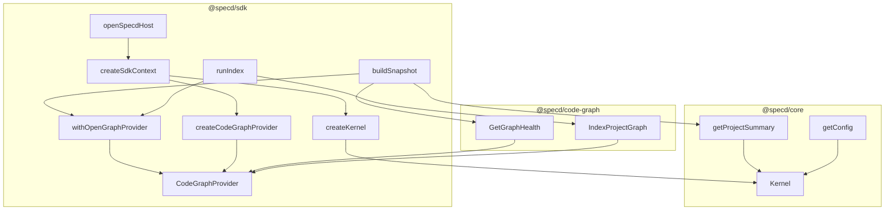

# Design: 11-sdk-host-facade

## Non-goals

- CLI/MCP migration to `@specd/sdk` (change `12-cli-mcp-sdk-migration`)
- Public barrel curation of `@specd/core` / `@specd/code-graph` (change `13-public-api-surface`)
- API/IPC presenters and DTOs
- Graph index subprocess lock inside SDK (`acquireGraphIndexLock` stays CLI `beforeOpen`)
- `getChangeSpecCoverage` orchestration (lives in `@specd/code-graph`)

## Affected areas

| Area                        | Change                 | Impact                                            |
| --------------------------- | ---------------------- | ------------------------------------------------- |
| `specd.yaml`                | `sdk` workspace added  | Done — `specs/sdk`, `packages/sdk`                |
| `packages/sdk/package.json` | deps, scripts, exports | Extend placeholder; add test script               |
| `packages/sdk/src/index.ts` | public barrel          | Replace `SDK_VERSION`-only stub with full exports |
| `core:composition` spec     | one added requirement  | Documents SDK as preferred host bootstrap         |
| `core:kernel` spec          | no-op                  | SDK consumes existing kernel unchanged            |

**Unchanged in A2a (migration in change 12):**

| Symbol              | Location                                           | Callers          | Risk                       |
| ------------------- | -------------------------------------------------- | ---------------- | -------------------------- |
| `resolveCliContext` | `packages/cli/src/helpers/cli-context.ts`          | 40+ CLI commands | HIGH — not modified here   |
| `withProvider`      | `packages/cli/src/commands/graph/with-provider.ts` | graph commands   | MEDIUM — not modified here |
| `loadGraphData`     | `packages/cli/src/commands/project/status.ts`      | project status   | MEDIUM — not modified here |

Blast radius of new SDK code: **LOW** — greenfield package; no existing callers until change 12.

## New constructs

### `packages/sdk/src/composition/host-context.ts`

```typescript
export interface SdkHostContext {
  readonly kernel: Kernel
  readonly createGraphProvider: () => CodeGraphProvider
}

export interface OpenSpecdHostInput {
  readonly configPath?: string
  readonly kernelOptions?: KernelOptions
}

export interface OpenSpecdHostResult extends SdkHostContext {
  readonly config: SpecdConfig
  readonly configFilePath: string | null
}

export async function createSdkContext(
  config: SpecdConfig,
  options?: KernelOptions,
): Promise<SdkHostContext>

export async function openSpecdHost(input?: OpenSpecdHostInput): Promise<OpenSpecdHostResult>
```

**Responsibility:** Load config once, build kernel, bind graph provider factory to same config. No config writes.

### `packages/sdk/src/composition/with-open-graph-provider.ts`

```typescript
export interface WithOpenGraphProviderOptions {
  readonly beforeOpen?: (provider: CodeGraphProvider) => Promise<void>
}

export async function withOpenGraphProvider<T>(
  ctx: SdkHostContext,
  fn: (provider: CodeGraphProvider) => Promise<T>,
  options?: WithOpenGraphProviderOptions,
): Promise<T>
```

**Responsibility:** Open/close lifecycle only. No `process.exit`, no signal handlers.

### `packages/sdk/src/orchestration/build-project-status-snapshot.ts`

```typescript
export interface BuildProjectStatusSnapshotOptions {
  readonly includeGraph?: boolean
  readonly includeHotspots?: boolean
}

export interface BuildProjectStatusSnapshotResult {
  readonly summary: GetProjectSummaryResult
  readonly graphHealth: GetGraphHealthResult | null
  readonly approvals: { readonly specEnabled: boolean; readonly signoffEnabled: boolean }
  readonly llmOptimizedContext: boolean
  readonly hotspots?: HotspotResult | null
}

export async function buildProjectStatusSnapshot(
  ctx: SdkHostContext,
  options?: BuildProjectStatusSnapshotOptions,
): Promise<BuildProjectStatusSnapshotResult>
```

**Responsibility:** Merge `GetProjectSummary` + optional `GetGraphHealth`/`getHotspots`. Returns data, not formatted strings.

### `packages/sdk/src/orchestration/run-index-project-graph.ts`

```typescript
export interface RunIndexProjectGraphInput {
  readonly force?: boolean
  readonly workspaces?: readonly string[]
  readonly onProgress?: IndexProgressCallback
  readonly beforeOpen?: (provider: CodeGraphProvider) => Promise<void>
}

export type RunIndexProjectGraphResult = IndexProjectGraphResult

export async function runIndexProjectGraph(
  ctx: SdkHostContext,
  input: RunIndexProjectGraphInput,
): Promise<RunIndexProjectGraphResult>
```

**Responsibility:** Wire `listWorkspaces` → `IndexProjectGraph` inside `withOpenGraphProvider`. Forward `beforeOpen` for CLI lock.

### `packages/sdk/src/index.ts`

Re-export all public symbols per `sdk:composition` spec plus `SDK_VERSION`.

### Tests (new)

| File                                                                    | Covers                                                         |
| ----------------------------------------------------------------------- | -------------------------------------------------------------- |
| `packages/sdk/test/composition/host-context.spec.ts`                    | `createSdkContext`, `openSpecdHost`, forced `configPath`       |
| `packages/sdk/test/composition/with-open-graph-provider.spec.ts`        | open/close, error propagation, `beforeOpen`, no `process.exit` |
| `packages/sdk/test/orchestration/build-project-status-snapshot.spec.ts` | with/without graph, hotspots, graph unavailable                |
| `packages/sdk/test/orchestration/run-index-project-graph.spec.ts`       | full workspace index, workspace filter, progress passthrough   |
| `packages/sdk/test/barrel.spec.ts`                                      | `SDK_VERSION`, public exports, no internal re-exports          |

## Approach

### Phase 1 — Package scaffold (partially done)

1. `specd.yaml` sdk workspace ✓
2. `packages/sdk/package.json` with `@specd/core`, `@specd/code-graph`, vitest, tsup, eslint
3. Mirror `packages/code-graph/tsconfig.json` layout

### Phase 2 — Host context

1. Implement `createSdkContext`:
   - `await createKernel(config, options)`
   - `createGraphProvider: () => createCodeGraphProvider(config)`
2. Implement `openSpecdHost`:
   - `createConfigLoader()` with `{ configPath }` or discovery
   - `loader.load()` + resolve `configFilePath` (mirror CLI `loadConfig` / `resolveConfigPath` logic without CLI logging)
   - `await createSdkContext(config, input.kernelOptions)`

Config reads after bootstrap: `ctx.kernel.project.getConfig.execute()` — never cache config separately on context.

### Phase 3 — Graph lifecycle

1. `withOpenGraphProvider`: try/finally open/close
2. On `fn` throw: attempt close, rethrow original error
3. Optional `beforeOpen` before `open()`

### Phase 4 — Orchestration

1. `buildProjectStatusSnapshot`:
   - Always: `getProjectSummary`, `getConfig` for approvals/llm flag
   - If `includeGraph`: `withOpenGraphProvider` → `createGetGraphHealth().execute({ config, provider, codeGraphVersion, workspaces, assertUnlocked: false })`
   - If `includeHotspots`: call `provider.getHotspots()` inside same provider session; on graph errors return `graphHealth: null` without throwing
2. `runIndexProjectGraph`:
   - `getConfig`, `listWorkspaces`
   - `withOpenGraphProvider(ctx, fn, { beforeOpen: input.beforeOpen })`
   - `createIndexProjectGraph().execute({ provider, projectRoot, workspaces, graphConfig, codeGraphVersion, force, vcsRef, onProgress })`

### Phase 5 — Barrel + docs

1. Wire `src/index.ts` exports
2. Add `docs/core/sdk.md` — public API overview for `@specd/sdk` (host bootstrap, orchestration table)
3. JSDoc on all exported functions per `default:_global/docs`

### Approval gates

SDK does not wrap `approveSpec` / `approveSignoff`. Hosts call `kernel.changes.approveSpec.execute({ name, reason })` — gate flags baked at kernel construction (archived change 09).

## Key decisions

**Separate specs per SDK capability** → user direction; enables focused verify and independent evolution.

**No duplicate `config` on `SdkHostContext`** → `getConfig` is single source of truth; prevents drift vs graph provider config.

**`withOpenGraphProvider` without `process.exit`** → CLI LadybugDB exit semantics stay in CLI adapter; SDK usable from long-lived API/MCP processes.

**Re-exports in A2a are minimal** → full public-surface curation deferred to A3; SDK re-exports only what hosts need for bootstrap.

**Alternatives rejected:**

- Single monolithic `sdk:host-facade` spec → harder to verify and navigate
- SDK wrapping `createConfigWriter` → violates config mutation boundary; writers stay on core port

## Trade-offs

| Risk                                                     | Mitigation                                                            |
| -------------------------------------------------------- | --------------------------------------------------------------------- |
| Duplication with CLI `resolveCliContext` until change 12 | Change 12 replaces CLI helper with thin `openSpecdHost` wrapper       |
| `openSpecdHost` config path resolution diverges from CLI | Extract shared path resolution or add integration test comparing both |
| Overlap `core:composition` with change 13                | Archive order: 11 before 13; reconcile deltas if needed               |

## Spec impact

### `core:composition`

- Direct dependents: many core specs via `createKernel` factories
- Added requirement is guidance only — no API breakage
- `13-public-api-surface` also modifies composition — overlap warning at scope edit

### `core:kernel`

- No-op delta — SDK uses existing `Kernel` interface
- Dependents unaffected

## Dependency map



```
┌─────────────────┐     ┌──────────────────┐
│  openSpecdHost  │────▶│ createSdkContext │
└─────────────────┘     └────────┬─────────┘
                                 │
              ┌──────────────────┼──────────────────┐
              ▼                  ▼                  ▼
       ┌────────────┐    ┌─────────────┐   ┌─────────────────────┐
       │createKernel│    │createGraph  │   │ kernel.project      │
       │  (core)    │    │Provider fn  │   │ .getConfig          │
       └────────────┘    └──────┬──────┘   └─────────────────────┘
                                │
                                ▼
                    ┌───────────────────────┐
                    │ withOpenGraphProvider │
                    └───────────┬───────────┘
                                │
              ┌─────────────────┴─────────────────┐
              ▼                                   ▼
   ┌────────────────────────┐        ┌───────────────────────┐
   │buildProjectStatusSnapshot│        │ runIndexProjectGraph  │
   └────────────────────────┘        └───────────────────────┘
```

## Testing

### Automated

| Spec scenario                                     | Test file                               |
| ------------------------------------------------- | --------------------------------------- |
| host-context: same config for kernel/provider     | `host-context.spec.ts`                  |
| host-context: openSpecdHost discovery/forced path | `host-context.spec.ts`                  |
| with-open-graph-provider: open/close/finally      | `with-open-graph-provider.spec.ts`      |
| with-open-graph-provider: error preservation      | `with-open-graph-provider.spec.ts`      |
| build-project-status-snapshot: graph on/off       | `build-project-status-snapshot.spec.ts` |
| run-index-project-graph: workspace filter         | `run-index-project-graph.spec.ts`       |

Use mocked `Kernel` / `CodeGraphProvider` in unit tests — no fs/network per `default:_global/testing`.

### Manual

```bash
pnpm --filter @specd/sdk build
pnpm --filter @specd/sdk test
node -e "import('@specd/sdk').then(m => console.log(m.SDK_VERSION, Object.keys(m).sort()))"
```

Expect exports: `openSpecdHost`, `createSdkContext`, `withOpenGraphProvider`, `buildProjectStatusSnapshot`, `runIndexProjectGraph`, `createConfigLoader`, `createConfigWriter`, `createKernel`.

## Documentation

Add `docs/core/sdk.md` covering:

- When to use `@specd/sdk` vs `@specd/core` directly
- Bootstrap flow (`openSpecdHost`)
- Orchestration helpers table
- Config read (`getConfig`) vs write (`createConfigWriter`) boundary

## Open questions

_none_
