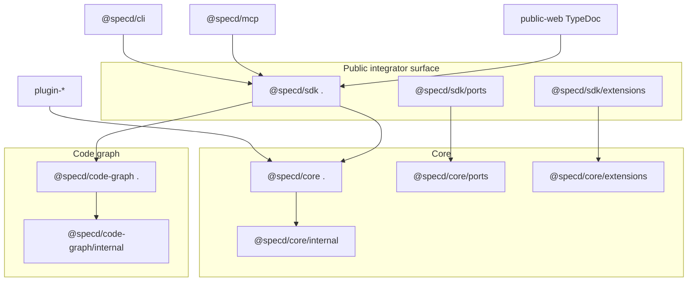

# Design: 13-public-api-surface

## Non-goals

- Studio/API/IPC host migration — imports and Studio-only APIs deferred until after `feat-user-interface` merge.
- Registry dispatch for adapter ids other than `'fs'` in `create*Repository` — follow-up; A3 exports factories with only `'fs'` wired.

## Affected areas

### `@specd/core`

- `packages/core/src/index.ts` — becomes **internal** full barrel (`export *` from `domain/`, `application/`, `composition/`). Mapped to `"./internal"` only.
- `packages/core/src/public.ts` — **new** curated `"."` export. Explicit named exports only; no `export *`.
- `packages/core/src/ports.ts` — **new** `"./ports"` export. Port interfaces/abstract classes and associated config/result types.
- `packages/core/src/extensions.ts` — **new** `"./extensions"` export. Storage factories, `KernelRegistryInput`/`View`, `KernelBuilder`, providers, `RegistryConflictError`.
- `packages/core/package.json` — `exports` map for `"."`, `"./ports"`, `"./extensions"`, `"./internal"`; `build`/`dev` scripts compile all four entry files via tsup.
- `packages/core/test/composition/config-mutation-exports.spec.ts` — imports from `@specd/core/internal` if it needs full-barrel symbols. Risk: LOW (1 direct dependent per graph impact).
- Monorepo packages importing **concrete adapters** (`Fs*`, `GitVcsAdapter`, `kernel-internals`) — retarget `@specd/core/internal`:
  - `packages/code-graph/**` tests that import adapter types or internals
  - `packages/core/test/**` — `@specd/core/internal` for infra-only symbols
  - `createX` and `create*Repository` **stay** on `"."` — no retarget for factories

**Symbol impact (HIGH fan-in, LOW change risk):** `createKernel`, `Kernel`, `SpecdConfig` remain on `"."`. Callers (CLI via SDK, plugins) unchanged for their current symbols.

### `@specd/code-graph`

- `packages/code-graph/src/index.ts` — becomes **internal** full barrel (current content + unrestricted exports).
- `packages/code-graph/src/public.ts` — **new** curated `"."` export per `code-graph:composition` **Package exports** list.
- `packages/code-graph/package.json` — `exports` for `"."` and `"./internal"`; tsup multi-entry build.
- `packages/code-graph/test/barrel.spec.ts` — import `CODE_GRAPH_VERSION` from `"."`; add negative assertion `InMemoryIndexSession` absent from `"."`.
- `packages/code-graph/test/**` — tests importing `InMemoryIndexSession` or store adapters switch to `@specd/code-graph/internal`.
- `packages/sdk/src/index.ts` — re-export from `@specd/code-graph` `"."` only (not internal).

### `@specd/sdk`

- `packages/sdk/src/index.ts` — remove `export * from '@specd/core'`; explicit re-exports from `@specd/core` `"."`, `@specd/code-graph` `"."`, SDK composition/orchestration, and version helpers.
- `packages/sdk/src/ports.ts` — **new** `export * from '@specd/core/ports'`.
- `packages/sdk/src/extensions.ts` — **new** `export * from '@specd/core/extensions'`.
- `packages/sdk/package.json` — `exports` for `"."`, `"./ports"`, `"./extensions"`; tsup multi-entry.
- `packages/sdk/test/barrel.spec.ts` — extend: no `export *` in source (static read); subpath smoke tests; CLI floor symbol checklist.
- `packages/sdk/test/composition/package-boundary.spec.ts` — update if it asserts barrel shape.

### Documentation

- `docs/sdk/` — **only** integrator entry; all host examples use `@specd/sdk`; explicit no mixed core+code-graph imports.
- `docs/core/*`, `docs/code-graph/*` — package reference for plugins/semantics; index callouts redirect hosts to `docs/sdk/`.

### Public web / API reference

- `apps/public-web/src/lib/public-docs-config.ts` — `apiPackageEntryPoints` for `@specd/sdk`, `@specd/core`, `@specd/code-graph` in that order.
- `apps/public-web/scripts/generate-api-docs.mjs` — one TypeDoc run per package; output under `.generated/api/{sdk,core,code-graph}`; strip inherited `node_modules` members; MDX brace sanitization.
- `apps/public-web/api-sidebars.ts` — package-first sidebar (`@specd/sdk` → `@specd/core` → `@specd/code-graph`), then symbol kind within each package.
- `apps/public-web/tsconfig.typedoc.json` — path aliases to `packages/*/src/public.ts` (and SDK index) so `Defined in` links target source, not bundled `dist` chunks.
- `apps/public-web/typedoc.json` — `gitRevision: main` so GitHub source links work without a local unpushed commit.
- `apps/public-web/test/lib/api-generation.spec.ts`, `public-docs-config.spec.ts`, `sidebar-config.spec.ts` — multi-package entrypoints, sidebar order, `main` branch links.

### Unchanged (verify only)

- `packages/cli/package.json` — already `@specd/sdk` only; compile gate.
- `packages/mcp/package.json` — already `@specd/sdk`.
- `packages/plugin-*`, `packages/plugin-manager`, `packages/skills` — keep `@specd/core` for `SpecdConfig` / errors on `"."`.

## New constructs

### `packages/core/src/public.ts`

- **Location:** `packages/core/src/public.ts`
- **Shape:** Named exports only. Groups:
  1. **Bootstrap:** `createKernel`, `createConfigLoader`, `createConfigWriter`, `createVcsAdapter`, `createVcsActorResolver`, `Kernel`, `KernelOptions`, `SpecdConfig`, `CORE_VERSION`, `Logger` types/helpers.
  2. **Kernel-equivalent use cases:** For each property on `Kernel.changes`, `Kernel.specs`, `Kernel.project` — use-case type, `*Input`/`*Result`, and `createX` from `composition/use-cases/`.
  3. **Repository factories:** `createSpecRepository`, `createChangeRepository`, `createArchiveRepository`, `createSchemaRepository`, `createSchemaRegistry`, plus public option types (`FsSpecRepositoryOptions`, etc.). First arg = adapter id (`'fs'` today; extensible).
  4. **Port types on Kernel:** `ChangeRepository`, `SpecRepository`, `SchemaRegistry` as `export type`.
  5. **Domain entities** and **Errors** as before.
- **Responsibility:** Full kernel-equivalent surface without requiring `createKernel`. Curated — no `export *`, no concrete adapters.

### `packages/core/src/ports.ts`

- **Location:** `packages/core/src/ports.ts`
- **Shape:** Re-export from `application/ports/` (and domain port abstract classes): `Repository`, `ChangeRepository`, `SpecRepository`, `ArchiveRepository`, `SchemaRepository`, `ActorResolver`, `VcsAdapter`, `HookRunner`, `ConfigLoader`, `ConfigWriter`, `FileReader`, artifact-parser ports, logging port interfaces, associated `*Config`/`*Result` types. No `Fs*` implementations.
- **Responsibility:** Compile-time contracts for custom storage and plugin authors.
- **Relationships:** Re-exported by `@specd/sdk/ports`.

### `packages/core/src/extensions.ts`

- **Location:** `packages/core/src/extensions.ts`
- **Shape:** `SpecStorageFactory`, `ChangeStorageFactory`, `ArchiveStorageFactory`, `SchemaStorageFactory`, `KernelRegistryInput`, `KernelRegistryView`, `KernelBuilder`, `createKernelBuilder`, `ActorProvider`, `VcsProvider`, `ExternalHookRunner`, `RegistryConflictError`.
- **Responsibility:** Registration contracts for future custom storage; no builtin `FS_*` markers.
- **Relationships:** Re-exported by `@specd/sdk/extensions`. Used by `kernel-builder.spec.ts` patterns.

### `packages/code-graph/src/public.ts`

- **Location:** `packages/code-graph/src/public.ts`
- **Shape:** Explicit list matching `code-graph:composition` **Package exports** requirement (composition, host use cases, VCS/config, locks, indexer public types, traversal/impact/hotspots/search, staleness/fingerprint, model vocabulary, errors, `CODE_GRAPH_VERSION`). Excludes `InMemoryIndexSession`, `IndexSession`, `RegisterFileInput`, `RegisterAnalysisInput`, store adapter classes.
- **Responsibility:** Public graph API for SDK re-export and graph-only libraries.
- **Relationships:** SDK `"."` imports from here; CLI never imports `@specd/code-graph` directly.

### `packages/sdk/src/ports.ts` and `packages/sdk/src/extensions.ts`

- **Shape:** `export * from '@specd/core/ports'` and `export * from '@specd/core/extensions'` respectively.
- **Responsibility:** Single-dependency ergonomics for hosts implementing custom storage.

## Approach

### Phase 1 — Core barrels

1. Rename current `index.ts` content to internal barrel (keep `export *` + `CORE_VERSION`).
2. Add `public.ts` — explicit exports from `composition/use-cases/index.ts` (all `createX`), repository factories from `composition/*-repository.ts` and `schema-registry.ts`, plus bootstrap and domain/errors. Audit against `Kernel` interface.
3. Add `ports.ts` and `extensions.ts` as thin re-export modules from existing composition/application locations.
4. Update `package.json` exports and tsup config: `tsup src/public.ts src/ports.ts src/extensions.ts src/index.ts --format esm --dts --clean`.
5. Add `packages/core/test/barrel.spec.ts`:
   - `FsConfigLoader`, `FsSpecRepository` not in `"."`
   - `createKernel`, `createGetStatus`, `createArchiveChange`, `createSpecRepository` in `"."`
   - `createSpecRepository('fs', …)` returns `SpecRepository` without `createKernel`
   - `ChangeRepository` type from `./ports`; `ChangeStorageFactory` from `./extensions`
6. Fix monorepo imports: only symbols removed from `"."` (concrete adapters, `GitVcsAdapter`, etc.) → `@specd/core/internal`.

### Phase 2 — Code-graph barrels

1. Move current `index.ts` to internal barrel.
2. Create `public.ts` with curated list (mirror existing named exports minus internal-only symbols).
3. Update `package.json` exports and tsup.
4. Extend `barrel.spec.ts` with internal-only negative tests.
5. Update tests importing `InMemoryIndexSession` → `@specd/code-graph/internal`.

### Phase 3 — SDK barrels

1. Replace `export * from '@specd/core'` with explicit re-exports from `@specd/core` public entry (import from `@specd/core` package root after core phase completes).
2. Align code-graph re-exports with `@specd/code-graph` `"."` only; keep existing CLI floor symbols (78-symbol checklist from change exploration).
3. Add `ports.ts`, `extensions.ts`, update `package.json` and tsup.
4. Extend `barrel.spec.ts`: static assertion that `index.ts` does not contain `export * from '@specd/core'`; subpath import tests for `ports` and `extensions`.

### Phase 4 — Docs and public site

1. Create `docs/sdk/` (index + `_category_.json`); migrate from `docs/core/sdk.md`; document single-import rule for hosts.
2. Add host callouts to `docs/core/index.md` and `docs/code-graph/index.md` pointing to `docs/sdk/`.
3. Relabel sidebar: **SDK** (integrators) before **Core** / **Code graph** (package reference).
4. Sweep `docs/core/*`: plugin/core-only labels on `@specd/core` examples; no host mixed-import patterns.
5. Update TypeDoc entry, landing, api-generation tests.

### Phase 5 — Compile gate

1. `pnpm --filter @specd/core test`
2. `pnpm --filter @specd/code-graph test`
3. `pnpm --filter @specd/sdk test`
4. `pnpm --filter @specd/cli test` — primary gate
5. `pnpm --filter @specd/public-web test` — API generation

**Export list maintenance:** Add a dev script or test that diffs `Kernel` interface properties against `public.ts` exports to catch drift (optional but recommended in tasks).

## Key decisions

**Decision:** Four core entry points (`"."`, `./ports`, `./extensions`, `./internal`) instead of single barrel with documentation-only policy.

**Rationale:** Enforced at package boundary; TypeScript and bundlers reject illegal imports.

**Alternatives rejected:** JSDoc `@internal` only — not enforced at compile time.

---

**Decision:** Kernel-equivalent assembly without kernel — every kernel-mounted capability has public `createX` or `create*Repository` on `"."`.

**Rationale:** Integrators may need only a repo or single use case; `createSpecRepository('fs')` today, `createSpecRepository('db')` after plugin registration tomorrow. `createKernel` remains recommended for full hosts.

**Alternatives rejected:** Kernel-only public API — blocks repo-only and partial assembly integrators.

---

**Decision:** Repository factories public; concrete adapters internal. Adapter id as first arg; registry dispatch for non-`fs` ids deferred to follow-up.

**Rationale:** Factory is stable dispatch surface; `DbSpecRepository` stays behind `SpecStorageFactory` registration.

---

**Decision:** `code-graph` splits `public.ts` + `index.ts` (internal) mirroring core pattern.

**Rationale:** Consistent mental model; SDK imports only public graph surface.

---

**Decision:** TypeDoc entry `packages/sdk/src/index.ts`.

**Rationale:** Host integrators use SDK; documents composed surface including graph orchestration.

**Alternatives rejected:** Multi-package TypeDoc pass — deferred; single SDK pass sufficient for A3.

---

**Decision:** `./internal` for concrete adapters, `kernel-internals`, and `FS_*` markers only — not for `createX` / `create*Repository`.

**Rationale:** Factories are integrator API; infra classes are not.

## Trade-offs

**[Risk] Export list drift when Kernel gains use cases** → Mitigation: kernel-interface export audit test; update `public.ts` in same PR as kernel changes.

**[Risk] Missed monorepo import after narrowing `"."`** → Mitigation: `pnpm build` at root; grep for failing symbols; core/code-graph/sdk tests first.

**[Risk] TypeDoc noise from `export type` vs `export class`** → Mitigation: prefer `export type` for use-case classes on public barrel where instances come only from kernel.

**[Risk] Breaking external consumers importing adapters from `@specd/core`** → Mitigation: documented migration to `/internal` for advanced use; semver minor/major per release policy.

## Spec impact

### `default:_global/architecture`

- Direct dependents: `core:composition`, `code-graph:composition`, `sdk:composition`, most package specs referencing import rules.
- All satisfied by barrel split; no additional spec deltas required.

### `core:composition`

- Direct dependents: `sdk:composition`, `core:kernel`, many core specs.
- Kernel/export requirements aligned; `core:kernel` unchanged (Kernel shape already spec'd).

### `sdk:composition`

- Direct dependents: `public-web:api-reference` (added dep in this change).
- `public-web:api-reference` delta already updates TypeDoc scope to SDK.

### `default:_global/docs` / `public-web:api-reference`

- No further dependent specs require deltas.

### `09-core-approval-gates-baked` overlap

- If active change also touches `core:composition`, reconcile before archive — implementation should merge export lists, not duplicate conflicting requirements.

## Dependency map



```
┌─────────────┐     ┌─────────────┐
│  @specd/cli │────▶│ @specd/sdk  │
└─────────────┘     │     "."     │
┌─────────────┐     └──────┬──────┘
│ @specd/mcp  │────────────┘
└─────────────┘            │
         ┌─────────────────┼─────────────────┐
         ▼                 ▼                 ▼
  ┌─────────────┐   ┌─────────────┐   ┌──────────────┐
  │@specd/core  │   │@specd/code- │   │ SDK orch/    │
  │    "."      │   │ graph "."   │   │ composition  │
  └──────┬──────┘   └──────┬──────┘   └──────────────┘
         │                 │
         ▼                 ▼
  ┌─────────────┐   ┌─────────────┐
  │ core        │   │ code-graph  │
  │ /internal   │   │ /internal   │
  └─────────────┘   └─────────────┘

┌──────────────┐
│ plugin-*     │───▶ @specd/core "."  (SpecdConfig, errors)
└──────────────┘

┌──────────────┐
│ public-web   │───▶ packages/sdk/src/index.ts (TypeDoc)
└──────────────┘
```

## Migration / Rollback

**Deploy:** Publish `@specd/core`, `@specd/code-graph`, `@specd/sdk` together (workspace versions lockstep). No runtime migration — compile-time only.

**Integrator migration:**

| Before                                               | After                                                                       |
| ---------------------------------------------------- | --------------------------------------------------------------------------- |
| `import { FsConfigLoader } from '@specd/core'`       | `@specd/core/internal` or `createConfigLoader`                              |
| `import { createGetStatus } from '@specd/core'`      | **unchanged** — stays on `"."`; or `createKernel` + `kernel.changes.status` |
| `import { createSpecRepository } from '@specd/core'` | **unchanged** — stays on `"."`                                              |
| `import { FsSpecRepository } from '@specd/core'`     | `@specd/core/internal`                                                      |
| Host: `@specd/core` + `@specd/code-graph`            | `@specd/sdk` only                                                           |
| TypeDoc consumers reading core index                 | SDK index                                                                   |

**Rollback:** Revert package exports to single `"."` barrel on all three packages; restore `export *` in SDK. Docs revert in same commit.

## Testing

### Automated

| Verify scenario                                                     | Test location                                                                  |
| ------------------------------------------------------------------- | ------------------------------------------------------------------------------ |
| FsConfigLoader / FsSpecRepository not on `"."`                      | `packages/core/test/barrel.spec.ts`                                            |
| createArchiveChange, createGetStatus, createSpecRepository on `"."` | `packages/core/test/barrel.spec.ts`                                            |
| createGetStatus works without createKernel                          | `packages/core/test/barrel.spec.ts`                                            |
| createSpecRepository('fs') without kernel                           | `packages/core/test/barrel.spec.ts`                                            |
| GetStatus types on `"."`                                            | `packages/core/test/barrel.spec.ts`                                            |
| ChangeStorageFactory on extensions                                  | `packages/core/test/barrel.spec.ts`                                            |
| FS\_\* not on extensions                                            | `packages/core/test/barrel.spec.ts`                                            |
| code-graph exports map                                              | `packages/code-graph/test/barrel.spec.ts`                                      |
| InMemoryIndexSession internal only                                  | `packages/code-graph/test/barrel.spec.ts`                                      |
| SDK no `export *` from core                                         | `packages/sdk/test/barrel.spec.ts` (read source)                               |
| SDK re-exports createGetStatus, createSpecRepository                | `packages/sdk/test/barrel.spec.ts`                                             |
| SDK ports re-export                                                 | `packages/sdk/test/ports.spec.ts` or barrel subpath test                       |
| CLI sdk-only deps                                                   | `packages/sdk/test/composition/package-boundary.spec.ts` or dedicated dep test |
| sdk.md import policy                                                | Manual doc review + optional markdown assert test                              |
| use-cases kernel examples                                           | Manual doc review                                                              |
| TypeDoc SDK entry                                                   | `apps/public-web/test/lib/public-docs-config.spec.ts`                          |
| Generated API titles SDK                                            | `apps/public-web/test/lib/api-generation.spec.ts`                              |

**Additional tests:**

- `packages/core/test/barrel-kernel-coverage.spec.ts` (optional) — parse `Kernel` interface vs `public.ts` exports.
- Full suite: `pnpm --filter @specd/cli test` as integration gate.

### Manual / E2E

1. `pnpm --filter @specd/sdk build && pnpm --filter @specd/cli build`
2. `node packages/cli/dist/index.js project status --format text` — succeeds
3. `cd apps/public-web && pnpm test` — api-generation passes
4. Open generated `.generated/api` index — heading references `@specd/sdk`

**Lint:** `eslint` on changed packages per `default:_global/eslint`.

**JSDoc:** Public entry symbols need package-level JSDoc on re-exported bootstrap functions per `default:_global/docs`.

## Open questions

_none — see Resolved decisions in proposal._
