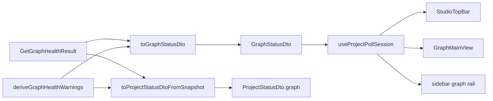

# Design: studio-graph-health-warnings

## Non-goals

- Changing `GetGraphHealth` use case or CLI `warnGraphStale` stderr behaviour
- Adding warnings to bottom Problems panel or change Overview workflow blockers
- New `studio-desktop` IPC specs (IPC inherits client DTO parity)
- Playwright notification E2E in v1 (optional follow-up)
- Zustand/Redux (deferred; v1 uses module session store like `use-studio-panel.ts`)

## Affected areas

- `packages/api/src/delivery/http/dto/graph-status.ts` — extend `GraphStatusDto` type
  - Change: add `currentRef`, `fingerprintMismatch`, `warnings`
  - Risk: LOW — API boundary type only

- `packages/api/src/delivery/http/dto/project-status.ts` — extend `ProjectGraphSummaryDto` / `ProjectStatusDto`
  - Change: align graph slice with `GraphStatusDto` diagnostics
  - Risk: LOW

- `packages/api/src/delivery/http/presenters/presenter-graph.ts` — `toGraphStatusDto`
  - Change: accept `GetGraphHealthResult`; derive `warnings[]`
  - Callers: `handler-graph.ts` graph status route
  - Risk: MEDIUM — central formatter

- `packages/api/src/delivery/http/presenters/presenter-project.ts` — `toProjectStatusDtoFromSnapshot`
  - Change: already maps `fingerprintMismatch`; add `currentRef`, `warnings[]` via shared helper
  - Risk: LOW

- `packages/api/src/delivery/http/openapi-schemas.ts` — graph + project status schemas
  - Change: document new fields
  - Risk: LOW

- `packages/api/src/delivery/http/handlers/handler-graph.ts` — `GET /graph/status`
  - Change: pass full health result to presenter
  - Risk: LOW

- `packages/client/src/dto/graph-status.ts`, `packages/client/src/dto/project-status.ts`
  - Change: mirror API types
  - Risk: LOW — UI + IPC consumers

- `apps/specd-studio-desktop/src/main/ipc-handlers.ts` — project/graph status presenters
  - Change: map new fields when serializing IPC responses (reuse presenter logic or shared helper)
  - Risk: MEDIUM — desktop parity

- `packages/ui/src/hooks/project-poll-session.ts` (new) — module session store
  - Change: `publishProjectPollSession` / `useProjectPollSession` via `useSyncExternalStore`
  - Risk: LOW — mirrors studio output pattern

- `packages/ui/src/hooks/use-project-poll.ts` — single writer
  - Change: publish snapshot after each fetch; export session hook
  - Risk: LOW

- `packages/ui/src/shell/ShellLayout.tsx` — remove chrome `useGraphStatus`
  - Change: `graphStale` from `useProjectPollSession().projectStatus?.graph?.stale`
  - Risk: LOW

- `packages/ui/src/shell/StudioTopBar.tsx` — notifications popover + badge
  - Change: read `projectStatus` from session hook (props optional during migration)
  - Risk: LOW

- `packages/ui/src/shell/GraphMainView.tsx` — Index Status card
  - Change: read `projectStatus.graph` from session store; hotspots still use `getHotspots`
  - Risk: LOW

## New constructs

- **Location:** `packages/api/src/delivery/http/presenters/graph-health-warnings.ts` (new)
- **Shape:**

```ts
export type GraphHealthWarningDto = { readonly type: string; readonly message: string }

export function deriveGraphHealthWarnings(input: {
  readonly stale: boolean | null
  readonly fingerprintMismatch: boolean | null
  readonly lastIndexedRef?: string | null
  readonly currentRef?: string | null
}): readonly GraphHealthWarningDto[]
```

- **Responsibility:** Pure warning message assembly from health booleans/refs. No I/O, no staleness recomputation.
- **Relationships:** Used by `toGraphStatusDto` and `toProjectStatusDtoFromSnapshot`; imported only in API presenters (IPC may import from API presenter module or duplicate thin mapping — prefer shared helper exported from api presenter package path copied to IPC via import if workspace allows, else duplicate one function in ipc-handlers to avoid cross-app import; **use duplicate inline call to same derivation logic extracted to `@specd/client` only if needed** — simplest: put helper in `presenter-graph.ts` and export for `presenter-project.ts` + copy messages constant).

Alternative: keep helper in `presenter-graph.ts`, export `deriveGraphHealthWarnings`, import in `presenter-project.ts` and duplicate small IPC mapping in desktop that calls the same strings — **Design choice: single file `graph-health-warnings.ts` under api presenters, desktop IPC imports from relative built path is wrong. Put helper in `packages/api/src/delivery/http/presenters/graph-health-warnings.ts`; IPC handlers duplicate 15-line call OR import from api package if already depended — check desktop package.json for @specd/api dep — likely NOT. **Desktop should duplicate derivation via importing from a shared location in client or sdk\*\* — cleanest: add `deriveGraphHealthWarnings` to `packages/client/src/dto/graph-health-warnings.ts` as pure function used by API presenters and IPC.

Revise new construct:

- **Location:** `packages/client/src/graph-health-warnings.ts`
- **Shape:** `GraphHealthWarningDto` + `deriveGraphHealthWarnings(...)`
- **Responsibility:** Shared pure formatter for API, IPC, tests
- API presenters import from `@specd/client` — allowed? client is wire types; pure function OK per architecture.

- **Location:** `packages/ui/src/hooks/project-poll-session.ts`
- **Shape:**

```ts
export type ProjectPollSessionSnapshot = {
  readonly project: ProjectDto | undefined
  readonly projectStatus: ProjectStatusDto | undefined
  readonly refreshKey: number
  readonly isLoading: boolean
  readonly error: Error | undefined
}

export function publishProjectPollSession(snapshot: ProjectPollSessionSnapshot): void
export function useProjectPollSession(): ProjectPollSessionSnapshot
```

- **Responsibility:** Single in-memory session for global poll reads (pattern: `use-studio-panel.ts` output store).
- **Relationships:** Written only by `useProjectPoll`; read by TopBar, ShellLayout rail, GraphMainView, StatusBar.

## Approach

1. Add types `GraphHealthWarningDto`, extend `GraphStatusDto` and `ProjectGraphSummaryDto` in client + api dto files (api may re-export or duplicate — follow existing pattern: types live in api dto files and client mirrors).
2. Implement `deriveGraphHealthWarnings` in API presenters module (or client if pattern exists).
3. Change `toGraphStatusDto` signature to accept `GetGraphHealthResult` (or overload); populate all fields + warnings.
4. Update `handler-graph.ts` to pass health result from `createGetGraphHealth().execute`.
5. Update `toProjectStatusDtoFromSnapshot` to map full graph slice (counts + `currentRef` + `warnings`) from `graphHealth`.
6. Update OpenAPI schemas for `GraphStatusDto` and project `graph` object.
7. Mirror IPC handlers project/graph status mapping.
8. Add `project-poll-session.ts`; wire `useProjectPoll` as sole writer; expose `useProjectPollSession`.
9. Remove `useGraphStatus` from `ShellLayout` chrome; rail stale from session store.
10. Update `StudioTopBar` and `GraphMainView` to read `projectStatus.graph` from session store for warnings/diagnostics.
11. `getGraphStatus` remains for hotspots/search/impact/index flows only.

### Warning copy (v1)

- `graph-stale`: `Graph is stale (indexed at <shortIndexed>, current: <shortCurrent>)` — match CLI `warnGraphStale` prefix style
- `graph-fingerprint-mismatch`: `Derivation fingerprint mismatch — code-graph version or workspace configuration changed since last index`

## Key decisions

**Decision:** Derive `warnings[]` in presenters/client pure helper, not in `GetGraphHealth`.
**Rationale:** Domain result already exposes booleans; avoids code-graph API change.
**Alternatives rejected:** SDK-level warning builder (deferred in proposal).

**Decision:** `warnings` always an array (possibly empty) on wire responses.
**Rationale:** Simplifies UI iteration; OpenAPI lists required array.

**Decision:** Shared derivation in `packages/client/src/graph-health-warnings.ts` (new).
**Rationale:** API + IPC + unit tests share copy without `@specd/api` dependency from desktop.

**Decision:** Project poll session store (`useSyncExternalStore`) is the single UI memory for `projectStatus` on chrome surfaces.
**Rationale:** Eliminates duplicate `getGraphStatus` fetches; matches existing studio output store pattern; Zustand deferred.
**Alternatives rejected:** Zustand now (premature); prop drilling only (GraphMainView already diverged).

## Trade-offs

- [Duplicate type fields in api + client DTO files] → Mitigation: follow existing dto parity pattern; update both in same task group.
- [IPC duplicate mapping] → Mitigation: import shared `deriveGraphHealthWarnings` from `@specd/client`.

## Spec impact

- `api:dto-graph-status` → dependents `client:dto-graph-status`, `api:presenter-graph`, `api:routes-graph` — all in change scope.
- `api:dto-project-status` → `client:dto-project-status`, `ui:design-system`, `ui:graph-main-view`, `ui:hooks-project` — in scope.
- No untracked ripple specs.

## Dependency map



```
GetGraphHealth ──▶ toGraphStatusDto ──▶ GraphStatusDto (graph workspace routes)
buildProjectStatusSnapshot ──▶ toProjectStatusDtoFromSnapshot ──▶ projectStatus.graph
useProjectPoll ──▶ publishProjectPollSession ──▶ StudioTopBar / GraphMainView / rail
                 deriveGraphHealthWarnings
```

## Testing

**Automated**

- `packages/api/test/presenter-graph-health-warnings.spec.ts` (new) — stale + fingerprint fixtures → warnings
- `packages/api/test/graph-status.spec.ts` or extend existing handler test — response JSON includes `warnings`
- `packages/ui/test/shell/studio-topbar-notifications.spec.tsx` (new, optional) — renders warning cards from mock `projectStatus`
- `packages/ui/test/shell/graph-main-view-health.spec.tsx` (new) — Index Status renders warning messages from mock `getGraphStatus`

**Manual**

1. `pnpm --filter @specd/api test`
2. `pnpm --filter @specd/ui test`
3. `node dev/scripts/run-studio-ui-e2e.mjs` — smoke shell (notification assertion optional)
4. With stale graph: open Studio → Bell shows stale card; Graph panel Index Status shows same message; after config bump simulate fingerprint mismatch if testable

## Open questions

_none — E2E notification assertions deferred per proposal_
