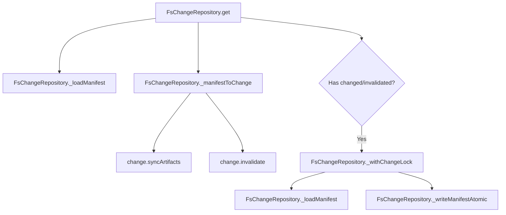

# Design: fix-change-repository-write-on-read

## Affected areas

- `packages/core/src/infrastructure/fs/change-repository.ts`
  - Modify `_manifestToChange` to remove all direct writes (`_writeManifestAtomic`).
  - Introduce an initialization guard: skip sync and drift detection if `artifactTypes.length === 0`.
  - Add private helper `_getInternal(name, options?: { skipWrite?: boolean })` to coordinate lock-based writes when drift/sync is detected.
  - Delegate public `get()` to `_getInternal(name, { skipWrite: false })`.
  - Update `mutate()` to call `this._getInternal(name, { skipWrite: true })`.
- `packages/core/test/infrastructure/fs/change-repository.spec.ts`
  - Add unit tests verifying that uninitialized repository reads do not write to disk or invalidate.
  - Add unit tests verifying that initialized repository reads that detect drift acquire the change lock, reload, and safely persist the invalidation.

## New constructs

(None)

## Approach

1. **Decouple writes from `_manifestToChange`**:
   - `_manifestToChange` will return both the reconstructed `Change` entity and a boolean flag: `{ change: Change, hasChangesToPersist: boolean }`.
   - If `artifactTypes` is empty, it returns `{ change, hasChangesToPersist: false }` immediately without checking for drift or running sync.
   - If `artifactTypes` is present, it runs the sync and drift checks in memory, updating the returned `Change` entity's state and file statuses in memory. If any in-memory sync or drift-invalidation occurs, `hasChangesToPersist` is set to `true`.
   - It will **never** call `_writeManifestAtomic`.

2. **Handle writes inside a private helper `_getInternal()` using locks**:
   - Add a private helper `_getInternal(name, options?: { skipWrite?: boolean })` to `FsChangeRepository`.
   - When `skipWrite` is `true`, `_getInternal()` bypasses lock acquisition and disk writes entirely, returning the reconstructed `Change` entity (with any in-memory invalidations/sync) directly.
   - `mutate(name, fn)` will invoke `this._getInternal(name, { skipWrite: true })`. This avoids nested locks/deadlocks since `mutate` already holds the lock. The final `this.save(change)` at the end of `mutate` will safely write the accumulated in-memory changes.
   - The public `get(name)` will delegate directly: `this._getInternal(name, { skipWrite: false })`.
   - Inside `_getInternal(name, options)` when `options?.skipWrite` is NOT `true`:
     1. Resolve directory and load the initial manifest.
     2. Call `_manifestToChange` to obtain `{ change, hasChangesToPersist }`.
     3. If `hasChangesToPersist` is `true` and the repository is fully initialized (`_artifactTypesResolved` is `true`):
        - Enter `_withChangeLock(name, async () => { ... })`.
        - Inside the lock, reload the manifest from disk via `_loadManifest(dir)`.
        - Call `_manifestToChange` again on the freshly reloaded manifest.
        - If `hasChangesToPersist` is still `true`, write the updated manifest to disk using `_writeManifestAtomic`.
        - Return the finalized `Change` entity.
     4. If no update is pending, return `change` directly without acquiring the lock or writing to disk.

     **Implementation Pseudocode**:

     ```typescript
     private async _getInternal(
       name: string,
       options?: { skipWrite?: boolean }
     ): Promise<Change | null> {
       const dir = this._changeDirPath(name);
       if (!(await this._directoryExists(dir))) return null;

       const manifest = await this._loadManifest(dir);
       const { change, hasChangesToPersist } = await this._manifestToChange(manifest, dir);

       if (hasChangesToPersist && this._artifactTypesResolved && !options?.skipWrite) {
         return await this._withChangeLock(name, async () => {
           const freshManifest = await this._loadManifest(dir);
           const { change: freshChange, hasChangesToPersist: stillNeedsPersist } =
             await this._manifestToChange(freshManifest, dir);

           if (stillNeedsPersist) {
             await this._writeManifestAtomic(dir, changeToManifest(freshChange));
             return freshChange;
           }
           return freshChange;
         });
       }

       return change;
     }

     override async get(name: string): Promise<Change | null> {
       return this._getInternal(name, { skipWrite: false });
     }
     ```

3. **Align `list()`**:
   - Instead of reading the manifest and calling `_manifestToChange` directly, `list()` will extract the change slug name from each directory name in the active `changes/` folder (using the same pattern as `_resolveDirInBase`) and call `this.get(name)` to load each active change.
   - This ensures that listing active changes automatically triggers the lock-based sync/auto-invalidation for any drifted changes, keeping the list and reads perfectly consistent.

## Key decisions

- **Decision** → Perform lock-based auto-invalidation inside `get()`.
  - **Rationale** → Keeps the manifest file on disk consistent with actual drift state automatically, while protecting against concurrency write hazards.
- **Decision** → Skip drift detection when `artifactTypes` is empty.
  - **Rationale** → Prevents uninitialized repositories (like in `project status`) from detecting false drift and writing corrupted state to disk.

## Dependency map



```
           ┌──────────────────────────────┐
           │   FsChangeRepository.get()   │
           └──────────────┬───────────────┘
                          │
                          ▼
           ┌──────────────────────────────┐
           │      _loadManifest()         │
           └──────────────┬───────────────┘
                          │
                          ▼
           ┌──────────────────────────────┐
           │     _manifestToChange()      │
           │  (In-Memory Sync/Drift only) │
           └──────────────┬───────────────┘
                          │
                          ▼
             /─────────────────────────\
            <  Has changed/invalidated? >
             \─────────────────────────/
                          │
                         Yes
                          ▼
           ┌──────────────────────────────┐
           │       _withChangeLock()      │
           │  ┌────────────────────────┐  │
           │  │     _loadManifest()    │  │
           │  │   _manifestToChange()  │  │
           │  │  _writeManifestAtomic()│  │
           │  └────────────────────────┘  │
           └──────────────────────────────┘
```

## Testing

### Automated tests

- `packages/core/test/infrastructure/fs/change-repository.spec.ts`:
  - Add test under `load-time drift by policy`:
    - **Scenario**: Given a change with drifted files, when loaded via `get()` with an uninitialized repository (empty `artifactTypes`), then no invalidation is performed and no write to disk occurs.
  - Add test under `auto-invalidation with drifted IDs`:
    - **Scenario**: Given a change with drifted files, when loaded via `get()` with a fully initialized repository, then the repository acquires the change lock, reloads the manifest, invalidates the change, and writes the invalidation to disk under the lock.

## Open questions

(None)
