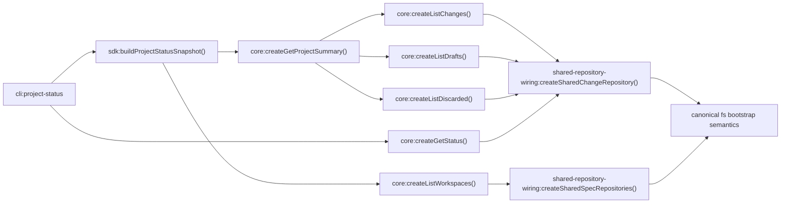

# Design: fix-project-status-repository-wiring

## Non-goals

- Do not change write-on-read persistence behavior. Any safeguard against a read path persisting invalidation or other mutations belongs to `fix-change-repository-write-on-read`.
- Do not refactor every composition factory in `@specd/core`.
- Do not change the external output contract of `project status` beyond making its repository-backed reads use complete canonical composition wiring.
- Do not change lifecycle rules, archive rules, graph orchestration semantics, or approval-gate behavior.

## Affected areas

- `createGetProjectSummary()` in `packages/core/src/composition/use-cases/get-project-summary.ts`
  Change: stop relying on downstream factories that bootstrap repositories with partial config-only wiring; route those dependencies through a shared helper-backed bootstrap path.
  Callers: `createKernel()` and SDK/CLI status flows via project queries. Risk: MEDIUM.

- `createListWorkspaces()` in `packages/core/src/composition/use-cases/list-workspaces.ts`
  Change: replace inline `SpecRepository` creation with a shared config-backed bootstrap that preserves canonical metadata-path semantics.
  Callers: `createGetProjectSummary()`, `createGenerateSpecMetadata()`, `createUpdateProjectMetadata()`, `createUpdateSpecMetadata()`, `createKernel()`. Risk: MEDIUM.

- `createListChanges()` in `packages/core/src/composition/use-cases/list-changes.ts`
  Change: replace direct `createChangeRepository('fs', ..., { changesPath, draftsPath, discardedPath })` config path with shared bootstrap that also resolves artifact-type/spec-existence semantics.
  Callers: `createGetProjectSummary()`, `createKernel()`. Risk: MEDIUM.

- `createListDrafts()` in `packages/core/src/composition/use-cases/list-drafts.ts`
  Change: same repository-bootstrap alignment as `createListChanges()`.
  Callers: `createGetProjectSummary()`, `createGetDraft()`, `createGetDiscarded()`, `createKernel()`. Risk: MEDIUM.

- `createListDiscarded()` in `packages/core/src/composition/use-cases/list-discarded.ts`
  Change: same repository-bootstrap alignment as `createListChanges()`.
  Callers: `createGetProjectSummary()`, `createKernel()`. Risk: MEDIUM.

- `createGetStatus()` in `packages/core/src/composition/use-cases/get-status.ts`
  Change: align config-based `ChangeRepository` bootstrap with canonical composition semantics while keeping existing `SchemaProvider`, archive repository, and implementation-tracking orchestration intact.
  Callers: status-oriented read flows and tests. Risk: MEDIUM.

- `packages/core/src/composition/kernel-internals.ts`
  Change: this file already contains the fs-backed storage factory pieces needed to understand the expected bootstrap shape. The new helper must reuse or reflect those semantics without creating a second incompatible implementation.
  Dependents discovered by graph impact: `createKernel()`, list/workspace/status composition factories, metadata/update flows. Risk: MEDIUM because this file exposes the current canonical wiring shape.

- `buildProjectStatusSnapshot()` in `packages/sdk/src/orchestration/build-project-status-snapshot.ts`
  Change: likely no behavior rewrite; implementation and tests must confirm it still sources data exclusively from SDK host context project queries after core wiring changes.
  Callers: `cli project status` and SDK orchestration tests. Risk: MEDIUM.

- `registerProjectStatus()` in `packages/cli/src/commands/project/status.ts`
  Change: likely no behavior rewrite; keep using SDK host context and snapshot orchestration while tests are updated to cover the aligned semantics.
  Callers: CLI entrypoint and command tests. Risk: MEDIUM.

- Tests:
  - `packages/core/test/composition/get-project-summary.spec.ts`
  - `packages/core/test/application/use-cases/get-project-summary.spec.ts`
  - `packages/core/test/application/use-cases/get-status.spec.ts`
  - `packages/sdk/test/orchestration/build-project-status-snapshot.spec.ts`
  - `packages/cli/test/commands/project-status.spec.ts`
    Change: add regression coverage for config-based composition paths so they observe the same repository-derived status semantics as the canonical composition-backed path.

## New constructs

- `packages/core/src/composition/shared-repository-wiring.ts`
  Shape:

  ```ts
  export interface SharedSpecRepositoryMapOptions {
    readonly config: SpecdConfig
  }

  export interface SharedChangeRepositoryOptions {
    readonly config: SpecdConfig
    readonly workspaceName?: string
  }

  export function createSharedSpecRepositories(
    options: SharedSpecRepositoryMapOptions,
  ): ReadonlyMap<string, SpecRepository>

  export function createSharedChangeRepository(
    options: SharedChangeRepositoryOptions,
  ): ChangeRepository
  ```

  Responsibility: centralize the config-based bootstrap logic needed by the affected read/composition factories so they preserve one canonical effective wiring model.
  Relationships: depends on `SpecdConfig`, `createSpecRepository()`, `createChangeRepository()`, `getDefaultWorkspace()`, and whatever minimal internal helpers are needed to provide canonical bootstrap semantics. It is consumed only by the affected composition factories in this change.

- `resolveMetadataPathForWorkspace(...)` internal helper inside `shared-repository-wiring.ts`
  Shape:

  ```ts
  function resolveMetadataPathForWorkspace(
    config: SpecdConfig,
    workspace: SpecdConfig['workspaces'][number],
  ): string
  ```

  Responsibility: produce the canonical metadata root used by config-backed `SpecRepository` bootstrap for a workspace.
  Relationships: used only by `createSharedSpecRepositories()`.

- `resolveChangeRepositoryResolvers(...)` internal helper inside `shared-repository-wiring.ts`
  Shape:
  ```ts
  function resolveChangeRepositoryResolvers(config: SpecdConfig): {
    readonly resolveArtifactTypes: () => Promise<readonly ArtifactType[]>
    readonly resolveSpecExists: (specId: string) => Promise<boolean>
  }
  ```
  Responsibility: provide the schema-aware artifact-type and spec-existence callbacks needed by config-backed `ChangeRepository` bootstrap.
  Relationships: used only by `createSharedChangeRepository()`.

No new public package export is required for these helpers. They are composition-internal implementation details.

## Approach

The implementation will fix the bug by eliminating partial config-based repository bootstrap in the targeted read/composition factories and replacing it with one shared internal bootstrap path that provides the canonical fs-backed wiring semantics.

The sequence is:

1. Add `shared-repository-wiring.ts` in `packages/core/src/composition/`.
2. Implement `createSharedSpecRepositories()` so config-backed workspace repositories no longer hand-roll `metadataPath`.
3. Implement `createSharedChangeRepository()` so config-backed status/list factories no longer create a `ChangeRepository` without schema-driven artifact-type and spec-existence resolution.
4. Update only the affected config-based factories:
   - `createListWorkspaces()`
   - `createListChanges()`
   - `createListDrafts()`
   - `createListDiscarded()`
   - `createGetStatus()`
   - `createGetProjectSummary()`
5. Keep the explicit context+options overloads intact. The change only alters the `SpecdConfig` branch of each factory.
6. Keep `buildProjectStatusSnapshot()` and `project status` orchestration model intact. They should benefit automatically once core config-based factories stop diverging from the canonical repository bootstrap path.
7. Add regression tests for the bug class:
   - config-based factories must observe the same effective repository semantics as other canonical composition-backed reads
   - status-oriented read paths must honor schema-driven artifact-type behavior when deriving status from persisted changes

Implementation details by area:

- `createSharedSpecRepositories()`
  - Iterate configured workspaces once.
  - Build `SpecRepository` instances with canonical `workspace`, `ownership`, `isExternal`, `configPath`, `specsPath`, `prefix`, and resolved metadata path.
  - Return a `ReadonlyMap<string, SpecRepository>` keyed by workspace name.

- `createSharedChangeRepository()`
  - Resolve the default workspace unless an explicit workspace name is supplied.
  - Construct a `ChangeRepository` using the normal storage paths plus async `resolveArtifactTypes` and `resolveSpecExists`.
  - `resolveSpecExists(specId)` must use the shared spec repository map and parsed workspace ownership to answer existence consistently with the project configuration.
  - `resolveArtifactTypes()` must resolve the active schema and expose its artifact types to the repository bootstrap path used by reads.

- `createListWorkspaces(config)`
  - Replace inline `new Map(config.workspaces.map(... createSpecRepository ...))` with `createSharedSpecRepositories({ config })`.
  - Preserve the explicit `options.specRepositories` branch unchanged.

- `createListChanges(config)`, `createListDrafts(config)`, `createListDiscarded(config)`
  - Preserve the explicit `(context, options)` branch unchanged.
  - In the `SpecdConfig` branch, replace the recursive config-to-context path that ends in a bare `createChangeRepository()` call with direct construction via `createSharedChangeRepository({ config })`.
  - Keep return types and constructor dependencies unchanged.

- `createGetStatus(config, kernelOpts?)`
  - Preserve explicit `(context, options)` behavior.
  - In the config branch, keep schema repository creation, archive repository creation, `SchemaProvider`, and `RefreshImplementationTracking` orchestration.
  - Replace the config-backed `ChangeRepository` bootstrap with `createSharedChangeRepository({ config })` or an equivalent helper-based branch that injects resolver callbacks.
  - Do not change refresh semantics, lifecycle semantics, or degraded schema behavior.

- `createGetProjectSummary(config)`
  - No direct repository construction is needed here.
  - Keep it as an orchestration layer, but now it composes list/workspace factories whose config-based wiring is aligned with the canonical bootstrap path.

- SDK and CLI
  - No direct repository construction should be introduced.
  - Adjust tests only if assumptions about old wiring behavior were baked into mocks or fixtures.

## Key decisions

- **Introduce a small internal shared bootstrap helper instead of editing every factory independently** → this keeps the bug fix localized and prevents the same drift from being reintroduced in the targeted read path.
  **Alternatives rejected** → duplicating the resolver/bootstrap logic in each factory would preserve the current drift risk; a full repo-wide helper migration would overshoot the agreed scope.

- **Change only the `SpecdConfig` factory branches, not the explicit context/options branches** → explicit branches are already dependency-injected and are useful for tests and advanced callers. The bug sits in config-based convenience wiring.
  **Alternatives rejected** → rewriting both branches would expand blast radius without solving a user-facing problem.

- **Use one internal canonical fs-backed bootstrap model without coupling external callers to `createKernel()`** → this preserves architectural intent from `default:_global/architecture` and the existing composition-layer responsibilities.
  **Alternatives rejected** → making status commands call `createKernel()` recursively or exposing new public core bootstrap APIs just for this fix would be unnecessary.

- **Keep SDK/CLI contract stable and let core do the behavioral correction** → the observed bug comes from core composition bootstrap divergence, not from the outer presenters.
  **Alternatives rejected** → adding command-specific compensation logic in SDK or CLI would hide the defect instead of fixing the source.

## Trade-offs

- `[Shared helper introduces one more composition indirection]` → keep it private to `packages/core/src/composition/` and limited to the targeted read/status factories.
- `[Canonical bootstrap semantics may reveal more hidden assumptions in tests]` → update composition and command tests to assert final behavior rather than old bootstrap details.
- `[Graph is currently stale while designing]` → design uses the current file/symbol evidence and fresh project/config context; implementation should re-check graph freshness before deeper impact work if needed.

## Spec impact

### `core:get-project-summary`

- Direct dependents: `sdk:build-project-status-snapshot`, `cli:project-status`
- Transitive dependents: `sdk:build-project-status-snapshot` flows into the CLI command handler
- Assessment: no additional spec scope is required. The dependent specs already attached to this change (`sdk:build-project-status-snapshot`, `cli:project-status`) are the relevant ripple surface and are being updated in this change.

### `core:list-workspaces`

- Direct dependents already present in change context: `core:get-project-summary`, `cli:project-status`
- Additional code dependents discovered by graph impact: `createGenerateSpecMetadata()`, `createUpdateProjectMetadata()`, `createUpdateSpecMetadata()`, `createKernel()`
- Assessment: the extra dependents are implementation consumers of the same composition helper shape. They do not require spec changes because their public requirements are not changing in this change.

### `core:list-changes`, `core:list-drafts`, `core:list-discarded`, `core:get-status`

- Direct dependents are concentrated in `core` composition and the project-status read path.
- Assessment: no new spec IDs need to be added. The remaining impacted callers are internal composition consumers or tests, not distinct requirement surfaces.

## Dependency map



```
┌──────────────────────┐
│ cli:project-status   │
└──────────┬───────────┘
           │
           ▼
┌──────────────────────┐
│ sdk:buildProject     │
│ StatusSnapshot()     │
└───────┬────────┬─────┘
        │        │
        │        ▼
        │   ┌───────────────┐
        │   │ createList    │
        │   │ Workspaces()  │
        │   └──────┬────────┘
        │          │
        ▼          ▼
┌──────────────────────┐    ┌────────────────────────────┐
│ createGetProject     │    │ createSharedSpecRepos()    │
│ Summary()            │    │ [new internal helper]      │
└───┬────────┬─────────┘    └──────────────┬─────────────┘
    │        │                             │
    │        └──────────────┐              │
    ▼                       ▼              ▼
┌───────────────┐     ┌───────────────┐  ┌──────────────────────┐
│ createList    │     │ createList    │  │ canonical fs         │
│ Changes()     │     │ Drafts() /    │  │ bootstrap semantics  │
└──────┬────────┘     │ Discarded()   │  └──────────────────────┘
       │              └──────┬────────┘
       │                     │
       └─────────────┬───────┘
                     ▼
          ┌────────────────────────────┐
          │ createSharedChangeRepo()   │
          │ [new internal helper]      │
          └──────────────┬─────────────┘
                         │
                         ▼
               ┌──────────────────────┐
               │ createGetStatus()    │
               └──────────────────────┘
```

## Migration / Rollback

- Deployment/migration: none. This is an internal composition and test change with no data migration.
- Rollback: revert the helper and factory rewiring changes if regression appears in status/list behavior.
- Safety boundary: because public output contract stays stable, rollback is low-risk as long as tests cover the restored behavior.

## Testing

### Automated tests

- `packages/core/test/composition/get-project-summary.spec.ts`
  - Add a regression case proving the config-based `createGetProjectSummary(config)` path uses downstream repositories with canonical bootstrap semantics.

- `packages/core/test/application/use-cases/get-project-summary.spec.ts`
  - Add or extend scenarios that verify summary counts remain correct when repository-derived artifact semantics matter.

- `packages/core/test/application/use-cases/get-status.spec.ts`
  - Add a regression case where status derivation depends on schema-driven artifact-type behavior and the config-wired path must match the canonical composition-backed path.
  - Add a test case to verify that retrieving project/change status does not invalidate or reset completed tasks (tasks marked with `[x]`) in `tasks.md` after validation.

- `packages/sdk/test/orchestration/build-project-status-snapshot.spec.ts`
  - Confirm the snapshot layer still uses SDK host context project queries only and never performs direct repository bootstrap.

- `packages/cli/test/commands/project-status.spec.ts`
  - Confirm the command continues to route reads through SDK host context only.

- `packages/core/test/composition/`
  - Add a dedicated test file for `shared-repository-wiring.ts` if the helper has non-trivial logic.
  - Verify:
    - spec repository map uses canonical metadata-path semantics
    - change repository bootstrap exposes artifact-type/spec-existence callbacks
    - helper preserves workspace ownership/config metadata

All new tests must follow global testing rules: Vitest, `test/` mirror structure, explicit assertions, no snapshot tests.

### Manual / E2E verification

1. Run focused core tests for the new helper and affected composition factories.
2. Run status-oriented tests in SDK and CLI.
3. Reproduce the original status bug on a fixture or copied active change whose artifact-state derivation depends on schema-driven behavior.
4. Execute:
   - `node packages/cli/dist/index.js project status --format toon`
   - `node packages/cli/dist/index.js changes status <name> --format text`
5. Verify:
   - repository-backed reads complete successfully
   - status/count outputs are consistent across the config-based read path and the canonical composition-backed path
   - no compensating bootstrap logic was added in SDK/CLI

### Documentation

- No documentation update is expected if the user-visible `project status` contract remains unchanged.
- If implementation reveals that CLI docs describe repository/bootstrap behavior inaccurately, update `docs/cli/project-status.md` in the same change.

### Global constraint checks

- Architecture: all new logic stays in `composition/`; no domain I/O is introduced.
- Conventions: keep ESM, named exports, explicit return types on exported helpers, no `any`.
- Docs/JSDoc: every new exported helper and internal non-test symbol must receive JSDoc matching `default:_global/docs` and `default:_global/eslint`.
- Testing: add Vitest coverage under mirrored `test/` paths; no snapshots.

## Open questions

None.
