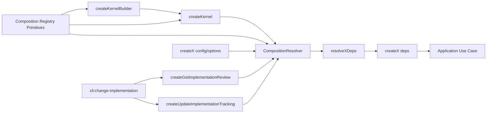

# Design: decouple-composition-factories

## Non-goals

- This change does not remove low-level adapter factories such as `createChangeRepository('fs', ...)`, `createSpecRepository('fs', ...)`, or `createArchiveRepository('fs', ...)`; they remain the adapter-facing escape hatch below public use-case composition.
- This change does not redesign unrelated application-layer use-case semantics beyond the contract-drift fixes identified during verification.
- This change does not introduce per-use-case plugin builders, service locators, or a third public `createX(resolver)` signature.
- This change does not require eager construction of the full kernel dependency graph for standalone factory calls.
- This change does not alter the low-level semantics of additive registrations; it only moves their reusable source-of-truth out of kernel-owned naming and abstractions.
- This change does not move code-graph backend composition into `@specd/core`; instead, it removes graph-store-specific extensibility from core so that concern stays package-owned by `@specd/code-graph`.

## Affected areas

- `packages/core/src/composition/kernel.ts`: `createKernel`
  Change: make kernel assembly pure orchestration over normalized public factories.
  Callers: high fan-in through public core entry points and composition tests · Risk: CRITICAL.
  Note: graph impact reports 94 transitive dependents and 56 affected files; this is the primary integration hotspot.

- `packages/core/src/composition/kernel-builder.ts` and related builder internals
  Change: builder must accumulate only core-owned additive composition options and build through the same resolver-backed assembly path as `createKernel`.
  Callers: public builder consumers and composition tests · Risk: HIGH.

- `packages/core/src/composition/kernel-internals.ts` and `packages/core/src/composition/kernel-registries.ts`
  Change: extract or rename the reusable registry primitives so they become composition-generic shared infrastructure rather than kernel-owned concepts, and remove code-graph-specific graph-store capability categories from the core-owned registry model.
  Callers: `CompositionResolver`, `createKernel`, `createKernelBuilder`, extension surfaces, tests · Risk: HIGH.

- `packages/core/src/composition/use-cases/*.ts`
  Symbols: every public `createX(...)` factory mounted in the kernel, including `createCreateChange`, `createGetStatus`, `createTransitionChange`, `createDraftChange`, `createRestoreChange`, `createDiscardChange`, `createArchiveChange`, `createValidateArtifacts`, `createCompileContext`, `createListChanges`, `createListDrafts`, `createListDiscarded`, `createEditChange`, `createSkipArtifact`, `createUpdateSpecDeps`, `createListArchived`, `createGetArchivedChange`, `createRunStepHooks`, `createGetHookInstructions`, `createGetArtifactInstruction`, `createApproveSpec`, `createApproveSignoff`, `createListSpecs`, `createGetSpec`, `createSaveSpecMetadata`, `createInvalidateSpecMetadata`, `createGetActiveSchema`, `createValidateSpecs`, `createGenerateSpecMetadata`, `createGetSpecContext`, `createListWorkspaces`, `createGetProjectContext`, `createGetConfig`, `createGetProjectMetadata`, `createUpdateProjectMetadata`, `createResolveSchema`, `createDetectOverlap`, `createGetDraft`, `createGetDiscarded`, `createInvalidateChange`, `createSearchSpecs`, `createPreviewSpec`, `createValidateSchema`, `createGetSpecOutline`, `createRefreshImplementationTracking`, `createUpdateImplementationTracking`, `createGetImplementationReview`, `createUpdateSpecMetadata`, `createGetProjectSummary`.
  Change: normalize each factory to `createX(deps)` plus `createX(config, options?)`; remove public fs-shaped composition signatures.
  Callers: kernel, public exports, tests, downstream consumers · Risk: HIGH.

- `packages/core/src/application/use-cases/compile-context.ts`
  Change: align `stepAvailable` with the lifecycle engine's full availability verdict (`isReady && isPermitted`) instead of readiness alone.
  Callers: change context compilation, lifecycle-aware tooling, tests · Risk: HIGH.

- `packages/core/src/application/use-cases/get-project-context.ts`
  Change: gate optimized project-context reuse behind `llmOptimizedContext`; fresh optimized cache must not override standard compilation when optimization is disabled.
  Callers: project-context consumers, docs/context generation, tests · Risk: HIGH.

- `packages/sdk/src/orchestration/build-project-status-snapshot.ts`
  Change: degrade the whole graph snapshot (`graphHealth` and `hotspots`) when hotspot loading fails, matching the SDK contract.
  Callers: CLI/project-status hosts and future SDK consumers · Risk: MEDIUM.

- `packages/core/src/composition/shared-repository-wiring.ts` and adjacent shared composition helpers
  Change: move shared config-to-port resolution behind one reusable resolver-backed path instead of repeated path plumbing.
  Callers: many composition factories · Risk: HIGH.

- `packages/core/src/extensions.ts`, `packages/core/src/composition/graph-store-factory.ts`, and core composition exports
  Change: remove graph-store-specific extension types and builder methods from the public core surface so `@specd/core` does not advertise code-graph backend composition responsibilities.
  Callers: extension authors, public API consumers, builder tests · Risk: HIGH.

- `packages/code-graph/src/composition/create-code-graph-provider.ts` and `packages/sdk/src/composition/host-context.ts`
  Change: remain the owning composition path for graph-store registration and backend selection; any core-side graph-store override path must not survive as a second source of truth.
  Callers: SDK host bootstrap and code-graph consumers · Risk: MEDIUM.

- `packages/core/src/public.ts`, `packages/core/src/composition/index.ts`, `packages/core/src/composition/use-cases/index.ts`
  Change: preserve public exports while updating overloaded signatures and any missing re-exports discovered during the audit.
  Callers: cross-workspace public API consumers · Risk: HIGH.

- `packages/core/test/composition/**/*.spec.ts`
  Change: update tests to assert canonical deps construction, config-based bootstrap, kernel reuse, builder reuse, and implementation-tracking factories.
  Callers: test suite only · Risk: MEDIUM.

- `docs/`
  Change: update composition-facing documentation so it explains canonical deps factories, config bootstrap, `CompositionResolver`, `createKernel`, and `createKernelBuilder`.
  Callers: humans and agent documentation consumers · Risk: MEDIUM.

## New constructs

- `packages/core/src/composition/composition-resolver.ts`
  Shape:

  ```ts
  export type CompositionResolutionOptions = {
    extraNodeModulesPaths?: readonly string[]
    storageFactories?: readonly StorageFactoryRegistration[]
    artifactParsers?: readonly ArtifactParserRegistration[]
    vcsProviders?: readonly VcsProviderRegistration[]
    actorProviders?: readonly ActorProviderRegistration[]
    externalHookRunners?: readonly ExternalHookRunnerRegistration[]
  }

  export interface CompositionResolver {
    readonly config: SpecdConfig
    readonly options: Readonly<CompositionResolutionOptions>
    getChangeRepository(): ChangeRepository
    getSpecRepositories(): ReadonlyMap<string, SpecRepository>
    getArchiveRepository(): ArchiveRepository
    getSchemaRegistry(): SchemaRegistry
    getSchemaProvider(): SchemaProvider
    getHookRunner(): HookRunner
    getRunStepHooks(): RunStepHooks
    getActorResolver(): ActorResolver
    getVcsAdapter(): VcsAdapter
    getArtifactParserRegistry(): ArtifactParserRegistry
    getContentHasher(): ContentHasher
  }

  export function createCompositionResolver(
    config: SpecdConfig,
    options?: CompositionResolutionOptions,
  ): CompositionResolver
  ```

  Responsibility: own one composition session, resolve shared dependencies lazily, cache them within that session, and expose normalized shared primitives only.
  Relationships: consumed by public factory wrappers, `createKernel`, and `createKernelBuilder`; does not know per-use-case `XDeps`; sits on composition-generic registry primitives that are not kernel-owned and only cover core-owned concerns.

- `packages/core/src/composition/composition-registries.ts` and `packages/core/src/composition/composition-internals.ts` (target names; exact filenames may vary)
  Shape:

  ```ts
  export interface CompositionRegistryInput {
    /* additive registrations */
  }
  export interface CompositionRegistryView {
    /* merged built-in + external capabilities */
  }

  export function createBuiltinCompositionRegistry(): CompositionRegistryInput
  export function createCompositionRegistryView(
    builtin: CompositionRegistryInput,
    options?: CompositionResolutionOptions,
  ): CompositionRegistryView
  ```

  Responsibility: define the generic registry/view primitives reused below resolver, kernel, and builder.
  Relationships: source-of-truth for additive capability merging; kernel consumes this layer but does not define it.
  Constraint: these primitives remain package-local. They do not model code-graph graph-store backends or any other concern owned by another workspace package.

- `packages/core/src/composition/normalize-factory-args.ts`
  Shape:

  ```ts
  export type FactoryInput<Deps, Options> =
    | { kind: 'deps'; deps: Deps }
    | { kind: 'config'; config: SpecdConfig; options?: Options }

  export function normalizeCompositionFactoryArgs<Deps, Options>(
    useCaseName: string,
    first: Deps | SpecdConfig,
    second?: Options,
    isDeps: (value: Deps | SpecdConfig) => value is Deps,
  ): FactoryInput<Deps, Options>
  ```

  Responsibility: implement the shared public-argument decision point for `createX(deps)` and `createX(config, options?)`.
  Relationships: called by every public composition factory; throws the shared invalid-arguments error on unsupported combinations.

- `packages/core/src/domain/errors/invalid-composition-factory-arguments-error.ts`
  Shape:

  ```ts
  export class InvalidCompositionFactoryArgumentsError extends SpecdError {
    constructor(useCaseName: string, details?: string)
  }
  ```

  Responsibility: provide one typed error for public factory signature misuse.
  Relationships: thrown only from the shared argument-normalization helper.

- `packages/core/src/composition/use-cases/resolve-*.ts` helpers colocated with factories
  Shape:

  ```ts
  export type CreateChangeDeps = ConstructorParameters<typeof CreateChange>[0]

  export function resolveCreateChangeDeps(resolver: CompositionResolver): CreateChangeDeps
  ```

  Responsibility: translate shared resolver primitives into one specific `XDeps` object near the matching `createX(...)`.
  Naming rule: every kernel-mounted public factory uses the exact helper convention `resolveXDeps(resolver)` for the matching `createX(...)` entry and the exact deps object name `XDeps`.
  Relationships: called by `createX(config, options?)`, `createKernel`, and builder-backed kernel assembly; not exported as a third public factory surface.

## Approach

1. Introduce the shared `CompositionResolver` and the shared public-argument normalization helper.
   Every public composition factory will begin by normalizing `(deps | config, options?)`. Invalid `deps + options` or malformed calls throw `InvalidCompositionFactoryArgumentsError(useCaseName)`.

2. Extract the reusable registry primitives out of kernel-owned naming.
   The current `kernel-internals` and `kernel-registries` responsibilities become composition-generic shared infrastructure. `CompositionResolver`, `createKernel`, and `createKernelBuilder` all consume that layer, but none of them owns separate merging semantics.

3. Remove graph-store-specific extensibility from the core composition contract.
   `graphStoreId`, `graphStoreFactories`, `registerGraphStore(...)`, `useGraphStore(...)`, and `GraphStoreFactory` do not belong in `@specd/core` because the core kernel does not compose or consume graph stores directly. Graph-store registration and backend selection stay in `@specd/code-graph`, while `@specd/sdk` remains the package that orchestrates core plus code-graph host bootstrap.

4. Convert every kernel-mounted `createX(...)` factory to the same two-form contract.
   The canonical form is `createX(deps)`. The convenience form is `createX(config, options?)`, which must do exactly: create resolver, call the exact colocated helper `resolveXDeps(resolver)`, delegate to `createX(deps)`.
   Specs for each affected use case must name that exact helper and enumerate the `XDeps` members it resolves so the composition contract remains local to the use case instead of only centralized in shared composition specs.

5. Remove public fs-shaped explicit signatures.
   Existing `Fs*Options` interfaces and constructor-time path bundles stop being part of the public use-case composition API. Path and adapter selection move behind resolver internals and shared wiring utilities.

6. Make `createKernel(config, options?)` a thin orchestrator.
   Kernel construction creates one resolver for the composition session, calls the same `resolveXDeps(resolver)` helpers used by standalone factories, and groups the resulting use-case instances. The kernel owns grouping and instance sharing, not distinct per-use-case semantics.

7. Keep `createKernelBuilder()` as full-kernel additive bootstrap only.
   The builder accumulates `CompositionResolutionOptions` registrations and eventually delegates to kernel construction through the same resolver path. It does not provide per-use-case composition services and does not override config silently. For concerns that need explicit runtime selection in the future, core may add package-owned selection hooks, but not by retaining code-graph-specific backend knobs in the core builder.

8. Cover the two implementation-tracking factories in the same model.
   `createUpdateImplementationTracking(...)` and `createGetImplementationReview(...)` must adopt the same deps/config split and resolve their repositories and file readers through the resolver path.

9. Update exports, tests, and docs together.
   Public barrels must expose the normalized contracts consistently. Tests must prove standalone factories, kernel assembly, and builder assembly all flow through the same semantics. `docs/` must explain the new role split clearly.

10. Fold verification-discovered contract drift fixes into the same change.
    The composition refactor now also repairs three concrete mismatches between implementation and spec: `CompileContext.stepAvailable`, `GetProjectContext` optimized-cache gating, and `buildProjectStatusSnapshot` hotspot failure degradation.

## Key decisions

- **Canonical public contract is `createX(deps)`** → resolved ports and collaborators are the real stable API boundary. This keeps composition independent from fs paths and adapter ids.
  **Alternatives rejected**: keeping `(context, Fs*Options)` as public API, or adding a public `resolver` signature. Both leak bootstrap details.

- **Config convenience stays as `createX(config, options?)`** → downstream callers still get ergonomic bootstrap without learning every dependency object.
  **Alternatives rejected**: removing config bootstrap entirely. That would make the public API harder to consume and duplicate assembly in hosts.

- **Resolver is session-scoped and lazy, not a process singleton** → multiple factories in one kernel build share cached primitives, while standalone calls do not leak global state.
  **Alternatives rejected**: process-global singleton resolver. That would mix config/options sessions and make plugin-capability changes unsafe.

- **Reusable registry primitives are composition-owned, not kernel-owned** → the kernel stays a facade over shared composition infrastructure and does not remain the naming source-of-truth for registries and built-ins.
  **Alternatives rejected**: keeping `kernel-internals` and `kernel-registries` as the generic base. That leaves a misleading architecture where the resolver depends on concepts that appear to belong to the kernel.

- **Core does not own graph-store backend selection** → graph-store registration and backend choice remain in `@specd/code-graph` and SDK host bootstrap, because the core kernel neither constructs nor consumes graph stores directly.
  **Alternatives rejected**: keeping `graphStoreId`, `graphStoreFactories`, `registerGraphStore(...)`, or `useGraphStore(...)` on the core contract. That would preserve a false cross-package override path and keep code-graph concerns in the wrong package.

- **Resolver does not know each use case** → per-use-case dependency assembly remains colocated with the factory that owns the contract.
  **Alternatives rejected**: one giant resolver method per use case. That centralizes too much knowledge and becomes an unmaintainable god object.

- **Kernel is the only composition orchestrator, not a second source of truth** → factory semantics live in `createX(...)` plus `resolveXDeps(resolver)`, and the kernel just reuses them.
  **Alternatives rejected**: keeping bespoke kernel wiring semantics beside standalone factories. That is the drift already causing the problem.

- **Builder accumulates additive registrations but does not silently override config** → plugin-supplied adapters become available through registration, while config still picks which one is active.
  **Alternatives rejected**: builder override precedence over config by default. That creates two truths for adapter selection.

  For code-graph backend selection specifically, this refactor narrows the rule further: the selection contract is not modeled in core at all, so there is no core-side override precedence to define.

- **Contract drift fixes stay in the same change** → when verification reveals a mismatch in nearby composition-owned flows, fix the spec and implementation together instead of archiving a known inconsistency.
  **Alternatives rejected**: archiving the refactor and tracking these three mismatches in a follow-up change. That would knowingly leave reviewed artifacts and runtime behavior out of sync.

## Trade-offs

- `[Broad composition refactor]` → Mitigation: keep low-level adapter factories intact and change only the public use-case composition layer.
- `[High fan-in around createKernel and public exports]` → Mitigation: preserve public names, add compatibility tests for both standalone and kernel assembly, and avoid behavioral changes below application ports.
- `[Large spec scope]` → Mitigation: use one shared resolver contract plus one shared normalization rule so the implementation stays repetitive in structure but not duplicated in logic.
- `[Registry rename/extraction touches extension-facing composition types]` → Mitigation: keep runtime semantics stable and treat the rename/extraction as moving ownership/naming of the same merged-registry model rather than inventing new capability categories.
- `[Removing graph-store fields from core is a public-surface contraction]` → Mitigation: keep graph-store selection available through `@specd/code-graph`/`@specd/sdk`, update docs and examples together, and ensure no core host path still depends on the removed fields.
- `[Behavioral fixes mixed into a composition refactor]` → Mitigation: keep the functional changes narrowly scoped to already-owned use cases and the SDK orchestration path, and add targeted verification scenarios plus tests for each corrected mismatch.

## Spec impact

### `core:composition`

- Direct dependents in this change: `core:kernel`, `core:kernel-builder`, `default:_global/docs`.
- Assessment: all remain satisfied if they consume the same resolver-backed assembly path. No additional spec scope is needed beyond the current change set.

### `core:kernel`

- Direct dependents in this change: `core:get-status`, `core:list-changes`, `core:list-drafts`, `core:get-project-summary`, `core:spec-overlap`, `core:approve-spec`, `core:approve-signoff`, plus `default:_global/docs`.
- Assessment: these dependents remain valid if kernel grouping stays stable and only composition semantics are normalized underneath.

### `core:composition-resolver`

- Direct dependents in this change: `core:composition`, `core:kernel`, `core:kernel-builder`, and all affected factory specs that now declare it.
- Assessment: this is the new shared contract that prevents hidden fs-shaped wiring from reappearing and keeps the kernel from remaining the conceptual owner of generic composition registries.

### `core:update-implementation-tracking` and `core:get-implementation-review`

- Direct dependent in this change: `cli:change-implementation`.
- Assessment: the CLI contract stays valid if these core use cases become the explicit read/write foundation and their composition factories adopt the same normalized public signatures.

## Dependency map



```text
┌──────────────────────┐
│ createKernelBuilder  │
└──────────┬───────────┘
           │ additive registrations
           ▼
┌──────────────────────┐      ┌──────────────────────────┐
│ createKernel(...)    │─────▶│ CompositionResolver      │
│ [CRITICAL hotspot]   │      │ per session, lazy cache  │
└──────────┬───────────┘      └──────────┬───────────────┘
           │ grouped assembly                       │
           │                                        │
           │                    ┌───────────────────▼───────────────────┐
           │                    │ composition registry/view primitives   │
           │                    │ shared below resolver, kernel, builder │
           │                    └───────────────────┬───────────────────┘
           │                                        │
           │                     ┌──────────────────▼──────────────────┐
           │                     │ resolveXDeps(resolver) helpers      │
           │                     └──────────────────┬──────────────────┘
           │                                        │
           │             ┌──────────────────────────▼──────────────────────────┐
           └────────────▶│ createX(deps) canonical factories                   │
                         └──────────────────────────┬──────────────────────────┘
                                                    │
                                                    ▼
                                          ┌──────────────────┐
                                          │ application UCs  │
                                          └──────────────────┘

┌────────────────────────────┐
│ cli:change-implementation  │
└──────────┬─────────────────┘
           │
           ├──────────────▶ createGetImplementationReview(...)
           └──────────────▶ createUpdateImplementationTracking(...)
```

## Migration / Rollback

- Migration is source-only. No persisted data migration is required.
- Backward compatibility requirement: keep public factory names and keep config-based convenience construction available.
- Rollback path: revert the resolver-backed wrappers and restore the old explicit fs-shaped signatures only if implementation becomes blocked; low-level adapter factories remain unchanged, so rollback is isolated to composition files.

## Testing

### Automated tests

- `packages/core/test/composition/composition-resolver.spec.ts`
  Verify resolver session scoping, lazy caching, that unrelated dependencies are not instantiated for a single standalone factory path, and that the resolver consumes composition-generic registry primitives rather than kernel-owned ones.

- `packages/core/test/composition/use-cases/*.spec.ts`
  Update representative factory suites (`create-change`, `get-status`, `list-changes`, `list-drafts`, `list-discarded`, `get-project-summary`, `update-implementation-tracking`, `get-implementation-review`) to cover:
  - canonical `createX(deps)` construction
  - convenience `createX(config, options?)` bootstrap
  - shared invalid-arguments error for `deps + options`

- `packages/core/test/application/use-cases/{compile-context,get-project-context}.spec.ts` and `packages/sdk/test/orchestration/build-project-status-snapshot.spec.ts`
  Add regression coverage for:
  - `CompileContext.stepAvailable` staying `false` when the lifecycle engine reports `isReady: true` but `isPermitted: false`
  - `GetProjectContext` bypassing fresh optimized cache when `llmOptimizedContext` is disabled
  - `buildProjectStatusSnapshot` clearing both `graphHealth` and `hotspots` when hotspot loading fails

- `packages/core/test/composition/kernel.spec.ts` and builder-focused tests
  Add assertions that kernel assembly and builder assembly reuse the same resolver-backed factory semantics, preserve grouped kernel shape, and do not introduce a separate registry-merge source of truth beneath the kernel facade.

- Export/barrel tests or equivalent compile-time coverage
  Confirm public exports still expose the normalized factories and implementation-tracking factories.

- CLI tests for `packages/cli/test/commands/change-implementation*.spec.ts`
  Confirm implementation review/mutation flows still rely on explicit core read/write use cases after the composition refactor.

### Manual / E2E verification

- Run `pnpm --filter @specd/core test`.
  Expected: updated composition and kernel tests pass, including implementation-tracking suites.

- Run targeted lint/typecheck for `@specd/core` and `@specd/cli`.
  Expected: no signature, export, or ESM-layer violations.

- Exercise a real config-based bootstrap:
  1. load `SpecdConfig`
  2. instantiate one standalone factory such as `createGetStatus(config)`
  3. instantiate `createKernel(config)`
  4. instantiate a builder-built kernel with additive registrations
     Expected: all three succeed without passing fs path bundles to public use-case factories.

- Review docs under `docs/` after the code change.
  Expected: documentation explicitly explains canonical deps factories, config bootstrap, the resolver role, the kernel/builder split, and that the reusable registry layer belongs to composition infrastructure rather than to the kernel facade.

## Open questions

- None. Implementation should not introduce a third public factory signature, a process-global resolver, or builder-over-config precedence.
