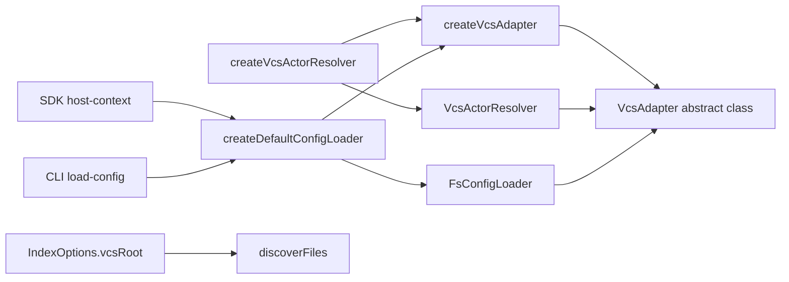

# Design: eliminate-git-hardcoding

## Non-goals

- Add support for any VCS beyond the existing `git`, `hg`, `svn`, and null fallback set.
- Change approval, privacy, or audit-trail semantics beyond sourcing actor identity through `VcsAdapter`.
- Redesign code-graph indexing architecture or make file discovery async.
- Preserve `createConfigLoader` as the preferred API name. This change intentionally standardizes on `createDefaultConfigLoader`.

## Affected areas

- `VcsAdapter` in `packages/core/src/application/ports/vcs-adapter.ts`
  Change: replace the interface with an abstract class, add `identity(): Promise<VcsIdentity>`, change `rootDir()` to synchronous `string`, and add `static detect(cwd: string): Promise<VcsAdapter | null>`.
  Impact: this is the highest-risk contract in the change. Graph impact reports `14` direct dependents, `60` indirect dependents, `78` affected files, and `CRITICAL` risk. Every composition factory and every concrete VCS adapter depends on this contract.

- `createVcsAdapter` in `packages/core/src/composition/vcs-adapter.ts`
  Change: stop duplicating detection logic in providers; each built-in provider delegates to the concrete adapter's `static detect`.
  Impact: graph impact reports `3` direct dependents, `67` affected files, and `CRITICAL` risk because this factory feeds composition resolver, CLI graph indexing, and SDK orchestration.

- `GitVcsAdapter`, `HgVcsAdapter`, `SvnVcsAdapter`, and `NullVcsAdapter` in `packages/core/src/infrastructure/*/vcs-adapter.ts`
  Change: extend the new abstract base, support cached synchronous `rootDir()`, and implement `identity()`.
  Impact: these files are the execution boundary for shelling out to VCS CLIs. Any signature mistake here propagates into config loading, implementation detection, graph indexing, and actor resolution.

- `createVcsActorResolver` and supporting logic in `packages/core/src/composition/actor-resolver.ts`
  Change: remove built-in VCS-specific actor detection and creation. Route standard identity resolution through `VcsAdapter` and `VcsActorResolver`, while preserving explicit custom actor-provider selection.
  Impact: graph impact reports `6` direct dependents, `64` affected files, and `CRITICAL` risk. This symbol is used broadly through composition and kernel assembly.

- Built-in VCS actor-resolver implementations in `packages/core/src/infrastructure/git/actor-resolver.ts`, `packages/core/src/infrastructure/hg/actor-resolver.ts`, and `packages/core/src/infrastructure/svn/actor-resolver.ts`
  Change: remove these files and eliminate their registrations from built-in actor-provider wiring.
  Impact: reduces duplicate shell execution paths and removes one full layer of VCS-specific identity logic.

- `ConfigLoader` in `packages/core/src/application/ports/config-loader.ts`, `createConfigLoader` in `packages/core/src/composition/config-loader.ts`, and `FsConfigLoader` in `packages/core/src/infrastructure/fs/config-loader.ts`
  Change: convert `ConfigLoader` to an abstract class that carries `rootPath`; rename the public composition factory to `createDefaultConfigLoader`; replace direct `git rev-parse` root lookup with factory-computed VCS root resolution.
  Impact: used by CLI and SDK bootstrap and indirectly by every configured host. This change is behaviorally sensitive because config discovery boundaries and storage-path validation must remain unchanged except for becoming VCS-neutral.

- `getActorResolver()` and `getVcsAdapter()` in `packages/core/src/composition/composition-resolver.ts`
  Change: keep lazy construction semantics, but ensure actor resolution derives from the same VCS adapter instance returned by `getVcsAdapter()`.
  Impact: this prevents divergent detection results between actor resolution and other VCS-aware services.

- `discoverFiles` in `packages/code-graph/src/application/use-cases/discover-files.ts`
  Change: require a VCS-root boundary resolved upstream from `VcsAdapter.rootDir()`, add `vcsRoot: string | null` to `DiscoverFilesOptions`, and extend built-in exclusions with `.hg/` and `.svn/`.
  Impact: graph impact reports `5` direct dependents, `20` affected files, and `HIGH` risk. This function feeds graph indexing, health checks, fingerprint computation, and multiple code-graph integration tests.

- `IndexOptions` in `packages/code-graph/src/domain/value-objects/index-options.ts` and `IndexCodeGraph` in `packages/code-graph/src/application/use-cases/index-code-graph.ts`
  Change: add required `vcsRoot: string | null` at index-operation level and forward it into per-workspace `discoverFiles` calls.
  Impact: this is the contract bridge between host-side VCS detection and code-graph file discovery.

- `packages/cli/src/load-config.ts`
  Change: import and call `createDefaultConfigLoader` instead of `createConfigLoader`.
  Impact: low runtime risk, but this is a user-visible API rename in docs and examples.

- `packages/sdk/src/composition/host-context.ts`
  Change: import and call `createDefaultConfigLoader` instead of `createConfigLoader`.
  Impact: low runtime risk, but this file is the canonical SDK bootstrap example and must stay aligned with the public core API.

- Tests
  Change: update or add tests in `packages/core/test/composition/actor-resolver.spec.ts`, `packages/core/test/composition/vcs-adapter.spec.ts`, `packages/core/test/infrastructure/fs/config-loader.spec.ts`, `packages/core/test/infrastructure/git/vcs-adapter.spec.ts`, `packages/core/test/infrastructure/null/vcs-adapter.spec.ts`, `packages/code-graph/test/application/use-cases/discover-files.spec.ts`, `packages/code-graph/test/application/use-cases/workspace-indexing.spec.ts`, and `packages/sdk/test/composition/host-context.spec.ts`.
  Impact: test coverage must absorb the new contracts and the removal of git-only assumptions.

- Documentation
  Change: update references to `createConfigLoader`, "git root", and `.git/`-only discovery language in:
  `docs/core/get-config.md`, `docs/core/overview.md`, `docs/core/ports.md`, `docs/core/examples/implementing-a-port.md`, `docs/sdk/index.md`, `docs/config/config-reference.md`, `docs/guide/configuration.md`, `docs/cli/cli-reference.md`, and any code-graph docs that describe default excludes or root detection.
  Impact: this is required to keep public docs consistent with the renamed factory and VCS-neutral behavior.

## New constructs

- `VcsIdentity` in `packages/core/src/application/ports/vcs-adapter.ts`
  Shape:

  ```ts
  export interface VcsIdentity {
    readonly name: string
    readonly email: string
    readonly provider: string
  }
  ```

  Responsibility: normalized author identity returned by VCS adapters.
  Relationships: produced by concrete VCS adapters; consumed by `VcsActorResolver`.

- Abstract `VcsAdapter` base in `packages/core/src/application/ports/vcs-adapter.ts`
  Shape:

  ```ts
  export abstract class VcsAdapter {
    protected constructor(protected readonly cwd: string) {}

    static async detect(_cwd: string): Promise<VcsAdapter | null> {
      return null
    }

    abstract rootDir(): string
    abstract branch(): Promise<string>
    abstract isClean(): Promise<boolean>
    abstract ref(): Promise<string | null>
    abstract refAt(at: string): Promise<string | null>
    abstract modifiedFiles(baseRef: string): Promise<readonly string[]>
    abstract show(ref: string, filePath: string): Promise<string | null>
    abstract identity(): Promise<VcsIdentity>
  }
  ```

  Responsibility: define one shared execution contract for VCS state and VCS identity.
  Relationships: concrete adapters extend it; `createVcsAdapter`, config loading, actor resolution, and implementation detection consume it.

- `VcsActorResolver` in `packages/core/src/infrastructure/vcs-actor-resolver.ts`
  Shape:

  ```ts
  export class VcsActorResolver implements ActorResolver {
    constructor(private readonly vcsAdapter: VcsAdapter) {}

    async identity(): Promise<ActorIdentity> {
      const identity = await this.vcsAdapter.identity()
      return {
        name: identity.name,
        email: identity.email,
        provider: identity.provider,
      }
    }
  }
  ```

  Responsibility: adapt the VCS identity contract into the `ActorResolver` port.
  Relationships: constructed by composition-layer actor resolution; depends only on `VcsAdapter` and `ActorResolver`.

- Abstract `ConfigLoader` base in `packages/core/src/application/ports/config-loader.ts`
  Shape:

  ```ts
  export abstract class ConfigLoader {
    protected constructor(protected readonly rootPath: string | null) {}

    abstract load(): Promise<SpecdConfig>
    abstract resolvePath(): Promise<string | null>
  }
  ```

  Responsibility: hold only the resolved project root boundary shared by config-loader implementations without encoding filesystem-specific discovery options or a full VCS dependency into the port.
  Relationships: `FsConfigLoader` extends it; filesystem-specific constructor options stay in infrastructure and `createDefaultConfigLoader` remains the only first-party public constructor.

## Target signatures

- `packages/core/src/application/ports/vcs-adapter.ts`

  ```ts
  export interface VcsIdentity {
    readonly name: string
    readonly email: string
    readonly provider: string
  }

  export abstract class VcsAdapter {
    protected constructor(protected readonly cwd: string) {}

    static async detect(_cwd: string): Promise<VcsAdapter | null> {
      return null
    }

    abstract rootDir(): string
    abstract branch(): Promise<string>
    abstract isClean(): Promise<boolean>
    abstract ref(): Promise<string | null>
    abstract refAt(at: string): Promise<string | null>
    abstract modifiedFiles(baseRef: string): Promise<readonly string[]>
    abstract show(ref: string, filePath: string): Promise<string | null>
    abstract identity(): Promise<VcsIdentity>
  }
  ```

- `packages/core/src/application/ports/config-loader.ts`

  ```ts
  export abstract class ConfigLoader {
    protected constructor(protected readonly rootPath: string | null) {}

    abstract load(): Promise<SpecdConfig>
    abstract resolvePath(): Promise<string | null>
  }
  ```

- `packages/core/src/composition/config-loader.ts`

  ```ts
  export async function createDefaultConfigLoader(
    options: FsConfigLoaderOptions,
  ): Promise<ConfigLoader>
  ```

- `packages/code-graph/src/application/use-cases/discover-files.ts`

  ```ts
  export interface DiscoverFilesOptions {
    readonly excludePaths?: readonly string[]
    readonly respectGitignore?: boolean
    readonly allowedPaths?: readonly string[]
    readonly vcsRoot: string | null
  }
  ```

- `packages/code-graph/src/domain/value-objects/index-options.ts`
  ```ts
  export interface IndexOptions {
    readonly projectRoot: string
    readonly workspaces: readonly WorkspaceIndexingInput[]
    readonly graphConfig?: GraphConfig
    readonly onProgress?: ProgressCallback
    readonly chunkBytes?: number
    readonly vcsRef?: string | null
    readonly codeGraphVersion?: string | null
    readonly vcsRoot: string | null
  }
  ```

## File-by-file implementation plan

- `packages/core/src/infrastructure/git/vcs-adapter.ts`
  Add a private cached root slot and implement `identity()` with `git config user.name` and `git config user.email`. `static detect(cwd)` resolves the repository root once, then returns `new GitVcsAdapter(cwd, rootDir)`.

- `packages/core/src/infrastructure/hg/vcs-adapter.ts`
  Mirror the same cached-root structure. `identity()` reads `hg config ui.username` and parses `Name <email>` when present; otherwise it returns the whole string as `name` and `''` as `email`.

- `packages/core/src/infrastructure/svn/vcs-adapter.ts`
  Add cached-root support and implement `identity()` with `svn info --show-item last-changed-author`. Email stays empty because svn does not expose a stable email field in the expected command path.

- `packages/core/src/infrastructure/null/vcs-adapter.ts`
  Conform to the abstract base without pretending to have VCS state. `rootDir()` keeps throwing, `identity()` returns an `unknown/null` sentinel, and all existing null-safe methods keep their current sentinel behavior.

- `packages/core/src/composition/vcs-adapter.ts`
  Keep provider ordering semantics, but built-in providers become thin wrappers around `GitVcsAdapter.detect`, `HgVcsAdapter.detect`, and `SvnVcsAdapter.detect`. This file is no longer allowed to duplicate marker detection or root discovery logic inline.

- `packages/core/src/infrastructure/vcs-actor-resolver.ts`
  New adapter-only resolver that maps `VcsIdentity` into `ActorIdentity` one-to-one. No privacy or override behavior belongs here; those remain composition concerns.

- `packages/core/src/composition/actor-resolver.ts`
  Remove imports of `GitActorResolver`, `HgActorResolver`, and `SvnActorResolver`. The built-in resolution branch becomes:
  1. `await createVcsAdapter(cwd, vcsProviders)`
  2. if adapter is `NullVcsAdapter`, return `NullActorResolver`
  3. otherwise return `VcsActorResolver(adapter)`
     The explicit `actorProvider` branch stays intact for custom providers. The lazy wrapper remains, but it caches a promise to this new branch instead of doing direct VCS probing itself.

- `packages/core/src/composition/composition-resolver.ts`
  Stop creating actor and VCS services through separate detection paths. `getVcsAdapter()` remains the single cached source. `getActorResolver()` must either reuse that cached adapter or create the same adapter instance through the same resolver path before wrapping it in `PrivacyActorResolver`.

- `packages/core/src/infrastructure/fs/config-loader.ts`
  Replace direct `git` calls with the `rootPath` already computed by the default factory. All root bounding, storage-path validation, and `isExternal` calculations must use that one value so behavior stays internally consistent.
  `FsConfigLoader` keeps ownership of `FsConfigLoaderOptions` and passes only `rootPath` to the abstract base. The filesystem-specific mode selection (`{ startDir }` vs `{ configPath }`) must not move into the application port.

- `packages/code-graph/src/application/use-cases/index-code-graph.ts`
  Thread `options.vcsRoot` into every `discoverFiles()` call. `index-code-graph.ts` is responsible for ensuring that value comes from `VcsAdapter.rootDir()` rather than local filesystem probing inside `discoverFiles()`. Callers must pass `null` explicitly when no repository root exists.

- `packages/code-graph/src/application/use-cases/discover-files.ts`
  Split responsibilities cleanly:
  1. consume the effective VCS root from `options.vcsRoot`
  2. load ignore rules only when `respectGitignore !== false`
  3. apply the expanded default excludes
  4. keep path filtering scoped to `root` and `allowedPaths`
     When `vcsRoot` is `null`, no repository-root `.gitignore` is loaded and `discoverFiles()` still must not probe for markers. This keeps the VCS-generalization isolated instead of mixing root-detection logic into traversal.

- `packages/sdk/src/composition/host-context.ts` and `packages/cli/src/load-config.ts`
  Switch imports to `createDefaultConfigLoader` and keep call-site behavior otherwise unchanged. The migration here is naming and type alignment, not logic.

- `docs/**`
  Replace examples that currently teach `createConfigLoader(...)` with `createDefaultConfigLoader(...)`. Wording must also shift from "git root" to "VCS root" wherever the behavior is now backend-neutral.

## Compatibility rules

- No compatibility alias for `createConfigLoader` is planned in this change. First-party code, docs, and tests must move in one wave.
- The `ConfigLoader` port must stay filesystem-agnostic. `FsConfigLoaderOptions` belongs to the FS implementation and the default FS-backed factory, not to the shared application contract.
- `ConfigLoader` should depend on `rootPath`, not on `VcsAdapter`. Root discovery is composition work; config loading consumes the resolved boundary as data.
- The `ActorResolver` public contract does not change. Only the built-in source of `ActorIdentity` changes.
- The `VcsProvider` extension point remains valid. External providers can still return custom `VcsAdapter` implementations as long as they satisfy the new abstract base.
- The `ActorProvider` extension point remains valid for explicit non-VCS providers. This change removes only the duplicated built-in VCS-backed providers.
- `discoverFiles()` consumes `vcsRoot` as data, and callers must always pass it as `string | null`.
  Rationale: this preserves a single source of truth for repository boundaries without pushing the full adapter into low-level traversal logic.
  Alternatives rejected: local `.git/.hg/.svn` probing inside `discoverFiles()`. Rejected because it duplicates root-detection logic the change is explicitly centralizing in `VcsAdapter`.

## Approach

1. Normalize VCS identity at the VCS adapter boundary.
   The VCS layer becomes the single source of truth for root detection, revision inspection, and user identity. `identity()` is added to the port so actor resolution no longer shells out independently of adapter creation. `rootDir()` becomes synchronous because config discovery and file-discovery bounds are currently synchronous call paths and should stay that way.

2. Update built-in adapters to support both async detection and sync root access.
   Each concrete adapter constructor becomes `constructor(cwd: string = process.cwd(), rootDir?: string)`. The optional `rootDir` parameter is a cache seed populated by async `static detect()`. If the constructor is created without a cached root, `rootDir()` resolves the backend-specific root synchronously once, stores it, and returns the cached value thereafter.

3. Define backend-specific `identity()` behavior explicitly.
   - Git: run `git config user.name` and `git config user.email`; return `{ name, email, provider: 'git' }`. Missing values remain hard failures, matching current behavior.
   - Mercurial: read `hg config ui.username`. If the value matches `Name <email>`, split into `name` and `email`. Otherwise return the full value as `name` and `''` as `email`. Provider is `'hg'`.
   - Subversion: read `svn info --show-item last-changed-author`; return `{ name, email: '', provider: 'svn' }`.
   - Null: return `{ name: 'unknown', email: '', provider: 'null' }`.

4. Replace built-in VCS actor resolvers with adapter-backed resolution.
   `GitActorResolver`, `HgActorResolver`, and `SvnActorResolver` are removed. `createVcsActorResolver` retains two external behaviors:
   - explicit custom provider selection through `actorProvider`
   - lazy zero-argument construction for existing synchronous composition paths
     Internally, the zero-argument path keeps a private lazy wrapper that caches a promise to the concrete resolver, but the concrete resolver it creates must be either `VcsActorResolver` or `NullActorResolver`. Auto-detection for built-in VCS types must happen through `createVcsAdapter` only; `actor-resolver.ts` must not call `git`, `hg`, or `svn` directly anymore.

5. Remove VCS-specific actor providers from built-in registry wiring.
   The built-in actor-provider list no longer creates Git/Hg/Svn resolvers. The registry remains available for custom external providers and forced provider selection. This preserves the extensibility contract without keeping duplicate built-ins.

6. Convert config loading to factory-computed VCS bounding.
   `createDefaultConfigLoader(options)` resolves the adapter only to compute `rootPath`:
   - discovery mode: `await createVcsAdapter(options.startDir, providers?)`
   - forced mode: `await createVcsAdapter(dirname(options.configPath), providers?)`
   - if adapter resolution yields a usable repository root, pass that string into `FsConfigLoader`
   - if the selected adapter is `NullVcsAdapter`, `rootDir()` throws and the factory normalizes that outcome to `rootPath = null`
     `FsConfigLoader` does not retain the adapter and does not call VCS commands. It consumes only the resolved root boundary. The direct import of `git` from `../git/exec.js` is removed from `config-loader.ts`.

7. Rename the public factory to `createDefaultConfigLoader`.
   `packages/core/src/composition/config-loader.ts` exports `createDefaultConfigLoader(options: FsConfigLoaderOptions)`. `@specd/sdk` and CLI callers switch to the new name. This is an intentional API rename, not a soft alias.

8. Propagate VCS root into code-graph discovery from the VCS adapter boundary.
   `IndexOptions` gets `readonly vcsRoot: string | null`. `DiscoverFilesOptions` gets `readonly vcsRoot: string | null`. `discoverFiles()` uses `options.vcsRoot` as its repository boundary for gitignore root selection and does not perform independent root detection. Callers pass `null` explicitly when no repository root exists.
   Built-in excludes become:

   ```ts
   ;[
     'node_modules/',
     '.git/',
     '.hg/',
     '.svn/',
     '.specd/',
     'dist/',
     'build/',
     'coverage/',
     '.next/',
     '.nuxt/',
   ]
   ```

   `index-code-graph.ts` forwards `options.vcsRoot` unchanged to each `discoverFiles()` call. That value is resolved upstream through `VcsAdapter.rootDir()`. The code-graph package receives only a string path, not a `VcsAdapter`.

9. Keep privacy behavior unchanged.
   `composition-resolver.ts:getActorResolver()` still wraps the base resolver with `PrivacyActorResolver` when `config.privacy` is set. Only the base resolver source changes.

10. Update docs and public examples in the same implementation wave.
    This change alters public API names and public wording from "git root" to "VCS root". Documentation updates are required in the same PR, not as a follow-up.

## Key decisions

- `VcsAdapter` becomes an abstract class instead of staying an interface.
  Rationale: the new contract introduces a shared constructor invariant (`cwd`) and a shared default `static detect()` entry point. An abstract class models both explicitly.
  Alternatives rejected: keep an interface plus separate helper functions. Rejected because detection and constructor contracts would remain fragmented and easy to violate.

- `rootDir()` becomes synchronous.
  Rationale: config discovery bounds and code-graph directory walking are synchronous today. Making them async would ripple through large parts of bootstrap and indexing for no behavioral benefit.
  Alternatives rejected: keep `rootDir()` async and refactor all call chains. Rejected because it expands the blast radius into unrelated bootstrap APIs and increases accidental complexity.

- Built-in VCS identity is resolved only through `VcsAdapter.identity()`.
  Rationale: one source of truth removes duplicated shell calls and prevents adapter detection from disagreeing with actor detection.
  Alternatives rejected: keep dedicated Git/Hg/Svn actor resolvers that call the same CLIs separately. Rejected because it preserves the duplication this change is meant to remove.

- `ConfigLoader` receives `rootPath`, not `VcsAdapter`.
  Rationale: config loading consumes only the resolved repository boundary. Passing the whole adapter would couple the port to identity and revision capabilities it does not use.
  Alternatives rejected: inject `VcsAdapter` directly into every loader. Rejected because it expands the abstraction surface without adding behavior.

- Custom actor providers stay supported.
  Rationale: the platform still needs non-VCS identity sources such as SSO or environment-based resolvers.
  Alternatives rejected: delete `ActorProvider` and `ActorResolver` extension points entirely. Rejected because that would overfit the platform to VCS-backed identity only.

- `createConfigLoader` is renamed, not aliased.
  Rationale: the new name communicates that this is the default filesystem-backed loader, leaving room for future non-default loaders without ambiguous naming.
  Alternatives rejected: keep the old name indefinitely as the primary export. Rejected because the public API would continue to imply there is only one loader strategy.

## Trade-offs

- Synchronous root resolution in concrete adapters can block briefly.
  Mitigation: `static detect()` must resolve and cache the root during normal composition paths so synchronous fallback is used only for direct manual construction or tests.

- Renaming `createConfigLoader` is a public breaking change for external package consumers.
  Mitigation: update all first-party imports, tests, docs, and release notes in the same change. Do not leave mixed naming in the repo.

- `index-code-graph` and its callers must always provide a repository boundary derived from `VcsAdapter.rootDir()`, using `null` when no repository root exists.
  Mitigation: make root derivation explicit in the indexing flow, normalize `NullVcsAdapter.rootDir()` throws into `vcsRoot = null`, and fail tests if discovery logic regresses into local marker probing or starts omitting `vcsRoot`.

- Removing built-in VCS actor providers changes the shape of the composition registry.
  Mitigation: preserve explicit custom-provider lookup paths and add tests that exercise both forced-provider and default VCS-backed resolution.

- `createDefaultConfigLoader()` now owns root extraction from `VcsAdapter`.
  Mitigation: keep that logic tiny and data-oriented so failures collapse cleanly to `rootPath = null` instead of leaking VCS concerns back into the loader.

## Spec impact

### `core:vcs-adapter-port`

- Direct dependents already in scope: `core:vcs-adapter`, `core:actor-resolver`, `core:config-loader`, `code-graph:indexer`, `core:config`.
- Additional implementation-only dependents discovered by graph impact: composition resolver, kernel wiring, implementation tracking, CLI graph indexing, and SDK graph orchestration.
- Assessment: no additional spec IDs need to be added. The behavior shift is already covered by the current spec set because every dependent behavior change is either:
  - already represented by a spec in this change, or
  - an internal implementation consequence that does not change external requirements.

### `core:actor-resolver`

- Direct dependents already in scope: `core:actor-resolver-port`, `core:actor-provider`, `core:vcs-actor-resolver`, `core:composition`, `sdk:host-context`.
- Assessment: no downstream spec needs a new requirement. Privacy wrapping, explicit custom provider selection, and null fallback all remain behaviorally intact.

### `core:config`

- Direct dependents already in scope: `core:config-loader`, `code-graph:workspace-integration`, `cli:entrypoint`.
- Assessment: no additional config spec is needed. The semantic change is wording and behavior generalization from git-only bounds to VCS-neutral bounds, and the impacted dependents are already scoped.

### `code-graph:workspace-integration`

- Direct dependent already in scope: `code-graph:indexer`.
- Assessment: no additional code-graph spec needs a delta. The new `vcsRoot` field is internal to graph indexing contracts already covered by the current pair of code-graph specs.

## Dependency map



```
┌───────────────────────┐
│ createVcsAdapter()    │ [CRITICAL]
└───────────┬───────────┘
            │ returns
            ▼
┌───────────────────────┐
│ VcsAdapter abstract   │ [CRITICAL]
│ rootDir(): string     │
│ identity(): Promise   │
└───────┬─────────┬─────┘
        │         │
        │         └───────────────────────────────┐
        ▼                                         ▼
┌───────────────────────┐                 ┌───────────────────────┐
│ VcsActorResolver      │                 │ FsConfigLoader        │
│ maps VcsIdentity ->   │                 │ uses VCS root bounds  │
│ ActorIdentity         │                 │ and storage checks    │
└───────────┬───────────┘                 └───────────┬───────────┘
            │                                         │
            ▼                                         ▼
┌───────────────────────┐                 ┌───────────────────────┐
│ createVcsActorResolver│ [CRITICAL]      │ createDefaultConfig   │
│ no direct git/hg/svn  │                 │ Loader()              │
└───────────┬───────────┘                 └───────┬───────────────┘
            │                                     │
            ▼                                     ▼
┌───────────────────────┐                 ┌───────────────────────┐
│ composition-resolver  │                 │ CLI + SDK bootstrap   │
└───────────────────────┘                 └───────────────────────┘

┌───────────────────────┐       passes        ┌───────────────────────┐
│ IndexOptions.vcsRoot  │────────────────────▶│ discoverFiles()       │ [HIGH]
└───────────────────────┘                    │ uses provided VCS root│
                                             └───────────────────────┘
```

## Migration / Rollback

- No data migration is required. This change only affects in-process composition and filesystem/VCS integration behavior.
- Rollout requirement: docs and code must be updated together because the factory rename is public.
- Rollback path: restore the old `VcsAdapter` and `ConfigLoader` contracts, reintroduce VCS-specific actor resolvers, revert `createDefaultConfigLoader` imports, and remove `vcsRoot` from code-graph options.

## Testing

### Automated tests

- `packages/core/test/composition/vcs-adapter.spec.ts`
  Add or update cases for:
  - built-in probe order `git -> hg -> svn`
  - external providers preempting built-ins
  - null fallback when no provider matches
  - `static detect()`-seeded root caching on returned adapters

- `packages/core/test/infrastructure/git/vcs-adapter.spec.ts`
  Cover:
  - `identity()` returns git name/email/provider
  - `rootDir()` returns cached root when provided
  - sync fallback resolution works when no cached root is provided

- `packages/core/test/infrastructure/null/vcs-adapter.spec.ts`
  Cover:
  - `rootDir()` throws
  - `identity()` returns `{ name: 'unknown', email: '', provider: 'null' }`
  - existing null-safe methods still return sentinel values

- `packages/core/test/infrastructure/vcs-actor-resolver.spec.ts`
  New file covering:
  - interface satisfaction
  - constructor accepts `VcsAdapter`
  - `identity()` delegates and preserves returned fields

- `packages/core/test/composition/actor-resolver.spec.ts`
  Update for:
  - adapter-backed construction instead of git/hg/svn actor providers
  - null adapter fallback to `NullActorResolver`
  - explicit custom provider selection still works
  - zero-arg lazy construction still resolves on first `identity()` call

- `packages/core/test/infrastructure/fs/config-loader.spec.ts`
  Cover:
  - discovery bounded by `rootPath`
  - non-VCS behavior when `rootPath` is `null`
  - storage containment against VCS root
  - `isExternal` inference against VCS root
  - factory path resolution using `createDefaultConfigLoader`

- `packages/code-graph/test/application/use-cases/discover-files.spec.ts`
  Cover:
  - explicit non-null `vcsRoot` use
  - explicit `vcsRoot: null` behavior without repository-marker probing
  - default exclusion of `.hg/` and `.svn/`
  - `respectGitignore: false` still bypasses gitignore loading

- `packages/code-graph/test/application/use-cases/workspace-indexing.spec.ts`
  Cover:
  - `IndexOptions.vcsRoot` forwarding into discovery
  - workspace discovery still stays scoped to each `codeRoot`

- `packages/sdk/test/composition/host-context.spec.ts`
  Cover:
  - host bootstrap uses `createDefaultConfigLoader`
  - forced `configPath` still behaves unchanged

- `packages/cli` tests touching config loading
  Update any CLI tests or snapshots that import or mention `createConfigLoader`.

### Manual / E2E verification

- From a git checkout root:
  - run `node packages/cli/dist/index.js project status --format toon`
  - expected: config loads normally, actor resolution remains available, no git-specific errors

- From a nested directory inside the repo:
  - run `node packages/cli/dist/index.js project status --format toon`
  - expected: config discovery stops at the VCS root boundary and resolves the same config as before

- From a directory outside any VCS:
  - run the same command against a forced config path with `--config`
  - expected: loader treats the environment as non-VCS and does not fail storage/path checks that are only VCS-bounded

- For code graph:
  - run `node packages/cli/dist/index.js graph index --format toon`
  - expected: no `.git/`-only assumptions, `.hg/` and `.svn/` directories excluded by default, and indexing uses the VCS root already resolved by the adapter flow

- For SDK examples:
  - ensure sample code in docs compiles using `createDefaultConfigLoader`

### Acceptance criteria

- No first-party runtime file shells out directly to `git`, `hg`, or `svn` for actor identity or config-root detection outside the VCS adapter layer.
- `createVcsActorResolver` no longer contains built-in git/hg/svn detection logic.
- `FsConfigLoader` no longer imports or calls `git` directly.
- `discoverFiles()` no longer probes `.git/.hg/.svn` to discover repository roots on its own; it consumes `vcsRoot` provided by the upstream VCS adapter flow, with `null` passed explicitly outside VCS.
- First-party docs no longer present `createConfigLoader` as the preferred API name and no longer describe the root bound as git-only.

## Open questions

None.
