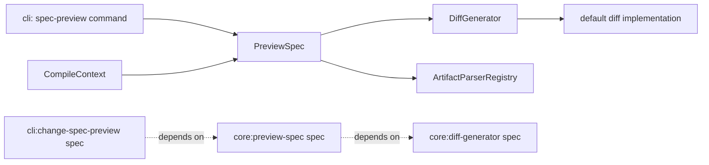

# Design: move-diff-to-core

## Non-goals

- Adding new HTTP API or MCP endpoints in this change. This design only makes diff generation reusable from core so those hosts can adopt it later.
- Creating a public extension point for external hosts to inject their own diff generators through kernel-builder APIs. The diff capability remains an internal core concern in this change.
- Changing CLI command syntax, text labels, artifact filtering behavior, or warning routing beyond replacing local diff synthesis with data returned by core.
- Adding user-facing documentation under `docs/`. External behavior stays the same, so no documentation update is required for this change.

## Affected areas

- `PreviewSpec` in `packages/core/src/application/use-cases/preview-spec.ts`
  Change: add a `DiffGenerator` constructor dependency, add an opt-in `includeDiff?: boolean` input flag, and add an optional `diff?: string` field on returned `PreviewSpecFileEntry` values.
  Callers: 12 direct dependents, 38 indirect dependents, 33 transitive dependents · Risk: CRITICAL
  Note: this is a shared integration point for CLI preview and `CompileContext`, so the default path must remain backward-compatible and diff generation must stay opt-in.

- `createPreviewSpec()` and `resolvePreviewSpecDeps()` in `packages/core/src/composition/use-cases/preview-spec.ts`
  Change: resolve and pass the new diff capability into `PreviewSpec` for both explicit-deps and config-based factory paths, while keeping the explicit factory deps path backward-compatible by defaulting the dependency when omitted.
  Callers: config-based core composition and test factories · Risk: MEDIUM
  Note: this is the canonical composition entry for the use case and is the right place to shield public factory consumers from the new constructor dependency.

- `CompositionResolver` in `packages/core/src/composition/composition-resolver.ts`
  Change: add one memoized `getDiffGenerator()` resolver method that returns the internally selected default implementation.
  Callers: `resolvePreviewSpecDeps()` only in this change · Risk: MEDIUM
  Note: the capability stays internal to core composition; no new additive registry or builder registration surface is required.

- Composition diff selection in `packages/core/src/composition/diff-generator.ts`
  Change: introduce the composition-layer factory that chooses the default `DiffGenerator` implementation.
  Callers: `CompositionResolver` only in this change · Risk: LOW
  Note: this matches existing repo patterns such as `createVcsAdapter()` and `createDefaultConfigLoader()`, where composition chooses concrete infrastructure implementations.

- CLI command `registerChangeSpecPreview()` in `packages/cli/src/commands/change/spec-preview.ts`
  Change: request diff-enabled previews when `--diff` is set, consume `file.diff` returned by core, and stop calling `createTwoFilesPatch` locally.
  Callers: 2 direct dependents (`packages/cli/src/index.ts`, `packages/cli/test/commands/change/spec-preview.spec.ts`) · Risk: LOW
  Note: text colorization and artifact filtering remain in the CLI adapter.

- Core package dependency manifest in `packages/core/package.json`
  Change: add the runtime dependency used by the default diff implementation in core.
  Risk: LOW
  Note: the chosen library is encapsulated behind `DiffGenerator`.

- CLI package dependency manifest in `packages/cli/package.json`
  Change: remove the direct `diff` runtime dependency if it becomes unused after the refactor.
  Risk: LOW
  Note: `chalk` remains because CLI still colorizes text output.

- Core tests in `packages/core/test/application/use-cases/preview-spec.spec.ts`
  Change: add coverage for `includeDiff`, `diff` field population, empty-base behavior for new files, and diff-generation failure warnings.
  Risk: HIGH
  Note: this file is the main executable contract for the changed use case.

- Core composition tests in `packages/core/test/composition/use-cases/preview-spec.spec.ts`
  Change: assert config-based construction resolves the default diff generator and explicit deps still work.
  Risk: MEDIUM

- Shared core test helpers in `packages/core/test/application/use-cases/helpers.ts`
  Change: update any `PreviewSpec` stubs or constructor helpers so callers can continue building test subjects without accidental breakage.
  Risk: MEDIUM

- `CompileContext` tests in `packages/core/test/application/use-cases/compile-context.spec.ts`
  Change: keep existing preview stubs compatible with the expanded result shape and confirm context compilation does not require diff generation.
  Risk: MEDIUM

- CLI tests in `packages/cli/test/commands/change/spec-preview.spec.ts`
  Change: assert `--diff` uses returned diff strings, structured output forwards `diff`, and no local diff synthesis remains.
  Risk: MEDIUM

## New constructs

- `packages/core/src/application/ports/diff-generator.ts`
  Shape:

  ```ts
  export interface DiffGeneratorInput {
    readonly filename: string
    readonly base: string
    readonly merged: string
    readonly contextLines?: number
  }

  export interface DiffGenerator {
    generate(input: DiffGeneratorInput): string
  }
  ```

  Responsibility: define the application-layer capability that turns preview file content into a plain unified diff string.
  Relationships: consumed by `PreviewSpec`; implemented by one default core implementation; no domain code or delivery mechanism should import the concrete library directly.

- `packages/core/src/infrastructure/diff/diff-generator.ts`
  Shape:

  ```ts
  import { type DiffGenerator } from '../../application/ports/diff-generator.js'

  export class DiffDiffGenerator implements DiffGenerator
  ```

  Responsibility: provide the concrete library-backed implementation for unified diff generation inside core.
  Relationships: instantiated only from composition, called only through the `DiffGenerator` interface, depends on the chosen diff library, and returns plain text only.

- `packages/core/src/composition/diff-generator.ts`
  Shape:

  ```ts
  import { type DiffGenerator } from '../application/ports/diff-generator.js'

  export function createDefaultDiffGenerator(): DiffGenerator
  ```

  Responsibility: choose the default concrete `DiffGenerator` implementation for core composition.
  Relationships: imports `DiffDiffGenerator` from infrastructure, returns the port type, and is the only place in this change that decides the default implementation.

## Approach

1. Add an internal diff-generation port to core.
   The new `DiffGenerator` interface lives in `application/ports/` because `PreviewSpec` is application logic and must not depend directly on a concrete library. Its input is file-oriented, not host-oriented: `filename`, `base`, `merged`, and optional `contextLines`. The output is one plain unified diff string.

2. Add one concrete implementation in core infrastructure.
   `DiffDiffGenerator` in `infrastructure/diff/diff-generator.ts` uses the selected library to produce unified diffs with:
   - base label `a/<filename> (base)`
   - merged label `b/<filename> (merged)`
   - 3 context lines when the caller does not pass `contextLines`

   The implementation is intentionally small and pure. It does not colorize, filter files, write logs, or know anything about CLI rendering.

   Composition then wraps that with `createDefaultDiffGenerator()` in `composition/diff-generator.ts`. That composition helper is the only place that decides the default implementation, which matches existing repo structure where composition helpers such as `createVcsAdapter()` choose concrete infrastructure classes.

3. Expand `PreviewSpec` without changing its default behavior.
   `PreviewSpecInput` becomes:

   ```ts
   export interface PreviewSpecInput {
     readonly name: string
     readonly specId: string
     readonly includeDiff?: boolean
   }
   ```

   `PreviewSpecFileEntry` becomes:

   ```ts
   export interface PreviewSpecFileEntry {
     readonly filename: string
     readonly base: string | null
     readonly merged: string
     readonly diff?: string
     readonly status: 'merged' | 'no-op' | 'missing'
   }
   ```

   Constructor becomes:

   ```ts
   constructor(
     changes: ChangeRepository,
     specs: ReadonlyMap<string, SpecRepository>,
     schemaProvider: SchemaProvider,
     parsers: ArtifactParserRegistry,
     diffGenerator: DiffGenerator,
   )
   ```

   Execution flow is:
   - Load the change and validate schema/spec membership exactly as today.
   - Build preview entries exactly as today for `missing`, `no-op`, `merged`, and new-spec cases.
   - Only after each preview entry has final `filename`, `base`, `merged`, and `status`, decide whether diff generation applies.
   - If `includeDiff !== true`, do nothing else.
   - If `includeDiff === true` and `status === 'merged'`, call:
     ```ts
     diffGenerator.generate({
       filename: entry.filename,
       base: entry.base ?? '',
       merged: entry.merged,
     })
     ```
   - Store the returned string in `entry.diff`.
   - If `diffGenerator.generate()` throws, append a warning and keep the preview entry as `merged` without `diff`.
   - Never generate diffs for `no-op` or `missing` entries.

4. Keep `CompileContext` on the non-diff path.
   `CompileContext` already depends on `PreviewSpec` for materialized views. This change must not make context compilation compute diffs or depend on diff output. All existing internal calls to `PreviewSpec.execute()` outside CLI remain unchanged and therefore observe `includeDiff` as omitted/false.

5. Resolve the new capability inside core composition only.
   `CompositionResolver` gains a memoized getter:

   ```ts
   getDiffGenerator(): DiffGenerator
   ```

   It calls `createDefaultDiffGenerator()` once per composition session.

   `PreviewSpecDeps` becomes:

   ```ts
   export interface PreviewSpecDeps {
     readonly changes: ChangeRepository
     readonly specs: ReadonlyMap<string, SpecRepository>
     readonly schemaProvider: SchemaProvider
     readonly parsers: ArtifactParserRegistry
     readonly diffGenerator?: DiffGenerator
   }
   ```

   `resolvePreviewSpecDeps()` returns the new field from `resolver.getDiffGenerator()`.

   `createPreviewSpecFromNormalized()` handles explicit deps with:

   ```ts
   const diffGenerator = input.deps.diffGenerator ?? createDefaultDiffGenerator()
   ```

   so public factory consumers can continue instantiating the use case without importing the default implementation helper explicitly, while advanced callers can still override the port for tests or specialized composition.

   No new kernel-builder registration API is added in this change. The capability is internal and always resolved by composition, which is the single place that decides the default implementation for config-based construction and for explicit factory calls that omit the dependency.

6. Simplify the CLI adapter.
   `registerChangeSpecPreview()` changes behavior only in diff mode:
   - when `opts.diff === true`, call `kernel.changes.preview.execute({ name, specId, includeDiff: true })`
   - when `opts.diff !== true`, keep the existing call shape

   Text mode:
   - keep current file sorting and header rendering
   - for each file, render `file.diff` if present
   - skip files where `file.diff` is absent
   - colorize returned diff lines with existing `chalk` rules

   Structured output:
   - when `--diff` is set, return the `PreviewSpecResult` object as received from core after any artifact filtering
   - do not synthesize `diff` fields in CLI

   Artifact filtering remains filename-based against schema output exactly as today.

7. Move the runtime dependency from CLI to core.
   The diff library becomes a core runtime dependency because the default implementation now lives in core. CLI removes its direct diff dependency if no longer used.

8. Do not update `docs/`.
   This change is internal refactoring plus reusable data exposure. User-facing command syntax and observable text output remain the same, so no `docs/` change is required.

## Key decisions

- **Diff generation stays opt-in in `PreviewSpec`** → `PreviewSpec` is a CRITICAL shared integration point with 63 affected files through its dependents. Making diff generation unconditional would add unnecessary work to `CompileContext` and every non-diff caller.  
  **Alternatives rejected** → always generate `diff` for every merged file; rejected because it changes default cost and broadens behavior for callers that do not need it.

- **Use a narrow `DiffGenerator` port instead of importing the diff library directly into `PreviewSpec`** → this preserves the hexagonal boundary and allows the concrete library to change later with no use-case contract rewrite.  
  **Alternatives rejected** → direct `createTwoFilesPatch` import in `PreviewSpec`; rejected because it hard-couples application logic to one infrastructure choice.

- **Keep the capability internal to core composition** → the user intent is not to expose a new public host extension point. `PreviewSpec` needs decoupling from the library, not a user-configurable plugin surface, and composition should be the only place that chooses the default implementation, consistent with existing repo patterns such as `createVcsAdapter()`.  
  **Alternatives rejected** → new kernel-builder registration API for diff generators; rejected because it adds public surface area and maintenance cost without a current use case.

- **Default the dependency at the public factory boundary, not in infrastructure** → `PreviewSpec` itself still receives a concrete `DiffGenerator`, but `createPreviewSpec(...)` can supply the default when explicit deps omit it. This avoids turning `createDefaultDiffGenerator()` into a required SDK-level import for ordinary callers while preserving testability and constructor clarity.  
  **Alternatives rejected** → require every explicit factory consumer to import `createDefaultDiffGenerator()`; rejected because it leaks an internal composition choice into a wider API surface with little value.

- **Model diff generation as a file-oriented input object** → `filename`, `base`, `merged`, and `contextLines` are the minimum stable inputs needed to preserve current CLI-compatible unified diff labels and behavior.  
  **Alternatives rejected** → `generate(base, merged)` only; rejected because the implementation would need to invent labels or rely on hidden conventions.

- **Treat diff-generation failure as a warning, not a preview failure** → merged preview content is still valid and useful even if diff synthesis fails.  
  **Alternatives rejected** → downgrade the file to `missing` or throw; rejected because that would lose already computed preview data and violate the tolerant partial-result behavior of `PreviewSpec`.

## Trade-offs

- `[Shared use-case signature change]` → updating `PreviewSpec` constructor and result types touches broad core test helpers and composition code.  
  Mitigation: keep the new input optional, keep the new output field optional, and update stubs/helpers first.

- `[Internal capability without public override]` → custom hosts cannot swap diff behavior through builder APIs in this change.  
  Mitigation: the interface boundary still exists; adding an override path later is additive if a real consumer appears.

- `[Dependency relocation]` → moving the diff library from CLI to core shifts package ownership and may affect lockfile or workspace dependency graphs.  
  Mitigation: update package manifests explicitly and verify both `@specd/core` and `@specd/cli` tests after the move.

## Spec impact

### `core:preview-spec`

- Direct dependent spec in this change scope: `cli:change-spec-preview`
- No additional dependent specs requiring requirement changes were discovered during current scope review.
- Impact assessment:
  - `cli:change-spec-preview` depends on `PreviewSpec` result shape and diff ownership, so it must change in the same change. That is already covered.
  - `CompileContext` depends on the `PreviewSpec` symbol in code, but not through a spec dependency that requires requirement changes. The requirement-level compatibility rule is handled by keeping diff generation opt-in.

### `cli:change-spec-preview`

- No further spec dependents were identified that require requirement changes.
- Impact assessment:
  - This spec is a leaf delivery adapter contract in the current scope.
  - Its behavior change is implementation ownership only: diff data now comes from core instead of being synthesized in CLI.

### `core:diff-generator`

- New spec introduced by this change.
- No downstream specs require updates in this same change because the capability is internal and only `core:preview-spec` depends on it today.

## Dependency map



```text
┌──────────────────────────────────────┐
│ cli: registerChangeSpecPreview()     │
│ packages/cli/src/commands/change/... │
└───────────────────┬──────────────────┘
                    │ requests includeDiff
                    ▼
          ┌───────────────────────┐
          │ PreviewSpec [CRITICAL]│
          │ packages/core/src/... │
          └──────────┬────────────┘
                     │ merged-only diff generation
         ┌───────────┴───────────┐
         ▼                       ▼
┌───────────────────┐   ┌────────────────────────┐
│ DiffGenerator     │   │ ArtifactParserRegistry │
│ application/ports │   │ existing preview merge │
└─────────┬─────────┘   └────────────────────────┘
          │ default impl
          ▼
┌──────────────────────────────┐
│ createDiffGenerator()        │
│ core infrastructure          │
└──────────────────────────────┘

┌────────────────────────┐    depends on    ┌────────────────────────┐
│ cli:change-spec-preview│ ─ ─ ─ ─ ─ ─ ─ ─▶ │ core:preview-spec      │
└────────────────────────┘                  └──────────┬─────────────┘
                                                       │ depends on
                                                       ▼
                                              ┌───────────────────────┐
                                              │ core:diff-generator   │
                                              └───────────────────────┘
```

## Migration / Rollback

- Migration:
  - add the diff runtime dependency to `packages/core/package.json`
  - remove the direct diff dependency from `packages/cli/package.json` if unused
  - regenerate the lockfile if package ownership changes

- Rollback:
  - restore CLI-local diff synthesis
  - remove `DiffGenerator` from `PreviewSpec`
  - move the diff dependency back to CLI

No data migration, archive migration, config migration, or runtime state migration is required.

## Testing

Automated tests:

- `packages/core/test/application/use-cases/preview-spec.spec.ts`
  - add tests for `includeDiff` omitted/false -> no `diff` field and no diff-generator call
  - add tests for `includeDiff: true` on an existing merged artifact -> `diff` field present
  - add tests for `includeDiff: true` on a new spec artifact -> empty-string base passed to generator
  - add tests for `no-op` and `missing` entries -> no diff generation
  - add tests for diff-generator failure -> warning emitted and entry remains `merged`

- `packages/core/test/composition/use-cases/preview-spec.spec.ts`
  - assert config-based factory wiring includes the default diff generator
  - assert explicit dependency construction requires and passes `diffGenerator`

- `packages/core/test/application/use-cases/helpers.ts`
  - update `PreviewSpec`-related helpers/stubs for the expanded constructor and optional `diff` field

- `packages/core/test/application/use-cases/compile-context.spec.ts`
  - confirm existing `CompileContext` preview stubs remain valid
  - add or update one assertion that compile-context paths do not require `includeDiff`

- `packages/core/test/infrastructure/diff/diff-generator.spec.ts`
  - add focused tests for:
    - plain unified diff output
    - default 3 context lines
    - label format `a/<filename> (base)` and `b/<filename> (merged)`
    - empty-base handling for newly created files

- `packages/core/test/composition/diff-generator.spec.ts`
  - add focused tests for:
    - `createDefaultDiffGenerator()` returns a `DiffGenerator`
    - composition remains the only layer selecting the default implementation

- `packages/cli/test/commands/change/spec-preview.spec.ts`
  - assert `--diff` passes `includeDiff: true`
  - assert text mode renders `file.diff` and no longer depends on local diff synthesis
  - assert JSON/TOON mode forwards returned `diff` fields unchanged
  - assert artifact-filtered diff mode skips files whose `diff` is absent

Manual / E2E verification:

- Run core tests covering preview and composition paths.
- Run CLI tests covering `change spec-preview`.
- Run lint for `@specd/core` and `@specd/cli`.
- Manually exercise:
  - `node packages/cli/dist/index.js changes spec-preview <change> core:preview-spec --format text`
  - `node packages/cli/dist/index.js changes spec-preview <change> core:preview-spec --diff --format text`
  - `node packages/cli/dist/index.js changes spec-preview <change> core:preview-spec --diff --format toon`

Expected outcomes:

- non-diff mode still prints merged content exactly as before
- diff mode prints the same unified diff text as before, now sourced from core
- toon/json diff mode includes `diff` fields without ANSI codes
- warnings still print to stderr
- `CompileContext`-related tests do not require diff output and continue to pass

Applicable global constraints:

- architecture: the port stays in application, the library-backed implementation stays outside domain/application, and no I/O is added to domain logic
- conventions: ESM imports, no default exports, no `any`, stable named exports only
- testing: unit tests remain focused by layer, with mocked ports for application-layer use cases
- docs/jsdoc: new exported interfaces and factories need concise JSDoc consistent with existing core files

## Open questions

None.
