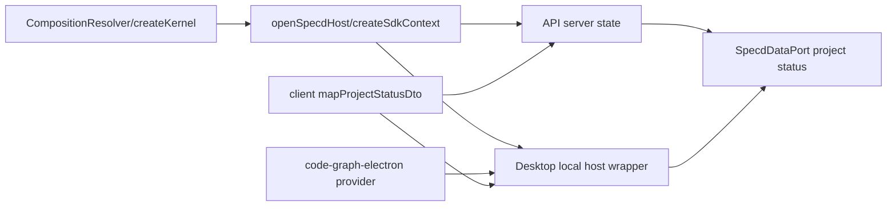

# Design: align-user-interface-with-main-conventions

## Objectives

Merge the mainline composition, repository, configuration, and VCS changes into the
Studio branch without losing the branch-only API, client, desktop, artifact-editing,
batch-validation, or log-readback capabilities. The resulting tree has one canonical
composition model, main-owned host primitives, adapter-neutral VCS access, and one
project-status DTO mapper shared by HTTP and IPC.

The merge is complete when all packages build and test, API and desktop open the same
project through SDK composition, desktop still uses the Electron graph runtime, and
HTTP and IPC return the same `ProjectStatusDto` for equivalent inputs.

## Non-goals

- Do not extract or consolidate `formatCompiledContextMarkdown`; its API/desktop
  duplication is intentionally deferred.
- Do not remove branch-only Studio, API, client, desktop, artifact, validation, or
  log-readback behavior merely because those files do not exist on main.
- Do not restore mainline-deleted `kernel-internals.ts`, kernel graph-store
  registration, or direct Git construction.
- Do not change lifecycle semantics, persistence formats, auth policy, HTTP routes,
  IPC method names, or Electron native-runtime packaging.
- Do not make `@specd/client` depend on `@specd/core` or `@specd/sdk`.

## Constraints

- All packages remain ESM except the intentionally bundled Electron CommonJS entry.
- Composition is manual dependency injection; no service locator is exposed to
  delivery packages and no IoC library is introduced.
- Domain and application layers remain independent of filesystem, HTTP, Electron,
  and concrete VCS implementations.
- Public factories and types use named exports, strict TypeScript, no `any`, and
  JSDoc for public symbols.
- Existing `createSdkContext(config, kernelOptions)` callers remain source
  compatible.
- Config discovery is bounded by the VCS adapter selected by
  `createDefaultConfigLoader`, with the null adapter outside a repository.
- Graph providers are opened and closed per operation; a project switch closes all
  desktop providers before the next host is used.

## Affected areas

### Core composition

Main's resolver, composition registries, kernel builder, and graph-store removal are
accepted as merge input without UI-branch extensions. Manual adaptation is limited to
the files changed by this branch:

- `packages/core/src/composition/kernel.ts` changes `createKernel` to construct one
  `CompositionResolver` and pass its cached ports and use cases to every kernel
  group, including retained UI branch capabilities.
- `packages/core/src/composition/config-loader.ts` exports async
  `createDefaultConfigLoader`; all production callers await it.
- `packages/core/src/infrastructure/fs/config-loader.ts` receives a VCS root from
  composition and does not execute Git commands itself.
- `packages/core/src/application/specd-config.ts` and config parser tests retain the
  generalized adapter-binding model from main. Legacy configuration is normalized
  only through the compatibility rules already present on main.
- `packages/core/src/composition/index.ts` and `packages/core/src/index.ts` export
  the resolver, registries, default loader, repository factories, and retained
  branch-only factories; removed internals and graph-store APIs are not exported.

`createKernel` is CRITICAL risk: graph impact reports 8 direct, 18 indirect, and 61
transitive dependents for its file. Main's surrounding public surface remains
unchanged; only branch capability integration is reconciled.

### Core use-case factories

All files under `packages/core/src/composition/use-cases/` are rebased onto the
mainline `createX(deps)` plus resolver-backed convenience-factory pattern. This
includes mainline factories and branch-only:

- `get-change-artifact.ts`
- `get-read-only-change-artifact.ts`
- `save-change-artifact.ts`
- `outline-change-artifact.ts`
- `validate-change-batch.ts`
- `read-log.ts`

Tests under `packages/core/test/composition/`,
`packages/core/test/composition/use-cases/`, and
`packages/core/test/infrastructure/fs/` are updated for resolver identity,
repository overrides, async loader creation, and retained branch-only capabilities.

### Code graph and SDK

- `packages/code-graph-electron/src/composition/` retains the Electron SQLite
  provider behind the same provider lifecycle contract.
- `packages/sdk/src/core-reexports.ts` and `packages/sdk/src/index.ts` retain exports
  for branch-owned core capabilities while accepting main's host and graph
  orchestration exports unchanged.
- `packages/sdk/src/host-context.ts` remains the sole public bootstrap entry for
  long-lived hosts. API and desktop keep calling `createSdkContext` instead of
  constructing `createKernel` directly, while host-specific runtime wiring stays in
  the owning delivery package.

`host-context.ts` is CRITICAL because it is consumed by CLI graph commands, API,
desktop, and SDK orchestration. That risk is a reason to leave its main-owned public
contract unchanged in this branch.

### CLI

- `packages/cli/src/load-config.ts` and `packages/cli/src/index.ts` await
  `createDefaultConfigLoader` and print `config.warnings` once.
- `packages/cli/src/helpers/sdk-host.ts` remains the full-host entry point.
- `packages/cli/src/index.ts` and loader imports are reconciled with main's async
  default loader while preserving UI branch commands.
- CLI entrypoint tests verify config warnings, discovery, and no-subcommand behavior.

### API

- `packages/api/src/composition/create-api-server.ts` awaits
  `createDefaultConfigLoader({ startDir: projectRoot })`, loads the complete active
  cascade once, and calls `createSdkContext(config, kernelOptions)` once. The kernel
  options contain the existing `LogRingBuffer(500)` and non-color log formatter.
- `packages/api/src/delivery/http/dto/project-status.ts` is removed or changed to a
  type re-export from `@specd/client`; there is one canonical interface.
- `packages/api/src/delivery/http/presenters/presenter-project.ts` keeps
  `toProjectDto`, but status presentation delegates to
  `mapProjectStatusDto`.
- `packages/api/src/delivery/http/handlers/handler-project.ts` passes the effective
  server auth type into status presentation.
- `packages/api/src/delivery/http/openapi-schemas.ts` describes the canonical
  required `auth` field and optional specs, graph, and approvals fields.
- API tests cover startup, config warnings, auth, logs, graph health, project status,
  OpenAPI, and response parity with client fixtures.

### Client and desktop

- `packages/client/src/dto/project-status.ts` remains the canonical DTO owner and
  adds structural input types plus `mapProjectStatusDto`.
- `packages/client/src/dto/index.ts` and `packages/client/src/index.ts` export the
  mapper and its input types.
- `apps/specd-studio-desktop/src/main/ipc-handlers.ts` awaits main's
  `createDefaultConfigLoader({ startDir: activeProjectRoot })`, loads the complete
  active cascade, calls `createSdkContext` once, and keeps `createCodeGraphProvider`
  from `@specd/code-graph-electron` inside a typed desktop-owned host. It deletes
  `toSdkHostContext` and the local project-status mapper.
- Desktop `getProjectStatus` passes structural snapshot and effective auth input to
  the client mapper. It includes specs-by-workspace and approvals when supplied by
  the snapshot, matching HTTP.
- Desktop provider tracking and session-generation checks remain. Switching projects
  closes tracked providers, clears the host promise and log ring, increments the
  generation, and rejects results from the superseded generation.
- `apps/specd-studio-desktop/src/main/index.ts` retains project selection and
  teardown calls.
- Desktop tests cover one host per project, project switch cleanup, selected-root
  discovery, desktop-owned Electron providers, no unsafe SDK cast, graph operations, and
  HTTP/IPC status parity.

### Package and generated artifacts

`package.json` files, `pnpm-lock.yaml`, TypeScript project references, and public
exports are reconciled after source changes. `specd.yaml`, spec locks, and metadata
are regenerated only through project tooling after implementation validation. Studio
workspaces and their specs must not be deleted when accepting mainline metadata
cleanup.

No generic core or SDK documentation is changed in this branch. Reusable host API
improvements are recorded separately in `MAIN_FOLLOW_UPS.md` for transfer to main and
are not part of this change.

## New constructs

### Canonical project-status mapper

Location: `packages/client/src/dto/project-status.ts`.

```typescript
export interface ProjectStatusGraphInput {
  readonly lastIndexedAt?: string | null
  readonly lastIndexedRef?: string | null
  readonly stale?: boolean | null
  readonly currentRef?: string | null
  readonly fingerprintMismatch?: boolean | null
  readonly fileCount?: number | null
  readonly documentCount?: number | null
  readonly symbolCount?: number | null
  readonly specCount?: number | null
}

export interface ProjectStatusMapperInput {
  readonly activeChanges: number
  readonly drafts: number
  readonly discarded: number
  readonly archived: number
  readonly specsByWorkspace?: Readonly<Record<string, number>>
  readonly graph?: ProjectStatusGraphInput | null
  readonly approvals?: {
    readonly specEnabled: boolean
    readonly signoffEnabled: boolean
  }
  readonly authType: string
}

export function mapProjectStatusDto(input: ProjectStatusMapperInput): ProjectStatusDto
```

The mapper copies counts, clones records, derives graph warnings with the existing
client warning helper, includes `indexed: true` when graph health is present, omits
`graph` when input graph is null or absent, preserves nullable diagnostics, copies
approvals when present, and always emits `auth: { type: input.authType }`. It is
deterministic, synchronous, side-effect free, and imports no core or SDK types.

API adapts `BuildProjectStatusSnapshotResult` to this structural input and uses the
effective server auth type. Desktop performs the same adaptation with the loaded
config auth type. No second graph-summary or status DTO mapper remains.

## Approach

The implementation MUST begin with a normal `git merge main` on this branch. It MUST
NOT copy selected mainline files or recreate mainline commits without recording the
merge. Files that merge cleanly remain the merge result; only conflicted files are
resolved manually. Convention-alignment edits happen after the repository has a
resolved merge state, so they are reviewable as branch adjustments rather than a
substitute for the merge.

1. Run the normal merge and resolve generated-file conflicts conservatively: retain
   Studio workspaces and branch-only specs/code, accept mainline composition
   architecture, and regenerate derived metadata instead of hand-merging stale hashes.
2. Within source conflicts, resolve core composition first. Use the incoming mainline
   resolver/registries as the base, port branch-only capabilities onto that base,
   remove core graph-store ownership, migrate the kernel builder, and make all
   config/VCS paths adapter-neutral.
3. Port every branch-only use-case factory onto resolver dependencies. Preserve its
   public kernel location and behavior, then run core tests before touching hosts.
4. Reconcile code-graph composition and accept SDK source/exports from main without
   adding UI-specific host options.
5. Move CLI and API to main's SDK/default-loader primitives. Preserve config warnings,
   auth, CORS, OpenAPI, log ring, static UI, and error normalization.
6. Align desktop's local host wrapper with main's loader and `createSdkContext` while
   keeping Electron graph composition in desktop. Preserve generation-based
   cancellation and provider teardown.
7. Add the client status mapper and replace API/desktop mappings. Update OpenAPI and
   contract fixtures to the canonical shape.
8. Reconcile package dependencies, docs, lockfile, spec locks, and metadata. Run
   package tests, lint, build, graph index, and end-to-end smoke checks.

Configuration errors propagate unchanged through existing CLI/API/IPC error
normalization. Provider open failures still close any opened resource in `finally`.
Desktop project-switch teardown does not retry failed operations against the new
project; callers receive `SessionSupersededError` and initiate a fresh request.

No persistent-data migration is required. Runtime config is loaded once per host,
and each graph operation receives a fresh provider bound to that same config.

## Key decisions

**Mainline composition is authoritative.** This prevents two resolver/registry models.
Restoring branch internals was rejected because every future main merge would repeat
the conflict.

**Graph storage belongs to code-graph, not core.** Core only exposes business ports and
composition. Keeping graph registration in `KernelBuilder` was rejected because it
creates a reverse dependency on an optional subsystem.

**Generic SDK changes stay on main.** API and desktop compose from the public loader
and `createSdkContext` primitives already provided by main. Passing the base
`specd.yaml` to `openSpecdHost.configPath` was rejected because forced mode would not
automatically include later local cascade candidates. Extending `openSpecdHost` with
`startDir` or adding provider injection here was rejected because reusable SDK changes
require a separate main change.

**The client package owns status DTO mapping.** It already owns the cross-transport DTO
and warning derivation. API ownership was rejected because desktop would depend on the
HTTP package; SDK ownership was rejected because DTO presentation is not orchestration.

**Unavailable graph health omits `graph`.** This uses the DTO's existing optional
contract and gives HTTP and IPC one semantic. Transport-specific null-filled or
`indexed: false` objects were rejected as the source of current drift.

**Compiled-context Markdown remains duplicated.** Consolidation was rejected for this
change because it has an independent ownership/API decision and no relation to host
composition correctness.

## Trade-offs

- The exact 29-file implementation set has CRITICAL blast radius: 111 direct, 135
  indirect, 274 transitive dependents, and 236 affected files. Mitigation: migrate and
  test core, SDK, CLI, API, and desktop in that order; do not batch all fixes behind
  one final build.
- API and desktop retain small host-specific composition functions. Mitigation: each
  calls the same main-owned loader and `createSdkContext` primitives once, while
  transport/runtime-specific state remains in its owning package.
- Omitting unavailable graph health changes API output from a null-filled object.
  Mitigation: the field is already optional in the canonical contract; update OpenAPI
  and fixtures atomically and test remote/embedded parity.
- Shared presentation in client increases client responsibility slightly. Mitigation:
  input is structural and pure, so dependency direction and testability remain sound.
- Mainline metadata deletes collide with branch-only workspaces. Mitigation: never
  accept those deletes wholesale; regenerate metadata from the merged spec tree.

## Spec impact

- `sdk:composition` affects UI imports of branch-owned core capabilities. Main's host
  and graph orchestration contracts remain unchanged.
- `sdk:host-context` now explicitly requires Studio hosts to bootstrap through
  `createSdkContext`. Its direct dependents are
  `api:composition-create-api-server`, `studio-desktop:ipc-handler-registry`, and
  `studio-desktop:main-kernel-lifecycle`; transitive impact flows into API project
  status/log delivery and desktop graph/session lifecycle. Those dependents remain
  satisfied because this change keeps one process-scoped API host, one active desktop
  host per selected project, and desktop-owned Electron graph composition outside the
  SDK bootstrap contract.
- `client:dto-project-status` affects `client:port-project`, API DTO/presenter/routes,
  desktop IPC, remote adapter, memory adapter, and UI project hooks. Return type and
  field names remain stable; API gains required auth parity and desktop gains optional
  specs/approvals parity.
- `api:presenter-project` affects project handler/OpenAPI tests only. It still maps
  snapshots without business rules, now through the canonical pure mapper.
- `studio-desktop:ipc-handler-registry` affects preload and renderer only through the
  existing `SpecdDataPort`; no IPC envelope or method changes.
- Scoped no-op specs cover branch code that must be reconciled with the merge while
  preserving its existing behavior.

No additional dependent spec requires a normative delta. `client:port-project`
already requires identical HTTP/IPC signatures, API DTO/routes already require auth
and optional graph semantics, and desktop lifecycle already requires one SDK host.

## Dependency map



```text
+----------------------+       +----------------------------+
| Core composition     |------>| SDK host [CRITICAL]        |
| resolver + kernel    |       | main-owned host primitives |
+----------------------+       +------+----------+----------+
                                     |          |
                         +-----------+          +-----------+
                         v                                  v
                  +-------------+                    +--------------+
                  | API host    |                    | Desktop host |
                  | std graph   |                    | Electron DB  |
                  +------+------+                    +------+-------+
                         |                                  |
                         +---------------+  +---------------+
                                         v  v
                              +------------------------+
                              | client status mapper   |
                              | canonical DTO          |
                              +-----------+------------+
                                          |
                                          v
                              +------------------------+
                              | UI SpecdDataPort       |
                              +------------------------+
```

## Migration / Rollback

The merge is source-only and has no database or config migration. Existing
`specd.yaml` files continue to load through mainline compatibility normalization.
The Electron SQLite database format is unchanged.

If integration fails before merge completion, revert the implementation commit group
as a unit; do not restore only `kernel-internals.ts` because mixed composition models
are unsupported. Runtime rollback is the previous branch build. No persisted state
cleanup is needed. A failed desktop host open must close any providers created during
that attempt and leave the previous project either fully active or fully disposed.

## Testing

### Automated

- Core composition tests assert resolver caching, repository overrides, no graph-store
  APIs, factory equivalence, VCS provider use, async default loading, null-VCS
  discovery, and all retained branch-only use cases.
- SDK host tests from main cover cwd discovery, forced `configPath`, kernel-option
  forwarding, default provider instances, and cleanup on callback failure.
- CLI tests cover no-subcommand discovery, `--config`, warning output, project status,
  graph commands, index locks, and removal of direct bootstrap duplication.
- API tests cover one host per server, auth resolution, log ring readback, CORS,
  static UI, OpenAPI, graph health available/unavailable, and status DTO auth,
  specs-by-workspace, approvals, warnings, and diagnostics.
- Client tests add a table-driven `mapProjectStatusDto` suite for full input,
  unavailable graph, nullable diagnostics, empty warnings, immutability, and
  deterministic repeated calls. An architecture test ensures no core/SDK imports.
- Desktop tests cover selected-root discovery, one host per project, project-switch
  disposal, superseded requests, desktop-owned Electron providers, provider close on
  success/failure, no unsafe SDK cast, and local status mapping.
- A cross-adapter fixture feeds equivalent structural input to API and desktop and
  asserts deep equality of the resulting `ProjectStatusDto`.
- Existing package suites verify every unchanged requirement and scenario represented
  by no-op deltas.

Required commands:

```bash
pnpm --filter @specd/core test
pnpm --filter @specd/sdk test
pnpm --filter @specd/cli test
pnpm --filter @specd/client test
pnpm --filter @specd/api test
pnpm --filter @specd/code-graph test
pnpm --filter @specd/code-graph-electron test
pnpm --filter @specd/studio-desktop test
pnpm lint
pnpm build
node packages/cli/dist/index.js specs validate --format text
node packages/cli/dist/index.js graph index --format toon
```

### Manual and E2E

1. Run CLI status and graph status from the repository root and from a nested
   directory. Both must discover the same config and print each config warning once.
2. Start the API for an explicit project root, request
   `GET /v1/project/status`, and validate the response against generated OpenAPI.
   Auth must be present and unavailable graph health must omit `graph`.
3. Start desktop, open a project that is not the process cwd, inspect project status,
   run graph status/search/index, then switch projects. Paths and counts must switch,
   old requests must not leak results, and no provider remains open.
4. Compare API and desktop project-status JSON for the same project. Counts, auth,
   specs, approvals, graph diagnostics, warnings, nullability, and omitted fields must
   match.
5. Build and launch the bundled Electron main entry to verify native SQLite loading
   and plain-text log readback.

Documentation examples are compiled or smoke-tested where supported. ESLint,
TypeScript strict mode, package-boundary rules, and the global architecture/testing
constraints apply to every changed file.
