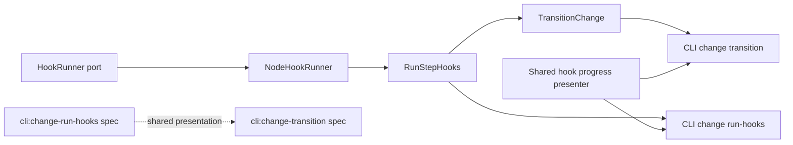

# Design: hook-live-progress

## Non-goals

- Changing workflow hook ordering, phase semantics, or exit-code ownership outside the already specified contracts.
- Introducing a new CLI command for watching hooks.
- Redefining external hook execution; this change only extends the shared progress pipeline used by `run:` hooks and any callers that consume it.
- Standardizing a cross-process event transport beyond the CLI process. Progress remains in-process and command-local.

## Affected areas

- `packages/core/src/application/ports/hook-runner.ts`
  Change: extend `HookRunner` so `run()` can emit in-flight progress events while preserving the final `HookResult`.
  Callers: `RunStepHooks` consumes this port directly; `CompositionResolver` provides the concrete implementation. Risk: HIGH because it changes an application-layer port contract and all test doubles must stay compatible.

- `packages/core/src/infrastructure/node/hook-runner.ts`
  Change: replace callback-buffered execution with streaming subprocess execution, incremental stdout/stderr capture, line emission, and heartbeat signalling.
  Callers: resolved through `CompositionResolver.getHookRunner()`. Risk: HIGH because it is the only built-in shell hook adapter and must remain cross-platform.

- `packages/core/src/application/use-cases/run-step-hooks.ts`
  Change: widen `HookProgressEvent`, relay runner progress, and update the final result contract to expose `failedHooks` as the complete failed subset.
  Callers: 13 direct dependents and CRITICAL graph risk, including `TransitionChange`, archive flows, kernel composition, and many tests.
  Impact note: event-shape drift here affects every hook-aware use case, so the design keeps the result contract stable and only extends progress events additively.

- `packages/core/src/application/use-cases/transition-change.ts`
  Change: map richer hook events into transition progress events, including phase-aware output and heartbeat events.
  Callers: 8 direct dependents and CRITICAL graph risk, including kernel composition and CLI transition tests.

- `packages/cli/src/commands/change/run-hooks.ts`
  Change: consume richer hook progress, delegate rendering to a shared presenter helper, preserve `text` summaries on stdout, emit structured streams on stdout for `json|toon`, and keep exit code `2` for hook failures.
  Callers: `packages/cli/src/index.ts`. Risk: LOW at symbol level, but user-visible contract risk is HIGH.

- `packages/cli/src/commands/change/transition.ts`
  Change: replace the command-local hook renderer with the same shared hook-progress presenter used by `run-hooks`, while preserving transition-specific requires/repair-guide output and the terminal structured `complete` event.
  Callers: `packages/cli/src/index.ts`, `packages/cli/test/commands/change-transition.spec.ts`, `packages/cli/test/commands/change.spec.ts`. Graph risk: MEDIUM.

- `packages/cli/src/formatter.ts`
  Change: provide the single-line serializer used by both machine-readable progress records and terminal `complete` records.
  Callers: all structured CLI commands, plus the shared hook presenter. Risk: MEDIUM because any serializer drift would affect every `json|toon` consumer.

- `packages/core/test/infrastructure/node/hook-runner.spec.ts`
  Change: add streaming and heartbeat tests without losing current stdout/stderr/failure coverage.

- `packages/core/test/application/use-cases/run-step-hooks.spec.ts`
  Change: assert new `hook-output` and `hook-heartbeat` events, fail-fast behavior with progress, and the updated `failedHooks` result shape.

- `packages/core/test/application/use-cases/transition-change.spec.ts`
  Change: assert phase-aware propagation of richer hook progress events.

- `packages/cli/test/commands/change-transition.spec.ts`
  Change: replace spinner-only expectations with shared presenter expectations, including failure visibility and non-silent long-running hooks.

- `packages/cli/test/commands/change.spec.ts`
  Change: update any transition integration assertions affected by richer hook progress rendering.

## New constructs

- `packages/core/src/application/ports/hook-runner.ts`
  New types:

  ```ts
  export type HookRunnerProgressEvent =
    | { type: 'output'; stream: 'stdout' | 'stderr'; line: string }
    | { type: 'heartbeat'; elapsedMs: number }

  export type OnHookRunnerProgress = (event: HookRunnerProgressEvent) => void
  ```

  Updated port:

  ```ts
  export interface HookRunner {
    run(
      command: string,
      variables: TemplateVariables,
      onProgress?: OnHookRunnerProgress,
    ): Promise<HookResult>
  }
  ```

  Responsibility: define the shell-hook execution contract plus optional observational progress.

- `packages/cli/src/commands/change/_hook-progress-presenter.ts`
  New helper:

  ```ts
  export type HookPresenterFormat = 'text' | 'json' | 'toon'

  export type HookPresenterEvent =
    | {
        type: 'hook-start'
        phase?: 'pre' | 'post'
        hookId: string
        command: string
      }
    | {
        type: 'hook-output'
        phase?: 'pre' | 'post'
        hookId: string
        stream: 'stdout' | 'stderr'
        line: string
      }
    | {
        type: 'hook-heartbeat'
        phase?: 'pre' | 'post'
        hookId: string
        elapsedMs: number
      }
    | {
        type: 'hook-done'
        phase?: 'pre' | 'post'
        hookId: string
        success: boolean
        exitCode: number
      }

  export interface HookProgressPresenter {
    onEvent(event: HookPresenterEvent): void
    finalizeHook(result: {
      phase?: 'pre' | 'post'
      id: string
      command: string
      success: boolean
      exitCode: number
      stdout: string
      stderr: string
    }): void
    flush(): void
  }

  export function createHookProgressPresenter(options: {
    format: HookPresenterFormat
    stream: NodeJS.WriteStream
    tailLines?: number
    autoFinalizeOnDone?: boolean
  }): HookProgressPresenter
  ```

  Responsibility: centralize equivalent hook progress rendering for `change run-hooks` and `change transition`.

## Approach

The implementation is a four-stage pipeline:

1. `NodeHookRunner` emits shell-level progress.
2. `RunStepHooks` converts shell progress into hook-aware use-case progress.
3. `TransitionChange` enriches hook progress with phase context for transitions.
4. CLI commands pass equivalent hook events into one shared presenter helper and keep final command-specific result behavior.

### 1. Stream shell execution in `NodeHookRunner`

`NodeHookRunner` must stop using `execFile(..., callback)` because that API only exposes buffered output at process end. Replace it with `spawn(shell, [shellFlag, expanded], { stdio: ['ignore', 'pipe', 'pipe'] })`.

Execution rules:

- Keep shell discovery exactly as today: `%COMSPEC%` or `cmd.exe` on Windows, `$SHELL` or `/bin/sh` on Unix, only when the env path is absolute.
- Accumulate full `stdout` and `stderr` strings in memory for the final `HookResult`.
- Subscribe to `child.stdout` and `child.stderr` `data` events.
- Decode chunks as UTF-8 text.
- Maintain one line buffer per stream so progress events are emitted as complete logical lines.
- Emit `{ type: 'output', stream, line }` for every completed line.
- If the process exits with a trailing partial line, emit one final output event for that buffered line before resolving.
- Start a heartbeat timer when the child is spawned. Emit `{ type: 'heartbeat', elapsedMs }` only while the child is alive and only if no new output line has been emitted since the previous heartbeat window.
- Use a fixed default heartbeat interval of `5000` ms. This is long enough to avoid noisy output and short enough to keep humans and agents from assuming the process is stuck.
- Clear the heartbeat timer on `close` and on `error`.
- Preserve final exit-code normalization exactly as today: numeric child exit code when available, otherwise `1`.

No domain or application object may depend on `child_process`; this remains an infrastructure-only concern and respects the global architecture spec.

### 2. Extend `RunStepHooks` progress additively

`RunStepHooks` currently emits only `hook-start` and `hook-done`. Extend `HookProgressEvent` to:

```ts
export type HookProgressEvent =
  | { type: 'hook-start'; hookId: string; command: string }
  | { type: 'hook-output'; hookId: string; stream: 'stdout' | 'stderr'; line: string }
  | { type: 'hook-heartbeat'; hookId: string; elapsedMs: number }
  | { type: 'hook-done'; hookId: string; success: boolean; exitCode: number }
```

Rules:

- `hook-start` fires before invoking either shell or external execution.
- `hook-output` and `hook-heartbeat` are observational only and never influence fail-fast behavior.
- `hook-done` fires after the final `RunStepHookEntry` is created, for both success and failure.
- The final `RunStepHooksResult` contains full `hooks`, aggregate `success`, and `failedHooks`.
- Pre-phase fail-fast still returns immediately after the first failed hook result is recorded.
- Post-phase continues running remaining hooks even if one already failed.

For shell hooks, `RunStepHooks` passes an inline callback to `HookRunner.run()` and re-emits the mapped progress events. For external hooks, no new runner port is introduced in this change; external hooks continue to expose start/done only unless a future change extends that port as well. This keeps the current scope bounded while preserving the shared CLI presentation contract for equivalent events.

### 3. Propagate phase-aware progress through `TransitionChange`

`TransitionChange` currently adapts `RunStepHooks` progress into `TransitionProgressEvent`. Extend the transition event union additively:

```ts
export type TransitionProgressEvent =
  | { type: 'requires-check'; artifactId: string; satisfied: boolean }
  | {
      type: 'task-completion-failed'
      artifactId: string
      incomplete: number
      complete: number
      total: number
    }
  | { type: 'hook-start'; phase: 'pre' | 'post'; hookId: string; command: string }
  | {
      type: 'hook-output'
      phase: 'pre' | 'post'
      hookId: string
      stream: 'stdout' | 'stderr'
      line: string
    }
  | { type: 'hook-heartbeat'; phase: 'pre' | 'post'; hookId: string; elapsedMs: number }
  | { type: 'hook-done'; phase: 'pre' | 'post'; hookId: string; success: boolean; exitCode: number }
  | { type: 'transitioned'; from: ChangeState; to: ChangeState }
```

Implementation detail:

- Keep the existing phase boundaries: source.post hooks first, target.pre hooks second.
- Reuse one adapter function that decorates `RunStepHooks` events with the active phase rather than duplicating mapping logic inline twice.
- Preserve current failure semantics: hook failure still aborts the transition and results in command exit code `2` at the CLI transition layer.

### 4. Centralize CLI hook rendering in one presenter

`change run-hooks` and `change transition` must stop formatting hook progress independently. Both commands will construct the same `HookProgressPresenter` and forward equivalent hook events into it.

#### Presenter behavior in `text` format

The presenter is append-only in all environments. It must not branch into a TTY redraw mode.

Behavior:

- Every in-flight progress update is written to `stderr`.
- Completed hook summaries remain visible because the presenter never rewrites earlier lines.
- Long-running hooks remain observable because heartbeats append fresh lines instead of repainting one spinner row.
- This is the only supported human-readable mode; the prior interactive redraw path is removed entirely to avoid hidden progress under agent wrappers, redirected terminals, or other line-capturing environments.

Finalized text block shape:

```text
[done] pre › lint-config
  command: pnpm lint --filter @specd/core
  last output:
    src/foo.ts: ok
    src/bar.ts: ok
  exit: 0
```

Active stream shape:

```text
[running] target.pre › test-core
  command: pnpm test --filter @specd/core
  | ✓ should validate schema names
  | ✓ should reject invalid hook ids
  | running slow integration case...
[still running] target.pre › test-core (42s)
```

Failed finalized block shape:

```text
[failed] target.pre › test-core
  command: pnpm test --filter @specd/core
  exit: 1
  full output:
    RUN  v3.2.1 /workspace/packages/core
    × should stop on pre-hook failure
```

Rendering rules:

- Tail size defaults to `10` lines merged across stdout and stderr in arrival order.
- Hook start writes `[running] <phase?>hookId` and the command line once.
- Output lines append immediately with ` |` for stdout and ` !` for stderr.
- Heartbeats append `[still running] <phase?>hookId (<elapsed>)`, deduplicated by elapsed label so the presenter does not emit the same heartbeat line twice.
- Successful hook finalization writes only `[done] ...` and `exit: ...` to `stderr`; the detailed tail is deferred to the final stdout summary.
- For failed hooks, the presenter prints the full combined output in arrival order so the user does not lose failure context.
- If a hook emitted no output, the stream simply contains the start line, optional heartbeats, and the done/failed line.
- After the last hook finalizes, the command writes `[all hooks done] ...` plus a blank line to `stderr` as a hard separator before any stdout summary is consumed by a person or wrapper.

#### Presenter behavior in `json` and `toon`

Machine-readable formats use stdout for the entire structured stream:

- Each in-flight hook event is emitted as one single-line serialized record with `stream: "hook-progress"`.
- Command-specific non-hook events such as transition requirement checks are emitted as their own `stream: "change-transition"` records.
- The terminal result is also one single-line serialized record:
  - `stream: "run-hooks", event: { type: "complete", result: ... }`
  - `stream: "change-transition", event: { type: "complete", result: ... }`
- `stderr` is reserved for non-structured diagnostics only and must stay empty during normal structured progress.

Hook progress record examples:

```json
{"stream":"hook-progress","event":{"type":"hook-start","hookId":"test-core","command":"pnpm test --filter @specd/core"}}
{"stream":"hook-progress","event":{"type":"hook-output","hookId":"test-core","stream":"stdout","line":"running slow integration case..."}}
{"stream":"hook-progress","event":{"type":"hook-heartbeat","hookId":"test-core","elapsedMs":65000}}
{"stream":"hook-progress","event":{"type":"hook-done","hookId":"test-core","success":true,"exitCode":0}}
```

Terminal `run-hooks` completion examples:

```json
{"stream":"run-hooks","event":{"type":"complete","result":{"result":"ok","hooks":[{"id":"verifying-run-tests","command":"pnpm test","exitCode":0,"success":true}]}}}
{"stream":"run-hooks","event":{"type":"complete","result":{"result":"error","code":"HOOK_FAILED","failedHooks":[{"id":"verifying-run-tests","exitCode":1}],"hooks":[{"id":"verifying-run-tests","command":"pnpm test","exitCode":1,"success":false,"stderr":"..." }]}}}
```

Terminal `change-transition` completion examples:

```json
{"stream":"change-transition","event":{"type":"complete","result":{"result":"ok","name":"hook-live-progress","from":"implementing","to":"verifying"}}}
{"stream":"change-transition","event":{"type":"complete","result":{"result":"failure","name":"hook-live-progress","from":"implementing","to":"verifying","blockers":[{"code":"TASKS_INCOMPLETE","message":"..."}],"nextAction":{"targetStep":"verifying","command":"node packages/cli/dist/index.js changes tasks hook-live-progress","reason":"..."}}}}
```

For transition hook events, the phase field is included in the hook-progress payload. This keeps `run-hooks` and `transition` on one shared event contract while still allowing the transition command to interleave its own structured records on stdout.

This is the shared presentation model required by both CLI specs: same event names, same tailing rules, same heartbeat semantics, same failure-output expansion, different final stdout payloads only where the commands already differ.

### Command integration details

`packages/cli/src/commands/change/run-hooks.ts`:

- Build the shared presenter before invoking the use case.
- Pass `onProgress` to `kernel.changes.runStepHooks.execute(...)`.
- On each final `RunStepHookEntry`, call `presenter.finalizeHook(...)` in execution order before printing the final command result or exiting.
- Keep exit code `2` on hook failure.
- Remove command-local text rendering branches that currently print only `ok:` / `failed:`.

`packages/cli/src/commands/change/transition.ts`:

- Replace `makeProgressRenderer()` with a renderer that composes:
  - transition-specific lines for `requires-check`, `task-completion-failed`, and `transitioned`
  - the shared hook presenter for all `hook-*` events
- Keep repair-guide rendering and final stdout success payload unchanged.
- Remove the command-local interactive renderer entirely; the shared presenter now owns the append-only hook stream behavior.

## Key decisions

- **Decision**: use one shared CLI presenter helper for hook progress.
  **Rationale**: the user explicitly wants identical behavior between `change run-hooks` and `change transition`, and both specs now require a shared helper.
  **Alternatives rejected**: duplicated command-local renderers, because they will drift; a generic formatter-level abstraction, because the behavior is hook-specific rather than a repo-wide output concern.

- **Decision**: stream subprocess output with `spawn` and line-buffering.
  **Rationale**: progress needs to exist before process exit, and line-based events map directly to both human tails and machine-readable progress.
  **Alternatives rejected**: `execFile` with polling or temp-file tailing, because it keeps the current silence problem and introduces filesystem cleanup concerns.

- **Decision**: remove interactive TTY redraw mode and keep one append-only text stream.
  **Rationale**: the primary problem is hidden progress under agents, wrappers, and redirected terminals. A single append-only behavior is simpler, observable everywhere, and matches the implemented CLI contract.
  **Alternatives rejected**: keeping separate TTY and non-TTY behaviors, because they produce two user experiences and the redraw mode still loses information under capture.

- **Decision**: emit the full structured stream on stdout, including the terminal `complete` record.
  **Rationale**: `json` and `toon` are stream formats in this contract, not single-object payloads. Keeping all machine-readable records on stdout aligns channel semantics and avoids mixing structured data with diagnostics.
  **Alternatives rejected**: sending hook progress on stderr with one final stdout object, because it splits one machine-readable protocol across two channels and makes stream consumers more complex.

- **Decision**: keep external hook progress out of scope for now.
  **Rationale**: the modified specs only require equivalent presentation for equivalent events, and external hook runners do not currently expose richer events.
  **Alternatives rejected**: extending `ExternalHookRunner` in the same change, because it broadens the contract surface and test matrix beyond what this behavior change requires.

## Trade-offs

- `[Higher implementation complexity in CLI presenter]` → Mitigation: isolate all hook rendering in one helper with deterministic tests instead of spreading terminal logic across two commands.
- `[Heartbeat events may add noise]` → Mitigation: emit them only after a quiet interval and only while the subprocess is still active.
- `[Full failed output can be large]` → Mitigation: only failures expand to full output; successful hooks keep a capped tail.
- `[Structured output is now a stream, not one final object]` → Mitigation: the terminal `complete` record is explicit and one-line serialized, so consumers can process incrementally or simply retain the last matching record.

## Spec impact

### `core:hook-runner-port`

- Direct dependents: `core:run-step-hooks`
- Transitive dependents: `cli:change-run-hooks`, `core:transition-change`, `cli:change-transition`, archive-related hook consumers
- Assessment: no additional spec delta is required because the change is additive at the port level and all downstream behavior updates are already covered by the modified specs in this change.

### `core:run-step-hooks`

- Direct dependents: `cli:change-run-hooks`, `core:transition-change`
- Transitive dependents: `cli:change-transition`, archive workflows via shared hook execution
- Assessment: progress semantics expand additively; no new dependent requirement text is needed beyond the already modified CLI specs.

### `cli:change-run-hooks`

- Direct dependents: none beyond CLI entrypoint composition
- Transitive dependents: operationally paired with `cli:change-transition`
- Assessment: the spec now explicitly requires shared presentation with `cli:change-transition`; both specs were updated together, so there is no remaining untracked ripple.

### `cli:change-transition`

- Direct dependents: none beyond CLI entrypoint composition
- Transitive dependents: none that require requirement changes
- Assessment: the transition spec now mirrors the same presentation helper requirement as `cli:change-run-hooks`; no further spec additions are needed.

## Dependency map



```text
┌───────────────────────┐      ┌───────────────────────┐
│ HookRunner port       │─────▶│ NodeHookRunner        │
└───────────────────────┘      │ stream + heartbeat    │
                               └──────────┬────────────┘
                                          │
                                          ▼
                               ┌───────────────────────┐
                               │ RunStepHooks          │
                               │ [CRITICAL]            │
                               └──────────┬────────────┘
                                          │
                    ┌─────────────────────┴─────────────────────┐
                    ▼                                           ▼
         ┌───────────────────────┐                  ┌───────────────────────┐
         │ CLI run-hooks         │◀────────────────▶│ Shared presenter      │
         └───────────────────────┘                  │ text + structured     │
                    ▲                               └───────────────────────┘
                    │                                           ▲
                    │                                           │
                    │                               ┌───────────────────────┐
                    └──────────────┐                │ CLI transition        │
                                   ▼                └──────────┬────────────┘
                         ┌───────────────────────┐             │
                         │ TransitionChange      │─────────────┘
                         │ [CRITICAL]            │
                               │ serializeOutput()     │
                               └───────────────────────┘

┌────────────────────────┐  shared rules  ┌────────────────────────┐
│ cli:change-run-hooks   │─ ─ ─ ─ ─ ─ ─ ─▶│ cli:change-transition  │
└────────────────────────┘                └────────────────────────┘
```

## Migration / Rollback

- No persisted data migration is required.
- Rollback is code-only: revert the shared presenter, runner streaming, and progress-event extensions together.
- Partial rollback is not safe. Reverting only CLI presentation while leaving richer progress events in core would strand dead code and tests; reverting only core while keeping the CLI presenter would remove the in-flight data source it depends on.

## Testing

### Automated tests

- `packages/core/test/infrastructure/node/hook-runner.spec.ts`
  Add cases for:
  - incremental stdout line emission through the progress callback
  - incremental stderr line emission through the progress callback
  - heartbeat emission during a quiet long-running subprocess
  - final `HookResult` still containing the full buffered stdout/stderr after progress events

- `packages/core/test/application/use-cases/run-step-hooks.spec.ts`
  Add or update cases for:
  - `hook-start` → `hook-output` → `hook-heartbeat` → `hook-done` event order
  - pre-hook failure still stops subsequent hooks after the failing hook finalizes
  - post-hook failure continues to later hooks while still surfacing output progress
  - external hooks still emit only start/done and remain valid

- `packages/core/test/application/use-cases/transition-change.spec.ts`
  Add cases for:
  - phase-aware `hook-output` propagation
  - phase-aware `hook-heartbeat` propagation
  - hook failure still aborting the transition after progress was already emitted

- `packages/cli/test/commands/change-transition.spec.ts`
  Add or replace assertions for:
  - text-mode hook progress appears on `stderr` as append-only `[running]`, output, heartbeat, and `[done]/[failed]` lines
  - quiet hooks emit observable progress before completion
  - failed hooks leave visible context before the repair guide
  - structured progress and terminal completion records both appear on stdout

- `packages/cli/test/commands/change.spec.ts`
  Update integration assertions that assume transition hook output is spinner-only or otherwise silent.

- Add a new CLI-focused unit test file if needed:
  `packages/cli/test/commands/_hook-progress-presenter.spec.ts`
  Cover:
  - append-only text progress
  - failure rendering uses full output
  - structured progress records are serialized one per line to stdout-compatible streams
  - same event sequence yields the same presentation decisions regardless of caller

### Manual / E2E verification

Run:

```bash
pnpm --filter @specd/core test
pnpm --filter @specd/cli test
pnpm lint --filter @specd/core
pnpm lint --filter @specd/cli
```

Then verify end-to-end with a change that has:

1. a hook that emits several lines slowly,
2. a hook that stays quiet for at least one heartbeat interval,
3. a hook that fails after producing multiple lines.

Manual checks:

- `node packages/cli/dist/index.js change run-hooks <name> <step> --phase pre`
  Confirm `stderr` shows `[running]`, output lines, `[still running]` heartbeats, `[done]/[failed]`, and the `[all hooks done]` separator, while `stdout` prints the final human summary.

- `node packages/cli/dist/index.js change transition <name> <step>`
  Confirm equivalent hook presentation, plus unchanged transition success/repair-guide behavior.

- `node packages/cli/dist/index.js change run-hooks <name> <step> --phase pre --format json`
  Confirm stdout emits newline-delimited structured progress records followed by a terminal `stream:"run-hooks"` `complete` record, with no normal progress output on stderr.

### Documentation updates

Update the CLI documentation under `docs/` for hook-execution workflows so users understand:

- that long-running hooks now surface live progress,
- that `run-hooks` and `transition` share the same hook presentation rules,
- that `text` streams progress on stderr and prints its final summary on stdout,
- that `json|toon` emit newline-delimited structured records on stdout and end with a terminal `complete` record.

## Open questions

None.
