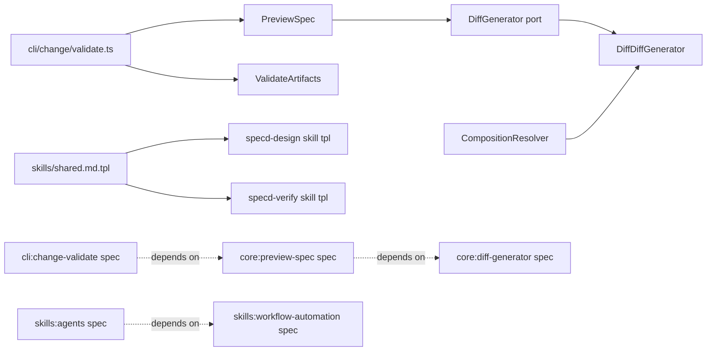

# Design: show-spec-diff-during-validate

## Non-goals

- Add inline diff review to `specd changes validate --all`. Batch validation stays on the current per-step summary output and does not materialize merged review surfaces.
- Change `ValidateArtifacts` result shape or move merge logic into validation. Structural validation remains in core validation; merged review continues to come from `PreviewSpec`.
- Turn generic preview failures into hard validation failures when the validated artifact already passed structural validation.
- Introduce new user-facing docs under `docs/`. This change is documented through specs and skill templates; no standalone `docs/` page currently mirrors this workflow.

## Affected areas

- `registerChangeValidate()`, `executeSingle()`, `executeBatch()`, `buildPreviewCommand()` in `packages/cli/src/commands/change/validate.ts`
  Change: add a single-artifact inline-diff rendering path for successful `scope: spec` validations backed by existing deltas; preserve current behavior for failures, change-scoped artifacts, and batch mode.
  Callers: `registerChangeValidate` has 2 direct dependents and LOW risk; `executeSingle` and `executeBatch` each have 2 direct dependents and MEDIUM risk via the CLI entrypoint and command tests.
  Note: this is the only user-facing surface that decides when to replace the preview hint with inline diff text.

- `PreviewSpec`, `PreviewSpecResult`, `PreviewSpecFileEntry` in `packages/core/src/application/use-cases/preview-spec.ts`
  Change: distinguish diff-generation failures from merge failures by catching a dedicated typed error and returning warning-only partial results.
  Callers: `PreviewSpec` is a CRITICAL hotspot with 12 direct and 29 indirect dependents across `CompileContext`, kernel composition, and tests.
  Note: behavior must remain read-only and compatible with `CompileContext`.

- `DiffGenerator`, `DiffGeneratorInput` in `packages/core/src/application/ports/diff-generator.ts`
  Change: add exported `DiffGenerationError` as the caller-visible failure contract for unusable unified diff generation.
  Callers: `DiffGenerator` is CRITICAL with 9 direct and 20 indirect dependents, including composition, `PreviewSpec`, and infrastructure tests.
  Note: the port shape must stay presentation-neutral and ESM-safe.

- `DiffDiffGenerator` in `packages/core/src/infrastructure/diff/diff-generator.ts`
  Change: wrap concrete diff-library failures in `DiffGenerationError` and validate that the returned patch is usable before returning it.
  Callers: direct infrastructure implementation of the diff port; low fan-out itself, but any contract mistake leaks through the CRITICAL `DiffGenerator` port.

- `createDefaultDiffGenerator()` in `packages/core/src/composition/diff-generator.ts` and `CompositionResolver.getDiffGenerator()` in `packages/core/src/composition/composition-resolver.ts`
  Change: no interface expansion, but design must preserve the existing default-wiring path so all config-based `PreviewSpec` consumers receive the typed-error-capable implementation without extra registration.
  Callers: composition-layer bootstrap used by kernel creation and config-based use-case factories.

- `PreviewSpecDeps`, `resolvePreviewSpecDeps()`, `createPreviewSpec()` in `packages/core/src/composition/use-cases/preview-spec.ts`
  Change: preserve current dependency shape while ensuring design and tests cover the dedicated diff-error behavior through the existing factory path.
  Callers: direct composition entry for `PreviewSpec`; medium implementation risk because config bootstrap must stay unchanged.

- `packages/cli/test/commands/change-validate.spec.ts`
  Change: add CLI tests for inline diff success, diff-generation fallback note, no inline diff on failed validation, and unchanged `--all` behavior.
  Note: this is the primary acceptance suite for the new command contract.

- `packages/core/test/application/use-cases/preview-spec.spec.ts`
  Change: replace generic diff-failure assertions with typed `DiffGenerationError` coverage and confirm merged entries survive without `diff`.
  Note: this suite protects the merge/diff boundary that `change validate` reuses.

- `packages/core/test/infrastructure/diff/diff-generator.spec.ts`
  Change: add tests proving the default implementation raises `DiffGenerationError` for unusable generator outcomes while keeping the current plain unified diff contract.

- `packages/skills/templates/shared/shared.md.tpl`
  Change: update the shared workflow guidance so successful single-artifact spec validation tells agents to inspect the inline diff first, and to fall back to `spec-preview --diff --artifact` only when inline diff is unavailable or broader merged review is needed.
  Note: this template is inherited by multiple skills, so wording must stay generic and canonical.

- `packages/skills/templates/skills/specd-design/SKILL.md.tpl`
  Change: adjust the “validate then review” step so spec-scoped single-artifact validation review relies on inline diff when present instead of always instructing `spec-preview`.

- `packages/skills/templates/skills/specd-verify/SKILL.md.tpl`
  Change: keep merged-content verification guidance, but clarify that inline diff from `changes validate` is the immediate review surface only for the narrow successful single-artifact validate flow; `spec-preview` remains the source for broader merged verification.

- `packages/skills/CHANGELOG.md`
  Change: add an entry summarizing the new inline-diff review behavior and updated skill guidance because the package already tracks workflow-facing changes there.

## New constructs

- `DiffGenerationError` in `packages/core/src/application/ports/diff-generator.ts`
  Shape:

  ```ts
  export class DiffGenerationError extends Error {
    constructor(message: string, options?: { cause?: unknown })
  }
  ```

  Responsibility: identify non-fatal unified-diff generation failures that happen after merge preview has already succeeded.
  Relationships: thrown by `DiffDiffGenerator`; caught explicitly by `PreviewSpec`; indirectly influences CLI validate rendering via `kernel.changes.preview.execute`.

- Local CLI helper in `packages/cli/src/commands/change/validate.ts`
  Shape:

  ```ts
  interface InlinePreviewArtifact {
    readonly filename: string
    readonly base: string | null
    readonly merged: string
    readonly diff?: string
    readonly status: 'merged' | 'no-op' | 'missing'
  }

  function qualifiesForInlineDiff(
    result: ValidateResult,
    artifactId: string | undefined,
    requestedArtifactScope: ArtifactScope | undefined,
  ): boolean

  function renderInlineDiffBlock(files: readonly InlinePreviewArtifact[]): string[]
  ```

  Responsibility: keep the inline-diff decision and text rendering private to `change validate`; it does not change kernel contracts.
  Relationships: consumes `kernel.changes.preview.execute` output; depends on existing `PreviewSpec` result shape.

## Approach

`change validate` will stay a structural gate first and a review surface second. The command will continue to call `kernel.changes.validate.execute()` as the source of truth for pass/fail, files, and notes. Only after a successful single-spec validation of a single `scope: spec` artifact will the CLI attempt inline review.

The qualifying rule is exact:

- `--all` is not set.
- `--artifact <artifactId>` is present.
- The requested artifact scope is `spec`.
- Validation passed.
- At least one validated file exists for the target artifact.
- The review surface represents an existing delta-backed artifact, which is proven by calling `kernel.changes.preview.execute({ name, specId, includeDiff: true })`, filtering to the validated artifact, and requiring the filtered preview entry to have `status: 'merged'`, `base !== null`, and a non-empty `diff`.

If all qualifiers hold, the text renderer will:

- keep the existing `validated ...` header;
- keep `file:` lines from validation metadata;
- keep the structural reminder note;
- keep any validation notes;
- omit the normal `spec-preview` follow-up note;
- append a diff block for the filtered artifact only.

If `kernel.changes.preview.execute()` returns the target preview entry with `status: 'merged'` but without `diff`, or returns a warning that came from `DiffGenerationError`, validation still succeeds. In that case the CLI prints the same success block without inline diff and adds a fallback note:

`note: inspect merged diff with \`specd changes spec-preview <name> <specId> --diff --artifact <artifactId>\``

The CLI will not try to infer delta safety from file extensions alone. It will use preview output as the authoritative merged review surface because that is already the canonical merge path used elsewhere. This avoids duplicating merge logic in CLI code and keeps change validate aligned with `change spec-preview`.

`PreviewSpec` will be updated so diff generation is the only part of the preview flow that can fail non-fatally after merge. Delta parse/apply failures remain in the existing catch path and downgrade the file to `missing`. By contrast, `DiffGenerationError` must be caught around the individual `diffGenerator.generate(...)` call after the merged file entry is already built. That catch adds a warning, leaves `status: 'merged'`, preserves `base` and `merged`, and omits `diff`.

`DiffDiffGenerator` will become responsible for normalizing library failures into `DiffGenerationError`. It must wrap thrown library exceptions with `cause`, and it must also reject unusable outputs such as non-string or empty/whitespace-only diff payloads by throwing `DiffGenerationError`. Successful outputs continue to be plain unified diff text using the current file labels and default 3-line context.

Skill-template changes will be limited to workflow guidance, not command behavior. Shared guidance must tell agents:

- a successful single-artifact spec validation may already show the diff they need to inspect for contract breakage or unintended removals;
- `spec-preview --diff --artifact` is the fallback when inline diff is unavailable;
- broader overlap/drift review still uses merged `spec-preview`.

No schema, manifest, lifecycle, or artifact DAG behavior changes are needed. The implementation remains backwards-compatible for JSON/toon output and for callers that never request inline diff rendering.

## Key decisions

- **Reuse `PreviewSpec` instead of generating diffs directly in CLI** → the merged preview pipeline already knows whether the target is delta-backed, new, missing, or no-op. Reusing it prevents duplicate merge logic and keeps one canonical review surface. **Alternatives rejected** → deriving diff eligibility from validation filenames alone would be brittle and would not distinguish successful merge from no-op/missing/new-file cases.

- **Keep inline diff text-mode only** → specs require no change to JSON/toon result shape, and text mode is the workflow review surface humans and agents already use for validation. **Alternatives rejected** → extending JSON/toon would force a kernel/CLI response contract change with no current spec requirement.

- **Make `DiffGenerationError` a port-level export** → callers need a stable type, not a library-specific error string, to separate “diff surface unavailable” from “merge failed”. **Alternatives rejected** → checking `error.message` is too fragile; throwing generic `Error` would keep `PreviewSpec` unable to distinguish failure classes.

- **Treat inline diff as a post-validation enhancement, never as part of pass/fail** → validation already decides correctness for structure/lifecycle. Diff rendering is advisory review output and must not retroactively fail a valid artifact. **Alternatives rejected** → failing validation on diff rendering problems would conflate review tooling with schema correctness and violate the new spec contract.

- **Do not change `--all`** → batch mode is intentionally summary-oriented and may schedule many steps. Materializing preview diffs there would create noisy output and violate the agreed scope boundary. **Alternatives rejected** → partial inline diff in batch mode would create inconsistent review semantics across steps and complicate aggregation.

## Trade-offs

- `[Extra preview call on qualifying success]` → `change validate` will do more work for successful single-artifact spec validation. Mitigation: only call preview in that narrow path; leave failures and batch mode unchanged.
- `[PreviewSpec hotspot risk]` → `PreviewSpec` is a CRITICAL node used by `CompileContext`. Mitigation: isolate the new behavior to diff-generation catch logic and avoid changing merge ordering, file discovery, or result fields.
- `[Skill wording drift across templates]` → shared template edits can accidentally overstate inline-diff availability. Mitigation: wording must explicitly limit the behavior to successful single-artifact spec-scoped validations and preserve `spec-preview` guidance for broader review.

## Spec impact

### `cli:change-validate`

- Direct dependents: `cli:change-invalidate`, `cli:spec-validate`, `cli:change-spec-preview`, `cli:change-archive`, `cli:change-approve`, `cli:change-create`
- Transitive dependents: other CLI workflow specs that depend on those command contracts indirectly through shared command and review conventions
- Assessment: no additional spec changes are required. Dependents consume the validate command as a workflow primitive and remain satisfied because command shape, exit codes, and batch semantics stay intact.

### `core:preview-spec`

- Direct dependents: `cli:change-spec-preview`, `core:compile-context`
- Transitive dependents: specs depending on `core:compile-context` materialized views
- Assessment: no dependent spec needs change. `cli:change-spec-preview` already accepts warnings and optional `diff`; `core:compile-context` does not request diffs and is unaffected by the new typed error path.

### `core:diff-generator`

- Direct dependent: `core:preview-spec`
- Transitive dependents: `cli:change-spec-preview`, `cli:change-validate`, and any `PreviewSpec`-backed workflow
- Assessment: the new error contract is additive and required by `core:preview-spec`; no further spec changes are needed because the port remains internal and caller behavior is now explicitly defined.

### `skills:workflow-automation`

- Direct dependent: `skills:agents`
- Transitive dependents: every generated workflow skill that includes the shared workflow instructions
- Assessment: no new spec is needed, but implementation must update the shared template and the `specd-design`/`specd-verify` templates so generated skill text actually follows the revised policy.

## Dependency map



```
┌──────────────────────────────┐
│ CLI change validate          │
│ registerChangeValidate()     │
└──────────────┬───────────────┘
               │ validates
               ▼
      ┌───────────────────┐
      │ ValidateArtifacts │
      └───────────────────┘
               │ success + single spec artifact
               ▼
┌──────────────────────────────┐
│ PreviewSpec                  │  [CRITICAL hotspot]
│ merged files + warnings      │
└──────────────┬───────────────┘
               │ includeDiff
               ▼
      ┌───────────────────┐
      │ DiffGenerator     │
      │ + DiffGeneration  │
      │   Error           │
      └─────────┬─────────┘
                ▼
      ┌───────────────────┐
      │ DiffDiffGenerator │
      └───────────────────┘

┌────────────────────┐      ┌─────────────────────────┐
│ skills/shared tpl  │─────▶│ specd-design / verify   │
└────────────────────┘      │ skill templates         │
                            └─────────────────────────┘

┌──────────────────────────┐ depends on ┌─────────────────────────┐
│ cli:change-validate spec │───────────▶│ core:preview-spec spec  │
└──────────────────────────┘            └──────────────┬──────────┘
                                                       │ depends on
                                                       ▼
                                            ┌──────────────────────┐
                                            │ core:diff-generator  │
                                            └──────────────────────┘
```

## Testing

**Automated tests**

- `packages/cli/test/commands/change-validate.spec.ts`
  Add cases for:
  - successful single-artifact spec validation prints inline diff and omits preview hint;
  - successful single-artifact spec validation with `DiffGenerationError` prints fallback `spec-preview --diff --artifact` note and still exits 0;
  - failed single-artifact spec validation never prints inline diff;
  - `--all` remains unchanged and never attempts inline diff review.

- `packages/core/test/application/use-cases/preview-spec.spec.ts`
  Add or update cases for:
  - `DiffGenerationError` on one merged file keeps `status: 'merged'`, preserves `base`/`merged`, omits `diff`, and records a warning;
  - delta application failures still use the existing `missing` path to prove error classes remain separated;
  - new-file diff generation still uses empty-string base and unchanged merged output.

- `packages/core/test/infrastructure/diff/diff-generator.spec.ts`
  Add cases for:
  - wrapped library failure throws `DiffGenerationError`;
  - unusable diff output throws `DiffGenerationError`;
  - successful output still returns plain unified diff text with current labels.

- `packages/core/test/composition/use-cases/preview-spec.spec.ts` or existing composition coverage, if needed
  Confirm the config-based `createPreviewSpec()` path still provides a default diff generator compatible with the new typed error contract.

- `packages/skills` template snapshot/regeneration tests, if present
  Update any fixture or snapshot that asserts old “always run `spec-preview` after validate” wording.

**Manual / E2E verification**

- Run `node packages/cli/dist/index.js changes validate show-spec-diff-during-validate cli:change-validate --artifact specs --format text` against a delta-backed existing spec and confirm:
  - validation passes;
  - file lines remain;
  - structural reminder note remains;
  - inline diff appears;
  - no plain merged-preview hint is shown.

- Force a diff-generation failure in a focused test or temporary stub, then rerun the same command and confirm:
  - exit code remains 0;
  - no inline diff appears;
  - fallback note points to `specd changes spec-preview <name> <specId> --diff --artifact <artifactId>`.

- Run `node packages/cli/dist/index.js changes validate <name> <specId> --artifact specs --format text` with a failing delta and confirm no inline diff or misleading merged checkpoint is printed.

- Run `node packages/cli/dist/index.js changes validate <name> --all --artifact specs --format text` and confirm batch output remains summary-style without inline diff.

- Regenerate or inspect the skill templates and confirm shared guidance, `specd-design`, and `specd-verify` mention inline diff only for the narrow successful single-artifact spec-validation flow.

Global constraints check:

- Architecture: changes remain in CLI/application/composition/infrastructure layers; no domain I/O is introduced.
- Conventions: new exports remain named ESM exports, no default exports, no `any`.
- Docs/JSDoc: any new class/helper in core or CLI must include concise JSDoc matching project conventions.
- Testing: new tests stay near the touched command/use-case/infrastructure suites and map to the verify scenarios above.

## Open questions

None.
