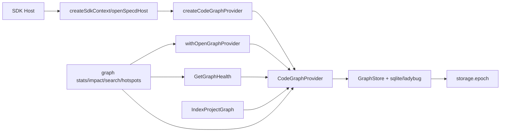

# Design: sdk-graph-provider-factory

## Compliance fixes

The implementation must complete the provider lifecycle cleanup after every failure occurring after `ctx.createGraphProvider()`, including a rejected `provider.open()` when no `beforeOpen` hook exists. It must attempt `close()`, invoke `afterClose` after that attempt, and preserve the original open or callback error over cleanup failures. Add focused SDK tests for this default open-failure path and `afterClose` ordering.

The `@specd/code-graph` public barrel must export `CodeGraphProvider` as a type-only interface, not a runtime class. Rename the concrete provider implementation to an internal class, make the factory return the public interface, and add compile-surface regression coverage proving direct construction is unavailable. These changes remain within the existing SDK and code-graph composition boundaries.

## Final compliance corrections

`openSpecdHost` gains `allowBootstrapFallback?: boolean`, default `false`. With the flag enabled only discovery-mode callers may fall back from a missing `specd.yaml` to a synthetic graph-capable config rooted at the detected VCS root; explicit `configPath` failures never fall back. `graph stats` enables the flag for `--path` and no-config execution while retaining direct SDK host bootstrap and never calling `resolveGraphCliContext`.

Ladybug search must use `document_fts` for document discovery and union identity-derived candidates into spec and document FTS candidates before shared ranking. Tests must cover FTS-missed spec identity, document FTS discovery, SDK fallback/default behavior, stats bootstrap, public provider construction rejection, VCS factory selection, and CLI busy/stale propagation. The Vitest IPC warning is recorded but out of scope pending a reliable reproduction/fix.

## Audit remediation addendum

The following four audit findings are mandatory implementation work and must not be deferred:

1. `packages/code-graph/src/application/use-cases/index-project-graph.ts` keeps `vcsRoot: string | null` as a required `IndexProjectGraphInput` field and forwards it unchanged to `provider.index(...)`. The public spec and verification scenario now make this existing contract explicit. Add a unit assertion in `packages/code-graph/test/application/use-cases/index-project-graph.spec.ts` that verifies both a non-null root and `null` reach the provider options unchanged.
2. `packages/cli/src/commands/graph/stats.ts` calls `process.exit(0)` only after its awaited SDK lifecycle helper has completed successful provider cleanup. It must not exit before `withOpenGraphProvider` closes the provider and must retain existing non-zero error mapping. Add an ordered-call test in `packages/cli/test/commands/graph-stats.spec.ts` that observes close completion before the exit spy.
3. `packages/core/src/application/ports/index.ts` re-exports `VcsAdapter` as a value, not through `export type`; the public Core barrel must preserve that runtime value. Add a public-barrel regression in the applicable Core barrel test proving `VcsAdapter` can be imported as a value and remains the abstract class.
4. `packages/core/src/composition/vcs-adapter.ts` treats caller-provided external providers as an ordered prefix and always appends the built-in Git, Hg, and SVN providers. A matching external provider short-circuits built-ins; unmatched externals fall through to the complete built-in order; `NullVcsAdapter` is returned only after every provider misses. Add focused composition tests for matching external precedence, unmatched fall-through to Git, and the all-miss null result.

These changes stay inside the existing SDK/code-graph/CLI/Core boundaries. They introduce no new persistence format, permissions, configuration option, or public concrete infrastructure export. All new and modified public declarations require JSDoc and named ESM exports; tests remain in their owning package test trees.

## Post-verify artifact cleanup addendum

After the 20260720-182351 compliance audit, the following artifact-only corrections are mandatory:

1. `cli:graph-stats` VERIFY scenario “Command delegates health to GetGraphHealth via SDK” must assert `openSpecdHost` + `withOpenGraphProvider` and MUST NOT claim lifecycle through `cli:graph-cli-context`.
2. `cli:graph-impact` SPEC symbol/spec requirements must describe `resolveGraphCliContext` + `withProvider` instead of inline create/open/close steps.
3. `code-graph:composition` VERIFY must name `CodeGraphCompositionOptions` (not `CodeGraphFactoryOptions`).
4. `code-graph:ladybug-graph-store` Relationship tables catalog must include `CONSTRUCTS` and `USES_TYPE`.

Implementation follow-up (one remaining coverage gap):

5. `packages/code-graph/test/application/use-cases/get-graph-health.spec.ts` must assert that `GRAPH_BUSY` and `GRAPH_PROVIDER_STALE` errors from `provider.getStatistics()` propagate unchanged from `GetGraphHealth.execute()`.

## Post-audit implementation contract

### SDK host fallback

Modify `packages/sdk/src/composition/host-context.ts`. Extend `OpenSpecdHostInput` with `readonly allowBootstrapFallback?: boolean`. Keep the existing `configPath`/`startDir` mutual-exclusion guard. `openSpecdHost` first loads a configured host exactly as today. Only when no explicit `configPath` was supplied, `allowBootstrapFallback === true`, and discovery reports no configuration, resolve the VCS root from the selected start directory, build the existing synthetic graph configuration through the code-graph bootstrap factory, and pass that config to `createSdkContext`. The returned result has `configFilePath: null`. Missing VCS roots and explicit-config load errors propagate unchanged. Default/omitted flag behavior remains configuration-required discovery.

Update `packages/sdk/test/composition/host-context.spec.ts` with: omitted/false flag preserves discovery failure; true flag creates a synthetic host at the detected VCS root; explicit config never falls back; graph and kernel options still forward on both configured and synthetic paths.

### Graph stats routing

Modify `packages/cli/src/commands/graph/stats.ts` only; do not reintroduce `resolve-graph-cli-context.ts`. For `--config`, call `openSpecdHost({ configPath })`. For `--path`, call `openSpecdHost({ startDir: path, allowBootstrapFallback: true })`; for no path/config, call `openSpecdHost({ allowBootstrapFallback: true })`. Continue to obtain the provider from the returned SDK host and run `createGetGraphHealth` inside the SDK lifecycle helper. Configured hosts pass `kernel.project.listWorkspaces.execute()`; synthetic hosts use their generated default workspace. Preserve error mapping and exit code 3.

Update `packages/cli/test/commands/graph-stats.spec.ts` to assert the exact SDK inputs for explicit config, path fallback, and no-config fallback, and include real error fixtures for `GRAPH_BUSY` and `GRAPH_PROVIDER_STALE` through the command error boundary. Update `graph-cli-context.spec.ts` only to assert that stats remains outside `resolveGraphCliContext`.

### Ladybug FTS and identity candidates

Modify `packages/code-graph/src/infrastructure/ladybug/ladybug-graph-store.ts` and its schema/query constants. `searchDocuments` must query `document_fts` through `QUERY_FTS_INDEX`, then union canonical-path/config-relative-path identity candidates, deduplicate by node id, apply existing workspace/exclusion filters, rank with the shared identity-aware ranking helper, derive snippets, then apply the limit. `searchSpecs` must retain FTS discovery but union `specId`/path identity candidates before filtering and ranking. Reuse the same parameterized query/binding pattern as symbol search; do not interpolate user input into Cypher. Ensure bulk load/rebuild refreshes `document_fts`.

Add focused cases in `packages/code-graph/test/infrastructure/ladybug/ladybug-graph-store.spec.ts`: an FTS-missed spec-id suffix/component hit is returned; document search invokes/uses `document_fts` and preserves identity ordering; workspace filters and limits apply after candidate union. Retain SQLite coverage unchanged.

### Public and VCS regression coverage

Keep `packages/code-graph/test/barrel.spec.ts` as the root export regression and add a TypeScript compile fixture or equivalent type assertion that value construction of `CodeGraphProvider` from `@specd/code-graph` is rejected while type import remains valid. Expand `packages/core/test/composition/vcs-adapter.spec.ts` for Git/Hg/SVN selection order, unmatched external-provider fallback, `NullVcsAdapter` fallback, and explicit/omitted cwd. These tests are regression coverage only; no VCS contract behavior changes.

### Impact and containment

The graph impact check over `sdk:src/composition/host-context.ts`, `cli:src/commands/graph/stats.ts`, and `code-graph:src/infrastructure/ladybug/ladybug-graph-store.ts` reports `CRITICAL` risk: 47 direct dependents, 90 indirect dependents, and 132 affected files. The dominant source is the public SDK bootstrap seam (`openSpecdHost`), which is also used by general CLI host setup and SDK orchestration. Containment is therefore mandatory: the new flag is optional and defaults to `false`; existing configured-host execution remains the first path; only graph stats opts in; and explicit configuration failures never change their error behavior. The SDK tests must exercise both branches, while the root typecheck plus affected SDK/CLI suites protect the wider call surface.

Ladybug changes are contained to candidate acquisition and index refresh: they do not alter the backend-independent `GraphStore` API or the SQLite implementation. Candidate union, deduplication, filter ordering, ranking, and limits are covered as one behavior so an FTS optimization cannot silently change search semantics. The public provider and VCS changes are compile/regression-only checks with no newly exposed concrete infrastructure.

- `GraphStore` and its SQLite adapter must expose the reverse-coverage methods under the merged names `getCoveringSpecsForFile` and `getCoveringSpecsForSymbol`.
- SQLite must supplement FTS candidates for symbol, spec, and document searches using the same strong identity matching path.
- `graph stats` owns SDK host bootstrap; `cli:graph-cli-context` applies only to search, impact, and hotspots.
- `VcsAdapter.detect()` base remains null; `createVcsAdapter(cwd)` is the factory-level Git-detection contract.

Complete every compliance repair recorded on 2026-07-19: normalize aggregate multi-file graph-impact paths before JSON/TOON rendering; route graph stats through the SDK host bootstrap or align its contract; remove the extra public barrel export; inject the VCS/ref dependency into `GetGraphHealth` through a typed port; replace partial `as unknown as` port mocks; add provider busy/stale and export-boundary tests; ensure Ladybug creates the generation sidecar after migration, rebuilds Document FTS, and deletes a file atomically; and correct the stale Ladybug schema-version test. These are required correctness fixes, not optional cleanup.

## Non-goals

- This change does not introduce a new public Electron-specific package. It only prepares `@specd/sdk` and `@specd/code-graph` so a follow-up package such as `@specd/code-graph-sqlite-electron` can register a runtime-specific backend through the existing registry model.
- This change does not make graph-provider creation asynchronous. `createGraphProvider()` and `createCodeGraphProvider(...)` remain synchronous factory calls.
- This change does not add a `graphProvider` concept to `@specd/core`. Graph composition remains an SDK/code-graph concern.
- This change does not change graph-scoring, traversal semantics, or search ranking beyond the busy/stale availability behavior already captured in the modified specs.

## Affected areas

- `VcsAdapter` public export in `packages/core/src/public.ts` and Core barrel tests: expose the existing application port without exposing concrete VCS infrastructure. This is an additive Core API change consumed by `GetGraphHealth`; it preserves composition ownership of `createVcsAdapter`.

- `createSdkContext` in `packages/sdk/src/composition/host-context.ts`
  Change: replace the kernel-only options input with SDK-owned `SdkContextOptions`, forward `options.graph` into `createCodeGraphProvider(config, options.graph)`, and preserve fresh-per-call provider creation.
  Callers: 5 direct, 1 indirect, 7 affected files via graph impact. Risk: MEDIUM.
  Note: this is the main SDK composition seam and must remain source-compatible for callers that pass no options.

- `openSpecdHost` and `OpenSpecdHostInput` in `packages/sdk/src/composition/host-context.ts`
  Change: replace `kernelOptions?: KernelOptions` with `options?: SdkContextOptions`, keep `configPath` / `startDir` bootstrap semantics unchanged, and delegate to `createSdkContext(config, input.options)`.
  Callers: downstream through `createSdkContext`, plus CLI and SDK orchestration helpers. Risk: MEDIUM.
  Note: this is the public host bootstrap API and must stay backwards-compatible for the common no-options path.

- `withOpenGraphProvider` and `WithOpenGraphProviderOptions` in `packages/sdk/src/composition/with-open-graph-provider.ts`
  Change: add `afterClose`, guarantee cleanup after `open()` failure when `beforeOpen` already ran, preserve original callback error over close-cleanup failures, and keep the helper optional for long-lived hosts.
  Callers: 3 direct, 3 affected files. Risk: MEDIUM.
  Note: SDK orchestration helpers depend on this lifecycle guarantee.

- `resolveGraphCliContext` in `packages/cli/src/commands/graph/resolve-graph-cli-context.ts`
  Change: consume the updated SDK host-context contract and stop relying on any public lock helper semantics.
  Callers: 11 direct, 5 indirect, 13 affected files. Risk: HIGH.
  Note: all graph CLI commands flow through this symbol, so CLI compatibility and error mapping must remain stable.

- `createCodeGraphProvider` in `packages/code-graph/src/composition/create-code-graph-provider.ts`
  Change: rename `CodeGraphFactoryOptions` to `CodeGraphCompositionOptions`, keep the dual overloads, keep synchronous construction, and move built-in backend native loading behind `open()` by constructing lazy factories instead of eagerly importing concrete stores.
  Callers: 3 direct, 3 indirect, 5 affected files. Risk: MEDIUM.
  Note: this is the public composition entrypoint for both SDK and standalone callers.

- `GraphStoreFactoryOptions`, `GraphStoreFactory`, `CodeGraphFactoryOptions`, and `CodeGraphOptions` in `packages/code-graph/src/composition/graph-store-factory.ts`
  Change: rename the composition options type to `CodeGraphCompositionOptions`, keep the standalone `CodeGraphOptions` shape, and extend the graph-store factory contract so runtime-specific loaders can be passed to backend-specific factory builders.
  Callers: public composition surface. Risk: MEDIUM.

- `CodeGraphProvider` in `packages/code-graph/src/composition/code-graph-provider.ts`
  Change: internalize lock helpers, remove public `recreate()`, make `open()` / `close()` / async-dispose idempotent, enforce provider-owned busy/stale availability checks on reads and maintenance operations, and move force-recreate into provider-owned indexing flows.
  Callers: 1 direct constructor path, 3 indirect, 5 affected files. Risk: MEDIUM.
  Note: this is the lifecycle and availability enforcement point for SDK, CLI, MCP, HTTP, and desktop hosts.

- `GraphStore` in `packages/code-graph/src/domain/ports/graph-store.ts`
  Change: keep `open()`, `close()`, `clear()`, and `recreate()`, but add the abstract behavior needed for storage-generation tracking and lazy backend readiness.
  Callers: all concrete stores and provider lifecycle. Risk: HIGH by abstraction depth, even though graph impact is not directly reported for the abstract class.
  Note: port changes must remain backend-agnostic and free of `@specd/core` dependencies.

- Concrete stores under `packages/code-graph/src/infrastructure/sqlite/*` and `packages/code-graph/src/infrastructure/ladybug/*`
  Change: defer native/runtime binding work to `open()`, make `close()` idempotent, rotate storage epoch during destructive recreate, and expose enough behavior for provider-side stale detection.
  Callers: only composition/factory path directly, but these are the runtime-sensitive implementations. Risk: MEDIUM.

- `GetGraphHealth` in `packages/code-graph/src/application/use-cases/get-graph-health.ts`
  Change: stop owning explicit lock assertions, rely on provider reads to raise `GRAPH_BUSY` or `GRAPH_PROVIDER_STALE`, and preserve staleness/fingerprint orchestration.
  Callers: 3 direct, 1 indirect, 4 affected files. Risk: MEDIUM.

- `IndexProjectGraph` in `packages/code-graph/src/application/use-cases/index-project-graph.ts`
  Change: stop treating recreate/lock handling as host work and rely on `provider.index(...)` to own destructive rebuild and lock policy.
  Callers: 4 direct, 1 indirect, 5 affected files. Risk: MEDIUM.

- CLI graph commands in:
  - `packages/cli/src/commands/graph/stats.ts`
  - `packages/cli/src/commands/graph/impact.ts`
  - `packages/cli/src/commands/graph/search.ts`
  - `packages/cli/src/commands/graph/hotspots.ts`
    Change: remove host-managed pre-open lock probes, treat `GRAPH_BUSY` and `GRAPH_PROVIDER_STALE` as infrastructure errors after open, and preserve existing exit-code conventions.
    Callers: user-facing command registrations plus tests. Risk: HIGH because of broad command exposure.

- Tests:
  - `packages/sdk/test/composition/host-context.spec.ts`
  - `packages/sdk/test/composition/with-open-graph-provider.spec.ts`
  - `packages/code-graph/test/composition/code-graph-provider.spec.ts`
  - `packages/code-graph/test/application/use-cases/get-graph-health.spec.ts`
  - `packages/code-graph/test/application/use-cases/index-project-graph.spec.ts`
  - `packages/code-graph/test/application/use-cases/index-project-graph-integration.spec.ts`
  - `packages/cli/test/commands/graph-*.spec.ts`
    Change: update signatures, lifecycle expectations, busy/stale error mapping, and storage-epoch behavior. Risk: HIGH for regression coverage, not API risk.

- Documentation:
  - `docs/cli/cli-reference.md`
  - `packages/code-graph/README.md` or `docs/code-graph/*` if lifecycle/composition guidance lives there
  - SDK-facing public docs or README for host bootstrap usage, if the package already exposes one
    Change: document SDK host options, long-lived host lifecycle, and provider-owned busy/stale semantics where public behavior is described.
    Risk: LOW, but required so public guidance matches the new contract.

## New constructs

- `SdkContextOptions`
  Location: `packages/sdk/src/composition/host-context.ts`
  Shape:

  ```ts
  export interface SdkContextOptions {
    readonly kernel?: KernelOptions
    readonly graph?: CodeGraphCompositionOptions
  }
  ```

  Responsibility: SDK-owned bootstrap shape that keeps kernel composition separate from code-graph composition while exposing both through one host input.
  Relationships: consumed by `createSdkContext` and `openSpecdHost`; depends on `KernelOptions` from `@specd/core` and `CodeGraphCompositionOptions` from `@specd/code-graph`.

- `CodeGraphCompositionOptions`
  Location: `packages/code-graph/src/composition/graph-store-factory.ts`
  Shape:

  ```ts
  export interface CodeGraphCompositionOptions {
    readonly graphStoreId?: string
    readonly graphStoreFactories?: Readonly<Record<string, GraphStoreFactory>>
    readonly adapters?: readonly LanguageAdapter[]
  }
  ```

  Responsibility: renamed public composition type for the `SpecdConfig` overload of `createCodeGraphProvider(...)`.
  Relationships: used by SDK host options and by the public code-graph composition surface; `CodeGraphOptions` extends it for standalone callers.

- `GraphProviderStaleError`
  Location: `packages/code-graph/src/domain/errors/graph-provider-stale-error.ts`
  Shape:

  ```ts
  export class GraphProviderStaleError extends SpecdCodeGraphError {
    readonly code = 'GRAPH_PROVIDER_STALE'

    constructor(message?: string)
    static default(): GraphProviderStaleError
  }
  ```

  Responsibility: raised when a provider opened against one storage generation detects that another process has destructively replaced the backing storage.
  Relationships: thrown by `CodeGraphProvider` availability guards, surfaced by CLI through the standard infrastructure error path, exported from `@specd/code-graph`.

- `createSqliteGraphStoreFactory`
  Location: `packages/code-graph/src/composition/create-sqlite-graph-store-factory.ts` or adjacent composition module
  Shape:

  ```ts
  export interface SqliteGraphStoreFactoryOptions {
    readonly loadDatabaseModule?: () => Promise<SqliteModule>
  }

  export function createSqliteGraphStoreFactory(
    options?: SqliteGraphStoreFactoryOptions,
  ): GraphStoreFactory
  ```

  Responsibility: exposes the shared SQLite store implementation behind a configurable runtime loader so follow-up packages can reuse store logic without duplicating the backend implementation.
  Relationships: used by the built-in `sqlite` registration with the default loader; reused later by an external `sqlite-electron` package.

- Internal provider availability helpers
  Location: `packages/code-graph/src/composition/code-graph-provider.ts`
  Shape:
  ```ts
  private async assertAvailable(): Promise<void>
  private async withIndexLock<T>(config: SpecdConfig, fn: () => Promise<T>): Promise<T>
  private async rotateOrCacheStorageEpoch(): Promise<void>
  [Symbol.asyncDispose](): Promise<void>
  ```
  Responsibility: centralize open-state checking, storage-epoch verification, busy-state enforcement, and idempotent cleanup.
  Relationships: internal only; used by every public read/maintenance method and by `withOpenGraphProvider` through the standard `open()` / `close()` contract.

## Approach

Export `VcsAdapter` from the Core public barrel, then inject `createVcsAdapter` into `GetGraphHealth` with the public `VcsAdapter` return type. The code-graph application layer remains independent of Core infrastructure; Core composition remains the only location that constructs concrete VCS adapters.

1. Update SDK host bootstrap first.
   `createSdkContext(config, options?: SdkContextOptions)` creates the kernel with `options?.kernel` and closes over `options?.graph` when building `createGraphProvider`. `openSpecdHost` accepts `input.options` and forwards that same object unchanged into `createSdkContext`.

2. Rename the code-graph composition type without changing behavior for standalone callers.
   `CodeGraphFactoryOptions` becomes `CodeGraphCompositionOptions`. `CodeGraphOptions` keeps the standalone fields (`storagePath`, optional `projectRoot`) and extends the renamed composition type. The `createCodeGraphProvider(config, options?)` overload uses `CodeGraphCompositionOptions`; the `createCodeGraphProvider(options: CodeGraphOptions)` overload remains intact.

3. Replace eager built-in backend imports with lazy-at-open store factories.
   The composition layer must no longer import concrete SQLite/Ladybug runtime modules eagerly just by constructing a provider. Instead, built-in registrations create stores that defer runtime/native loading to `store.open()`. This keeps the factory synchronous while preventing unused native bindings from entering the wrong runtime path.

4. Make SQLite store construction reusable.
   The built-in SQLite backend is refactored behind `createSqliteGraphStoreFactory(...)`. The built-in `sqlite` registration uses the default Node loader. A future `sqlite-electron` package can call the same factory with only a different `loadDatabaseModule` function. This change does not publish that external package yet.

5. Move availability policy into `CodeGraphProvider`.
   `CodeGraphProvider` becomes the only place that knows:
   - whether the store is open
   - whether the graph is currently being reindexed
   - whether the storage epoch changed after destructive recreation in another process

   Every public read/query/traversal/search method calls `assertAvailable()` before touching the store. `assertAvailable()` checks:
   - provider/store is open
   - provider is not already closed
   - no index lock is active for the storage root
   - cached storage generation still matches persisted storage generation

   Busy state raises the existing graph-busy error. Generation mismatch raises `GraphProviderStaleError`.

6. Internalize lock handling and destructive recreation.
   Public `assertGraphIndexUnlocked`, `acquireGraphIndexLock`, and `recreate()` disappear from the provider facade. `provider.index(...)` owns any force-reset behavior and index locking internally. `provider.clear()` also runs under the provider-owned availability/maintenance policy. Hosts and CLI commands no longer orchestrate locks directly.

7. Add storage-generation tracking for cross-process invalidation.
   Persist a marker such as `graph/storage.epoch` under the graph root. On `open()`, the provider caches the marker value and `mtime`. On later reads, it first compares `mtime`; if unchanged, the cached epoch remains valid. If `mtime` changed, it rereads the marker and throws `GraphProviderStaleError` when the value changed. `GraphStore.recreate()` rotates the marker as part of destructive reset.

8. Tighten lifecycle semantics for short-lived and long-lived hosts.
   `withOpenGraphProvider` adds `afterClose`, always attempts close after `fn` or `open()` failure when `beforeOpen` already ran, and preserves the original callback error over cleanup failures. Long-lived hosts do not need this helper: they can call `host.createGraphProvider()`, `await provider.open()`, reuse it, detect `GRAPH_PROVIDER_STALE`, close it, recreate it, and reopen it.

9. Align host use cases and CLI behavior with provider-owned availability.
   `GetGraphHealth` stops doing lock assertions. `IndexProjectGraph` stops requiring caller-managed recreate/lock behavior. CLI graph commands open providers normally and treat `GRAPH_BUSY` and `GRAPH_PROVIDER_STALE` exactly like other infrastructure errors: exit code `3`, through the existing error pipeline.

10. Update tests and docs together with code.
    Specs already define the new behavior. Implementation must add or update tests for each changed scenario and update public docs where lifecycle/composition guidance is exposed.

11. Document both supported host usage patterns.
    Public documentation must include two concrete usage examples:
    - short-lived/request-scoped usage with `withOpenGraphProvider(...)`
    - long-lived host usage with `openSpecdHost(...)`, `createGraphProvider()`, explicit `await provider.open()`, reuse, stale-provider reopen, and shutdown `close()`

    The docs must state explicitly that:
    - `withOpenGraphProvider` is a convenience helper, not the only valid lifecycle entrypoint
    - provider factory creation remains synchronous
    - backend/runtime-specific loading happens during `open()`
    - long-lived hosts own reopen behavior after `GRAPH_PROVIDER_STALE`

## Key decisions

- **SDK-owned bootstrap options instead of extending `KernelOptions`** → keeps `@specd/core` free from graph-specific concerns and makes it explicit that graph composition is not part of the core kernel contract.
  **Alternatives rejected** → adding graph fields to `KernelOptions` would leak code-graph concerns into core and blur package boundaries.

- **Keep provider creation synchronous; move runtime loading to `open()`** → preserves the current host API shape and supports long-lived hosts while still allowing runtime-specific backends.
  **Alternatives rejected** → making `createGraphProvider()` async would ripple through SDK, CLI, and every host integration without solving any problem that `open()` cannot solve cleanly.

- **Reuse the SQLite backend via a configurable factory, not a second composition package** → avoids duplicating SQLite store logic for Electron and keeps runtime variance limited to the native module loader.
  **Alternatives rejected** → creating a separate `code-graph-electron` composition package would duplicate too much of `@specd/code-graph`; embedding Electron-specific logic in SDK would violate package boundaries.

- **Provider-owned lock and stale checks** → ensures consistent behavior for CLI, MCP, HTTP, and desktop hosts and removes double-locking risk.
  **Alternatives rejected** → keeping lock helpers public or host-managed would leave behavior inconsistent across hosts and make long-lived provider safety depend on each adapter.

- **Use a persisted epoch sidecar plus cached `mtime`** → provides explicit stale detection with a cheap fast path for long-lived providers.
  **Alternatives rejected** → relying on incidental backend errors after recreate is ambiguous and backend-specific; rereading the epoch file on every read is unnecessary overhead.

- **Keep `GraphStore.recreate()` in the port but make it provider-owned in practice** → backends still need an abstract destructive reset capability, but host-facing callers should not orchestrate it directly.
  **Alternatives rejected** → removing `recreate()` from the port would push destructive reset details into provider/store internals without a clear backend contract.

## Trade-offs

- `[Added provider complexity]` → `CodeGraphProvider` now owns more lifecycle policy.
  Mitigation: keep domain logic delegated to existing services/use cases; the provider only centralizes lifecycle, locking, and availability.

- `[Cross-process stale checks add filesystem reads]` → repeated checks can add overhead on long-lived hosts.
  Mitigation: cache `mtime` and only reread the epoch sidecar when `mtime` changes.

- `[Public API tightening may break internal callers]` → removing public lock helpers and `recreate()` can cause compile failures in callers that still depend on them.
  Mitigation: this is intentional; compile-time breakage is the fastest way to find and remove invalid host-managed lock flows.

- `[Docs drift risk]` → SDK and CLI public guidance may become stale if code changes land without docs.
  Mitigation: implementation must update `docs/cli/cli-reference.md` and the public code-graph/SDK lifecycle guidance in the same change, including concrete short-lived and long-lived host examples.

## Spec impact

### `sdk:host-context`

- Direct dependents: `sdk:with-open-graph-provider`, `cli:graph-stats`
- Transitive dependents: `cli:graph-stats` via `sdk:with-open-graph-provider`; SDK orchestration specs also rely on the host context shape in code even when not formally modified here
- Assessment: downstream specs remain satisfied if `SdkHostContext` stays `{ kernel, createGraphProvider }`, provider creation remains synchronous, and `openSpecdHost` reuses the same options block. No extra spec scope is required.

### `sdk:with-open-graph-provider`

- Direct dependents: `cli:graph-stats`
- Transitive dependents: none beyond SDK orchestration usage
- Assessment: adding `afterClose` and clarifying long-lived-host independence does not invalidate dependent requirements; downstream specs only require stable helper semantics.

### `code-graph:composition`

- Direct dependents: `code-graph:index-project-graph`, `code-graph:get-graph-health`, `cli:graph-search`, `cli:graph-hotspots`, SDK host-context through composition usage
- Transitive dependents: CLI graph commands and SDK orchestration through those direct dependents
- Assessment: all affected dependents are already in scope. No uncovered dependent spec remains after including the four CLI specs and the two host use cases.

### `code-graph:graph-store`

- Direct dependents: `code-graph:sqlite-graph-store`, `code-graph:ladybug-graph-store`
- Transitive dependents: `code-graph:composition`, `index-project-graph`, `get-graph-health`, and CLI/search behavior through composition
- Assessment: both backend specs are already in scope, which is required because the abstract storage-generation contract must be realized concretely.

### `code-graph:index-project-graph` and `code-graph:get-graph-health`

- Direct dependents: SDK orchestration (`run-index-project-graph`, `build-project-status-snapshot`) in code; `cli:graph-stats` depends on graph health formally
- Transitive dependents: CLI graph commands via SDK/CLI context
- Assessment: no additional spec IDs need to be added because the user-facing dependent specs touched by the new availability semantics are already in scope.

### CLI graph specs

- Direct dependents: none in the formal spec graph beyond shared CLI entrypoint/context dependencies
- Assessment: all four affected commands (`stats`, `impact`, `search`, `hotspots`) are already included; no further CLI spec ripple remains.

## Dependency map



```text
┌──────────────────────┐
│ SDK / CLI / MCP Host │
└──────────┬───────────┘
           │
           ▼
┌───────────────────────────────┐
│ createSdkContext /            │
│ openSpecdHost                 │
│ [MEDIUM] shared bootstrap     │
└──────────┬────────────────────┘
           │ options.graph
           ▼
┌───────────────────────────────┐
│ createCodeGraphProvider       │
│ [MEDIUM] sync composition     │
└──────────┬────────────────────┘
           │
           ▼
┌───────────────────────────────┐
│ CodeGraphProvider             │
│ owns open/close/busy/stale    │
│ owns internal lock/recreate   │
└───────┬───────────────┬───────┘
        │               │
        │               ▼
        │        ┌───────────────┐
        │        │ storage.epoch │
        │        │ stale marker  │
        │        └───────────────┘
        ▼
┌───────────────────────────────┐
│ GraphStore backend            │
│ sqlite / ladybug / external   │
│ lazy runtime load in open()   │
└───────┬───────────────┬───────┘
        │               │
        ▼               ▼
┌───────────────┐ ┌───────────────┐
│ GetGraphHealth│ │IndexProject   │
│ no lock probe │ │Graph          │
└───────┬───────┘ └───────┬───────┘
        │                 │
        └────────┬────────┘
                 ▼
     ┌──────────────────────────┐
     │ CLI graph commands       │
     │ stats/impact/search/     │
     │ hotspots -> code 3 on    │
     │ GRAPH_BUSY / STALE       │
     └──────────────────────────┘
```

## Migration / Rollback

- Deployment/migration:
  - Land SDK option rename and code-graph composition rename in the same implementation slice so callers do not observe mismatched type names.
  - Update CLI graph commands and SDK orchestration in the same branch where provider lock helpers become internal.
  - Rotate storage epoch only inside destructive recreate/index flows; no manual migration step is required for existing graph directories because absence of the sidecar can be handled on first open by initializing it.

- Rollback:
  - Rolling back code without rolling back the storage-epoch file is safe as long as the old code ignores unknown sidecars.
  - Do not roll back only the CLI while keeping the new provider semantics; CLI and provider availability behavior must stay aligned.

## Testing

Add a Core public-barrel regression asserting that `VcsAdapter` is importable from `@specd/core`; update graph-health unit tests to pass a typed VCS adapter factory. Run Core, code-graph, SDK, and CLI tests plus root typecheck, lint, and build.

### Automated tests

- `packages/sdk/test/composition/host-context.spec.ts`
  - add coverage for `createSdkContext(config, { graph })` forwarding `CodeGraphCompositionOptions`
  - add coverage for `openSpecdHost({ options })` reusing the same `SdkContextOptions` shape
  - keep coverage that `createGraphProvider()` returns a fresh instance per call

- `packages/sdk/test/composition/with-open-graph-provider.spec.ts`
  - add scenario: `afterClose` runs after a successful operation
  - add scenario: `afterClose` runs when `beforeOpen` succeeded and `provider.open()` fails
  - add scenario: close failure during error cleanup does not mask the original callback error
  - add scenario: close or `afterClose` failure after success may become the terminal error

- `packages/code-graph/test/composition/code-graph-provider.spec.ts`
  - add coverage for lazy backend construction semantics
  - add coverage that public provider surface no longer exposes lock helpers or `recreate()`
  - add coverage for idempotent `close()` and `[Symbol.asyncDispose]`
  - add coverage for `GRAPH_PROVIDER_STALE` when the epoch marker rotates after open
  - add coverage that reads call provider-owned availability checks

- `packages/code-graph/test/application/use-cases/get-graph-health.spec.ts`
  - replace lock-assertion tests with propagation tests for `GRAPH_BUSY`
  - add propagation tests for `GRAPH_PROVIDER_STALE`

- `packages/code-graph/test/application/use-cases/index-project-graph.spec.ts`
  - add coverage that force/reset behavior is delegated to `provider.index(...)`
  - remove expectations that the caller invokes `provider.recreate()` or lock helpers directly

- `packages/code-graph/test/application/use-cases/index-project-graph-integration.spec.ts`
  - add integration coverage for destructive recreate rotating `storage.epoch`

- `packages/code-graph/test/infrastructure/sqlite-graph-store*.spec.ts` and Ladybug equivalents
  - add open-time lazy loader tests
  - add idempotent close tests
  - add recreate-rotates-epoch tests

- CLI tests:
  - `packages/cli/test/commands/graph-stats.spec.ts`
  - `packages/cli/test/commands/graph-impact.spec.ts`
  - `packages/cli/test/commands/graph-search.spec.ts`
  - `packages/cli/test/commands/graph-hotspots.spec.ts`
  - replace pre-open lock expectations with provider-raised `GRAPH_BUSY`
  - add `GRAPH_PROVIDER_STALE` exit-code-3 assertions where relevant
  - preserve existing invalid-input exit-code-1 assertions

### Manual / E2E verification

- Run SDK and code-graph unit/integration tests:
  - `pnpm test --filter @specd/sdk`
  - `pnpm test --filter @specd/code-graph`
  - `pnpm test --filter @specd/cli`

- Run targeted graph command checks:
  - `node packages/cli/dist/index.js graph stats`
  - `node packages/cli/dist/index.js graph impact --file core:src/auth.ts`
  - `node packages/cli/dist/index.js graph search "kernel"`
  - `node packages/cli/dist/index.js graph hotspots`

- Manual long-lived-host check:
  - create a small local script that calls `openSpecdHost({ options: { graph: ... } })`
  - create provider, `await open()`, perform one read, force a destructive reindex from a second process, then perform another read
  - expected result: second read raises `GRAPH_PROVIDER_STALE`, host closes the provider, recreates it, reopens it, and the retry succeeds

- Manual busy-state check:
  - start `graph index` in one process
  - while indexing is active, run each graph read command above
  - expected result: each command exits with code `3` via the normal infrastructure error path, with no host-managed pre-open lock behavior

- Documentation verification:
  - inspect `docs/cli/cli-reference.md` and code-graph/SDK public docs after edits
  - confirm they describe `options.graph`, long-lived host lifecycle, and provider-owned busy/stale behavior
  - confirm they include one example using `withOpenGraphProvider(...)` and one example using direct long-lived provider management
