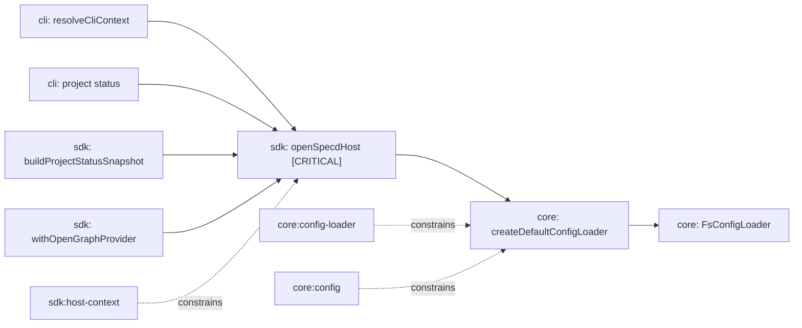

# Design: sdk-host-start-dir

## Non-goals

- Do not change `createDefaultConfigLoader` discovery or forced-mode algorithms.
- Do not add new graph-provider customization, warning plumbing, or host bootstrap outputs.
- Do not change CLI bootstrap inputs; `resolveCliContext` continues to expose `configPath` and kernel-option wiring only.
- Do not change any archive, workflow, schema, or config-loading behavior beyond exposing the already-supported discovery-root mode through `openSpecdHost`.

## Affected areas

- `openSpecdHost` in `packages/sdk/src/composition/host-context.ts`
  Change: extend `OpenSpecdHostInput` with `startDir?: string`, reject the invalid `configPath + startDir` combination, and choose loader mode in this priority order: `configPath`, `startDir`, `process.cwd()`.
  Callers: 7 direct, 58 indirect/transitive dependents · Risk: CRITICAL.
  Note: this is the central SDK bootstrap integration point used by CLI helpers and SDK orchestration, so behavior must remain backward-compatible for existing callers.

- `OpenSpecdHostInput` in `packages/sdk/src/composition/host-context.ts`
  Change: public type signature expands with a new optional field and updated JSDoc describing forced mode vs discovery-root mode.
  Callers: exposed from `packages/sdk/src/composition/index.ts` and `packages/sdk/src/index.ts` · Risk: HIGH because it is public API surface, but additive.

- `packages/sdk/test/composition/host-context.spec.ts`
  Change: add unit coverage for explicit `startDir`, mixed-input rejection, and preservation of existing `configPath` and default-cwd paths.
  Callers: local test only · Risk: LOW.

- `packages/cli/test/helpers/cli-context.spec.ts`
  Change: assert `resolveCliContext()` still calls `openSpecdHost` without `startDir`, proving CLI behavior stays unchanged after the SDK input shape expands.
  Callers: local test only · Risk: LOW.

- `packages/sdk/src/composition/index.ts` and `packages/sdk/src/index.ts`
  Change: no export-surface code changes expected, but they are affected by type propagation and should be revalidated through barrel tests.
  Callers: broad public import surface · Risk: MEDIUM, validation-only unless TypeScript export issues appear.

- `docs/sdk/index.md`
  Change: update the bootstrap example and prose to show both `configPath` and `startDir` usage, and explicitly document that callers must not provide both.
  Callers: public SDK documentation · Risk: LOW.

- `docs/core/examples/implementing-a-port.md`
  Change: add one short note that host integrators who already know a target directory can use `openSpecdHost({ startDir })` instead of reimplementing loader bootstrap around `createDefaultConfigLoader`.
  Callers: implementation guide readers · Risk: LOW.

- `resolveCliContext` in `packages/cli/src/helpers/cli-context.ts`
  Change: no production code change planned. Revalidate only.
  Callers: 57 direct, 112 importing files via CLI command and test surfaces · Risk: HIGH if behavior regresses, but the design keeps it untouched.

- `createDefaultConfigLoader` in `packages/core/src/composition/config-loader.ts`
  Change: no production code change planned unless implementation reveals a typing mismatch. Revalidate only because the spec change is contractual clarification, not algorithmic change.
  Callers: direct core/CLI/SDK bootstrap entry points · Risk: HIGH if behavior changes, so keep implementation untouched unless required by type definitions.

## Approach

Implementation is constrained to the SDK host-composition layer.

1. Update `OpenSpecdHostInput` in `packages/sdk/src/composition/host-context.ts` to:
   ```ts
   export interface OpenSpecdHostInput {
     readonly configPath?: string
     readonly startDir?: string
     readonly kernelOptions?: KernelOptions
   }
   ```
2. Add an early input validation branch at the top of `openSpecdHost`:
   - if both `input?.configPath` and `input?.startDir` are defined, throw immediately
   - do this before `createDefaultConfigLoader()` so invalid mixed input never probes VCS or filesystem state
3. Use this loader-selection contract:
   - `configPath` present: `createDefaultConfigLoader({ configPath: input.configPath })`
   - else `startDir` present: `createDefaultConfigLoader({ startDir: input.startDir })`
   - else: `createDefaultConfigLoader({ startDir: process.cwd() })`
4. Keep the rest of `openSpecdHost` unchanged:
   - `Promise.all([loader.load(), loader.resolvePath()])`
   - `createSdkContext(config, input?.kernelOptions)`
   - returned shape `{ config, configFilePath, ...ctx }`
5. Update JSDoc on `OpenSpecdHostInput` and `openSpecdHost` so the public contract states:
   - `configPath` means forced-file bootstrap
   - `startDir` means explicit discovery-root bootstrap
   - providing both is invalid
6. Add tests in `packages/sdk/test/composition/host-context.spec.ts`:
   - explicit `startDir` chooses discovery mode from that directory
   - `configPath` still chooses forced mode
   - no-input path still uses `process.cwd()`
   - mixed input throws before `createDefaultConfigLoader` is called
   - kernel-option forwarding still works
7. Add a guard test in `packages/cli/test/helpers/cli-context.spec.ts` that `resolveCliContext()` still omits `startDir` and continues to rely on CLI-owned `configPath` plus `kernelOptions`.
8. Update `docs/sdk/index.md` bootstrap examples and `docs/core/examples/implementing-a-port.md` guidance so public docs match the new host contract.

## Key decisions

**Reject mixed inputs in the SDK layer** → the ambiguity is created by the public SDK contract, not by the core loader. Validating in `openSpecdHost` keeps the failure close to the caller and avoids accidental VCS/filesystem work.
**Alternatives rejected** → silently preferring `configPath` over `startDir` would hide caller mistakes; silently preferring `startDir` would weaken the meaning of forced mode.

**Treat `startDir` as additive API, not a replacement** → existing `configPath` and `process.cwd()` callers must remain source- and behavior-compatible.
**Alternatives rejected** → replacing `configPath` with a single “root” input would collapse two distinct semantics and force downstream callers to infer whether they need forced mode or discovery mode.

**Use a plain `Error` with an actionable message for mixed inputs** → this matches common host-surface error usage in the repo and avoids inventing a new domain error for a local SDK argument-contract violation.
**Alternatives rejected** → a new `SpecdError` subtype would add unnecessary core coupling for a narrow API misuse; `TypeError` is defensible but not materially better than a plain actionable `Error` in this codebase.

**Leave core loader production code unchanged unless TypeScript requires otherwise** → the core loader already supports both `{ startDir }` and `{ configPath }`; this change is about surfacing existing capability through the SDK.
**Alternatives rejected** → editing loader internals would increase blast radius for no behavioral gain.

## Trade-offs

- [Critical bootstrap surface] → keep implementation local to `packages/sdk/src/composition/host-context.ts` and cover all three bootstrap paths with focused unit tests.
- [Public API growth] → `OpenSpecdHostInput` becomes slightly broader, mitigated by clear docs and explicit mixed-input rejection.
- [Documentation drift risk] → update `docs/sdk/index.md` and `docs/core/examples/implementing-a-port.md` in the same implementation pass.

## Spec impact

### `sdk:host-context`

- Direct dependents: none
- Transitive dependents: none
- Result: no downstream spec delta required. The only implementation-bearing symbol linked from this spec is `openSpecdHost` in `packages/sdk/src/composition/host-context.ts`.

### `core:config-loader`

- Direct dependents: none
- Transitive dependents: none
- Result: no downstream spec delta required. The change is a contract clarification for host integrators, not a loader-algorithm change.

### `core:config`

- Direct dependents reported by graph: `cli:change-run-hooks`, `code-graph:indexer`, `code-graph:workspace-integration`, `core:config-loader`, `core:run-step-hooks`
- Transitive dependents: one additional indirect layer through those specs
- Assessment:
  - `core:config-loader` remains satisfied because the loader already distinguishes `{ startDir }` and `{ configPath }`
  - `code-graph:indexer`, `code-graph:workspace-integration`, `cli:change-run-hooks`, and `core:run-step-hooks` do not rely on host bootstrap API shape; they consume resolved config and remain unaffected
- Result: no additional spec scope expansion is required.

## Dependency map



```text
┌──────────────────────────┐
│ cli: resolveCliContext   │
└─────────────┬────────────┘
              │
┌─────────────▼────────────┐       ┌──────────────────────────────┐
│ sdk: openSpecdHost       │──────▶│ core: createDefaultConfig    │
│ packages/sdk/...         │       │ Loader()                     │
│ [CRITICAL integration]   │       └─────────────┬────────────────┘
└───────┬─────────┬────────┘                     │
        │         │                              ▼
        │         │                    ┌──────────────────────────┐
        │         └───────────────────▶│ core: FsConfigLoader     │
        │                              └──────────────────────────┘
        │
        ├──────────────▶ sdk orchestration / graph helpers
        └──────────────▶ cli project-status bootstrap

sdk:host-context  ─ ─ ─ ─ ─▶  openSpecdHost
core:config-loader ─ ─ ─ ─ ─▶ createDefaultConfigLoader
core:config       ─ ─ ─ ─ ─▶ loader discovery semantics
```

## Migration / Rollback

No data migration is required.

- Forward rollout: ship the additive `startDir` input, tests, and docs together.
- Rollback: revert the SDK host-context change and the paired docs/tests. Existing callers using only `configPath` or no input are unaffected by either direction.

## Testing

### Automated tests

- `packages/sdk/test/composition/host-context.spec.ts`
  - map verify scenario “Discovery mode loads config from cwd” to the existing no-input test
  - add “Discovery mode can start from explicit startDir”
  - keep “Forced config path”
  - add “Mixed bootstrap inputs are rejected”
  - keep “Kernel options forwarded”
  - assert mixed-input rejection happens before `createDefaultConfigLoader` is invoked

- `packages/cli/test/helpers/cli-context.spec.ts`
  - add one assertion that `resolveCliContext()` still passes `kernelOptions` and does not synthesize `startDir`

- `packages/sdk/test/barrel.spec.ts`
  - run unchanged to ensure export surface remains valid after the input type update

### Manual / E2E verification

- Run `pnpm test --filter @specd/sdk`
  Expected: `host-context` and barrel tests pass with the new `startDir` path and mixed-input rejection.

- Run `pnpm test --filter @specd/cli -- cli-context`
  Expected: CLI helper tests still pass and show no change in `resolveCliContext()` behavior.

- Inspect generated typings / editor surface for `openSpecdHost`
  Expected: `OpenSpecdHostInput` exposes `configPath?`, `startDir?`, and `kernelOptions?`.

- Review `docs/sdk/index.md` and `docs/core/examples/implementing-a-port.md`
  Expected: examples show forced-file mode and explicit discovery-root mode, and they warn not to pass both together.

Global constraints check:

- Architecture: changes stay in composition and tests/docs; no domain or infrastructure rule is violated.
- Conventions: named exports only, ESM imports unchanged, no `any`, no default exports.
- Testing: use Vitest in existing spec files; keep test scope local and deterministic.
- Docs/JSDoc: update public-facing examples and JSDoc for the new input field and mixed-mode rule.

## Open questions

None.
