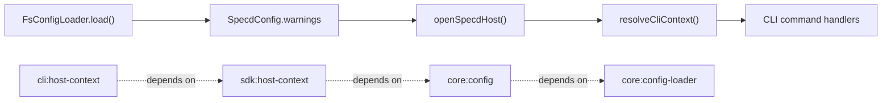

# Design: sdk-host-warning-contract

## Non-goals

- Adding a new `warnings` property to `OpenSpecdHostResult`.
- Changing how `FsConfigLoader` detects or formats configuration warnings.
- Changing warning severity from non-fatal diagnostics to errors.
- Moving warning emission responsibility from hosts into `@specd/sdk`.
- Refactoring unrelated SDK host bootstrap flows such as graph-provider composition or discovery-root semantics.

## Affected areas

- `openSpecdHost` in `packages/sdk/src/composition/host-context.ts`
  Change: keep the runtime return shape unchanged while making the warning contract explicit in code comments and tests: warnings live on `config.warnings`, not on a duplicate host-result field.
  Callers: 5 direct dependents · Risk: MEDIUM
  Note: dependents include `withOpenGraphProvider`, project-status orchestration, graph indexing orchestration, and SDK composition tests. The function is a shared host integration point, so the change must remain backward-compatible.

- `OpenSpecdHostResult` in `packages/sdk/src/composition/host-context.ts`
  Change: preserve the current interface shape and document that it is a thin bootstrap wrapper over loaded config plus `SdkHostContext`.
  Callers: coupled to `openSpecdHost` consumers · Risk: MEDIUM
  Note: type-level drift here would propagate into SDK and CLI callers immediately, so the implementation must avoid any additive `warnings` property.

- `resolveCliContext` in `packages/cli/src/helpers/cli-context.ts`
  Change: retain current warning consumption from `host.config.warnings`, make the single-emission rule explicit in implementation comments/tests, and avoid introducing any alternate warning source.
  Callers: 112 direct, 57 indirect, 5 transitive dependents across 125 files · Risk: CRITICAL
  Note: this is a high fan-in CLI bootstrap hotspot used by most configured command handlers and many command tests. The return shape must stay unchanged and warning handling must remain side-effect compatible.

- `packages/sdk/test/composition/host-context.spec.ts`
  Change: add tests proving `openSpecdHost` preserves loader-produced warnings on `config` and does not require a duplicate `warnings` field on the host result.
  Callers: test-only · Risk: LOW

- `packages/cli/test/helpers/cli-context.spec.ts`
  Change: add tests proving CLI reads bootstrap warnings from `config.warnings` and emits each warning once per `resolveCliContext` call.
  Callers: test-only · Risk: LOW

- `SpecdConfig` in `packages/core/src/application/specd-config.ts`
  Change: optional JSDoc tightening only, if needed, so the type comment matches the new contract wording: warnings are load-time non-fatal diagnostics intended for host consumption.
  Callers: broad type surface across core, SDK, CLI, and tests · Risk: LOW
  Note: the field already exists and must not change shape.

- `FsConfigLoader` in `packages/core/src/infrastructure/fs/config-loader.ts`
  Change: no behavioral rewrite. Preserve the existing warning collection pipeline and only touch comments if the implementation needs the code to state that these warnings are forwarded unchanged to hosts.
  Callers: config loading pipeline · Risk: LOW
  Note: existing tests already cover legacy warning creation and omission behavior when storage defaults are applied.

- `packages/core/test/infrastructure/fs/config-loader.spec.ts`
  Change: only if needed for clarity, extend existing tests with an assertion that warning-bearing configs still load successfully and expose the warnings on the resolved config object. If the current assertions already prove that, leave this file unchanged.
  Callers: test-only · Risk: LOW

## New constructs

No new runtime constructs are required. The change is a contract clarification plus targeted test reinforcement over existing `SpecdConfig`, `OpenSpecdHostResult`, `openSpecdHost`, and `resolveCliContext` surfaces.

## Approach

1. Keep `SpecdConfig.warnings` as the only canonical bootstrap warning surface.
   `FsConfigLoader` already produces `warnings` on the resolved config object, and `openSpecdHost` already returns that config unchanged. The implementation must preserve that path exactly.

2. Keep `OpenSpecdHostResult` as a thin wrapper.
   The host result continues to expose:
   - `config: SpecdConfig`
   - `configFilePath: string | null`
   - `kernel: Kernel`
   - `createGraphProvider: () => CodeGraphProvider`

   It must not gain:
   - `warnings`
   - `notes`
   - `diagnostics`
   - any other duplicated host-level warning collection

3. Make the SDK contract explicit without changing behavior.
   Update the JSDoc and tests around `openSpecdHost` so the code clearly states that bootstrap warnings remain attached to `config.warnings` unchanged. This satisfies the spec requirement without forcing a runtime shape change through SDK dependents.

4. Keep warning emission in the CLI host layer.
   `resolveCliContext` remains the CLI bootstrap chokepoint. It continues to iterate `host.config.warnings` after successful bootstrap and emit `console.warn(\`warning: \${warning}\`)` once per warning for that invocation. It must not:
   - mutate `config.warnings`
   - deduplicate across multiple process-wide bootstraps
   - read warnings from any non-config surface
   - move warning printing into `buildCliKernelOptions` or into SDK

5. Preserve backward compatibility for all existing callers.
   Because `resolveCliContext` is a CRITICAL hotspot and `openSpecdHost` is a shared SDK composition function, this change must be additive only in documentation/tests and neutral in public runtime shape. Existing command handlers that call `resolveCliContext` must continue to receive `{ config, configFilePath, kernel }` without changes.

6. Validate the verify scenarios through tests instead of new runtime branching.
   The desired behavior already mostly exists in code. The implementation emphasis is therefore:
   - codify the contract in source comments
   - add/adjust tests that pin it
   - avoid speculative refactors

7. Documentation update instruction.
   No `docs/` file needs to change unless a host-bootstrap API document already describes `openSpecdHost` warnings differently. During implementation, check for any user-facing docs in `docs/` that describe SDK host bootstrap warning surfaces; if one exists and suggests a separate host-result warning field, update it to say warnings come from `config.warnings`. If no such docs exist, no `docs/` edit is required. Source JSDoc in the touched files should still be aligned.

8. Global constraint compliance.
   The implementation stays within existing hexagonal boundaries:
   - domain layer gains no I/O
   - SDK remains a composition/host layer only
   - CLI remains the output boundary that performs `console.warn`
   - no `any`, no default exports, no dependency-direction changes
   - test additions remain in package-local test files

## Key decisions

**Decision**: `config.warnings` remains the canonical host-bootstrap warning surface.
**Rationale**: warnings originate during config loading and already live on `SpecdConfig`, which is the shared object returned through bootstrap.
**Alternatives rejected**: adding `OpenSpecdHostResult.warnings` duplicates state, creates source-of-truth ambiguity, and pushes a compatibility burden onto all host callers.

**Decision**: `OpenSpecdHostResult` remains a thin wrapper over loaded config plus SDK host context.
**Rationale**: the existing shape is sufficient and already used by SDK and CLI callers.
**Alternatives rejected**: evolving the wrapper into a separate diagnostics model adds semantics without solving a real runtime problem.

**Decision**: CLI remains responsible for formatting and emitting warnings.
**Rationale**: `@specd/sdk` must remain free of stdout/stderr I/O, while CLI is already the delivery boundary that owns user-visible formatting.
**Alternatives rejected**: printing inside SDK violates the host boundary; returning a second warning collection from SDK still leaves formatting responsibility unresolved.

**Decision**: implementation should prefer tests and comments over runtime refactoring.
**Rationale**: the behavior already exists, and the risk is contract drift rather than missing mechanics.
**Alternatives rejected**: refactoring bootstrap flow or introducing helper abstractions would raise risk in `resolveCliContext` without delivering new behavior.

## Trade-offs

- [CLI bootstrap hotspot] → `resolveCliContext` has CRITICAL fan-in, so even small behavioral changes could affect many commands. Mitigation: keep return shape and warning loop semantics unchanged; add focused tests instead of restructuring the function.
- [SDK contract ambiguity] → comments alone can drift if not backed by tests. Mitigation: add tests in SDK and CLI that fail if a duplicate warning surface appears or if CLI stops consuming `config.warnings`.
- [Spec wording broader than code delta] → `core:config` wording clarifies host-consumable semantics even though core behavior already exists. Mitigation: explicitly document that core runtime changes are optional and only needed if comments/tests are insufficiently clear.

## Spec impact

### `sdk:host-context`

- Direct dependents: none reported by graph spec impact.
- Transitive dependents: none reported by graph spec impact.
- Assessment: no additional spec deltas are required. The change clarifies the existing host result contract for `openSpecdHost` only.

### `cli:host-context`

- Direct dependents: graph impact reports dependent specs including `cli:graph-cli-context`, `cli:graph-hotspots`, `cli:graph-impact`, `cli:graph-search`, `public-web:api-reference`, `sdk:composition`, and `sdk:host-context`.
- Transitive dependents: 5 indirect spec dependents reported by graph impact.
- Assessment: no dependent spec requires a delta because the CLI contract remains backward-compatible. Commands continue to bootstrap through `resolveCliContext`, and no caller-visible return shape changes.

### `core:config`

- Direct dependents: `core:config-loader`
- Transitive dependents: none reported by graph spec impact.
- Assessment: no additional spec delta is required. `core:config-loader` already satisfies the clarified behavior by producing `config.warnings` during successful load.

## Dependency map



```text
┌──────────────────────────────┐
│ FsConfigLoader.load()        │
│ packages/core/.../config...  │
└──────────────┬───────────────┘
               │ produces
               ▼
┌──────────────────────────────┐
│ SpecdConfig.warnings         │
│ canonical warning surface    │
└──────────────┬───────────────┘
               │ returned unchanged
               ▼
┌──────────────────────────────┐
│ openSpecdHost()              │
│ packages/sdk/.../host-...    │
│ [MEDIUM] 5 direct dependents │
└──────────────┬───────────────┘
               │ host.config
               ▼
┌──────────────────────────────┐
│ resolveCliContext()          │
│ packages/cli/.../cli-...     │
│ [CRITICAL] 112 direct calls  │
└──────────────┬───────────────┘
               │ emits once
               ▼
┌──────────────────────────────┐
│ CLI command handlers         │
│ configured-mode commands     │
└──────────────────────────────┘

┌────────────────────┐   depends on   ┌────────────────────┐
│ cli:host-context   │─ ─ ─ ─ ─ ─ ─ ─▶│ sdk:host-context   │
└────────────────────┘                └─────────┬──────────┘
                                                │ depends on
                                                ▼
                                      ┌────────────────────┐
                                      │ core:config        │
                                      └─────────┬──────────┘
                                                │ implemented by
                                                ▼
                                      ┌────────────────────┐
                                      │ core:config-loader │
                                      └────────────────────┘
```

## Testing

**Automated tests**

- Update `packages/sdk/test/composition/host-context.spec.ts`
  - Add a scenario where the mocked loader returns a `SpecdConfig` with warnings and assert `openSpecdHost().config.warnings` matches that array unchanged.
  - Add a shape assertion that the host result exposes `config`, `configFilePath`, `kernel`, and `createGraphProvider`, with no requirement for a top-level `warnings` field.

- Update `packages/cli/test/helpers/cli-context.spec.ts`
  - Add a test where mocked `openSpecdHost` returns `config.warnings` and spy on `console.warn` to assert one emission per warning string.
  - Add a test proving `resolveCliContext` still returns `{ config, configFilePath, kernel }` while sourcing diagnostics from `config.warnings`.
  - Add a negative-path assertion that no warning is printed when `config.warnings` is `undefined` or an empty array.

- Reuse or extend `packages/core/test/infrastructure/fs/config-loader.spec.ts` only if needed
  - Existing tests already cover legacy warning production and omitted-storage no-warning behavior.
  - If implementation touches core comments or behavior, add one more assertion that warning-bearing config loads successfully and exposes `config.warnings` as a non-fatal diagnostic field.

**Manual / E2E verification**

- Run targeted tests:
  - `pnpm --filter @specd/sdk test -- host-context.spec.ts`
  - `pnpm --filter @specd/cli test -- cli-context.spec.ts`
  - If core tests change: `pnpm --filter @specd/core test -- config-loader.spec.ts`

- Run lint/tests as required by package conventions if touched files trigger broader validation requirements.

- Manual bootstrap check from the repo:
  1. Prepare a config that produces a known legacy warning.
  2. Run a CLI command that bootstraps through `resolveCliContext`, for example `node packages/cli/dist/index.js project status --format text`.
  3. Confirm the command succeeds and prints each config warning once with the `warning: ` prefix.
  4. Confirm there is no duplicated warning attributable to a second host-result diagnostics surface.

- SDK contract spot-check:
  1. Inspect `packages/sdk/src/composition/host-context.ts`.
  2. Confirm `OpenSpecdHostResult` does not declare `warnings`.
  3. Confirm `openSpecdHost` still returns the loaded `config` object directly.

## Open questions

None.
