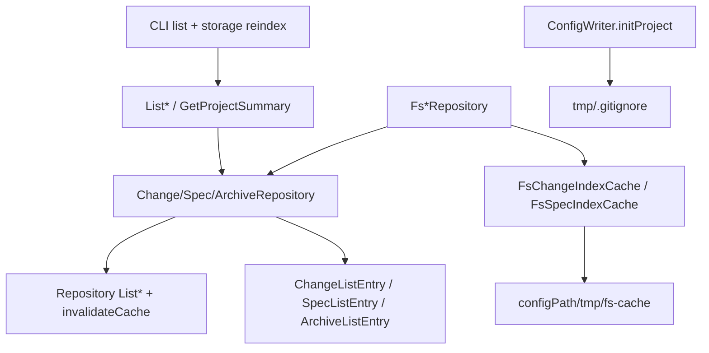
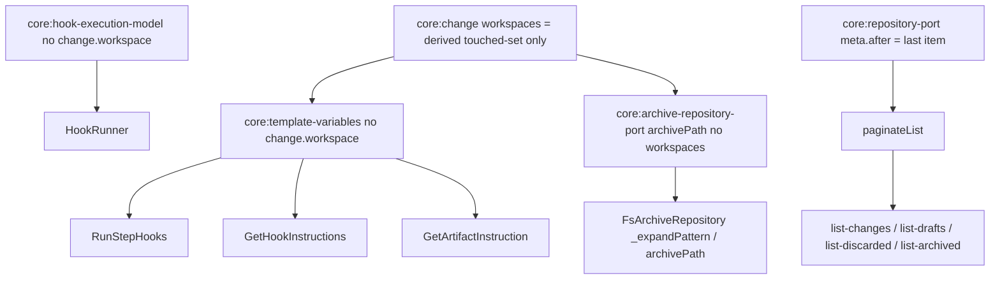

# Design: normalize-repository-caches

## Non-goals

- No retaining legacy `workspaces` on archive list rows (unused; derive from `specIds` if needed).
- No VCS-based cache freshness (`VcsAdapter` is not injected into FS repositories for index TTL).
- No dual-read of legacy archive-root indexes after migration (migrate-and-forget).
- No cross-workspace keyset pagination for `ListSpecs` in v1 (per-workspace pagination via the port; use case merges workspaces without re-sorting each bucket).
- No changing `get` / `getDraft` / `getDiscarded` / `status` / `artifact` detail contracts beyond what list projection needs.
- No user-configurable TTL (fixed 5 minutes).
- No new storage adapters beyond FS in this change.
- No caching `specs validate` results — that is a separate change; this change only normalizes list/count caches and the workspace-template fixes below.
- No new singular-workspace concept anywhere (templates, archive paths, hook variables) — only the existing plural `workspaces` derived getter is kept.

## Affected areas

### Ports (application layer) — CRITICAL signature break

- `packages/core/src/application/ports/repository.ts` (`Repository`)
  - Add `invalidateCache(): Promise<void>` default no-op.
  - Export shared `ListCursor`, `ListOptions`, `ListMeta`, `ListResult<T>`.
  - Risk: base for all repositories · HIGH.

- `packages/core/src/application/ports/change-repository.ts` (`ChangeRepository`)
  - `list` / `listDrafts` / `listDiscarded` return `ListResult<*ChangeListEntry>`; add per-bucket include options; add `count` / `countDrafts` / `countDiscarded`; add `reindex` / `reindexActive` / `reindexDrafts` / `reindexDiscarded`.
  - Callers: use cases + stubs + FS · CRITICAL (list paths previously returned full aggregates).

- `packages/core/src/application/ports/spec-repository.ts` (`SpecRepository`)
  - `list` returns `ListResult<SpecListEntry>` with includes; align `count()`; add `reindex()`.
  - Risk: HIGH — `ListSpecs` and CLI depend on it.

- `packages/core/src/application/ports/archive-repository.ts` (`ArchiveRepository`)
  - Replace `startAt` with `after`; return `ArchiveListEntry`; `reindex()` rebuilds fs-cache; `count()` from meta.
  - Risk: HIGH.

- `packages/core/src/application/ports/config-writer.ts` (`ConfigWriter`)
  - `initProject` must create `{configPath}/tmp/.gitignore`.

### Domain / shared types

- `packages/core/src/domain/archived-change-index-entry.ts` — rename public type to `ArchiveListEntry`; drop `artifacts` and legacy `workspaces` from list rows; optional `archivedBy`; remove `workspacesFromSpecIds` if unused after the field drop.
- New: change list entry types (see New constructs) — prefer `packages/core/src/domain/change-list-entry.ts` (or adjacent) exported through package public API.

### FS adapters + new helpers — CRITICAL hot path

- `packages/core/src/infrastructure/fs/change-repository.ts` (`FsChangeRepository`)
  - Delegate list/count/reindex/invalidate to `FsChangeIndexCache` per bucket; project list entries on `save`/move/delete; ensure `tmp/.gitignore` at runtime.
- `packages/core/src/infrastructure/fs/spec-repository.ts` (`FsSpecRepository`)
  - Delegate to `FsSpecIndexCache`; materialize full `SpecListEntry` payload at index time.
- `packages/core/src/infrastructure/fs/archive-repository.ts` (`FsArchiveRepository`)
  - Stop writing root `.specd-index*`; rebuild into `{configPath}/tmp/fs-cache/archive/`; orphan cleanup on rebuild only.
- New helpers under `packages/core/src/infrastructure/fs/` (e.g. `fs-change-index-cache.ts`, `fs-spec-index-cache.ts`, shared index primitives).
- Reuse existing atomic write utilities (`write-atomic.ts`) for temp+rename publish.

### Use cases

- `packages/core/src/application/use-cases/list-changes.ts` (+ drafts/discarded/archived/specs)
  - Accept list options; return `ListResult`; forward includes; **do not re-sort**.
  - Graph: `ListChanges` / `ListDrafts` · CRITICAL (~16 dependent files each including `GetProjectSummary`, kernel, SDK host-context).
- `packages/core/src/application/use-cases/get-project-summary.ts` — use `count()` / `meta.total`, never materialize full lists.
- `packages/core/src/application/use-cases/list-specs.ts` — move `SpecListEntry` ownership to port layer; stop re-resolving title/summary/status when repo returned them.

### Composition / config writer

- `packages/core/src/infrastructure/fs/config-writer.ts` (+ `composition/config-writer.ts` if needed) — create tmp gitignore on init; runtime ensure from FS repos or shared helper.
- Kernel factories unchanged in shape except types flowing through list use cases.

### CLI (`packages/cli`, owned)

- `packages/cli/src/commands/change/list.ts`
- `packages/cli/src/commands/drafts/list.ts`
- `packages/cli/src/commands/discarded/list.ts`
- `packages/cli/src/commands/archive/list.ts`
- `packages/cli/src/commands/spec/list.ts`
- New: `packages/cli/src/commands/storage/reindex.ts` (+ register under storage command group / entrypoint)
- Shared CLI helpers for pagination flag parsing and truncation hint (prefer a small shared module under `packages/cli/src/` if duplication appears).

### Test fakes / specs

- `packages/core/test/application/use-cases/helpers.ts` — `StubChangeRepository` (+ sibling stubs for spec/archive) implement new list/count/reindex/invalidate.
- Update unit/integration tests under `packages/core/test/**` and `packages/cli/test/**` for list commands and new reindex command.

### Documentation

- Update `docs/` CLI reference for list pagination/include flags and `specd storage reindex` (see Documentation below).

### Post-verify remediation (§9) — correctness fixes on top of the cache work above

These six fixes are **required** and are additive to (not a replacement for) the cache/list work above. They fix bugs and drift found while verifying the first implementation pass. Cache/list tasks 1–11 in `tasks.md` are already implemented; the items below are **not yet implemented** and need their own tasks.

- `packages/core/src/infrastructure/fs/list-pagination.ts` (`paginateList`)
  - **Bug:** current code sets `meta.after` to the **request's** `options.after` cursor (an echo) when keyset mode is used, and never sets `meta.after` in `page` mode at all. Both violate the normative contract (§9.1).
  - Fix: compute `meta.after` from the **last item actually returned** (`getCursor(items[items.length - 1])`) whenever `window.length > limit` (more items remain after this page), in **both** `page` and `after` request modes. Omit `meta.after` entirely when the returned page reaches the end of the bucket (`window.length <= limit`).
  - Risk: CRITICAL — every list port (`list-changes`, `list-drafts`, `list-discarded`, `list-archived`) delegates pagination math to this single helper, so the fix is isolated but the blast radius of _not_ fixing it is every paginated CLI/use-case caller getting an unusable (infinite-loop) `after` cursor.

- `packages/core/src/application/ports/archive-repository.ts` (`ArchivePathEntry`, `ArchiveRepository.archivePath`)
  - Current `ArchivePathEntry` requires `readonly workspaces: readonly string[]`, which `ArchiveListEntry` (this change drops `workspaces` from that type) cannot satisfy.
  - Fix: narrow `ArchivePathEntry` to `{ name: string; archivedName: string; archivedAt: Date }` — no `workspaces` field. `archivePath()` must be resolvable from those three fields alone.

- `packages/core/src/infrastructure/fs/archive-repository.ts` (`FsArchiveRepository`)
  - Constructor: add a pattern-validation check for `{{change.workspace}}` alongside the existing `{{change.scope}}` check — `throw new UnsupportedPatternError('{{change.workspace}}', ...)` at construction time.
  - `_expandPattern(name, archivedName, archivedAt, workspace)` → drop the `workspace` parameter and the `.replaceAll('{{change.workspace}}', workspace)` line entirely (3-arg signature).
  - `archive()` (create path, ~line 211) and `archivePath()` (~line 333): stop computing `change.workspaces[0] ?? 'default'` / `entry.workspaces[0] ?? 'default'` and stop passing a workspace argument to `_expandPattern`.

- `packages/core/src/application/use-cases/run-step-hooks.ts` (`RunStepHooks.execute`)
  - Two sites inject a singular workspace into the `change` template namespace: the archive-fallback branch (`archived.specIds[0]?.split(':')[0] ?? 'default'`, ~line 146) and the active-change branch (`change.workspaces[0] ?? 'default'`, ~line 199). Both MUST be removed; `variables.change` keeps only `name`, `path`, and (archive branch) `archivedName`.

- `packages/core/src/application/use-cases/get-hook-instructions.ts` (`GetHookInstructions.execute`)
  - Same pattern at ~line 81 (archive fallback) and ~line 90 (active change) — remove the `workspace` key and its derivation from both branches; narrow the local `contextVars` type accordingly (drop `workspace: string` from the inline type).

- `packages/core/src/application/use-cases/get-artifact-instruction.ts` (`GetArtifactInstruction.execute`)
  - Same pattern at ~line 123 (`change.workspaces[0] ?? 'default'`) — remove the `workspace` key from `contextVars.change`.

- **Verify-only, code already correct** (confirmed by reading current source against the spec deltas — no code change expected, only re-confirm during implementation and cover with/extend existing tests):
  - `packages/core/src/composition/use-cases/get-project-summary.ts` (`resolveGetProjectSummaryDeps`) — already resolves `{ changes, archive, listWorkspaces }` only; does not resolve `listChanges`/`listDrafts`/`listDiscarded`/`listArchived`.
  - `packages/core/src/composition/use-cases/list-specs.ts` (`resolveListSpecsDeps`) — already resolves `{ listWorkspaces }` only; does not resolve `hasher`/`yaml`.
  - `packages/cli/src/commands/spec/list.ts` — `--workspace` filtering already renders/serializes only the matched workspace names in both text and JSON/toon (`workspaceFilter` narrows `visibleWorkspaces` before building output); no stub entries for unmatched workspaces.

- **Documentation** (all files below contain literal `{{change.workspace}}` references or stale list/summary shapes that must be corrected in this change — see Documentation section for per-file detail):
  - `docs/config/config-reference.md`, `docs/config/examples/multi-repo-coordinator.md`
  - `docs/guide/workspaces.md`, `docs/guide/workflow.md`, `docs/guide/schemas.md`, `docs/guide/configuration.md`
  - `docs/schemas/schema-format.md`
  - `docs/adr/0013-workspaces-not-scopes.md`
  - `docs/core/use-cases.md`, `docs/cli/cli-reference.md` — checked for stale list/summary shapes per `default:_global/docs`; update if any drift remains after tasks 8/11 land.

## New constructs

### Shared list types — `packages/core/src/application/ports/repository.ts`

```typescript
export interface ListCursor {
  /** Sort-key value in canonical order (ISO timestamp or capability path). */
  key: string
  /** Tiebreak id when keys collide (change `name`); omit for specs. */
  id?: string
}

export interface ListOptions {
  limit?: number
  page?: number
  /** Exclusive keyset cursor. Mutually exclusive with `page`. */
  after?: ListCursor
}

export interface ListMeta {
  total: number
  count: number
  limit: number
  page?: number
  after?: ListCursor
}

export interface ListResult<T> {
  items: T[]
  meta: ListMeta
}
```

Defaults: `limit` = **100** when omitted. `page` is 1-based. `page` XOR `after`.

`Repository.invalidateCache(): Promise<void>` — default no-op; FS overrides mark helpers invalidated.

### Change list entries — `packages/core/src/domain/change-list-entry.ts`

```typescript
export interface ChangeListEntryBase {
  name: string
  createdAt: Date
  state: string
  specIds: string[]
  schemaName: string
  schemaVersion: number
  description?: string // only when includeDescription
}

export interface ActiveChangeListEntry extends ChangeListEntryBase {}

export interface DraftedChangeListEntry extends ChangeListEntryBase {
  draftedAt: Date
  draftedBy: ActorIdentity
  reason?: string // includeReason
}

export interface DiscardedChangeListEntry extends ChangeListEntryBase {
  discardedAt: Date
  discardedBy: ActorIdentity
  reason?: string // includeReason
  supersededBy?: string // includeSupersededBy
}
```

Three distinct types (not one discriminated union). History-derived fields projected when building entries.

### ArchiveListEntry — replace `ArchivedChangeIndexEntry`

```typescript
export interface ArchiveListEntry {
  name: string
  archivedName: string
  archivedAt: Date
  specIds: string[]
  schemaName: string
  schemaVersion: number
  archivedBy?: ActorIdentity // includeArchivedBy
}
```

No `artifacts` and no `workspaces` on list rows. Callers that need workspace prefixes derive them from `specIds`. Remove `workspacesFromSpecIds` when nothing else references it.

### SpecListEntry (port-level)

```typescript
export interface SpecListEntry {
  workspace: string
  path: string
  title: string
  summary?: string // includeSummary
  metadataStatus?: 'missing' | 'invalid' | 'stale' | 'fresh' // includeMetadataStatus
}
```

Title resolution at index time: metadata `title` (non-empty trimmed) else last path segment. Summary order: `optimizedDescription` → `description` → extract from `spec.md` via existing pure helper. Per-spec resolution errors swallowed with title fallback; status I/O errors → `stale`.

### Per-port list options

```typescript
export interface ActiveChangeListOptions extends ListOptions {
  includeDescription?: boolean
}
export interface DraftedChangeListOptions extends ListOptions {
  includeDescription?: boolean
  includeReason?: boolean
}
export interface DiscardedChangeListOptions extends ListOptions {
  includeDescription?: boolean
  includeReason?: boolean
  includeSupersededBy?: boolean
}
export interface SpecListOptions extends ListOptions {
  includeSummary?: boolean
  includeMetadataStatus?: boolean
}
export interface ArchiveListOptions extends ListOptions {
  includeArchivedBy?: boolean
}
```

Include flags are **response projection only** from the full indexed payload — no extra `get`/file reads.

### ChangeRepository reindex surface

```typescript
abstract reindex(): Promise<void>          // active + drafts + discarded
abstract reindexActive(): Promise<void>
abstract reindexDrafts(): Promise<void>
abstract reindexDiscarded(): Promise<void>
abstract count(): Promise<number>
abstract countDrafts(): Promise<number>
abstract countDiscarded(): Promise<number>
```

`SpecRepository.reindex()` / `ArchiveRepository.reindex()` / `count()` likewise.

### FsChangeIndexCache / FsSpecIndexCache

Location: `packages/core/src/infrastructure/fs/`.

Responsibility: own JSONL index, meta, canonical sort, list/count/reindex/invalidate, per-bucket lock via `mutate(fn)`, atomic temp+rename publish. Repositories never read/write cache files directly.

```typescript
class FsChangeIndexCache {
  constructor(opts: { bucketDir: string; sort: CanonicalSort })
  async mutate<T>(fn: () => Promise<T>): Promise<T>
  async list(options: ListOptions): Promise<ListResult<unknown>>
  async count(): Promise<number>
  async reindex(rebuild: () => AsyncIterable<IndexWireLine>): Promise<void>
  async invalidate(): Promise<void>
  async upsert(entryProjection: unknown, sourceMtime: string): Promise<void>
  async remove(id: string): Promise<void>
}

class FsSpecIndexCache {
  /* same pattern; sourceFiles freshness */
}
```

Wire line:

```typescript
{
  entry: /* public *ListEntry */,
  sourceMtime?: string, // change/archive: manifest mtime ISO
  sourceFiles?: Array<{ filename: string; mtime: string }> // specs
}
```

Meta:

```json
{ "totalCount": 123, "generatedAt": "ISO", "isInvalidated": false }
```

TTL constant: `300_000` ms (5 minutes). Freshness on list/count:

1. `isInvalidated` → rebuild
2. else mtime/presence mismatch → incremental rebuild
3. else `now - generatedAt > TTL` → regenerate
4. else serve index

Publish inside `mutate`: meta-only → temp+rename meta; jsonl-only → jsonl then meta; both → **jsonl first, then meta**; on failure discard temps. Reads unlocked.

Canonical sort (helper-owned):

| Bucket    | Key           | Direction |
| --------- | ------------- | --------- |
| active    | `createdAt`   | asc       |
| drafts    | `draftedAt`   | desc      |
| discarded | `discardedAt` | desc      |
| archive   | `archivedAt`  | desc      |
| specs     | path          | lex asc   |

Keyset `after`:

| Bucket                          | `key`                 | `id`          |
| ------------------------------- | --------------------- | ------------- |
| active/drafts/discarded/archive | ISO of sort timestamp | change `name` |
| specs                           | capability path       | omit          |

### CLI `storage reindex`

```text
specd storage reindex [--changes] [--specs] [--archive] [--format text|json|toon]
```

No flags → all. Flags combinable. Invokes port `reindex*` only (no JSONL knowledge).

## Approach

Implement in compile-safe order so the monorepo builds after each layer lands in one PR/change:

1. **Shared types + Repository base** — `List*` types, `invalidateCache`, change list entry types, `ArchiveListEntry` rename, port-level `SpecListEntry`.
2. **Port method signatures** — Change/Spec/Archive repository abstract methods (list/count/reindex). Update stubs immediately so tests compile.
3. **Index helpers** — `FsChangeIndexCache` / `FsSpecIndexCache` with mutate/lock, freshness, rebuild, upsert; unit-test helpers in isolation.
4. **Wire FS repositories** — delegate list/count/reindex; project on save/move/delete/archive; migrate archive index to fs-cache; orphan cleanup on rebuild; ensure `{configPath}/tmp/.gitignore` at runtime.
5. **Use cases** — forward options; return `ListResult`; `GetProjectSummary` uses counts; `ListSpecs` stops re-resolving when repo provides fields.
6. **ConfigWriter.initProject** — create tmp gitignore (`*` + `!.gitignore`), idempotent.
7. **CLI** — pagination + include flags on all list commands; truncation hint in text; new `storage reindex`; stop CLI re-sort; remove `--start-at` from archive list.
8. **Docs + tests** — CLI reference; expand beyond verify scenarios for helper edge cases.

### Phase: post-verify remediation (after cache/list work)

Steps 1–8 above (cache/list normalization) are already implemented — `tasks.md` items 1–11 are checked. This phase covers the six §9 fixes found during verification/compliance review of that first pass. It is a **new, self-contained phase**, sequenced after the cache work because two of its fixes (archive `archivePath`, archive pattern rejection) touch the same `FsArchiveRepository` file the cache phase already modified:

9. **Fix `paginateList` `meta.after` semantics** — `packages/core/src/infrastructure/fs/list-pagination.ts`: compute `meta.after` from the last returned item's cursor (via `getCursor`) whenever more items remain past the current window, in both `page` and `after` request modes; omit `meta.after` when the window is exhausted. Add unit tests covering: first page with remainder, last page (omitted), single-page total, and `page`-mode responses that also populate `meta.after` for forward keyset continuation.
10. **Relax `ArchivePathEntry`** — `packages/core/src/application/ports/archive-repository.ts`: drop the `workspaces` field from the type so `ArchiveListEntry` rows (which have no `workspaces`) satisfy it.
11. **Reject `{{change.workspace}}` in archive patterns** — `packages/core/src/infrastructure/fs/archive-repository.ts` constructor: add an `UnsupportedPatternError` check mirroring the existing `{{change.scope}}` check. Remove the `workspace` parameter from `_expandPattern` and the singular-workspace derivation in `archive()` and `archivePath()`.
12. **Stop singular-workspace injection at hook/template call sites** — `run-step-hooks.ts`, `get-hook-instructions.ts`, `get-artifact-instruction.ts`: remove the `workspace` key and its `workspaces[0] ?? 'default'` / `specIds[0]?.split(':')[0] ?? 'default'` derivation from every `TemplateVariables`/`contextVars` construction site. Keep `Change.workspaces` (plural getter) untouched — it is not being removed, only the singular derivation from it.
13. **Verify composition-deps and CLI `--workspace` alignment** — confirm `resolveGetProjectSummaryDeps`, `resolveListSpecsDeps`, and `cli:spec-list --workspace` JSON/toon output already match the specs (they do, per current source inspection); add/extend tests asserting the narrowed dependency shape and the filtered-workspace-only JSON output so future drift fails a test, not just a spec-compliance review.
14. **Documentation sweep** — update every file listed in the Documentation section below in the same change; grep for `{{change.workspace}}` afterward to confirm zero remaining references outside historical archive/changelog content.

Write-path index updates:

- `save` same bucket → project entry (history-derived fields) → upsert if changed.
- create/delete → upsert/remove or invalidate.
- moves between changes/drafts/discarded → update **both** buckets.
- archive → upsert archive + update/invalidate source bucket.
- `saveArtifact` / non-listing history → no list-index write required.
- specs create/delete/metadata/content affecting entry fields → upsert or invalidate.

Cache layout:

```text
{configPath}/tmp/fs-cache/
  archive/
  changes/
  drafts/
  discarded/
  specs/<workspace>/
```

Each dir: `.specd-index.jsonl` + `.specd-index-meta.json`.

## Key decisions

- **`ArchiveListEntry` drops unused `workspaces`** → field had no runtime consumers (CLI/json omit it). Rejected: keep for display convenience (redundant with `specIds`).
- **Shared `ListOptions` on repository-port** → one pagination contract. Rejected: per-port duplicated pagination types.
- **`after` replaces `startAt`** → unambiguous keyset. Rejected: keep bare name cursor.
- **Default limit 100 everywhere** → predictable memory/latency (breaking for “return all”). Rejected: unbounded default.
- **Index stores full CLI payload; includes project only** → flags never cause extra I/O. Rejected: lazy field load on include.
- **Helper owns sort** → CLI/use cases must not re-sort. Rejected: sort in CLI for display.
- **FS cache under `configPath/tmp`** → derived data out of data trees / git. Rejected: keep archive root index.
- **Freshness without VCS** → composition stays decoupled. Rejected: inject `VcsAdapter` for cache.
- **Fixed 5min TTL** → safety net after mtime checks. Rejected: configurable TTL in this change.
- **`mutate(fn)` + waiters wait** → single write path, no fail-on-contention. Rejected: lock-or-throw.
- **Four ChangeRepository reindex methods** → CLI uses aggregate; programmatic per-bucket available.
- **Orphan root index delete only on rebuild/migration** → normal list hits stay cheap.
- **`meta.after` = cursor of last returned item; omitted when exhausted** → callers can always page forward by feeding the previous response's `meta.after` into the next request, in both `page` and `after` modes. Rejected: echo the request's `options.after` back as `meta.after` (the current buggy behavior) — that yields the same page indefinitely and breaks forward pagination.
- **`{{change.workspace}}` rejected via `UnsupportedPatternError` at construction, not silently dropped** → mirrors the existing `{{change.scope}}` precedent; fails fast for misconfigured `storage.archive.pattern` instead of leaving the token unexpanded or silently falling back to `'default'`. Rejected: leave the token unexpanded (silent, produces literal `{{change.workspace}}` in paths) or keep the `workspaces[0] ?? 'default'` fallback (semantically wrong — a change has no primary workspace, so `'default'` is an arbitrary guess when `specIds` spans other workspaces).
- **Singular workspace derivation removed from all four hook/template/archive call sites, plural `Change.workspaces` getter kept** → `workspaces` remains valid for genuine "touched workspaces" needs (compile-context, display); only the anti-pattern of collapsing it to one value via `[0] ?? 'default'` is removed. Rejected: keep `[0] ?? 'default'` as a "good enough" default — it silently picks an arbitrary workspace for multi-workspace changes.
- **`ArchivePathEntry` narrowed to `{ name, archivedName, archivedAt }`** → lets lightweight `ArchiveListEntry` rows (no `workspaces` field) flow directly into `archivePath()` without synthesizing a fake `workspaces` array. Rejected: keep `workspaces` on `ArchivePathEntry` and require callers to backfill it from `specIds` just to satisfy the type.

## Trade-offs

- [Breaking default limit 100] → Callers needing full lists pass higher `--limit` / paginate; document in CLI/changelog.
- [Drafts/discarded reason opt-in] → UX change; `--reason` restores prior columns.
- [CRITICAL blast radius on list use cases] → Ship ports+FS+use cases+CLI+fakes in one change so the tree compiles.
- [No dual-read archive migration] → First list/reindex after upgrade rebuilds fs-cache; brief one-time cost.
- [Unlocked reads] → May briefly serve pre-rebuild snapshot until next freshness pass; mitigated by invalidate on known writes + TTL.

## Spec impact

Modified port specs ripple to use-case and CLI specs already in this change scope. Dependent specs not in scope (`core:drafted-change-view`, `core:discarded-change-view`, detail get paths) remain valid — detail APIs unchanged. `GetProjectSummary` / list use cases updated in-scope. **31 specs** are registered on this change, in two groups:

- **Cache/list normalization (25 specs)** — `core:repository-port`, `core:change-repository-port`, `core:spec-repository-port`, `core:archive-repository-port`, `core:change-list-entry`, `core:archived-change-index-entry`, `core:storage`, `core:fs-change-repository`, `core:fs-spec-repository`, `core:fs-archive-repository`, `core:list-changes`, `core:list-drafts`, `core:list-discarded`, `core:list-archived`, `core:list-specs`, `core:get-project-summary`, `core:config-writer-port`, `cli:change-list`, `cli:drafts-list`, `cli:discarded-list`, `cli:archive-list`, `cli:spec-list`, `cli:project-init`, `cli:storage-reindex` — already implemented (tasks 1–11).
- **Post-verify remediation, §9 (6 specs, added this review pass)** — `core:template-variables` (drop `{{change.workspace}}` token), `core:change` (clarify `workspaces` as derived-only, non-primary), `core:hook-execution-model` (drop `{{change.workspace}}` from `HookRunner` catalog), `core:run-step-hooks` / `core:get-hook-instructions` / `core:get-artifact-instruction` (stop injecting singular workspace into template variables) — the latter three deltas are folded into the existing `core:run-step-hooks`, `core:get-hook-instructions`, `core:get-artifact-instruction` spec files already in scope. `core:archive-repository-port` and `core:archived-change-index-entry` (already in the cache group above) also carry §9 deltas: `archivePath` without `workspaces`, `UnsupportedPatternError` for `{{change.workspace}}`. `default:_global/docs` carries the normative doc-alignment requirement forcing the Documentation section below.

No additional untracked dependents requiring deltas were identified beyond these 31 specs.

## Dependency map



```
┌──────────────────┐     ┌─────────────────────┐
│ CLI list /       │────▶│ List* use cases     │
│ storage reindex  │     │ GetProjectSummary   │
└──────────────────┘     └──────────┬──────────┘
                                    │
                                    ▼
                         ┌─────────────────────┐
                         │ *Repository ports   │
                         │ ListResult + count  │
                         │ reindex*            │
                         └──────────┬──────────┘
                                    │
              ┌─────────────────────┼─────────────────────┐
              ▼                     ▼                     ▼
     ┌────────────────┐   ┌────────────────┐   ┌────────────────┐
     │ FsChangeRepo   │   │ FsSpecRepo     │   │ FsArchiveRepo  │
     └───────┬────────┘   └───────┬────────┘   └───────┬────────┘
             │                    │                    │
             ▼                    ▼                    ▼
     ┌────────────────────────────────────────────────────────┐
     │ FsChangeIndexCache / FsSpecIndexCache                  │
     │ mutate+lock · sort · freshness · atomic publish        │
     └──────────────────────────┬─────────────────────────────┘
                                ▼
                     {configPath}/tmp/fs-cache/
```

### Post-verify remediation dependency chain



## Migration / Rollback

- On first `list`/`count`/`reindex` after upgrade: rebuild indexes under `tmp/fs-cache/`.
- Archive: during rebuild/migration, delete legacy archive-root `.specd-index.jsonl` / `.specd-index-meta.json` if present (ignore ENOENT); do not delete on ordinary cache hits.
- Staging/gitignore for `.staging` at archive root remains; drop obsolete index-only gitignore lines when cleaned up.
- Rollback: revert code; leftover `tmp/fs-cache/` is gitignored and safe to delete manually. Legacy root index is not recreated unless rolling back to old code which rebuilds it.
- **Breaking (intentional, post-verify):** any project with `storage.archive.pattern` configured using `{{change.workspace}}` will start throwing `UnsupportedPatternError` at startup after this change. Operators must update `specd.yaml` to use `{{change.name}}`, `{{change.archivedName}}`, or date tokens instead. No automatic migration of user config — this is a config-time break, not a data-migration concern.

## Testing

### Automated (minimum = verify scenarios)

Map verify coverage to tests:

| Area                                                                 | Test location (create/extend)                                                                                                                                                                                                                                                                                                 |
| -------------------------------------------------------------------- | ----------------------------------------------------------------------------------------------------------------------------------------------------------------------------------------------------------------------------------------------------------------------------------------------------------------------------- |
| Shared list types / invalidateCache                                  | `packages/core/test/.../repository*.spec.ts` or port unit tests                                                                                                                                                                                                                                                               |
| Change list entries projection                                       | `packages/core/test/.../change-list-entry*.spec.ts` + FS change repo tests                                                                                                                                                                                                                                                    |
| FsChangeIndexCache freshness/mutate/upsert                           | `packages/core/test/infrastructure/fs/fs-change-index-cache.spec.ts` (new)                                                                                                                                                                                                                                                    |
| FsSpecIndexCache materialization                                     | `packages/core/test/infrastructure/fs/fs-spec-index-cache.spec.ts` (new)                                                                                                                                                                                                                                                      |
| Archive migrate + orphan cleanup                                     | `packages/core/test/infrastructure/fs/archive-repository*.spec.ts`                                                                                                                                                                                                                                                            |
| List\* use cases options forwarding / no re-sort                     | existing `list-*.spec.ts` under application + composition                                                                                                                                                                                                                                                                     |
| GetProjectSummary counts                                             | `get-project-summary.spec.ts`                                                                                                                                                                                                                                                                                                 |
| ConfigWriter tmp gitignore                                           | config-writer tests                                                                                                                                                                                                                                                                                                           |
| CLI pagination/includes/hint                                         | `packages/cli/test/commands/*-list*.spec.ts`                                                                                                                                                                                                                                                                                  |
| `storage reindex` flags                                              | `packages/cli/test/commands/storage-reindex.spec.ts` (new)                                                                                                                                                                                                                                                                    |
| StubChangeRepository (and siblings)                                  | `packages/core/test/application/use-cases/helpers.ts` + consumers                                                                                                                                                                                                                                                             |
| `paginateList` `meta.after` semantics (§9.1)                         | `packages/core/test/infrastructure/fs/list-pagination.spec.ts` (new or extend) — assert `meta.after` equals the last returned item's cursor when more remain, is omitted when exhausted, and behaves identically for `page`-mode and `after`-mode requests                                                                    |
| Archive pattern rejects `{{change.workspace}}` (§9.2/§9.3)           | `packages/core/test/infrastructure/fs/archive-repository*.spec.ts` — assert construction throws `UnsupportedPatternError('{{change.workspace}}', ...)`, mirroring the existing `{{change.scope}}` test                                                                                                                        |
| `archivePath` accepts `ArchiveListEntry` without `workspaces` (§9.2) | same archive-repository test file — call `archivePath()` with a plain `{ name, archivedName, archivedAt }` object (no `workspaces` key) and assert it resolves                                                                                                                                                                |
| No singular workspace injected into template variables (§9.3)        | `packages/core/test/application/use-cases/run-step-hooks*.spec.ts`, `get-hook-instructions*.spec.ts`, `get-artifact-instruction*.spec.ts` — assert the `change` namespace passed to `TemplateExpander.expand()` never contains a `workspace` key, for both active-change and archived-change (post-archive fallback) branches |
| Composition deps narrowed (§9.4)                                     | extend `get-project-summary.spec.ts` / `list-specs.spec.ts` composition tests — assert `resolveGetProjectSummaryDeps` returns exactly `{ changes, archive, listWorkspaces }` and `resolveListSpecsDeps` returns exactly `{ listWorkspaces }` (no `hasher`/`yaml`/`list*` keys)                                                |
| `cli:spec-list --workspace` JSON/toon filtered-only (§9.5)           | extend `packages/cli/test/commands/spec-list*.spec.ts` — assert unmatched configured workspaces are absent (not empty stubs) when `--workspace` is passed                                                                                                                                                                     |

Beyond verify: concurrent `mutate` waiters, atomic publish mid-failure, TTL expiry, mtime miss incremental rebuild, include projection omits fields when flags false.

### Manual / E2E

```bash
# after implement
node packages/cli/dist/index.js changes list --format text
node packages/cli/dist/index.js drafts list --reason --limit 5
node packages/cli/dist/index.js discarded list --page 1 --limit 10
node packages/cli/dist/index.js archive list --after-key <iso> --after-id <name>
node packages/cli/dist/index.js specs list --summary --metadata-status --limit 20
node packages/cli/dist/index.js storage reindex
node packages/cli/dist/index.js storage reindex --changes --specs
# expect tmp/fs-cache populated; truncation hint when count < total
# expect .specd/tmp/.gitignore present after project init / runtime ensure
```

Lint/docs: follow `default:_global/eslint`, `default:_global/docs` (JSDoc on public ports/helpers), `default:_global/testing`.

## Documentation

### Cache/list normalization docs

Update `docs/` CLI reference (and any storage docs) to document:

- List pagination flags and default limit 100
- Include flags (especially opt-in `--reason`)
- Truncation hint behaviour
- `specd storage reindex` and flag combinations
- That list indexes live under `{configPath}/tmp/fs-cache/` (derived, gitignored)

### Post-verify remediation docs (§9.6) — remove `{{change.workspace}}`, per `default:_global/docs`

Every file below contains a literal `{{change.workspace}}` reference (confirmed by grep) and MUST be updated in this change — remove the token from variable tables/examples and, where the surrounding prose asserts a change has a "primary workspace", correct it to describe `workspaces` as the plural touched-set only:

| File                                             | What to change                                                                                                                                                                                                                 |
| ------------------------------------------------ | ------------------------------------------------------------------------------------------------------------------------------------------------------------------------------------------------------------------------------ |
| `docs/config/config-reference.md`                | Variable table row and `pattern: '{{change.workspace}}/{{change.archivedName}}'` example — remove row, change example to `{{change.name}}`-based pattern                                                                       |
| `docs/config/examples/multi-repo-coordinator.md` | Drop `{{change.workspace}}` from the "supported template variables in `run:` hooks" list                                                                                                                                       |
| `docs/guide/workspaces.md`                       | Remove the "`{{change.workspace}}` expands to the primary workspace" prose, the pattern example, and the variable table row; clarify archive pattern only supports `{{change.name}}` / `{{change.archivedName}}` / date tokens |
| `docs/guide/workflow.md`                         | Remove `{{change.workspace}}` row from the hook variable table                                                                                                                                                                 |
| `docs/guide/schemas.md`                          | Remove `{{change.workspace}}` row from the template variable table                                                                                                                                                             |
| `docs/guide/configuration.md`                    | Remove `{{change.workspace}}` from the "Available variables" list for archive pattern                                                                                                                                          |
| `docs/schemas/schema-format.md`                  | Remove `{{change.workspace}}` row from the template variable table                                                                                                                                                             |
| `docs/adr/0013-workspaces-not-scopes.md`         | Update the sentence asserting "Template variables use `{{change.workspace}}`" — either remove or replace with a note that this token was removed post-verify; keep the ADR's core decision (workspaces not scopes) intact      |
| `docs/core/use-cases.md`                         | Verify/update constructor signatures and return shapes for `GetProjectSummary`, `ListSpecs`, and the four `List*` use cases against their new `count()`/`ListResult` contracts per `default:_global/docs`                      |
| `docs/cli/cli-reference.md`                      | Verify/update list command flag tables (pagination/include flags, `storage reindex`) against the cache-normalization CLI changes; confirm no `{{change.workspace}}` example remains                                            |

After editing, re-grep the repo for `{{change.workspace}}` outside `CHANGELOG.md` / historical `specd-sdd/archive/**` entries to confirm zero remaining live references.

## Global constraints check

- Hexagonal layers respected: ports in `application/ports`, helpers in `infrastructure/fs`, use cases orchestrate only.
- ESM, named exports, no `any`, JSDoc on public APIs.
- Tests colocated under `packages/*/test` per testing conventions.
- No domain I/O; freshness/mtimes stay in infrastructure helpers.

## Open questions

None.
