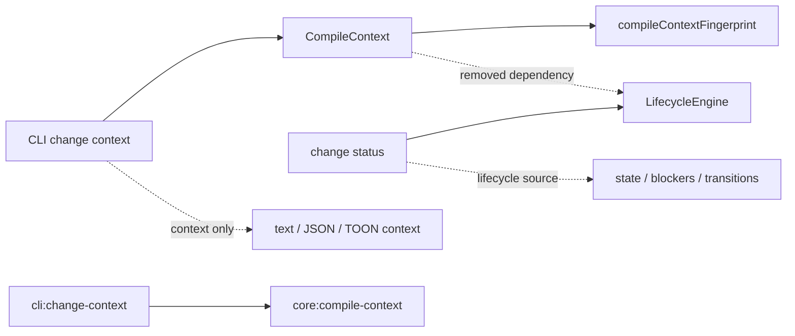

# Design: remove-lifecycle-from-change-context

## Objectives

Make `change context` a context-only API. It SHALL return project context, rendered
spec entries, context diagnostics, status, and a fingerprint, but it SHALL not
return lifecycle state, requested-step readiness, blockers, or workflow-step
availability. `change status` remains the only lifecycle-status API.

The fingerprint SHALL remain stable when only lifecycle state, readiness, or
blockers change. The positional `step` remains required and continues to select the
effective default spec sections; it affects the fingerprint only when that selection
changes emitted context.

## Non-goals

- Do not alter lifecycle transitions, `LifecycleEngine`, or `change status`.
- Do not remove `<step>` from the command signature or change its validation.
- Do not change context-spec collection, dependency traversal, metadata warnings,
  implementation-tracking refresh, output formats, or optimization behavior.
- Do not introduce feature flags, storage migrations, permissions, retries, metrics,
  or new configuration fields.

## Affected areas

- `packages/core/src/application/use-cases/compile-context.ts`
  - Remove `AvailableStep`, `stepAvailable`, `blockingArtifacts`, and
    `availableSteps` from the public result contract.
  - Remove the `LifecycleEngine` import, field, constructor parameter/default, and
    `evaluate()` projection block. Keep `input.step` solely for existing default
    section selection (`verifying`/`done` include scenarios).
  - Assemble both changed and unchanged results from context-only fields.
  - Impact: `CompileContext` is a CRITICAL graph hotspot. Prior graph analysis
    reported `compileContextFingerprint` with 6 direct, 36 indirect, and 232
    transitive dependents; modify all typed callers and tests atomically.
- `packages/core/src/application/use-cases/_shared/compile-context-fingerprint.ts`
  - Remove lifecycle fields and the `AvailableStep` type from `FingerprintInput`
    and canonical serialization. Preserve context-mode, seed/traversal flags,
    resolved section list, project context, spec entries, and context warnings.
- `packages/core/src/composition/use-cases/compile-context.ts`
  - Remove `LifecycleEngine` from `CompileContextDeps`,
    `resolveCompileContextDeps`, the explicit-dependency type guard, destructuring,
    and the `new CompileContext(...)` call. Do not remove the resolver's lifecycle
    service globally because other lifecycle use cases still own it.
- `packages/cli/src/commands/change/context.ts`
  - Update command help schema to omit lifecycle fields.
  - Remove unavailable-step stderr warning and the text-mode `## Available steps`
    renderer. Keep context warnings on stderr and all existing context rendering.
  - Structured JSON/TOON output remains a direct `CompileContextResult` projection
    with no adapter-side lifecycle derivation.
- Tests:
  - `packages/core/test/application/use-cases/compile-context.spec.ts` for the
    result shape, constructor/dependency removal, and lifecycle-only fingerprint
    stability.
  - The existing fingerprint helper test location, if present in the current tree,
    for canonical-input coverage without lifecycle fields.
  - `packages/core/test/composition/use-cases/compile-context.spec.ts` and related
    composition factory tests for the removed dependency.
  - `packages/cli/test/commands/change-context.spec.ts` for text, JSON, and
    unchanged structured output without lifecycle fields or warnings.
- Documentation:
  - `docs/guide/_sections/getting-started/context-compilation.md` SHALL describe
    `change context` as context-only and direct lifecycle queries to `change status`.
  - `docs/core/use-cases.md` SHALL update the `CompileContext` result description.

## New constructs

None. This is a contract reduction: existing types and components lose lifecycle
projection responsibilities; no replacement lifecycle abstraction is created.

## Approach

1. Reduce Core's public types first. Delete `AvailableStep` and remove lifecycle
   properties from `CompileContextResult`; retain exactly:

   ```ts
   interface CompileContextResult {
     readonly contextFingerprint: string
     readonly status: 'changed' | 'unchanged'
     readonly projectContext: readonly ProjectContextEntry[]
     readonly specs: readonly ContextSpecEntry[]
     readonly warnings: readonly ContextWarning[]
   }
   ```

2. Remove the lifecycle dependency from `CompileContext` and its composition
   factory. The use case MUST NOT call `LifecycleEngine.evaluate()` and MUST NOT log
   lifecycle availability. It still loads the change, resolves the schema, collects
   context, derives `sectionsFilter`, renders entries, and collects context warnings.

3. Compute the fingerprint after rendering context entries. Its canonical input MUST
   include only values that can change emitted context: display mode, direct-seed
   choice, dependency traversal/depth, resolved section selection, project context,
   spec entries, and warnings. It MUST exclude lifecycle state and all lifecycle
   projections. On a matching caller fingerprint, return `status: 'unchanged'` with
   empty `projectContext` and `specs`, while retaining context warnings.

4. Simplify the CLI into a projection-only adapter. Keep the refresh-before-compile
   call and runtime overrides unchanged. Remove both lifecycle warning rendering and
   available-step rendering; preserve the fingerprint-first text layout, spec modes,
   `--fingerprint` short circuit, and metadata/optimization warnings.

5. Update tests and documentation in the same change. The typed Core and SDK-facing
   contract change is intentional; consumers needing readiness must call `change
status` rather than relying on a compatibility field.

## Interfaces and behavior

`specd change context <name> <step>` keeps its current arguments and flags. For a
changed structured response, the shape is:

```ts
{
  contextFingerprint: string,
  status: 'changed',
  projectContext: ProjectContextEntry[],
  specs: ContextSpecEntry[],
  warnings: ContextWarning[],
}
```

For a matching fingerprint, `status` is `'unchanged'`; `projectContext` and `specs`
are empty arrays. No response, in text/JSON/TOON mode, contains `stepAvailable`,
`blockingArtifacts`, or `availableSteps`. A blocked or unavailable lifecycle step
does not emit a lifecycle warning from this command. Context diagnostics such as
stale metadata remain warnings on stderr.

No data storage, events, authorization rules, external services, or runtime
configuration change. The operation remains read-only except for the pre-existing
implementation-tracking refresh performed by the CLI.

## Key decisions

- **Remove lifecycle data rather than merely excluding it from the fingerprint.** A
  fingerprint must describe the complete emitted response. Keeping un-hashed
  lifecycle fields would make an `unchanged` result ambiguous.
- **Keep `<step>` in the command and Core input.** It remains a compatible command
  contract and determines default section selection; it is not a readiness query.
- **Remove the Core composition dependency on `LifecycleEngine`.** This makes the
  boundary enforceable at compile time and prevents accidental reintroduction of
  readiness into context. `LifecycleEngine` remains available to `GetStatus` and
  transition use cases.
- **Do not preserve deprecated structured fields.** The goal is one canonical
  lifecycle source; optional or undefined legacy fields would perpetuate duplicate
  behavior.

## Spec impact

### `core:compile-context`

- Its direct dependency on `core:lifecycle-engine` is removed and has been removed
  from this change's dependency declaration.
- The modified contract is consumed by `cli:change-context`, which is included in
  this change and updated concurrently.
- Other Core composition and test consumers are implementation consumers of the
  typed contract, not additional behavior specifications. No additional spec delta
  is required because lifecycle semantics remain owned by existing lifecycle/status
  specifications.

### `cli:change-context`

- It continues to depend on `core:compile-context`; no dependency is added or
  removed.
- Its command-output requirements are updated to remove only lifecycle projection;
  all context rendering requirements remain satisfied.

## Dependency map



```text
┌────────────────────┐       ┌─────────────────────┐
│ CLI change context │──────▶│ CompileContext      │──────▶┌──────────────────────────┐
└─────────┬──────────┘       └─────────┬───────────┘       │ compileContextFingerprint │
          │                            │                   └──────────────────────────┘
          │ context-only output         └─ ─ ─ removed ─ ─ ▶┌─────────────────┐
          ▼                                                  │ LifecycleEngine │
┌────────────────────┐                                      └────────┬────────┘
│ text / JSON / TOON │                                               │
└────────────────────┘                                      ┌────────▼────────┐
                                                              │ change status   │
                                                              │ state/blockers  │
                                                              └─────────────────┘

┌────────────────────┐  depends on  ┌──────────────────────┐
│ cli:change-context │─────────────▶│ core:compile-context │
└────────────────────┘              └──────────────────────┘
```

## Compatibility, failure, and rollback

This is a deliberate breaking change for structured consumers that read lifecycle
fields from `change context`. Migration is to invoke `change status` for state,
blockers, or available transitions and use `change context` only for work context.
There is no persisted-data migration. Rollback is a source rollback that restores
the removed contract and renderers; no data repair is required.

Existing error behavior remains unchanged: missing changes and schema resolution
errors retain their current exit behavior; stale metadata and missing context files
remain non-fatal context warnings. No retry, concurrency, security, or performance
behavior changes are introduced. Removing lifecycle evaluation modestly reduces the
work performed per context call.

## Testing

Automated tests SHALL cover:

- Core changed and unchanged results omit all three lifecycle fields.
- Core fingerprints remain equal across lifecycle-only change-state/blocker changes
  when project context, specs, warnings, and resolved sections are unchanged.
- Core fingerprints still change when emitted specs, warnings, traversal options,
  depth, or resolved sections change.
- Core construction and factory resolution no longer require `LifecycleEngine`.
- CLI text output has no available-steps section or lifecycle warning for unavailable
  steps; context warnings still reach stderr.
- CLI JSON and TOON output omit lifecycle fields for changed and unchanged results.
- Existing refresh-before-compile, command flags, format behavior, and fingerprint
  short-circuit tests remain green.

Manual verification:

1. Run `node packages/cli/dist/index.js changes context <change> designing --format toon`
   and confirm the response has no lifecycle fields.
2. Run `node packages/cli/dist/index.js changes status <change> --format text` and
   confirm state and blockers are still available there.
3. Capture a context fingerprint, advance or otherwise alter only lifecycle state,
   then call `changes context` with `--fingerprint <captured>`; confirm it reports
   unchanged when context content did not change.
4. Run focused Core and CLI Vitest suites, then repository lint/type checks required
   by the project scripts.

Tests MUST follow the global testing contract: Core application tests use mocked
ports; CLI tests exercise the adapter with mocked kernel dependencies. All changed
TypeScript remains ESM, uses named exports, strict typing, and JSDoc on public
contracts per the global architecture, conventions, testing, ESLint, and docs specs.

## Open questions

None.
