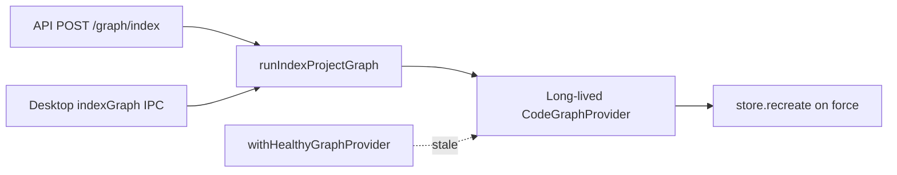

# Design: long-lived-hosts-run-index-provider

## Non-goals

- Do not modify `@specd/sdk` `runIndexProjectGraph` implementation or
  `sdk:run-index-project-graph` workspace specs (dependency only).
- Do not change CLI short-lived `withOpenGraphProvider` index path.
- Do not remove healthy stale reopen (`withHealthyGraphProvider` /
  `withGraphProvider` on `GraphProviderStaleError`).
- Do not change graph HTTP routes other than `POST /v1/graph/index` behaviour
  around provider lifecycle.
- Do not retarget desktop away from `sqlite-electron` / long-lived host model.

## Affected areas

- `packages/api/src/delivery/http/handlers/handler-graph.ts` — `POST /v1/graph/index`
  handler currently `releaseGraphProviderForIndex` → `runIndexProjectGraph` →
  `refreshGraphProvider`. Change: pass long-lived provider as `input.provider`;
  drop release/finally-refresh around index.
  Risk: MEDIUM (index route hotspot; concurrent GRAPH_BUSY already possible).

- `packages/api/src/composition/create-api-context.ts` — `ApiContext` exposes
  `releaseGraphProviderForIndex` and `refreshGraphProvider`. Change: remove
  `releaseGraphProviderForIndex` from the public context surface once unused;
  keep `refreshGraphProvider` only if still needed outside index (otherwise
  remove and rely on `withGraphProvider` stale recovery). Update JSDoc accordingly.
  Risk: LOW (API-internal; only index handler calls release today).

- `packages/api/src/composition/long-lived-graph.ts` — keep
  `refreshLongLivedGraphProvider` / `withHealthyGraphProvider` for stale recovery.
  No semantic change required if refresh remains for stale/explicit use.

- `apps/specd-studio-desktop/src/main/ipc-handlers.ts` — `indexGraph` case currently
  calls `createIndexProjectGraph().execute({ provider, … })` with manual workspace/VCS
  assembly. Change: call `runIndexProjectGraph` with
  `{ provider: host.graph.provider, force?, … }` using an `SdkHostContext`-shaped
  object from `DesktopHostContext` (`kernel` + `createGraphProvider`). Remove
  `createIndexProjectGraph` import if unused afterward.
  Risk: MEDIUM (IPC index path).

- Tests:
  - `apps/specd-studio-desktop/test/ipc-graph-provider.spec.ts` (and related desktop
    graph tests) — expect `runIndexProjectGraph` / provider passthrough; no mandatory
    host refresh after index/force.
  - API graph handler tests if present — expect no release/refresh around index.

- Docs: only if host-index wording still claims short-lived index + refresh; prefer
  aligning any Studio/API graph docs that still describe release→index→refresh
  (check `docs/` during implement; update if found).

## New constructs

_none_ — reuse existing SDK `runIndexProjectGraph`, long-lived holders, and healthy
accessors.

## Approach

1. **API index route**  
   Inside `apiHandler` for `POST /v1/graph/index`:
   - Obtain the long-lived opened provider via `ctx.withGraphProvider` (or
     `getGraphProvider` if index does not need a stale-retry wrap for the duration of
     the call — prefer `withGraphProvider` so a stale provider is recovered once before
     index starts).
   - Call `runIndexProjectGraph(ctx, { provider, ...(force ? { force: true } : {}) })`.
   - Do not call `releaseGraphProviderForIndex` or `refreshGraphProvider` in this path.
   - Map result with existing `toGraphIndexResultDto`.

2. **API context cleanup**  
   After the handler no longer calls `releaseGraphProviderForIndex`, remove that method
   from `ApiContext` and `createApiContext`. Inventory `refreshGraphProvider` callers:
   if only index used it, remove it too; if tests or other code rely on it for explicit
   refresh, keep it but document it as optional/stale-oriented, not post-index mandatory.

3. **Desktop index IPC**  
    In `indexGraph`:
   - `const host = await getHost()`.
   - Build SDK ctx: `{ kernel: host.kernel, createGraphProvider: host.createGraphProvider }`
     (structurally `SdkHostContext`).
   - `await withGraphProvider(async (provider) => runIndexProjectGraph(sdkCtx, {
  provider,
  ...(input?.force === true ? { force: true } : {}),
}))` — or pass `host.graph.provider` only if already guaranteed healthy; prefer
     healthy accessor consistency with other graph IPC.
   - Drop manual `listWorkspaces` / `buildProjectGraphConfig` / `createVcsAdapter` /
     `createIndexProjectGraph` assembly from this case (SDK owns that when using
     `runIndexProjectGraph`).

4. **Force semantics**  
   Do not add host reopen after `force: true`. Provider `index({ force: true })`
   already `store.recreate()` + updates `_storageGeneration` on the same instance.

5. **Stale**  
   Unchanged: `withHealthyGraphProvider` / desktop `withGraphProvider` reopen once on
   `GraphProviderStaleError`.

## Key decisions

- **Pass `provider` into `runIndexProjectGraph`** → matches shipped SDK contract;
  removes short-lived dual-provider race that forced API refresh.  
  **Rejected:** keep release→index→refresh — obsolete once provider can be injected.

- **No host reload after force on injected provider** → recreate is provider-owned.  
  **Rejected:** always refresh after force — would reopen unnecessarily and was
  compensating for a different provider doing recreate.

- **Remove `releaseGraphProviderForIndex`** once unused → shrinks misleading API.  
  **Rejected:** keep forever as unused escape hatch — invites regressing to short-lived
  index.

- **Desktop switches to `runIndexProjectGraph`** → one orchestration path with CLI
  assembly semantics.  
  **Rejected:** keep direct `createIndexProjectGraph` — duplicates SDK and drifts.

## Trade-offs

- **[Risk] Concurrent reads during force recreate on shared provider** → Mitigation:
  existing index lock / `GRAPH_BUSY`; recreate closes/reopens store under provider lock.
- **[Risk] DesktopHostContext vs SdkHostContext typing** → Mitigation: pass explicit
  `{ kernel, createGraphProvider }` object satisfying `SdkHostContext`.
- **[Risk] Removing refresh hides bugs if another process rotates storage** → Mitigation:
  stale reopen path remains; do not remove healthy accessor behaviour.

## Spec impact

### `api:handler-graph` / `api:composition-graph-provider` / `api:composition-create-api-context`

- Dependents outside this change: Studio client DTOs/routes unchanged; no requirement
  edits expected in `api:routes-graph` (HTTP contract same).
- `deprecate-ladybug-store` overlaps `sdk:run-index-project-graph` only — not in our
  `specIds`; no delta conflict on host specs from that change for this work.

### `studio-desktop:ipc-handler-registry` / `studio-desktop:main-kernel-lifecycle`

- Client port shapes unchanged; renderer still calls `indexGraph` via SpecdDataPort.

## Dependency map



```
┌─────────────────────┐     ┌──────────────────────────┐
│ API /graph/index    │────▶│ runIndexProjectGraph     │
└─────────────────────┘     │  provider: longLived     │
┌─────────────────────┐     └────────────┬─────────────┘
│ Desktop indexGraph  │─────────────────▶│
└─────────────────────┘                  ▼
                            ┌────────────────────────┐
                            │ Long-lived provider    │
                            │ force → recreate in    │
                            │ place; gen refreshed   │
                            └────────────┬───────────┘
                                         │ stale only
                                         ▼
                            ┌────────────────────────┐
                            │ withHealthy reopen     │
                            └────────────────────────┘
```

## Migration / Rollback

- Additive behaviour change for hosts; no schema migration.
- Rollback: restore release→refresh API path and desktop `createIndexProjectGraph`
  (not recommended once SDK provider path is standard).

## Testing

**Automated**

- Update desktop IPC/graph tests to assert index uses `runIndexProjectGraph` with
  provider and does not require host refresh after force.
- API: unit/integration coverage that index handler does not call
  `releaseGraphProviderForIndex` / post-index `refreshGraphProvider`; passes provider;
  force leaves same holder provider usable for subsequent `withGraphProvider` read.
- Map verify scenarios: injected provider index, no post-index refresh, force keeps
  instance, stale reopen still works, desktop runIndex path.
- Unit-test `withHealthyGraphProvider` (API `long-lived-graph.ts`): on
  `GraphProviderStaleError`, closes/reopens (or replaces) the held provider and
  retries once; non-stale errors propagate without refresh.

**Manual / E2E**

1. Start Studio desktop on this repo; open Code Graph; Reindex (and once with force).
2. Confirm status returns Ready with non-zero counts without restarting the app.
3. Start API (`specd serve` / studio serve); `POST /v1/graph/index` then
   `GET /v1/graph/status` — health reflects new index without server restart.
4. Confirm concurrent search during index surfaces busy/error cleanly if applicable.

**Docs**

- If any `docs/` still describe API release→index→refresh or desktop short-lived
  index, update to injected-provider semantics during implement.

## Open questions

_none_ — release helper removal and desktop `SdkHostContext` wiring resolved above.
