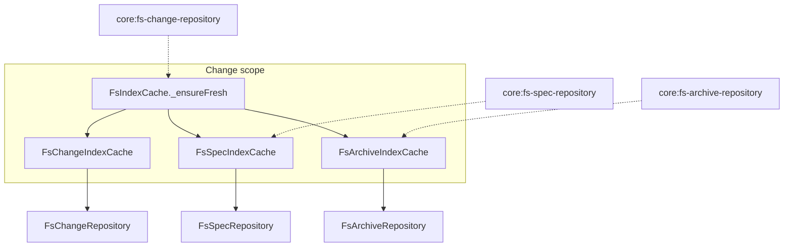

# Design: remove-fs-cache-ttl

## Non-goals

- Making TTL configurable or increasing the duration.
- Changing invalidation semantics, write-path upsert behaviour, or `generatedAt` meta field presence.
- Modifying `core:storage` (no TTL requirement exists there).
- Adding background timers or proactive cache expiry outside `list()`/`count()` freshness checks.

## Affected areas

- **`INDEX_TTL_MS`** in `packages/core/src/infrastructure/fs/fs-index-cache-base.ts`
  - Change: delete exported constant and TTL branch in `_ensureFresh()`.
  - Callers: only `_ensureFresh()` and `fs-index-cache-base.spec.ts`.
  - Risk: LOW — localized removal.

- **`FsIndexCache._ensureFresh()`** in `packages/core/src/infrastructure/fs/fs-index-cache-base.ts`
  - Change: freshness sequence becomes `invalidated → _isStale() → serve`; update class and method JSDoc (remove "TTL" references).
  - Callers: `list()`, `count()`, `sortedEntries()`, `entriesInStoreOrder()` — behaviour change only when stamps match but index is old.
  - Risk: MEDIUM — shared by all bucket helpers; mitigated by existing stamp checks.

- **`FsIndexCache` class doc comment** in same file
  - Change: remove "TTL" from freshness sequence description (line ~81).

- **`fs-index-cache-base.spec.ts`** in `packages/core/test/infrastructure/fs/fs-index-cache-base.spec.ts`
  - Change: remove `'rebuilds when TTL expires'` test and `INDEX_TTL_MS` import.
  - Add: test that list serves without rebuild when stamps match and `generatedAt` is stale (fake timers).

- **Bucket wrappers** (`FsChangeIndexCache`, `FsSpecIndexCache`, `FsArchiveIndexCache`)
  - Change: none — they delegate freshness to `FsIndexCache`.

- **Repository adapters** (`FsChangeRepository`, `FsSpecRepository`, `FsArchiveRepository`)
  - Change: none — no TTL-specific code.

## New constructs

_none_

## Approach

### Freshness sequence (final)

`FsIndexCache._ensureFresh()` MUST implement:

```
1. Read meta
2. If meta.isInvalidated → reindex() → return
3. If await _isStale(meta) → reindex() → return
4. Return (serve cached index)
```

Remove step that compared `Date.now() - Date.parse(meta.generatedAt)` against `INDEX_TTL_MS`.

### Implementation steps

1. **Delete `INDEX_TTL_MS`** — remove export; no other modules import it except the test file.

2. **Simplify `_ensureFresh()`** — after `_isStale()` returns false, return without further checks. Remove the final `if (Date.now() - ...)` block.

3. **Update documentation comments** — `_ensureFresh` private helper comment currently says "invalidated flag -> mtime mismatch -> TTL -> serve"; change to "invalidated flag -> mtime mismatch -> serve". Update class-level doc on `FsIndexCache` similarly.

4. **Tests**
   - Remove `'rebuilds when TTL expires'` from `fs-index-cache-base.spec.ts`.
   - Add `'serves from cache when stamps match regardless of generatedAt age'`:
     - Use `vi.useFakeTimers()`.
     - Upsert entry with matching mtime.
     - Advance time beyond former `INDEX_TTL_MS` (300_000 + 1 ms).
     - Call `cache.list()` — expect `rebuildCalls === 0`.

5. **No changes** to `_isStale()`, `invalidate()`, write-path upserts, or repository `invalidateCache()` overrides.

### Spec alignment

| Requirement                                       | Implementation                                       |
| ------------------------------------------------- | ---------------------------------------------------- |
| `core:fs-change-repository` Index freshness model | Two-step sequence in `_ensureFresh()`                |
| `core:fs-spec-repository` FsSpecIndexCache helper | Inherited via `FsIndexCache`; spec clarifies no TTL  |
| `core:fs-archive-repository` Archive list index   | Inherited via `FsArchiveIndexCache` → `FsIndexCache` |

## Key decisions

**Remove TTL entirely rather than increase it**

- Rationale: mtime scan on every read plus write-path maintenance covers normal and external changes; TTL only rebuilds when stamps already say fresh.
- Alternatives rejected: longer TTL (still wasteful); configurable TTL (complexity without benefit).

**Keep `generatedAt` in meta**

- Rationale: useful for debugging and future observability; only the age-based rebuild trigger is removed.
- Alternatives rejected: removing `generatedAt` (unnecessary breaking change to meta shape).

**Positive verify scenarios instead of only deleting TTL scenario**

- Rationale: explicitly lock in that old `generatedAt` with fresh stamps does NOT trigger rebuild.
- Alternatives rejected: no-op verify deltas for spec/archive (weaker contract).

## Trade-offs

- **[mtime-preserving external edits]** → Callers must use `invalidateCache()` or `specd storage reindex`; same as before minus automatic 5-minute recovery.
- **[Long-running sessions]** → Eliminates periodic no-op rebuilds every 5+ minutes during repeated list/count calls.

## Spec impact

Modified specs:

- `core:fs-change-repository` — direct freshness requirement change.
- `core:fs-spec-repository` — clarifies inherited rules.
- `core:fs-archive-repository` — clarifies inherited rules.

Dependent specs (no delta required):

- `core:storage` — references fs-cache layout and helpers but not TTL; requirements remain satisfied.
- `core:repository-port` — `invalidateCache()` unchanged.
- `cli:storage-reindex` — unchanged.

No additional specs need scope expansion.

## Dependency map



```
┌─────────────────────┐
│ FsIndexCache        │
│ _ensureFresh()      │  ← ONLY file with logic change
└──────────┬──────────┘
           │ wraps
     ┌─────┼─────┐
     ▼     ▼     ▼
┌────────┐ ┌────────┐ ┌────────┐
│ Change │ │  Spec  │ │Archive │
│ Index  │ │ Index  │ │ Index  │
│ Cache  │ │ Cache  │ │ Cache  │
└────────┘ └────────┘ └────────┘
```

## Testing

### Automated tests

| File                                                               | Change                                                          |
| ------------------------------------------------------------------ | --------------------------------------------------------------- |
| `packages/core/test/infrastructure/fs/fs-index-cache-base.spec.ts` | Remove TTL expiry test; add fresh-stamps-serve-despite-age test |

Existing repository integration tests for `invalidateCache`, mtime mismatch, and list/count remain valid — no changes expected unless they implicitly relied on TTL (none identified).

Run after implementation:

```bash
pnpm --filter @specd/core test packages/core/test/infrastructure/fs/fs-index-cache-base.spec.ts
pnpm --filter @specd/core test packages/core/test/infrastructure/fs/
```

### Manual verification

1. Create a project with active changes; run `specd changes list`.
2. Wait 6+ minutes without modifying storage.
3. Run `specd changes list` again — should be fast (no full rebuild log noise if debug logging enabled).
4. Manually edit a manifest mtime-externally or touch a spec file — next list should still reflect change via stamp mismatch.

### Lint / docs

- No public API or CLI changes — no docs update required.
- JSDoc updates in `fs-index-cache-base.ts` only.

## Open questions

_none_
